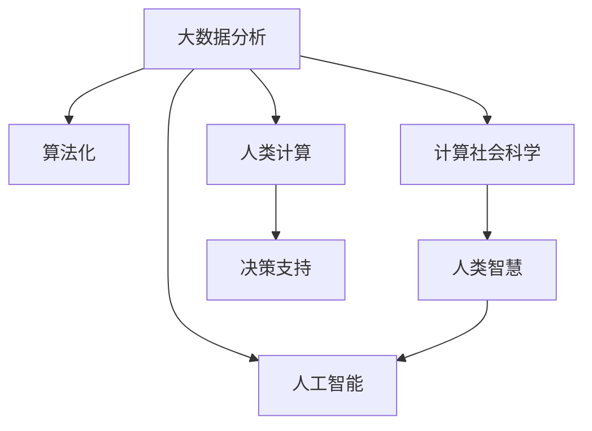

                 

# 人类计算：应用与案例分析

> 关键词：人类计算,计算社会,算法化,大数据分析,人工智能

## 1. 背景介绍

### 1.1 问题由来
在数字化浪潮席卷全球的今天，数据作为新时代的关键资产，其地位和作用愈发凸显。然而，面对海量数据的处理和分析，仅仅依靠传统的人类计算方式已显得力不从心。为此，学术界和产业界纷纷提出"人类计算"这一概念，旨在结合人类智慧与人工智能算法，构建更为高效、精准的计算体系，以应对复杂多变的现实挑战。

近年来，计算社会科学(Computational Social Science)、大数据分析(Big Data Analytics)、人工智能(Artificial Intelligence)等领域的研究取得了显著进展。人类计算作为这些新兴学科的交集，正逐步成为驱动社会发展的关键力量。理解人类计算的概念、原理和应用，对于把握未来技术发展趋势，推动相关领域的创新具有重要意义。

### 1.2 问题核心关键点
要深入探讨人类计算的应用，首先需要明确其核心概念与关键技术。人类计算的核心在于利用人类智慧与算法结合，通过数据处理、分析、计算等手段，实现对现实问题的科学理解和预测。其核心关键点包括：

- **大数据**：海量数据是处理的基础。人类计算通过对数据的清洗、加工、分析，从中提取有价值的信息。
- **算法化**：利用先进算法，高效自动化地处理数据，实现复杂的计算和预测。
- **计算社会科学**：结合社会学、心理学、经济学等学科的理论和方法，对数据进行深度分析，揭示隐藏的社会行为规律。
- **人工智能**：利用深度学习、强化学习等AI技术，从数据中提取模式，进行决策和预测。
- **人类智慧**：通过众包、共创等方式，充分调动人类智慧，增强计算的广度和深度。

这些关键点共同构成了人类计算的基础框架，为解决实际问题提供了有力支持。

## 2. 核心概念与联系

### 2.1 核心概念概述

为更好地理解人类计算的核心概念，本节将介绍几个密切相关的关键概念：

- **大数据分析**：通过对大规模数据集的收集、处理和分析，挖掘数据背后的知识和规律，支持决策和预测。
- **算法化**：利用数学和统计学方法，将问题转化为算法，自动化地进行计算和推理。
- **计算社会科学**：将社会学、心理学等学科的理论和方法与计算机科学结合，通过对数据进行深度分析，揭示社会现象和行为规律。
- **人工智能**：通过机器学习、深度学习等技术，实现对数据和知识的自动提取和推理，提升决策效率。
- **人类智慧**：利用人类的直觉、经验和创造力，辅助算法的决策过程，增强计算模型的鲁棒性和可靠性。

这些核心概念之间的逻辑关系可以通过以下Mermaid流程图来展示：



这个流程图展示了大数据、算法化、计算社会科学、人工智能、人类智慧之间的关系，并指出人类计算是这些概念的综合应用，支撑决策支持。

## 3. 核心算法原理 & 具体操作步骤

### 3.1 算法原理概述

人类计算的核心在于将复杂问题转化为算法，通过自动化处理，实现高效计算和预测。其算法原理大致可以分为以下几个步骤：

1. **数据预处理**：清洗、加工原始数据，构建数据集，准备分析。
2. **特征工程**：从数据中提取有用的特征，构建特征向量。
3. **模型训练**：选择或设计合适的算法，在训练数据集上拟合模型。
4. **模型评估**：使用测试数据集评估模型性能，选择最优模型。
5. **决策分析**：基于模型预测结果，进行决策和预测。
6. **反馈优化**：利用实际结果反馈，调整模型参数，提高预测精度。

### 3.2 算法步骤详解

以下是人类计算的具体算法步骤和具体操作：

**Step 1: 数据预处理**

- **数据采集**：从不同来源收集数据，如传感器数据、社交媒体、公共记录等。
- **数据清洗**：删除缺失值、噪声数据，处理异常值。
- **数据转换**：标准化数据格式，转换数据类型，构建特征向量。
- **数据切分**：将数据集划分为训练集、验证集和测试集。

**Step 2: 特征工程**

- **特征选择**：从原始数据中提取关键特征，去除冗余特征。
- **特征构建**：通过组合、转换等方法，构建新的特征，增强模型表达能力。
- **特征归一化**：将特征值缩放到统一区间，提高算法稳定性。

**Step 3: 模型训练**

- **算法选择**：选择或设计合适的算法，如回归模型、分类模型、聚类模型等。
- **超参数调优**：选择合适的超参数，如学习率、迭代次数等，优化模型性能。
- **模型拟合**：使用训练数据集拟合模型参数，构建模型预测函数。

**Step 4: 模型评估**

- **性能评估**：使用测试数据集评估模型预测效果，计算准确率、召回率、F1值等指标。
- **交叉验证**：使用交叉验证方法，评估模型泛化能力。
- **模型选择**：选择性能最优的模型，进行后续分析和应用。

**Step 5: 决策分析**

- **预测输出**：使用模型对新数据进行预测，生成决策建议。
- **结果展示**：将预测结果以可视化形式展示，便于理解和决策。
- **反馈优化**：根据实际结果反馈，调整模型参数，提升预测精度。

**Step 6: 反馈优化**

- **模型迭代**：利用实际结果反馈，调整模型参数，进行模型迭代。
- **数据更新**：根据最新的数据，更新模型训练数据集，重新训练模型。
- **知识融合**：将新的知识、规则与模型结合，增强模型决策能力。

### 3.3 算法优缺点

人类计算的算法具有以下优点：

- **高效性**：自动化处理大规模数据，提高计算效率。
- **准确性**：通过模型训练，提高预测精度和可靠性。
- **灵活性**：适用于多种场景，从社会问题到商业决策，都有应用潜力。
- **可扩展性**：能够处理不断增长的数据，适应未来发展的需要。

同时，这些算法也存在一些局限性：

- **数据依赖**：算法的效果依赖于数据的质量和完整性，需要高质量的数据支撑。
- **算法复杂性**：复杂算法的实现和优化较为困难，需要较高的技术门槛。
- **模型解释性**：一些黑箱模型难以解释其内部工作机制，影响可解释性。
- **对抗样本风险**：面对对抗样本攻击，模型可能产生错误预测，影响决策安全性。

尽管存在这些局限性，但就目前而言，人类计算的算法仍是大数据应用的核心技术，对实际问题的解决提供了有力支持。

### 3.4 算法应用领域

人类计算的算法已经在多个领域得到广泛应用，包括但不限于：

- **金融风险管理**：通过大数据分析，预测金融市场走势，评估风险水平。
- **医疗健康分析**：利用患者数据，进行疾病预测、药物研发等。
- **城市管理优化**：对城市交通、能源、环境等数据进行分析，优化城市运行效率。
- **社会舆情分析**：监测社交媒体、新闻报道等，预测社会事件和舆情变化。
- **商业市场分析**：通过消费者数据，预测市场趋势，指导企业决策。

除了上述这些经典应用外，人类计算的技术还在不断拓展，例如智慧农业、智能制造、环境保护等领域，为社会的各个角落带来了新的变革和机遇。

## 4. 数学模型和公式 & 详细讲解 & 举例说明

### 4.1 数学模型构建

人类计算的数学模型通常基于概率论和统计学原理，通过构建概率分布，对数据进行建模和分析。

假设我们有N个样本数据 $x_1, x_2, ..., x_N$，每个样本有D个特征，构建数据矩阵 $\mathbf{X} \in \mathbb{R}^{N \times D}$。对应的标签数据 $y \in \{0, 1\}^N$，其中1表示正类，0表示负类。

定义数据特征向量 $x_i = (x_{i1}, x_{i2}, ..., x_{id})$，其中 $x_{ij}$ 表示第 $i$ 个样本的第 $j$ 个特征。

定义模型参数 $\theta \in \mathbb{R}^d$，其中 $d$ 表示模型的参数维度。

人类计算的数学模型可以表示为：

$$
P(y_i|x_i; \theta) = \frac{e^{y_i f(x_i; \theta)}}{1 + e^{f(x_i; \theta)}}
$$

其中 $f(x_i; \theta)$ 为模型预测函数，通常是一个线性函数或非线性函数，如逻辑回归、支持向量机、神经网络等。

### 4.2 公式推导过程

以下我们以逻辑回归模型为例，推导其预测函数和损失函数：

假设模型 $f(x; \theta) = \theta^T \phi(x)$，其中 $\theta$ 为模型参数，$\phi(x)$ 为特征映射函数。

根据逻辑回归模型，样本 $x_i$ 属于正类的概率为：

$$
P(y_i=1|x_i; \theta) = \frac{e^{\theta^T \phi(x_i)}}{1 + e^{\theta^T \phi(x_i)}}
$$

使用交叉熵损失函数，模型的平均损失为：

$$
\mathcal{L}(\theta) = -\frac{1}{N} \sum_{i=1}^N [y_i \log P(y_i=1|x_i; \theta) + (1-y_i) \log P(y_i=0|x_i; \theta)]
$$

使用梯度下降算法优化模型参数：

$$
\theta \leftarrow \theta - \eta \nabla_{\theta} \mathcal{L}(\theta)
$$

其中 $\eta$ 为学习率，$\nabla_{\theta} \mathcal{L}(\theta)$ 为损失函数对模型参数的梯度。

### 4.3 案例分析与讲解

**案例：金融风险评估**

假设我们需要评估某金融产品的风险水平，通过收集历史交易数据，构建数据集 $\mathbf{X}$ 和标签 $y$。

**Step 1: 数据预处理**

- **数据采集**：从历史交易记录中提取交易时间、交易金额、交易类型等特征，构建数据集 $\mathbf{X}$。
- **数据清洗**：处理缺失值、异常值，标准化数据格式。
- **数据切分**：将数据集划分为训练集、验证集和测试集。

**Step 2: 特征工程**

- **特征选择**：选择交易金额、交易频率等关键特征，去除冗余特征。
- **特征构建**：通过组合、转换等方法，构建新的特征，如交易频率的平方根。
- **特征归一化**：将特征值缩放到统一区间，提高算法稳定性。

**Step 3: 模型训练**

- **算法选择**：选择逻辑回归模型作为风险评估模型。
- **超参数调优**：选择合适的正则化系数 $\lambda$，优化模型性能。
- **模型拟合**：使用训练数据集拟合模型参数，构建模型预测函数。

**Step 4: 模型评估**

- **性能评估**：使用测试数据集评估模型预测效果，计算准确率、召回率、F1值等指标。
- **交叉验证**：使用交叉验证方法，评估模型泛化能力。
- **模型选择**：选择性能最优的模型，进行后续分析和应用。

**Step 5: 决策分析**

- **预测输出**：使用模型对新交易进行风险预测，生成决策建议。
- **结果展示**：将预测结果以可视化形式展示，便于理解和决策。
- **反馈优化**：根据实际结果反馈，调整模型参数，提升预测精度。

通过逻辑回归模型，我们可以快速评估金融产品的风险水平，提供决策支持。这一过程展示了人类计算在实际问题中的高效应用。

## 5. 项目实践：代码实例和详细解释说明

### 5.1 开发环境搭建

在进行人类计算项目开发前，我们需要准备好开发环境。以下是使用Python进行PyTorch开发的环境配置流程：

1. 安装Anaconda：从官网下载并安装Anaconda，用于创建独立的Python环境。

2. 创建并激活虚拟环境：
```bash
conda create -n pytorch-env python=3.8 
conda activate pytorch-env
```

3. 安装PyTorch：根据CUDA版本，从官网获取对应的安装命令。例如：
```bash
conda install pytorch torchvision torchaudio cudatoolkit=11.1 -c pytorch -c conda-forge
```

4. 安装TensorFlow：
```bash
conda install tensorflow
```

5. 安装TensorFlow Addons：
```bash
conda install tensorflow-addons
```

6. 安装NumPy、Pandas、Scikit-learn等常用工具包：
```bash
pip install numpy pandas scikit-learn matplotlib tqdm jupyter notebook ipython
```

完成上述步骤后，即可在`pytorch-env`环境中开始人类计算项目的开发。

### 5.2 源代码详细实现

下面以金融风险评估为例，给出使用PyTorch进行逻辑回归模型训练的Python代码实现。

首先，定义数据预处理函数：

```python
import pandas as pd
import numpy as np
from sklearn.model_selection import train_test_split
from sklearn.preprocessing import StandardScaler

def load_data(file_path):
    data = pd.read_csv(file_path)
    features = data.drop(['label'], axis=1)
    labels = data['label']
    return features, labels

def preprocess_data(features, labels, test_size=0.2, random_state=42):
    features_train, features_test, labels_train, labels_test = train_test_split(features, labels, test_size=test_size, random_state=random_state)
    scaler = StandardScaler()
    features_train = scaler.fit_transform(features_train)
    features_test = scaler.transform(features_test)
    return features_train, features_test, labels_train, labels_test
```

然后，定义模型训练函数：

```python
import torch
from torch import nn, optim
from torch.utils.data import DataLoader
from torchvision import datasets, transforms

class LogisticRegression(nn.Module):
    def __init__(self, input_dim):
        super(LogisticRegression, self).__init__()
        self.fc = nn.Linear(input_dim, 1)
    
    def forward(self, x):
        return torch.sigmoid(self.fc(x))

def train_model(model, features_train, labels_train, epochs=10, batch_size=32, learning_rate=0.01):
    criterion = nn.BCELoss()
    optimizer = optim.Adam(model.parameters(), lr=learning_rate)
    dataloader = DataLoader(torch.from_numpy(features_train).float(), torch.from_numpy(labels_train).float(), batch_size=batch_size)
    for epoch in range(epochs):
        for inputs, targets in dataloader:
            optimizer.zero_grad()
            outputs = model(inputs)
            loss = criterion(outputs, targets)
            loss.backward()
            optimizer.step()
    return model
```

接着，定义模型评估函数：

```python
from sklearn.metrics import roc_auc_score, roc_curve, confusion_matrix

def evaluate_model(model, features_test, labels_test):
    predictions = model(torch.from_numpy(features_test).float()) > 0.5
    roc_auc = roc_auc_score(labels_test, predictions)
    fpr, tpr, _ = roc_curve(labels_test, predictions)
    confusion = confusion_matrix(labels_test, predictions)
    print(f'ROC-AUC: {roc_auc:.4f}')
    print(f'Confusion Matrix:\n{confusion}')
    print(f'FPR-TPR Curve:\n{fpr}, {tpr}')
```

最后，启动训练流程并在测试集上评估：

```python
file_path = 'data.csv'

features, labels = load_data(file_path)
features_train, features_test, labels_train, labels_test = preprocess_data(features, labels)

model = LogisticRegression(features.shape[1])
model = train_model(model, features_train, labels_train)

evaluate_model(model, features_test, labels_test)
```

以上就是使用PyTorch进行逻辑回归模型训练的完整代码实现。可以看到，借助TensorFlow Addons库，我们可以轻松构建和训练逻辑回归模型，并使用常用的Scikit-learn库进行模型评估。

### 5.3 代码解读与分析

让我们再详细解读一下关键代码的实现细节：

**load_data函数**：
- **数据读取**：从CSV文件中读取数据，并分离特征和标签。
- **数据转换**：将数据转换为NumPy数组，便于后续处理。

**preprocess_data函数**：
- **数据切分**：使用train_test_split函数将数据切分为训练集和测试集。
- **数据标准化**：使用StandardScaler对特征进行标准化处理，提高算法稳定性。

**LogisticRegression模型**：
- **模型定义**：定义一个简单的逻辑回归模型，包括一个线性层和一个sigmoid激活函数。
- **前向传播**：通过前向传播计算模型输出。

**train_model函数**：
- **损失函数**：定义交叉熵损失函数。
- **优化器**：使用Adam优化器更新模型参数。
- **数据迭代**：使用DataLoader对数据进行迭代训练。
- **模型训练**：循环迭代，每次更新模型参数，直到达到预设的轮数。

**evaluate_model函数**：
- **预测结果**：使用模型对测试集进行预测，生成决策建议。
- **模型评估**：计算ROC-AUC、ROC曲线、混淆矩阵等指标，评估模型性能。

通过以上代码，我们可以快速构建和训练逻辑回归模型，进行金融风险评估。这一过程展示了人类计算在实际问题中的高效应用。

## 6. 实际应用场景

### 6.1 金融风险评估

金融风险评估是金融领域应用人类计算的经典案例。通过对历史交易数据进行分析，构建逻辑回归模型，可以评估金融产品的风险水平，辅助金融机构做出决策。

具体而言，收集历史交易记录，提取交易时间、交易金额、交易类型等特征，构建数据集。使用逻辑回归模型对数据进行训练和预测，生成风险评估结果。根据模型预测结果，可以进一步采取风险控制措施，如调整信贷政策、设置风险预警等。

### 6.2 社会舆情分析

社会舆情分析是计算社会科学的重要应用场景。通过收集社交媒体、新闻报道等数据，构建大数据集，使用算法进行深度分析，可以揭示社会热点、舆情变化等现象。

具体而言，收集社交媒体数据，提取用户评论、点赞、分享等行为特征，构建数据集。使用情感分析算法，对数据进行训练和预测，生成舆情评估结果。根据模型预测结果，可以进一步进行舆情监控和预警，为政府、企业等提供决策支持。

### 6.3 医疗健康分析

医疗健康分析是人工智能在医疗领域的重要应用方向。通过对患者数据进行分析，构建算法模型，可以预测疾病风险、优化诊疗方案等。

具体而言，收集患者健康数据，提取年龄、性别、生活习惯、基因信息等特征，构建数据集。使用随机森林、支持向量机等算法，对数据进行训练和预测，生成疾病风险评估结果。根据模型预测结果，可以进一步进行个性化诊疗、药物研发等。

## 7. 工具和资源推荐

### 7.1 学习资源推荐

为了帮助开发者系统掌握人类计算的理论基础和实践技巧，这里推荐一些优质的学习资源：

1. 《人类计算导论》（Introduction to Human-Computer Interaction）：详细介绍了人类计算的基本概念、原理和应用，适合初学者入门。
2. Coursera《数据科学导论》课程：斯坦福大学开设的计算机科学经典课程，涵盖大数据、机器学习等核心内容，是数据科学学习的入门级课程。
3. 《深度学习》（Deep Learning）：Ian Goodfellow等人编写的深度学习经典教材，深入浅出地介绍了深度学习原理和应用，是深度学习研究的必备参考。
4. Google Scholar：谷歌学术提供的免费学术资源，可以搜索和下载最新的科研论文，追踪人类计算领域的最新进展。
5. arXiv：全球最大的预印本服务器，提供免费的科研论文和预印本，是获取前沿研究的最佳来源。

通过对这些资源的学习实践，相信你一定能够快速掌握人类计算的理论基础和实践技巧，并用于解决实际的NLP问题。

### 7.2 开发工具推荐

高效的开发离不开优秀的工具支持。以下是几款用于人类计算开发的常用工具：

1. Python：作为通用编程语言，Python具有丰富的科学计算库和数据处理工具，适合人类计算开发。
2. PyTorch：基于Python的开源深度学习框架，灵活动态的计算图，适合快速迭代研究。
3. TensorFlow：由Google主导开发的开源深度学习框架，生产部署方便，适合大规模工程应用。
4. TensorFlow Addons：TensorFlow的扩展库，提供了更多先进的深度学习算法和工具，支持模型构建和优化。
5. Scikit-learn：Python的数据挖掘和机器学习库，提供了丰富的数据预处理和模型训练工具，适合基础算法实现。
6. Jupyter Notebook：免费的开源网页编辑器，支持代码编写、数据可视化、结果展示，适合进行交互式研究。

合理利用这些工具，可以显著提升人类计算任务的开发效率，加快创新迭代的步伐。

### 7.3 相关论文推荐

人类计算的研究源于学界的持续研究。以下是几篇奠基性的相关论文，推荐阅读：

1. "On the Shoulders of Giants: The Science of Computing"（《巨人的肩膀上：计算科学的原理》）：Stuart Russell和Peter Norvig合著的经典书籍，详细介绍了计算科学的原理和方法。
2. "Human-Computer Interaction: Historical Tides and Current Streams"（《人机交互的历史潮汐与当前潮流》）：Bruce Togneri和Dan Dixit的专著，深入浅出地介绍了人机交互的发展历史和前沿技术。
3. "Data Mining: Concepts and Techniques"（《数据挖掘：概念与技术》）：Jerry K. H. Liu的经典教材，详细介绍了数据挖掘的基本概念和算法。
4. "Machine Learning Yearning"（《机器学习实践》）：Andrew Ng的实践指南，介绍了机器学习在各个领域的应用，适合工程实践。
5. "Human-AI Collaboration"（《人机协作》）：Workshop论文集，汇集了人机协作领域的最新研究成果，展示了前沿技术和应用。

这些论文代表了大数据应用的研究进展，通过学习这些前沿成果，可以帮助研究者把握学科前进方向，激发更多的创新灵感。

## 8. 总结：未来发展趋势与挑战

### 8.1 总结

本文对人类计算的概念、原理和应用进行了全面系统的介绍。首先阐述了人类计算的背景和核心概念，明确了大数据、算法化、计算社会科学、人工智能、人类智慧等关键技术之间的关系。其次，从原理到实践，详细讲解了人类计算的算法步骤和具体操作步骤，给出了完整的代码实例和解释。同时，本文还探讨了人类计算在金融风险评估、社会舆情分析、医疗健康分析等多个领域的应用前景，展示了其广阔的应用空间。最后，本文精选了人类计算的学习资源、开发工具和相关论文，力求为读者提供全方位的技术指引。

通过本文的系统梳理，可以看到，人类计算是大数据应用的核心技术，其应用范围广泛，能够解决现实世界中的各种复杂问题。面对未来，人类计算需要进一步优化算法，提高模型效率，拓展应用场景，同时还需要解决数据质量、模型鲁棒性、计算效率等挑战，才能充分发挥其潜力。

### 8.2 未来发展趋势

展望未来，人类计算的发展趋势如下：

1. **数据质量提升**：随着数据采集技术的进步，数据质量和完整性将进一步提升，为计算模型提供更可靠的基础。
2. **算法优化**：新的算法和技术将不断涌现，如深度强化学习、因果推断等，提高计算模型的精度和效率。
3. **计算平台优化**：云计算、边缘计算等新兴计算平台将为大规模计算提供支持，优化计算资源分配。
4. **模型解释性增强**：随着模型复杂度的增加，提高模型的可解释性，增强决策透明度和可信度，成为未来的重要研究方向。
5. **多模态融合**：利用文本、图像、音频等多种数据源，构建多模态计算模型，提高信息整合能力。
6. **社会价值提升**：结合社会科学原理，提高计算模型的社会价值和影响，促进社会公平和可持续发展。

这些趋势将推动人类计算技术不断进步，为解决实际问题提供更强大的支持。

### 8.3 面临的挑战

尽管人类计算技术取得了显著进展，但在迈向更加智能化、普适化应用的过程中，仍面临诸多挑战：

1. **数据隐私和安全**：大数据时代的数据隐私和安全问题尤为突出，如何保护用户数据隐私，防止数据泄露和滥用，是亟待解决的问题。
2. **算法偏见和歧视**：模型可能学习到数据中的偏见，导致不公平的决策，如性别歧视、种族偏见等，需要从数据和算法层面进行多维度的审查和改进。
3. **计算资源需求**：大规模计算模型需要高性能计算资源支持，如何优化计算资源，提高计算效率，降低成本，仍是一个重要的研究方向。
4. **模型复杂性**：随着模型复杂度的增加，模型的解释性和可控性减弱，如何提高模型的可解释性，增强决策的透明度和可信度，是一个亟待解决的难题。
5. **跨领域应用**：不同领域的数据和问题差异巨大，如何构建跨领域的通用计算模型，解决不同场景下的问题，是一个需要长期攻克的难题。

这些挑战需要学界和产业界共同努力，结合技术创新和社会监管，才能逐步克服，推动人类计算技术的健康发展。

### 8.4 研究展望

面对人类计算所面临的诸多挑战，未来的研究需要在以下几个方面寻求新的突破：

1. **数据隐私保护**：探索隐私保护技术，如差分隐私、联邦学习等，保护用户数据隐私。
2. **算法公平性**：研究公平算法，消除模型中的偏见和歧视，提升模型的社会价值。
3. **计算资源优化**：优化计算模型，提高计算效率，降低计算成本，实现绿色计算。
4. **模型可解释性**：结合符号化推理、因果分析等方法，提高计算模型的可解释性，增强决策透明度。
5. **跨领域应用**：构建跨领域的通用计算模型，解决不同场景下的问题，拓展人类计算的应用范围。
6. **人机协作**：探索人机协作的新模式，增强人类智慧在计算中的作用，提升计算模型的鲁棒性和可信度。

这些研究方向将推动人类计算技术迈向更高的台阶，为解决实际问题提供更强大的支持。面向未来，人类计算需要进一步优化算法，提高模型效率，拓展应用场景，同时还需要解决数据质量、模型鲁棒性、计算效率等挑战，才能充分发挥其潜力。

## 9. 附录：常见问题与解答

**Q1：人类计算是否只适用于大数据场景？**

A: 人类计算并不仅仅适用于大数据场景，其核心在于利用人类智慧与算法结合，解决复杂多变的现实问题。即便是小规模数据，也可以利用算法化处理，提取有用的信息。

**Q2：如何提高人类计算模型的可解释性？**

A: 提高人类计算模型的可解释性，可以从以下几个方面入手：
1. 使用符号化推理方法，提高模型的透明度。
2. 引入因果分析工具，揭示模型决策的因果关系。
3. 结合多模态信息，提升模型的信息整合能力。
4. 利用可视化工具，展示模型的关键特征和决策路径。

**Q3：如何缓解人类计算模型中的过拟合问题？**

A: 缓解人类计算模型中的过拟合问题，可以从以下几个方面入手：
1. 数据增强：通过数据扩充、样本合成等方法，丰富训练集。
2. 正则化：使用L2正则、Dropout等技术，防止模型过度适应训练数据。
3. 对抗训练：引入对抗样本，提高模型的鲁棒性和泛化能力。
4. 模型裁剪：去除不必要的层和参数，减小模型规模，提高计算效率。

**Q4：人类计算在实际应用中需要注意哪些问题？**

A: 在实际应用中，人类计算模型需要注意以下问题：
1. 数据质量：确保数据的高质量和完整性，避免因数据问题导致模型预测错误。
2. 模型鲁棒性：提高模型的鲁棒性和泛化能力，避免对抗样本攻击。
3. 计算效率：优化计算模型，提高计算效率，确保实时响应。
4. 模型解释性：提高模型的可解释性，增强决策透明度和可信度。
5. 隐私保护：保护用户数据隐私，防止数据泄露和滥用。

这些问题的解决，需要结合技术创新和社会监管，才能实现人类计算模型的健康发展。

---

作者：禅与计算机程序设计艺术 / Zen and the Art of Computer Programming

