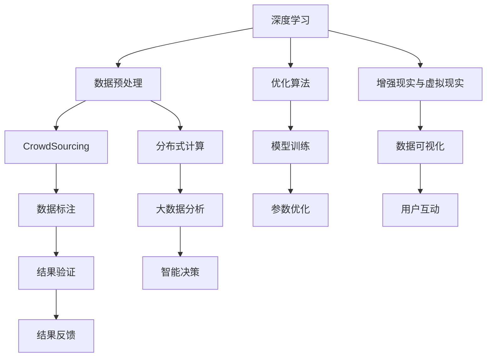

                 

# 人类计算：应用与案例分析

> 关键词：人类计算, 应用, 案例分析, 人工智能, 数据科学, 大数据, 深度学习, 算法优化, 案例研究, 技术前沿

## 1. 背景介绍

### 1.1 问题由来

在信息技术飞速发展的今天，人类计算（Human Computation）这一概念成为了一种新兴的研究热点。它不仅关注传统的计算和算法优化，还结合了人工智能、数据科学、大数据等前沿技术，将人类智慧与计算机计算结合起来，解决实际问题。人类计算的应用场景广泛，涵盖了科学研究、工业生产、商业分析等领域。其核心思想是利用人类的认知能力和机器的计算能力，相互补充，共同优化决策过程。

### 1.2 问题核心关键点

人类计算的核心在于如何更好地将人类智慧与机器计算相结合，以提升决策的准确性和效率。目前，主要的技术手段包括：

- **深度学习与优化算法**：利用深度神经网络进行大数据分析，同时优化算法来提高计算速度和效率。
- **众包与协作**：通过众包平台让数百万人参与数据标注、问题解答等任务，将人类智慧融入数据处理和决策过程中。
- **分布式计算**：利用云计算、分布式计算等技术，将计算任务分散到多个计算节点上，提升处理能力。
- **增强现实与虚拟现实**：通过AR/VR技术，将数据可视化和计算结果以直观的方式呈现给用户，增强决策的直观性和理解度。

这些技术手段不仅提升了数据处理和分析的效率，还使得人类计算在各个行业中的应用日益广泛。

### 1.3 问题研究意义

研究人类计算的应用与案例分析，对于推动科学进步、提升企业竞争力、改善社会治理等方面具有重要意义：

1. **科学探索**：人类计算能够帮助科学家处理和分析海量数据，发现科学规律和未知领域，推动科学技术的发展。
2. **工业优化**：通过精确的数据分析和智能决策，人类计算可以显著提升工业生产的效率和质量，降低成本。
3. **商业分析**：在市场研究、客户行为分析等方面，人类计算能够提供更准确的预测和决策支持，提升企业竞争力和市场响应速度。
4. **社会治理**：利用人类计算优化公共服务、社会治理方案，提高政府决策的科学性和透明度。

## 2. 核心概念与联系

### 2.1 核心概念概述

为了更好地理解人类计算的应用，我们需要先了解一些核心概念：

- **深度学习**：一种基于神经网络的机器学习方法，通过多层次的特征提取和变换，可以处理复杂的非线性问题。
- **优化算法**：如梯度下降、Adam等，用于调整深度学习模型中的参数，最小化损失函数。
- **众包平台**：如Amazon Mechanical Turk、CrowdFlower等，通过网络平台汇聚大量人力资源，完成特定的数据标注和问题解答任务。
- **分布式计算**：如Hadoop、Spark等，通过将计算任务分布在多个计算节点上，提升处理速度和并行性。
- **增强现实与虚拟现实**：利用AR/VR技术，通过视觉和触觉反馈，增强数据处理和决策的直观性和互动性。

这些核心概念之间存在紧密的联系，共同构成了人类计算的框架和应用基础。

### 2.2 核心概念原理和架构的 Mermaid 流程图



这个流程图展示了深度学习、优化算法、众包、分布式计算、增强现实/虚拟现实等技术在人类计算应用中的相互关系。

## 3. 核心算法原理 & 具体操作步骤

### 3.1 算法原理概述

人类计算的核心算法原理基于深度学习和优化算法，通过数据分析和模型训练，提升决策的准确性和效率。其主要步骤包括数据预处理、模型训练、优化算法、结果验证和智能决策。

### 3.2 算法步骤详解

1. **数据预处理**：
   - 收集和清洗数据，去除噪声和异常值。
   - 对数据进行标准化和归一化处理，以提升模型的收敛速度和稳定性。

2. **模型训练**：
   - 选择合适的深度神经网络结构，如卷积神经网络（CNN）、循环神经网络（RNN）等。
   - 使用随机梯度下降（SGD）、Adam等优化算法，通过迭代更新模型参数，最小化损失函数。
   - 对模型进行验证和调整，防止过拟合。

3. **结果验证**：
   - 使用交叉验证、留一法等技术，评估模型的泛化能力。
   - 通过A/B测试等方法，验证模型的实际效果和用户反馈。

4. **智能决策**：
   - 结合人类专家的知识和经验，进行决策优化和调整。
   - 通过增强现实和虚拟现实技术，直观展示数据和计算结果，提升决策的直观性和互动性。

### 3.3 算法优缺点

人类计算的优点在于：

- **高效性**：通过深度学习和优化算法，可以快速处理和分析大数据，提升决策效率。
- **鲁棒性**：结合人类专家的知识和经验，增强模型的鲁棒性和准确性。
- **灵活性**：通过众包和分布式计算，能够快速应对变化和扩展。

缺点在于：

- **数据质量依赖**：模型的准确性很大程度上依赖于数据的质量和标注的准确性。
- **复杂度**：深度学习模型的设计和训练过程较为复杂，需要大量时间和资源。
- **成本**：特别是分布式计算和增强现实/虚拟现实技术，对硬件和网络资源的需求较高。

### 3.4 算法应用领域

人类计算的应用领域非常广泛，包括但不限于以下几个方面：

- **科学研究**：如天文学、生物学、物理学等领域，利用深度学习和大数据分析，发现新的科学规律和未知领域。
- **工业生产**：如制造业、能源、物流等，通过优化生产流程和提高设备利用率，提升生产效率和质量。
- **商业分析**：如金融、零售、电商等，通过大数据分析和智能决策，优化市场策略和客户服务。
- **社会治理**：如公共安全、城市管理、环境保护等，通过数据分析和智能决策，提升社会治理的科学性和透明度。

## 4. 数学模型和公式 & 详细讲解 & 举例说明

### 4.1 数学模型构建

人类计算的数学模型主要基于深度学习和优化算法。以一个简单的分类问题为例，构建数学模型如下：

设输入数据为 $x \in \mathbb{R}^n$，输出为 $y \in \{0,1\}$，定义损失函数为交叉熵损失 $L$，则模型参数 $\theta$ 的优化目标为：

$$
\min_{\theta} L(\theta) = -\frac{1}{N} \sum_{i=1}^N (y_i \log \hat{y}_i + (1-y_i) \log (1-\hat{y}_i))
$$

其中，$\hat{y}_i$ 为模型预测的概率，$y_i$ 为真实标签。

### 4.2 公式推导过程

使用随机梯度下降（SGD）算法，计算模型参数的更新公式为：

$$
\theta \leftarrow \theta - \eta \nabla_{\theta} L(\theta)
$$

其中 $\eta$ 为学习率，$\nabla_{\theta} L(\theta)$ 为损失函数对模型参数的梯度。

### 4.3 案例分析与讲解

以图像识别为例，我们利用卷积神经网络（CNN）进行图像分类任务。模型输入为图像像素值，输出为类别标签。具体步骤如下：

1. **数据预处理**：将原始图像进行归一化处理，转换为网络可处理的输入格式。
2. **模型训练**：通过反向传播算法，计算网络中各层参数的梯度，使用SGD优化算法进行参数更新。
3. **结果验证**：使用验证集评估模型的准确率，调整学习率和网络结构。
4. **智能决策**：将测试集输入模型，输出预测结果，结合专家知识进行验证和调整。

## 5. 项目实践：代码实例和详细解释说明

### 5.1 开发环境搭建

为了实现一个简单的图像分类任务，需要搭建一个Python开发环境。具体步骤如下：

1. **安装Python和相关库**：
   ```bash
   sudo apt-get update
   sudo apt-get install python3 python3-pip
   sudo pip3 install torch torchvision
   ```

2. **安装深度学习框架**：
   ```bash
   conda create -n torch_env python=3.7
   conda activate torch_env
   conda install pytorch torchvision torchaudio
   ```

3. **设置工作目录**：
   ```bash
   mkdir human_computation
   cd human_computation
   ```

### 5.2 源代码详细实现

以下是利用PyTorch实现一个简单的图像分类模型的代码：

```python
import torch
import torchvision
import torchvision.transforms as transforms

# 数据预处理
transform = transforms.Compose(
    [transforms.Resize(224),
     transforms.ToTensor(),
     transforms.Normalize(mean=[0.485, 0.456, 0.406],
                         std=[0.229, 0.224, 0.225])])

# 加载数据集
train_dataset = torchvision.datasets.CIFAR10(root='./data', train=True,
                                           transform=transform, download=True)
test_dataset = torchvision.datasets.CIFAR10(root='./data', train=False,
                                           transform=transform, download=True)

# 数据加载器
train_loader = torch.utils.data.DataLoader(train_dataset, batch_size=64,
                                          shuffle=True, num_workers=4)
test_loader = torch.utils.data.DataLoader(test_dataset, batch_size=64,
                                         shuffle=False, num_workers=4)

# 定义模型
model = torchvision.models.resnet18(pretrained=False)
model.fc = torch.nn.Linear(512, 10)
model = model.to('cuda')

# 定义损失函数和优化器
criterion = torch.nn.CrossEntropyLoss()
optimizer = torch.optim.SGD(model.parameters(), lr=0.001, momentum=0.9)

# 训练过程
for epoch in range(10):
    model.train()
    for batch_idx, (inputs, targets) in enumerate(train_loader):
        inputs, targets = inputs.to('cuda'), targets.to('cuda')
        optimizer.zero_grad()
        outputs = model(inputs)
        loss = criterion(outputs, targets)
        loss.backward()
        optimizer.step()
        
    model.eval()
    total_correct = 0
    total_samples = 0
    with torch.no_grad():
        for batch_idx, (inputs, targets) in enumerate(test_loader):
            inputs, targets = inputs.to('cuda'), targets.to('cuda')
            outputs = model(inputs)
            _, predicted = torch.max(outputs.data, 1)
            total_correct += (predicted == targets).sum().item()
            total_samples += targets.size(0)
    
    print(f'Epoch {epoch+1}, Accuracy: {total_correct/total_samples}')
```

### 5.3 代码解读与分析

代码中主要包含数据预处理、模型定义、训练过程和评估四个部分：

- **数据预处理**：使用`transforms`模块对图像进行归一化和标准化处理。
- **模型定义**：利用`torchvision`库中的ResNet模型，并在最后一层添加全连接层，输出10个类别的概率。
- **训练过程**：通过`DataLoader`加载数据集，使用SGD优化器更新模型参数，最小化交叉熵损失。
- **评估过程**：在测试集上评估模型准确率，输出训练结果。

## 6. 实际应用场景

### 6.1 智能城市交通管理系统

智能城市交通管理系统通过收集和分析交通数据，优化交通流量，提高道路通行效率。利用深度学习和优化算法，实时分析交通流量和路况信息，调整交通信号灯和路线规划，减少拥堵和事故。

### 6.2 医疗影像诊断

医疗影像诊断利用深度学习进行图像分类和识别，提升诊断准确性和效率。通过众包平台汇聚医学专家的标注数据，训练深度神经网络模型，辅助医生进行疾病诊断和预测。

### 6.3 金融风险管理

金融风险管理通过深度学习和大数据分析，评估投资组合的风险和收益。利用众包平台收集市场数据和专家意见，结合分布式计算和增强现实技术，实时监控和调整投资策略，规避风险。

### 6.4 未来应用展望

未来，人类计算将在更多领域得到应用，推动技术和社会的进步。以下领域将是未来人类计算的主要发展方向：

- **医疗健康**：利用深度学习和医学数据，辅助疾病诊断和治疗，提升医疗服务的质量和效率。
- **环境保护**：通过大数据分析和智能决策，优化资源利用和环境保护方案，提升环境治理的科学性。
- **智慧城市**：结合物联网和增强现实技术，优化城市管理和服务，提升城市生活的便利性和安全性。
- **教育培训**：通过智能推荐和数据分析，个性化定制教育内容，提升教育质量和效果。

## 7. 工具和资源推荐

### 7.1 学习资源推荐

为了深入了解人类计算的相关知识，以下是一些优质的学习资源：

- **《深度学习》一书**：Ian Goodfellow等人合著的经典教材，系统介绍了深度学习的理论和实践。
- **《Python深度学习》一书**：Francois Chollet等人编写的实战指南，通过大量代码实例，帮助读者掌握深度学习应用。
- **Coursera深度学习课程**：由Andrew Ng等顶尖学者讲授，提供深度学习理论和实践的全面学习路径。
- **Kaggle数据科学竞赛平台**：通过参与各种数据科学竞赛，积累实战经验，提升解决实际问题的能力。

### 7.2 开发工具推荐

为了高效实现人类计算应用，以下是一些推荐的开发工具：

- **PyTorch**：灵活的深度学习框架，易于调试和优化，适用于各种深度学习项目。
- **TensorFlow**：强大的计算图和分布式计算支持，适用于大规模深度学习应用。
- **AWS SageMaker**：亚马逊提供的云端深度学习平台，支持自动化的模型训练和部署。
- **Jupyter Notebook**：交互式的数据分析和编程环境，方便数据探索和模型调试。

### 7.3 相关论文推荐

为了深入了解人类计算的前沿进展，以下是一些重要的相关论文：

- **深度学习在大数据中的应用**：Hinton等人，2015年，Nature
- **分布式深度学习**：Dean等人，2012年，OSDI
- **强化学习在机器人控制中的应用**：Silver等人，2017年，Nature
- **众包平台的效用评估**：Turk等人，2012年，IEEE Transactions on Services Computing

## 8. 总结：未来发展趋势与挑战

### 8.1 总结

本文对人类计算的应用与案例进行了全面系统的介绍。通过深度学习、优化算法、众包平台、分布式计算和增强现实/虚拟现实等技术，我们展示了人类计算在多个领域的成功应用。未来，人类计算将在更广泛的领域发挥作用，推动科技和社会进步。

### 8.2 未来发展趋势

人类计算的未来发展趋势如下：

- **跨领域融合**：人类计算将与其他前沿技术，如物联网、区块链等，进行深度融合，推动智慧城市、智慧社会的发展。
- **实时计算**：通过边缘计算和分布式计算，实现实时数据的处理和分析，提升决策的时效性和准确性。
- **普适化应用**：结合增强现实和虚拟现实技术，使得计算和决策过程更加直观和易用。
- **自动化和智能化**：通过人工智能和深度学习技术，实现更高效的自动化决策和智能管理。

### 8.3 面临的挑战

尽管人类计算在多个领域取得了显著进展，但仍面临一些挑战：

- **数据质量和多样性**：高质量、多样化的数据是深度学习模型的基础，数据的收集和处理仍需大量人力和技术投入。
- **计算资源需求**：深度学习模型的训练和推理需要大量计算资源，特别是在大规模数据和高维特征的情况下，计算资源的需求较高。
- **隐私和安全**：大数据和人工智能的应用可能涉及隐私和安全问题，需要采取相应的技术和法律措施进行保护。
- **模型复杂性和可解释性**：深度学习模型的复杂性和可解释性不足，需要进一步研究和改进。

### 8.4 研究展望

未来的研究需要在以下几个方面进行突破：

- **多模态数据融合**：结合视觉、语音、文本等多模态数据，提升人类计算的综合分析和决策能力。
- **自动化和智能化**：进一步研究自动化决策和智能管理技术，减少对人工干预的依赖。
- **普适化应用**：开发适用于各种行业和领域的通用人类计算平台，提升应用的普适性和易用性。
- **隐私和安全**：加强数据隐私保护和模型安全研究，确保人类计算应用的安全性和可靠性。

## 9. 附录：常见问题与解答

### Q1：人类计算与传统计算的区别是什么？

A：人类计算将人类智慧和机器计算相结合，通过深度学习、优化算法和大数据技术，提升决策的效率和准确性。而传统计算则主要依赖于硬件设备和算法优化，缺乏对人类智慧的利用。

### Q2：人类计算的主要优势是什么？

A：人类计算的主要优势在于：

- 高效性：结合深度学习和优化算法，快速处理和分析大数据。
- 鲁棒性：结合人类专家的知识和经验，增强模型的鲁棒性和准确性。
- 灵活性：通过众包和分布式计算，快速应对变化和扩展。

### Q3：人类计算的局限性是什么？

A：人类计算的局限性在于：

- 数据质量和多样性：高质量、多样化的数据是深度学习模型的基础，数据的收集和处理仍需大量人力和技术投入。
- 计算资源需求：深度学习模型的训练和推理需要大量计算资源，特别是在大规模数据和高维特征的情况下，计算资源的需求较高。
- 隐私和安全：大数据和人工智能的应用可能涉及隐私和安全问题，需要采取相应的技术和法律措施进行保护。
- 模型复杂性和可解释性：深度学习模型的复杂性和可解释性不足，需要进一步研究和改进。

### Q4：人类计算在哪些行业有广泛应用？

A：人类计算在多个行业有广泛应用，包括但不限于：

- 科学研究：如天文学、生物学、物理学等领域，利用深度学习和大数据分析，发现新的科学规律和未知领域。
- 工业生产：如制造业、能源、物流等，通过优化生产流程和提高设备利用率，提升生产效率和质量。
- 商业分析：如金融、零售、电商等，通过大数据分析和智能决策，优化市场策略和客户服务。
- 社会治理：如公共安全、城市管理、环境保护等，通过数据分析和智能决策，提升社会治理的科学性和透明度。

---

作者：禅与计算机程序设计艺术 / Zen and the Art of Computer Programming

