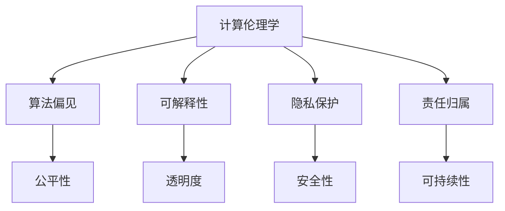

                 

# 人类计算：科技向善的力量

> 关键词：人工智能,机器学习,计算伦理学,社会影响,数据隐私,道德责任,可持续发展

## 1. 背景介绍

### 1.1 问题由来

随着科技的飞速发展，人工智能(AI)已经广泛应用于各个领域，从自动驾驶到医疗诊断，从金融风控到教育推荐，AI的智能辅助正在改变人类生活的方方面面。然而，科技的双刃剑效应也愈发显著。AI技术的泛用化和普适化，使得其伦理和社会影响成为社会各界广泛关注的话题。

如何通过科技的力量，实现“向善”的目标？计算伦理学(Calculational Ethics)作为一门交叉学科，旨在探讨AI与人类社会互动的伦理原则，试图找到解决这一问题的路径。本文将深入探讨计算伦理学在AI研究中的应用，展示其如何推动科技向善，为构建一个更和谐、更可持续发展的社会提供新思路。

### 1.2 问题核心关键点

计算伦理学研究的核心问题是如何在人工智能技术的设计、开发和使用过程中，融入伦理考量，确保技术的公平、透明、安全、可控，并最终实现社会福祉的最大化。

其关键要点包括：
- **公平性**：保证AI技术对所有群体（包括不同种族、性别、年龄、经济状态等）的公平对待，避免算法偏见和歧视。
- **透明度**：要求AI系统的决策过程可解释、可追溯，避免“黑盒”操作，增强公众信任。
- **安全性**：确保AI系统的稳定性和鲁棒性，避免因算法错误或漏洞导致的严重后果。
- **隐私保护**：保障用户数据的隐私与安全，防止数据滥用和泄露。
- **可持续性**：考虑技术对环境的长期影响，促进可持续发展。
- **责任归属**：明确算法决策的责任归属，避免技术滥用或不当行为。

## 2. 核心概念与联系

### 2.1 核心概念概述

计算伦理学是连接科技与伦理的桥梁，将伦理原则融入人工智能的设计、开发和应用过程。其核心概念包括但不限于：

- **计算伦理学**：将伦理学应用于计算科学的研究领域，探讨AI技术的伦理问题。
- **算法偏见**：AI算法由于训练数据不均衡、模型设计缺陷等原因，可能引入对特定群体的不公平对待。
- **可解释性**：AI模型的决策过程应尽可能透明，便于解释和审查。
- **隐私保护**：在数据收集、存储、处理等各个环节保障用户隐私，防止数据滥用。
- **责任归属**：明确AI系统决策的责任主体，确保在出现错误或不当行为时，能够找到责任人。

这些概念之间的联系通过以下Mermaid流程图进行展示：



这个流程图展示出计算伦理学如何通过多个核心概念，构建一个全面的伦理框架，确保AI技术的健康发展。

## 3. 核心算法原理 & 具体操作步骤

### 3.1 算法原理概述

计算伦理学并非一个具体的算法或技术，而是一种理念和方法，通过指导AI技术的开发和应用，确保其符合伦理标准。其核心思想包括：

- **公平性设计**：在数据采集、特征选择、模型训练等各个环节，确保算法对所有群体公平，避免偏见和歧视。
- **可解释性实现**：设计和开发可解释的AI模型，使其决策过程透明、可追溯，便于审查和验证。
- **隐私保护机制**：在数据处理、传输、存储等环节，采用隐私保护技术，防止数据泄露和滥用。
- **责任归属明确**：建立责任分配机制，明确算法决策的责任主体，确保在出现错误或不当行为时，能够追责和纠错。

### 3.2 算法步骤详解

**Step 1: 设计伦理框架**

1. **确定伦理原则**：根据具体应用场景，确定关键伦理原则，如隐私保护、公平性、可解释性等。
2. **制定伦理标准**：根据伦理原则，制定相应的技术标准和操作规范，如数据隐私协议、公平性评估指标等。

**Step 2: 数据处理与预处理**

1. **数据采集**：确保数据来源的多样性和代表性，避免数据偏差。
2. **数据清洗**：处理缺失值、异常值，确保数据质量。
3. **数据增强**：采用数据增强技术，如数据扩充、数据对抗，提升模型鲁棒性。

**Step 3: 模型设计**

1. **选择算法**：根据任务需求，选择合适的算法和模型结构，如线性回归、决策树、神经网络等。
2. **设定正则化**：引入正则化技术，如L1正则、Dropout，防止过拟合，增强模型泛化能力。
3. **考虑可解释性**：采用可解释性方法，如决策树、线性回归，确保模型决策过程透明。

**Step 4: 模型训练与评估**

1. **模型训练**：使用标注数据训练模型，确保模型在公平性、透明度、隐私保护等方面符合伦理标准。
2. **模型评估**：在训练集和验证集上评估模型性能，确保模型泛化能力。
3. **伦理测试**：引入伦理测试，检查模型是否符合伦理标准，如使用公平性检测工具、隐私保护审计工具等。

**Step 5: 模型部署与应用**

1. **模型部署**：将模型部署到实际应用环境中，确保在生产环境中的稳定性和鲁棒性。
2. **持续监控**：实时监控模型行为，及时发现和纠正伦理问题。
3. **反馈改进**：根据用户反馈和模型表现，不断改进模型和算法。

### 3.3 算法优缺点

计算伦理学的优点在于：
- **系统性**：提供了一个全面的伦理框架，覆盖数据采集、模型训练、应用部署等各个环节。
- **普适性**：适用于各种AI应用场景，如医疗、金融、教育等。
- **指导性**：为AI开发者提供了明确的伦理指导，帮助其设计符合伦理标准的系统。

其缺点在于：
- **复杂性**：涉及伦理、法律、技术等多个领域，实施难度较大。
- **灵活性不足**：伦理框架固定，难以应对快速变化的技术和应用场景。
- **成本高**：伦理设计和审核需要大量资源投入，增加研发成本。

### 3.4 算法应用领域

计算伦理学在AI技术的多个应用领域中均有应用，具体包括：

- **医疗健康**：确保医疗AI系统的公平性、透明度和安全性，保障患者隐私，提高医疗质量。
- **金融风控**：设计公平透明的金融算法，避免算法偏见，保障用户权益。
- **教育推荐**：采用可解释的推荐算法，确保推荐过程透明，避免数据滥用。
- **智能安防**：在视频监控、人脸识别等场景中，确保算法公平、透明，避免误判和滥用。
- **智慧城市**：设计公正透明的城市管理算法，促进公平访问，提升城市治理效能。

## 4. 数学模型和公式 & 详细讲解 & 举例说明

### 4.1 数学模型构建

计算伦理学的数学模型主要涉及以下几个方面：

- **公平性模型**：通过统计学方法，如均方误差、最大差异等，评估算法对不同群体的公平性。
- **可解释性模型**：如决策树、线性回归、LIME等，通过模型输出解释决策过程。
- **隐私保护模型**：如差分隐私、联邦学习、同态加密等，确保数据隐私。
- **责任归属模型**：通过责任链追踪技术，如责任树、责任图等，明确决策责任。

### 4.2 公式推导过程

以公平性模型为例，假设有一组数据集 $D=\{(x_i, y_i)\}_{i=1}^N$，其中 $x_i$ 为输入，$y_i$ 为输出，$y_i \in \{0, 1\}$。计算公平性的公式可以表示为：

$$
\text{Fairness} = \frac{1}{N}\sum_{i=1}^N [y_i - \frac{\sum_{j=1}^N y_j}{N}]^2
$$

其中，$y_i$ 表示第 $i$ 个样本的标签，$y_j$ 表示样本 $j$ 的标签。该公式计算了模型预测标签与真实标签之间的平均平方误差，反映了模型的预测结果与真实情况的一致性。

### 4.3 案例分析与讲解

考虑一个医疗诊断系统，用于判断肿瘤是否为恶性。假设训练集中的恶性肿瘤样本较少，模型可能在诊断时出现偏见。为解决这一问题，可采用以下方法：

- **数据增强**：扩充训练集，增加恶性肿瘤样本数量，提高模型公平性。
- **重采样**：对训练集中的样本进行重采样，确保不同类别样本数量均衡。
- **公平性检测工具**：使用公平性检测工具，如AUC差异法、等价性检验等，评估模型的公平性。
- **可解释性解释**：通过LIME等工具，解释模型的决策过程，确保透明。
- **隐私保护措施**：采用同态加密技术，保护患者隐私，防止数据泄露。

## 5. 项目实践：代码实例和详细解释说明

### 5.1 开发环境搭建

在进行计算伦理学相关的项目实践时，需要搭建相应的开发环境。以下是基于Python的开发环境搭建步骤：

1. 安装Anaconda：从官网下载并安装Anaconda，用于创建独立的Python环境。
```bash
conda create -n ethics-env python=3.8
conda activate ethics-env
```

2. 安装相关依赖包：
```bash
conda install scikit-learn pandas numpy matplotlib seaborn scikit-learn
```

3. 安装伦理测试工具：
```bash
pip install fairness-indicators dulwich
```

完成上述步骤后，即可在`ethics-env`环境中进行计算伦理学相关的开发。

### 5.2 源代码详细实现

下面以医疗诊断系统为例，展示计算伦理学的代码实现。

```python
import pandas as pd
from sklearn.model_selection import train_test_split
from sklearn.linear_model import LogisticRegression
from sklearn.metrics import accuracy_score, confusion_matrix
from fairness_indicators import MetricCalculator
from dulwich import ldir

# 加载数据集
data = pd.read_csv('tumors.csv')

# 数据预处理
X = data[['age', 'gender', 'symptoms']]
y = data['malignant']

# 划分训练集和测试集
X_train, X_test, y_train, y_test = train_test_split(X, y, test_size=0.2, random_state=42)

# 训练模型
model = LogisticRegression()
model.fit(X_train, y_train)

# 预测结果
y_pred = model.predict(X_test)

# 评估模型
accuracy = accuracy_score(y_test, y_pred)
confusion_matrix = confusion_matrix(y_test, y_pred)

# 计算公平性
calculator = MetricCalculator()
calculator.add_metric(metrics=['balanced_accuracy'])
calculator.calculate(metrics=['balanced_accuracy'], X_train=X_train, y_train=y_train, X_test=X_test, y_test=y_test)
fairness = calculator.metrics['balanced_accuracy'][0]

# 输出结果
print('Accuracy:', accuracy)
print('Confusion Matrix:', confusion_matrix)
print('Fairness:', fairness)
```

### 5.3 代码解读与分析

**数据加载和预处理**：
- 使用Pandas库加载数据集，进行特征选择和数据清洗。

**模型训练和评估**：
- 使用Scikit-learn库训练逻辑回归模型，并在测试集上评估模型性能。

**公平性计算**：
- 使用Fairness Indicators库计算模型在训练集和测试集上的公平性指标，如平衡准确率。

**输出结果**：
- 输出模型准确率、混淆矩阵和公平性指标，进行综合评估。

## 6. 实际应用场景

### 6.1 医疗健康

计算伦理学在医疗健康领域的应用，确保医疗AI系统的公平性、透明度和安全性，保障患者隐私，提高医疗质量。例如，在医疗影像诊断系统中，通过公平性检测工具，确保模型对不同种族、性别、年龄等群体的公平对待，避免诊断偏见。

### 6.2 金融风控

设计公平透明的金融算法，避免算法偏见，保障用户权益。例如，在信用评分系统中，通过可解释性方法，确保模型决策过程透明，便于审查和验证。

### 6.3 教育推荐

采用可解释的推荐算法，确保推荐过程透明，避免数据滥用。例如，在在线教育平台中，通过公平性检测工具，确保推荐算法对不同用户群体的公平对待，避免推荐偏颇。

### 6.4 智能安防

在视频监控、人脸识别等场景中，确保算法公平、透明，避免误判和滥用。例如，在面部识别系统中，通过隐私保护技术，确保用户数据隐私，防止数据泄露和滥用。

### 6.5 智慧城市

设计公正透明的城市管理算法，促进公平访问，提升城市治理效能。例如，在智能交通系统中，通过公平性检测工具，确保交通管理算法对不同人群的公平对待，避免资源分配不均。

## 7. 工具和资源推荐

### 7.1 学习资源推荐

为了帮助开发者系统掌握计算伦理学在AI研究中的应用，这里推荐一些优质的学习资源：

1. **《计算伦理学基础》系列课程**：提供计算伦理学的基本概念和实践方法，帮助初学者理解计算伦理学在AI中的应用。

2. **《AI伦理与治理》书籍**：深入探讨AI技术的伦理问题，涵盖公平性、透明度、隐私保护等多个方面。

3. **IEEE ethics.org**：IEEE提供的伦理资源平台，提供大量计算伦理学的研究文献和标准。

4. **谷歌AI伦理指南**：谷歌发布的人工智能伦理指南，提供详细的伦理框架和实施建议。

5. **公平性检测工具库**：提供多种公平性检测工具，如AUC差异法、等价性检验等，帮助开发者评估算法的公平性。

### 7.2 开发工具推荐

高效的工具支持对于计算伦理学的研究和实践至关重要。以下是几款常用的开发工具：

1. **Jupyter Notebook**：提供交互式编程环境，方便开发者进行数据分析、模型训练和结果展示。

2. **Scikit-learn**：Python机器学习库，提供了多种算法和工具，支持公平性检测和模型训练。

3. **Fairness Indicators**：提供了多种公平性检测和评估工具，帮助开发者进行模型公平性评估。

4. **TensorFlow Privacy**：提供了多种隐私保护工具，如差分隐私、联邦学习等，支持隐私保护技术的应用。

5. **PySyft**：提供了多种联邦学习和隐私保护技术，支持分布式数据处理和隐私保护。

6. **Scalene**：性能分析工具，帮助开发者优化计算资源和算法性能。

### 7.3 相关论文推荐

计算伦理学的研究源于学界的持续探索，以下是几篇奠基性的相关论文，推荐阅读：

1. **《公平机器学习：原则与实践》**：探讨了公平机器学习的基本原则和实现方法，提供了一系列公平性检测工具。

2. **《数据隐私保护与计算伦理学》**：讨论了数据隐私保护的技术和方法，提供了多方面的隐私保护建议。

3. **《计算伦理学：伦理原则与技术实现》**：深入探讨了计算伦理学的基本概念和实现技术，提供了伦理框架和伦理测试工具。

4. **《人工智能的伦理治理》**：系统探讨了人工智能的伦理问题，提供了多方参与的治理框架。

这些论文代表了计算伦理学在AI研究中的前沿进展，帮助研究者掌握最新的研究动态和技术方法。

## 8. 总结：未来发展趋势与挑战

### 8.1 总结

本文对计算伦理学在AI研究中的应用进行了全面系统的介绍。通过理论分析和技术实践，展示了计算伦理学如何在AI技术的开发和应用中发挥作用，确保技术的公平性、透明度和安全性。计算伦理学不仅提供了伦理框架和方法，还通过工具和资源，帮助开发者在实践中应用伦理原则，推动AI技术向善发展。

### 8.2 未来发展趋势

展望未来，计算伦理学将继续在AI研究中发挥重要作用。其主要发展趋势包括：

1. **普适性增强**：随着AI技术的普及，计算伦理学将覆盖更多应用场景，如智能家居、智能制造等。
2. **工具和技术不断进步**：新的公平性检测工具、隐私保护技术等将不断涌现，提高伦理评估的准确性和效率。
3. **多学科融合**：计算伦理学将与法律、哲学、社会学等学科深度融合，形成更加全面的伦理框架。
4. **伦理标准的制定**：随着技术的不断进步，新的伦理问题将不断出现，需制定新的伦理标准和规范。
5. **国际合作加强**：AI伦理问题具有全球性，国际间的合作将推动伦理标准的统一和实施。

### 8.3 面临的挑战

尽管计算伦理学在AI研究中取得了显著进展，但仍面临诸多挑战：

1. **伦理标准的制定和执行**：不同领域和文化背景下的伦理标准可能存在差异，如何制定统一的伦理标准，并确保其有效执行，是一大挑战。
2. **技术的复杂性**：AI技术的复杂性和多样性使得伦理评估更加困难，需开发更加智能和灵活的评估工具。
3. **资源投入**：伦理设计和审核需要大量资源投入，如何平衡伦理与技术进步的需求，是一个重要问题。
4. **伦理问题的隐性性**：一些伦理问题可能难以在模型设计阶段发现，需在应用过程中持续监测和评估。
5. **伦理教育的普及**：伦理问题的解决需要全社会的共同努力，如何普及伦理教育，提高公众的伦理意识，是一个长期任务。

### 8.4 研究展望

面对计算伦理学面临的挑战，未来的研究需要在以下几个方面寻求新的突破：

1. **伦理框架的通用化**：设计通用的伦理框架和工具，适应不同领域和技术背景的应用需求。
2. **多学科协同研究**：结合法律、哲学、社会学等多个学科，提供多角度的伦理分析和建议。
3. **伦理评估的自动化**：开发智能化的伦理评估工具，自动化检测和修复伦理问题。
4. **伦理标准的动态更新**：随着技术的不断进步，定期更新伦理标准和规范，确保其与时俱进。
5. **伦理教育的普及化**：通过教育培训、公开讲座等多种形式，普及伦理知识，提升公众的伦理意识。

这些研究方向的探索，将推动计算伦理学在AI研究中的发展和应用，为构建更加公平、透明、安全的AI系统提供有力支持。

## 9. 附录：常见问题与解答

**Q1：计算伦理学是否适用于所有AI应用场景？**

A: 计算伦理学适用于大多数AI应用场景，但在一些特定场景下，可能需要结合具体领域特点进行特殊设计和评估。例如，在医疗、金融等高风险领域，需制定更加严格的伦理标准和规范。

**Q2：如何进行公平性评估？**

A: 公平性评估可以通过多种方法进行，如均方误差、最大差异、平衡准确率等。具体方法的选择需根据应用场景和需求确定。

**Q3：如何实现可解释性？**

A: 可解释性方法包括决策树、线性回归、LIME等。在模型设计阶段，应选择具有可解释性的算法，并在训练后使用可解释性工具进行模型解释。

**Q4：如何保障数据隐私？**

A: 保障数据隐私可以采用多种技术手段，如差分隐私、同态加密、联邦学习等。在数据处理、传输、存储等环节，应采用相应的隐私保护措施，确保数据安全。

**Q5：如何明确责任归属？**

A: 责任归属可以通过责任链追踪技术，如责任树、责任图等方法实现。在模型设计和应用阶段，应明确责任主体，确保在出现错误或不当行为时，能够追责和纠错。

---

作者：禅与计算机程序设计艺术 / Zen and the Art of Computer Programming

