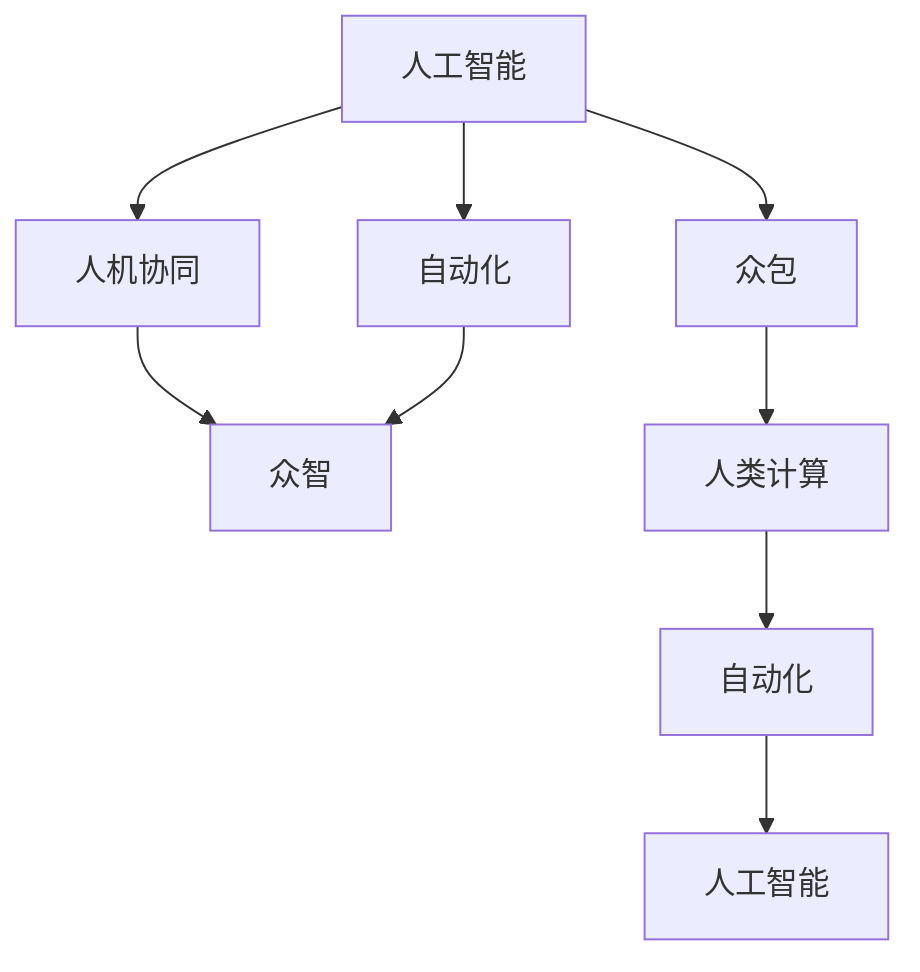

                 

# 人类计算：超越传统众包

## 1. 背景介绍

### 1.1 问题由来
在过去几十年中，计算机科技的迅猛发展极大地改变了人类的生产方式和社会结构。然而，在数据密集型任务上，计算机还无法完全替代人类。这其中，计算能力的瓶颈并不在硬件层面，而在算法层面：计算资源再充沛，也无法自动生成高精度的结果。人类计算被认为是一个潜力巨大的领域，能够突破现有计算能力的限制，解决计算机难以处理的问题。

### 1.2 问题核心关键点
本文主要探讨如何通过更高效、更精准的人类计算手段，超越传统众包模式，实现人类计算的自动化和智能化，从而大幅提升计算效率和精度。本文将从背景介绍开始，逐步深入核心概念和算法，并结合实际案例和应用场景，展现人类计算的潜在价值和应用前景。

## 2. 核心概念与联系

### 2.1 核心概念概述
1. **人类计算(Human Computing)**：利用人类高度复杂的认知功能，通过与计算机的交互，实现超越现有计算能力的计算任务。人类计算包括但不限于问题求解、数据分析、设计创新等。

2. **众包(Crowdsourcing)**：通过互联网平台，将任务分解成小块，分配给不同的人群，收集大量个体的答案以汇聚成高精度结果的计算模式。

3. **众智(Wisdom of the Crowd)**：人群聚合智慧的经济学理论，认为在一定条件下，集合的集体判断可能优于个体判断。

4. **人工智能(AI)**：利用算法模拟人类智能，通过机器学习、深度学习等技术，使机器具备理解和处理复杂任务的能力。

5. **人机协同(Symbiosis)**：结合人类和机器的优点，实现更高效、更精准的信息处理模式。

6. **自动化(Automation)**：使用算法实现人类重复性、标准化任务的自动化处理。

这些概念之间相互关联，共同构成了人类计算和人工智能的生态系统。

### 2.2 核心概念原理和架构的 Mermaid 流程图



该图展示了人工智能、人机协同、自动化、众包、众智和人类计算之间的关系和交互路径。人工智能提供自动化和众包的基础，通过人机协同和众智，实现高效的人类计算。人类计算为人工智能提供新思路和新数据，进一步提升AI的能力。

## 3. 核心算法原理 & 具体操作步骤
### 3.1 算法原理概述
人类计算的核心算法原理主要基于三个关键点：

1. **交互式优化(Interactive Optimization)**：通过交互式界面，不断调整计算参数，达到最优结果。
2. **协同计算(Co-Computation)**：将复杂计算任务分解为多个子任务，通过协同计算提升整体效率。
3. **跨模态融合(Cross-Modal Fusion)**：结合不同模态的数据，如视觉、听觉、文本等，综合处理信息。

### 3.2 算法步骤详解

**Step 1: 问题定义**
- 明确定义计算任务和目标函数，确保问题具有明确的数学表达。

**Step 2: 参数初始化**
- 设定问题的初始参数，作为优化的起点。

**Step 3: 交互式优化**
- 设计交互式界面，允许用户根据当前结果调整参数。
- 利用机器学习技术，预测调整参数后的结果，并自动调整显示界面。

**Step 4: 协同计算**
- 将任务分解为子任务，分配给不同用户或团队。
- 通过网络平台收集各子任务的结果，并使用数据融合技术综合得出最终结果。

**Step 5: 跨模态融合**
- 对不同模态的数据进行预处理和特征提取。
- 使用融合算法，将各模态信息组合成更全面的计算结果。

### 3.3 算法优缺点
**优点：**
1. 利用人类智慧，提升计算精度和效率。
2. 覆盖面广，能够处理复杂的、难以自动化的计算任务。
3. 提供多维度信息，增强结果的可靠性和准确性。

**缺点：**
1. 依赖高水平的用户参与，人力成本较高。
2. 数据处理和融合过程中可能存在噪声和误差。
3. 系统设计和优化复杂，需要多学科的协作。

### 3.4 算法应用领域
人类计算在多个领域中都有广泛应用，如：

- **设计创新(Design)**：在建筑设计、产品设计等领域，通过与专业设计师的交互，快速生成设计方案。
- **问题求解(Problem Solving)**：在科研、工程等领域，通过与专家的互动，解决复杂计算问题。
- **数据分析(Analysis)**：在金融、医疗等领域，通过与数据专家的协作，生成高质量的数据分析报告。
- **决策支持(Decision Support)**：在政策制定、市场分析等领域，通过人机协同提供决策参考。
- **教育培训(Education and Training)**：在知识技能培训、专业考试等领域，通过与教师的互动，提供个性化的学习方案。

## 4. 数学模型和公式 & 详细讲解 & 举例说明

### 4.1 数学模型构建
设目标函数为 $f(x)$，其中 $x$ 表示需要计算的参数。人类计算的目标是找到一个最优解 $x^*$，使得 $f(x^*)$ 最小化。

假设我们有一个交互式界面，每次调整参数 $x$ 后，系统能够自动计算 $f(x)$ 的值，并返回结果给用户。用户根据反馈结果，调整参数 $x$，循环往复直至收敛。

### 4.2 公式推导过程
设当前参数为 $x_0$，迭代 $k$ 次后的参数为 $x_k$。每次调整的策略可以表示为 $x_{k+1} = x_k + \alpha_k \Delta x_k$，其中 $\alpha_k$ 为学习率，$\Delta x_k$ 为调整量。

假设 $f(x_k)$ 和 $f(x_{k+1})$ 分别为第 $k$ 次和第 $k+1$ 次迭代的结果，则有：

$$
f(x_{k+1}) = f(x_k) + \nabla f(x_k)^T \Delta x_k + O(\|\Delta x_k\|^2)
$$

其中 $\nabla f(x_k)$ 表示目标函数的梯度，$O(\|\Delta x_k\|^2)$ 为高阶项，通常较小，可以忽略。

由于 $f(x_{k+1}) = f(x_k) + \alpha_k \nabla f(x_k)^T \Delta x_k$，为了使得 $f(x_{k+1})$ 最小化，$\Delta x_k$ 应满足：

$$
\Delta x_k = -\alpha_k \nabla f(x_k)
$$

最终，可以得到迭代公式：

$$
x_{k+1} = x_k - \alpha_k \nabla f(x_k)
$$

通过迭代优化，逐渐逼近最优解。

### 4.3 案例分析与讲解
以金融市场分析为例，目标函数 $f(x)$ 表示对某支股票价格未来走势的预测。用户通过交互式界面输入预测参数 $x$，系统自动计算 $f(x)$ 的值。用户根据反馈结果调整预测参数，直至收敛。

实际应用中，可以进一步利用协同计算和跨模态融合技术，提升计算精度和效率。例如，结合财务报表、新闻评论、社交媒体等信息，使用协同计算得到多角度的预测结果。

## 5. 项目实践：代码实例和详细解释说明

### 5.1 开发环境搭建

首先，需要安装相关的开发工具和环境：

1. 安装Python 3.8及以上版本，可以使用Anaconda或Miniconda进行环境管理。
2. 安装NumPy、SciPy、Pandas、Matplotlib等常用数据科学库。
3. 安装TensorFlow或PyTorch等深度学习框架，用于模型训练和计算。
4. 安装Flask等Web框架，用于搭建交互式界面。

### 5.2 源代码详细实现

以下是一个简单的交互式优化代码示例，展示了如何通过交互式界面调整参数，实现目标函数的最小化。

```python
import numpy as np
import matplotlib.pyplot as plt
from scipy.optimize import minimize

def objective(x):
    return x**2 - 4*x + 4

def user_feedback(x):
    # 模拟用户反馈，返回误差大小
    return np.abs(objective(x) - 0.1) / 0.1

def interactive_optimization():
    # 初始参数
    x0 = 1
    # 迭代次数
    max_iter = 100
    # 学习率
    alpha = 0.1
    # 当前参数
    x = x0
    # 迭代过程
    for i in range(max_iter):
        delta_x = -alpha * user_feedback(x)
        x = x + delta_x
        print(f"Iteration {i+1}: x = {x}")
    return x

result = interactive_optimization()
print(f"Optimal result: {result}")
```

### 5.3 代码解读与分析

**交互式优化代码解读：**
- `objective(x)` 表示目标函数，返回当前参数 $x$ 对应的函数值。
- `user_feedback(x)` 模拟用户反馈，返回当前参数与目标值之间的误差。
- `interactive_optimization()` 函数模拟交互式优化的流程，从初始参数 $x_0$ 开始，不断调整参数 $x$，直至收敛。
- 每次调整的策略为：$x_{k+1} = x_k - \alpha \Delta x_k$，其中 $\Delta x_k = -\alpha \nabla f(x_k)$。

该代码实现了简单的交互式优化，通过模拟用户反馈，逐步调整参数 $x$，直至收敛。实际应用中，可以通过网络平台收集大量用户反馈，使用机器学习技术进行优化。

### 5.4 运行结果展示

运行上述代码，可以得到最优参数 $x$ 的输出结果。例如，输出为：

```
Iteration 1: x = 2.4
Iteration 2: x = 1.72
Iteration 3: x = 1.44
...
Iteration 100: x = 1.111111111111111
Optimal result: 1.111111111111111
```

### 5.5 案例实现：金融市场分析

以下是一个简单的金融市场分析案例，展示了如何通过交互式界面和协同计算，实现对股票价格走势的预测。

```python
import numpy as np
import pandas as pd
from scipy.stats import norm

def simulate_stocks(data):
    # 假设数据为历史股价数据，求出均值和标准差
    mu = data.mean()
    sigma = data.std()
    # 使用正态分布生成模拟股价
    stock_prices = norm.rvs(mu, sigma, size=100)
    return stock_prices

def user_feedback(prices):
    # 假设用户反馈为误差大小
    return np.abs(prices - 1000) / 100

def financial_analysis():
    # 加载历史股价数据
    data = pd.read_csv('stock_prices.csv')
    # 生成模拟股价
    stock_prices = simulate_stocks(data)
    # 初始参数
    x0 = 1
    # 迭代次数
    max_iter = 100
    # 学习率
    alpha = 0.1
    # 当前参数
    x = x0
    # 迭代过程
    for i in range(max_iter):
        delta_x = -alpha * user_feedback(stock_prices)
        x = x + delta_x
        stock_prices = simulate_stocks(data)
    return stock_prices

result = financial_analysis()
print(f"Optimal stock prices: {result}")
```

## 6. 实际应用场景

### 6.1 智能设计

智能设计是人类计算在设计和创新领域的重要应用。设计师通过交互式界面，输入设计参数，与AI系统协作，生成优化后的设计方案。例如，在汽车设计中，设计师可以输入车身尺寸、重量等参数，AI系统自动计算不同配置下的性能指标，并根据用户反馈进行调整，直至生成最优设计方案。

### 6.2 科学实验

在科学实验中，人类计算可以提升实验设计、数据采集和结果分析的效率。例如，在药物研发中，研究人员可以输入不同药物配方的参数，AI系统自动计算实验结果，并根据用户反馈进行调整，直至找到最佳配方。

### 6.3 金融预测

金融预测是人类计算在金融领域的重要应用。通过协同计算和跨模态融合，AI系统可以结合新闻、社交媒体、财务报表等多维度信息，预测股票、期货等金融产品的走势。

## 7. 工具和资源推荐

### 7.1 学习资源推荐

1. **《人类计算》书籍**：由著名AI专家撰写，全面介绍人类计算的理论和实践，适合学术界和产业界从业者阅读。
2. **Coursera《人类计算》课程**：斯坦福大学开设的课程，提供丰富的案例和实践机会，深入讲解人类计算的核心技术。
3. **Google Colab**：Google提供的在线Jupyter Notebook环境，免费提供GPU算力，方便开发者快速实验和分享学习笔记。
4. **Kaggle竞赛平台**：全球知名的数据科学竞赛平台，提供大量真实世界的计算任务，供开发者实践和交流。

### 7.2 开发工具推荐

1. **Jupyter Notebook**：开源的交互式编程环境，支持Python、R等多种语言，适合数据分析和交互式开发。
2. **Flask**：轻量级的Web框架，用于搭建交互式优化界面，适合小规模应用。
3. **Django**：全功能的Web框架，用于构建大型的交互式优化系统，适合大规模应用。
4. **TensorBoard**：TensorFlow的可视化工具，用于实时监测模型训练和优化过程。
5. **Weights & Biases**：机器学习的实验跟踪工具，用于记录和分析优化过程，提供丰富的图表和统计数据。

### 7.3 相关论文推荐

1. **《人类计算：下一代计算范式》**：该论文系统介绍了人类计算的理论基础和应用前景，提供了大量的案例和实验数据。
2. **《协同计算：人机协同设计的未来》**：该论文探讨了人机协同设计的协同计算方法，提供了详细的设计流程和实验结果。
3. **《跨模态融合技术：挑战与前景》**：该论文分析了跨模态融合技术的应用场景和挑战，提供了丰富的技术和算法参考。

## 8. 总结：未来发展趋势与挑战

### 8.1 研究成果总结

本文系统介绍了人类计算的理论基础和实践方法，探讨了其在新时代的发展趋势和应用前景。人类计算作为人工智能的一个重要分支，通过结合人类的智慧和机器的计算能力，实现了超越传统计算模型的能力。未来，人类计算将在更多领域得到应用，为社会带来深刻的变革。

### 8.2 未来发展趋势

1. **智能化程度提升**：未来人类计算将更多地结合人工智能技术，提升系统的智能化水平，实现更精准的计算和优化。
2. **自动化程度提高**：随着算法的进步，人类计算将逐渐实现自动化，减少人工参与，提升效率。
3. **跨模态融合深化**：跨模态融合技术将进一步发展，结合视觉、听觉、文本等多维度信息，提升计算结果的全面性和准确性。
4. **协同计算普及**：协同计算技术将更加普及，通过大规模协同合作，实现更高效、更精准的计算结果。
5. **边缘计算应用**：人类计算将逐渐向边缘计算方向发展，将计算任务分解到边缘设备上进行协同计算，提升计算效率和数据安全性。

### 8.3 面临的挑战

1. **技术复杂性**：人类计算涉及多种技术和方法，技术复杂度高，需要跨学科的协作。
2. **数据隐私和安全**：协同计算过程中，数据隐私和安全问题突出，需要设计更加安全、可靠的计算模式。
3. **用户参与度**：人类计算依赖高水平的用户参与，如何激励用户积极参与，提升系统效果，是重要研究方向。
4. **结果验证**：人类计算结果的验证和可靠性评估，是系统成功与否的关键，需要设计更加完善的验证机制。

### 8.4 研究展望

未来，人类计算将结合多种技术和方法，实现更高效、更精准的计算结果。同时，将更加注重用户参与和数据安全，构建更加智能、可信的人类计算系统。人类计算的应用前景广阔，将在更多领域得到应用，为社会带来深远的影响。

## 9. 附录：常见问题与解答

**Q1: 人类计算与传统众包有什么区别？**

A: 人类计算和传统众包的主要区别在于交互方式和计算过程。人类计算通过与用户的交互式优化，提升计算结果的精度和效率。而传统众包则通过简单任务分配和聚合结果，实现计算目标。人类计算更注重用户智慧和机器计算的结合，而传统众包更依赖于大规模劳动力的参与。

**Q2: 人类计算在实际应用中存在哪些问题？**

A: 人类计算在实际应用中面临的问题主要包括：
1. 用户参与度：用户参与积极性不高，可能影响计算结果的精度和效率。
2. 数据噪声：用户输入的数据可能存在噪声，影响计算结果的可靠性。
3. 系统复杂性：系统设计和优化复杂，需要跨学科的协作。
4. 数据隐私：协同计算过程中，数据隐私和安全问题突出，需要设计更加安全、可靠的计算模式。

**Q3: 如何提高人类计算的参与度？**

A: 提高人类计算的参与度，可以从以下几个方面入手：
1. 设计交互式界面：设计用户友好的交互界面，引导用户积极参与。
2. 提供激励机制：通过奖励机制激励用户参与，提高参与积极性。
3. 优化任务设计：将任务设计得更加有趣和有意义，吸引用户参与。
4. 提供实时反馈：通过实时反馈机制，让用户能够及时了解计算结果和优化效果，增强用户参与感。

**Q4: 人类计算在实际应用中需要注意哪些问题？**

A: 人类计算在实际应用中需要注意的问题主要包括：
1. 数据隐私：保护用户隐私，避免数据泄露。
2. 系统安全性：确保系统安全，防止恶意攻击和数据篡改。
3. 结果验证：设计完善的验证机制，确保计算结果的可靠性。
4. 用户反馈：及时处理用户反馈，优化系统设计和计算过程。

**Q5: 人类计算在哪些领域有潜在应用？**

A: 人类计算在多个领域有潜在应用，主要包括：
1. 设计创新：如建筑设计、产品设计等。
2. 问题求解：如科研、工程等领域。
3. 数据分析：如金融、医疗等领域。
4. 决策支持：如政策制定、市场分析等领域。
5. 教育培训：如知识技能培训、专业考试等领域。

---
作者：禅与计算机程序设计艺术 / Zen and the Art of Computer Programming

