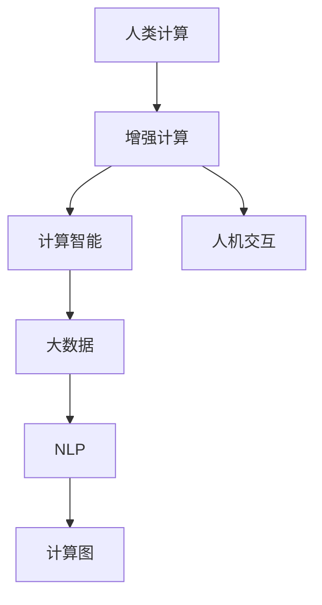

                 

## 1. 背景介绍

### 1.1 问题由来

在现代社会，随着信息技术的发展，人类计算能力面临着前所未有的挑战。尽管计算机处理速度不断提升，但面对复杂的数据处理、多任务协作、实时决策等任务，人类计算能力依然不可或缺。如何利用计算机和人类智慧相结合，最大化释放人类潜力，成为当今科技和社会的重要课题。

近年来，人工智能(AI)技术不断取得突破，如自然语言处理(NLP)、计算机视觉(CV)、机器人学等领域，展现出了强大的应用潜力。与此同时，人类计算的思考范式也逐渐从以机器为中心转向以人为中心，强调人机协作、交互设计等，旨在充分发挥人类在创造性思维、决策判断、情感交流等方面的独特优势。

### 1.2 问题核心关键点

人类计算的本质，在于利用计算机技术的辅助，发挥人类的计算能力。这不仅包括使用计算机进行数据处理、自动化决策，还包括人类对机器结果的分析和解释，甚至直接参与计算过程。在人类计算的过程中，计算工具的辅助作用日益凸显，成为了实现人机协同的关键。

实现人类计算的核心关键点包括：
- **数据处理能力**：能够快速处理大量数据，提取关键信息。
- **计算智能**：具备基于规则和模型的推理、决策能力。
- **交互体验**：实现与人类自然、流畅的交互，满足人的情感和需求。
- **解释和反馈**：提供结果的解释和可视化，接受用户的反馈并持续优化。

### 1.3 问题研究意义

研究人类计算，对于提升人类生活质量、推动科技进步和社会发展，具有重要意义：

1. **提升工作效率**：通过智能化工具辅助，大幅提高计算速度和精度，减少人为错误，提升工作效率。
2. **扩展知识边界**：利用计算机技术的强大数据处理能力，扩展人类认知的广度和深度，推动科学发现。
3. **促进协作创新**：人机协作的模式，可以激发更多创造性思维和跨领域创新，加速技术迭代。
4. **增强决策科学性**：结合数据驱动和专家经验，提升决策的科学性和准确性，支持复杂问题解决。
5. **改善用户体验**：关注人机交互设计和用户体验，提高技术的应用价值和接受度。

## 2. 核心概念与联系

### 2.1 核心概念概述

为更好地理解人类计算的实现路径，本节将介绍几个核心概念及其关联：

- **人类计算(Human Computing)**：利用计算机辅助，发挥人类的计算和认知能力，实现复杂问题的解决。
- **增强计算(Augmented Computing)**：通过计算机技术增强人类的计算能力，如实时信息辅助、协作平台等。
- **计算智能(Computational Intelligence)**：基于算法和模型的推理、决策能力，是实现计算任务的基础。
- **人机交互(Human-Computer Interaction, HCI)**：强调人与计算机之间的自然、高效交互，提升用户体验。
- **大数据(大数据Big Data)**：涉及海量数据的处理和分析，是实现增强计算的重要数据基础。
- **自然语言处理(NLP)**：处理和理解人类语言的技术，实现人机之间的自然交互。
- **计算图(Computational Graph)**：用于表示计算任务和数据流的有向无环图，是实现高效计算的基础。

这些核心概念之间的逻辑关系可以通过以下Mermaid流程图来展示：



这个流程图展示了几大核心概念及其之间的关系：

1. 人类计算的实现，需要利用计算机辅助，提高计算智能。
2. 增强计算的核心，在于数据和计算智能的结合，实现高效任务处理。
3. 人机交互是增强计算得以实现的桥梁，关注用户体验和系统友好性。
4. 大数据和NLP技术为增强计算提供数据和语义支持，计算图则为实现高效计算提供结构化框架。

这些概念共同构成了人类计算的实现框架，旨在利用计算机技术和人类智慧，解决复杂问题，提升效率和质量。

## 3. 核心算法原理 & 具体操作步骤
### 3.1 算法原理概述

人类计算的核心算法原理，可以归纳为以下几个关键步骤：

1. **数据采集与预处理**：收集和清洗用于计算任务的数据，包括结构化数据和非结构化数据。
2. **模型构建与训练**：利用计算智能构建合适的模型，并在数据集上训练，提取规律和模式。
3. **交互设计**：设计人机交互界面，使用户能够自然、流畅地与系统进行交互。
4. **结果解释与反馈**：提供计算结果的解释和可视化，接受用户反馈并持续优化。

这些步骤需要结合计算机技术和人类智慧，实现高效的计算和决策。

### 3.2 算法步骤详解

具体实现过程中，人类计算可以分为以下几个关键步骤：

**Step 1: 数据采集与预处理**

1. **数据收集**：通过网络爬虫、传感器、问卷调查等方式，收集相关数据。
2. **数据清洗**：去除噪声、填补缺失值、处理异常值等，确保数据质量。
3. **数据整合**：将结构化数据和非结构化数据整合，形成统一的数据格式。

**Step 2: 模型构建与训练**

1. **选择合适的算法**：根据任务需求，选择适合的算法和模型，如机器学习、深度学习、优化算法等。
2. **特征提取与选择**：从数据中提取关键特征，选择适合特征，构建特征向量。
3. **模型训练**：使用训练集训练模型，调整参数，优化模型性能。
4. **模型验证与调优**：使用验证集评估模型性能，根据评估结果进行调优。

**Step 3: 交互设计**

1. **界面设计**：设计直观、易用的交互界面，包括输入输出、控制等。
2. **交互逻辑**：实现用户与系统的交互逻辑，确保信息传递和数据处理。
3. **反馈机制**：提供实时反馈，帮助用户理解和修正输入。

**Step 4: 结果解释与反馈**

1. **结果解释**：将计算结果转化为直观的展示形式，如图表、文本等。
2. **用户反馈**：收集用户反馈，分析用户满意度，持续优化计算过程。
3. **动态调整**：根据用户反馈和结果变化，动态调整计算策略和模型参数。

### 3.3 算法优缺点

人类计算的实现方法，具有以下优点：

1. **人机协同**：结合人类和计算机的优势，实现更高效、更精准的计算。
2. **实时决策**：能够实时处理复杂任务，快速响应变化。
3. **适应性强**：能够灵活适应不同环境和用户需求，实现个性化计算。
4. **多模态融合**：支持多种数据模态的融合，实现更全面、更准确的计算。

同时，该方法也存在一定的局限性：

1. **数据依赖性强**：高质量、大规模数据是实现增强计算的基础，数据获取和处理复杂。
2. **算法复杂度高**：需要选择合适的算法和模型，且模型训练和调优复杂。
3. **交互设计挑战**：需要设计直观、易用的交互界面，提升用户体验。
4. **结果解释难度大**：复杂计算结果需要解释和可视化，实现难度大。

尽管存在这些局限性，但人类计算的实现方法在提升计算效率和决策质量方面具有重要意义。未来研究应重点关注如何降低数据和算法复杂度，提升交互和结果解释的易用性和可视化水平。

### 3.4 算法应用领域

人类计算的应用领域十分广泛，涵盖了多个行业和领域，具体包括：

1. **医疗健康**：利用计算智能进行疾病诊断、患者风险评估等，提升医疗服务质量。
2. **金融服务**：通过大数据分析和计算智能，进行风险评估、金融预测等，提升金融决策效率。
3. **制造工程**：利用传感器和计算智能，实现生产过程的实时监控和优化，提升生产效率。
4. **交通运输**：通过计算智能和大数据分析，优化交通流控制、提高交通安全性，减少拥堵。
5. **城市管理**：利用计算智能和大数据，进行城市规划、环境监测、智能交通管理等，提升城市治理水平。
6. **教育培训**：通过智能学习系统，提供个性化教育方案，提升学习效果和教学质量。
7. **安全监控**：利用计算智能和数据分析，进行视频监控、异常检测等，提升安全保障水平。
8. **创意设计**：结合计算智能和人工智能技术，进行创意设计、模拟测试等，提高设计效率。

这些领域的应用展示了人类计算在提升生活质量、推动科技进步和社会发展中的巨大潜力。

## 4. 数学模型和公式 & 详细讲解  
### 4.1 数学模型构建

本节将使用数学语言对人类计算的实现过程进行更加严格的刻画。

假设我们有一组数据集 $D=\{(x_i, y_i)\}_{i=1}^N$，其中 $x_i$ 为输入特征，$y_i$ 为标签。在人类计算中，我们通过选择合适的模型 $M_{\theta}$，并使用训练集 $D$ 对其进行训练，得到最优参数 $\theta^*$。模型 $M_{\theta}$ 的输出 $M_{\theta}(x)$ 和标签 $y$ 的预测结果 $M_{\theta}(x_i)$ 之间可能存在误差，我们希望最小化预测误差，构建如下的损失函数：

$$
L(M_{\theta}, D) = \frac{1}{N}\sum_{i=1}^N \ell(M_{\theta}(x_i), y_i)
$$

其中 $\ell$ 为损失函数，如均方误差损失、交叉熵损失等。

### 4.2 公式推导过程

以线性回归为例，推导损失函数的计算公式。假设我们有一个线性回归模型 $M_{\theta}(x) = \theta_0 + \theta_1 x_1 + \theta_2 x_2$，其中 $\theta_0, \theta_1, \theta_2$ 为模型参数，$x_1, x_2$ 为输入特征，$y$ 为标签。均方误差损失函数定义为：

$$
\ell(M_{\theta}(x), y) = \frac{1}{2}(y - M_{\theta}(x))^2
$$

在训练过程中，我们希望最小化损失函数，即：

$$
L(M_{\theta}, D) = \frac{1}{N}\sum_{i=1}^N (y_i - M_{\theta}(x_i))^2
$$

通过梯度下降等优化算法，不断更新模型参数 $\theta$，使得损失函数最小化。最终得到的 $\theta^*$ 即为最优参数，对应于线性回归模型的最小二乘解。

### 4.3 案例分析与讲解

以医疗健康领域的疾病预测为例，假设我们有一组医疗数据 $D=\{(x_i, y_i)\}_{i=1}^N$，其中 $x_i$ 为患者的历史健康记录，$y_i$ 为患者是否患病。我们希望构建一个疾病预测模型 $M_{\theta}$，最小化预测误差，提升预测精度。

具体实现步骤如下：

1. **数据收集与预处理**：收集医院电子病历、体检数据等，进行数据清洗和整合，形成统一的数据格式。
2. **特征提取**：提取患者的年龄、性别、病史、体检指标等特征，构建特征向量。
3. **模型训练**：选择逻辑回归、支持向量机等算法，训练模型 $M_{\theta}$，调整参数，优化模型性能。
4. **结果解释与反馈**：将计算结果转化为图表、文本等直观形式，解释模型预测结果，接受医生和患者反馈，持续优化模型。

## 5. 项目实践：代码实例和详细解释说明
### 5.1 开发环境搭建

在进行人类计算的实践前，我们需要准备好开发环境。以下是使用Python进行Scikit-learn开发的环境配置流程：

1. 安装Anaconda：从官网下载并安装Anaconda，用于创建独立的Python环境。

2. 创建并激活虚拟环境：
```bash
conda create -n sklearn-env python=3.8 
conda activate sklearn-env
```

3. 安装Scikit-learn：
```bash
conda install scikit-learn
```

4. 安装各类工具包：
```bash
pip install numpy pandas matplotlib seaborn jupyter notebook
```

完成上述步骤后，即可在`sklearn-env`环境中开始人类计算的实践。

### 5.2 源代码详细实现

下面我们以医疗健康领域的疾病预测任务为例，给出使用Scikit-learn库进行线性回归的PyTorch代码实现。

首先，定义疾病预测任务的数据处理函数：

```python
from sklearn.datasets import load_breast_cancer
from sklearn.model_selection import train_test_split
from sklearn.linear_model import LogisticRegression
from sklearn.metrics import classification_report

# 加载数据集
data = load_breast_cancer()
X, y = data.data, data.target

# 分割数据集
X_train, X_test, y_train, y_test = train_test_split(X, y, test_size=0.2, random_state=42)

# 定义模型
model = LogisticRegression()

# 训练模型
model.fit(X_train, y_train)

# 预测结果
y_pred = model.predict(X_test)

# 评估模型
print(classification_report(y_test, y_pred))
```

然后，定义交互界面和结果解释函数：

```python
import numpy as np
import matplotlib.pyplot as plt

def get_input():
    # 获取用户输入的特征向量
    features = []
    while True:
        try:
            feature = float(input("请输入特征值 (输入'q'退出): "))
            features.append(feature)
        except ValueError:
            if input.lower() == 'q':
                break
            else:
                print("输入格式错误，请重新输入！")
    return np.array(features)

def predict_disease(features):
    # 进行疾病预测
    prediction = model.predict(np.array(features).reshape(1, -1))[0]
    return prediction

def show_result(prediction):
    # 显示预测结果
    if prediction == 1:
        print("预测为患病")
    else:
        print("预测为未患病")
```

最后，启动交互流程：

```python
while True:
    features = get_input()
    if features.size > 0:
        prediction = predict_disease(features)
        show_result(prediction)
```

以上就是使用Scikit-learn进行疾病预测任务的人类计算实践。可以看到，通过简单易用的API和交互界面，用户能够轻松实现计算模型的应用。

### 5.3 代码解读与分析

让我们再详细解读一下关键代码的实现细节：

**load_breast_cancer函数**：
- 加载乳腺癌数据集，包含若干患者的乳腺癌诊断信息。

**train_test_split函数**：
- 将数据集分为训练集和测试集，用于模型训练和评估。

**LogisticRegression模型**：
- 使用逻辑回归模型，对输入特征进行分类预测。

**classification_report函数**：
- 生成模型的分类报告，包括精确率、召回率、F1值等指标。

**get_input函数**：
- 实现用户输入特征值的交互逻辑，支持多特征输入。

**predict_disease函数**：
- 使用训练好的模型对用户输入的特征进行预测，返回预测结果。

**show_result函数**：
- 根据预测结果，输出文本提示。

**交互流程**：
- 循环读取用户输入的特征值，进行预测并输出结果。

可以看到，通过Scikit-learn库，我们能够轻松实现疾病预测模型的训练、评估和交互使用。此外，Scikit-learn还提供了丰富的可视化工具，可以进一步优化交互界面和结果展示。

## 6. 实际应用场景
### 6.1 智能医疗

人类计算在医疗领域有着广泛的应用。利用计算智能和数据分析，可以辅助医生进行疾病诊断、预测和个性化治疗，提高医疗服务质量和效率。

具体应用场景包括：
- **疾病预测**：通过计算智能和统计学习，构建疾病预测模型，提前发现患者的潜在健康问题，及时采取干预措施。
- **个性化治疗**：结合患者历史健康记录和遗传信息，进行个性化药物推荐和治疗方案设计，提高治疗效果。
- **影像诊断**：利用计算机视觉技术，对医学影像进行分析和解读，辅助医生进行诊断。
- **健康管理**：通过智能手环、穿戴设备等采集用户健康数据，进行实时监测和分析，提供个性化的健康建议。

### 6.2 智能金融

金融领域需要处理海量数据，进行实时决策和风险评估。人类计算技术在金融领域的应用，可以提升金融决策的准确性和效率。

具体应用场景包括：
- **风险评估**：利用大数据分析和计算智能，进行信用评分、风险评估等，降低金融风险。
- **投资决策**：通过量化分析，构建投资模型，进行智能投资决策，优化资产配置。
- **欺诈检测**：利用计算智能和大数据分析，进行交易异常检测和欺诈行为识别，提高安全性。
- **客户服务**：通过智能客服系统，提供24小时在线服务，提升客户体验和满意度。

### 6.3 智能制造

制造业面临复杂生产过程和多样化需求，利用人类计算技术，可以提升生产效率和产品质量。

具体应用场景包括：
- **生产监控**：利用传感器和计算智能，进行生产过程的实时监控和优化，减少生产故障和停机时间。
- **品质检测**：通过计算机视觉和大数据分析，进行产品缺陷检测和质量评估，提升产品质量。
- **供应链管理**：利用计算智能和大数据，优化供应链流程，提升供应链效率和稳定性。
- **智能调度**：结合生产计划和设备状态，进行智能调度优化，提高生产效率和资源利用率。

### 6.4 未来应用展望

随着人类计算技术的不断进步，未来在更多领域将有更多的应用场景：

1. **智能教育**：结合计算智能和人工智能技术，提供个性化的教育方案，提升学习效果和教学质量。
2. **智能交通**：通过计算智能和大数据分析，优化交通流控制、提高交通安全性，减少拥堵。
3. **城市治理**：利用计算智能和大数据，进行城市规划、环境监测、智能交通管理等，提升城市治理水平。
4. **智能客服**：通过计算智能和自然语言处理技术，实现智能客服系统，提升客户体验和满意度。
5. **智能创意设计**：结合计算智能和人工智能技术，进行创意设计、模拟测试等，提高设计效率。

## 7. 工具和资源推荐
### 7.1 学习资源推荐

为了帮助开发者系统掌握人类计算的理论基础和实践技巧，这里推荐一些优质的学习资源：

1. **《Python数据科学手册》**：由知名数据科学家Jake VanderPlas所著，全面介绍了Python在数据科学和机器学习中的应用，涵盖数据处理、模型构建、可视化等。
2. **《机器学习实战》**：Wes McKinney所著，通过实际项目案例，深入浅出地介绍了机器学习技术的应用，适合初学者入门。
3. **《深度学习》**：Ian Goodfellow、Yoshua Bengio、Aaron Courville合著，全面介绍了深度学习的基本原理和应用，是深度学习的权威指南。
4. **《人类计算》课程**：斯坦福大学开设的计算机视觉课程，涵盖了图像识别、深度学习等前沿技术，适合对计算机视觉感兴趣的读者。
5. **《Python自然语言处理》**：Jake VanderPlas所著，介绍了自然语言处理的基本技术和应用，适合Python开发者入门。

通过对这些资源的学习实践，相信你一定能够快速掌握人类计算的精髓，并用于解决实际的计算问题。

### 7.2 开发工具推荐

高效的开发离不开优秀的工具支持。以下是几款用于人类计算开发的常用工具：

1. **Scikit-learn**：开源的Python机器学习库，提供了丰富的机器学习算法和工具，适合数据处理和模型构建。
2. **TensorFlow**：由Google主导开发的开源深度学习框架，支持分布式计算和模型优化，适合大规模深度学习应用。
3. **PyTorch**：Facebook开发的深度学习框架，提供了灵活的计算图和丰富的工具，适合研究和开发。
4. **Jupyter Notebook**：开源的交互式计算平台，支持多语言编程和可视化展示，适合数据科学和机器学习项目。
5. **Git**：开源的版本控制系统，支持协作开发和版本管理，适合团队开发和项目管理。

合理利用这些工具，可以显著提升人类计算任务的开发效率，加快创新迭代的步伐。

### 7.3 相关论文推荐

人类计算的研究源于学界的持续研究。以下是几篇奠基性的相关论文，推荐阅读：

1. **《人类计算：理解、设计与实现》**：探讨了人类计算的基本概念、设计原则和实现方法，是理解人类计算的经典著作。
2. **《增强计算：人机协作的新范式》**：提出了增强计算的概念，探讨了人机协同计算的设计和实现方法，适合对人类计算感兴趣的研究者。
3. **《计算智能：人工智能与人类智慧的融合》**：介绍了计算智能的基本原理和应用，适合对人工智能感兴趣的研究者。
4. **《大数据驱动的智能系统设计》**：探讨了大数据和智能系统的结合，适合对大数据和智能系统感兴趣的研究者。
5. **《人机交互设计：理论与实践》**：介绍了人机交互设计的理论和实践方法，适合对交互设计感兴趣的研究者。

这些论文代表了大数据和人类计算的发展脉络。通过学习这些前沿成果，可以帮助研究者把握学科前进方向，激发更多的创新灵感。

## 8. 总结：未来发展趋势与挑战

### 8.1 总结

本文对人类计算的实现方法和应用前景进行了全面系统的介绍。首先阐述了人类计算的研究背景和意义，明确了计算智能、人机交互等关键概念及其之间的联系。其次，从原理到实践，详细讲解了人类计算的数学模型和操作步骤，给出了实际应用场景和代码实例。

通过本文的系统梳理，可以看到，人类计算的实现方法在提升计算效率和决策质量方面具有重要意义。未来研究需要在数据获取、算法优化、交互设计、结果解释等多个环节寻求新的突破，以实现更高水平的人机协同。

### 8.2 未来发展趋势

展望未来，人类计算技术将呈现以下几个发展趋势：

1. **数据获取自动化**：通过自动采集和数据挖掘技术，获取高质量、大规模数据，支持更高效的计算和决策。
2. **算法优化智能化**：引入智能算法和优化策略，提高模型的计算效率和泛化能力，实现更精准的预测和决策。
3. **交互设计用户化**：根据用户需求和反馈，不断优化交互界面和用户体验，实现更友好、自然的交互。
4. **结果解释可视化**：利用可视化技术，将复杂计算结果转化为直观、易懂的展示形式，提升结果解释的准确性和可理解性。
5. **跨领域应用广泛化**：结合大数据和人工智能技术，拓展人类计算的应用领域，提升各个行业的信息化水平。

以上趋势凸显了人类计算技术的广阔前景。这些方向的探索发展，必将进一步提升人类生活质量、推动科技进步和社会发展。

### 8.3 面临的挑战

尽管人类计算技术已经取得了瞩目成就，但在迈向更加智能化、普适化应用的过程中，它仍面临诸多挑战：

1. **数据隐私和安全**：在数据采集和存储过程中，如何保护用户隐私，防止数据泄露和滥用，是一大挑战。
2. **模型可解释性**：复杂计算模型往往缺乏可解释性，难以理解其内部工作机制和决策逻辑。如何提高模型的可解释性，增强用户信任，是未来需要解决的重要问题。
3. **人机协作复杂性**：在复杂任务中，如何实现高效的人机协同，避免人机冲突和误操作，是提高系统稳定性和可靠性的关键。
4. **系统鲁棒性**：在面对异常数据和意外情况时，如何保持系统稳定性和鲁棒性，避免系统崩溃或错误决策，是提高系统可靠性的重要保障。
5. **跨领域知识整合**：如何实现跨领域知识的整合和应用，支持更广泛、更深入的计算任务，是一大难题。

正视这些挑战，积极应对并寻求突破，将是人类计算技术走向成熟的必由之路。相信随着学界和产业界的共同努力，这些挑战终将一一被克服，人类计算必将在构建人机协同的智能时代中扮演越来越重要的角色。

### 8.4 研究展望

面向未来，人类计算的研究方向可以从以下几个方面进行探索：

1. **多模态计算**：结合视觉、听觉、触觉等多模态信息，实现更全面、更精准的计算。
2. **计算智能与人类智慧的融合**：引入人类智慧和常识，指导计算智能的优化和应用，提升计算任务的准确性和可靠性。
3. **基于分布式计算的协同计算**：利用分布式计算技术，实现大规模计算任务的协同优化，提升计算效率和资源利用率。
4. **面向社会的计算伦理**：研究计算伦理和社会影响，确保计算系统的公正性和透明性，避免算法偏见和歧视。
5. **计算系统的可扩展性**：设计可扩展、可维护的计算系统，支持更多领域和更多应用场景的扩展。

这些研究方向将引领人类计算技术迈向更高的台阶，为构建安全、可靠、可解释、可控的智能系统铺平道路。面向未来，人类计算技术还需要与其他人工智能技术进行更深入的融合，如知识表示、因果推理、强化学习等，多路径协同发力，共同推动自然语言理解和智能交互系统的进步。只有勇于创新、敢于突破，才能不断拓展计算模型的边界，让智能技术更好地造福人类社会。

## 9. 附录：常见问题与解答

**Q1：什么是人类计算？**

A: 人类计算是指利用计算机技术和算法，结合人类智慧和认知能力，进行复杂问题的解决。它不仅包括数据处理和计算任务，还涵盖任务决策、交互设计等多个方面。

**Q2：人类计算的核心技术有哪些？**

A: 人类计算的核心技术包括数据处理、计算智能、人机交互、大数据分析、自然语言处理等。这些技术相互配合，实现高效、准确、智能的计算过程。

**Q3：人类计算的应用场景有哪些？**

A: 人类计算的应用场景十分广泛，涵盖医疗健康、金融服务、制造工程、交通运输、城市治理、教育培训、安全监控、创意设计等多个领域。

**Q4：人类计算面临的主要挑战有哪些？**

A: 人类计算面临的主要挑战包括数据隐私和安全、模型可解释性、人机协作复杂性、系统鲁棒性、跨领域知识整合等。

**Q5：未来人类计算技术的发展方向是什么？**

A: 未来人类计算技术的发展方向包括数据获取自动化、算法优化智能化、交互设计用户化、结果解释可视化、跨领域应用广泛化等。

---

作者：禅与计算机程序设计艺术 / Zen and the Art of Computer Programming

