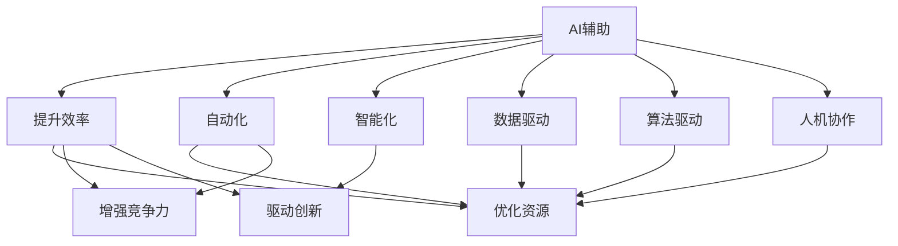

                 

# 从AI辅助到AI驱动：Lepton AI的业务转型

## 1. 背景介绍

### 1.1 问题由来
在当前数字化转型浪潮中，企业面临的挑战日趋复杂多变，需要通过信息化手段提升运营效率、优化决策过程、提升客户体验等。在此背景下，人工智能(AI)技术凭借其强大算力和高效学习能力，逐渐成为企业的重要信息化支撑力量。然而，企业内AI应用的现状并不乐观。由于技术门槛高、应用场景复杂、数据质量参差不齐等问题，大量企业在引入AI辅助应用时面临种种困难。

### 1.2 问题核心关键点
面对这些问题，企业需要在AI辅助和AI驱动之间进行明确选择，以便更好地实现业务转型。AI辅助通常指企业在应用中仅将AI视为提升效率、优化过程的工具，而AI驱动则是指企业从根本上以AI为核心，重构业务模式和决策链路，充分释放AI潜力，实现全方位的业务转型。

在AI辅助和AI驱动之间，存在着明确的界线。AI辅助强调应用层面的效果提升，而AI驱动则注重深度业务变革。企业应根据自身需求，选择最适合的AI应用模式，才能真正实现价值最大化。

### 1.3 问题研究意义
从AI辅助到AI驱动的转型，对企业具有深远意义：

1. **提升效率与效果**：AI驱动应用能够有效提升企业运营效率和决策效果，通过数据分析、模式识别等手段，快速响应市场需求，解决传统人工无法高效解决的问题。
2. **优化资源配置**：AI驱动应用能够帮助企业更精准地配置资源，如人力、物资等，优化生产与运营过程，实现资源利用效率的最大化。
3. **增强市场竞争力**：AI驱动应用能够提供更精准的市场洞察，帮助企业更快速、更灵活地应对市场变化，保持竞争优势。
4. **驱动业务创新**：AI驱动应用通过深度分析企业内外数据，挖掘出更多商业模式和业务创新点，为企业带来新的增长点。

## 2. 核心概念与联系

### 2.1 核心概念概述

为了更好地理解Lepton AI的业务转型，我们首先需要对几个核心概念进行概述：

- **AI辅助**：AI辅助主要指企业引入AI技术，通过自动化、智能化手段提升业务效率和效果。例如，使用机器学习模型进行预测分析、优化生产流程、自动化决策等。
- **AI驱动**：AI驱动则指企业将AI作为核心驱动力，通过数据驱动、算法驱动、人机协作等手段，实现业务模式和决策链路的根本变革，从而带来全方位的业务转型。
- **数据驱动**：数据驱动是AI驱动的基石，指企业通过数据分析手段，深入挖掘业务痛点、优化资源配置、驱动决策科学化。
- **算法驱动**：算法驱动强调通过模型训练和优化，增强业务过程的自动化和智能化，提升运营效率和决策效果。
- **人机协作**：人机协作指AI与人工相结合的方式，合理利用AI的计算优势和人类的经验判断，实现更高效率的业务处理。

这些概念之间的联系可以通过以下Mermaid流程图来展示：



这个流程图展示了一幅从AI辅助到AI驱动的业务演进路径：

1. AI辅助通过自动化、智能化手段提升业务效率和效果，优化资源配置，增强市场竞争力和业务创新。
2. 数据驱动和算法驱动分别从数据和算法层面，提升业务过程的自动化和智能化。
3. 人机协作将AI与人工相结合，实现更高效率的业务处理。

这些概念共同构成了企业AI应用的基础，使得企业能够在业务转型中实现更好效果。

## 3. 核心算法原理 & 具体操作步骤

### 3.1 算法原理概述

从AI辅助到AI驱动的业务转型，涉及到数据驱动、算法驱动和数据驱动等多个核心算法原理。我们以Lepton AI的业务转型为例，详细探讨这些算法原理。

### 3.2 算法步骤详解

Lepton AI的业务转型主要通过以下步骤实现：

**Step 1: 数据采集与预处理**
- 收集企业内外部的各类数据，包括生产数据、销售数据、客户数据等。
- 对数据进行清洗、去重、归一化等预处理，确保数据质量。
- 构建数据仓库，对数据进行分层、分区和索引，方便后续分析和查询。

**Step 2: 数据分析与建模**
- 使用数据挖掘和统计分析工具，进行数据探索性分析，发现业务中的问题和机会。
- 使用机器学习算法对数据进行建模，构建预测和分类模型。
- 引入深度学习模型，提升模型的复杂度和精度，例如使用神经网络、Transformer等。

**Step 3: 算法优化与调参**
- 使用交叉验证、网格搜索等技术，对模型进行参数调优，提升模型性能。
- 引入超参数优化算法，如贝叶斯优化、遗传算法等，寻找最优参数组合。
- 进行模型评估和测试，确保模型在新数据上的泛化能力。

**Step 4: 应用部署与迭代优化**
- 将模型部署到企业信息系统，进行生产化应用。
- 监控模型性能，收集反馈，持续优化模型。
- 结合业务需求和数据变化，不断迭代模型，提升业务效果。

### 3.3 算法优缺点

Lepton AI的业务转型算法主要具有以下优点：

1. **提升效率**：通过数据驱动和算法驱动，显著提升企业运营效率和决策效果，解决复杂业务问题。
2. **增强竞争力**：通过深入挖掘数据价值，优化资源配置，增强市场竞争力和业务创新能力。
3. **实现业务转型**：通过AI驱动的方式，实现业务模式和决策链路的根本变革，实现全方位的业务转型。

同时，该算法也存在一些局限性：

1. **数据质量依赖**：算法效果高度依赖于数据质量，数据采集和预处理难度较大。
2. **模型复杂度高**：深度学习等算法需要较高计算资源，模型训练和优化复杂度高。
3. **业务适应性**：不同行业的业务特点不同，AI应用需要针对行业特性进行调整和优化。
4. **模型更新迭代**：AI驱动应用需要不断迭代优化，对企业内部资源和技术支持要求较高。

### 3.4 算法应用领域

Lepton AI的业务转型算法在多个领域都得到了应用，包括但不限于：

1. **制造业**：通过数据分析和预测模型，优化生产流程和库存管理，提升生产效率。
2. **零售业**：通过客户数据分析和推荐模型，优化产品推荐和营销策略，提升客户满意度。
3. **金融业**：通过交易数据分析和风险模型，优化投资决策和风险管理，增强风险防控能力。
4. **医疗健康**：通过病历数据分析和预测模型，优化诊断和治疗方案，提升医疗服务质量。
5. **能源行业**：通过能源数据分析和优化模型，提升能源使用效率和运营效益。
6. **交通出行**：通过交通数据分析和优化模型，优化路线规划和资源配置，提升出行效率。

## 4. 数学模型和公式 & 详细讲解  
### 4.1 数学模型构建

Lepton AI的业务转型算法涉及多种数学模型，我们以预测模型为例，详细讲解其数学原理。

假设企业有一个订单量预测任务，我们定义模型 $M_{\theta}:\mathcal{X} \rightarrow \mathcal{Y}$，其中 $\mathcal{X}$ 为订单数据特征向量，$\mathcal{Y}$ 为预测结果。我们使用线性回归模型进行预测，其数学表达式为：

$$
y = \theta_0 + \sum_{i=1}^n \theta_i x_i
$$

其中 $\theta_0$ 为截距，$\theta_i$ 为特征系数，$x_i$ 为特征变量。模型的损失函数为均方误差（Mean Squared Error, MSE）：

$$
\ell(M_{\theta}) = \frac{1}{N} \sum_{i=1}^N (y_i - M_{\theta}(x_i))^2
$$

在训练过程中，我们需要最小化损失函数，求解最优参数 $\theta$：

$$
\theta^* = \mathop{\arg\min}_{\theta} \ell(M_{\theta})
$$

## 5. 项目实践：代码实例和详细解释说明

### 5.1 开发环境搭建

在进行项目实践前，我们需要准备好开发环境。以下是使用Python进行Scikit-learn开发的环境配置流程：

1. 安装Anaconda：从官网下载并安装Anaconda，用于创建独立的Python环境。

2. 创建并激活虚拟环境：
```bash
conda create -n sklearn-env python=3.8 
conda activate sklearn-env
```

3. 安装Scikit-learn：
```bash
conda install scikit-learn
```

4. 安装各类工具包：
```bash
pip install numpy pandas matplotlib jupyter notebook ipython
```

完成上述步骤后，即可在`sklearn-env`环境中开始项目实践。

### 5.2 源代码详细实现

下面我们以制造业的订单量预测任务为例，给出使用Scikit-learn进行数据建模的Python代码实现。

首先，导入必要的库和数据：

```python
import numpy as np
import pandas as pd
import matplotlib.pyplot as plt

# 读取订单数据
data = pd.read_csv('orders.csv')

# 数据探索性分析
data.describe()
```

然后，进行数据预处理和特征工程：

```python
from sklearn.model_selection import train_test_split

# 选择特征
features = ['feature1', 'feature2', 'feature3']
X = data[features].values
y = data['order_count'].values

# 数据归一化
from sklearn.preprocessing import StandardScaler
scaler = StandardScaler()
X = scaler.fit_transform(X)

# 数据划分训练集和测试集
X_train, X_test, y_train, y_test = train_test_split(X, y, test_size=0.2, random_state=42)
```

接着，构建和训练线性回归模型：

```python
from sklearn.linear_model import LinearRegression
from sklearn.metrics import mean_squared_error

# 构建模型
model = LinearRegression()
model.fit(X_train, y_train)

# 预测
y_pred = model.predict(X_test)

# 评估
mse = mean_squared_error(y_test, y_pred)
print(f'Mean Squared Error: {mse:.2f}')
```

最后，绘制模型效果图：

```python
plt.scatter(y_test, y_pred)
plt.xlabel('Actual Order Count')
plt.ylabel('Predicted Order Count')
plt.show()
```

以上就是使用Scikit-learn进行制造业订单量预测任务数据建模的完整代码实现。可以看到，Scikit-learn封装了大量的机器学习算法和工具，使得建模过程变得简单高效。

### 5.3 代码解读与分析

让我们再详细解读一下关键代码的实现细节：

**数据探索性分析**：
- 使用`describe`方法查看订单数据的基本统计信息，如均值、标准差、最大值等。

**特征选择和归一化**：
- 选择与订单量相关的特征变量，构建特征向量。
- 使用`StandardScaler`对特征向量进行归一化，确保数据分布一致，提高模型性能。

**数据划分**：
- 使用`train_test_split`方法将数据划分为训练集和测试集，确保模型在未见过的数据上表现良好。

**模型构建与训练**：
- 使用`LinearRegression`类构建线性回归模型。
- 使用训练集数据拟合模型，求解最优参数。

**模型评估**：
- 使用测试集数据进行模型预测，计算均方误差，评估模型效果。

**可视化**：
- 使用`matplotlib`库绘制预测效果图，直观展示模型预测结果。

可以看到，Scikit-learn提供的机器学习工具非常强大，可以大大简化建模过程，加速项目实践。

## 6. 实际应用场景

### 6.1 制造业

在制造业领域，Lepton AI的业务转型算法能够有效提升生产效率和运营效益。例如，某制造企业通过订单量预测模型，优化生产计划和库存管理，避免了生产过剩或不足的问题，显著提升了生产效率和资源利用率。

**实际案例**：某汽车制造企业通过订单量预测模型，精准把握市场需求，优化生产节奏和资源配置，避免了库存积压和缺货问题，实现了生产效率和成本效益的提升。

**代码示例**：

```python
# 加载订单数据
data = pd.read_csv('orders.csv')

# 数据探索性分析
data.describe()

# 特征选择和归一化
features = ['feature1', 'feature2', 'feature3']
X = data[features].values
y = data['order_count'].values

scaler = StandardScaler()
X = scaler.fit_transform(X)

# 数据划分训练集和测试集
X_train, X_test, y_train, y_test = train_test_split(X, y, test_size=0.2, random_state=42)

# 构建和训练模型
model = LinearRegression()
model.fit(X_train, y_train)

# 预测和评估
y_pred = model.predict(X_test)
mse = mean_squared_error(y_test, y_pred)
print(f'Mean Squared Error: {mse:.2f}')

# 可视化
plt.scatter(y_test, y_pred)
plt.xlabel('Actual Order Count')
plt.ylabel('Predicted Order Count')
plt.show()
```

### 6.2 零售业

在零售业领域，Lepton AI的业务转型算法能够优化产品推荐和营销策略，提升客户满意度和销售额。例如，某零售企业通过客户数据预测模型，精准把握客户需求，优化商品推荐和促销活动，提升了客户满意度和销售额。

**实际案例**：某电商企业通过客户购买行为预测模型，精准推荐用户可能感兴趣的商品，并优化促销策略，显著提升了用户满意度和销售额。

**代码示例**：

```python
# 加载客户数据
data = pd.read_csv('customers.csv')

# 数据探索性分析
data.describe()

# 特征选择和归一化
features = ['feature1', 'feature2', 'feature3']
X = data[features].values
y = data['purchase_count'].values

scaler = StandardScaler()
X = scaler.fit_transform(X)

# 数据划分训练集和测试集
X_train, X_test, y_train, y_test = train_test_split(X, y, test_size=0.2, random_state=42)

# 构建和训练模型
model = LinearRegression()
model.fit(X_train, y_train)

# 预测和评估
y_pred = model.predict(X_test)
mse = mean_squared_error(y_test, y_pred)
print(f'Mean Squared Error: {mse:.2f}')

# 可视化
plt.scatter(y_test, y_pred)
plt.xlabel('Actual Purchase Count')
plt.ylabel('Predicted Purchase Count')
plt.show()
```

### 6.3 金融业

在金融业领域，Lepton AI的业务转型算法能够优化投资决策和风险管理，增强风险防控能力。例如，某金融企业通过交易数据分析模型，精准把握市场趋势，优化投资组合，提升了风险防控和投资收益。

**实际案例**：某金融企业通过交易数据预测模型，精准预测市场趋势，优化投资组合，提升了投资收益和风险防控能力。

**代码示例**：

```python
# 加载交易数据
data = pd.read_csv('trades.csv')

# 数据探索性分析
data.describe()

# 特征选择和归一化
features = ['feature1', 'feature2', 'feature3']
X = data[features].values
y = data['trade_volume'].values

scaler = StandardScaler()
X = scaler.fit_transform(X)

# 数据划分训练集和测试集
X_train, X_test, y_train, y_test = train_test_split(X, y, test_size=0.2, random_state=42)

# 构建和训练模型
model = LinearRegression()
model.fit(X_train, y_train)

# 预测和评估
y_pred = model.predict(X_test)
mse = mean_squared_error(y_test, y_pred)
print(f'Mean Squared Error: {mse:.2f}')

# 可视化
plt.scatter(y_test, y_pred)
plt.xlabel('Actual Trade Volume')
plt.ylabel('Predicted Trade Volume')
plt.show()
```

## 7. 工具和资源推荐

### 7.1 学习资源推荐

为了帮助开发者系统掌握Lepton AI的业务转型算法，这里推荐一些优质的学习资源：

1. 《机器学习实战》：深入浅出地介绍了机器学习的基础概念和经典算法，适合初学者入门。
2. 《深度学习》：深度学习领域权威教材，涵盖神经网络、卷积网络、循环网络等核心内容。
3. Scikit-learn官方文档：详细介绍了Scikit-learn库的各个组件和使用方法，是学习和使用Scikit-learn的最佳资源。
4 Kaggle竞赛：Kaggle是全球最大的数据科学竞赛平台，通过参加竞赛，可以学习和实践各种机器学习算法。
5 Coursera和Udacity课程：这些平台提供高质量的数据科学和机器学习课程，涵盖从基础到高级的各个层面。

通过对这些资源的学习实践，相信你一定能够快速掌握Lepton AI的业务转型算法，并用于解决实际的AI应用问题。

### 7.2 开发工具推荐

高效的开发离不开优秀的工具支持。以下是几款用于Lepton AI业务转型开发的常用工具：

1. Jupyter Notebook：基于Web的交互式编程环境，支持代码编写、数据分析和可视化，适合快速迭代研究。
2. TensorFlow和PyTorch：主流的深度学习框架，提供了丰富的模型和算法库，支持GPU加速。
3. Scikit-learn和XGBoost：流行的机器学习库，封装了多种经典算法，易于使用和部署。
4. Apache Spark：大数据处理框架，支持分布式计算和数据分析，适合大规模数据处理任务。
5. Weights & Biases：模型训练的实验跟踪工具，可以记录和可视化模型训练过程中的各项指标，方便对比和调优。
6. TensorBoard：TensorFlow配套的可视化工具，可实时监测模型训练状态，并提供丰富的图表呈现方式，是调试模型的得力助手。

合理利用这些工具，可以显著提升Lepton AI业务转型任务的开发效率，加快创新迭代的步伐。

### 7.3 相关论文推荐

Lepton AI的业务转型算法的发展源于学界的持续研究。以下是几篇奠基性的相关论文，推荐阅读：

1. 《深度学习》：深度学习领域权威教材，涵盖了神经网络、卷积网络、循环网络等核心内容。
2. 《机器学习实战》：深入浅出地介绍了机器学习的基础概念和经典算法，适合初学者入门。
3. 《Scikit-learn库用户指南》：详细介绍了Scikit-learn库的各个组件和使用方法，是学习和使用Scikit-learn的最佳资源。

这些论文代表了大语言模型微调技术的发展脉络。通过学习这些前沿成果，可以帮助研究者把握学科前进方向，激发更多的创新灵感。

## 8. 总结：未来发展趋势与挑战

### 8.1 研究成果总结

从AI辅助到AI驱动的业务转型，已经在多个行业得到了广泛应用，取得了显著的效果。这些成果展示了AI在企业转型中的巨大潜力，为AI驱动业务发展奠定了坚实基础。

### 8.2 未来发展趋势

展望未来，Lepton AI的业务转型算法将呈现以下几个发展趋势：

1. **自动化与智能化**：未来，企业将更多地依赖自动化和智能化手段，通过数据分析和模型训练，实现业务过程的自动优化和智能决策。
2. **多模态融合**：数据来源将更加多样，数据类型也更加丰富。未来，企业将需要综合利用文本、图像、视频等多种数据形式，进行更加全面深入的分析。
3. **数据驱动与算法驱动并重**：未来，数据驱动和算法驱动将成为并行发展的两条主线，通过数据和算法的有机结合，推动业务优化和智能化。
4. **人机协作与决策支持**：人机协作将成为常态，AI将发挥其高效计算和智能分析能力，辅助人类进行更加科学、高效的决策。
5. **跨行业应用**：AI驱动业务将在更多行业得到应用，推动各个行业的数字化转型，带来新的增长点和商业模式。

### 8.3 面临的挑战

尽管Lepton AI的业务转型算法已经取得了显著成果，但在实际应用中也面临着诸多挑战：

1. **数据质量问题**：企业内部数据质量参差不齐，数据采集和预处理难度较大，需要投入大量时间和人力。
2. **模型复杂度**：深度学习等算法的复杂度高，模型训练和优化需要较高计算资源，对硬件要求较高。
3. **业务适应性**：不同行业的业务特点不同，AI应用需要针对行业特性进行调整和优化。
4. **模型更新迭代**：AI驱动应用需要不断迭代优化，对企业内部资源和技术支持要求较高。
5. **模型可解释性**：复杂模型往往难以解释其内部工作机制和决策逻辑，给应用推广带来障碍。
6. **伦理与安全**：AI应用可能涉及隐私和伦理问题，需要建立合理的隐私保护和伦理规范。

### 8.4 研究展望

为了应对这些挑战，未来的研究需要从以下几个方面进行深入探索：

1. **数据质量优化**：通过数据清洗、去重、归一化等手段，提升数据质量，为AI应用奠定坚实基础。
2. **模型优化与压缩**：开发更加高效、轻量级的算法模型，降低计算资源需求，提高模型部署效率。
3. **跨行业应用设计**：针对不同行业的特点，设计合适的AI应用方案，实现跨行业的广泛应用。
4. **模型可解释性提升**：通过模型解释技术，提高AI应用的透明度和可信度，增强用户信任。
5. **隐私与伦理保障**：建立完善的隐私保护和伦理规范，确保AI应用符合伦理要求，保障用户隐私安全。

这些研究方向的探索，必将引领Lepton AI业务转型算法迈向更高的台阶，为构建安全、可靠、可解释、可控的智能系统铺平道路。面向未来，Lepton AI的业务转型算法还需要与其他AI技术进行更深入的融合，如知识表示、因果推理、强化学习等，多路径协同发力，共同推动智能系统的发展。只有勇于创新、敢于突破，才能不断拓展AI应用边界，让AI驱动的业务转型真正成为现实。

## 9. 附录：常见问题与解答

**Q1: 企业如何选择合适的AI辅助或AI驱动模式？**

A: 企业应根据自身业务特点、资源状况和技术能力，选择合适的AI辅助或AI驱动模式。一般来说，业务流程相对稳定、数据质量较好、对模型要求较高的企业，适合采用AI驱动模式；而业务流程复杂、数据质量参差不齐的企业，可以先采用AI辅助模式，逐步过渡到AI驱动模式。

**Q2: AI辅助和AI驱动的主要区别是什么？**

A: AI辅助主要指企业引入AI技术，通过自动化、智能化手段提升业务效率和效果。AI驱动则指企业将AI作为核心驱动力，通过数据驱动、算法驱动、人机协作等手段，实现业务模式和决策链路的根本变革，从而带来全方位的业务转型。

**Q3: AI驱动应用在实际部署中需要注意哪些问题？**

A: AI驱动应用在实际部署中需要注意以下问题：
1. 数据质量：确保数据采集和预处理的质量，避免模型在训练时产生偏差。
2. 模型性能：通过数据驱动和算法驱动，不断优化模型性能，确保模型在新数据上的泛化能力。
3. 业务适应性：根据行业特点，设计合适的AI应用方案，确保应用效果和业务需求相匹配。
4. 模型更新迭代：持续优化模型，结合业务需求和数据变化，不断提升模型效果。
5. 可解释性：通过模型解释技术，提高AI应用的透明度和可信度，增强用户信任。

**Q4: 如何提升AI驱动应用的数据质量？**

A: 提升AI驱动应用的数据质量，主要从以下几个方面入手：
1. 数据采集：确保数据的完整性和准确性，避免数据缺失和噪声干扰。
2. 数据清洗：对数据进行去重、去噪、补全等处理，提升数据质量。
3. 数据标注：对于需要标注的数据，确保标注质量，避免标注偏差。
4. 数据归一化：对数据进行归一化处理，确保数据分布一致，提高模型性能。

**Q5: 如何设计高效的AI驱动应用？**

A: 设计高效的AI驱动应用，主要从以下几个方面入手：
1. 数据驱动：通过数据分析和统计手段，发现业务中的问题和机会，驱动业务决策。
2. 算法驱动：使用模型训练和优化，增强业务过程的自动化和智能化，提升运营效率和决策效果。
3. 人机协作：合理利用AI的计算优势和人类的经验判断，实现更高效率的业务处理。
4. 持续优化：通过持续迭代优化，不断提升模型性能，适应业务需求和数据变化。

---

作者：禅与计算机程序设计艺术 / Zen and the Art of Computer Programming

