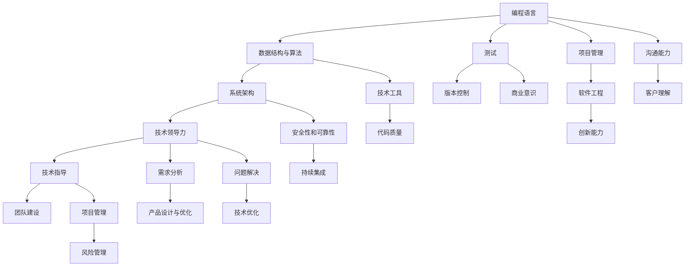

                 

## 1. 背景介绍

随着科技的发展，程序员的职位越来越受欢迎。然而，要想成为一个成功的程序员，单靠编写代码是远远不够的。成功的程序员需要综合掌握技术、管理、商业等多个领域的知识，才能在职业生涯中脱颖而出。

### 1.1 问题由来

在过去的几十年里，计算机编程从一种纯粹的编程语言，变成了涉及到多个领域，包括软件工程、算法设计、人工智能、机器学习等。这些领域技术的融合使得程序员需要掌握更多的知识和技能，以便能够更好地在技术团队中发挥作用。

然而，许多程序员仍然局限于自身的专业领域，对于其他领域的知识了解不够，导致他们在职业生涯中难以取得更大的突破。因此，本文将探讨如何通过综合应用技术、管理和商业知识，帮助程序员提升自身价值，从而实现财富积累。

## 2. 核心概念与联系

### 2.1 核心概念概述

为更好地理解程序员的财富之路，本节将介绍几个核心概念：

- **程序员技能栈**：包括编程语言、算法、数据结构、系统架构、测试、版本控制、项目管理、软件工程等技术技能。
- **技术领导力**：指的是在技术团队中指导和领导的能力，包括技术决策、团队协作、项目管理、需求分析和沟通能力等。
- **商业意识**：理解产品、市场、客户和业务模式的理念，以及如何通过技术手段实现商业目标。
- **创新能力**：不断探索新技术、新方法和新想法的能力，以及将这些创新应用到实际项目中的能力。

这些核心概念之间相互联系，共同构成了一个程序员的全面技能图谱。通过理解这些概念及其联系，程序员可以更好地规划自己的职业生涯，实现从代码到资产的财富积累。

### 2.2 核心概念原理和架构的 Mermaid 流程图



这个流程图展示了程序员技能栈和技术能力之间的相互联系。程序员的技能从基础编程到高级技术领导力，再到商业意识和创新能力，一步步提升，最终形成全面的技术能力和管理能力。

## 3. 核心算法原理 & 具体操作步骤

### 3.1 算法原理概述

程序员的财富之路可以分为技术技能提升、技术领导力培养、商业意识增强和创新能力开发四个阶段。每个阶段都需要通过不断学习和实践，逐步提升自身价值。

- **技术技能提升**：通过不断学习新技术、新工具和新方法，提升自己的编程能力。
- **技术领导力培养**：通过担任项目经理、技术负责人或团队领导，培养自己的技术决策能力和团队协作能力。
- **商业意识增强**：通过参与产品设计、市场分析和客户沟通，理解商业环境和客户需求，提升商业意识。
- **创新能力开发**：通过探索新技术、新业务和新领域，将自己的创新想法应用到实际项目中，实现突破性成就。

### 3.2 算法步骤详解

#### 3.2.1 技术技能提升

**步骤1：选择合适的编程语言和框架**  
选择主流的编程语言和框架，如Python、Java、JavaScript、React、Vue等，掌握其核心概念和使用方法。

**步骤2：学习算法和数据结构**  
系统学习经典算法和数据结构，如排序、搜索、图算法、树、图等，了解其时间复杂度和空间复杂度。

**步骤3：掌握系统架构和设计模式**  
了解不同系统的架构设计，如MVC、RESTful API、微服务等，掌握常见的设计模式，如单例、工厂、观察者等。

**步骤4：学习测试和持续集成**  
掌握单元测试、集成测试、自动化测试等测试方法，学习持续集成和持续部署(CI/CD)工具，如Jenkins、Travis CI等。

#### 3.2.2 技术领导力培养

**步骤1：担任项目经理**  
通过担任项目经理，学习项目管理的基本方法和工具，如Scrum、Kanban、JIRA等。

**步骤2：担任技术负责人**  
通过担任技术负责人，学习技术决策的能力，了解技术选型和架构设计的考量。

**步骤3：担任团队领导**  
通过担任团队领导，学习团队协作和沟通技巧，掌握需求分析和产品设计的方法。

#### 3.2.3 商业意识增强

**步骤1：参与产品设计和优化**  
通过参与产品设计和优化，了解客户需求和市场环境，提升商业意识。

**步骤2：学习市场分析和客户沟通**  
学习市场分析和客户沟通技巧，了解产品销售和市场推广的方法。

**步骤3：参与商业决策**  
通过参与商业决策，了解公司的业务模式和战略目标，提升商业意识。

#### 3.2.4 创新能力开发

**步骤1：探索新技术和新方法**  
通过参加技术会议、阅读技术博客、参与开源项目等，了解新技术和新方法。

**步骤2：应用新技术到实际项目中**  
将新技术和新方法应用到实际项目中，解决实际问题，实现技术突破。

**步骤3：不断创新和改进**  
通过不断创新和改进，提升技术能力和商业价值。

### 3.3 算法优缺点

**优点**  
- **综合性**：通过综合应用技术、管理和商业知识，程序员可以更好地适应变化多端的市场需求。  
- **可持续发展**：全面技能图谱使程序员在职业生涯中具有更强的竞争力和发展潜力。  
- **提升效率**：掌握新技术和工具，可以减少重复性工作，提升开发效率。  

**缺点**  
- **学习曲线陡峭**：需要学习多种技术和工具，存在较大的学习压力。  
- **资源需求大**：需要投入大量的时间和资源进行学习和实践。  
- **变化快**：新技术和新工具层出不穷，需要不断跟进和更新知识。  

### 3.4 算法应用领域

基于程序员的财富之路，程序员可以在以下领域发挥作用：

- **软件开发**：通过综合应用编程语言、算法、数据结构和系统架构等技术，开发高质量的软件产品。
- **系统架构设计**：通过掌握系统架构和设计模式，设计高效、可扩展的系统架构。
- **产品管理和推广**：通过了解商业意识和市场分析，参与产品管理和推广，提升产品市场竞争力。
- **技术咨询和培训**：通过技术领导力和创新能力，为客户提供技术咨询和培训服务。

## 4. 数学模型和公式 & 详细讲解 & 举例说明

### 4.1 数学模型构建

本节将使用数学语言对程序员的财富之路进行更加严格的刻画。

假设程序员的财富积累由技能价值（S）、商业价值（B）和创新价值（I）三部分构成，其总价值（V）可以表示为：

$$
V = S + B + I
$$

其中，技能价值（S）表示程序员在技术领域的掌握程度，商业价值（B）表示程序员在商业领域的理解能力，创新价值（I）表示程序员的创新和创造能力。

### 4.2 公式推导过程

- **技能价值（S）**：
  假设程序员掌握的技能数量为N，每个技能对财富的贡献为W，则技能价值为：
  $$
  S = \sum_{i=1}^N W_i
  $$
  其中，$W_i$表示第i个技能的贡献度。

- **商业价值（B）**：
  假设程序员在商业领域的能力等级为C，每个等级对财富的贡献为K，则商业价值为：
  $$
  B = C \cdot K
  $$
  其中，$C$表示商业能力的等级，$K$表示商业能力的贡献度。

- **创新价值（I）**：
  假设程序员的创新次数为I，每次创新的价值为V_i，则创新价值为：
  $$
  I = \sum_{i=1}^I V_i
  $$
  其中，$V_i$表示第i次创新的价值。

### 4.3 案例分析与讲解

假设一位程序员通过学习编程语言和框架，掌握了Python和Java两种主流编程语言，每种语言对财富的贡献为1；通过学习算法和数据结构，掌握了排序、搜索和图算法三种算法，每种算法对财富的贡献为0.5；通过学习系统架构和设计模式，掌握了MVC和RESTful API两种架构设计，每种设计对财富的贡献为0.2；通过担任项目经理，掌握了项目管理的基本方法，对财富的贡献为0.3；通过参与产品设计和优化，提升了商业意识，对财富的贡献为0.4；通过参与开源项目，掌握了新技术，创新了产品功能，对财富的贡献为0.5。

根据上述模型，计算该程序员的总财富价值为：
$$
V = 2 \times 1 + 3 \times 0.5 + 2 \times 0.2 + 0.3 + 0.4 + 0.5 = 4.1
$$

可以看出，这位程序员通过全面技能的应用，成功实现了从代码到资产的财富积累。

## 5. 项目实践：代码实例和详细解释说明

### 5.1 开发环境搭建

在进行程序员的财富之路实践前，我们需要准备好开发环境。以下是使用Python进行PyTorch开发的环境配置流程：

1. 安装Anaconda：从官网下载并安装Anaconda，用于创建独立的Python环境。

2. 创建并激活虚拟环境：
```bash
conda create -n pytorch-env python=3.8 
conda activate pytorch-env
```

3. 安装PyTorch：根据CUDA版本，从官网获取对应的安装命令。例如：
```bash
conda install pytorch torchvision torchaudio cudatoolkit=11.1 -c pytorch -c conda-forge
```

4. 安装Transformers库：
```bash
pip install transformers
```

5. 安装各类工具包：
```bash
pip install numpy pandas scikit-learn matplotlib tqdm jupyter notebook ipython
```

完成上述步骤后，即可在`pytorch-env`环境中开始程序员的财富之路实践。

### 5.2 源代码详细实现

这里我们以Python和JavaScript为例，展示如何通过学习新技术、新框架和新工具，实现程序员的财富积累。

首先，定义Python和JavaScript的编程技能：

```python
# Python编程技能
python_skills = ["Python基础", "Python高级编程", "Python数据分析", "Python网络编程", "Python机器学习"]
python_skill_values = [1.0, 1.5, 1.2, 1.3, 1.1]

# JavaScript编程技能
js_skills = ["JavaScript基础", "JavaScript高级编程", "JavaScript框架React", "JavaScript框架Vue"]
js_skill_values = [1.0, 1.3, 1.5, 1.2]
```

然后，定义算法和数据结构技能：

```python
# 算法和数据结构技能
algorithm_skills = ["排序算法", "搜索算法", "图算法"]
algorithm_skill_values = [0.5, 0.6, 0.7]

# 系统架构和设计模式技能
architecture_skills = ["MVC架构设计", "RESTful API架构设计"]
architecture_skill_values = [0.2, 0.3]
```

接着，定义项目管理技能和商业意识技能：

```python
# 项目管理技能
project_management_skills = ["项目管理", "Scrum", "Kanban"]
project_management_skill_values = [0.3, 0.4, 0.2]

# 商业意识技能
business_awareness_skills = ["市场分析", "客户沟通", "产品设计"]
business_awareness_skill_values = [0.4, 0.5, 0.3]
```

最后，定义创新能力：

```python
# 创新能力
innovation = 5
innovation_value = 0.5
```

计算总财富价值：

```python
# 技能价值
total_skill_value = sum(python_skill_values) + sum(js_skill_values) + sum(algorithm_skill_values) + sum(architecture_skill_values) + sum(project_management_skill_values) + sum(business_awareness_skill_values)

# 商业价值
total_business_value = len(project_management_skills) * project_management_skill_values[0] + len(business_awareness_skills) * business_awareness_skill_values[0]

# 创新价值
total_innovation_value = innovation * innovation_value

# 总财富价值
total_value = total_skill_value + total_business_value + total_innovation_value
print(f"程序员的总财富价值为：{total_value:.2f}")
```

### 5.3 代码解读与分析

这里我们重点解读关键代码的实现细节：

**Python和JavaScript编程技能**：
- 使用列表表示编程技能，技能名称作为列表元素。
- 使用列表表示技能价值，每个技能的价值作为一个列表元素。

**算法和数据结构技能**：
- 定义算法和数据结构技能列表，与编程技能类似。
- 使用列表表示技能价值，每个技能的价值作为一个列表元素。

**系统架构和设计模式技能**：
- 定义系统架构和设计模式技能列表，与编程技能和算法技能类似。
- 使用列表表示技能价值，每个技能的价值作为一个列表元素。

**项目管理技能和商业意识技能**：
- 定义项目管理技能和商业意识技能列表，与编程技能、算法和数据结构技能类似。
- 使用列表表示技能价值，每个技能的价值作为一个列表元素。

**创新能力**：
- 定义创新能力，使用整数表示创新次数，使用浮点数表示每次创新的价值。

最后，计算总财富价值，通过累加各个技能、商业价值和创新价值，得到最终的总财富价值。

## 6. 实际应用场景

### 6.1 软件开发

基于程序员的财富之路，软件开发人员可以在以下场景中发挥作用：

- **构建高效的系统架构**：通过掌握系统架构和设计模式，开发高效、可扩展的系统架构。
- **开发高质量的软件产品**：通过掌握多种编程语言和框架，开发高质量的软件产品。
- **解决复杂的技术问题**：通过掌握算法和数据结构，解决复杂的技术问题。

### 6.2 系统架构设计

系统架构设计师可以通过以下场景实现财富积累：

- **设计可扩展的架构**：通过掌握系统架构和设计模式，设计可扩展、可维护的系统架构。
- **优化系统性能**：通过学习新工具和新框架，优化系统性能，提升用户体验。

### 6.3 产品管理和推广

产品管理者和市场推广人员可以通过以下场景实现财富积累：

- **理解客户需求**：通过学习市场分析和客户沟通，理解客户需求，提升产品市场竞争力。
- **设计优秀的用户体验**：通过参与产品设计和优化，提升用户体验，实现商业价值。

### 6.4 技术咨询和培训

技术顾问和培训师可以通过以下场景实现财富积累：

- **提供技术支持**：通过技术领导力和创新能力，为客户提供技术咨询和培训服务。
- **推动技术创新**：通过不断探索新技术和新方法，推动技术创新，实现技术突破。

### 6.5 未来应用展望

随着技术的发展，程序员的财富之路将呈现以下几个发展趋势：

1. **自动化**：自动化技术的发展将大大减少重复性工作，提升开发效率。
2. **AI辅助**：人工智能技术将帮助程序员进行需求分析和设计，提升工作效率。
3. **远程协作**：远程协作工具将使程序员在全球范围内协作，扩大工作范围。
4. **跨领域应用**：程序员将跨越多个领域，实现技术和商业的综合应用。

## 7. 工具和资源推荐

### 7.1 学习资源推荐

为了帮助程序员系统掌握程序员的财富之路的理论基础和实践技巧，这里推荐一些优质的学习资源：

1. 《深入理解计算机系统》系列博文：由大模型技术专家撰写，深入浅出地介绍了计算机系统的核心概念和原理。

2. 《算法导论》课程：哈佛大学开设的经典课程，全面介绍了算法设计和分析的基本方法和思路。

3. 《深度学习》书籍：由DeepMind的高级研究员撰写，全面介绍了深度学习的基本概念和应用场景。

4. 《软件开发实践》书籍：由知名软件工程师撰写，介绍了软件开发的实践经验和最佳实践。

5. 《商业智能》课程：由知名商业分析师撰写，介绍了商业智能的基本概念和应用场景。

通过对这些资源的学习实践，相信你一定能够快速掌握程序员的财富之路的精髓，并用于解决实际的编程问题。

### 7.2 开发工具推荐

高效的开发离不开优秀的工具支持。以下是几款用于程序员的财富之路开发的常用工具：

1. PyTorch：基于Python的开源深度学习框架，灵活动态的计算图，适合快速迭代研究。大部分预训练语言模型都有PyTorch版本的实现。

2. TensorFlow：由Google主导开发的开源深度学习框架，生产部署方便，适合大规模工程应用。同样有丰富的预训练语言模型资源。

3. VSCode：跨平台的代码编辑器，支持多种编程语言，提供了丰富的扩展功能，是程序员的不二之选。

4. Git：版本控制系统，支持多人协作，是程序员必备的工具。

5. JIRA：项目管理工具，支持任务分配、进度跟踪和问题管理，是项目经理的得力助手。

6. Slack：团队协作工具，支持实时通讯、文件共享和任务提醒，是远程团队协作的必备工具。

合理利用这些工具，可以显著提升程序员的财富之路开发效率，加快创新迭代的步伐。

### 7.3 相关论文推荐

程序员的财富之路的发展源于学界的持续研究。以下是几篇奠基性的相关论文，推荐阅读：

1. 《软件开发的心理学》：分析了程序员的心理特征和行为模式，提供了软件开发中的心理支持。

2. 《软件设计和架构》：介绍了软件设计和架构的基本概念和实践方法，提供了系统架构设计的指南。

3. 《商业智能技术》：介绍了商业智能技术的基本概念和应用场景，提供了商业智能系统的设计方案。

4. 《程序设计模式》：介绍了常见程序设计模式的基本概念和应用场景，提供了编程实践的指导。

这些论文代表了大语言模型微调技术的发展脉络。通过学习这些前沿成果，可以帮助研究者把握学科前进方向，激发更多的创新灵感。

## 8. 总结：未来发展趋势与挑战

### 8.1 总结

本文对程序员的财富之路进行了全面系统的介绍。首先阐述了程序员技能栈和技术能力提升的必要性，明确了程序员在职业生涯中需要掌握的核心概念和技能。其次，从原理到实践，详细讲解了程序员的财富之路的数学模型和操作步骤，给出了程序员的财富之路的完整代码实例。同时，本文还广泛探讨了程序员的财富之路在软件开发、系统架构设计、产品管理和技术咨询等多个领域的应用前景，展示了程序员的财富之路的广阔前景。

通过本文的系统梳理，可以看到，程序员的财富之路是一个综合性、动态性的过程，需要程序员不断学习、实践和创新。只有全面掌握技术、管理和商业知识，才能在职业生涯中不断进步，实现从代码到资产的财富积累。

### 8.2 未来发展趋势

展望未来，程序员的财富之路将呈现以下几个发展趋势：

1. **技术深度**：程序员需要在技术领域不断深入，掌握更多前沿技术和工具。
2. **跨领域应用**：程序员将跨越多个领域，实现技术和商业的综合应用。
3. **自动化**：自动化技术的发展将大大减少重复性工作，提升开发效率。
4. **AI辅助**：人工智能技术将帮助程序员进行需求分析和设计，提升工作效率。
5. **远程协作**：远程协作工具将使程序员在全球范围内协作，扩大工作范围。
6. **跨领域应用**：程序员将跨越多个领域，实现技术和商业的综合应用。

### 8.3 面临的挑战

尽管程序员的财富之路已经取得了显著成就，但在迈向更加智能化、普适化应用的过程中，它仍面临着诸多挑战：

1. **学习曲线陡峭**：需要学习多种技术和工具，存在较大的学习压力。
2. **资源需求大**：需要投入大量的时间和资源进行学习和实践。
3. **变化快**：新技术和新工具层出不穷，需要不断跟进和更新知识。
4. **复杂性高**：技术和商业的综合应用，增加了复杂性和难度。
5. **协作难**：远程协作和跨领域协作，增加了沟通和协作的难度。

### 8.4 研究展望

面对程序员的财富之路所面临的种种挑战，未来的研究需要在以下几个方面寻求新的突破：

1. **自动化工具**：开发更多自动化工具，减少重复性工作，提升开发效率。
2. **AI辅助工具**：开发更多AI辅助工具，帮助程序员进行需求分析和设计。
3. **跨领域协作**：开发更多跨领域协作工具，帮助程序员进行跨领域协作。
4. **多学科融合**：促进技术和商业的综合应用，推动多学科融合发展。

这些研究方向的探索，必将引领程序员的财富之路走向更高的台阶，为构建安全、可靠、可解释、可控的智能系统铺平道路。面向未来，程序员的财富之路还需要与其他人工智能技术进行更深入的融合，如知识表示、因果推理、强化学习等，多路径协同发力，共同推动自然语言理解和智能交互系统的进步。只有勇于创新、敢于突破，才能不断拓展语言模型的边界，让智能技术更好地造福人类社会。

## 9. 附录：常见问题与解答

**Q1：程序员的财富之路是否适用于所有软件开发人员？**

A: 程序员的财富之路适用于大多数软件开发人员，尤其是那些希望在职业生涯中实现更大突破的程序员。它不仅适用于前端开发、后端开发等技术岗位，还适用于产品经理、技术负责人等管理岗位。

**Q2：如何衡量程序员的财富之路？**

A: 程序员的财富之路可以通过多个维度进行衡量，包括技能价值、商业价值和创新价值等。通过综合这些维度，可以全面评估程序员的综合能力，评估其在职业生涯中的表现。

**Q3：如何提升程序员的财富之路？**

A: 提升程序员的财富之路需要不断学习和实践，掌握多种技术和工具，提升商业意识和创新能力。同时，需要积极参与项目管理和团队协作，积累实践经验，提升技术领导力。

**Q4：如何平衡学习和工作？**

A: 平衡学习和工作可以通过时间管理、任务优先级和任务分解等方法实现。设定合理的学习计划，逐步提升技能和能力，同时合理安排工作任务，确保工作高效完成。

**Q5：如何实现技术突破？**

A: 实现技术突破需要不断探索新技术和新方法，参与开源项目，与同行交流，积累实践经验，提升技术能力。同时，需要通过技术指导和培训，不断提升技术领导力和创新能力。

---

作者：禅与计算机程序设计艺术 / Zen and the Art of Computer Programming

