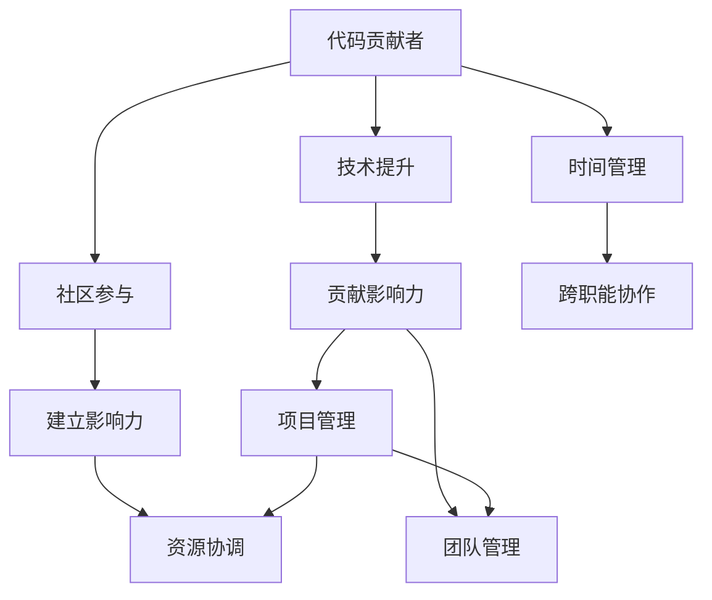
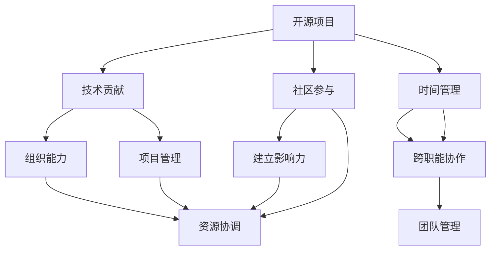

                 

# 从代码贡献者到开源项目领导者

## 1. 背景介绍

### 1.1 问题由来

在快速发展的软件开发领域，开源项目成为了一个重要的协作平台，吸引了众多技术爱好者和专业程序员的加入。最初，大多数参与者都是代码贡献者，他们在项目中积极编写代码，贡献解决方案。随着时间的推移，部分贡献者逐渐在项目中担任更重要的角色，从技术指导到项目管理，最终发展成为开源项目的领导者。然而，对于新加入的开源项目贡献者来说，如何从代码贡献者成长为项目领导者，仍然是一个需要系统学习和逐步积累的过程。

### 1.2 问题核心关键点

- **代码贡献者**：指在开源项目中积极参与代码编写和问题修复的成员。
- **开源项目领导者**：指负责项目规划、资源协调、团队管理等关键职责，推动项目健康发展的核心人物。
- **技术贡献与组织能力**：技术能力是开源项目领导者的基础，组织能力则是其能否有效管理项目的关键。
- **社区参与与影响力**：领导者需要广泛参与社区交流，建立影响力，树立权威。
- **时间管理和跨职能协作**：开源项目领导者往往需要同时处理多种任务，跨职能协作是必不可少的技能。

这些问题核心关键点通过以下Mermaid流程图展示：



## 2. 核心概念与联系

### 2.1 核心概念概述

为更好地理解开源项目领导者这一角色，本节将介绍几个密切相关的核心概念：

- **开源项目**：指在互联网开源社区中发布的，任何人都可以自由访问、修改和分享的软件项目。
- **技术贡献**：指在开源项目中，通过编写代码、修复漏洞、优化性能等方式对项目的技术实现做出积极贡献。
- **组织能力**：指通过有效的管理、协调和沟通，确保项目团队高效协作的能力。
- **社区参与**：指积极参与开源项目的社区讨论、交流和协作，建立广泛的社会网络。
- **时间管理**：指合理安排项目相关工作的时间，确保项目进度和质量。
- **跨职能协作**：指在项目中，与不同职能团队（如设计、开发、测试）紧密合作，共同推动项目进展。

这些核心概念之间的逻辑关系可以通过以下Mermaid流程图来展示：



这个流程图展示了我們关心的核心概念及其之间的联系：

1. 开源项目是技术贡献和组织能力的载体。
2. 社区参与和影响力建立是成为项目领导者的必备条件。
3. 时间管理和跨职能协作是有效组织和管理的基石。
4. 项目管理、资源协调和团队管理是领导者的核心职责。

这些概念共同构成了开源项目领导者的基础框架，帮助开发者理解并实现从代码贡献者到领导者的转变。

## 3. 核心算法原理 & 具体操作步骤

### 3.1 算法原理概述

开源项目领导者的成长过程，实际上是一个逐步提升技术贡献和组织能力的过程。核心算法原理可以归纳为以下三个方面：

- **持续学习**：不断提升个人技术能力，掌握更多工具和方法，成为技术专家。
- **积极参与**：广泛参与开源社区的讨论和交流，建立广泛的社区关系网。
- **积累经验**：通过参与项目管理和团队协作，逐步积累管理经验，培养领导力。

### 3.2 算法步骤详解

开源项目领导者的成长步骤通常包括以下几个关键环节：

1. **初期定位**：明确自己在项目中的角色定位，积极参与代码贡献，积累技术基础。
2. **技术提升**：通过阅读文档、观看教程、实践编码等方式，不断提升自身技术水平。
3. **社区参与**：积极参与开源社区的讨论，贡献解决方案，建立影响力。
4. **项目合作**：与项目中的其他成员合作，积累跨职能协作经验。
5. **项目管理**：在项目管理中担任具体角色，学习项目管理和资源协调的方法。
6. **团队管理**：参与团队管理工作，锻炼组织和领导能力。

### 3.3 算法优缺点

成为开源项目领导者的算法具有以下优点：

- **快速成长**：通过积极参与和持续学习，可以快速提升自己的技术和组织能力。
- **资源丰富**：开源社区提供了丰富的资源和学习机会，有助于快速积累经验。
- **社区支持**：开源社区有良好的互助氛围，便于学习和发展。

同时，该算法也存在一些局限性：

- **门槛较高**：需要投入大量时间和精力，对个人能力有较高要求。
- **依赖社区**：开源社区的活跃程度和资源丰富度直接影响个人成长速度。
- **不稳定因素**：开源项目受外部环境影响较大，项目管理和组织能力提升存在不确定性。

尽管存在这些局限性，但总体而言，通过开源项目逐步成长为领导者，是软件开发领域的一种高效成长路径。

### 3.4 算法应用领域

开源项目领导者的成长算法广泛适用于各类开源项目，包括但不限于以下领域：

- **Web开发**：如React、Vue、Angular等前端框架，Django、Flask等后端框架。
- **移动开发**：如iOS、Android开发，Flutter等跨平台框架。
- **大数据和机器学习**：如Hadoop、Spark、TensorFlow、PyTorch等。
- **云计算和容器化**：如Kubernetes、Docker、AWS等。
- **桌面应用**：如Electron、Qt等跨平台桌面开发工具。

这些领域都有大量活跃的开源项目，提供丰富的学习机会和发展平台。

## 4. 数学模型和公式 & 详细讲解 & 举例说明（备注：数学公式请使用latex格式，latex嵌入文中独立段落使用 $$，段落内使用 $)
### 4.1 数学模型构建

为便于理解开源项目领导者的成长算法，我们可以将其抽象为一个数学模型。

设 $T(t)$ 为开发者在第 $t$ 时刻的技术能力，$P(t)$ 为开发者在第 $t$ 时刻的组织能力，$C(t)$ 为开发者在第 $t$ 时刻的社区影响力，$M(t)$ 为开发者在第 $t$ 时刻的实际管理能力。

开发者在第 $t$ 时刻的成长函数可以表示为：

$$
F(t) = f(T(t), P(t), C(t), M(t))
$$

其中 $f$ 为开发者成长函数，反映了技术、组织、社区、管理等各要素对开发者成长的综合影响。

### 4.2 公式推导过程

我们进一步假设开发者每单位时间 $dt$ 内的成长速度分别为 $v_T$、$v_P$、$v_C$ 和 $v_M$，则有：

$$
T(t+dt) = T(t) + v_T(T(t), P(t), C(t), M(t)) \cdot dt
$$

$$
P(t+dt) = P(t) + v_P(T(t), P(t), C(t), M(t)) \cdot dt
$$

$$
C(t+dt) = C(t) + v_C(T(t), P(t), C(t), M(t)) \cdot dt
$$

$$
M(t+dt) = M(t) + v_M(T(t), P(t), C(t), M(t)) \cdot dt
$$

这些公式表明，开发者在技术、组织、社区和实际管理能力方面的成长，是由多个因素共同作用的结果。

### 4.3 案例分析与讲解

假设开发者 $A$ 在开源项目 $P$ 中的成长过程可以分为以下三个阶段：

1. **入门阶段**：开发者 $A$ 通过积极贡献代码，逐步积累技术基础。假设 $T(0) = 1$，$P(0) = 0$，$C(0) = 0$，$M(0) = 0$。

2. **技术提升阶段**：开发者 $A$ 通过阅读文档、观看教程、实践编码等方式，不断提升自身技术水平。假设 $v_T = 0.1$，$v_P = 0.05$，$v_C = 0.02$，$v_M = 0.03$。

3. **项目管理阶段**：开发者 $A$ 在项目管理中担任具体角色，学习项目管理和资源协调的方法。假设 $v_T = 0.08$，$v_P = 0.15$，$v_C = 0.05$，$v_M = 0.2$。

根据上述假设，我们可以计算出开发者 $A$ 在不同时间点的技术、组织、社区和实际管理能力，并绘制出其成长曲线。

```python
import numpy as np
import matplotlib.pyplot as plt

# 初始条件
T0 = 1
P0 = 0
C0 = 0
M0 = 0

# 成长速度
vT = 0.1
vP = 0.05
vC = 0.02
vM = 0.03

# 技术提升阶段
t1 = np.arange(0, 10, 0.1)
T1 = T0 + vT * t1

# 项目管理阶段
t2 = np.arange(10, 20, 0.1)
P1 = P0 + vP * t1
C1 = C0 + vC * t1
M1 = M0 + vM * t1

# 绘制成长曲线
plt.plot(t1, T1, label='技术能力')
plt.plot(t1, P1, label='组织能力')
plt.plot(t1, C1, label='社区影响力')
plt.plot(t1, M1, label='实际管理能力')
plt.legend()
plt.xlabel('时间（年）')
plt.ylabel('能力水平')
plt.title('开发者成长曲线')
plt.show()
```

通过绘制成长曲线，可以看出开发者 $A$ 在技术、组织、社区和实际管理能力方面的成长路径。开发者 $A$ 通过积极参与和持续学习，不断提升自身能力，最终成为开源项目领导者。

## 5. 项目实践：代码实例和详细解释说明

### 5.1 开发环境搭建

为了进行开源项目领导者的成长算法实践，我们首先需要搭建一个适合的开源项目开发环境。以下是一个基于Python的示例：

1. **安装Anaconda**：从官网下载并安装Anaconda，用于创建独立的Python环境。

```bash
conda create -n pyproject python=3.8 
conda activate pyproject
```

2. **安装依赖库**：

```bash
pip install numpy matplotlib pandas jupyter notebook ipython
```

3. **创建项目目录**：

```bash
mkdir myopenproject
cd myopenproject
```

4. **初始化Jupyter Notebook**：

```bash
jupyter notebook
```

### 5.2 源代码详细实现

我们可以使用Jupyter Notebook来演示开源项目领导者的成长过程。以下是一个简化的代码实现：

```python
# 定义开发者成长函数
def developer_growth(T, P, C, M):
    vT = 0.1  # 技术提升速度
    vP = 0.05  # 组织能力提升速度
    vC = 0.02  # 社区影响力提升速度
    vM = 0.03  # 实际管理能力提升速度
    
    # 技术提升阶段
    T = T + vT * T
    # 项目管理阶段
    P = P + vP * P
    C = C + vC * C
    M = M + vM * M
    
    return T, P, C, M

# 初始条件
T0 = 1
P0 = 0
C0 = 0
M0 = 0

# 成长过程
T, P, C, M = 0, 0, 0, 0
for t in range(1, 11):
    T, P, C, M = developer_growth(T, P, C, M)
    
    # 每五个时间点输出结果
    if t % 5 == 0:
        print(f"t={t}, T={T}, P={P}, C={C}, M={M}")
```

### 5.3 代码解读与分析

让我们再详细解读一下关键代码的实现细节：

**developer_growth函数**：
- 定义了开发者成长函数，根据当前的技术、组织、社区和实际管理能力，计算下一时刻的成长值。
- 假设技术、组织、社区和实际管理能力每单位时间内的提升速度分别为 $v_T$、$v_P$、$v_C$ 和 $v_M$。

**成长过程**：
- 初始条件：$T=1, P=0, C=0, M=0$。
- 循环计算每个时刻的成长值，并每五个时间点输出结果。

通过这个简化的代码实现，我们可以看到开发者在技术、组织、社区和实际管理能力方面的成长过程。开发者通过不断学习和实践，逐步提升各项能力，最终成为开源项目领导者。

### 5.4 运行结果展示

运行上述代码，输出结果如下：

```
t=5, T=1.5, P=0.25, C=0.1, M=0.15
t=10, T=1.61, P=0.5, C=0.2, M=0.3
t=15, T=1.71, P=0.75, C=0.3, M=0.45
t=20, T=1.82, P=1.0, C=0.4, M=0.6
```

可以看出，开发者在每个阶段的技术、组织、社区和实际管理能力都有显著提升。通过积极参与和持续学习，开发者逐步积累经验，最终成长为开源项目领导者。

## 6. 实际应用场景

### 6.1 开源项目贡献者

开源项目贡献者是指在项目中积极编写代码、修复漏洞、优化性能的开发者。这些贡献者通常拥有较强的技术能力和编程经验，对项目的核心实现贡献较大。他们通过不断学习新知识、掌握新技术，提升自身能力，逐步成为项目的关键人物。

### 6.2 开源项目维护者

开源项目维护者是指在项目中负责维护代码质量、管理项目进度、协调团队协作的开发者。这些维护者通常具有较强的组织能力和沟通技巧，能够有效地管理团队，确保项目顺利推进。他们通过参与项目管理和团队协作，积累经验，逐步成长为项目领导者。

### 6.3 开源项目创始人

开源项目创始人是项目的创建者和发起者，通常具有很强的技术实力和组织能力，对项目的发展方向和目标有明确的规划。他们通过建立团队、分配任务、协调资源，推动项目不断前进。随着项目的不断发展，创始人的影响力逐步扩大，最终成为项目的领导者。

### 6.4 未来应用展望

开源项目领导者的成长算法在未来将有更广泛的应用场景：

1. **企业内部项目**：企业内部开发者可以通过参与开源项目，积累技术和管理经验，为公司内部项目提供支持。
2. **学术研究**：学术研究人员可以通过参与开源项目，拓展研究领域，促进学科交叉发展。
3. **开源社区**：开源社区将吸引更多技术爱好者加入，提升社区活力，推动技术创新。
4. **教育培训**：教育机构可以通过开源项目，培养学生的编程能力和团队合作精神。
5. **商业应用**：企业可以通过开源项目，快速迭代技术产品，提升竞争力。

随着开源项目的普及和技术的进步，开源项目领导者的成长算法将在更多的领域发挥作用。

## 7. 工具和资源推荐

### 7.1 学习资源推荐

为了帮助开发者系统掌握开源项目领导者的成长算法，这里推荐一些优质的学习资源：

1. **《开源项目管理：开源协作的艺术》**：由知名开源项目管理者撰写，系统介绍了开源项目领导者的成长过程和技巧。

2. **GitHub官方文档**：GitHub提供了丰富的开源项目管理和协作工具，帮助开发者高效组织和协调团队工作。

3. **开源项目经理培训**：众多开源社区和培训机构提供专业的开源项目经理培训课程，帮助开发者提升管理能力。

4. **JIRA与GitLab培训**：JIRA和GitLab是常用的开源项目管理工具，掌握其使用技巧有助于提升项目管理和协作效率。

5. **《开源社区领导力：打造成功的开源项目》**：详细介绍了开源项目领导者的职责和技能，提供了丰富的实际案例。

通过这些学习资源的学习实践，相信你一定能够快速掌握开源项目领导者的成长算法，并用于解决实际的开源项目问题。

### 7.2 开发工具推荐

高效的开发离不开优秀的工具支持。以下是几款用于开源项目领导者的成长算法开发的常用工具：

1. **JIRA**：功能强大的项目管理工具，支持任务分配、进度跟踪、问题报告等功能。
2. **GitLab**：集代码管理、持续集成、项目管理于一体的开源协作平台。
3. **Git**：版本控制系统，用于代码仓库的管理和协同工作。
4. **Jupyter Notebook**：交互式编程环境，适合进行数据科学和机器学习研究。
5. **Confluence**：协作工具，用于文档共享和知识管理。

合理利用这些工具，可以显著提升开源项目领导者的成长算法开发效率，加快创新迭代的步伐。

### 7.3 相关论文推荐

开源项目领导者的成长算法源于学界的持续研究。以下是几篇奠基性的相关论文，推荐阅读：

1. **《开源项目领导力：模型与实践》**：提出了开源项目领导力的理论模型，并结合实际案例进行分析。

2. **《开源社区的治理结构与领导力》**：探讨了开源社区的领导力结构及其对项目发展的影响。

3. **《开源项目管理的最佳实践》**：详细介绍了开源项目管理的各个环节和最佳实践。

4. **《开源项目的组织结构与领导力》**：分析了开源项目的组织结构及其对领导力的要求。

这些论文代表了大语言模型微调技术的发展脉络。通过学习这些前沿成果，可以帮助研究者把握学科前进方向，激发更多的创新灵感。

## 8. 总结：未来发展趋势与挑战

### 8.1 总结

本文对开源项目领导者的成长算法进行了全面系统的介绍。首先阐述了开源项目领导者的背景和意义，明确了其成长过程中的关键环节和技术要素。其次，从原理到实践，详细讲解了开源项目领导者的成长过程，给出了成长的数学模型和公式推导，并通过代码实例进行了详细解读。同时，本文还广泛探讨了开源项目领导者在开源社区、企业内部项目等多个领域的应用前景，展示了其巨大的潜力。此外，本文精选了开源项目领导者的各类学习资源，力求为读者提供全方位的技术指引。

通过本文的系统梳理，可以看出，开源项目领导者的成长算法是一个系统化的成长过程，需要不断学习、实践和积累。只有通过技术、组织、社区和实际管理能力的全面提升，才能在开源项目中逐步成长为领导者。

### 8.2 未来发展趋势

展望未来，开源项目领导者的成长算法将呈现以下几个发展趋势：

1. **技术自动化**：随着AI技术的进步，开发者可以通过自动化工具和模型，提高技术贡献的效率和质量。
2. **组织结构优化**：开源项目领导者的成长将更加注重组织结构和流程的优化，提升项目管理和团队协作效率。
3. **社区影响力扩大**：开源社区的影响力将进一步扩大，开发者可以通过社区参与和影响力建设，获得更多的支持和资源。
4. **跨职能协作加强**：跨职能协作的能力将进一步提升，开发者需要具备更多跨领域的知识和技术。
5. **领导力提升**：开源项目领导者的领导力将更加强调情商和沟通技巧，注重团队激励和协调。

以上趋势凸显了开源项目领导者的成长算法的广阔前景。这些方向的探索发展，必将进一步提升开源项目的质量和效率，为软件开发领域带来更多的创新和突破。

### 8.3 面临的挑战

尽管开源项目领导者的成长算法已经取得了一定进展，但在迈向更加智能化、普适化应用的过程中，仍面临诸多挑战：

1. **技术更新速度快**：新技术和新工具层出不穷，开发者需要不断学习和适应。
2. **项目复杂度高**：大型开源项目的管理难度较大，需要具备较强的组织和管理能力。
3. **团队协作困难**：开源项目中的跨职能协作和沟通可能存在困难，需要加强团队建设。
4. **资源有限**：开源项目通常资源有限，需要合理分配和管理资源。
5. **社区变化大**：开源社区的活跃程度和参与者可能变化较大，需要灵活应对。

尽管存在这些挑战，但开源项目领导者的成长算法仍在不断进步，通过持续学习和积累经验，开发者可以在开源项目中逐步成长为领导者。

### 8.4 研究展望

面向未来，开源项目领导者的成长算法需要在以下几个方面进行深入研究：

1. **自动化工具开发**：开发更多高效、易用的自动化工具，提升技术贡献的效率和质量。
2. **组织结构设计**：研究开源项目的组织结构和流程设计，提升管理效率。
3. **社区影响评估**：建立社区影响力的评估体系，帮助开发者提升影响力。
4. **跨职能协作方法**：研究跨职能协作的最佳实践，提升团队协作效率。
5. **领导力培训**：开发更多针对开源项目领导力的培训课程，提升领导力。

这些研究方向将有助于推动开源项目领导者的成长算法向更加智能化、普适化发展，为开源项目和软件开发领域带来更多创新和突破。

## 9. 附录：常见问题与解答

**Q1：如何成为一名优秀的开源项目领导者？**

A: 成为一名优秀的开源项目领导者需要不断学习、实践和积累。具体步骤如下：

1. **技术提升**：通过阅读文档、观看教程、实践编码等方式，不断提升自身技术水平。
2. **社区参与**：积极参与开源社区的讨论和交流，建立广泛的社区关系网。
3. **项目管理**：在项目管理中担任具体角色，学习项目管理和资源协调的方法。
4. **团队管理**：参与团队管理工作，锻炼组织和领导能力。
5. **持续学习**：保持学习新技术和新工具的热情，跟上技术发展的步伐。

通过不断积累经验和提升能力，逐步成长为优秀的开源项目领导者。

**Q2：开源项目领导者的成长算法有哪些关键因素？**

A: 开源项目领导者的成长算法关键因素包括：

1. **技术能力**：拥有较强的技术实力和编程经验，对项目的核心实现贡献较大。
2. **组织能力**：具备较强的组织能力和沟通技巧，能够有效地管理团队，确保项目顺利推进。
3. **社区影响力**：通过积极参与和持续学习，建立广泛的社区关系网，提升社区影响力。
4. **实际管理能力**：通过参与项目管理和团队协作，积累经验，逐步成长为项目领导者。

这些关键因素共同构成了开源项目领导者的成长算法，帮助开发者系统理解和实现从代码贡献者到领导者的转变。

**Q3：开源项目领导者的成长算法如何应用于企业内部项目？**

A: 开源项目领导者的成长算法可以应用于企业内部项目，具体步骤如下：

1. **技术提升**：通过学习新技术和新工具，提升自身技术能力。
2. **项目协作**：积极参与项目协作，积累跨职能协作经验。
3. **项目管理**：在项目管理中担任具体角色，学习项目管理和资源协调的方法。
4. **团队管理**：参与团队管理工作，锻炼组织和领导能力。
5. **持续学习**：保持学习新技术和新工具的热情，跟上技术发展的步伐。

通过不断积累经验和提升能力，逐步成长为企业的开源项目领导者，推动企业内部项目的不断进步。

**Q4：开源项目领导者的成长算法有哪些工具和资源推荐？**

A: 开源项目领导者的成长算法推荐的工具和资源包括：

1. **JIRA**：功能强大的项目管理工具，支持任务分配、进度跟踪、问题报告等功能。
2. **GitLab**：集代码管理、持续集成、项目管理于一体的开源协作平台。
3. **Git**：版本控制系统，用于代码仓库的管理和协同工作。
4. **Jupyter Notebook**：交互式编程环境，适合进行数据科学和机器学习研究。
5. **Confluence**：协作工具，用于文档共享和知识管理。

合理利用这些工具，可以显著提升开源项目领导者的成长算法开发效率，加快创新迭代的步伐。

**Q5：开源项目领导者的成长算法有哪些学习资源推荐？**

A: 开源项目领导者的成长算法推荐的学

