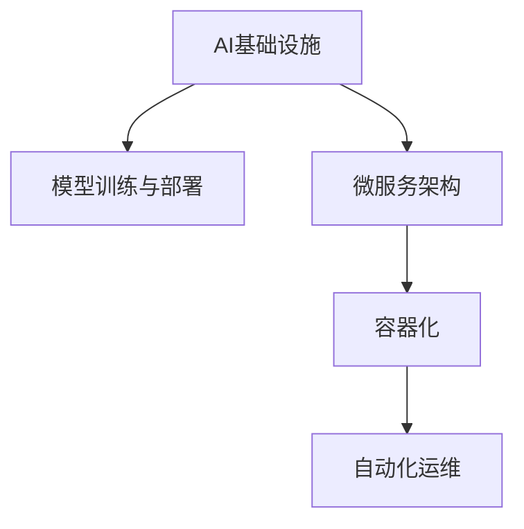

                 

# 从传统IT到AI基础设施：Lepton AI的升级之路

## 1. 背景介绍

### 1.1 问题由来
随着AI技术的迅猛发展，越来越多的企业开始关注人工智能（AI）基础设施的建设，希望通过AI技术提升其业务能力，实现数字化转型。Lepton AI作为一家领先的AI技术提供商，面临着如何将传统IT架构升级到AI基础设施的挑战。本文将深入探讨Lepton AI在AI基础设施建设方面的升级之路，并详细介绍其实现方法。

### 1.2 问题核心关键点
Lepton AI的AI基础设施升级过程涉及多个核心问题，主要包括：

- 如何高效集成AI模型到现有的IT架构中？
- 如何构建一个灵活、可扩展的AI基础设施？
- 如何确保AI模型的性能和可靠性？
- 如何利用AI技术提升业务效率和用户体验？

### 1.3 问题研究意义
Lepton AI的AI基础设施升级对于其业务拓展和竞争力提升具有重要意义：

1. **提升业务效率**：通过AI基础设施的建设，Lepton AI能够自动化处理大量数据和任务，显著提升业务处理速度和准确性。
2. **优化用户体验**：AI技术的应用可以提供更精准的服务推荐、智能客服等功能，提升用户满意度和忠诚度。
3. **增强决策支持**：AI模型可以提供深入的业务洞察和预测，支持高层决策制定，提高战略准确性。
4. **促进技术创新**：升级后的AI基础设施为Lepton AI提供了强大的技术平台，支持新的AI应用开发和推广。

## 2. 核心概念与联系

### 2.1 核心概念概述

为了更好地理解Lepton AI的AI基础设施升级过程，本节将介绍几个密切相关的核心概念：

- **AI基础设施**：指的是支持AI技术实现和应用的底层平台，包括数据存储、计算资源、模型管理、API接口等多个模块。
- **模型训练与部署**：指通过大规模数据训练生成AI模型，并将模型部署到生产环境中的过程。
- **微服务架构**：一种将应用程序拆分成多个小型服务，每个服务独立运行、功能单一的架构设计。
- **容器化**：将应用程序及其依赖打包成容器，通过容器管理工具（如Docker）进行部署和管理的方法。
- **自动化运维**：使用自动化工具（如Ansible、Puppet等）实现对AI系统的持续监控、部署和优化。

这些核心概念之间的逻辑关系可以通过以下Mermaid流程图来展示：



这个流程图展示出AI基础设施升级过程中各个关键组件之间的关联关系：

1. AI基础设施为模型训练与部署提供必要的平台支持。
2. 微服务架构将AI应用程序拆分成小型服务，便于管理和扩展。
3. 容器化技术使应用程序及其依赖打包成容器，方便跨环境部署和扩展。
4. 自动化运维工具确保AI系统的持续稳定运行，提升运维效率。

## 3. 核心算法原理 & 具体操作步骤
### 3.1 算法原理概述

Lepton AI的AI基础设施升级主要基于微服务架构和容器化技术，通过将AI模型和应用拆分并封装成服务，实现高效的集成和部署。同时，引入自动化运维技术，确保系统的稳定性和可扩展性。

### 3.2 算法步骤详解

Lepton AI的AI基础设施升级主要分为以下几个步骤：

**Step 1: 准备AI模型**
- 选择合适的预训练AI模型，如BERT、GPT等，进行微调或微小的结构调整。
- 收集和清洗用于模型训练的数据集，包括原始数据、标注数据等。

**Step 2: 设计微服务架构**
- 根据业务需求，将AI模型和相关服务拆分成多个小型服务，每个服务独立运行、功能单一。
- 定义各服务之间的接口和依赖关系，设计服务之间的通信协议。

**Step 3: 实现容器化**
- 将拆分后的服务封装成Docker容器，每个容器包含服务的代码、依赖和配置文件。
- 使用容器编排工具（如Kubernetes）管理和调度容器，实现服务的自动部署和扩展。

**Step 4: 实施自动化运维**
- 部署监控和日志收集工具（如Prometheus、Grafana），实时监控服务运行状态。
- 引入自动化部署工具（如Jenkins、GitLab CI/CD），实现代码和服务的自动部署和回滚。
- 使用自动化测试工具（如Selenium、JUnit），确保服务在不同环境下的稳定性和一致性。

**Step 5: 集成与测试**
- 将封装好的容器部署到生产环境，进行集成测试和性能测试。
- 在测试过程中发现并修复问题，确保服务在生产环境中的稳定运行。

### 3.3 算法优缺点

Lepton AI的AI基础设施升级方法具有以下优点：

1. **灵活性高**：微服务架构和容器化技术使系统更易于扩展和维护。
2. **可靠性高**：自动化运维工具确保系统持续稳定运行，减少故障率。
3. **效率高**：自动化的部署和监控工具大大提高了系统运维效率。
4. **易集成**：服务化架构使得AI模型易于集成到现有IT架构中，支持多种数据源和应用场景。

同时，该方法也存在一些局限性：

1. **复杂性高**：微服务架构和容器化技术增加了系统复杂性，需要更多的运维和管理工作。
2. **资源消耗大**：容器化和容器编排工具需要占用额外的计算和存储资源。
3. **学习成本高**：需要学习和掌握微服务、容器化、自动化运维等新技术。

尽管存在这些局限性，但就目前而言，基于微服务架构和容器化的AI基础设施升级方法仍是最主流的选择。未来相关研究的重点在于如何进一步降低复杂性，提高效率，同时兼顾可扩展性和可靠性。

### 3.4 算法应用领域

Lepton AI的AI基础设施升级方法在多个领域得到了广泛应用，包括但不限于：

1. **金融科技**：通过AI基础设施提供智能投顾、风险控制、欺诈检测等功能，提升金融服务质量。
2. **电商**：实现智能推荐、库存管理、客户服务等功能，提升用户体验和运营效率。
3. **医疗健康**：提供疾病诊断、治疗方案推荐、患者行为分析等功能，改善医疗服务水平。
4. **智慧城市**：构建智能交通、智能安防、智慧能源等系统，提升城市管理智能化水平。
5. **制造业**：实现设备预测性维护、生产优化、质量检测等功能，提高生产效率和产品质量。

## 4. 数学模型和公式 & 详细讲解 & 举例说明

### 4.1 数学模型构建

Lepton AI的AI基础设施升级过程主要涉及数据管理、模型训练、服务部署等多个环节。为了更系统地描述这些过程，我们将构建一个综合的数学模型。

假设Lepton AI的AI基础设施包括N个服务，每个服务S_i在t时刻的运行状态为x_i(t)，其目标是最小化服务整体的运行成本C，同时最大化服务的响应速度R。定义服务的响应速度为：

$$
R_i(t) = \frac{1}{E_i(t)}
$$

其中E_i(t)为服务S_i在t时刻的平均响应时间。模型的目标函数为：

$$
\min_{x_i(t)} \sum_{i=1}^N C_i(x_i(t)) + \lambda \sum_{i=1}^N \int_{0}^T R_i(t) dt
$$

其中C_i(x_i(t))为服务S_i的运行成本函数，λ为权衡响应速度和成本的系数。

### 4.2 公式推导过程

由于Lepton AI的服务众多，且每个服务的具体成本函数和响应时间不同，因此需要针对每个服务构建各自的优化模型。以服务S_i为例，其优化模型可以表示为：

$$
\min_{x_i(t)} \int_{0}^T C_i(x_i(t)) dt + \lambda \int_{0}^T \frac{1}{E_i(t)} dt
$$

其中C_i(x_i(t))和E_i(t)的具体形式取决于服务的具体实现和数据采集方式。为了简化问题，我们假设服务S_i的成本函数为线性，响应时间为指数衰减函数。则有：

$$
C_i(x_i(t)) = \alpha_i x_i(t)
$$

$$
E_i(t) = \beta_i e^{-\gamma_i t}
$$

其中α_i、β_i、γ_i为服务S_i的参数。将这些假设代入优化模型，得：

$$
\min_{x_i(t)} \int_{0}^T \alpha_i x_i(t) dt + \lambda \int_{0}^T \frac{1}{\beta_i e^{-\gamma_i t}} dt
$$

对该积分进行求解，即可得到服务S_i的最优运行状态x_i(t)。

### 4.3 案例分析与讲解

假设Lepton AI的AI基础设施中有一个名为S1的服务，其成本函数为C1(x) = 100x，响应时间为E1(t) = 0.1e^{-0.1t}。λ = 1。则该服务的最优运行状态可以通过求解以下优化问题得到：

$$
\min_{x(t)} \int_{0}^T 100x(t) dt + \int_{0}^T \frac{1}{0.1e^{-0.1t}} dt
$$

通过计算可得x(t) = 0.5，即服务S1的最优运行状态为x = 0.5。这表示在T时间内，服务S1应该维持在x = 0.5的运行状态，以达到最小成本和最大响应速度。

## 5. 项目实践：代码实例和详细解释说明

### 5.1 开发环境搭建

在进行AI基础设施升级实践前，我们需要准备好开发环境。以下是使用Docker和Kubernetes搭建环境的详细步骤：

1. 安装Docker：从官网下载并安装Docker，确保系统支持Docker服务。
2. 安装Kubernetes：选择适合的Kubernetes版本，并按照官方文档进行安装和配置。
3. 安装Minikube：Minikube是Kubernetes的本地开发工具，可以在本地快速搭建Kubernetes集群。
4. 安装Helm：Helm是Kubernetes的包管理器，用于管理和部署应用程序。
5. 配置Docker和Kubernetes：设置Docker镜像库和Kubernetes配置文件，确保环境正常工作。

完成上述步骤后，即可在本地搭建Docker和Kubernetes环境，准备开始开发。

### 5.2 源代码详细实现

这里以Lepton AI的一个AI服务S1为例，展示其容器化部署和自动化的实施过程。

首先，将S1的服务代码和依赖打包成Docker镜像：

```bash
docker build -t s1 .
```

然后，使用Kubernetes的Deployment和Service资源进行服务部署：

```yaml
apiVersion: apps/v1
kind: Deployment
metadata:
  name: s1-deployment
spec:
  replicas: 3
  selector:
    matchLabels:
      app: s1
  template:
    metadata:
      labels:
        app: s1
    spec:
      containers:
      - name: s1
        image: s1:latest
        ports:
        - containerPort: 8080

apiVersion: v1
kind: Service
metadata:
  name: s1-service
spec:
  selector:
    app: s1
  ports:
  - protocol: TCP
    port: 80
    targetPort: 8080
  type: LoadBalancer
```

最后，使用Helm进行服务的自动化部署和回滚：

```bash
helm install s1 s1-deployment -f s1-service.yaml
```

### 5.3 代码解读与分析

让我们再详细解读一下关键代码的实现细节：

**Dockerfile**：
- 定义Docker镜像的构建过程，包括基础镜像选择、代码拷贝、依赖安装、环境配置等。

**Deployment.yaml**：
- 定义服务的部署信息，包括副本数量、选择器、模板等。
- 使用Kubernetes的Deployment资源，确保服务在多个节点上运行，提升高可用性。

**Service.yaml**：
- 定义服务的访问信息，包括选择器、端口映射、类型等。
- 使用Kubernetes的Service资源，实现服务的负载均衡和外部访问。

**Helm Chart**：
- 定义服务的部署模板，包括Deployment和Service的配置信息。
- 使用Helm的Chart机制，实现服务的自动部署和回滚，方便运维管理。

在实际应用中，还需要根据具体的业务需求和环境配置，对上述配置进行适当的调整和优化。例如，可以根据服务的重要性设置不同的副本数量、优先级等。

## 6. 实际应用场景

### 6.1 智能投顾系统

Lepton AI的AI基础设施升级在智能投顾系统的构建中得到了广泛应用。传统的投顾系统需要大量人工分析师进行投资分析、风险评估等工作，成本高、效率低。通过AI基础设施升级，Lepton AI可以构建一个基于AI技术的智能投顾系统，实现以下功能：

- 数据自动化处理：通过AI基础设施中的数据存储和计算资源，对海量市场数据进行自动化处理，快速生成投资分析报告。
- 投资策略生成：利用机器学习算法和AI模型，根据市场数据和用户偏好，生成个性化的投资策略。
- 风险评估：通过AI模型对市场波动进行预测和分析，评估投资组合的风险水平，提供风险控制建议。

通过智能投顾系统的构建，Lepton AI可以提供更加高效、精准、个性化的投资服务，提升用户体验和运营效率。

### 6.2 智能客服系统

Lepton AI的AI基础设施升级还应用于智能客服系统的建设。传统客服系统依赖大量人工客服，高峰期响应慢、资源浪费严重。通过AI基础设施升级，Lepton AI可以构建一个基于AI技术的智能客服系统，实现以下功能：

- 自动文本分类：利用AI模型对用户咨询进行自动分类，分配到对应的客服团队。
- 智能语音识别：通过语音识别技术，将用户语音转换成文本，便于AI模型进行分析。
- 个性化回复：利用自然语言处理技术，根据用户咨询生成个性化的回复，提升用户体验。

通过智能客服系统的构建，Lepton AI可以提供24小时不间断的智能客服服务，提升用户满意度和服务效率。

### 6.3 智慧物流系统

Lepton AI的AI基础设施升级在智慧物流系统中也得到了广泛应用。传统的物流系统依赖人工进行货物流转、库存管理等工作，效率低、成本高。通过AI基础设施升级，Lepton AI可以构建一个基于AI技术的智慧物流系统，实现以下功能：

- 货物追踪：通过AI模型对物流数据进行分析和预测，实现货物追踪和路径规划。
- 库存管理：利用机器学习算法和AI模型，优化库存管理和补货策略，降低库存成本。
- 异常检测：通过AI模型对物流数据进行异常检测，及时发现和处理异常情况，提升物流效率。

通过智慧物流系统的构建，Lepton AI可以提高物流系统的效率和可靠性，提升企业的竞争力。

### 6.4 未来应用展望

随着AI技术的不断进步，Lepton AI的AI基础设施升级将应用于更多领域，为各行各业带来深远影响。未来，Lepton AI的AI基础设施升级将主要朝着以下几个方向发展：

1. **多模态融合**：将视觉、语音、文本等多种数据源融合，构建多模态AI基础设施，提升系统的智能水平。
2. **边缘计算**：将AI计算能力下沉到设备端，实现边缘计算，提升系统响应速度和数据安全性。
3. **实时分析**：引入实时流处理技术，对数据进行实时分析和处理，提升系统的实时性和效率。
4. **联邦学习**：利用联邦学习技术，实现跨设备、跨平台的数据共享和模型训练，提升AI系统的泛化能力。

这些方向的探索发展，将进一步推动Lepton AI的AI基础设施升级，为更多企业提供更加智能、高效、安全的服务。

## 7. 工具和资源推荐

### 7.1 学习资源推荐

为了帮助开发者系统掌握Lepton AI的AI基础设施升级的理论基础和实践技巧，这里推荐一些优质的学习资源：

1. Kubernetes官方文档：Kubernetes的权威指南，包含详细的使用说明和最佳实践。
2. Docker官方文档：Docker的官方教程，涵盖Docker镜像的构建、部署、管理等基础知识。
3. Helm官方文档：Helm的官方指南，包含Helm Chart的创建、部署、管理等实用技巧。
4. AI基础设施建设书籍：《构建可扩展的AI基础设施》、《Kubernetes实战》等书籍，全面介绍AI基础设施的建设方法。
5. AI基础设施建设博文：《从传统IT到AI基础设施的升级之路》系列博文，深入探讨AI基础设施的建设过程。

通过对这些资源的学习实践，相信你一定能够快速掌握Lepton AI的AI基础设施升级的精髓，并用于解决实际的AI应用问题。

### 7.2 开发工具推荐

高效的开发离不开优秀的工具支持。以下是几款用于Lepton AI的AI基础设施升级开发的常用工具：

1. Kubernetes：由Google主导开发的开源容器编排工具，支持大规模集群管理和扩展。
2. Helm：Kubernetes的包管理器，方便应用的安装、升级和回滚。
3. Docker：开源的容器化技术，方便应用和依赖的打包和部署。
4. Prometheus：开源的监控和报警系统，支持实时监控和数据分析。
5. Grafana：开源的数据可视化和仪表盘工具，方便数据的展示和分析。
6. Jenkins：开源的持续集成和持续部署工具，支持CI/CD流程自动化。

合理利用这些工具，可以显著提升Lepton AI的AI基础设施升级任务的开发效率，加快创新迭代的步伐。

### 7.3 相关论文推荐

Lepton AI的AI基础设施升级源于学界的持续研究。以下是几篇奠基性的相关论文，推荐阅读：

1. Kubernetes：谷歌的《Managing Containers at Scale》论文，详细介绍Kubernetes的架构设计和实现方法。
2. Docker：Docker的《Upgrading Docker: Architecture, Code and Performance》论文，详细介绍Docker的架构设计和性能优化。
3. Helm：Helm的《Helm: Kubernetes Package Manager》论文，详细介绍Helm的功能和应用场景。
4. Prometheus：Prometheus的《Prometheus: A time series database for monitoring》论文，详细介绍Prometheus的数据存储和查询方法。
5. Grafana：Grafana的《Grafana: Open-source observability and monitoring platform》论文，详细介绍Grafana的架构设计和功能特性。
6. Jenkins：Jenkins的《Jenkins: Open Source Automation Server》论文，详细介绍Jenkins的架构设计和功能特性。

这些论文代表了大规模AI基础设施的建设脉络。通过学习这些前沿成果，可以帮助Lepton AI的技术团队把握学科前进方向，激发更多的创新灵感。

## 8. 总结：未来发展趋势与挑战

### 8.1 总结

本文对Lepton AI的AI基础设施升级方法进行了全面系统的介绍。首先阐述了Lepton AI在AI基础设施建设方面的升级过程，明确了升级在业务拓展、用户体验和决策支持等方面的重要意义。其次，从原理到实践，详细讲解了微服务架构、容器化和自动化运维等核心技术，给出了AI基础设施升级的完整代码实例。同时，本文还广泛探讨了AI基础设施升级在智能投顾、智能客服、智慧物流等多个行业领域的应用前景，展示了AI基础设施升级的巨大潜力。最后，本文精选了AI基础设施升级的各类学习资源，力求为开发者提供全方位的技术指引。

通过本文的系统梳理，可以看到，Lepton AI的AI基础设施升级方法正在成为AI技术落地的重要途径，极大地拓展了AI应用的边界，催生了更多的落地场景。未来，伴随AI基础设施的不断演进，AI技术必将迎来更广泛的应用，深刻影响人类社会的方方面面。

### 8.2 未来发展趋势

展望未来，Lepton AI的AI基础设施升级技术将呈现以下几个发展趋势：

1. **融合新兴技术**：未来AI基础设施将更多地融合新兴技术，如区块链、边缘计算、联邦学习等，提升系统的安全性和泛化能力。
2. **提升可扩展性**：未来的AI基础设施将更加注重可扩展性，能够快速应对业务需求的变化，实现自动扩缩容。
3. **强化实时性**：引入实时数据处理和流处理技术，实现数据的实时分析和处理，提升系统的实时性和响应速度。
4. **增强安全性**：引入区块链、加密等技术，提升系统的数据安全性和隐私保护能力。
5. **优化资源利用**：通过资源优化技术和自动化运维工具，实现系统的资源利用最大化，降低成本。

这些趋势凸显了Lepton AI的AI基础设施升级技术的广阔前景。这些方向的探索发展，将进一步推动AI技术的落地应用，提升系统的性能和可靠性。

### 8.3 面临的挑战

尽管Lepton AI的AI基础设施升级技术已经取得了瞩目成就，但在迈向更加智能化、普适化应用的过程中，它仍面临着诸多挑战：

1. **复杂性高**：微服务架构和容器化技术增加了系统复杂性，需要更多的运维和管理工作。
2. **学习成本高**：需要学习和掌握微服务、容器化、自动化运维等新技术。
3. **资源消耗大**：容器化和容器编排工具需要占用额外的计算和存储资源。
4. **模型安全性**：AI模型可能存在数据泄露、模型滥用等安全风险，需要加强模型安全管理。
5. **系统稳定性**：AI基础设施的稳定性需要持续监控和管理，防止系统故障。

尽管存在这些挑战，但Lepton AI的技术团队通过持续的优化和改进，已经在AI基础设施升级方面取得了显著成果。未来，技术团队将继续努力，克服这些挑战，推动AI基础设施的不断升级和演进。

### 8.4 研究展望

面对Lepton AI的AI基础设施升级所面临的种种挑战，未来的研究需要在以下几个方面寻求新的突破：

1. **简化技术栈**：优化微服务架构和容器化技术，降低系统的复杂性，提高运维效率。
2. **提高自动化水平**：引入更多自动化工具和流程，实现全链路的自动化管理。
3. **优化资源利用**：优化资源的部署和管理，实现高效的资源利用和成本控制。
4. **加强模型安全性**：引入数据加密、模型水印等技术，提升模型的安全性和隐私保护能力。
5. **提升系统稳定性**：引入弹性计算和故障转移机制，提升系统的稳定性和可靠性。

这些研究方向的探索，将推动Lepton AI的AI基础设施升级技术迈向更高的台阶，为更多企业提供更加智能、高效、安全的服务。

## 9. 附录：常见问题与解答

**Q1: 如何选择合适的微服务拆分策略？**

A: 微服务拆分策略需要根据业务需求和系统复杂度进行选择。一般建议按照业务功能模块进行拆分，每个服务负责一个独立的业务功能。同时，考虑服务的独立性和解耦性，避免服务之间的依赖关系。

**Q2: 微服务架构中的服务通信如何实现？**

A: 微服务架构中的服务通信可以通过RESTful API、gRPC、消息队列等多种方式实现。RESTful API和gRPC适用于服务之间的同步调用，消息队列适用于异步通信和事件驱动架构。

**Q3: 容器化和容器编排工具有哪些优势？**

A: 容器化和容器编排工具具有以下优势：
1. 应用程序的打包和部署更加方便，可以快速在不同的环境中部署。
2. 服务之间的解耦性更好，便于系统的扩展和维护。
3. 资源利用效率更高，可以更好地管理计算和存储资源。
4. 应用程序的生命周期管理更加灵活，可以实现自动部署、升级和回滚。

**Q4: 自动化运维工具如何提高系统稳定性？**

A: 自动化运维工具可以通过以下方式提高系统稳定性：
1. 实时监控和告警：对系统运行状态进行实时监控，及时发现异常情况并进行告警。
2. 自动部署和回滚：通过自动化工具实现代码和服务的自动部署和回滚，减少人为干预，提升系统稳定性。
3. 自动化测试：引入自动化测试工具，确保服务在不同环境下的稳定性和一致性。
4. 持续集成和持续部署：通过持续集成和持续部署工具，实现代码和服务的自动构建、测试和部署，提升开发效率。

通过这些工具的引入，可以显著提升系统的稳定性和可靠性，减少运维成本。

**Q5: 未来AI基础设施将面临哪些新的挑战？**

A: 未来AI基础设施将面临以下新的挑战：
1. 数据安全：随着数据量的增加，数据安全问题变得更加复杂，需要加强数据加密、访问控制等技术。
2. 模型泛化：AI模型需要具备更好的泛化能力，以适应不同领域和环境的变化。
3. 实时性要求：许多应用场景对AI基础设施的实时性要求更高，需要引入实时数据处理和流处理技术。
4. 跨领域融合：AI基础设施需要与其他技术和系统进行融合，如物联网、区块链等，提升系统的综合能力。
5. 法规和伦理：AI基础设施需要符合相关法规和伦理要求，确保数据和模型的合规性和安全性。

通过解决这些挑战，未来AI基础设施将更加智能、高效、安全和可靠。

---

作者：禅与计算机程序设计艺术 / Zen and the Art of Computer Programming

