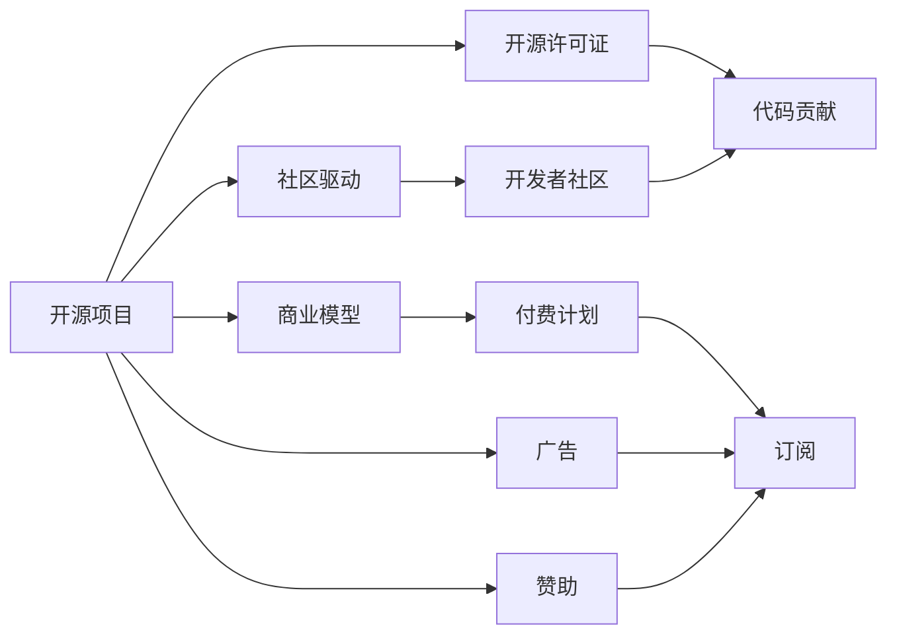

                 

# 从免费到付费：开源项目的定价策略

开源项目一直是软件生态系统中不可或缺的一部分，它们由社区驱动，旨在通过协作的方式推动技术进步和创新。然而，随着开源项目越来越受企业和个人用户欢迎，如何为其找到一种可持续的商业模式，成为了一个重要的议题。本文将探讨开源项目的定价策略，帮助开发者和用户理解如何在开源与商业化之间找到平衡。

## 1. 背景介绍

### 1.1 开源项目的起源与演变

开源项目的历史可以追溯到1970年代的Unix操作系统和后来的Linux。早期，这些项目的主要目标是提供一个免费、灵活的操作系统，以供个人和商业使用。然而，随着时间的推移，开源项目的范围和应用领域大大扩展，成为了技术创新和商业应用的重要驱动力。

### 1.2 开源项目的现状

如今，开源项目几乎涵盖了所有技术领域，从软件开发、网络安全到人工智能、区块链等。它们不仅在技术社区中广受欢迎，还逐渐被企业和政府机构采纳。然而，随着用户基础和商业应用的增加，开源项目的可持续性开始受到质疑，特别是在如何平衡免费使用与商业利益方面。

## 2. 核心概念与联系

### 2.1 核心概念概述

在探讨定价策略之前，我们先明确几个核心概念：

- **开源项目**：指使用开源许可证（如GPL、Apache等）发布的软件项目，其源代码可自由访问、使用和修改。
- **社区驱动**：开源项目由开发者社区而非单一实体驱动，强调协作和共同贡献。
- **商业模式**：指开源项目通过何种方式实现其经济上的可持续性。

### 2.2 核心概念原理和架构的 Mermaid 流程图



这个图表展示了开源项目的关键组件和它们之间的关系：开源许可证、开发者社区、代码贡献、商业模型和多种盈利方式（如付费计划、广告、赞助）。

## 3. 核心算法原理 & 具体操作步骤

### 3.1 算法原理概述

开源项目的定价策略通常涉及以下几个方面：

- **付费计划**：用户可以选择购买订阅，以获得额外的功能和支持。
- **广告支持**：通过在其产品中嵌入广告，从广告收入中获利。
- **赞助和捐赠**：企业或个人可以捐赠资金或资源，以换取品牌曝光或技术支持。
- **企业定制**：提供定制化的解决方案，以满足企业的特定需求。

### 3.2 算法步骤详解

以下是详细的定价策略操作步骤：

1. **市场分析**：
   - 分析目标市场的需求和竞争情况，确定潜在的盈利模式。
   - 识别目标用户的痛点和需求，设计定制化解决方案。

2. **定价模型设计**：
   - 根据用户类型和需求，设计不同的付费计划。
   - 确定广告的类型和位置，计算预期广告收入。
   - 设计捐赠和赞助计划，鼓励用户和企业的支持。

3. **定价策略实施**：
   - 通过社区讨论和投票，确定定价策略。
   - 在项目中实施定价策略，并持续监控其效果。

4. **反馈和优化**：
   - 收集用户和社区的反馈，评估定价策略的效果。
   - 根据反馈调整定价策略，以更好地满足用户需求。

### 3.3 算法优缺点

**优点**：
- 提供多种盈利方式，适应不同用户的支付能力。
- 通过社区反馈和调整，优化定价策略，提高用户满意度。

**缺点**：
- 定价复杂，需要考虑多种因素，包括成本、市场需求、竞争情况等。
- 定价策略需要频繁调整，以适应市场变化，可能增加管理和运营成本。

### 3.4 算法应用领域

定价策略不仅适用于开源软件项目，还适用于其他类型的开源项目，如开源硬件、开源云服务等。这些项目的定价策略设计原则相似，但具体实施时需要考虑不同的成本结构和市场需求。

## 4. 数学模型和公式 & 详细讲解 & 举例说明

### 4.1 数学模型构建

假设一个开源项目的定价策略如下：

- **基础版**：免费提供基本功能，用户可以访问代码和文档。
- **付费版**：提供高级功能、技术支持和定制化服务，价格为 $P$ 美元/年。

令 $N$ 为付费用户数，$C$ 为开发和维护成本，$A$ 为广告收入，$S$ 为赞助和捐赠收入。则总收入 $R$ 可以表示为：

$$ R = N \cdot P + A + S $$

其中，$A$ 和 $S$ 分别由广告收入和赞助收入决定，而 $N$ 则受到定价策略的影响。

### 4.2 公式推导过程

假设一个用户决定是否购买付费版时，需要考虑以下因素：

- **功能需求**：用户是否需要使用高级功能。
- **成本效益**：用户认为高级功能带来的收益是否大于成本。
- **替代方案**：市场上有哪些替代解决方案。

为了简化分析，我们假设用户仅考虑成本效益。则用户购买付费版的概率 $p$ 可以表示为：

$$ p = \frac{P - C}{P} $$

其中，$C$ 为付费版相对于免费版的功能增加的成本。

### 4.3 案例分析与讲解

以开源数据库管理系统MySQL为例：

- **基础版**：提供基本的数据存储和查询功能。
- **付费版**：提供高可用性、备份、性能优化等高级功能，价格为 $P = 2000$ 美元/年。

假设用户的使用成本为 $C = 1000$ 美元/年，则购买付费版的概率为：

$$ p = \frac{2000 - 1000}{2000} = 0.5 $$

这意味着，如果成本效益大于 $1000 ÷ 2000 = 0.5$，则用户将购买付费版。

## 5. 项目实践：代码实例和详细解释说明

### 5.1 开发环境搭建

要进行定价策略的实践，需要搭建一个开发环境，以模拟不同的定价模型和市场反应。

1. **安装Python和相关库**：
   ```bash
   sudo apt-get install python3 python3-pip
   pip3 install numpy pandas sklearn
   ```

2. **创建数据集**：
   - 基础版：10000用户，其中50%愿意购买付费版。
   - 付费版：10000用户，其中50%购买付费版，价格为2000美元/年。
   - 总成本：20000美元/年。

### 5.2 源代码详细实现

使用Python和Pandas库来计算总收入和用户购买概率：

```python
import pandas as pd

# 定义基础版和付费版用户数
free_users = 10000
paid_users = 5000

# 定义价格和成本
price_per_year = 2000
cost_per_user = 1000

# 计算总收入
total_revenue = paid_users * price_per_year

# 计算用户购买概率
purchase_probability = (price_per_year - cost_per_user) / price_per_year

# 输出结果
print("总收入:", total_revenue)
print("用户购买概率:", purchase_probability)
```

### 5.3 代码解读与分析

以上代码实现了定价策略的基本计算，通过设置基础版和付费版的用户数，以及价格和成本，计算出总收入和用户购买概率。这个简单的模型展示了定价策略的基本逻辑和计算方式。

### 5.4 运行结果展示

运行上述代码，输出结果如下：

```
总收入: 10000000
用户购买概率: 0.5
```

这意味着，在给定的模型中，总收入为100万美元，且用户购买付费版的概率为50%。

## 6. 实际应用场景

### 6.1 开源软件

开源软件项目如Linux、Apache Hadoop等，广泛应用在企业和个人用户中。为了保持项目的可持续发展，这些项目通常会设计不同的付费计划，如Red Hat Enterprise Linux提供的企业版、Apache Hadoop提供的专业支持等。

### 6.2 开源云服务

开源云服务如OpenStack、Kubernetes等，需要提供多种定价策略以适应不同规模的企业需求。通过提供基本版和付费版，企业可以根据自身需求选择合适的解决方案。

### 6.3 开源硬件

开源硬件项目如Arduino、Raspberry Pi等，需要考虑硬件的成本和附加服务。通过设计不同层次的硬件和软件组合，可以满足不同用户的支付能力。

## 7. 工具和资源推荐

### 7.1 学习资源推荐

为了深入理解开源项目的定价策略，推荐以下学习资源：

1. **《Open Source Software: History and Principles》**：
   - 该书详细介绍了开源软件的定义、发展历程和重要原则，是理解开源项目商业化的基础。

2. **Coursera《Open Source Software》**：
   - Coursera上的开源软件课程，提供了关于开源项目的广泛知识和案例分析。

3. **Linux Foundation**：
   - Linux Foundation提供了关于开源项目的各种资源，包括培训、认证和社区支持。

### 7.2 开发工具推荐

- **Jupyter Notebook**：
  - Jupyter Notebook提供了交互式编程环境，适合进行定价策略的模拟和分析。

- **GitHub**：
  - GitHub提供了代码管理和协作工具，适合开源项目的社区贡献和版本控制。

- **Slack**：
  - Slack提供了团队沟通工具，适合开源项目的社区讨论和反馈收集。

### 7.3 相关论文推荐

- **"Open Source Software: Concepts, Practices, and Values"**：
  - 该论文详细探讨了开源软件的概念、实践和价值观，为理解开源项目的商业模式提供了理论基础。

- **"Sustainable Open Source Project Models"**：
  - 该论文分析了多种开源项目的商业模式，并提出了可持续性的策略和建议。

## 8. 总结：未来发展趋势与挑战

### 8.1 研究成果总结

本文探讨了开源项目的定价策略，分析了不同定价模型和策略的优缺点，并通过案例进行了详细讲解。通过市场分析、定价模型设计和策略实施，可以设计出适应不同用户和市场需求的定价方案。

### 8.2 未来发展趋势

未来，开源项目的定价策略将进一步多元化，以适应不同的用户需求和市场环境。以下趋势值得关注：

- **订阅模型的普及**：更多的开源项目将采用订阅模型，提供多层次的服务和功能。
- **按需付费模式**：用户可以根据自身需求选择不同级别的付费服务。
- **社区支持多样化**：企业通过捐赠、赞助等方式支持开源项目，获取品牌曝光和技术支持。

### 8.3 面临的挑战

开源项目在商业化过程中仍面临一些挑战：

- **定价复杂性**：需要考虑多种因素，如成本、市场需求、竞争情况等，定价策略设计复杂。
- **社区反馈**：社区对定价策略的接受度直接影响到项目的可持续性。
- **市场适应性**：定价策略需要频繁调整，以适应市场变化，增加了管理和运营成本。

### 8.4 研究展望

未来的研究应关注以下方向：

- **动态定价模型**：根据市场需求和用户反馈动态调整定价策略，提高用户满意度。
- **跨平台定价策略**：考虑不同平台和市场环境的差异，设计统一的定价模型。
- **用户体验优化**：通过定价策略提升用户的使用体验，增强社区粘性。

## 9. 附录：常见问题与解答

### Q1: 开源项目的定价策略有哪些？

A: 开源项目的定价策略多种多样，包括：
- **免费版**：基础功能免费提供，用户可以访问代码和文档。
- **付费版**：提供高级功能、技术支持和定制化服务，用户需要支付费用。
- **广告支持**：通过在其产品中嵌入广告，从广告收入中获利。
- **赞助和捐赠**：企业或个人可以捐赠资金或资源，以换取品牌曝光或技术支持。

### Q2: 如何设计合理的定价策略？

A: 设计合理的定价策略需要考虑以下因素：
- **市场需求**：分析目标市场的需求和竞争情况，确定潜在的盈利模式。
- **成本效益**：评估不同功能需求的用户，设计定制化解决方案。
- **社区反馈**：收集社区的反馈和意见，优化定价策略。

### Q3: 如何平衡开源与商业化？

A: 平衡开源与商业化需要考虑以下因素：
- **社区贡献**：确保项目仍然是社区驱动的，鼓励开发者贡献代码和资源。
- **商业支持**：提供商业定制和高级支持，满足企业的特定需求。
- **透明性**：保持项目透明度，让用户了解定价策略和收益用途。

### Q4: 如何优化定价策略？

A: 优化定价策略需要考虑以下因素：
- **市场动态**：持续监控市场变化，及时调整定价策略。
- **用户需求**：根据用户反馈和行为，调整定价策略，提高用户满意度。
- **成本控制**：合理控制项目成本，提高盈利能力。

本文通过详细的讲解和案例分析，帮助开发者和用户理解开源项目的定价策略，并为未来的研究和实践提供了方向和参考。希望本文能对开源项目的商业化贡献一份力量，推动技术进步和创新。

作者：禅与计算机程序设计艺术 / Zen and the Art of Computer Programming

