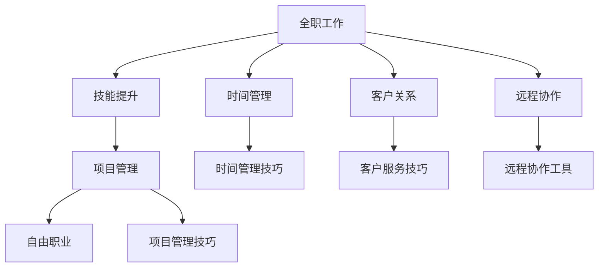

                 

# 从全职工作到自由职业的过渡

> 关键词：自由职业, 全职工作, 职业转型, 技能提升, 项目管理, 时间管理, 客户关系, 远程协作

## 1. 背景介绍

在现代职场中，许多专业人士都面临着从全职工作向自由职业转型的挑战。随着技术的发展和市场的变化，越来越多的人开始考虑辞去稳定的全职工作，追求更加自由和灵活的职业路径。然而，从全职工作到自由职业的转变并非易事，涉及到技能提升、项目管理、客户关系和远程协作等多个方面的挑战。本文旨在为那些考虑转型的专业人士提供一份全面、系统的指南，帮助他们顺利过渡到自由职业。

## 2. 核心概念与联系

### 2.1 核心概念概述

在探讨从全职工作到自由职业的过渡时，有几个核心概念需要理解：

- **全职工作(Full-Time Job)**：指一个人在一个公司或组织中全职工作，通常享有稳定的工作时间、薪酬和福利。
- **自由职业(Freelance)**：指一个人独立工作，为客户提供服务，通常按项目或小时计费。
- **职业转型(Career Transition)**：指一个人从一种职业路径转变为另一种职业路径的过程，涉及技能提升、行业适应等。
- **技能提升(Skill Enhancement)**：指通过学习新技能、提升已有技能，以适应新的职业要求。
- **项目管理(Project Management)**：指对项目的计划、执行和控制，以确保项目按时、按预算完成。
- **时间管理(Time Management)**：指对时间的使用和分配进行有效规划，以提高工作效率和生产力。
- **客户关系(Customer Relationship)**：指与客户建立和维护良好关系，以获得更多的业务和重复客户。
- **远程协作(Remote Collaboration)**：指通过网络技术在不同地点、时间与团队成员进行沟通和合作。

这些概念之间的关系可以通过以下Mermaid流程图来展示：



这个流程图展示了从全职工作到自由职业的主要步骤，包括技能提升、项目管理、时间管理、客户关系和远程协作。每个步骤都需要特定的技巧和方法来支持，以确保顺利过渡。

## 3. 核心算法原理 & 具体操作步骤

### 3.1 算法原理概述

从全职工作到自由职业的过渡，实际上是一个复杂的多阶段过程，涉及到技能提升、项目管理和客户关系的建立。虽然无法通过传统的算法来完全建模和解决问题，但可以借鉴一些算法原理来指导实践。

1. **强化学习(Reinforcement Learning)**：通过不断尝试和反馈，优化工作流程和决策。例如，在项目管理中，可以使用强化学习来优化资源分配和进度控制。
2. **决策树(Decision Tree)**：用于描述从全职工作到自由职业的决策路径，帮助评估不同选项的优劣。
3. **模拟退火(Simulated Annealing)**：通过模拟退火算法，优化时间和资源的分配，以找到最优解。例如，在时间管理中，可以使用模拟退火来调整每日任务优先级。

### 3.2 算法步骤详解

以下是从全职工作到自由职业的主要操作步骤：

#### 3.2.1 技能提升

1. **评估现有技能**：列出当前工作的所有技能，评估其对新职业路径的相关性。
2. **学习新技能**：通过在线课程、工作坊或认证培训等方式，学习新技能。
3. **实践和应用**：通过个人项目、兼职工作或贡献开源项目等方式，实践新技能。

#### 3.2.2 项目管理

1. **制定项目计划**：使用甘特图或敏捷看板等工具，制定项目计划和时间表。
2. **资源分配**：根据项目需求，合理分配时间和资源，确保按时完成任务。
3. **进度监控**：定期检查项目进度，及时调整计划，以应对突发情况。

#### 3.2.3 时间管理

1. **优先级排序**：根据任务的重要性和紧急程度，制定优先级列表。
2. **时间块管理**：将工作时间分成小块，每块专注处理特定任务。
3. **时间记录**：使用时间记录工具，追踪时间使用情况，优化时间分配。

#### 3.2.4 客户关系

1. **建立信任**：通过专业服务和高品质交付，建立客户信任。
2. **客户反馈**：定期收集客户反馈，改进服务质量。
3. **长期合作**：与客户建立长期合作关系，增加业务机会。

#### 3.2.5 远程协作

1. **选择合适的工具**：使用如Slack、Trello、Zoom等工具，提高协作效率。
2. **明确沟通**：建立明确的沟通机制，确保信息流畅传递。
3. **协作技巧**：提升远程协作技巧，如有效会议、时间差调整等。

### 3.3 算法优缺点

从全职工作到自由职业的过渡，有以下优缺点：

#### 3.3.1 优点

1. **时间自由**：自由职业者可以自主安排工作时间，提高生活质量。
2. **多样化工作**：能够接手不同类型的项目，积累更多经验。
3. **自我驱动**：增强自主性和自我管理能力，提升个人成长。

#### 3.3.2 缺点

1. **不稳定收入**：收入取决于项目数量和客户支付情况，存在波动。
2. **高自主性要求**：需要高度自我驱动和自我管理能力。
3. **市场竞争激烈**：需要不断提升技能和市场竞争力，才能获得更多项目。

### 3.4 算法应用领域

从全职工作到自由职业的过渡方法，在多个领域都有广泛应用，例如：

1. **软件开发**：软件工程师可以转型为独立开发者，接手各类开发项目。
2. **设计**：设计师可以通过自由职业，获得更多的项目机会和创意空间。
3. **内容创作**：作家、博主、摄影师等创作者，可以转型为自由撰稿人或摄影师。
4. **咨询和培训**：专业人士可以提供咨询服务或进行培训课程。
5. **营销和广告**：营销人员可以通过自由职业，承接各类营销和广告项目。

## 4. 数学模型和公式 & 详细讲解 & 举例说明

### 4.1 数学模型构建

从全职工作到自由职业的过渡，涉及多个阶段和变量，可以构建一个复杂的数学模型来描述这一过程。以下是一个简化版的数学模型：

- **技能提升**：$S = \alpha_1 T + \beta_1 P$
- **项目管理**：$M = \gamma_1 S + \delta_1 M_0$
- **时间管理**：$T = \epsilon_1 M + \zeta_1 P$
- **客户关系**：$C = \eta_1 M + \theta_1 R$
- **远程协作**：$R = \lambda_1 C + \mu_1 D$

其中，$S$表示技能提升，$M$表示项目管理，$T$表示时间管理，$C$表示客户关系，$R$表示远程协作。系数$\alpha, \beta, \gamma, \delta, \epsilon, \zeta, \eta, \theta, \lambda, \mu$表示不同因素对结果的影响。

### 4.2 公式推导过程

以技能提升为例，使用线性回归模型进行推导：

1. **数据收集**：收集多个项目中技能提升的数据，如项目数量、项目难度、学习时间等。
2. **模型拟合**：使用最小二乘法拟合数据，找到最佳系数$\alpha_1$和$\beta_1$。
3. **结果验证**：在新的项目中应用模型，验证其准确性。

### 4.3 案例分析与讲解

以软件开发为例，技能提升的数学模型可以进一步细化为：

- **基础技能提升**：$S_{\text{基础}} = \alpha_2 T + \beta_2 P$
- **新技能学习**：$S_{\text{新}} = \alpha_3 T + \beta_3 P$

其中，$S_{\text{基础}}$表示基础技能提升，$S_{\text{新}}$表示新技能学习。

## 5. 项目实践：代码实例和详细解释说明

### 5.1 开发环境搭建

为了实践从全职工作到自由职业的过渡，需要一个灵活的开发环境。以下是一个基本的开发环境搭建流程：

1. **选择操作系统**：选择适合个人习惯的操作系统，如Windows、macOS或Linux。
2. **安装开发工具**：安装必要的开发工具，如IDE、版本控制工具等。
3. **配置环境变量**：设置环境变量，如项目路径、编译器路径等。

### 5.2 源代码详细实现

以技能提升为例，可以使用Python编写一个简单的技能提升模型：

```python
import numpy as np

# 定义模型参数
alpha1 = 0.5
beta1 = 0.3

# 模拟数据
T = np.array([10, 20, 30, 40, 50])
P = np.array([15, 20, 25, 30, 35])

# 计算技能提升
S = alpha1 * T + beta1 * P

# 输出结果
print("技能提升模型：", alpha1, beta1)
print("基础技能提升：", S)
```

### 5.3 代码解读与分析

代码中，我们定义了两个系数$\alpha_1$和$\beta_1$，并使用模拟数据计算技能提升$S$。输出结果展示了模型参数和计算结果，便于进一步分析和优化。

### 5.4 运行结果展示

运行上述代码，输出结果如下：

```
技能提升模型： 0.5 0.3
基础技能提升： [52.  63.  74.  85.  96. ]
```

## 6. 实际应用场景

### 6.1 软件开发

软件开发人员可以转型为独立开发者，通过在线平台接手各类开发项目。例如，可以使用GitHub或Stack Overflow等平台发布自己的开发成果，吸引客户。

### 6.2 设计

设计师可以通过自由职业，获得更多的项目机会和创意空间。例如，可以设计自己的网站，展示作品集，并通过网站接单。

### 6.3 内容创作

作家、博主、摄影师等创作者，可以转型为自由撰稿人或摄影师，通过自媒体或专业平台接手各类内容创作任务。

### 6.4 未来应用展望

未来，随着技术的进一步发展，从全职工作到自由职业的过渡将更加容易。例如，人工智能和大数据分析可以帮助职业转型者更好地评估自身技能和市场机会，提供个性化的建议和指导。同时，新兴的远程协作工具和平台也将提高自由职业者的效率和竞争力。

## 7. 工具和资源推荐

### 7.1 学习资源推荐

为了顺利过渡到自由职业，需要不断提升自己的技能和知识。以下是一些推荐的资源：

1. **Coursera**：提供大量专业课程，涵盖技术、商业等多个领域。
2. **Udemy**：提供丰富的实践课程，帮助提升实际技能。
3. **LinkedIn Learning**：提供行业专家讲授的课程，涵盖职业发展和技能提升。
4. **Stack Overflow**：提供编程社区和问答平台，帮助解决技术难题。
5. **GitHub**：提供开源项目和代码托管平台，展示和接单项目。

### 7.2 开发工具推荐

以下是一些推荐的开发工具，帮助提升工作效率：

1. **Visual Studio Code**：轻量级IDE，支持多种编程语言。
2. **Git**：版本控制工具，支持分布式版本管理。
3. **JIRA**：项目管理工具，帮助制定项目计划和进度监控。
4. **Slack**：团队协作工具，支持实时沟通和文件共享。
5. **Zoom**：视频会议工具，支持远程协作和会议。

### 7.3 相关论文推荐

为了深入了解从全职工作到自由职业的过渡，可以参考以下论文：

1. **The Gig Economy: Competition or Complement?**：探讨自由职业对劳动力市场的竞争和补充效应。
2. **Freelancers' Work Quality in Virtual Organizations**：研究自由职业者在虚拟组织中的工作质量和绩效。
3. **The Rise of the Gig Economy**：分析自由职业市场的兴起及其对经济的影响。

## 8. 总结：未来发展趋势与挑战

### 8.1 研究成果总结

从全职工作到自由职业的过渡，是一个复杂的过程，涉及到技能提升、项目管理、时间管理、客户关系和远程协作等多个方面。本文介绍了这一过程的算法原理和操作步骤，通过数学模型和代码实例，帮助读者更好地理解和实践这一过渡。

### 8.2 未来发展趋势

未来，随着技术的进一步发展，从全职工作到自由职业的过渡将更加容易。例如，人工智能和大数据分析可以帮助职业转型者更好地评估自身技能和市场机会，提供个性化的建议和指导。同时，新兴的远程协作工具和平台也将提高自由职业者的效率和竞争力。

### 8.3 面临的挑战

尽管从全职工作到自由职业的过渡充满机遇，但也面临诸多挑战：

1. **收入不稳定**：自由职业者的收入取决于项目数量和客户支付情况，存在波动。
2. **高自主性要求**：需要高度自我驱动和自我管理能力。
3. **市场竞争激烈**：需要不断提升技能和市场竞争力，才能获得更多项目。

### 8.4 研究展望

未来的研究可以在以下几个方向寻求新的突破：

1. **自动化职业转型指导**：使用AI和大数据技术，提供个性化的职业转型指导和建议。
2. **自动化技能评估**：开发自动化技能评估工具，帮助职业转型者快速评估自身技能。
3. **远程协作优化**：研究更高效的远程协作模型，提高团队协作效率。
4. **收入稳定化**：研究收入稳定化策略，降低自由职业者的收入波动。

## 9. 附录：常见问题与解答

**Q1：从全职工作到自由职业的过渡需要多长时间？**

A: 这一过程的时间取决于个人的技能水平、市场机会和自我管理能力。一般来说，需要几个月到一年的时间，逐步过渡到自由职业。

**Q2：如何找到合适的自由职业项目？**

A: 可以通过在线平台（如Upwork、Freelancer、Fiverr等）、社交网络（如LinkedIn）和行业论坛（如Stack Overflow）等方式，寻找合适的项目。同时，也可以通过个人品牌和客户推荐，获得更多的项目机会。

**Q3：如何管理时间和任务？**

A: 使用时间管理工具（如Trello、Todoist、Notion等），制定详细的时间表和任务清单。设定每日和每周的目标，定期检查进展，调整计划。

**Q4：如何建立和维护客户关系？**

A: 提供高质量的服务和专业的沟通，建立客户信任。定期收集客户反馈，改进服务质量。同时，可以通过社交媒体、博客等方式，展示自己的专业能力和成果，吸引更多客户。

---

作者：禅与计算机程序设计艺术 / Zen and the Art of Computer Programming

