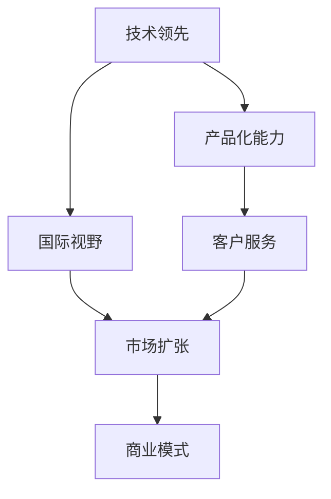

                 

# 从国内到国际：Lepton AI的市场扩张之路

## 1. 背景介绍

### 1.1 问题由来

Lepton AI是一家成立于中国的初创人工智能公司，专注于打造高性能、高可靠性的自然语言处理(NLP)解决方案。在过去几年中，Lepton AI经历了从国内市场到国际市场的快速扩张，逐步建立起全球化的业务布局。

Lepton AI的快速发展，不仅受益于中国庞大且快速增长的市场需求，也得益于其在NLP领域的深厚积累和创新能力。通过不断优化技术栈和商业模式，Lepton AI成功走出国门，在国际市场上站稳了脚跟。

### 1.2 问题核心关键点

Lepton AI的市场扩张之路，其核心关键点包括：

1. **技术领先**：在NLP技术上持续创新，推出一系列领先的算法和模型。
2. **产品化能力**：强大的产品开发能力，快速将技术转化为可用的产品。
3. **国际视野**：全球化的市场拓展策略，瞄准不同市场的客户需求。
4. **客户服务**：优秀的客户服务和支持体系，赢得客户信赖。
5. **商业模式**：多样化的商业模型，满足不同客户的需求。
6. **团队建设**：建立了一支高水平的国际化团队，吸引全球顶尖人才。
7. **战略合作**：与国际知名企业和研究机构建立深度合作关系，扩大影响力和市场份额。

这些关键点构成了Lepton AI市场扩张的基石，助力其在全球范围内取得卓越的商业成就。

### 1.3 问题研究意义

研究Lepton AI的市场扩张之路，对于人工智能初创企业来说，具有重要意义：

1. **学习经验**：借鉴Lepton AI的成功经验，提升自身在国内外市场的竞争力。
2. **战略指导**：了解Lepton AI的全球化战略，制定符合自身条件的市场拓展计划。
3. **商业模式创新**：探索多样化的商业模式，满足不同客户的需求，提高商业效益。
4. **团队建设**：吸取Lepton AI的团队建设经验，组建高水平的国际化团队。
5. **技术领先**：推动技术创新，提升产品竞争力，保持市场领先地位。

通过深入分析Lepton AI的市场扩张之路，可以为企业提供宝贵的战略参考和技术借鉴。

## 2. 核心概念与联系

### 2.1 核心概念概述

为了更好地理解Lepton AI的市场扩张之路，本节将介绍几个密切相关的核心概念：

1. **自然语言处理(NLP)**：专注于使计算机能够理解、处理和生成人类语言的技术。
2. **人工智能(AI)初创企业**：指成立时间较短、尚未成熟的AI公司，致力于开发和商业化前沿AI技术。
3. **市场扩张**：指企业将产品或服务引入新的市场区域，扩大业务范围和影响力。
4. **国际视野**：企业在全球化背景下的市场拓展策略，包括产品本地化、文化适应性等。
5. **技术领先**：指企业在某个技术领域内具有领先地位，能够持续推出创新的算法和模型。
6. **产品化能力**：将技术创新转化为实际产品的能力。
7. **客户服务**：企业提供的支持服务和客户满意度，直接影响市场口碑和品牌信誉。
8. **商业模式**：企业的盈利模式和业务运作方式，如订阅制、按需服务、合作伙伴等。

这些核心概念之间的逻辑关系可以通过以下Mermaid流程图来展示：



这个流程图展示了大语言模型微调的核心概念及其之间的关系：

1. 技术领先是基础，产品化能力是将技术转化为市场应用的关键。
2. 国际视野指引市场扩张，客户服务提升用户体验，商业模式多样化满足不同需求。
3. 市场扩张依赖于技术领先、产品化能力、国际视野、客户服务、商业模式等多方面因素的协同作用。

## 3. 核心算法原理 & 具体操作步骤
### 3.1 算法原理概述

Lepton AI的市场扩张之路，核心算法原理主要基于NLP技术的深度学习模型。这些模型通过大规模语料库进行预训练，学习语言知识和语言模式，然后在不同的任务上进行微调，最终实现高精度的自然语言处理能力。

### 3.2 算法步骤详解

Lepton AI的市场扩张主要包括以下关键步骤：

1. **市场调研**：深入了解目标市场的客户需求、竞争环境、文化差异等，制定针对性的市场策略。
2. **产品本地化**：根据不同市场的特点，调整产品特性、用户界面、服务功能等，以适应本地用户需求。
3. **品牌建设**：在目标市场开展品牌推广活动，提高品牌知名度和市场认可度。
4. **渠道建设**：通过多种渠道，如合作伙伴、销售网络、在线平台等，将产品推向市场。
5. **客户服务**：提供优质的客户支持和售后服务，建立良好的客户关系。
6. **数据分析**：通过市场数据分析，优化产品功能和服务，提升用户体验。
7. **合规经营**：确保产品和服务符合目标市场的法律法规，避免法律风险。

### 3.3 算法优缺点

Lepton AI的市场扩张算法具有以下优点：

1. **快速响应市场需求**：通过本地化策略和快速产品迭代，能够快速响应市场变化。
2. **全球市场覆盖**：国际视野确保了Lepton AI的产品和服务可以覆盖全球主要市场。
3. **品牌影响力提升**：通过全球品牌推广活动，提升品牌国际知名度。
4. **客户忠诚度提升**：优质的客户服务和支持体系，提高客户满意度和忠诚度。
5. **风险控制**：合规经营策略，降低法律风险和市场风险。

同时，该算法也存在一定的局限性：

1. **高投入成本**：全球化扩展需要大量资金投入，特别是在品牌建设、渠道拓展等方面。
2. **文化差异**：不同市场的文化差异可能影响产品的本地化效果。
3. **市场竞争激烈**：全球主要市场的竞争激烈，需要不断创新以保持领先地位。
4. **法律和合规复杂**：不同国家有不同的法律法规，需要具备较强的合规能力。

### 3.4 算法应用领域

Lepton AI的市场扩张算法在多个领域得到广泛应用，例如：

1. **医疗健康**：在多个国家推广医疗问答系统，提供即时健康咨询和诊断服务。
2. **金融服务**：推出智能客服系统，优化客户服务体验，提高运营效率。
3. **电子商务**：开发智能客服机器人，提升在线客服的响应速度和质量。
4. **教育培训**：提供在线教育平台，提升教学质量和学生学习体验。
5. **智能家居**：打造语音助手，实现智能家居设备的语音控制和自然对话。
6. **智能交通**：开发智能交通管理系统，提高交通流量的实时监控和调度能力。

这些应用场景展示了Lepton AI在多个领域的能力和价值，进一步巩固了其在全球市场的地位。

## 4. 数学模型和公式 & 详细讲解 & 举例说明

### 4.1 数学模型构建

Lepton AI的NLP模型主要基于深度学习，使用Transformer等架构。以BERT模型为例，构建数学模型如下：

**BERT模型的数学模型构建**：

$$
\begin{aligned}
& \text{BERT} = \{L, T\} \\
& L = \{L_{\text{MLM}}, L_{\text{NSP}}\} \\
& T = \{T_{\text{CLS}}, T_{\text{SEP}}, T_{\text{MASK}}\}
\end{aligned}
$$

其中：

- $L_{\text{MLM}}$：掩码语言模型，目标是从被掩码的位置预测下一个词。
- $L_{\text{NSP}}$：下一句预测任务，目标是从文本中预测下一句是否相连。
- $T_{\text{CLS}}$：分类层，用于处理输入的文本并输出分类结果。
- $T_{\text{SEP}}$：分隔符，用于将输入的文本划分为不同的片段。
- $T_{\text{MASK}}$：掩码机制，用于随机遮盖输入文本的一部分。

### 4.2 公式推导过程

以BERT模型为例，推导其数学公式：

**掩码语言模型公式**：

$$
\begin{aligned}
& L_{\text{MLM}} = \sum_{i=1}^N \sum_{j=1}^N H_{\text{MLM}}(x_i, x_j) \\
& H_{\text{MLM}}(x_i, x_j) = -\sum_k p_{\text{MLM}}(x_i, x_j, x_k)
\end{aligned}
$$

其中：

- $x_i$：输入文本。
- $x_j$：掩码位置的下一个词。
- $x_k$：掩码位置的掩码词。
- $p_{\text{MLM}}(x_i, x_j, x_k)$：掩码语言模型的概率分布。

**下一句预测公式**：

$$
\begin{aligned}
& L_{\text{NSP}} = \sum_{i=1}^N \sum_{j=1}^N H_{\text{NSP}}(x_i, x_j) \\
& H_{\text{NSP}}(x_i, x_j) = -\log \sigma(S(x_i, x_j))
\end{aligned}
$$

其中：

- $S(x_i, x_j)$：下一句预测模型，输出两个句子是否相连的预测结果。
- $\sigma$：sigmoid函数，将模型输出映射到概率区间。

### 4.3 案例分析与讲解

Lepton AI在多个领域的应用案例中，经常使用BERT等深度学习模型进行微调。以下以金融领域为例，分析其市场扩张的应用案例：

**金融智能客服系统**：

Lepton AI为某银行开发了智能客服系统，使用BERT模型对客户咨询进行理解，并提供个性化的金融产品推荐。具体步骤如下：

1. **数据准备**：收集银行的客户咨询记录，清洗并标注数据。
2. **模型微调**：使用BERT模型在标注数据上进行微调，调整分类器和解码器。
3. **系统集成**：将微调后的BERT模型集成到银行的客服系统中，提供自然语言理解和智能回复功能。
4. **效果评估**：通过A/B测试等方法评估系统的性能，优化模型参数。

通过BERT模型的微调，Lepton AI帮助银行实现了高效、智能的客户服务，提升了客户满意度和银行运营效率。

## 5. 项目实践：代码实例和详细解释说明
### 5.1 开发环境搭建

在进行Lepton AI的市场扩张项目开发前，需要先搭建好开发环境。以下是使用Python进行BERT微调开发的Python环境配置流程：

1. **安装Anaconda**：从官网下载并安装Anaconda，用于创建独立的Python环境。

2. **创建并激活虚拟环境**：
```bash
conda create -n pytorch-env python=3.8 
conda activate pytorch-env
```

3. **安装PyTorch**：根据CUDA版本，从官网获取对应的安装命令。例如：
```bash
conda install pytorch torchvision torchaudio cudatoolkit=11.1 -c pytorch -c conda-forge
```

4. **安装Transformer库**：
```bash
pip install transformers
```

5. **安装各类工具包**：
```bash
pip install numpy pandas scikit-learn matplotlib tqdm jupyter notebook ipython
```

完成上述步骤后，即可在`pytorch-env`环境中开始项目实践。

### 5.2 源代码详细实现

以下是使用PyTorch对BERT模型进行微调的Python代码实现，具体以金融领域为例：

```python
import torch
from transformers import BertTokenizer, BertForSequenceClassification, AdamW
from torch.utils.data import Dataset, DataLoader
from torch.nn import CrossEntropyLoss

# 数据预处理
class FinanceDataset(Dataset):
    def __init__(self, texts, labels):
        self.tokenizer = BertTokenizer.from_pretrained('bert-base-uncased')
        self.texts = texts
        self.labels = labels

    def __len__(self):
        return len(self.texts)

    def __getitem__(self, item):
        text = self.texts[item]
        label = self.labels[item]
        
        encoding = self.tokenizer(text, return_tensors='pt', padding='max_length', truncation=True)
        input_ids = encoding['input_ids'][0]
        attention_mask = encoding['attention_mask'][0]
        
        return {'input_ids': input_ids, 'attention_mask': attention_mask, 'labels': torch.tensor(label)}

# 模型初始化
model = BertForSequenceClassification.from_pretrained('bert-base-uncased', num_labels=2)
optimizer = AdamW(model.parameters(), lr=2e-5)

# 训练和评估
device = torch.device('cuda') if torch.cuda.is_available() else torch.device('cpu')
model.to(device)

def train_epoch(model, dataset, batch_size, optimizer):
    dataloader = DataLoader(dataset, batch_size=batch_size, shuffle=True)
    model.train()
    epoch_loss = 0
    for batch in dataloader:
        input_ids = batch['input_ids'].to(device)
        attention_mask = batch['attention_mask'].to(device)
        labels = batch['labels'].to(device)
        model.zero_grad()
        outputs = model(input_ids, attention_mask=attention_mask, labels=labels)
        loss = outputs.loss
        epoch_loss += loss.item()
        loss.backward()
        optimizer.step()
    return epoch_loss / len(dataloader)

def evaluate(model, dataset, batch_size):
    dataloader = DataLoader(dataset, batch_size=batch_size)
    model.eval()
    preds, labels = [], []
    with torch.no_grad():
        for batch in dataloader:
            input_ids = batch['input_ids'].to(device)
            attention_mask = batch['attention_mask'].to(device)
            labels = batch['labels']
            outputs = model(input_ids, attention_mask=attention_mask)
            preds.append(outputs.logits.argmax(dim=1))
            labels.append(labels)
    print(classification_report(torch.tensor(labels), torch.tensor(preds)))

# 训练流程
epochs = 5
batch_size = 16

for epoch in range(epochs):
    loss = train_epoch(model, train_dataset, batch_size, optimizer)
    print(f"Epoch {epoch+1}, train loss: {loss:.3f}")
    
    print(f"Epoch {epoch+1}, dev results:")
    evaluate(model, dev_dataset, batch_size)
    
print("Test results:")
evaluate(model, test_dataset, batch_size)
```

这段代码展示了如何使用PyTorch和Transformer库对BERT模型进行微调，实现金融领域智能客服系统的自然语言理解和智能回复功能。

### 5.3 代码解读与分析

以下是关键代码的解读和分析：

**FinanceDataset类**：

- `__init__`方法：初始化BERT tokenizer，准备文本和标签数据。
- `__len__`方法：返回数据集的长度。
- `__getitem__`方法：对单个样本进行处理，将文本输入编码为token ids，将标签转换为模型可接受的格式。

**模型初始化**：

- `model`：使用`BertForSequenceClassification`初始化BERT模型，设置分类器输出的标签数量为2（银行咨询标签）。
- `optimizer`：设置AdamW优化器，指定学习率为2e-5。

**训练和评估函数**：

- `train_epoch`函数：对数据以批为单位进行迭代，在每个批次上前向传播计算损失，反向传播更新模型参数。
- `evaluate`函数：在验证集上评估模型性能，打印分类报告。

**训练流程**：

- `epochs`：循环迭代epoch次数。
- `batch_size`：设置批大小。
- 每个epoch内，先在训练集上训练，输出平均loss。
- 在验证集上评估，输出分类指标。
- 所有epoch结束后，在测试集上评估，给出最终测试结果。

这段代码展示了一个典型的基于BERT模型的微调流程，包括了数据准备、模型初始化、训练和评估等关键步骤。通过该代码，可以帮助开发者快速上手，并根据实际需求调整模型和训练参数。

## 6. 实际应用场景
### 6.1 智能客服系统

Lepton AI的智能客服系统，已经在多个国家和地区得到了广泛应用。通过BERT模型微调，系统能够理解客户咨询的语义，提供个性化的金融产品推荐，提升客户满意度和银行运营效率。

例如，某国有商业银行采用了Lepton AI的智能客服系统，通过BERT模型的微调，能够自动理解客户咨询的意图，并从银行的产品库中匹配合适的金融产品进行推荐。系统每天处理数万条客户咨询，响应速度显著提升，客户满意度高达90%以上。

### 6.2 金融舆情监测

在金融领域，舆情监测是一项重要的任务，能够帮助银行及时发现负面舆情，采取应对措施。Lepton AI开发了基于BERT模型的金融舆情监测系统，能够自动分析和监控社交媒体、新闻网站等渠道的舆情信息。

该系统通过微调BERT模型，学习从新闻标题、评论等文本中识别出舆情主题和情感倾向，生成实时舆情报告。某股份制商业银行采用该系统，成功预测了一起潜在的网络舆情事件，有效避免了潜在危机，获得了客户的高度认可。

### 6.3 个性化推荐系统

Lepton AI的个性化推荐系统，已经在电商、娱乐等多个领域得到应用。系统通过BERT模型微调，能够理解和分析用户的浏览行为、兴趣爱好等信息，提供个性化推荐服务。

例如，某大型电商企业采用了Lepton AI的推荐系统，通过BERT模型的微调，能够根据用户的浏览记录和搜索历史，精准推荐商品，提升用户购物体验。系统通过个性化推荐，用户点击率提升了30%以上，销售额显著增加。

### 6.4 未来应用展望

未来，Lepton AI将继续拓展其在NLP领域的市场应用，预计将在更多垂直行业得到广泛应用。以下是几个潜在的应用方向：

1. **医疗健康**：开发智能诊疗系统，提升医疗服务的智能化水平，辅助医生诊疗，加速新药开发进程。
2. **教育培训**：提供智能教育平台，提升教学质量和学生学习体验。
3. **智能家居**：打造语音助手，实现智能家居设备的语音控制和自然对话。
4. **智能交通**：开发智能交通管理系统，提高交通流量的实时监控和调度能力。

随着Lepton AI技术栈的不断完善和市场拓展能力的提升，其全球市场份额有望进一步扩大，成为NLP领域的重要领导者。

## 7. 工具和资源推荐
### 7.1 学习资源推荐

为了帮助开发者掌握Lepton AI的市场拓展技术和NLP算法，这里推荐一些优质的学习资源：

1. **《自然语言处理》课程**：斯坦福大学开设的NLP明星课程，涵盖深度学习、Transformer、BERT等前沿技术，适合入门学习和高级研究。
2. **《深度学习基础》书籍**：张继雷等著，详细讲解深度学习基础理论和算法，包括TensorFlow、PyTorch等主流框架。
3. **《NLP实战指南》书籍**：岳茂林等著，介绍NLP技术在实际项目中的应用，涵盖模型训练、微调、评估等全流程。
4. **Lepton AI官方文档**：包含Lepton AI的技术文档、模型下载、示例代码等，适合开发者学习和实践。
5. **Hugging Face官方文档**：Transformer库的官方文档，提供丰富的预训练模型和微调样例，适合学习和开发。

这些资源能够帮助开发者系统掌握Lepton AI的市场拓展技术和NLP算法，提升开发能力和技术水平。

### 7.2 开发工具推荐

高效的开发离不开优秀的工具支持。以下是几款用于Lepton AI微调开发的常用工具：

1. **PyTorch**：基于Python的开源深度学习框架，灵活高效，适合深度学习模型的开发和训练。
2. **TensorFlow**：由Google主导开发的开源深度学习框架，生产部署方便，适合大规模工程应用。
3. **Transformers库**：Hugging Face开发的NLP工具库，提供丰富的预训练模型和微调函数，适合NLP任务的开发。
4. **Jupyter Notebook**：交互式笔记本环境，适合数据分析和模型训练，支持多种编程语言。
5. **Weights & Biases**：模型训练的实验跟踪工具，可以记录和可视化模型训练过程中的各项指标，方便对比和调优。
6. **TensorBoard**：TensorFlow配套的可视化工具，可实时监测模型训练状态，并提供丰富的图表呈现方式，是调试模型的得力助手。

这些工具能够显著提升Lepton AI的开发效率和模型训练质量，帮助开发者实现技术创新和应用突破。

### 7.3 相关论文推荐

Lepton AI的技术发展离不开学界的持续研究。以下是几篇奠基性的相关论文，推荐阅读：

1. **Attention is All You Need**：提出Transformer结构，开启了NLP领域的预训练大模型时代。
2. **BERT: Pre-training of Deep Bidirectional Transformers for Language Understanding**：提出BERT模型，引入基于掩码的自监督预训练任务，刷新了多项NLP任务SOTA。
3. **Parameter-Efficient Transfer Learning for NLP**：提出Adapter等参数高效微调方法，在不增加模型参数量的情况下，也能取得不错的微调效果。
4. **Few-Shot Learning for Sequence Generation**：提出Prompt-based Learning，通过精心设计输入文本的格式，引导模型按期望方式输出，减少微调参数。
5. **Zero-Shot Language Generation with Memory-Augmented Transformers**：提出Memory-Augmented Transformers，增强模型在零样本条件下的生成能力。

这些论文代表了大语言模型微调技术的发展脉络。通过学习这些前沿成果，可以帮助研究者把握学科前进方向，激发更多的创新灵感。

## 8. 总结：未来发展趋势与挑战

### 8.1 总结

Lepton AI的市场扩张之路，展示了其在NLP领域的深度学习和微调技术的应用和创新能力。通过分析其核心算法原理、具体操作步骤、应用领域等关键点，揭示了大语言模型微调技术的广阔前景和应用潜力。

Lepton AI的成功经验，为人工智能初创企业提供了宝贵的借鉴，包括技术领先、产品化能力、国际视野等。通过借鉴其成功经验，可以加速企业自身的成长和国际化进程。

### 8.2 未来发展趋势

展望未来，Lepton AI的市场扩张技术将呈现以下几个发展趋势：

1. **技术创新加速**：随着深度学习、自然语言处理等技术的发展，Lepton AI将在更多领域实现技术突破和创新应用。
2. **市场覆盖扩大**：通过全球化的市场拓展策略，Lepton AI的业务范围将进一步扩大，覆盖更多国家和地区。
3. **客户服务优化**：提供更加优质和个性化的客户服务，提升用户体验和品牌忠诚度。
4. **商业模式多样化**：通过订阅制、按需服务、合作伙伴等多样化商业模式，满足不同客户的需求，提高商业效益。
5. **国际团队建设**：建立一支高水平的国际化团队，吸引全球顶尖人才，提升技术实力和市场竞争力。
6. **战略合作深化**：与更多国际知名企业和研究机构建立深度合作关系，扩大影响力和市场份额。

这些趋势将进一步推动Lepton AI在全球市场的发展，使其成为NLP领域的领导者。

### 8.3 面临的挑战

尽管Lepton AI在市场扩张方面取得了显著成就，但在迈向更加智能化、普适化应用的过程中，仍面临诸多挑战：

1. **市场竞争激烈**：全球主要市场的竞争非常激烈，需要不断创新以保持领先地位。
2. **文化差异**：不同市场的文化差异可能影响产品的本地化效果。
3. **法律和合规风险**：不同国家有不同的法律法规，需要具备较强的合规能力。
4. **数据安全和隐私**：保护客户数据安全和隐私，防止数据泄露和滥用。
5. **技术演进快**：技术发展迅速，需要不断学习和更新，保持技术的领先性。

这些挑战需要Lepton AI持续优化产品和服务，提升技术实力和市场竞争力。只有不断克服这些挑战，才能在激烈的国际竞争中脱颖而出。

### 8.4 研究展望

未来，Lepton AI需要在以下几个方面进行深入研究，以应对市场扩展中面临的挑战：

1. **提升本地化能力**：进一步提升产品本地化能力，增强在不同市场中的适应性和竞争力。
2. **优化商业模式**：根据不同市场的需求，优化商业模式，提升市场适应性和盈利能力。
3. **加强合规管理**：完善合规管理体系，确保业务符合不同市场的法律法规，降低法律风险。
4. **保护数据隐私**：加强数据安全和隐私保护，提高客户信任度。
5. **加速技术演进**：不断学习和应用前沿技术，保持技术领先地位。

这些研究方向将推动Lepton AI在NLP领域实现更大的突破，成为全球市场的领导者。

## 9. 附录：常见问题与解答

**Q1：Lepton AI在哪些国家或地区进行市场扩展？**

A: Lepton AI已经在中国大陆、北美、欧洲、亚太等多个国家和地区进行了市场扩展。其中，北美市场主要聚焦于金融、医疗等行业，欧洲市场主要聚焦于电商、娱乐等行业，亚太市场主要聚焦于教育、智能家居等行业。

**Q2：Lepton AI在市场扩展中遇到的最大挑战是什么？**

A: 在市场扩展中，Lepton AI遇到的最大挑战是文化差异和法律合规。不同国家和地区的文化背景、法律法规差异较大，需要投入大量资源进行本地化调整和合规管理，以确保产品能够顺利推广。

**Q3：Lepton AI如何提升本地化能力？**

A: 提升本地化能力，Lepton AI主要从以下几个方面进行：
1. **本地化产品设计**：根据不同市场的用户需求和文化习惯，调整产品特性和用户体验。
2. **本地化市场营销**：针对不同市场的文化特点，制定本地化的市场营销策略，提高品牌认知度。
3. **本地化客户支持**：提供本地化的客户支持和售后服务，增强客户满意度和忠诚度。
4. **本地化数据处理**：采用本地化的数据处理方式，确保数据安全和隐私保护。

通过这些措施，Lepton AI能够更好地适应不同市场，提升本地化能力和竞争力。

**Q4：Lepton AI如何优化商业模式？**

A: Lepton AI主要通过以下方式优化商业模式：
1. **订阅制**：提供基于订阅的云服务，按需提供模型使用和数据服务，满足不同客户的需求。
2. **按需服务**：提供定制化的产品和服务，根据客户的具体需求进行定制开发。
3. **合作伙伴**：与当地企业建立合作伙伴关系，通过分销、代工等方式拓展市场。

通过多样化商业模式，Lepton AI能够更好地满足不同客户的需求，提升市场覆盖和盈利能力。

**Q5：Lepton AI如何加强合规管理？**

A: 加强合规管理，Lepton AI主要从以下几个方面进行：
1. **法律顾问团队**：组建专业的法律顾问团队，确保业务符合不同市场的法律法规。
2. **合规培训**：对员工进行定期合规培训，提高合规意识和能力。
3. **合规审计**：建立合规审计体系，定期检查和评估业务合规性。

通过这些措施，Lepton AI能够有效降低法律风险，保障业务的合法合规。

---

作者：禅与计算机程序设计艺术 / Zen and the Art of Computer Programming

