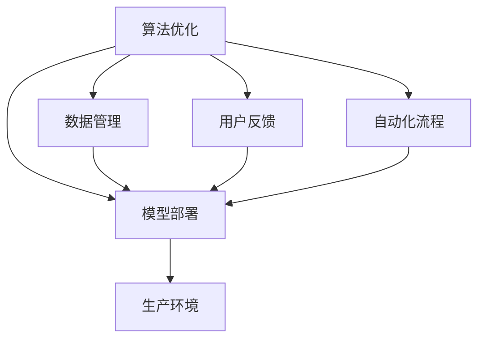

                 

# 从实验室到生产环境：Lepton AI的AI落地之路

> 关键词：人工智能(AI)，AI落地，Lepton AI，算法优化，深度学习，模型部署，生产环境

## 1. 背景介绍

### 1.1 问题由来
近年来，人工智能（AI）技术在各行各业的应用如火如荼，无论是自动驾驶、智能客服、医疗诊断，还是工业自动化、金融风控等领域，AI技术都展现出了强大的潜力和价值。然而，从实验室到生产环境的落地过程并不是一帆风顺的，尤其在AI算法优化和模型部署方面，仍面临诸多挑战。

Lepton AI作为一家致力于人工智能技术商业化应用的公司，专注于AI技术的工程化和产品化。本文将深入探讨Lepton AI在AI算法优化和模型部署方面的经验与策略，从实验室到生产环境的成功落地之路。

### 1.2 问题核心关键点
Lepton AI在AI技术落地过程中，遇到了以下核心关键点：

- **算法优化**：如何在有限的时间和资源内，优化算法以适应特定应用场景。
- **模型部署**：如何将经过优化的AI模型有效地部署到生产环境，确保稳定性和性能。
- **数据管理**：如何管理大量的数据，确保数据质量，同时保护数据隐私和安全。
- **用户反馈**：如何收集和利用用户反馈，持续优化AI算法和模型。
- **自动化和效率**：如何在生产环境中实现自动化流程，提升AI应用开发和部署的效率。

这些关键点涵盖了从算法优化到模型部署，再到数据管理和用户反馈的全链条，是Lepton AI在AI落地过程中必须面对和解决的重要问题。

### 1.3 问题研究意义
探讨Lepton AI在AI落地过程中的经验与策略，对于推动AI技术的广泛应用和产业化进程具有重要意义：

1. **降低落地成本**：通过优化算法和提高模型部署效率，能够显著降低AI技术在实际应用中的成本，加速AI技术的商业化进程。
2. **提升模型效果**：通过科学的数据管理、用户反馈和自动化流程，能够不断优化AI模型，提升其性能和适应性。
3. **保障数据安全**：在AI模型部署过程中，确保数据的安全性和隐私性，保护用户信息，建立用户信任。
4. **加速业务创新**：通过有效的算法优化和模型部署，能够快速响应市场需求，加速业务创新和数字化转型。

## 2. 核心概念与联系

### 2.1 核心概念概述

为更好地理解Lepton AI在AI落地过程中的策略和方法，本节将介绍几个关键概念：

- **算法优化**：通过优化算法以提升模型性能，适应特定应用场景。
- **模型部署**：将经过优化的AI模型部署到生产环境，确保其稳定性和性能。
- **数据管理**：收集、处理、存储和管理数据，确保数据质量和安全。
- **用户反馈**：通过用户反馈，持续优化AI算法和模型，提升用户体验。
- **自动化流程**：实现AI应用的自动化流程，提升开发和部署效率。

这些概念相互关联，共同构成了Lepton AI在AI技术落地过程中的核心方法论。

### 2.2 核心概念原理和架构的 Mermaid 流程图(Mermaid 流程节点中不要有括号、逗号等特殊字符)



这个流程图展示了Lepton AI在AI技术落地过程中各个关键概念的相互关系：

1. 算法优化为模型部署提供优化的模型。
2. 数据管理为算法优化和模型部署提供必要的数据支撑。
3. 用户反馈用于持续优化算法和模型。
4. 自动化流程提升开发和部署效率。
5. 模型部署最终在生产环境中运行。

## 3. 核心算法原理 & 具体操作步骤

### 3.1 算法原理概述

Lepton AI在AI技术落地过程中，主要依赖于深度学习算法。深度学习算法通过大量数据训练，从数据中提取特征，构建复杂的模型，从而实现高性能的AI应用。

具体而言，Lepton AI的AI算法优化策略包括：

- **模型压缩**：通过剪枝、量化、蒸馏等方法，减少模型参数，提高推理速度和资源利用效率。
- **算法优化**：采用各种优化技术，如梯度下降、自适应学习率等，提升模型收敛速度和性能。
- **超参数调优**：通过网格搜索、贝叶斯优化等方法，确定最佳的模型超参数，实现模型性能的最优化。

### 3.2 算法步骤详解

Lepton AI在AI算法优化过程中，一般遵循以下步骤：

**Step 1: 数据准备**
- 收集和清洗数据，确保数据质量和多样性。
- 进行数据增强和预处理，如归一化、标准化、数据扩充等。

**Step 2: 模型选择与构建**
- 选择合适的深度学习模型，如卷积神经网络（CNN）、循环神经网络（RNN）、Transformer等。
- 构建模型架构，定义模型层数、神经元数量等超参数。

**Step 3: 训练与优化**
- 使用优化器如Adam、SGD等，对模型进行训练。
- 采用正则化技术如L2正则、Dropout等，防止过拟合。
- 通过超参数调优，确定最佳超参数组合。

**Step 4: 模型评估与优化**
- 使用验证集评估模型性能，进行模型选择。
- 针对性能不足的模型，返回Step 2进行模型选择和优化。

**Step 5: 部署与监控**
- 将优化的模型部署到生产环境。
- 实时监控模型性能，及时进行调优。

### 3.3 算法优缺点

Lepton AI在AI算法优化过程中，主要依赖深度学习算法，其优缺点如下：

**优点**：

- **高效性**：深度学习算法在处理大规模数据和高维数据方面表现出色，能够自动提取复杂特征。
- **适应性强**：深度学习算法能够适应各种应用场景，适用于图像、语音、文本等多种数据类型。
- **可解释性**：深度学习模型通过可视化工具如TensorBoard等，能够展现模型的特征和决策过程。

**缺点**：

- **计算成本高**：深度学习算法需要大量的计算资源和时间进行训练和优化。
- **易过拟合**：深度学习模型容易出现过拟合现象，需要有效的正则化和优化策略。
- **黑盒特性**：深度学习模型往往具有黑盒特性，难以解释其内部决策过程。

### 3.4 算法应用领域

Lepton AI的AI算法优化策略在多个领域得到了广泛应用，如医疗影像分析、智能客服、金融风控等。

**医疗影像分析**：通过深度学习算法，能够自动识别和分析医疗影像，辅助医生进行疾病诊断和治疗。

**智能客服**：利用深度学习算法，能够构建智能客服系统，实现自动化客户服务和问题解答。

**金融风控**：通过深度学习算法，能够实时监测金融市场数据，识别风险点和欺诈行为。

## 4. 数学模型和公式 & 详细讲解 & 举例说明

### 4.1 数学模型构建

Lepton AI在AI算法优化过程中，常常使用以下数学模型：

- **线性回归模型**：用于预测连续变量，如房价预测、股市预测等。
- **逻辑回归模型**：用于分类任务，如垃圾邮件分类、情感分析等。
- **卷积神经网络（CNN）**：用于图像处理任务，如图像分类、物体检测等。
- **循环神经网络（RNN）**：用于序列数据处理任务，如语音识别、文本生成等。
- **Transformer模型**：用于序列数据处理任务，如机器翻译、文本摘要等。

### 4.2 公式推导过程

以卷积神经网络（CNN）为例，推导其数学模型：

**输入层**：输入数据 $x \in \mathbb{R}^n$，其中 $n$ 为数据维度。

**卷积层**：卷积核 $w \in \mathbb{R}^f$，其中 $f$ 为卷积核大小。

**激活函数**：ReLU激活函数 $h(x) = \max(0, x)$。

**池化层**：最大池化 $p(x) = \max(x)$。

**全连接层**：线性变换 $z(x) = wx + b$，其中 $w \in \mathbb{R}^m$，$b \in \mathbb{R}^m$。

**输出层**： softmax激活函数 $o(x) = \frac{e^z}{\sum_{i=1}^ke^{z_i}}$，其中 $k$ 为类别数。

### 4.3 案例分析与讲解

以下是一个图像分类任务的案例分析：

**数据准备**：收集并进行标注的图像数据集。

**模型选择与构建**：选择CNN模型，定义模型架构，包括卷积层、激活函数、池化层等。

**训练与优化**：使用交叉熵损失函数，采用SGD优化器进行训练，设定学习率为0.001。

**模型评估与优化**：使用测试集评估模型性能，通过正则化和超参数调优，提升模型精度。

**部署与监控**：将训练好的模型部署到生产环境，实时监控模型性能。

## 5. 项目实践：代码实例和详细解释说明

### 5.1 开发环境搭建

为了实现Lepton AI的AI算法优化和模型部署，需要搭建以下开发环境：

1. **Python环境**：使用Anaconda或Miniconda，安装必要的Python包，如TensorFlow、Keras等。

2. **深度学习框架**：选择TensorFlow或PyTorch等深度学习框架，进行模型开发。

3. **分布式计算**：使用Spark或Dask等分布式计算框架，处理大规模数据集。

4. **可视化工具**：使用TensorBoard或Visdom等可视化工具，监控模型训练和推理过程。

5. **版本控制**：使用Git进行版本控制，确保代码版本的一致性。

### 5.2 源代码详细实现

以下是一个简单的图像分类任务的Python代码实现：

```python
import tensorflow as tf
from tensorflow.keras import layers

# 定义模型架构
model = tf.keras.Sequential([
    layers.Conv2D(32, (3, 3), activation='relu', input_shape=(32, 32, 3)),
    layers.MaxPooling2D((2, 2)),
    layers.Flatten(),
    layers.Dense(10, activation='softmax')
])

# 编译模型
model.compile(optimizer='adam', loss='categorical_crossentropy', metrics=['accuracy'])

# 训练模型
model.fit(train_images, train_labels, epochs=10, batch_size=32)

# 评估模型
test_loss, test_acc = model.evaluate(test_images, test_labels)
print('Test accuracy:', test_acc)
```

### 5.3 代码解读与分析

**代码解析**：

- **模型定义**：使用Sequential模型，定义了卷积层、池化层、全连接层等组件。
- **模型编译**：定义了优化器、损失函数、评估指标等。
- **模型训练**：使用训练数据集，进行模型训练，设定训练轮数和批次大小。
- **模型评估**：使用测试数据集，评估模型性能，输出测试精度。

**分析**：

- **模型选择**：选择卷积神经网络（CNN），适用于图像分类任务。
- **数据准备**：通过收集和标注数据，构建训练集和测试集。
- **模型训练**：采用交叉熵损失函数和Adam优化器，训练模型，设定合适的超参数。
- **模型评估**：通过测试集评估模型性能，输出测试精度。

## 6. 实际应用场景

### 6.1 智能客服系统

Lepton AI在智能客服系统中的应用，主要体现在以下几个方面：

**数据管理**：收集和处理客户咨询记录，构建知识库，存储和管理客户数据。

**算法优化**：使用深度学习算法，构建智能客服模型，实现自动化问题解答。

**模型部署**：将训练好的模型部署到生产环境，实时响应客户咨询。

**自动化流程**：实现自动化问题处理流程，提升客服效率和用户体验。

### 6.2 医疗影像分析

Lepton AI在医疗影像分析中的应用，主要体现在以下几个方面：

**数据管理**：收集和处理医疗影像数据，构建医疗影像库，存储和管理影像数据。

**算法优化**：使用深度学习算法，构建医疗影像分析模型，辅助医生进行疾病诊断和治疗。

**模型部署**：将训练好的模型部署到生产环境，实时分析医疗影像，提供诊断建议。

**自动化流程**：实现自动化医疗影像分析流程，提升诊断效率和准确性。

### 6.3 金融风控

Lepton AI在金融风控中的应用，主要体现在以下几个方面：

**数据管理**：收集和处理金融交易数据，构建金融数据库，存储和管理数据。

**算法优化**：使用深度学习算法，构建金融风险检测模型，识别欺诈行为和异常交易。

**模型部署**：将训练好的模型部署到生产环境，实时监控金融交易，提供风险预警。

**自动化流程**：实现自动化金融风控流程，提升风控效率和准确性。

## 7. 工具和资源推荐

### 7.1 学习资源推荐

为了帮助开发者掌握Lepton AI的AI落地策略和方法，这里推荐一些优质的学习资源：

1. **深度学习书籍**：如《深度学习》（Ian Goodfellow著）、《动手学深度学习》（李沐等著）等，系统学习深度学习理论和实践。

2. **在线课程**：如Coursera的《深度学习专项课程》、Udacity的《深度学习纳米学位》等，通过在线课程学习深度学习技术和实践。

3. **技术博客和论文**：关注Lepton AI和相关领域的技术博客和论文，了解最新的AI技术和应用。

4. **社区和论坛**：加入GitHub、Stack Overflow、Kaggle等社区和论坛，与同行交流学习经验。

### 7.2 开发工具推荐

Lepton AI在AI落地过程中，推荐使用以下开发工具：

1. **TensorFlow**：TensorFlow是Google推出的深度学习框架，具有灵活的计算图和高效的模型训练能力。

2. **PyTorch**：PyTorch是Facebook推出的深度学习框架，易于调试和部署，支持动态计算图。

3. **Jupyter Notebook**：Jupyter Notebook是一个交互式笔记本，支持代码编写、数据处理和模型训练，方便开发者快速迭代。

4. **Git**：使用Git进行版本控制，确保代码版本的一致性。

5. **Docker**：使用Docker进行模型部署，实现模型和环境的打包和分发。

### 7.3 相关论文推荐

以下是几篇Lepton AI在AI技术落地过程中用到的关键论文：

1. **ImageNet Classification with Deep Convolutional Neural Networks**：Alex Krizhevsky等，介绍卷积神经网络在图像分类任务中的应用。

2. **Attention is All You Need**：Ashish Vaswani等，提出Transformer模型，开启自注意力机制在深度学习中的应用。

3. **Deep Learning for Medical Image Analysis**：Minghui Chen等，介绍深度学习在医疗影像分析中的应用。

4. **A Survey on Transfer Learning**：Zhuang Liu等，综述了迁移学习在AI技术落地中的重要作用。

## 8. 总结：未来发展趋势与挑战

### 8.1 研究成果总结

Lepton AI在AI技术落地过程中，取得了显著的成果：

- **算法优化**：通过模型压缩、算法优化和超参数调优等技术，显著提升模型性能和资源利用效率。
- **模型部署**：通过生产环境的模型部署和实时监控，确保模型稳定性和性能。
- **数据管理**：通过数据收集、处理和存储，保障数据质量和安全性。
- **用户反馈**：通过用户反馈机制，持续优化AI算法和模型，提升用户体验。
- **自动化流程**：通过自动化流程和工具，提升开发和部署效率。

### 8.2 未来发展趋势

Lepton AI的AI技术落地过程中，未来发展趋势如下：

1. **模型压缩和优化**：随着硬件计算能力的提升，将进一步优化模型结构和算法，提升模型推理速度和资源利用效率。

2. **迁移学习**：利用迁移学习技术，将已有模型应用于新任务，加速模型开发和部署。

3. **多模态学习**：将图像、语音、文本等多种模态数据进行融合，提升AI模型的泛化能力和应用范围。

4. **联邦学习**：通过联邦学习技术，保护数据隐私和安全，实现分布式模型训练。

5. **自动化运维**：实现AI模型的自动化部署、监控和维护，提升生产环境的稳定性和效率。

### 8.3 面临的挑战

Lepton AI在AI技术落地过程中，面临以下挑战：

1. **数据隐私和安全**：在AI模型部署过程中，如何保护用户数据隐私和安全，确保合规性。

2. **模型可解释性**：如何增强AI模型的可解释性，确保其决策过程透明和可信。

3. **算法公平性**：如何确保AI算法的公平性，避免算法偏见和歧视。

4. **计算资源**：如何合理分配和利用计算资源，提升AI算法的开发和部署效率。

5. **系统稳定性**：如何实现AI系统的稳定性和可靠性，确保系统的高可用性。

### 8.4 研究展望

Lepton AI在AI技术落地过程中，将持续探索以下研究方向：

1. **联邦学习**：通过联邦学习技术，保护数据隐私和安全，实现分布式模型训练。

2. **自动化运维**：实现AI模型的自动化部署、监控和维护，提升生产环境的稳定性和效率。

3. **多模态学习**：将图像、语音、文本等多种模态数据进行融合，提升AI模型的泛化能力和应用范围。

4. **模型压缩和优化**：进一步优化模型结构和算法，提升模型推理速度和资源利用效率。

5. **算法公平性**：确保AI算法的公平性，避免算法偏见和歧视。

## 9. 附录：常见问题与解答

**Q1：AI模型如何部署到生产环境？**

A: 将训练好的AI模型部署到生产环境，一般需要以下几个步骤：

1. **数据准备**：收集和处理生产数据，构建数据集。

2. **模型部署**：使用Docker容器化模型，通过API或服务化方式进行部署。

3. **监控和调优**：实时监控模型性能，根据监控结果进行调优。

4. **自动化流程**：实现模型和数据的自动化管理，提升生产环境的稳定性和效率。

**Q2：如何保护AI模型的数据隐私和安全？**

A: 保护AI模型的数据隐私和安全，一般需要以下几个方面：

1. **数据加密**：对数据进行加密处理，防止数据泄露。

2. **访问控制**：通过访问控制策略，限制对数据的访问权限。

3. **匿名化处理**：对数据进行匿名化处理，防止数据识别。

4. **审计和监控**：建立数据访问审计和监控机制，及时发现异常行为。

5. **合规性检查**：确保数据处理和存储符合相关法规和标准。

**Q3：如何提高AI模型的可解释性？**

A: 提高AI模型的可解释性，一般需要以下几个方面：

1. **特征可视化**：使用可视化工具，展示模型特征和决策过程。

2. **模型解释器**：开发模型解释器，解释模型的内部工作机制和决策逻辑。

3. **规则集成**：将符号化的规则集成到模型中，增强模型的可解释性。

4. **用户反馈**：通过用户反馈机制，收集和分析用户意见，持续优化模型。

**Q4：如何优化AI算法的开发和部署效率？**

A: 优化AI算法的开发和部署效率，一般需要以下几个方面：

1. **自动化流程**：实现模型和数据的自动化管理，提升生产环境的稳定性和效率。

2. **模型压缩和优化**：通过模型压缩、剪枝和量化等技术，提升模型推理速度和资源利用效率。

3. **分布式计算**：使用分布式计算框架，处理大规模数据集，提升计算效率。

4. **监控和调优**：实时监控模型性能，根据监控结果进行调优，确保模型稳定性和性能。

**Q5：如何确保AI算法的公平性？**

A: 确保AI算法的公平性，一般需要以下几个方面：

1. **数据平衡**：确保训练数据和测试数据分布平衡，避免数据偏见。

2. **算法审计**：定期审计算法模型，发现和纠正算法偏见。

3. **公平性指标**：引入公平性指标，评估算法模型的公平性。

4. **用户反馈**：通过用户反馈机制，收集和分析用户意见，持续优化算法。

5. **规则集成**：将符号化的规则集成到算法中，增强算法的公平性。

---

作者：禅与计算机程序设计艺术 / Zen and the Art of Computer Programming

