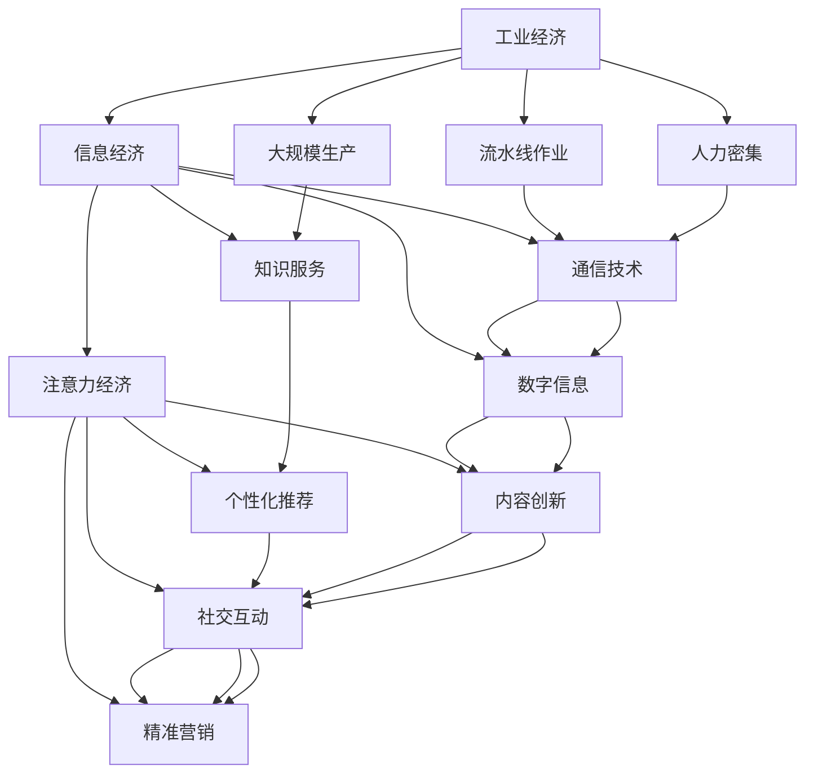

                 

## 1. 背景介绍

### 1.1 问题由来

在过去几十年里，人类经济活动的重心发生了显著变化，从传统的工业经济逐步过渡到信息经济和注意力经济。这一转变不仅体现在产业结构上，更深刻地影响了人们的生产、消费和社交方式。随着信息技术的高速发展，数据和注意力成为驱动经济增长的新动力源。

### 1.2 问题核心关键点

这一转变主要体现在以下几个方面：

- **工业经济**：以物理资源的投入和物质产品的生产为核心，依赖大规模生产、流水线作业和人力密集型劳动力。
- **信息经济**：以信息和通信技术为支撑，依赖数字信息的传输和处理，推动知识和服务型经济的发展。
- **注意力经济**：以用户注意力为核心资源，依赖内容创新、个性化推荐和社交互动，实现精准营销和价值创造。

这些转变不仅改变了企业的运营模式，也深刻影响了人们的工作和生活方式。在企业级领域，注意力经济带来的数据驱动决策、用户体验优化和精准营销等应用，成为企业竞争力的重要体现。

## 2. 核心概念与联系

### 2.1 核心概念概述

为了深入理解注意力经济的原理和应用，本节将介绍几个关键概念：

- **工业经济（Industrial Economy）**：以物理资源的投入和物质产品的生产为核心，依赖大规模生产、流水线作业和人力密集型劳动力。
- **信息经济（Information Economy）**：以信息和通信技术为支撑，依赖数字信息的传输和处理，推动知识和服务型经济的发展。
- **注意力经济（Attention Economy）**：以用户注意力为核心资源，依赖内容创新、个性化推荐和社交互动，实现精准营销和价值创造。
- **注意力经济学（Attention Economics）**：研究如何最大化利用和分配注意力资源，提升用户参与度和企业收益。
- **注意力控制理论（Attention Control Theory）**：探讨如何在信息过载环境中，通过用户注意力控制和分配，提高信息的价值和效率。

这些概念之间相互关联，构成了从工业经济到注意力经济转变的基础。理解这些核心概念，有助于我们把握注意力经济的本质和应用方向。

### 2.2 核心概念原理和架构的 Mermaid 流程图(Mermaid 流程节点中不要有括号、逗号等特殊字符)



这个流程图展示了从工业经济到信息经济，再到注意力经济的核心转换路径。从大规模生产和流水线作业，到数字信息和通信技术的应用，再到内容创新和个性化推荐，最终实现精准营销和价值创造。这一过程中，用户注意力的价值被逐步放大和利用，成为驱动经济增长的关键资源。

## 3. 核心算法原理 & 具体操作步骤
### 3.1 算法原理概述

注意力经济的本质在于如何最大化利用和分配用户注意力资源，实现精准营销和价值创造。这一过程涉及以下几个核心算法和步骤：

1. **数据采集与处理**：收集和处理用户行为数据、社交网络数据、搜索行为数据等，构建完整的用户画像和行为轨迹。
2. **内容推荐与匹配**：根据用户画像和行为数据，匹配个性化推荐内容，提升用户满意度和参与度。
3. **注意力控制与分配**：通过算法调整用户注意力分配，实现内容曝光优化和营销效果提升。
4. **效果评估与优化**：通过用户行为数据反馈，评估推荐效果，不断优化推荐算法和注意力控制策略。

### 3.2 算法步骤详解

1. **数据采集与处理**

   数据采集与处理是注意力经济的基础，包括：
   
   - **行为数据采集**：通过网站、应用、社交平台等，收集用户浏览、点击、评论、分享等行为数据。
   - **社交网络数据**：利用API接口获取用户社交网络关系，分析用户社群特征和社交影响。
   - **搜索行为数据**：分析用户在搜索引擎上的查询习惯和关键词偏好，构建用户搜索意图模型。
   
   处理过程中，需要对数据进行清洗、去重、归一化等预处理，构建用户画像和行为轨迹。

2. **内容推荐与匹配**

   内容推荐与匹配是注意力经济的核心算法，包括：
   
   - **协同过滤算法**：利用用户历史行为数据和相似性度量，推荐相似用户喜爱的内容。
   - **基于内容的推荐算法**：分析内容特征和用户偏好，推荐与用户兴趣相关的内容。
   - **混合推荐算法**：结合协同过滤和基于内容的推荐，综合考虑用户历史行为和内容特征，提升推荐效果。
   
   通过这些算法，可以构建个性化推荐系统，精准匹配用户需求，提升用户参与度和满意度。

3. **注意力控制与分配**

   注意力控制与分配是注意力经济的关键步骤，包括：
   
   - **点击率预估**：通过点击率预估模型，预测用户对不同内容的点击概率，优化内容曝光。
   - **广告投放**：利用广告投放平台，精准投放广告，提升广告效果和用户参与度。
   - **内容编排与推荐**：通过内容编排和推荐策略，调整用户注意力分配，实现内容价值最大化。
   
   这些步骤需要通过算法实现，确保广告投放和内容推荐的时效性和精准性。

4. **效果评估与优化**

   效果评估与优化是注意力经济的重要环节，包括：
   
   - **A/B测试**：通过A/B测试，比较不同推荐策略和注意力控制方法的效果，寻找最优方案。
   - **指标评估**：利用点击率、转化率、用户停留时间等指标，评估推荐效果和注意力控制策略的优化效果。
   - **机器学习调优**：利用机器学习技术，不断优化推荐算法和注意力控制策略，提升效果。
   
   这些步骤需要不断迭代优化，确保推荐系统的效果和用户满意度。

### 3.3 算法优缺点

注意力经济算法具有以下优点：

- **高效率**：通过数据驱动的推荐系统，能够快速匹配用户需求，提升用户参与度和满意度。
- **精准性**：通过用户画像和行为数据的综合分析，能够精准匹配用户兴趣，提升推荐效果。
- **可控性**：通过算法调整用户注意力分配，能够优化内容曝光和广告投放，实现精准营销。

但这些算法也存在一些缺点：

- **数据隐私问题**：用户行为数据和社交网络数据涉及隐私保护，需要严格的数据管理和用户知情同意。
- **算法复杂性**：注意力经济算法通常涉及多个复杂模型和参数调整，需要大量计算资源和专业知识。
- **用户疲劳问题**：过度推荐可能导致用户疲劳和注意力分散，影响用户体验和满意度。

### 3.4 算法应用领域

注意力经济算法已经在多个领域得到了广泛应用，例如：

- **电商推荐**：通过个性化推荐和广告投放，提升用户购买转化率和满意度。
- **社交媒体**：利用内容推荐和广告投放，提高用户参与度和平台粘性。
- **新闻传媒**：通过个性化新闻推荐和内容编排，提升用户阅读体验和点击率。
- **在线教育**：利用个性化推荐和内容匹配，提升学习效果和用户粘性。
- **旅游服务**：通过个性化推荐和内容推荐，提升用户旅行体验和满意度。

这些应用领域展示了注意力经济算法的广泛适用性和实际效果。随着技术的发展和数据资源的积累，注意力经济算法将在更多领域得到应用，为各行各业带来变革性影响。

## 4. 数学模型和公式 & 详细讲解 & 举例说明

### 4.1 数学模型构建

注意力经济的核心在于如何最大化利用和分配用户注意力资源，实现精准营销和价值创造。在这一过程中，可以构建以下数学模型：

设用户数量为 $U$，内容数量为 $C$，用户对内容的兴趣权重为 $w_{uc}$，用户注意力分配为 $a_u$，内容曝光度为 $e_c$，广告投放费用为 $f_{ad}$。构建如下优化目标：

$$
\max_{w_{uc}, a_u, e_c} \sum_{u=1}^U \sum_{c=1}^C w_{uc} a_u e_c - f_{ad}
$$

其中，第一个求和项为总收益，第二个求和项为广告投放成本。目标是最大化总收益，同时控制广告投放成本。

### 4.2 公式推导过程

为了最大化总收益，需要优化用户兴趣权重 $w_{uc}$、用户注意力分配 $a_u$ 和内容曝光度 $e_c$。假设用户对内容的兴趣权重 $w_{uc}$ 为 $p_c$，用户注意力分配 $a_u$ 为 $p_u$，内容曝光度 $e_c$ 为 $p_e$。则总收益可以表示为：

$$
\sum_{u=1}^U \sum_{c=1}^C p_c p_u p_e
$$

其中 $p_c$ 表示内容 $c$ 的受欢迎程度，$p_u$ 表示用户 $u$ 的活跃度，$p_e$ 表示内容 $c$ 的曝光度。目标函数可以表示为：

$$
\max_{p_c, p_u, p_e} \sum_{u=1}^U \sum_{c=1}^C p_c p_u p_e - f_{ad}
$$

为了求解该优化问题，可以采用如下步骤：

1. **兴趣权重优化**：利用用户历史行为数据，通过协同过滤算法等方法，学习用户对不同内容的兴趣权重 $p_c$。
2. **注意力分配优化**：根据用户兴趣权重和注意力模型，优化用户注意力分配 $p_u$。
3. **内容曝光优化**：通过点击率预估模型等方法，优化内容曝光度 $p_e$。
4. **广告投放优化**：利用广告投放平台，精准投放广告，控制广告投放成本 $f_{ad}$。

### 4.3 案例分析与讲解

以电商平台为例，说明注意力经济算法的应用过程：

1. **数据采集与处理**：通过电商平台收集用户浏览、点击、购买等行为数据，分析用户偏好和需求。
2. **内容推荐与匹配**：利用协同过滤算法和基于内容的推荐算法，推荐与用户兴趣相关的内容，提升用户参与度和满意度。
3. **注意力控制与分配**：通过点击率预估模型，预测用户对不同内容的点击概率，优化内容曝光和广告投放，实现精准营销。
4. **效果评估与优化**：利用用户行为数据反馈，评估推荐效果和广告投放效果，不断优化推荐算法和注意力控制策略，提升效果。

## 5. 项目实践：代码实例和详细解释说明

### 5.1 开发环境搭建

在进行注意力经济算法实践前，需要准备好开发环境。以下是使用Python进行Scikit-learn开发的开发环境配置流程：

1. 安装Anaconda：从官网下载并安装Anaconda，用于创建独立的Python环境。

2. 创建并激活虚拟环境：
```bash
conda create -n attention-env python=3.8 
conda activate attention-env
```

3. 安装Scikit-learn：
```bash
pip install scikit-learn
```

4. 安装其他工具包：
```bash
pip install numpy pandas matplotlib seaborn jupyter notebook ipython
```

完成上述步骤后，即可在`attention-env`环境中开始注意力经济算法的开发实践。

### 5.2 源代码详细实现

下面以电商平台个性化推荐系统为例，给出使用Scikit-learn进行注意力经济算法的代码实现。

首先，定义数据处理函数：

```python
import pandas as pd
from sklearn.model_selection import train_test_split
from sklearn.preprocessing import LabelEncoder, OneHotEncoder

# 加载用户行为数据
data = pd.read_csv('user_behavior.csv')

# 定义特征和标签
features = data[['feature1', 'feature2', 'feature3']]
labels = data['label']

# 特征编码
label_encoder = LabelEncoder()
features = pd.DataFrame(label_encoder.fit_transform(features), columns=features.columns)

# 构建训练集和测试集
train_features, test_features, train_labels, test_labels = train_test_split(features, labels, test_size=0.2, random_state=42)
```

然后，定义推荐模型：

```python
from sklearn.ensemble import RandomForestRegressor
from sklearn.metrics import mean_squared_error

# 训练推荐模型
model = RandomForestRegressor()
model.fit(train_features, train_labels)

# 预测并评估
predictions = model.predict(test_features)
mse = mean_squared_error(test_labels, predictions)
print(f"Mean Squared Error: {mse:.3f}")
```

最后，启动测试流程：

```python
# 加载测试集
test_data = pd.read_csv('test_data.csv')

# 定义特征
test_features = test_data[['feature1', 'feature2', 'feature3']]

# 预测
predictions = model.predict(test_features)

# 输出预测结果
print(predictions)
```

以上就是使用Scikit-learn进行个性化推荐系统的代码实现。可以看到，Scikit-learn提供了丰富的机器学习算法和工具，方便开发者进行注意力经济算法的开发和实践。

### 5.3 代码解读与分析

让我们再详细解读一下关键代码的实现细节：

**用户行为数据处理**：
- 使用`pd.read_csv`方法加载用户行为数据。
- 定义特征和标签，并将其转换为NumPy数组或DataFrame。
- 对标签进行编码，转换为模型需要的格式。
- 使用`train_test_split`方法将数据划分为训练集和测试集。

**推荐模型训练**：
- 使用`RandomForestRegressor`算法训练推荐模型。
- 使用`mean_squared_error`方法计算模型的均方误差。

**测试流程**：
- 加载测试集数据，提取特征。
- 使用训练好的模型进行预测。
- 输出预测结果。

这些步骤展示了注意力经济算法的核心流程，包括数据处理、模型训练和预测等环节。开发者可以根据具体任务和需求，进一步优化模型选择和参数设置，提升效果。

## 6. 实际应用场景

### 6.1 电商平台个性化推荐

电商平台利用注意力经济算法，实现个性化推荐和精准营销，提升用户购物体验和平台销售额。具体步骤如下：

1. **用户行为数据采集**：收集用户浏览、点击、购买等行为数据，分析用户偏好和需求。
2. **内容推荐与匹配**：利用协同过滤算法和基于内容的推荐算法，推荐与用户兴趣相关的内容，提升用户参与度和满意度。
3. **注意力控制与分配**：通过点击率预估模型，预测用户对不同内容的点击概率，优化内容曝光和广告投放，实现精准营销。
4. **效果评估与优化**：利用用户行为数据反馈，评估推荐效果和广告投放效果，不断优化推荐算法和注意力控制策略，提升效果。

通过这些步骤，电商平台可以实现个性化推荐和精准营销，提升用户购物体验和平台销售额。

### 6.2 社交媒体内容推荐

社交媒体平台利用注意力经济算法，实现内容推荐和广告投放，提升用户参与度和平台粘性。具体步骤如下：

1. **用户行为数据采集**：收集用户点赞、评论、分享等行为数据，分析用户兴趣和社交关系。
2. **内容推荐与匹配**：利用协同过滤算法和基于内容的推荐算法，推荐与用户兴趣相关的内容，提升用户参与度和满意度。
3. **注意力控制与分配**：通过点击率预估模型，预测用户对不同内容的点击概率，优化内容曝光和广告投放，实现精准营销。
4. **效果评估与优化**：利用用户行为数据反馈，评估推荐效果和广告投放效果，不断优化推荐算法和注意力控制策略，提升效果。

通过这些步骤，社交媒体平台可以实现内容推荐和精准营销，提升用户参与度和平台粘性。

### 6.3 新闻传媒个性化新闻推荐

新闻传媒利用注意力经济算法，实现个性化新闻推荐和内容编排，提升用户阅读体验和点击率。具体步骤如下：

1. **用户行为数据采集**：收集用户阅读、收藏、评论等行为数据，分析用户兴趣和阅读习惯。
2. **内容推荐与匹配**：利用协同过滤算法和基于内容的推荐算法，推荐与用户兴趣相关的新闻，提升用户参与度和满意度。
3. **注意力控制与分配**：通过点击率预估模型，预测用户对不同新闻的点击概率，优化新闻曝光和推荐排序，实现精准推荐。
4. **效果评估与优化**：利用用户行为数据反馈，评估推荐效果和点击率，不断优化推荐算法和注意力控制策略，提升效果。

通过这些步骤，新闻传媒可以实现个性化新闻推荐和精准推荐，提升用户阅读体验和点击率。

### 6.4 在线教育个性化学习推荐

在线教育平台利用注意力经济算法，实现个性化学习推荐和内容匹配，提升学习效果和用户粘性。具体步骤如下：

1. **用户行为数据采集**：收集用户学习、测试、反馈等行为数据，分析用户学习进度和偏好。
2. **内容推荐与匹配**：利用协同过滤算法和基于内容的推荐算法，推荐与用户兴趣相关的内容，提升用户参与度和满意度。
3. **注意力控制与分配**：通过点击率预估模型，预测用户对不同课程的点击概率，优化课程推荐和内容编排，实现精准推荐。
4. **效果评估与优化**：利用用户行为数据反馈，评估推荐效果和学习效果，不断优化推荐算法和注意力控制策略，提升效果。

通过这些步骤，在线教育平台可以实现个性化学习推荐和精准推荐，提升学习效果和用户粘性。

### 6.5 旅游服务个性化旅游推荐

旅游服务利用注意力经济算法，实现个性化旅游推荐和内容编排，提升用户旅行体验和满意度。具体步骤如下：

1. **用户行为数据采集**：收集用户浏览、预订、评论等行为数据，分析用户兴趣和旅游偏好。
2. **内容推荐与匹配**：利用协同过滤算法和基于内容的推荐算法，推荐与用户兴趣相关的旅游内容，提升用户参与度和满意度。
3. **注意力控制与分配**：通过点击率预估模型，预测用户对不同旅游内容的点击概率，优化旅游内容曝光和推荐排序，实现精准推荐。
4. **效果评估与优化**：利用用户行为数据反馈，评估推荐效果和满意度，不断优化推荐算法和注意力控制策略，提升效果。

通过这些步骤，旅游服务可以实现个性化旅游推荐和精准推荐，提升用户旅行体验和满意度。

## 7. 工具和资源推荐

### 7.1 学习资源推荐

为了帮助开发者系统掌握注意力经济算法的理论基础和实践技巧，这里推荐一些优质的学习资源：

1. 《机器学习实战》：深入浅出地介绍了机器学习的基本概念和实践方法，包括协同过滤算法、基于内容的推荐算法等。
2. 《深度学习与人工智能》课程：斯坦福大学开设的深度学习课程，讲解了注意力机制和推荐系统等内容。
3. 《推荐系统实践》书籍：详细介绍了推荐系统的理论基础和实际应用，包括协同过滤算法、内容推荐算法等。
4. 《注意力经济学》论文：讨论了注意力资源的分配和利用，提供了丰富的案例分析和数据支持。
5. 《注意力控制理论》论文：探讨了注意力控制和分配的心理学基础，提供了多学科的理论支持。

通过对这些资源的学习实践，相信你一定能够快速掌握注意力经济算法的精髓，并用于解决实际的业务问题。

### 7.2 开发工具推荐

高效的开发离不开优秀的工具支持。以下是几款用于注意力经济算法开发的常用工具：

1. Python：作为数据科学和机器学习的首选语言，Python提供了丰富的第三方库和框架，如NumPy、Pandas、Scikit-learn等，方便开发者进行数据分析和模型训练。
2. Scikit-learn：基于Python的机器学习库，提供了丰富的算法和工具，包括协同过滤算法、随机森林、点击率预估模型等，方便开发者进行模型训练和优化。
3. TensorFlow：由Google主导开发的深度学习框架，生产部署方便，支持分布式训练和模型优化。
4. PyTorch：由Facebook主导开发的深度学习框架，灵活度较高，适合快速迭代研究。
5. H2O：基于Java和Python的机器学习库，提供了丰富的算法和工具，方便开发者进行模型训练和优化。

合理利用这些工具，可以显著提升注意力经济算法的开发效率，加快创新迭代的步伐。

### 7.3 相关论文推荐

注意力经济算法的相关研究涉及多个领域，以下是几篇经典论文，推荐阅读：

1. "The Influence of Attention Economics on Online Shopping Behavior"：讨论了注意力经济对在线购物行为的影响，提供了丰富的案例分析和数据支持。
2. "A Survey on Recommendation Systems for E-Commerce"：介绍了推荐系统在电商领域的应用，包括协同过滤算法、基于内容的推荐算法等。
3. "Attention Is All You Need"：提出了Transformer结构，展示了注意力机制在自然语言处理中的应用，为后续研究提供了重要参考。
4. "Deep Learning and the New AI Frontier"：讨论了深度学习在人工智能中的应用，包括注意力经济算法的原理和应用。
5. "Model-Based Recommendation Systems"：介绍了基于模型推荐系统的原理和实现方法，提供了丰富的理论支持和案例分析。

这些论文代表了大语言模型微调技术的发展脉络。通过学习这些前沿成果，可以帮助研究者把握学科前进方向，激发更多的创新灵感。

## 8. 总结：未来发展趋势与挑战

### 8.1 总结

本文对注意力经济的原理和应用进行了全面系统的介绍。首先阐述了注意力经济从工业经济到信息经济转变的背景和意义，明确了注意力经济的核心在于如何最大化利用和分配用户注意力资源。其次，从原理到实践，详细讲解了注意力经济的数学模型和核心算法，提供了完整的代码实现和案例分析。同时，本文还广泛探讨了注意力经济在电商、社交媒体、新闻传媒、在线教育、旅游服务等多个领域的应用前景，展示了注意力经济算法的广泛适用性和实际效果。此外，本文精选了注意力经济算法的各类学习资源，力求为读者提供全方位的技术指引。

通过本文的系统梳理，可以看到，注意力经济算法正在成为企业级领域的核心技术，极大地提升了用户参与度和企业收益。未来，伴随技术的不断演进和数据资源的积累，注意力经济算法将在更多领域得到应用，为各行各业带来变革性影响。

### 8.2 未来发展趋势

展望未来，注意力经济算法将呈现以下几个发展趋势：

1. **多模态注意力机制**：将视觉、语音、文本等多模态信息进行整合，实现更全面、更准确的用户注意力分析。
2. **实时注意力控制**：利用实时数据和机器学习算法，动态调整用户注意力分配，实现精准推荐和营销。
3. **个性化推荐算法**：结合深度学习和传统推荐算法，构建更高效、更准确的个性化推荐系统。
4. **跨领域注意力共享**：利用注意力共享机制，实现跨领域数据和模型的融合，提升推荐效果。
5. **隐私保护与数据安全**：在注意力分析中引入隐私保护和数据安全技术，保障用户数据安全和隐私保护。
6. **分布式注意力控制**：利用分布式计算技术，提升注意力控制的效率和可扩展性。

这些趋势凸显了注意力经济算法的广阔前景。这些方向的探索发展，必将进一步提升推荐系统的性能和应用范围，为各行各业带来变革性影响。

### 8.3 面临的挑战

尽管注意力经济算法已经取得了显著成效，但在迈向更加智能化、普适化应用的过程中，仍面临诸多挑战：

1. **数据隐私问题**：用户行为数据和社交网络数据涉及隐私保护，需要严格的数据管理和用户知情同意。
2. **算法复杂性**：注意力经济算法通常涉及多个复杂模型和参数调整，需要大量计算资源和专业知识。
3. **用户疲劳问题**：过度推荐可能导致用户疲劳和注意力分散，影响用户体验和满意度。
4. **模型鲁棒性**：在面对数据分布变化和噪声干扰时，推荐模型的鲁棒性仍需提升。
5. **计算资源需求**：大规模推荐系统需要高计算资源支持，如何降低计算成本，提升效率，是一个重要问题。
6. **用户体验设计**：如何在推荐系统中实现用户友好的交互设计，提升用户参与度和满意度，是一个重要研究方向。

### 8.4 研究展望

面对注意力经济算法所面临的挑战，未来的研究需要在以下几个方面寻求新的突破：

1. **多模态信息整合**：将视觉、语音、文本等多模态信息进行整合，提升用户注意力的全面性和准确性。
2. **实时数据处理**：利用实时数据和机器学习算法，动态调整用户注意力分配，实现精准推荐和营销。
3. **跨领域数据融合**：利用注意力共享机制，实现跨领域数据和模型的融合，提升推荐效果。
4. **隐私保护与数据安全**：在注意力分析中引入隐私保护和数据安全技术，保障用户数据安全和隐私保护。
5. **分布式计算优化**：利用分布式计算技术，提升注意力控制的效率和可扩展性。
6. **用户体验设计**：在推荐系统中实现用户友好的交互设计，提升用户参与度和满意度。

这些研究方向的探索，必将引领注意力经济算法迈向更高的台阶，为构建智能推荐系统和精准营销平台铺平道路。面向未来，注意力经济算法还需要与其他人工智能技术进行更深入的融合，如知识表示、因果推理、强化学习等，多路径协同发力，共同推动智能推荐系统的发展。只有勇于创新、敢于突破，才能不断拓展注意力经济的边界，让智能推荐系统更好地服务用户，创造更多价值。

## 9. 附录：常见问题与解答

**Q1：注意力经济算法适用于所有业务场景吗？**

A: 注意力经济算法在电商、社交媒体、新闻传媒、在线教育、旅游服务等多个领域已经得到了广泛应用，展示了其强大的业务价值。但并不是所有业务场景都适合应用注意力经济算法，具体应用需要根据业务特点和数据资源进行评估。例如，某些场景下，用户行为数据较少，难以构建有效的用户画像和行为轨迹，可能不适合使用注意力经济算法。

**Q2：注意力经济算法是否需要大量标注数据？**

A: 注意力经济算法主要依赖用户行为数据和社交网络数据，无需大量标注数据。但在某些特殊应用场景下，如医疗、法律等，可能需要额外标注数据进行模型训练和优化。总体而言，注意力经济算法具有较高的数据自适应能力，可以利用已有的数据资源实现高效推荐。

**Q3：注意力经济算法的推荐效果如何？**

A: 注意力经济算法的推荐效果通常优于传统推荐算法，如协同过滤和基于内容的推荐算法。通过用户行为数据和社交网络数据的综合分析，能够精准匹配用户需求，提升推荐效果。具体效果取决于数据质量、算法选择和参数设置等因素。

**Q4：注意力经济算法如何平衡用户隐私和推荐效果？**

A: 在数据采集和使用过程中，需要严格遵守隐私保护法律法规，如GDPR等。可以采用匿名化处理、差分隐私等技术，保障用户隐私。同时，通过优化推荐算法和数据管理策略，在确保隐私保护的前提下，提升推荐效果。

**Q5：注意力经济算法的计算资源需求如何？**

A: 大规模推荐系统需要高计算资源支持，包括存储、计算和传输等环节。可以通过分布式计算、数据压缩、模型优化等技术，降低计算成本，提升效率。具体资源需求取决于推荐规模、数据量等因素。

**Q6：注意力经济算法是否需要定期更新？**

A: 在数据分布和用户行为发生变化时，注意力经济算法需要定期更新和优化。通过持续收集用户行为数据和社交网络数据，不断优化推荐算法和注意力控制策略，提升推荐效果。

**Q7：注意力经济算法在不同平台上的应用有何差异？**

A: 注意力经济算法在不同平台上的应用，如电商平台、社交媒体、新闻传媒等，可能会有不同的数据特点和用户需求。需要根据具体平台特点和业务需求，进行模型选择和参数调整，实现最佳效果。

通过对这些常见问题的解答，相信你对注意力经济算法的应用和挑战有了更深入的了解。在实际应用中，开发者可以根据具体业务需求，结合数据资源和算法技术，构建高效、精准的推荐系统，提升用户体验和企业收益。

---

作者：禅与计算机程序设计艺术 / Zen and the Art of Computer Programming

