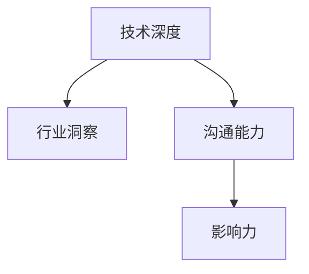

                 

# 从技术专家到行业意见领袖之路

技术专家与行业意见领袖，这两者间似乎仅有一步之遥，但实际上却是跨越性的突破。本文将带你从技术专家的角度出发，探讨如何成为行业意见领袖之路。通过逻辑清晰、结构紧凑、简单易懂的专业的技术语言，我们将共同梳理技术专家成为行业意见领袖所需掌握的核心知识、技能以及心态。

## 1. 背景介绍

### 1.1 问题由来

随着科技的飞速发展，特别是人工智能（AI）领域的飞速进步，技术专家们正面临着前所未有的机遇和挑战。一方面，深度学习、自然语言处理、计算机视觉等领域的最新技术，为行业带来了变革性的创新；另一方面，信息爆炸、数据隐私、伦理安全等新问题也频频涌现。在这样一个复杂多变的时代，技术专家需要不断学习、实践，并最终成为能够影响行业发展方向、引领技术趋势的意见领袖。

### 1.2 问题核心关键点

从技术专家到行业意见领袖，需要具备以下几个核心关键点：

- **技术深度**：掌握前沿技术并深入理解其原理和应用。
- **行业洞察**：洞悉行业趋势，能够识别并把握机会。
- **沟通能力**：有效传达技术价值，影响决策者。
- **影响力**：构建个人品牌，成为行业内外的意见领袖。

本文将从这些关键点出发，为你详细解读如何从技术专家成长为行业意见领袖。

## 2. 核心概念与联系

### 2.1 核心概念概述

为了更好地理解从技术专家到行业意见领袖的过程，我们需要掌握几个核心概念：

- **技术深度**：指对某一技术领域知识的深度掌握和应用能力，包括理论基础、算法原理、工具使用、项目实践等。
- **行业洞察**：对行业发展趋势、市场需求、竞争格局等有敏锐的感知和深入的理解。
- **沟通能力**：能够清晰、准确地表达技术观点，并影响决策者的能力。
- **影响力**：通过技术分享、文章写作、公开演讲等方式，影响行业内外人士的能力。

这些核心概念的联系如下图所示：



这个流程图展示了技术专家通过深入技术、洞察行业、提升沟通和构建影响力，最终成为行业意见领袖的路径。

## 3. 核心算法原理 & 具体操作步骤

### 3.1 算法原理概述

技术专家的成长过程，本质上是不断提升自身能力，并在这个基础上产生影响力的过程。这一过程可以分为三个阶段：技术积累、行业洞察、个人品牌建设。

### 3.2 算法步骤详解

#### 3.2.1 技术积累

1. **持续学习**：技术领域日新月异，只有不断学习，才能跟上最新的发展。
2. **项目实践**：将理论知识应用于实际项目，通过实践巩固理解。
3. **导师指导**：寻找行业内的导师，获取指导和建议。

#### 3.2.2 行业洞察

1. **市场调研**：通过调研，了解市场需求和技术趋势。
2. **行业交流**：参与行业会议、讨论，与同行交流观点。
3. **数据驱动**：利用数据分析，洞察行业发展趋势。

#### 3.2.3 个人品牌建设

1. **内容创作**：通过撰写文章、制作视频，分享技术见解。
2. **公开演讲**：在行业会议、技术社区进行公开演讲，提升影响力。
3. **社交网络**：利用社交媒体，扩大个人影响力。

### 3.3 算法优缺点

**优点**：
- **知识体系完善**：通过持续学习，构建完整的知识体系。
- **行业洞察敏锐**：通过调研和交流，获取行业最新动态。
- **影响力广泛**：通过内容创作和公开演讲，提升个人影响力。

**缺点**：
- **时间成本高**：需要大量时间和精力投入学习和实践。
- **初期难度大**：技术积累和行业洞察需要时间和经验。
- **挑战性强**：需要不断适应技术变化和行业动态。

### 3.4 算法应用领域

技术积累、行业洞察、个人品牌建设的方法和工具，在多个领域都有广泛应用：

- **AI领域**：深度学习、自然语言处理、计算机视觉等技术的发展和应用。
- **企业IT**：企业信息化、数据管理、云计算等技术的应用。
- **教育培训**：在线教育、技术培训、知识分享等。
- **医疗健康**：医疗数据分析、智能诊断等技术的应用。

## 4. 数学模型和公式 & 详细讲解 & 举例说明

### 4.1 数学模型构建

为了更好地描述技术专家的成长过程，我们可以构建一个数学模型：

假设技术专家的技术能力为 $C$，行业洞察力为 $I$，沟通能力为 $V$，影响力为 $P$。那么从技术专家成长为行业意见领袖的过程可以表示为：

$$
C \rightarrow I \rightarrow V \rightarrow P
$$

其中，$C \rightarrow I$ 表示通过技术积累提升行业洞察力；$I \rightarrow V$ 表示通过行业洞察力提升沟通能力；$V \rightarrow P$ 表示通过沟通能力构建影响力。

### 4.2 公式推导过程

以 $C \rightarrow I$ 为例，假设技术专家的技术能力可以通过学习新技术 $c_1$ 和实践项目 $c_2$ 来提升，那么有：

$$
C \leftarrow c_1 + c_2
$$

假设行业洞察力可以通过市场调研 $i_1$ 和行业交流 $i_2$ 来提升，那么有：

$$
I \leftarrow i_1 + i_2
$$

将上述公式代入 $C \rightarrow I$ 中，得到：

$$
C \rightarrow I = (c_1 + c_2) \rightarrow (i_1 + i_2)
$$

### 4.3 案例分析与讲解

假设一位技术专家学习了深度学习的新算法 $c_1 = 0.8$，并在实际项目中实践 $c_2 = 0.6$，则其技术能力提升为 $C = c_1 + c_2 = 1.4$。通过市场调研 $i_1 = 0.7$ 和行业交流 $i_2 = 0.5$，其行业洞察力提升为 $I = i_1 + i_2 = 1.2$。此时，技术专家具备了行业洞察力，可以进一步提升沟通能力和影响力。

## 5. 项目实践：代码实例和详细解释说明

### 5.1 开发环境搭建

为了实践技术积累、行业洞察和影响力建设，我们需要搭建一个全面的开发环境。以下是一个典型开发环境的配置步骤：

1. **安装编程工具**：安装 Python、Jupyter Notebook、Git 等工具。
2. **安装开源库**：安装深度学习框架（如 TensorFlow、PyTorch）、数据分析库（如 Pandas、NumPy）等。
3. **设置虚拟环境**：使用虚拟环境（如 Conda、virtualenv）管理依赖库。
4. **项目结构设计**：按照模块化设计项目结构，便于管理和维护。

### 5.2 源代码详细实现

以下是一个简单的项目实践代码实例，展示了如何通过数据分析和可视化提升技术专家的行业洞察力：

```python
import pandas as pd
import matplotlib.pyplot as plt

# 读取数据
data = pd.read_csv('industry_data.csv')

# 数据预处理
data = data.dropna()

# 数据可视化
plt.figure(figsize=(10, 6))
plt.title('Industry Trends')
plt.plot(data['year'], data['revenue'], label='Revenue')
plt.xlabel('Year')
plt.ylabel('Revenue')
plt.legend()
plt.show()
```

### 5.3 代码解读与分析

上述代码通过 Pandas 和 Matplotlib 库，对行业数据进行读取、预处理和可视化。通过可视化分析，技术专家可以直观地了解行业发展趋势，提升其行业洞察力。

### 5.4 运行结果展示

运行上述代码后，会得到一个行业发展趋势图，直观展示了过去几年的行业收入变化情况。这可以帮助技术专家更好地了解行业动态，为技术积累和影响力建设提供有力支持。

## 6. 实际应用场景

### 6.1 企业 IT 架构优化

技术专家通过持续学习新技术和实践项目，积累技术深度。通过市场调研和行业交流，洞察企业 IT 架构的痛点和需求。通过公开演讲和文章创作，提升影响力，引领企业 IT 架构的优化和升级。

### 6.2 AI 技术应用推广

技术专家通过深度学习、自然语言处理等技术的学习和实践，积累技术深度。通过调研 AI 领域的最新技术和应用，洞察市场需求和行业趋势。通过行业会议和技术社区的分享，提升影响力，推广 AI 技术在各行业的应用。

### 6.3 医疗健康数据分析

技术专家通过学习数据分析和机器学习等技术，积累技术深度。通过调研医疗健康领域的数据和应用，洞察市场需求和技术趋势。通过撰写文章和公开演讲，提升影响力，推动医疗健康数据分析的应用和创新。

## 7. 工具和资源推荐

### 7.1 学习资源推荐

为了技术专家能够全面掌握所需技能，以下是一些推荐的学习资源：

1. **深度学习课程**：如 Coursera 的《Deep Learning Specialization》课程。
2. **数据分析工具**：如 DataCamp 的《Python Data Analysis》课程。
3. **项目管理工具**：如 Scrum.org 的《Scrum Foundation》课程。
4. **开源项目**：如 GitHub 上的深度学习项目，实践最新技术。
5. **技术社区**：如 Stack Overflow、Medium，分享和交流技术见解。

### 7.2 开发工具推荐

以下是一些常用的开发工具，帮助技术专家提升效率：

1. **IDE**：如 Visual Studio Code、PyCharm、Jupyter Notebook。
2. **版本控制**：如 Git、GitHub。
3. **项目管理**：如 Jira、Trello。
4. **文档工具**：如 Confluence、Notion。

### 7.3 相关论文推荐

为了技术专家能够深入理解技术原理，以下是一些推荐的相关论文：

1. **深度学习**：如《Deep Learning》（Goodfellow et al., 2016）。
2. **数据分析**：如《Data Science for Business》（Witten et al., 2016）。
3. **项目管理**：如《Agile Estimating and Planning》（Leffingwell et al., 2011）。

## 8. 总结：未来发展趋势与挑战

### 8.1 研究成果总结

从技术专家到行业意见领袖，是一个从积累到影响的过程。技术深度、行业洞察、沟通能力和影响力的提升，需要持续学习、实践和分享。

### 8.2 未来发展趋势

1. **技术不断进步**：深度学习、自然语言处理等技术的快速发展，为技术专家提供了更多的机会。
2. **行业需求变化**：企业信息化、AI技术应用、医疗健康等领域的需求不断变化，需要技术专家不断学习和适应。
3. **影响力扩大**：通过内容创作、公开演讲等形式，技术专家的影响力将进一步扩大。

### 8.3 面临的挑战

1. **技术更新快**：新技术层出不穷，需要技术专家持续学习。
2. **行业竞争激烈**：各领域竞争激烈，需要技术专家不断创新和突破。
3. **影响力建设难**：需要时间积累，需要技术专家有持续的输出和分享。

### 8.4 研究展望

未来，技术专家可以通过以下方向进行进一步研究：

1. **跨学科融合**：将技术深度与行业洞察力结合，探索新的应用场景。
2. **国际化视野**：通过国际交流和合作，提升全球影响力。
3. **伦理和社会责任**：关注技术伦理和社会责任，推动技术健康发展。

## 9. 附录：常见问题与解答

**Q1：如何平衡技术学习和实践？**

A: 制定合理的学习计划，将学习与实践相结合。通过在线课程、书籍、项目等方式，系统学习技术知识。同时，通过实际项目积累经验，将所学知识应用到实践中。

**Q2：如何提升沟通能力？**

A: 通过参加公开演讲、行业会议，与同行交流，提升沟通能力。利用社交媒体平台，分享技术见解，增强影响力。

**Q3：如何构建个人品牌？**

A: 通过撰写技术博客、创建技术社区、参与技术论坛，提升个人品牌影响力。定期分享技术见解，建立专业形象。

**Q4：如何应对技术更新快的问题？**

A: 建立学习习惯，持续关注最新的技术动态。通过在线课程、技术社区、学术会议等方式，及时更新技术知识。

**Q5：如何应对行业竞争激烈的问题？**

A: 持续创新，保持技术领先。关注行业动态，洞察市场需求。通过技术分享、公开演讲等方式，提升影响力，引导行业发展。

通过本文的系统梳理，技术专家可以明确成为行业意见领袖所需掌握的核心知识、技能和心态。通过不断学习、实践和分享，相信每一位技术专家都能在各自的领域中成为行业意见领袖，推动技术进步和行业发展。

---

作者：禅与计算机程序设计艺术 / Zen and the Art of Computer Programming

