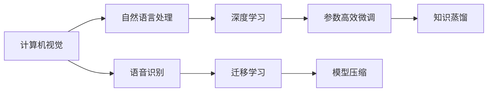

                 

# 从研究到应用：Lepton AI的技术转化之路

> 关键词：人工智能,技术转化,Lepton AI,算法,模型,应用

## 1. 背景介绍

### 1.1 问题由来

在当今信息爆炸的互联网时代，人工智能（AI）已经成为推动各行各业发展的核心动力。作为AI领域的重要组成部分，Lepton AI近年来在计算机视觉、自然语言处理（NLP）、语音识别等多个领域取得了显著进展。然而，这些技术的研究与落地之间仍然存在一定的鸿沟，如何将前沿研究成果转化为实际应用，成为AI领域亟待解决的问题。

### 1.2 问题核心关键点

1. **算法设计与优化**：高效的算法设计和优化是技术转化的基础。
2. **数据质量与处理**：高质量的数据集和高效的数据处理方法是技术转化的关键。
3. **模型训练与验证**：通过合适的模型训练和验证策略，提升模型的性能和鲁棒性。
4. **应用场景适配**：针对实际应用场景，对模型进行适应的微调和优化。
5. **技术文档与支持**：提供详细的技术文档和用户支持，确保技术的顺利落地。

## 2. 核心概念与联系

### 2.1 核心概念概述

Lepton AI的技术转化涉及多个核心概念，这些概念相互关联，共同构成了技术转化的基础框架：

- **计算机视觉（CV）**：利用计算机技术对图像和视频进行处理、分析和理解。
- **自然语言处理（NLP）**：使用自然语言进行信息提取、语义分析和生成。
- **语音识别（ASR）**：将语音信号转换为文本或指令。
- **深度学习（DL）**：通过深度神经网络进行复杂数据处理和模型训练。
- **迁移学习（Transfer Learning）**：在现有模型基础上，针对新任务进行微调，提升模型性能。
- **参数高效微调（PEFT）**：在微调过程中，只更新少量参数，避免过拟合。
- **模型压缩（Model Compression）**：通过剪枝、量化等方法，减小模型规模，提高计算效率。
- **知识蒸馏（Knowledge Distillation）**：通过小模型学习大模型的知识，提升模型性能和效率。

这些概念之间的联系可以通过以下Mermaid流程图来展示：



这个流程图展示了计算机视觉、自然语言处理和语音识别等不同AI技术之间的联系，以及它们如何与深度学习、迁移学习、参数高效微调、模型压缩和知识蒸馏等技术相互作用，共同支持技术的转化和应用。

## 3. 核心算法原理 & 具体操作步骤

### 3.1 算法原理概述

Lepton AI的技术转化主要依赖于深度学习算法，特别是卷积神经网络（CNN）和循环神经网络（RNN）及其变种。这些算法通过多层非线性变换，从原始数据中提取高层次特征，并进行复杂模式的识别和分类。

在技术转化过程中，主要涉及以下几个步骤：

1. **数据准备**：收集、清洗和标注高质量的训练数据集。
2. **模型选择与设计**：选择合适的深度学习模型，并根据任务需求进行设计和优化。
3. **模型训练与验证**：使用训练数据集对模型进行训练，并在验证数据集上进行性能评估。
4. **模型微调与优化**：在实际应用场景中，针对特定任务进行微调，优化模型参数和结构。
5. **模型部署与集成**：将训练好的模型集成到实际应用系统中，并进行部署和优化。

### 3.2 算法步骤详解

#### 数据准备

- **数据收集**：根据应用场景，收集相关的数据集。例如，计算机视觉任务需要图像数据，自然语言处理任务需要文本数据。
- **数据清洗**：清洗数据集，去除噪声和错误标注的数据。
- **数据标注**：对数据进行标注，包括像素级别标注、实体标注等。

#### 模型选择与设计

- **模型选择**：根据任务需求选择合适的模型。例如，计算机视觉任务可以选择ResNet、Inception等CNN模型，自然语言处理任务可以选择BERT、GPT等Transformer模型。
- **模型设计**：设计模型架构，包括层数、卷积核大小、激活函数等。

#### 模型训练与验证

- **训练过程**：使用训练数据集对模型进行训练，更新模型参数。
- **验证过程**：在验证数据集上评估模型性能，选择最佳模型参数。

#### 模型微调与优化

- **微调**：在特定任务上，对模型进行微调，优化模型参数和结构。
- **优化**：通过剪枝、量化等方法，减小模型规模，提高计算效率。

#### 模型部署与集成

- **部署**：将训练好的模型部署到实际应用系统中。
- **集成**：将模型与用户界面、数据流等集成，构建完整的解决方案。

### 3.3 算法优缺点

**优点**：

1. **高精度**：深度学习算法在处理复杂数据和模式识别方面具有高精度。
2. **可扩展性**：深度学习模型可以通过堆叠多层神经网络进行扩展，适应不同复杂度的任务。
3. **自动化**：深度学习算法可以通过自动化的方式进行模型训练和优化。

**缺点**：

1. **数据依赖**：深度学习算法对数据质量和数量有较高的依赖，需要大量标注数据。
2. **计算资源需求高**：深度学习模型需要大量的计算资源进行训练和推理。
3. **可解释性差**：深度学习模型通常被视为“黑盒”，难以解释其内部决策过程。

### 3.4 算法应用领域

Lepton AI的技术转化应用于多个领域，包括但不限于：

- **自动驾驶**：利用计算机视觉和深度学习技术进行环境感知和决策。
- **医疗影像分析**：利用计算机视觉和深度学习技术进行影像分析和诊断。
- **智能客服**：利用自然语言处理和深度学习技术进行智能对话和问题解答。
- **金融分析**：利用自然语言处理和深度学习技术进行情感分析和舆情监测。
- **语音识别**：利用语音识别和深度学习技术进行语音指令控制和交互。

## 4. 数学模型和公式 & 详细讲解 & 举例说明

### 4.1 数学模型构建

Lepton AI的技术转化主要依赖于深度学习模型，包括卷积神经网络（CNN）和循环神经网络（RNN）及其变种。以卷积神经网络为例，其数学模型可以表示为：

$$
y = f_\theta(x)
$$

其中 $x$ 表示输入数据，$y$ 表示输出数据，$f_\theta$ 表示由参数 $\theta$ 定义的神经网络模型。

### 4.2 公式推导过程

以卷积神经网络为例，其卷积层的基本操作可以表示为：

$$
y_{c,i,j,k} = w_{c,i,j,k} * x_{i,j} + b_{c,i,j}
$$

其中 $w_{c,i,j,k}$ 表示卷积核，$x_{i,j}$ 表示输入数据的特征图，$b_{c,i,j}$ 表示偏置项。

### 4.3 案例分析与讲解

以计算机视觉中的图像分类任务为例，其目标是将输入图像分类为多个预定义类别中的一个。模型通过卷积层和池化层提取图像特征，然后使用全连接层将特征映射到类别概率分布上。

在实际应用中，可以通过对模型进行微调来提升性能。例如，在新的数据集上，可以重新训练模型，或者对现有模型进行参数更新和结构调整。

## 5. 项目实践：代码实例和详细解释说明

### 5.1 开发环境搭建

- **Python环境**：安装Python 3.8及以上版本。
- **深度学习框架**：安装TensorFlow或PyTorch。
- **数据处理库**：安装NumPy、Pandas、Scikit-learn等数据处理库。

### 5.2 源代码详细实现

以下是一个简单的图像分类模型训练代码实现：

```python
import tensorflow as tf
from tensorflow import keras

# 加载数据集
(x_train, y_train), (x_test, y_test) = keras.datasets.mnist.load_data()

# 数据预处理
x_train = x_train.reshape(-1, 28, 28, 1) / 255.0
x_test = x_test.reshape(-1, 28, 28, 1) / 255.0

# 构建模型
model = keras.Sequential([
    keras.layers.Conv2D(32, (3, 3), activation='relu', input_shape=(28, 28, 1)),
    keras.layers.MaxPooling2D((2, 2)),
    keras.layers.Flatten(),
    keras.layers.Dense(10, activation='softmax')
])

# 编译模型
model.compile(optimizer='adam',
              loss='sparse_categorical_crossentropy',
              metrics=['accuracy'])

# 训练模型
model.fit(x_train, y_train, epochs=5, validation_data=(x_test, y_test))
```

### 5.3 代码解读与分析

上述代码展示了如何使用TensorFlow进行简单的图像分类任务训练。主要步骤如下：

1. 加载MNIST数据集，并进行数据预处理。
2. 构建卷积神经网络模型，包括卷积层、池化层和全连接层。
3. 编译模型，选择优化器和损失函数。
4. 训练模型，并在验证集上进行性能评估。

### 5.4 运行结果展示

在训练完成后，可以通过以下代码进行模型评估：

```python
test_loss, test_acc = model.evaluate(x_test, y_test)
print('Test accuracy:', test_acc)
```

## 6. 实际应用场景

### 6.1 智能医疗影像分析

Lepton AI的计算机视觉技术可以应用于医疗影像分析，通过深度学习模型对医学影像进行分类、分割和标注。例如，在肺结节检测任务中，可以利用卷积神经网络模型对CT影像进行检测和分类，辅助医生进行早期诊断。

### 6.2 金融情感分析

Lepton AI的自然语言处理技术可以应用于金融情感分析，通过深度学习模型对新闻、社交媒体等文本数据进行情感分析和舆情监测，帮助金融机构及时捕捉市场情绪变化，做出合理决策。

### 6.3 自动驾驶环境感知

Lepton AI的计算机视觉技术可以应用于自动驾驶，通过深度学习模型进行环境感知和目标检测，辅助自动驾驶汽车进行路径规划和安全决策。

### 6.4 未来应用展望

未来，Lepton AI的技术转化将在更多领域得到应用，为各行各业带来新的变革：

1. **智慧城市**：利用计算机视觉和自然语言处理技术进行交通管理、公共安全等。
2. **智能家居**：利用自然语言处理和语音识别技术进行语音控制和智能推荐。
3. **个性化推荐**：利用自然语言处理和深度学习技术进行内容推荐和个性化服务。
4. **工业自动化**：利用计算机视觉和深度学习技术进行自动化检测和质量控制。

## 7. 工具和资源推荐

### 7.1 学习资源推荐

1. **深度学习基础**：Coursera的《Deep Learning Specialization》课程，由Andrew Ng主讲。
2. **自然语言处理**：斯坦福大学的《CS224N: Natural Language Processing with Deep Learning》课程。
3. **计算机视觉**：Coursera的《Convolutional Neural Networks》课程，由Geoffrey Hinton主讲。

### 7.2 开发工具推荐

1. **深度学习框架**：TensorFlow、PyTorch、Keras等。
2. **数据处理库**：NumPy、Pandas、Scikit-learn等。
3. **模型压缩工具**：TensorFlow Model Optimization Toolkit。

### 7.3 相关论文推荐

1. **深度学习优化**：《Accelerating Deep Network Training by Exponential Learning Rates》。
2. **知识蒸馏**：《Distilling the Knowledge in a Neural Network》。
3. **模型压缩**：《Compression of Deep Neural Networks for Fast and Low Power Mobile Applications》。

## 8. 总结：未来发展趋势与挑战

### 8.1 总结

本文对Lepton AI的技术转化进行了系统介绍，涵盖了计算机视觉、自然语言处理和语音识别等不同AI技术的应用。从研究到应用，涉及算法设计与优化、数据质量与处理、模型训练与验证、模型微调与优化等多个环节。通过本文的系统梳理，可以看到Lepton AI在多个领域的成功应用，展示了其强大的技术转化能力。

### 8.2 未来发展趋势

未来，Lepton AI的技术转化将继续向着更加高效、智能、可解释的方向发展：

1. **高效模型**：通过模型压缩和量化技术，提升模型的计算效率和部署速度。
2. **智能模型**：引入更多先验知识，增强模型的智能推理和决策能力。
3. **可解释模型**：通过知识蒸馏和因果分析，提升模型的可解释性和透明度。

### 8.3 面临的挑战

尽管Lepton AI的技术转化已经取得了显著进展，但仍面临以下挑战：

1. **数据瓶颈**：高质量的数据集和标注工作仍是技术转化的关键瓶颈。
2. **计算资源**：深度学习模型需要大量的计算资源进行训练和推理。
3. **模型复杂性**：深度学习模型的复杂性导致其难以解释和优化。

### 8.4 研究展望

未来的研究需要在以下几个方面进行突破：

1. **数据生成技术**：利用生成对抗网络（GAN）等技术，自动生成高质量数据集。
2. **模型优化算法**：研究新的优化算法，提高模型训练效率和效果。
3. **跨模态融合**：将计算机视觉、自然语言处理和语音识别等技术进行融合，构建跨模态智能系统。

## 9. 附录：常见问题与解答

**Q1: 数据质量对Lepton AI的技术转化有哪些影响？**

A: 数据质量是Lepton AI技术转化的基础，直接影响模型的训练效果和泛化能力。高质量的数据集和标注工作，可以显著提升模型的性能和鲁棒性。然而，数据质量和数量的不足，会导致模型过拟合和泛化性能下降。

**Q2: 模型压缩有哪些方法？**

A: 模型压缩是Lepton AI技术转化的重要手段，包括剪枝、量化、知识蒸馏等方法。剪枝通过去除冗余参数，减小模型规模；量化通过降低模型精度，减小存储空间和计算量；知识蒸馏通过将大模型的知识传递给小模型，提高模型的泛化能力。

**Q3: 知识蒸馏在Lepton AI的技术转化中扮演什么角色？**

A: 知识蒸馏是Lepton AI技术转化的重要技术，通过小模型学习大模型的知识，提升模型性能和效率。知识蒸馏可以避免大模型的过拟合问题，同时减小模型规模，降低计算资源需求。

**Q4: Lepton AI的技术转化在不同领域的应用有哪些？**

A: Lepton AI的技术转化应用于多个领域，包括医疗影像分析、金融情感分析、自动驾驶、智能客服、语音识别等。这些应用展示了Lepton AI在不同领域的强大技术转化能力，推动了各行各业的发展。

---

作者：禅与计算机程序设计艺术 / Zen and the Art of Computer Programming

