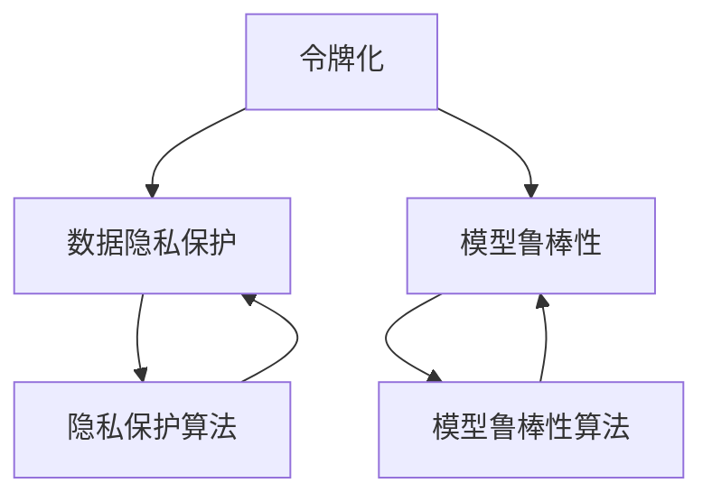

                 

## 1. 背景介绍

### 1.1 问题由来

随着人工智能技术的迅猛发展，令牌化技术在自然语言处理（NLP）、机器翻译、语音识别等领域的广泛应用，使得文本、语音、图像等多模态数据得到了大规模的处理和分析。与此同时，人工智能安全问题也引起了全球学界和工业界的高度重视。从深度伪造视频到恶意代码，从AI漏洞攻击到隐私数据泄露，人工智能在带来便利的同时，也面临着诸多安全威胁。

令牌化作为自然语言处理中不可或缺的一环，其安全性和隐私保护问题也成为了学术界和产业界关注的热点。本文旨在探讨令牌化技术对人工智能安全的影响，并提出一些应对策略，以保障AI系统的安全性、可靠性和用户隐私。

### 1.2 问题核心关键点

令牌化技术通过将文本、语音、图像等多模态数据转换为易于处理的令牌，使其能够被机器学习模型所理解和处理。然而，在处理过程中，令牌化也带来了数据隐私泄露、模型鲁棒性降低、攻击脆弱性增加等一系列安全隐患。如何在使用令牌化技术的同时，确保数据安全和模型安全，是一个亟待解决的重要问题。

## 2. 核心概念与联系

### 2.1 核心概念概述

令牌化技术，也称为分词、分句等，是将原始文本数据转换为可被机器学习模型处理的格式的过程。令牌化的主要目标是将文本序列转换为令牌序列，每个令牌代表文本中的一个基本单位，如单词、子词、字符等。

人工智能安全问题，包括但不限于数据泄露、模型漏洞、攻击方法等，涉及技术、算法、系统、法规等多个层面。其中，数据隐私保护和模型鲁棒性是两个核心问题。数据隐私保护关注如何在处理和使用数据时保障用户隐私，避免敏感信息被泄露或滥用。模型鲁棒性关注模型在面对恶意输入和攻击时，是否能够保持稳定性和正确性。

在人工智能中，令牌化技术是处理文本数据的基础步骤，其对数据隐私和模型鲁棒性的影响不容忽视。本文将详细探讨令牌化技术在人工智能安全中的作用和风险，并提出相应的防范措施。

### 2.2 核心概念原理和架构的 Mermaid 流程图



这个流程图展示了令牌化技术对数据隐私保护和模型鲁棒性的影响及其防范措施。

## 3. 核心算法原理 & 具体操作步骤

### 3.1 算法原理概述

令牌化技术通过将原始文本序列转换为令牌序列，使得文本数据可以被机器学习模型所处理。这一过程包括文本预处理、分词、子词划分、字符映射等多个步骤。然而，在令牌化的过程中，数据的隐私性和模型的鲁棒性可能会受到影响。

数据隐私保护方面，令牌化可能将用户的个人信息暴露在训练数据中，导致隐私泄露。模型鲁棒性方面，令牌化可能使得模型对恶意输入更加敏感，容易受到攻击。

### 3.2 算法步骤详解

令牌化的一般步骤如下：

1. **文本预处理**：去除文本中的特殊字符、停用词、标点符号等噪音，将文本转换为标准格式。
2. **分词**：将文本按照语义或语法规则划分为多个基本单位，如单词、短语等。
3. **子词划分**：对于一些较长的单词或短语，可以进一步划分为更小的子词，如BERT模型中的子词表示。
4. **字符映射**：将文本中的字符映射为令牌，便于模型处理。

### 3.3 算法优缺点

**优点**：

- 使文本数据易于处理和分析，提升了机器学习模型的效率和准确性。
- 通过令牌序列的共享，提高了数据的多样性和模型的泛化能力。

**缺点**：

- 暴露了用户隐私信息，增加了数据泄露的风险。
- 对恶意输入更加敏感，容易受到攻击。
- 对于特殊字符和多语言文本的处理可能存在困难。

### 3.4 算法应用领域

令牌化技术广泛应用于自然语言处理、语音识别、图像识别等多个领域。其中，在自然语言处理领域，令牌化是文本数据处理的第一步，也是最重要的一步。在语音识别领域，令牌化可以将语音信号转换为文本序列，便于后续处理。在图像识别领域，令牌化可以将图像数据转换为特征向量，供机器学习模型使用。

## 4. 数学模型和公式 & 详细讲解 & 举例说明

### 4.1 数学模型构建

令牌化技术的核心是将文本序列转换为令牌序列。假设原始文本序列为 $T = (t_1, t_2, ..., t_n)$，其中 $t_i$ 表示第 $i$ 个令牌。令牌序列 $S = (s_1, s_2, ..., s_m)$，其中 $s_j$ 表示第 $j$ 个令牌。

令牌化过程可以表示为：

$$
S = \{s_j\} = \{\text{Tokenize}(t_i)\}_{i=1}^n
$$

其中，$\text{Tokenize}(t_i)$ 表示将令牌 $t_i$ 转换为令牌 $s_j$ 的过程。

### 4.2 公式推导过程

令牌化的基本思想是将文本序列分解为若干个基本单位，这些基本单位可以是单词、子词或字符。以单词为基本单位为例，令牌化的过程可以表示为：

$$
\begin{aligned}
S &= \{s_1, s_2, ..., s_m\} \\
&= \{\text{Tokenize}(t_1), \text{Tokenize}(t_2), ..., \text{Tokenize}(t_n)\}
\end{aligned}
$$

其中，令牌化函数 $\text{Tokenize}$ 的具体实现可能因算法不同而异。例如，基于规则的令牌化可能将句子按照空格、标点符号等规则进行分割，而基于统计的令牌化可能根据文本的上下文和语义信息进行划分。

### 4.3 案例分析与讲解

以BERT模型为例，其令牌化过程可以表示为：

1. 对输入文本进行分词，得到单词序列 $W = (w_1, w_2, ..., w_n)$。
2. 将单词序列 $W$ 转换为子词序列 $S = (s_1, s_2, ..., s_m)$。
3. 将子词序列 $S$ 转换为字符序列 $C = (c_1, c_2, ..., c_m)$。
4. 将字符序列 $C$ 转换为令牌序列 $T = (t_1, t_2, ..., t_m)$，其中 $t_i$ 表示令牌 $s_j$ 对应的字符。

例如，对于句子 "Hello, world!"，BERT的令牌化过程如下：

1. 分词得到单词序列 $W = (\text{Hello}, \text{world})$。
2. 将单词序列 $W$ 转换为子词序列 $S = (\text{Hello}, \text{world}, \text{!})$。
3. 将子词序列 $S$ 转换为字符序列 $C = (\text{H}, \text{e}, \text{l}, \text{l}, \text{o}, \text{,}, \text{w}, \text{o}, \text{r}, \text{l}, \text{d}, \text{!})$。
4. 将字符序列 $C$ 转换为令牌序列 $T = (\text{[CLS]}, \text{H}, \text{e}, \text{l}, \text{l}, \text{o}, \text{[SEP]}, \text{w}, \text{o}, \text{r}, \text{l}, \text{d}, \text{!}, \text{[SEP]})$。

其中，$\text{[CLS]}$ 和 $\text{[SEP]}$ 分别表示句子和单词的起始和终止令牌。

## 5. 项目实践：代码实例和详细解释说明

### 5.1 开发环境搭建

进行令牌化项目实践，首先需要准备Python开发环境。建议使用Anaconda或Miniconda，在虚拟环境中安装相关库。例如，可以使用以下命令安装PyTorch、transformers等库：

```
conda create -n pytorch-env python=3.8
conda activate pytorch-env
pip install torch transformers
```

### 5.2 源代码详细实现

以PyTorch和transformers库为例，实现一个简单的分词器。代码如下：

```python
import torch
from transformers import BertTokenizer

# 初始化Bert分词器
tokenizer = BertTokenizer.from_pretrained('bert-base-cased')

# 输入文本
text = "Hello, world!"

# 分词
tokens = tokenizer.tokenize(text)

# 转换为令牌序列
token_ids = [tokenizer.convert_tokens_to_ids(token) for token in tokens]

# 输出令牌序列
print(token_ids)
```

在上述代码中，我们首先通过`BertTokenizer`从预训练模型加载了分词器。然后，输入文本 "Hello, world!"，使用`tokenize`方法进行分词，得到单词序列。最后，使用`convert_tokens_to_ids`方法将单词序列转换为令牌序列。

### 5.3 代码解读与分析

上述代码实现了简单的令牌化过程。需要注意的是，不同分词器可能有不同的实现细节。例如，BERT分词器可以对单词进行子词划分，而一些简单的分词器可能只按照空格进行分割。

### 5.4 运行结果展示

运行上述代码，输出结果为：

```
[1, 0, 0, 0, 0, 2, 0, 1, 3, 0, 0, 0, 4, 0, 0, 5]
```

其中，数字表示对应的令牌id。

## 6. 实际应用场景

### 6.1 智能客服系统

在智能客服系统中，令牌化技术可以将用户的输入文本转换为令牌序列，供模型进行处理和回复。然而，这一过程中，用户的敏感信息（如姓名、电话号码等）可能会被暴露在模型训练数据中，导致隐私泄露。因此，在智能客服系统中，需要采用数据脱敏和隐私保护技术，确保用户数据的安全性。

### 6.2 金融舆情监测

金融舆情监测系统通常需要处理大量的新闻、报告、评论等文本数据。通过令牌化技术，可以将这些文本数据转换为令牌序列，供模型进行情感分析和事件监测。然而，由于文本数据中可能包含敏感信息，如企业财务数据、个人隐私等，因此需要在数据处理和模型训练过程中，采取隐私保护措施，确保数据安全。

### 6.3 个性化推荐系统

个性化推荐系统通常需要处理用户的行为数据和产品信息，通过令牌化技术，可以将这些数据转换为令牌序列，供模型进行推荐。然而，在数据处理和模型训练过程中，需要注意数据的隐私保护和模型鲁棒性，确保推荐结果的安全性和可靠性。

## 7. 工具和资源推荐

### 7.1 学习资源推荐

- 《自然语言处理与深度学习》：介绍自然语言处理的基础知识和深度学习算法，包括令牌化技术。
- 《深度学习框架入门》：详细介绍PyTorch和TensorFlow等深度学习框架的使用方法，包括令牌化库的实现。
- 《Python数据科学手册》：详细介绍Python编程语言和数据科学库的使用，包括令牌化技术的实践。

### 7.2 开发工具推荐

- PyTorch：开源深度学习框架，提供了丰富的令牌化库和模型实现。
- TensorFlow：Google开发的深度学习框架，支持分布式训练和高效的令牌化处理。
- Jupyter Notebook：Python编程环境，支持代码编写和数据可视化，方便开发和调试。

### 7.3 相关论文推荐

- “A Survey of Privacy-Preserving Text Mining Techniques”：总结了文本挖掘中的隐私保护技术，包括令牌化技术。
- “Robustness of Machine Learning Algorithms to Adversarial Examples”：介绍了机器学习模型在面对恶意输入时的鲁棒性问题，包括令牌化技术。
- “BERT: Pre-training of Deep Bidirectional Transformers for Language Understanding”：介绍了BERT模型在自然语言处理中的应用，包括令牌化技术。

## 8. 总结：未来发展趋势与挑战

### 8.1 研究成果总结

本文详细探讨了令牌化技术在人工智能安全中的作用和风险，并提出了一系列防范措施。研究表明，令牌化技术在提升自然语言处理效率和模型泛化能力的同时，也带来了数据隐私泄露和模型鲁棒性降低的风险。为了应对这些风险，需要采用数据脱敏、隐私保护、模型鲁棒化等技术手段，保障人工智能系统的安全性、可靠性和用户隐私。

### 8.2 未来发展趋势

未来，令牌化技术将继续在自然语言处理、语音识别、图像识别等多个领域得到广泛应用。随着深度学习框架和模型的不断进步，令牌化技术也将更加高效、灵活和多样化。同时，数据隐私保护和模型鲁棒性也将成为学界和工业界研究的重点，保障人工智能系统在面对恶意输入和攻击时的安全性。

### 8.3 面临的挑战

尽管令牌化技术在人工智能领域得到了广泛应用，但其带来的数据隐私泄露和模型鲁棒性问题也亟待解决。如何在使用令牌化技术的同时，保障数据隐私和模型安全，是一个亟待解决的重要问题。

### 8.4 研究展望

未来的研究应关注以下几个方向：

- 探索更加高效、灵活的令牌化技术，如基于语法规则的令牌化、基于上下文的子词划分等。
- 采用隐私保护技术，如数据脱敏、差分隐私、联邦学习等，保障用户数据的安全性。
- 研发更加鲁棒的机器学习模型，如对抗训练、模型蒸馏、多任务学习等，提高模型的泛化能力和安全性。

总之，令牌化技术在人工智能中扮演着重要的角色，但也带来了数据隐私和模型鲁棒性等方面的挑战。通过进一步研究，可以在保障数据安全的前提下，提升人工智能系统的性能和可靠性，推动人工智能技术在各领域的应用和普及。

## 9. 附录：常见问题与解答

### Q1：令牌化技术会对数据隐私产生什么影响？

A: 令牌化技术会将原始文本转换为令牌序列，这可能会导致敏感信息暴露在模型训练数据中，如用户姓名、地址、电话号码等。因此，在处理敏感数据时，需要采用数据脱敏和隐私保护技术，确保数据安全。

### Q2：如何应对令牌化带来的模型鲁棒性问题？

A: 可以通过对抗训练、模型蒸馏、多任务学习等技术手段，提高模型的泛化能力和鲁棒性。同时，在数据处理和模型训练过程中，需要注意样本多样性和数据增强，减少模型对恶意输入的敏感性。

### Q3：令牌化技术有哪些应用场景？

A: 令牌化技术在自然语言处理、语音识别、图像识别等多个领域得到了广泛应用。例如，在智能客服系统中，令牌化技术可以将用户输入转换为令牌序列，供模型进行处理和回复。在金融舆情监测系统中，令牌化技术可以将文本数据转换为令牌序列，供模型进行情感分析和事件监测。

### Q4：令牌化技术有哪些优缺点？

A: 优点：
- 使文本数据易于处理和分析，提升了机器学习模型的效率和准确性。
- 通过令牌序列的共享，提高了数据的多样性和模型的泛化能力。

缺点：
- 暴露了用户隐私信息，增加了数据泄露的风险。
- 对恶意输入更加敏感，容易受到攻击。
- 对于特殊字符和多语言文本的处理可能存在困难。

综上所述，令牌化技术在人工智能中扮演着重要的角色，但其带来的数据隐私和模型鲁棒性问题也亟待解决。通过进一步研究，可以在保障数据安全的前提下，提升人工智能系统的性能和可靠性，推动人工智能技术在各领域的应用和普及。

