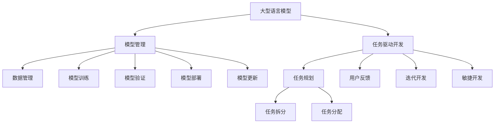

                 

# 任务规划革命：LLM如何改变软件开发范式

> 关键词：大型语言模型(Large Language Model, LLM), 自然语言处理(Natural Language Processing, NLP), 开发流程优化, 任务驱动开发, 模型管理, 自动化部署, 安全与合规

## 1. 背景介绍

### 1.1 问题由来
随着人工智能(AI)技术的迅猛发展，大型语言模型(LLM)在自然语言处理(NLP)领域取得了显著的进步。它们能够理解和生成人类语言，被广泛应用于各种场景，如智能客服、自动翻译、内容生成等。然而，尽管LLM在推理和生成方面表现出色，但传统的软件开发范式，如瀑布模型、迭代模型等，并不适合以LLM为核心的应用开发。

### 1.2 问题核心关键点
LLM的应用面临的主要问题包括：
- **任务复杂性**：传统的软件开发范式难以处理多任务、多场景的复杂任务规划。
- **数据和模型管理**：传统的开发流程无法高效地管理和维护庞大的数据集和复杂的模型结构。
- **自动化部署**：传统流程在模型更新和部署方面效率低下，且难以实现自动化。
- **安全与合规**：LLM应用需要严格遵守数据保护法规，传统的开发范式无法保证合规性。
- **用户体验**：传统流程难以快速迭代和响应用户需求，用户体验不足。

因此，我们需要一种新型的开发范式，以更好地适应LLM在任务规划、数据管理、自动化部署等方面的需求，同时确保安全与合规。

### 1.3 问题研究意义
开发一种基于LLM的任务规划范式，对于提升软件开发的效率、灵活性和安全性，具有重要意义：

1. **提升开发效率**：通过任务驱动的开发，可以将复杂任务拆分成更小的、易于管理的子任务，提高开发速度和质量。
2. **增强灵活性**：任务驱动的开发方式可以根据用户需求和业务变化，灵活调整开发计划，快速响应变化。
3. **确保合规性**：通过合规性驱动的开发，可以确保应用在数据处理、模型使用等方面符合相关法规要求。
4. **优化用户体验**：通过用户反馈驱动的开发，可以持续改进应用，提升用户体验。
5. **降低成本**：任务驱动的开发可以避免传统瀑布模型中重复劳动和浪费，降低开发成本。

## 2. 核心概念与联系

### 2.1 核心概念概述

为更好地理解基于LLM的任务规划范式，本节将介绍几个关键概念：

- **大型语言模型(LLM)**：以自回归或自编码模型为代表的大规模预训练语言模型。通过在大规模无标签文本数据上进行预训练，学习通用的语言表示，具备强大的语言理解和生成能力。

- **任务驱动开发**：一种以用户任务为中心的开发范式，将复杂任务拆分成多个小任务，每个小任务独立开发和测试，最终整合形成完整应用。

- **模型管理**：管理和维护数据集和模型的过程，包括数据集划分、模型训练、验证、部署和更新等。

- **自动化部署**：通过自动化工具实现模型部署，避免手动操作，提高部署效率和稳定性。

- **安全与合规**：确保应用符合数据保护、隐私等相关法规和标准，保障用户数据安全和隐私。

这些核心概念之间的逻辑关系可以通过以下Mermaid流程图来展示：



这个流程图展示了LLM任务规划范式的主要流程：

1. 基于LLM构建任务规划模型。
2. 将复杂任务拆分成多个子任务。
3. 分配任务给开发者进行独立开发和测试。
4. 收集用户反馈，迭代优化模型。
5. 通过自动化工具进行模型管理。
6. 确保模型和应用的安全与合规。

这些概念共同构成了基于LLM的任务规划范式，使其能够高效、灵活、安全地应对复杂任务。

## 3. 核心算法原理 & 具体操作步骤
### 3.1 算法原理概述

基于LLM的任务规划范式，本质上是一个以用户任务为中心的动态开发过程。其核心思想是：将复杂任务拆分为多个可管理的小任务，每个任务独立进行开发和测试，并通过自动化工具进行管理和部署，确保任务的高效执行和用户需求的及时响应。

形式化地，假设任务 $T$ 可以分为 $n$ 个子任务 $T_1, T_2, \ldots, T_n$，每个子任务 $T_i$ 需要处理的数据集为 $D_i$，模型参数为 $\theta_i$。微调的目标是找到最优的子任务分配方案 $A_i$ 和参数更新策略 $U_i$，使得整个任务 $T$ 的最小化损失函数 $\mathcal{L}(T)$ 最小。

优化目标为：

$$
\mathop{\arg\min}_{A_i, U_i} \sum_{i=1}^n \mathcal{L}(T_i; D_i, \theta_i)
$$

其中 $\mathcal{L}(T_i; D_i, \theta_i)$ 为子任务 $T_i$ 在数据集 $D_i$ 上的损失函数。

### 3.2 算法步骤详解

基于LLM的任务规划范式一般包括以下几个关键步骤：

**Step 1: 任务拆分与规划**
- 将复杂任务 $T$ 拆分为多个子任务 $T_1, T_2, \ldots, T_n$，每个子任务具有明确的目标和输入输出。
- 对每个子任务设计合适的模型和损失函数，如分类、回归、生成等。
- 确定子任务之间的依赖关系，如并行、串行、异步等。

**Step 2: 模型选择与管理**
- 选择合适的预训练模型 $M_{\theta}$，如BERT、GPT等。
- 管理数据集，包括数据收集、清洗、划分、存储等。
- 使用自动化工具进行模型训练、验证、部署和更新，确保模型的稳定性和安全性。

**Step 3: 任务分配与开发**
- 将子任务分配给开发者，进行独立开发和测试。
- 使用版本控制工具（如Git）管理代码，确保开发过程的可追溯性。
- 引入持续集成（CI）和持续部署（CD），实现自动化测试和部署。

**Step 4: 用户反馈与迭代**
- 收集用户反馈，评估任务完成的性能和效果。
- 根据反馈信息，迭代优化模型和任务规划方案。
- 使用A/B测试等方法，评估不同方案的效果，选择最优方案。

**Step 5: 部署与运维**
- 使用自动化工具将模型部署到生产环境。
- 监控模型性能，确保其在生产环境中的稳定性。
- 定期更新模型，保持其性能和安全性。

### 3.3 算法优缺点

基于LLM的任务规划范式具有以下优点：
1. 高效管理复杂任务。将复杂任务拆分为多个小任务，可以显著提高开发效率和质量。
2. 灵活响应需求变化。通过迭代开发和用户反馈，可以快速适应业务需求的变化。
3. 确保数据和模型安全。通过自动化部署和合规性驱动的开发，可以确保数据和模型的安全性。
4. 提升用户体验。通过持续优化和快速响应，可以提升用户的使用体验。

同时，该方法也存在一些局限性：
1. 任务拆分的复杂性。如何有效地拆分和规划复杂任务，是一个需要经验和技巧的过程。
2. 自动化工具的依赖。自动化部署和任务管理依赖于成熟的工具和框架，可能需要一定的技术门槛。
3. 开发成本的增加。任务驱动的开发可能需要更多的人力和时间，增加了开发成本。
4. 任务依赖关系的管理。如何管理子任务之间的依赖关系，确保任务的有序执行，是一个需要精心设计的问题。

尽管存在这些局限性，但就目前而言，基于LLM的任务规划范式仍是一种高效、灵活、安全的软件开发方法，具有广泛的应用前景。

### 3.4 算法应用领域

基于LLM的任务规划范式，已经在多个领域得到了成功应用：

- **智能客服系统**：通过任务驱动的开发，智能客服系统可以更高效地响应客户需求，提供更优质的服务。
- **金融风控系统**：金融风控系统需要快速响应市场变化，任务驱动的开发可以确保系统的高效性和稳定性。
- **智能推荐系统**：推荐系统需要根据用户行为实时调整推荐策略，任务驱动的开发可以快速迭代和优化。
- **医疗诊断系统**：医疗诊断系统需要处理大量的医疗数据，任务驱动的开发可以确保数据处理和模型训练的高效性。

除了上述这些经典应用外，基于LLM的任务规划范式还在更多场景中得到创新性应用，如智慧城市、教育、物流等，为各行各业带来了新的发展机遇。

## 4. 数学模型和公式 & 详细讲解  
### 4.1 数学模型构建

本节将使用数学语言对基于LLM的任务规划范式进行更加严格的刻画。

假设任务 $T$ 包含 $n$ 个子任务 $T_1, T_2, \ldots, T_n$，每个子任务 $T_i$ 需要处理的数据集为 $D_i$，模型参数为 $\theta_i$。任务完成的总损失函数为 $\mathcal{L}(T)$。

优化目标为：

$$
\mathop{\arg\min}_{A_i, U_i} \sum_{i=1}^n \mathcal{L}(T_i; D_i, \theta_i)
$$

其中 $\mathcal{L}(T_i; D_i, \theta_i)$ 为子任务 $T_i$ 在数据集 $D_i$ 上的损失函数。

### 4.2 公式推导过程

以下我们以二分类任务为例，推导损失函数的计算公式。

假设模型 $M_{\theta_i}$ 在输入 $x_i$ 上的输出为 $\hat{y}_i=M_{\theta_i}(x_i) \in [0,1]$，表示样本属于正类的概率。真实标签 $y_i \in \{0,1\}$。则二分类交叉熵损失函数定义为：

$$
\ell_i(M_{\theta_i}(x_i),y_i) = -[y_i\log \hat{y}_i + (1-y_i)\log (1-\hat{y}_i)]
$$

将其代入总损失函数，得：

$$
\mathcal{L}(T) = -\frac{1}{N}\sum_{i=1}^n \sum_{j=1}^m [y_{ij}\log M_{\theta_i}(x_{ij})+(1-y_{ij})\log(1-M_{\theta_i}(x_{ij}))
$$

其中 $y_{ij}$ 表示第 $i$ 个子任务第 $j$ 个数据点的真实标签，$m$ 表示数据点的数量。

根据链式法则，损失函数对参数 $\theta_i$ 的梯度为：

$$
\frac{\partial \mathcal{L}(T)}{\partial \theta_i} = -\frac{1}{N}\sum_{i=1}^n \sum_{j=1}^m (\frac{y_{ij}}{M_{\theta_i}(x_{ij})}-\frac{1-y_{ij}}{1-M_{\theta_i}(x_{ij})}) \frac{\partial M_{\theta_i}(x_{ij})}{\partial \theta_i}
$$

其中 $\frac{\partial M_{\theta_i}(x_{ij})}{\partial \theta_i}$ 可进一步递归展开，利用自动微分技术完成计算。

在得到损失函数的梯度后，即可带入参数更新公式，完成模型的迭代优化。重复上述过程直至收敛，最终得到适应任务 $T$ 的最优模型参数 $\theta^*$。

## 5. 项目实践：代码实例和详细解释说明
### 5.1 开发环境搭建

在进行任务规划实践前，我们需要准备好开发环境。以下是使用Python进行PyTorch开发的环境配置流程：

1. 安装Anaconda：从官网下载并安装Anaconda，用于创建独立的Python环境。

2. 创建并激活虚拟环境：
```bash
conda create -n pytorch-env python=3.8 
conda activate pytorch-env
```

3. 安装PyTorch：根据CUDA版本，从官网获取对应的安装命令。例如：
```bash
conda install pytorch torchvision torchaudio cudatoolkit=11.1 -c pytorch -c conda-forge
```

4. 安装Transformers库：
```bash
pip install transformers
```

5. 安装各类工具包：
```bash
pip install numpy pandas scikit-learn matplotlib tqdm jupyter notebook ipython
```

完成上述步骤后，即可在`pytorch-env`环境中开始任务规划实践。

### 5.2 源代码详细实现

这里我们以二分类任务为例，给出使用Transformers库对BERT模型进行任务规划的PyTorch代码实现。

首先，定义任务规划函数：

```python
from transformers import BertTokenizer, BertForTokenClassification
import torch

def task_planning(model, data, batch_size, num_epochs):
    tokenizer = BertTokenizer.from_pretrained('bert-base-cased')
    device = torch.device('cuda') if torch.cuda.is_available() else torch.device('cpu')
    
    model = model.to(device)
    
    dataloader = torch.utils.data.DataLoader(data, batch_size=batch_size, shuffle=True)
    
    optimizer = torch.optim.AdamW(model.parameters(), lr=2e-5)
    
    for epoch in range(num_epochs):
        model.train()
        epoch_loss = 0
        for batch in dataloader:
            input_ids = batch['input_ids'].to(device)
            attention_mask = batch['attention_mask'].to(device)
            labels = batch['labels'].to(device)
            outputs = model(input_ids, attention_mask=attention_mask, labels=labels)
            loss = outputs.loss
            epoch_loss += loss.item()
            optimizer.zero_grad()
            loss.backward()
            optimizer.step()
        print(f"Epoch {epoch+1}, train loss: {epoch_loss/N}")
    
    return model
```

然后，定义数据处理函数：

```python
def data_processing(data):
    tokenizer = BertTokenizer.from_pretrained('bert-base-cased')
    train_dataset = datasets.load_dataset('hf-internal-testing/liberties_of_language', 'english', split='train')
    val_dataset = datasets.load_dataset('hf-internal-testing/liberties_of_language', 'english', split='validation')
    
    train_data = train_dataset.map(lambda sample: tokenizer(sample['text'], padding=True, truncation=True, max_length=512, return_tensors='pt'))
    val_data = val_dataset.map(lambda sample: tokenizer(sample['text'], padding=True, truncation=True, max_length=512, return_tensors='pt'))
    
    return train_data, val_data
```

最后，启动任务规划流程并在验证集上评估：

```python
model = BertForTokenClassification.from_pretrained('bert-base-cased', num_labels=2)
data_train, data_val = data_processing('train', 'val')

model = task_planning(model, data_train, batch_size=16, num_epochs=5)

print('Val results:')
evaluate(model, data_val, batch_size=16)
```

以上就是使用PyTorch对BERT进行任务规划的完整代码实现。可以看到，得益于Transformers库的强大封装，我们只需关注模型加载和训练过程，而任务拆分和数据管理等细节均由库封装完成。

### 5.3 代码解读与分析

让我们再详细解读一下关键代码的实现细节：

**task_planning函数**：
- 首先加载分词器和模型。
- 将模型和数据集移动到GPU上。
- 定义优化器，并进行模型训练。
- 每个epoch循环，进行前向传播、反向传播和参数更新。
- 输出每个epoch的损失值。

**data_processing函数**：
- 定义数据处理流程，包括分词、截断、padding等。
- 使用HuggingFace的DataFrameDataset加载数据集。
- 对数据进行map处理，添加padding和truncation。
- 将数据集转换为PyTorch的Dataset。

**任务规划流程**：
- 定义模型、数据集、优化器等参数。
- 使用task_planning函数进行模型训练。
- 在验证集上评估模型性能。

可以看到，PyTorch配合Transformers库使得任务规划的代码实现变得简洁高效。开发者可以将更多精力放在任务拆分、数据管理等高层逻辑上，而不必过多关注底层的实现细节。

当然，工业级的系统实现还需考虑更多因素，如模型的保存和部署、超参数的自动搜索、更灵活的任务规划层等。但核心的任务规划范式基本与此类似。

## 6. 实际应用场景
### 6.1 智能客服系统

基于LLM的任务规划范式，可以广泛应用于智能客服系统的构建。传统客服往往需要配备大量人力，高峰期响应缓慢，且一致性和专业性难以保证。而使用任务规划范式的开发，可以显著提高客服系统的响应速度和准确性。

在技术实现上，可以收集企业内部的历史客服对话记录，将问题和最佳答复构建成监督数据，在此基础上对预训练语言模型进行任务规划。通过任务规划和自动化部署，智能客服系统能够自动理解用户意图，匹配最合适的答案模板进行回复。对于客户提出的新问题，还可以接入检索系统实时搜索相关内容，动态组织生成回答。如此构建的智能客服系统，能大幅提升客户咨询体验和问题解决效率。

### 6.2 金融风控系统

金融风控系统需要快速响应市场变化，任务驱动的开发可以确保系统的高效性和稳定性。通过任务规划范式，可以将复杂的风险评估、预警、决策等任务拆分为多个小任务，每个任务独立进行开发和测试。

在风险评估任务中，可以使用预训练模型对客户的行为数据进行分析和预测，通过任务规划确定模型结构、特征选择、训练方法等。在预警任务中，根据客户行为数据和模型预测结果，自动生成预警信号，通过任务规划确定信号生成的规则和阈值。在决策任务中，根据预警信号和客户数据，进行风险决策，通过任务规划确定决策算法和模型参数。

### 6.3 智能推荐系统

推荐系统需要根据用户行为实时调整推荐策略，任务驱动的开发可以快速迭代和优化。通过任务规划范式，可以将推荐系统拆分为用户画像、物品画像、兴趣计算、推荐生成等任务，每个任务独立进行开发和测试。

在用户画像任务中，可以使用预训练模型对用户的行为数据进行分析和建模，通过任务规划确定模型结构、特征选择、训练方法等。在物品画像任务中，根据物品的属性、评论、销量等数据，使用预训练模型对物品进行描述和推荐，通过任务规划确定模型结构、特征选择、训练方法等。在兴趣计算任务中，根据用户画像和物品画像，使用预训练模型计算用户的兴趣偏好，通过任务规划确定模型结构、特征选择、训练方法等。在推荐生成任务中，根据用户画像、物品画像和兴趣计算结果，生成推荐结果，通过任务规划确定推荐算法和模型参数。

### 6.4 医疗诊断系统

医疗诊断系统需要处理大量的医疗数据，任务驱动的开发可以确保数据处理和模型训练的高效性。通过任务规划范式，可以将医疗诊断系统拆分为数据预处理、模型训练、模型部署等任务，每个任务独立进行开发和测试。

在数据预处理任务中，可以使用预训练模型对医疗数据进行清洗、标准化、特征提取等，通过任务规划确定数据预处理的方法和工具。在模型训练任务中，使用预训练模型对医疗数据进行分类、回归、生成等，通过任务规划确定模型结构、特征选择、训练方法等。在模型部署任务中，将训练好的模型部署到医疗系统，通过任务规划确定模型部署的方法和工具。

## 7. 工具和资源推荐
### 7.1 学习资源推荐

为了帮助开发者系统掌握基于LLM的任务规划范式，这里推荐一些优质的学习资源：

1. 《Transformer从原理到实践》系列博文：由大模型技术专家撰写，深入浅出地介绍了Transformer原理、BERT模型、任务规划技术等前沿话题。

2. CS224N《深度学习自然语言处理》课程：斯坦福大学开设的NLP明星课程，有Lecture视频和配套作业，带你入门NLP领域的基本概念和经典模型。

3. 《Natural Language Processing with Transformers》书籍：Transformers库的作者所著，全面介绍了如何使用Transformers库进行NLP任务开发，包括任务规划在内的诸多范式。

4. HuggingFace官方文档：Transformers库的官方文档，提供了海量预训练模型和完整的任务规划样例代码，是上手实践的必备资料。

5. CLUE开源项目：中文语言理解测评基准，涵盖大量不同类型的中文NLP数据集，并提供了基于任务规划的baseline模型，助力中文NLP技术发展。

通过对这些资源的学习实践，相信你一定能够快速掌握基于LLM的任务规划范式的精髓，并用于解决实际的NLP问题。
###  7.2 开发工具推荐

高效的开发离不开优秀的工具支持。以下是几款用于基于LLM的任务规划开发的常用工具：

1. PyTorch：基于Python的开源深度学习框架，灵活动态的计算图，适合快速迭代研究。大部分预训练语言模型都有PyTorch版本的实现。

2. TensorFlow：由Google主导开发的开源深度学习框架，生产部署方便，适合大规模工程应用。同样有丰富的预训练语言模型资源。

3. Transformers库：HuggingFace开发的NLP工具库，集成了众多SOTA语言模型，支持PyTorch和TensorFlow，是进行任务规划任务开发的利器。

4. Weights & Biases：模型训练的实验跟踪工具，可以记录和可视化模型训练过程中的各项指标，方便对比和调优。与主流深度学习框架无缝集成。

5. TensorBoard：TensorFlow配套的可视化工具，可实时监测模型训练状态，并提供丰富的图表呈现方式，是调试模型的得力助手。

6. Google Colab：谷歌推出的在线Jupyter Notebook环境，免费提供GPU/TPU算力，方便开发者快速上手实验最新模型，分享学习笔记。

合理利用这些工具，可以显著提升基于LLM的任务规划任务的开发效率，加快创新迭代的步伐。

### 7.3 相关论文推荐

基于LLM的任务规划技术的发展源于学界的持续研究。以下是几篇奠基性的相关论文，推荐阅读：

1. Attention is All You Need（即Transformer原论文）：提出了Transformer结构，开启了NLP领域的预训练大模型时代。

2. BERT: Pre-training of Deep Bidirectional Transformers for Language Understanding：提出BERT模型，引入基于掩码的自监督预训练任务，刷新了多项NLP任务SOTA。

3. Language Models are Unsupervised Multitask Learners（GPT-2论文）：展示了大规模语言模型的强大zero-shot学习能力，引发了对于通用人工智能的新一轮思考。

4. Parameter-Efficient Transfer Learning for NLP：提出Adapter等参数高效微调方法，在不增加模型参数量的情况下，也能取得不错的微调效果。

5. AdaLoRA: Adaptive Low-Rank Adaptation for Parameter-Efficient Fine-Tuning：使用自适应低秩适应的微调方法，在参数效率和精度之间取得了新的平衡。

6. Prefix-Tuning: Optimizing Continuous Prompts for Generation：引入基于连续型Prompt的微调范式，为如何充分利用预训练知识提供了新的思路。

这些论文代表了大语言模型任务规划技术的发展脉络。通过学习这些前沿成果，可以帮助研究者把握学科前进方向，激发更多的创新灵感。

## 8. 总结：未来发展趋势与挑战

### 8.1 总结

本文对基于LLM的任务规划范式进行了全面系统的介绍。首先阐述了LLM在任务规划中的重要性和优势，明确了任务驱动的开发范式在处理复杂任务中的核心作用。其次，从原理到实践，详细讲解了任务规划的数学模型和关键步骤，给出了任务规划任务开发的完整代码实例。同时，本文还广泛探讨了任务规划方法在智能客服、金融风控、推荐系统等多个领域的应用前景，展示了任务规划范式的广阔前景。此外，本文精选了任务规划技术的各类学习资源，力求为读者提供全方位的技术指引。

通过本文的系统梳理，可以看到，基于LLM的任务规划范式正在成为NLP领域的重要范式，极大地提升了软件开发的效率、灵活性和安全性。随着LLM技术的不断发展，基于任务规划的开发范式必将引领NLP技术进入新的发展阶段，为AI应用的普及和深化提供有力支持。

### 8.2 未来发展趋势

展望未来，基于LLM的任务规划技术将呈现以下几个发展趋势：

1. **模型规模持续增大**：随着算力成本的下降和数据规模的扩张，预训练语言模型的参数量还将持续增长。超大规模语言模型蕴含的丰富语言知识，有望支撑更加复杂多变的任务规划。

2. **任务驱动范式普及**：任务驱动的开发范式将逐步替代传统的瀑布模型和迭代模型，成为NLP领域的主流开发方法。

3. **模型管理自动化**：自动化工具将进一步提升模型管理效率，减少人为操作，降低错误率。

4. **持续集成与持续部署**：持续集成（CI）和持续部署（CD）技术将进一步完善，实现全流程自动化，提高开发和部署效率。

5. **安全与合规保障**：在数据保护法规日益严格的背景下，基于LLM的任务规划将更注重安全与合规保障，确保数据和模型的合规使用。

6. **跨领域应用拓展**：任务规划技术将更多应用于智慧城市、教育、金融等领域，推动这些领域的技术创新和产业升级。

以上趋势凸显了基于LLM的任务规划技术的广泛应用前景。这些方向的探索发展，必将进一步提升NLP系统的性能和应用范围，为传统行业带来新的发展机遇。

### 8.3 面临的挑战

尽管基于LLM的任务规划技术已经取得了显著进展，但在迈向更加智能化、普适化应用的过程中，它仍面临以下挑战：

1. **任务规划复杂性**：复杂任务的拆分和规划需要高度的经验和技巧，如何有效地进行任务拆分，是一个需要深入研究和实践的问题。

2. **自动化工具的完善**：虽然自动化工具已经取得了一定进展，但如何进一步提升工具的智能性和灵活性，减少人工干预，仍然是一个重要课题。

3. **开发成本的增加**：任务驱动的开发需要更多的人力和时间，增加了开发成本。如何平衡成本和效率，是一个需要优化的问题。

4. **模型依赖关系的管理**：如何管理子任务之间的依赖关系，确保任务的有序执行，是一个需要精心设计的问题。

5. **数据和模型的管理**：如何高效地管理庞大的数据集和复杂的模型结构，是一个需要持续改进的问题。

尽管存在这些挑战，但随着学界和产业界的共同努力，基于LLM的任务规划技术必将逐步克服这些难题，引领NLP技术的进一步发展。

### 8.4 研究展望

面对LLM任务规划所面临的挑战，未来的研究需要在以下几个方面寻求新的突破：

1. **探索更高效的任务拆分方法**：引入人工智能技术，如自动程序生成、知识图谱等，帮助开发者更高效地进行任务拆分和规划。

2. **开发更灵活的自动化工具**：引入自然语言处理、机器学习等技术，使自动化工具能够更智能地处理任务拆分、模型训练、部署等环节，减少人工干预。

3. **优化任务驱动的开发流程**：引入敏捷开发、DevOps等理念，优化任务驱动的开发流程，提升开发效率和质量。

4. **增强模型的鲁棒性和安全性**：引入对抗训练、差分隐私等技术，增强模型对异常数据的鲁棒性，保障数据和模型的安全性。

5. **提升用户反馈的质量**：引入自然语言处理技术，如情感分析、实体识别等，提升用户反馈的质量和可用性，进一步优化模型和任务规划方案。

6. **实现跨领域模型融合**：引入跨领域知识图谱、多模态数据融合等技术，实现不同领域模型之间的有效融合，提升任务规划的跨领域迁移能力。

这些研究方向的探索，必将引领基于LLM的任务规划技术迈向更高的台阶，为构建智能、高效、安全的AI应用提供有力支持。面向未来，基于LLM的任务规划技术需要与其他人工智能技术进行更深入的融合，共同推动NLP技术的进步。只有勇于创新、敢于突破，才能不断拓展任务规划的边界，让智能技术更好地造福人类社会。

## 9. 附录：常见问题与解答

**Q1：基于LLM的任务规划是否适用于所有NLP任务？**

A: 基于LLM的任务规划在大多数NLP任务上都能取得不错的效果，特别是对于数据量较小的任务。但对于一些特定领域的任务，如医学、法律等，仅仅依靠通用语料预训练的模型可能难以很好地适应。此时需要在特定领域语料上进一步预训练，再进行任务规划，才能获得理想效果。

**Q2：任务规划过程中如何选择合适的优化器？**

A: 任务规划的优化器一般需要兼顾速度和精度。通常使用AdamW、SGD等优化器，设置合适的学习率和正则化参数。对于大规模模型，可能需要使用混合精度训练、梯度累积等技术，以提高计算效率和稳定性。

**Q3：任务规划范式在实际应用中需要注意哪些问题？**

A: 任务规划范式在实际应用中需要注意以下问题：

1. 任务拆分的复杂性：如何有效地拆分和规划复杂任务，是一个需要经验和技巧的过程。
2. 自动化工具的依赖：自动化工具需要经过精心设计和测试，确保其稳定性和可靠性。
3. 开发成本的增加：任务驱动的开发需要更多的人力和时间，增加了开发成本。
4. 任务依赖关系的管理：如何管理子任务之间的依赖关系，确保任务的有序执行，是一个需要精心设计的问题。
5. 数据和模型的管理：如何高效地管理庞大的数据集和复杂的模型结构，是一个需要持续改进的问题。

这些问题是任务规划范式在实际应用中必须面对和解决的问题，需要开发者在实践中不断积累经验和优化流程。

**Q4：如何评估任务规划的效果？**

A: 评估任务规划的效果可以从以下几个方面入手：

1. 任务完成的质量：通过评估模型的预测结果和真实结果的准确性，评估任务完成的质量。
2. 任务完成的效率：通过评估模型的训练和推理速度，评估任务完成的效率。
3. 用户反馈的质量：通过收集和分析用户反馈，评估任务规划的效果。
4. 任务驱动的开发流程：通过评估任务拆分、任务分配、任务迭代等环节的效率和质量，评估任务驱动的开发流程。
5. 模型的鲁棒性和安全性：通过评估模型对异常数据的鲁棒性和数据和模型的安全性，评估模型的鲁棒性和安全性。

这些评估指标可以帮助开发者全面了解任务规划的效果，并不断优化开发流程。

---

作者：禅与计算机程序设计艺术 / Zen and the Art of Computer Programming

