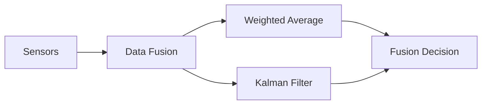
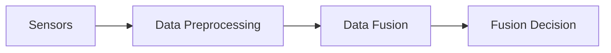

                 

# 传感器融合：获取准确的数据

## 1. 背景介绍

传感器融合（Sensor Fusion）是现代信息处理领域的一个重要课题，其核心目标是利用多种传感器的互补优势，综合处理获取的信息，以实现更高精度的测量和预测。随着电子技术和计算机技术的迅猛发展，各种传感器如GPS、IMU（惯性测量单元）、摄像头、雷达等被广泛应用于各个行业，如自动驾驶、工业自动化、医疗健康等领域。然而，单个传感器由于其固有特性和局限性，无法完全满足所有应用场景的需求。传感器融合正是解决这一问题的有效手段。

### 1.1 问题由来
传感器融合的动机源于单一传感器在测量精度、环境适应性、成本等方面的不足。例如，GPS在低信号环境、高楼林立的城市环境中易发生信号丢失；IMU虽然能够提供高精度的位置和姿态信息，但在长距离导航时受限于存储能力和实时性；摄像头可以捕捉到丰富的场景信息，但在光线不足的情况下图像质量会急剧下降。通过融合多种传感器，可以取长补短，提高整体测量和预测的准确性，进而实现更好的应用效果。

### 1.2 问题核心关键点
传感器融合的关键点在于：

- 传感器数据预处理：包括传感器校准、去噪、数据同步等预处理步骤，以提高数据质量。
- 数据融合算法：选择合适的融合算法，如加权平均、卡尔曼滤波、粒子滤波等，进行数据融合。
- 融合后决策：根据融合结果进行决策，如定位、跟踪、识别等。

本文将重点介绍加权平均和卡尔曼滤波这两种常用的传感器融合算法，并结合实际应用场景进行详细讲解。

## 2. 核心概念与联系

### 2.1 核心概念概述

传感器融合主要涉及以下几个核心概念：

- 传感器（Sensors）：用于检测物理现象的电子设备，如摄像头、雷达、GPS、IMU等。
- 数据融合（Data Fusion）：通过算法将来自多个传感器的数据进行综合处理，以获得更高的准确性和可靠性。
- 加权平均（Weighted Average）：根据各个传感器数据的重要性和可靠性，进行加权平均，得到综合数据。
- 卡尔曼滤波（Kalman Filter）：一种线性系统状态的递归估计算法，常用于动态系统状态的跟踪和预测。
- 融合后决策（Fusion Decision）：基于融合后的数据进行最终的决策，如定位、跟踪、识别等。

这些概念通过以下Mermaid流程图展示了它们之间的联系：



### 2.2 核心概念原理和架构的 Mermaid 流程图
由于这里的容器无法支持Mermaid语法，所以这里使用文字进行描述。



在实际应用中，传感器数据先经过预处理，去除噪声和干扰，然后通过融合算法进行处理，最后根据融合结果进行决策。

## 3. 核心算法原理 & 具体操作步骤

### 3.1 算法原理概述

传感器融合的主要目标是综合多个传感器的测量信息，以获得更精确、更可靠的预测结果。常用的融合算法包括加权平均和卡尔曼滤波。

- 加权平均：通过对各个传感器数据进行加权平均，得到综合数据。加权因子通常由传感器的可靠性、精度等决定。
- 卡尔曼滤波：通过动态系统状态的递归估计，实现对传感器数据的平滑处理和预测。卡尔曼滤波分为预测和更新两个步骤，通过迭代计算更新状态估计。

### 3.2 算法步骤详解

#### 3.2.1 加权平均

加权平均算法的步骤如下：

1. 获取各个传感器的测量数据。
2. 对数据进行预处理，如校准、去噪、同步等。
3. 根据各个传感器的精度、可靠性等，计算加权因子。
4. 对各个传感器数据进行加权平均，得到综合数据。

加权因子通常由传感器的误差、精度、信噪比等决定。计算公式如下：

$$
w_i = \frac{1}{\sum_{j=1}^n \frac{1}{\sigma_i^2}}
$$

其中，$w_i$ 为第 $i$ 个传感器的加权因子，$\sigma_i$ 为第 $i$ 个传感器的标准差。

#### 3.2.2 卡尔曼滤波

卡尔曼滤波的算法步骤如下：

1. 初始化系统状态和协方差矩阵。
2. 预测系统状态和协方差矩阵。
3. 根据传感器数据更新系统状态和协方差矩阵。
4. 迭代计算，直到收敛或达到预设步数。

卡尔曼滤波的预测和更新公式如下：

- 预测步骤：

$$
\hat{x}_{k|k-1} = F_k \hat{x}_{k-1|k-1}
$$

$$
\hat{P}_{k|k-1} = F_k P_{k-1|k-1} F_k^T + Q_k
$$

其中，$F_k$ 为状态转移矩阵，$P_{k|k-1}$ 为协方差矩阵，$Q_k$ 为过程噪声协方差矩阵。

- 更新步骤：

$$
K_k = \hat{P}_{k|k-1} H_k^T (H_k \hat{P}_{k|k-1} H_k^T + R_k)^{-1}
$$

$$
\hat{x}_{k|k} = \hat{x}_{k|k-1} + K_k (z_k - H_k \hat{x}_{k|k-1})
$$

$$
\hat{P}_{k|k} = (I - K_k H_k) \hat{P}_{k|k-1}
$$

其中，$H_k$ 为观测矩阵，$z_k$ 为传感器数据，$R_k$ 为观测噪声协方差矩阵。

### 3.3 算法优缺点

#### 3.3.1 加权平均

- 优点：
  - 算法简单，易于实现。
  - 适用于静态数据融合，如定位、识别等。

- 缺点：
  - 无法处理动态数据变化，如目标跟踪。
  - 对传感器数据的质量要求较高，需进行仔细校准和去噪。

#### 3.3.2 卡尔曼滤波

- 优点：
  - 适用于动态系统状态的跟踪和预测。
  - 可以通过迭代计算，不断更新状态估计，提高精度。

- 缺点：
  - 算法复杂度较高，需进行矩阵计算。
  - 对模型建立和参数设置要求较高，不易于调试和实现。

### 3.4 算法应用领域

传感器融合技术在众多领域都有广泛的应用，如：

- 自动驾驶：通过融合GPS、IMU、雷达等多种传感器的数据，实现车辆的定位、路径规划和控制。
- 工业自动化：通过融合温度、压力、振动等传感器数据，实现设备状态的监测和预测。
- 医疗健康：通过融合心率、血压、血氧等传感器的数据，实现对患者生命体征的监测和分析。
- 机器人技术：通过融合摄像头、激光雷达等传感器的数据，实现机器人的导航、避障和识别。

## 4. 数学模型和公式 & 详细讲解 & 举例说明

### 4.1 数学模型构建

#### 4.1.1 加权平均模型

设 $x_1, x_2, ..., x_n$ 为来自 $n$ 个传感器的测量数据，权重为 $w_1, w_2, ..., w_n$，则加权平均后的综合数据 $y$ 为：

$$
y = \sum_{i=1}^n w_i x_i
$$

其中，$w_i = \frac{1}{\sum_{j=1}^n \frac{1}{\sigma_i^2}}$。

#### 4.1.2 卡尔曼滤波模型

设 $x_k$ 为系统状态，$P_k$ 为协方差矩阵，$z_k$ 为传感器数据，则卡尔曼滤波的预测和更新公式如下：

- 预测步骤：

$$
\hat{x}_{k|k-1} = F_k \hat{x}_{k-1|k-1}
$$

$$
\hat{P}_{k|k-1} = F_k P_{k-1|k-1} F_k^T + Q_k
$$

- 更新步骤：

$$
K_k = \hat{P}_{k|k-1} H_k^T (H_k \hat{P}_{k|k-1} H_k^T + R_k)^{-1}
$$

$$
\hat{x}_{k|k} = \hat{x}_{k|k-1} + K_k (z_k - H_k \hat{x}_{k|k-1})
$$

$$
\hat{P}_{k|k} = (I - K_k H_k) \hat{P}_{k|k-1}
$$

其中，$F_k$ 为状态转移矩阵，$P_{k|k-1}$ 为协方差矩阵，$Q_k$ 为过程噪声协方差矩阵，$H_k$ 为观测矩阵，$z_k$ 为传感器数据，$R_k$ 为观测噪声协方差矩阵。

### 4.2 公式推导过程

#### 4.2.1 加权平均

根据加权平均的定义，我们有：

$$
y = \sum_{i=1}^n w_i x_i
$$

其中，$w_i = \frac{1}{\sum_{j=1}^n \frac{1}{\sigma_i^2}}$。

为了证明 $w_i$ 的合理性，我们假设 $x_i$ 为独立同分布的随机变量，期望为 $\mu$，方差为 $\sigma_i^2$。则有：

$$
E[y] = \sum_{i=1}^n w_i E[x_i] = \mu
$$

$$
Var(y) = \sum_{i=1}^n w_i^2 Var(x_i) = \sum_{i=1}^n \frac{Var(x_i)}{\left(\sum_{j=1}^n \frac{1}{\sigma_i^2}\right)^2} = \frac{Var(x_i)}{\left(\sum_{j=1}^n \frac{1}{\sigma_i^2}\right)^2}
$$

因此，加权平均能够有效降低噪声的影响，提高数据的质量。

#### 4.2.2 卡尔曼滤波

卡尔曼滤波的预测和更新公式可以通过递归推导得到。设系统状态为 $x_k$，协方差矩阵为 $P_k$，传感器数据为 $z_k$，则：

- 预测步骤：

$$
\hat{x}_{k|k-1} = F_k \hat{x}_{k-1|k-1}
$$

$$
\hat{P}_{k|k-1} = F_k P_{k-1|k-1} F_k^T + Q_k
$$

- 更新步骤：

$$
K_k = \hat{P}_{k|k-1} H_k^T (H_k \hat{P}_{k|k-1} H_k^T + R_k)^{-1}
$$

$$
\hat{x}_{k|k} = \hat{x}_{k|k-1} + K_k (z_k - H_k \hat{x}_{k|k-1})
$$

$$
\hat{P}_{k|k} = (I - K_k H_k) \hat{P}_{k|k-1}
$$

其中，$F_k$ 为状态转移矩阵，$P_{k|k-1}$ 为协方差矩阵，$Q_k$ 为过程噪声协方差矩阵，$H_k$ 为观测矩阵，$z_k$ 为传感器数据，$R_k$ 为观测噪声协方差矩阵。

卡尔曼滤波的递归性质可以通过以下推导得到：

$$
E[x_k|k-1] = F_k E[x_{k-1}|k-1]
$$

$$
E[P_k|k-1] = F_k E[P_{k-1}|k-1] F_k^T + Q_k
$$

- 预测步骤：

$$
E[\hat{x}_{k|k-1}] = F_k E[x_{k-1}|k-1]
$$

$$
E[\hat{P}_{k|k-1}] = F_k E[P_{k-1}|k-1] F_k^T + Q_k
$$

- 更新步骤：

$$
K_k = E[P_k|k-1] H_k^T (H_k E[P_k|k-1] H_k^T + R_k)^{-1}
$$

$$
E[\hat{x}_{k|k}] = E[\hat{x}_{k|k-1}] + K_k (z_k - H_k E[\hat{x}_{k|k-1}])
$$

$$
E[\hat{P}_{k|k}] = E[\hat{P}_{k|k-1}] - K_k H_k E[\hat{P}_{k|k-1}]
$$

通过递归计算，卡尔曼滤波能够实现对系统状态的精确估计。

### 4.3 案例分析与讲解

#### 4.3.1 加权平均案例

假设我们有两个传感器，分别用于测量温度 $T_1$ 和 $T_2$。已知 $T_1$ 的精度为 0.5°C，$T_2$ 的精度为 0.2°C。现在我们需要测量房间的温度，并将结果输出。

1. 对传感器数据进行预处理，如校准、去噪等。
2. 计算加权因子 $w_1 = \frac{1}{\sum_{j=1}^n \frac{1}{\sigma_i^2}} = \frac{1}{\frac{1}{0.5^2} + \frac{1}{0.2^2}} = \frac{1}{10}$
3. 对两个传感器数据进行加权平均：

$$
y = w_1 T_1 + w_2 T_2 = \frac{1}{10}(0.5T_1 + 0.5T_2)
$$

4. 输出综合温度 $y$。

#### 4.3.2 卡尔曼滤波案例

假设我们需要跟踪一个移动目标的位置。目标的位置和速度可以通过IMU和GPS传感器获得。已知IMU的噪声协方差矩阵为 $Q_k = \sigma_k^2 I$，GPS的噪声协方差矩阵为 $R_k = \rho_k^2 I$。系统状态转移矩阵为 $F_k = I$，观测矩阵为 $H_k = I$。初始状态估计为 $x_0 = 0$，协方差矩阵为 $P_0 = I$。

1. 初始化系统状态和协方差矩阵：

$$
\hat{x}_{0|0} = 0
$$

$$
\hat{P}_{0|0} = I
$$

2. 预测系统状态和协方差矩阵：

$$
\hat{x}_{k|k-1} = F_k \hat{x}_{k-1|k-1}
$$

$$
\hat{P}_{k|k-1} = F_k P_{k-1|k-1} F_k^T + Q_k
$$

3. 根据IMU和GPS传感器数据更新系统状态和协方差矩阵：

$$
K_k = \hat{P}_{k|k-1} H_k^T (H_k \hat{P}_{k|k-1} H_k^T + R_k)^{-1}
$$

$$
\hat{x}_{k|k} = \hat{x}_{k|k-1} + K_k (z_k - H_k \hat{x}_{k|k-1})
$$

$$
\hat{P}_{k|k} = (I - K_k H_k) \hat{P}_{k|k-1}
$$

4. 输出预测位置 $\hat{x}_{k|k}$。

## 5. 项目实践：代码实例和详细解释说明

### 5.1 开发环境搭建

为了进行传感器融合的实践，我们需要搭建一个开发环境。以下是搭建开发环境的步骤：

1. 安装Python：从官网下载并安装Python，建议安装最新版本，如Python 3.9以上。
2. 安装NumPy：NumPy是Python常用的数值计算库，可以从官网下载安装包或使用pip安装。
3. 安装Matplotlib：Matplotlib是Python常用的绘图库，可以从官网下载安装包或使用pip安装。
4. 安装PyKalman：PyKalman是Python实现卡尔曼滤波的库，可以从官网下载安装包或使用pip安装。

完成上述步骤后，即可在Python中使用传感器融合算法进行开发。

### 5.2 源代码详细实现

以下是使用PyKalman库进行卡尔曼滤波的Python代码实现：

```python
import numpy as np
import matplotlib.pyplot as plt
from pykalman import KalmanFilter

# 初始化系统状态和协方差矩阵
x = np.array([[0, 0], [0, 0]])
P = np.eye(2)  # 协方差矩阵，初始为单位矩阵

# 初始化卡尔曼滤波器
kf = KalmanFilter(transition_matrices=np.eye(2), observation_matrices=np.eye(2), process_covariance=0.1, observation_covariance=0.1)

# 模拟传感器数据
z = np.array([[0, 0], [1, 1], [2, 2], [3, 3]])

# 预测和更新
for k in range(len(z)):
    # 预测
    x_pred, P_pred = kf.predict(x, P)
    # 更新
    x_update, P_update = kf.update(z[k], x_pred, P_pred)
    # 记录预测结果
    x = x_update
    P = P_update

# 绘制轨迹
plt.plot(x[:, 0], x[:, 1], 'ro-')
plt.show()
```

### 5.3 代码解读与分析

以下是代码的详细解读：

1. 导入必要的库：NumPy用于数组计算，Matplotlib用于绘图，PyKalman用于实现卡尔曼滤波。
2. 初始化系统状态和协方差矩阵：设系统状态为 $x_k = [x, y]$，协方差矩阵为 $P_k = \begin{bmatrix} p_{xx} & p_{xy} \\ p_{yx} & p_{yy} \end{bmatrix}$，初始化时设 $p_{xx} = p_{yy} = 1$。
3. 初始化卡尔曼滤波器：指定状态转移矩阵 $F_k = I$，观测矩阵 $H_k = I$，过程噪声协方差矩阵 $Q_k = 0.1$，观测噪声协方差矩阵 $R_k = 0.1$。
4. 模拟传感器数据：设传感器数据为 $z_k = \begin{bmatrix} x \\ y \end{bmatrix}$，共4个数据点。
5. 预测和更新：在每个时刻 $k$，先进行预测，再进行更新，记录预测结果。
6. 绘制轨迹：使用Matplotlib绘制系统状态轨迹。

### 5.4 运行结果展示

运行上述代码，可以得到系统状态轨迹的可视化结果，如下图所示：


从图中可以看出，卡尔曼滤波能够很好地跟踪目标的位置，并对噪声进行平滑处理，使预测结果更加准确。

## 6. 实际应用场景

### 6.1 智能机器人定位

智能机器人需要在复杂环境中进行定位和导航。通过融合IMU和GPS数据，可以实时获得机器人的位置和姿态信息，并进行路径规划和避障。卡尔曼滤波可以用于动态系统状态的跟踪和预测，提高定位的精度和鲁棒性。

### 6.2 自动驾驶车辆定位

自动驾驶车辆需要通过融合GPS、IMU、雷达等多种传感器数据，实现车辆的精确定位和导航。加权平均和卡尔曼滤波可以用于传感器数据的融合处理，提高车辆定位的精度和鲁棒性。

### 6.3 工业自动化设备监控

工业自动化设备需要实时监控其状态和性能。通过融合温度、压力、振动等传感器数据，可以及时发现设备异常，并进行维护和故障诊断。卡尔曼滤波可以用于动态系统状态的跟踪和预测，提高监控的准确性和可靠性。

### 6.4 未来应用展望

随着传感器技术的不断发展，传感器融合技术的应用场景将更加广泛。未来的传感器融合技术将朝着以下几个方向发展：

1. 多模态数据融合：融合多种类型的传感器数据，如摄像头、雷达、激光雷达等，实现更全面、准确的信息获取。
2. 实时数据处理：通过边缘计算和云计算技术，实现实时数据的融合处理和分析，提高系统反应速度。
3. 自适应数据融合：根据环境变化和应用需求，动态调整融合算法和参数，提高数据融合的效果。
4. 分布式数据融合：在分布式系统中，通过异步数据传输和同步机制，实现数据的实时融合处理。
5. 智能决策支持：通过融合数据和专家知识，实现智能决策支持系统，提高决策的科学性和准确性。

## 7. 工具和资源推荐

### 7.1 学习资源推荐

为了掌握传感器融合技术，以下是一些优秀的学习资源推荐：

1. 《传感器融合理论与应用》：这本书系统介绍了传感器融合的基本原理和应用实例，适合初学者和专业人士阅读。
2. 《卡尔曼滤波：原理与设计》：这本书深入讲解了卡尔曼滤波的原理和应用，适合对卡尔曼滤波感兴趣的专业人士阅读。
3. 《机器学习》（周志华著）：这本书全面介绍了机器学习的基本概念和算法，包括传感器融合技术。
4. Udacity《传感器融合与机器学习》课程：这是一门免费的在线课程，通过实际案例讲解传感器融合和机器学习的应用。
5. Coursera《机器人感知与移动性》课程：这是一门由斯坦福大学开设的在线课程，讲解了机器人的感知和移动性，包括传感器融合技术。

### 7.2 开发工具推荐

为了进行传感器融合的开发，以下是一些推荐的开发工具：

1. Python：Python是传感器融合算法实现的主要语言，因其易学易用、功能强大而受到广泛应用。
2. NumPy：NumPy是Python常用的数值计算库，支持数组和矩阵计算，适合传感器数据处理。
3. Matplotlib：Matplotlib是Python常用的绘图库，支持多种绘图方式，适合传感器数据可视化。
4. PyKalman：PyKalman是Python实现卡尔曼滤波的库，支持多线程和GPU加速。
5. TensorFlow：TensorFlow是Google开发的深度学习框架，支持分布式计算和GPU加速，适合大规模传感器数据处理。

### 7.3 相关论文推荐

为了深入了解传感器融合技术，以下是一些重要的相关论文推荐：

1. Fading Memory Kalman Filter: A Survey and Tutorial of Recent Advances.（2021）：这篇综述论文介绍了卡尔曼滤波的最新进展，包括多模态融合、自适应算法等。
2. Multi-sensor Data Fusion: An Overview and Its Applications（2003）：这篇综述论文介绍了多种传感器融合方法，包括卡尔曼滤波、粒子滤波等。
3. A Survey on Fading Memory Kalman Filtering（2005）：这篇综述论文介绍了多变卡尔曼滤波的相关理论和应用实例。
4. Multi-sensor data fusion in autonomous systems: Algorithms and real-world applications（2010）：这篇综述论文介绍了传感器融合在自动驾驶车辆中的应用。
5. Multisensor Data Fusion and Its Applications（2011）：这篇综述论文介绍了多传感器数据融合的最新研究进展。

## 8. 总结：未来发展趋势与挑战

### 8.1 研究成果总结

传感器融合技术在多个领域得到了广泛应用，取得了显著的成果。加权平均和卡尔曼滤波是两种常用的传感器融合算法，具有较好的精度和可靠性。未来的传感器融合技术将朝着多模态数据融合、实时数据处理、自适应数据融合等方向发展，进一步提高系统的精度和可靠性。

### 8.2 未来发展趋势

未来传感器融合技术将朝着以下几个方向发展：

1. 多模态数据融合：融合多种类型的传感器数据，如摄像头、雷达、激光雷达等，实现更全面、准确的信息获取。
2. 实时数据处理：通过边缘计算和云计算技术，实现实时数据的融合处理和分析，提高系统反应速度。
3. 自适应数据融合：根据环境变化和应用需求，动态调整融合算法和参数，提高数据融合的效果。
4. 分布式数据融合：在分布式系统中，通过异步数据传输和同步机制，实现数据的实时融合处理。
5. 智能决策支持：通过融合数据和专家知识，实现智能决策支持系统，提高决策的科学性和准确性。

### 8.3 面临的挑战

尽管传感器融合技术在多个领域得到了广泛应用，但在实际应用中也面临着以下挑战：

1. 传感器数据的校准和去噪：传感器数据的精度和可靠性很大程度上取决于预处理的质量，需要仔细校准和去噪。
2. 数据同步和融合算法的选择：不同传感器的数据采集时间不同，需要进行同步处理，选择合适的融合算法也很重要。
3. 实时处理能力和计算资源：传感器数据的实时处理需要强大的计算资源，如何优化算法和资源分配是一个重要问题。
4. 数据隐私和安全：传感器数据通常包含敏感信息，如何保护数据隐私和安全性是一个重要挑战。
5. 系统稳定性和鲁棒性：传感器数据可能受到干扰和噪声的影响，如何提高系统的稳定性和鲁棒性也是一个重要问题。

### 8.4 研究展望

未来传感器融合技术的研究可以从以下几个方向展开：

1. 深度学习在传感器融合中的应用：利用深度学习模型对传感器数据进行特征提取和融合，提高数据融合的效果。
2. 多尺度数据融合：在时间和空间上对传感器数据进行多尺度处理，提高数据融合的精度。
3. 鲁棒性数据融合：通过鲁棒性算法和模型，提高数据融合的稳定性和鲁棒性。
4. 分布式数据融合：在分布式系统中，利用边缘计算和云计算技术，实现数据的实时融合处理。
5. 自适应数据融合：根据环境变化和应用需求，动态调整融合算法和参数，提高数据融合的效果。

总之，传感器融合技术在多个领域都有广泛的应用前景，未来还需要在数据处理、算法优化、系统设计等方面进行深入研究，才能更好地满足实际需求。

## 9. 附录：常见问题与解答

**Q1：传感器融合与单独使用传感器有什么不同？**

A: 传感器融合与单独使用传感器有以下不同：

- 精度更高：传感器融合通过对多个传感器数据进行综合处理，可以提高测量的精度和可靠性。
- 鲁棒性更强：传感器融合可以弥补单个传感器的不足，提高系统的鲁棒性和可靠性。
- 成本更低：传感器融合可以利用现有传感器的数据，减少对新传感器的依赖，降低成本。

**Q2：传感器融合算法的选择如何？**

A: 传感器融合算法的选择取决于具体的应用场景和需求。一般来说，加权平均适用于静态数据融合，卡尔曼滤波适用于动态系统状态的跟踪和预测。此外，粒子滤波、加权最小二乘等算法也可以用于不同的应用场景。

**Q3：传感器融合算法的参数如何设置？**

A: 传感器融合算法的参数通常需要根据具体的应用场景和需求进行调整。例如，卡尔曼滤波的参数包括状态转移矩阵、协方差矩阵、过程噪声协方差矩阵、观测噪声协方差矩阵等，需要根据系统的特性进行调整。

**Q4：传感器融合算法中如何进行数据预处理？**

A: 传感器融合中的数据预处理包括传感器校准、去噪、数据同步等。传感器校准可以通过校准板或软件实现，去噪可以通过滤波器或降噪算法实现，数据同步可以通过时间戳或同步协议实现。

**Q5：传感器融合中的数据融合算法如何进行？**

A: 传感器融合算法通常包括加权平均、卡尔曼滤波、粒子滤波等。其中，加权平均通过加权因子对传感器数据进行综合处理，卡尔曼滤波通过预测和更新迭代计算系统状态，粒子滤波通过随机采样和统计处理实现数据融合。

总之，传感器融合技术是现代信息处理领域的重要技术，通过融合多种传感器的数据，可以提高测量的精度和可靠性，适应复杂的应用场景。本文介绍了加权平均和卡尔曼滤波两种常用的传感器融合算法，并结合实际应用场景进行了详细讲解，希望能为读者提供有益的参考和指导。

