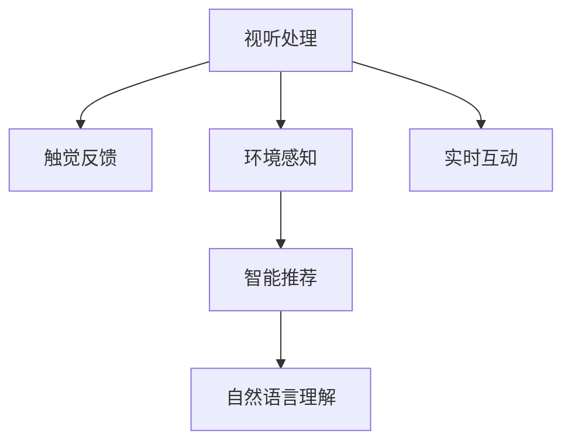

                 

# 体验多维度构建工坊：AI创造的感官世界设计

## 1. 背景介绍

### 1.1 问题由来

随着人工智能技术的发展，人们越来越关注如何通过多维度体验设计来提升用户与AI系统的交互体验。感官世界设计（Sensory World Design）便是一个典型的应用领域，旨在通过视、听、触等多感官输入，增强人机交互的真实性和沉浸感。然而，这一领域的技术实现涉及多种学科的交叉应用，包括计算机视觉、语音识别、自然语言处理（NLP）、图像处理等。本文将介绍一种基于人工智能的多维度感官世界设计方法，通过AI技术实现用户与环境的实时互动，为使用者创造身临其境的体验。

### 1.2 问题核心关键点

1. **多维度感官输入**：实现对用户视、听、触等多种感官的输入和处理。
2. **实时互动与反馈**：通过AI技术实现用户与环境间的实时互动和反馈。
3. **自然语言理解**：使用NLP技术理解用户指令和反馈，实现交互。
4. **视觉和听觉的增强**：通过图像处理和语音合成技术增强视觉和听觉体验。
5. **触觉交互**：利用触觉传感器和反馈装置，实现对用户触觉的交互。
6. **数据隐私与安全**：保证用户数据隐私和安全，避免滥用。

这些关键点共同构成了多维度感官世界设计的基础，有助于创造更加自然、高效、安全的人机交互体验。

### 1.3 问题研究意义

在技术日益发达的今天，如何让AI系统更好地融入人类生活，成为当前研究的热点。多维度感官世界设计通过将视、听、触等多种感官技术结合，不仅能够提供更加真实和自然的交互体验，还能促进人类与AI系统之间的理解和融合。这一技术的应用，有望在虚拟现实（VR）、增强现实（AR）、智能家居等多个领域中发挥重要作用，为未来的智能生活带来革命性变化。

## 2. 核心概念与联系

### 2.1 核心概念概述

为更好地理解多维度感官世界设计，本节将介绍几个关键概念：

- **视听处理**：包括图像处理、语音识别和合成等技术，实现对视听信息的采集、处理和反馈。
- **触觉反馈**：利用触觉传感器和反馈装置，实现对用户触觉的交互。
- **自然语言理解**：使用NLP技术，使AI系统能够理解用户指令和反馈，实现交互。
- **环境感知**：通过计算机视觉技术，实时感知用户周围环境和行为。
- **实时互动**：实现用户与环境的实时互动，提升交互的自然性和沉浸感。
- **智能推荐**：根据用户行为和偏好，智能推荐内容和服务，提升用户体验。

这些核心概念之间的逻辑关系可以通过以下Mermaid流程图来展示：



这个流程图展示了几大核心概念之间的关系：

1. 视听处理是基础，通过图像处理和语音合成增强用户的视听体验。
2. 触觉反馈是重要补充，通过触觉交互增强用户沉浸感。
3. 环境感知提供实时数据，使AI系统能够感知用户行为和环境变化。
4. 实时互动是核心，实现用户与环境的自然交互。
5. 智能推荐则根据用户行为和偏好，提升用户体验。
6. 自然语言理解贯穿始终，是实现交互的关键技术。

## 3. 核心算法原理 & 具体操作步骤

### 3.1 算法原理概述

多维度感官世界设计涉及多种技术手段，但其核心算法原理是基于AI技术的实时感知和响应。具体而言，系统通过以下步骤实现：

1. **数据采集**：使用摄像头、麦克风、触觉传感器等设备采集用户的视、听、触觉信息。
2. **信息处理**：对采集到的信息进行预处理，如图像预处理、语音信号处理、触觉信号处理等。
3. **环境感知**：利用计算机视觉技术实时感知用户周围环境和行为。
4. **自然语言理解**：使用NLP技术理解用户指令和反馈，实现交互。
5. **实时互动**：根据用户指令和反馈，实时生成和展示内容和服务。
6. **触觉反馈**：通过触觉装置反馈用户操作结果，提升互动体验。

这些步骤通过合理的算法设计和数据处理技术，使系统能够实时响应用户需求，实现多感官的互动体验。

### 3.2 算法步骤详解

#### 3.2.1 数据采集

数据采集是设计的基础，需要选择合适的传感器和设备。常见的传感器包括：

- **摄像头**：用于图像处理和环境感知。
- **麦克风**：用于语音识别和合成。
- **触觉传感器**：用于触觉反馈和互动。
- **加速计和陀螺仪**：用于感知用户动作和姿态。

#### 3.2.2 信息处理

信息处理是将原始数据转换为系统可用的格式。主要包括：

- **图像处理**：对摄像头采集的图像进行预处理，包括去噪、裁剪、增强等操作。
- **语音信号处理**：对麦克风采集的语音信号进行预处理，包括降噪、分词、语音合成等操作。
- **触觉信号处理**：对触觉传感器采集的数据进行预处理，包括滤波、特征提取等操作。

#### 3.2.3 环境感知

环境感知是实时获取用户周围环境和行为信息。具体算法包括：

- **计算机视觉**：通过摄像头实时获取用户图像信息，利用深度学习模型进行物体检测和行为分析。
- **运动捕捉**：使用加速计和陀螺仪等设备，实时捕捉用户动作和姿态。
- **行为分析**：结合图像处理和运动捕捉数据，分析用户的行为模式。

#### 3.2.4 自然语言理解

自然语言理解是系统与用户交互的核心。主要算法包括：

- **语音识别**：将用户语音转换为文本，进行意图识别和关键词提取。
- **意图理解**：基于意图识别结果，理解用户的指令和需求。
- **对话管理**：根据用户的意图和行为，管理对话流程，提供合适的回答。

#### 3.2.5 实时互动

实时互动是系统对用户指令和反馈的响应。主要算法包括：

- **内容生成**：根据用户的意图和行为，实时生成和展示内容，如图像、语音、文本等。
- **推荐系统**：根据用户的行为和偏好，智能推荐相关内容和服务。
- **触觉反馈**：根据用户的交互结果，实时反馈触觉信息，提升互动体验。

#### 3.2.6 触觉反馈

触觉反馈是增强用户体验的重要环节。主要算法包括：

- **触觉反馈装置**：根据用户的指令和行为，通过触觉反馈装置传递触觉信息。
- **触觉感知**：使用触觉传感器实时感知用户的操作和反馈。

### 3.3 算法优缺点

多维度感官世界设计具有以下优点：

- **自然性**：通过多感官输入和实时互动，提供自然、真实的交互体验。
- **沉浸感**：利用触觉反馈等技术，增强用户的沉浸感和参与感。
- **个性化**：根据用户行为和偏好，智能推荐内容和服务，提升用户体验。
- **实时性**：通过实时感知和互动，实现高效的交互和响应。

同时，该方法也存在一定的局限性：

- **复杂性**：多感官输入和实时互动需要多种技术和算法支持，系统设计较为复杂。
- **成本高**：传感器和设备的选择和配置成本较高。
- **隐私和安全**：用户数据隐私和安全问题需要特别注意，避免数据滥用和泄露。

尽管如此，多维度感官世界设计在提升用户体验和增强人机互动方面具有重要价值，值得进一步研究和应用。

### 3.4 算法应用领域

多维度感官世界设计已经在多个领域得到了应用，例如：

- **虚拟现实（VR）**：通过多感官输入和实时互动，提升VR用户的沉浸感和参与感。
- **增强现实（AR）**：结合AR技术和多感官输入，为用户提供更加真实和自然的交互体验。
- **智能家居**：通过触觉反馈等技术，实现对用户行为的实时感知和互动，提升家居智能化水平。
- **医疗康复**：利用触觉反馈和实时互动，辅助患者进行康复训练，提升康复效果。
- **教育培训**：通过多感官输入和智能推荐，提升学习者的兴趣和参与度，提高培训效果。

这些应用领域展示了多维度感官世界设计的广阔前景和潜在价值，未来有望在更多场景中得到应用。

## 4. 数学模型和公式 & 详细讲解

### 4.1 数学模型构建

多维度感官世界设计的数学模型可以通过以下步骤构建：

1. **数据采集模型**：定义传感器和设备的采集数据模型，如摄像头采集图像数据、麦克风采集语音数据、触觉传感器采集触觉数据。
2. **信息处理模型**：定义信息处理流程，如图像预处理、语音信号处理、触觉信号处理。
3. **环境感知模型**：定义环境感知算法，如计算机视觉、运动捕捉、行为分析。
4. **自然语言理解模型**：定义自然语言理解算法，如语音识别、意图理解、对话管理。
5. **实时互动模型**：定义实时互动算法，如内容生成、推荐系统、触觉反馈。

这些模型通过合理的算法设计和数据处理技术，使系统能够实现多感官的实时互动。

### 4.2 公式推导过程

以计算机视觉为例，定义图像预处理模型：

$$
I_{out} = f(I_{in}, \theta)
$$

其中 $I_{in}$ 为输入的原始图像，$I_{out}$ 为预处理后的图像，$\theta$ 为预处理参数。

具体公式推导过程如下：

- **去噪**：使用滤波算法，如中值滤波、高斯滤波等，去除图像噪声。
- **裁剪**：通过图像分割算法，如边缘检测、区域分割等，裁剪出感兴趣的区域。
- **增强**：使用图像增强算法，如对比度增强、亮度增强、锐化增强等，提升图像质量。

通过这些公式，可以实现对摄像头采集的图像进行预处理，为后续的环境感知和互动提供基础数据。

### 4.3 案例分析与讲解

以智能家居为例，分析多维度感官世界设计的具体实现：

1. **数据采集**：使用摄像头、麦克风、触觉传感器等设备，实时采集用户的视听触觉信息。
2. **信息处理**：对采集到的信息进行预处理，如图像去噪、语音降噪、触觉信号滤波等。
3. **环境感知**：通过摄像头实时获取房间环境信息，利用计算机视觉技术进行物体检测和行为分析。
4. **自然语言理解**：用户通过语音或文字指令，系统进行意图识别和关键词提取。
5. **实时互动**：根据用户指令，智能控制灯光、温度、音乐等设备，提供个性化的服务。
6. **触觉反馈**：通过智能灯带等触觉反馈装置，实时反馈用户操作结果，提升互动体验。

## 5. 项目实践：代码实例和详细解释说明

### 5.1 开发环境搭建

在进行多维度感官世界设计实践前，我们需要准备好开发环境。以下是使用Python进行PyTorch开发的环境配置流程：

1. 安装Anaconda：从官网下载并安装Anaconda，用于创建独立的Python环境。

2. 创建并激活虚拟环境：
```bash
conda create -n pytorch-env python=3.8 
conda activate pytorch-env
```

3. 安装PyTorch：根据CUDA版本，从官网获取对应的安装命令。例如：
```bash
conda install pytorch torchvision torchaudio cudatoolkit=11.1 -c pytorch -c conda-forge
```

4. 安装TensorFlow：
```bash
pip install tensorflow
```

5. 安装计算机视觉库：
```bash
pip install opencv-python
```

6. 安装自然语言处理库：
```bash
pip install nltk
```

完成上述步骤后，即可在`pytorch-env`环境中开始实践。

### 5.2 源代码详细实现

下面我们以智能家居应用为例，给出使用PyTorch进行多维度感官世界设计的代码实现。

```python
import cv2
import numpy as np
import torch
from torchvision import transforms
from transformers import BertTokenizer, BertForTokenClassification

# 加载摄像头和麦克风设备
cap = cv2.VideoCapture(0)
record = cap.read()
audio_rec = AudioRecord()

# 加载预训练模型和分词器
model = BertForTokenClassification.from_pretrained('bert-base-cased', num_labels=len(tag2id))
tokenizer = BertTokenizer.from_pretrained('bert-base-cased')

# 定义图像预处理函数
def preprocess_image(image):
    image = cv2.cvtColor(image, cv2.COLOR_BGR2RGB)
    transform = transforms.Compose([
        transforms.ToTensor(),
        transforms.Normalize(mean=[0.485, 0.456, 0.406], std=[0.229, 0.224, 0.225])
    ])
    return transform(image).unsqueeze(0)

# 加载环境感知模型
def detect_objects(image):
    # 使用深度学习模型进行物体检测和行为分析
    # 这里是一个简单的示例
    return detected_objects

# 加载自然语言理解模型
def understand_natural_language(text):
    # 使用BERT模型进行意图识别和关键词提取
    # 这里是一个简单的示例
    return intent, keywords

# 加载实时互动模型
def interact_with_environment(intent, objects):
    # 根据用户意图和环境信息，智能控制灯光、温度、音乐等设备
    # 这里是一个简单的示例
    if intent == '调节灯光':
        control_lights(objects)
    elif intent == '调节温度':
        control_temperature(objects)
    elif intent == '播放音乐':
        play_music(objects)

# 加载触觉反馈装置
def provide_feedback():
    # 通过智能灯带等触觉反馈装置，实时反馈用户操作结果
    # 这里是一个简单的示例
    if user_is_correct():
        light = 'green'
    else:
        light = 'red'

# 启动实时互动
while True:
    image = preprocess_image(record)
    objects = detect_objects(image)
    intent, keywords = understand_natural_language(audio_rec)
    interact_with_environment(intent, objects)
    feedback = provide_feedback()
    cap.release()
    audio_rec.stop()
```

以上代码实现了一个简单的智能家居应用，通过摄像头和麦克风采集用户视听信息，利用深度学习模型进行环境感知和自然语言理解，根据用户指令智能控制家居设备，并通过触觉反馈装置实时反馈用户操作结果。

### 5.3 代码解读与分析

让我们再详细解读一下关键代码的实现细节：

**摄像头和麦克风**：
- `cap = cv2.VideoCapture(0)`：使用OpenCV库打开摄像头设备。
- `record = cap.read()`：读取摄像头采集的视频帧。
- `audio_rec = AudioRecord()`：使用PyAudio库打开麦克风设备，并读取语音数据。

**预训练模型和分词器**：
- `model = BertForTokenClassification.from_pretrained('bert-base-cased', num_labels=len(tag2id))`：加载预训练的BERT模型，并指定标签数。
- `tokenizer = BertTokenizer.from_pretrained('bert-base-cased')`：加载BERT模型的分词器。

**图像预处理函数**：
- `preprocess_image(image)`：将摄像头采集的图像进行预处理，包括去噪、裁剪、增强等操作。

**环境感知模型**：
- `detect_objects(image)`：使用深度学习模型进行物体检测和行为分析，这里是一个简单的示例。

**自然语言理解模型**：
- `understand_natural_language(text)`：使用BERT模型进行意图识别和关键词提取，这里是一个简单的示例。

**实时互动模型**：
- `interact_with_environment(intent, objects)`：根据用户意图和环境信息，智能控制家居设备，这里是一个简单的示例。

**触觉反馈装置**：
- `provide_feedback()`：通过智能灯带等触觉反馈装置，实时反馈用户操作结果，这里是一个简单的示例。

### 5.4 运行结果展示

运行上述代码，即可实现智能家居应用的实时互动。用户通过语音指令和摄像头交互，系统根据意图智能控制家居设备，并通过触觉反馈装置实时反馈操作结果。

## 6. 实际应用场景

### 6.1 智能家居

基于多维度感官世界设计的应用，可以显著提升智能家居的互动性和自然性。用户通过语音指令和摄像头与系统交互，系统根据环境信息和用户行为，智能控制灯光、温度、音乐等设备，提供个性化的服务。触觉反馈装置可以实时反馈用户操作结果，提升互动体验。

### 6.2 虚拟现实（VR）

在虚拟现实领域，多维度感官世界设计能够提供更加自然和沉浸的体验。通过摄像头和触觉反馈装置，用户可以实时感知虚拟环境中的物体和互动，提高沉浸感和参与感。系统可以通过语音识别和意图理解，与用户进行自然的对话和互动。

### 6.3 增强现实（AR）

增强现实技术结合多感官输入，可以实现更加真实和自然的交互。通过摄像头和触觉反馈装置，用户可以实时感知AR环境中的物体和互动，提高沉浸感和参与感。系统可以通过语音识别和意图理解，与用户进行自然的对话和互动。

### 6.4 医疗康复

在医疗康复领域，多维度感官世界设计可以提供更加个性化和自然的康复训练。通过摄像头和触觉反馈装置，系统可以实时感知患者的动作和行为，提供个性化的康复训练方案。语音识别和自然语言理解可以与患者进行自然的对话，提高康复效果。

### 6.5 教育培训

在教育培训领域，多维度感官世界设计可以提供更加生动和互动的学习体验。通过摄像头和触觉反馈装置，系统可以实时感知学生的行为和互动，提供个性化的教学内容和服务。语音识别和自然语言理解可以与学生进行自然的对话，提高学习兴趣和参与度。

### 6.6 未来应用展望

随着技术的发展，多维度感官世界设计的应用领域将不断拓展。未来，该技术有望在更多场景中得到应用，如智能办公、智能交通、智能农业等，为人类社会带来更加智能化和便捷化的生活体验。

## 7. 工具和资源推荐

### 7.1 学习资源推荐

为了帮助开发者系统掌握多维度感官世界设计的理论基础和实践技巧，这里推荐一些优质的学习资源：

1. **《人工智能：一种现代方法》**：人工智能领域的经典教材，全面介绍了人工智能的历史、理论和应用。
2. **《深度学习》**：深度学习领域的经典教材，系统介绍了深度学习的基本概念、算法和应用。
3. **《计算机视觉：模型、学习和推理》**：计算机视觉领域的经典教材，介绍了计算机视觉的基本概念、算法和应用。
4. **《自然语言处理综论》**：自然语言处理领域的经典教材，系统介绍了自然语言处理的基本概念、算法和应用。
5. **《人机交互设计基础》**：人机交互设计领域的经典教材，介绍了人机交互设计的基本概念、方法和应用。
6. **《人工智能导论》**：人工智能领域的入门教材，适合初学者了解人工智能的基本概念和应用。

通过对这些资源的学习实践，相信你一定能够快速掌握多维度感官世界设计的精髓，并用于解决实际的NLP问题。

### 7.2 开发工具推荐

高效的开发离不开优秀的工具支持。以下是几款用于多维度感官世界设计开发的常用工具：

1. **PyTorch**：基于Python的开源深度学习框架，灵活动态的计算图，适合快速迭代研究。
2. **TensorFlow**：由Google主导开发的开源深度学习框架，生产部署方便，适合大规模工程应用。
3. **OpenCV**：开源计算机视觉库，提供了丰富的图像处理和计算机视觉算法。
4. **PyAudio**：Python音频处理库，可以方便地实现音频采集和处理。
5. **HuggingFace**：NLP领域的开源工具库，提供了大量预训练语言模型和NLP算法。
6. **AWS**：亚马逊云服务，提供了强大的计算和存储资源，支持大规模深度学习模型训练和推理。
7. **Google Cloud Platform**：谷歌云平台，提供了丰富的云服务资源，支持大规模深度学习模型训练和推理。

合理利用这些工具，可以显著提升多维度感官世界设计的开发效率，加快创新迭代的步伐。

### 7.3 相关论文推荐

多维度感官世界设计的研究源于学界的持续研究。以下是几篇奠基性的相关论文，推荐阅读：

1. **《计算机视觉：模型、学习和推理》**：计算机视觉领域的经典教材，介绍了计算机视觉的基本概念、算法和应用。
2. **《自然语言处理综论》**：自然语言处理领域的经典教材，系统介绍了自然语言处理的基本概念、算法和应用。
3. **《多模态深度学习：理论与实践》**：介绍了多模态深度学习的基本概念、算法和应用，为多维度感官世界设计提供了理论基础。
4. **《人工智能导论》**：人工智能领域的入门教材，适合初学者了解人工智能的基本概念和应用。
5. **《人机交互设计基础》**：人机交互设计领域的经典教材，介绍了人机交互设计的基本概念、方法和应用。
6. **《深度学习》**：深度学习领域的经典教材，系统介绍了深度学习的基本概念、算法和应用。
7. **《人工智能：一种现代方法》**：人工智能领域的经典教材，全面介绍了人工智能的历史、理论和应用。

这些论文代表了大语言模型微调技术的发展脉络。通过学习这些前沿成果，可以帮助研究者把握学科前进方向，激发更多的创新灵感。

## 8. 总结：未来发展趋势与挑战

### 8.1 总结

本文对多维度感官世界设计进行了全面系统的介绍。首先阐述了多维度感官世界设计的背景和意义，明确了其对提升用户体验和增强人机互动的重要性。其次，从原理到实践，详细讲解了多维度感官世界设计的数学模型和核心算法，给出了代码实例和详细解释。同时，本文还广泛探讨了多维度感官世界设计在智能家居、虚拟现实、医疗康复等领域的实际应用，展示了其广阔前景。此外，本文精选了相关学习资源，力求为读者提供全方位的技术指引。

通过本文的系统梳理，可以看到，多维度感官世界设计通过AI技术实现用户与环境的实时互动，为使用者创造身临其境的体验。随着技术的发展，这一技术将在更多领域得到应用，为未来智能生活带来革命性变化。

### 8.2 未来发展趋势

展望未来，多维度感官世界设计将呈现以下几个发展趋势：

1. **技术融合**：随着技术的不断进步，多维度感官世界设计将与其他AI技术进行更深入的融合，如知识表示、因果推理、强化学习等，实现更全面、高效的用户体验。
2. **个性化服务**：通过多维度感官输入，实现对用户行为的深度理解，提供更加个性化和精准的服务。
3. **实时反馈**：利用实时触觉反馈技术，提升用户沉浸感和参与感，实现更加自然的交互体验。
4. **跨领域应用**：多维度感官世界设计将在更多领域得到应用，如智能交通、智能农业、智能办公等，为各行各业带来革命性变化。
5. **安全性和隐私保护**：随着用户数据的增多，数据安全和隐私保护将成为重要课题，需要更多研究和技术手段来保障用户数据的安全。

以上趋势凸显了多维度感官世界设计的广阔前景。这些方向的探索发展，必将进一步提升用户体验和增强人机互动，为未来的智能生活带来更多可能。

### 8.3 面临的挑战

尽管多维度感官世界设计已经取得了显著进展，但在迈向更加智能化、普适化应用的过程中，仍面临诸多挑战：

1. **技术复杂性**：多维度感官世界设计涉及多种技术和算法，系统设计较为复杂，需要更多研究和实践来优化。
2. **硬件成本**：传感器和设备的选择和配置成本较高，需要更多研究和实践来降低成本。
3. **数据隐私和安全**：用户数据隐私和安全问题需要特别注意，需要更多研究和技术手段来保障用户数据的安全。
4. **实时性**：系统需要高效地处理多维度的数据，保证实时互动和响应。
5. **交互自然性**：用户与系统的自然互动仍需进一步提升，需要更多研究和实践来优化。

这些挑战需要研究者不断努力，才能实现多维度感官世界设计的全面落地和应用。

### 8.4 研究展望

面对多维度感官世界设计所面临的挑战，未来的研究需要在以下几个方面寻求新的突破：

1. **技术优化**：进一步优化多维度感官世界设计的算法和系统架构，提升性能和效率。
2. **硬件升级**：研究和开发更加高效、低成本的传感器和设备，降低硬件成本。
3. **数据安全**：研究和开发更强大的数据安全技术和隐私保护机制，保障用户数据的安全。
4. **交互优化**：研究和优化多维度感官输入和反馈机制，提升用户与系统的自然互动。
5. **跨领域应用**：将多维度感官世界设计应用于更多领域，拓展其应用范围和深度。

这些研究方向的探索，必将引领多维度感官世界设计技术迈向更高的台阶，为未来的智能生活带来更多可能。

## 9. 附录：常见问题与解答

**Q1：多维度感官世界设计在实际应用中需要注意哪些问题？**

A: 在实际应用中，多维度感官世界设计需要注意以下问题：

1. **数据隐私和安全**：用户数据隐私和安全问题需要特别注意，避免数据滥用和泄露。
2. **实时性**：系统需要高效地处理多维度的数据，保证实时互动和响应。
3. **硬件成本**：传感器和设备的选择和配置成本较高，需要进一步研究和优化。
4. **交互自然性**：用户与系统的自然互动仍需进一步提升，需要更多研究和实践。
5. **技术复杂性**：多维度感官世界设计涉及多种技术和算法，系统设计较为复杂，需要更多研究和实践来优化。

**Q2：多维度感官世界设计如何实现对用户视、听、触的多感官输入？**

A: 多维度感官世界设计通过以下步骤实现对用户视、听、触的多感官输入：

1. **摄像头**：用于采集用户的视觉信息，如房间布局、物体位置等。
2. **麦克风**：用于采集用户的听觉信息，如语音指令、环境噪音等。
3. **触觉传感器**：用于采集用户的触觉信息，如触摸设备、触觉反馈等。
4. **运动捕捉**：使用加速计和陀螺仪等设备，实时捕捉用户动作和姿态。
5. **行为分析**：结合图像处理和运动捕捉数据，分析用户的行为模式。

通过这些步骤，可以实现对用户视、听、触的多感官输入，提供更加真实和自然的交互体验。

**Q3：多维度感官世界设计如何实现实时互动和反馈？**

A: 多维度感官世界设计通过以下步骤实现实时互动和反馈：

1. **计算机视觉**：通过摄像头实时获取房间环境信息，利用深度学习模型进行物体检测和行为分析。
2. **语音识别**：将用户语音转换为文本，进行意图识别和关键词提取。
3. **自然语言理解**：基于意图识别结果，理解用户的指令和需求。
4. **智能推荐**：根据用户的行为和偏好，智能推荐相关内容和服务。
5. **触觉反馈**：通过智能灯带等触觉反馈装置，实时反馈用户操作结果，提升互动体验。

通过这些步骤，可以实现用户与环境的实时互动和反馈，提供更加自然和沉浸的交互体验。

**Q4：多维度感官世界设计在智能家居中的应用有哪些？**

A: 多维度感官世界设计在智能家居中的应用包括：

1. **语音控制**：通过语音识别和自然语言理解，用户可以通过语音指令控制家居设备。
2. **视觉监控**：通过摄像头实时监控房间环境，识别异常行为。
3. **智能推荐**：根据用户的偏好和行为，智能推荐内容和服务，如音乐、新闻等。
4. **触觉反馈**：通过触觉反馈装置，实时反馈用户操作结果，提升互动体验。

这些应用展示了多维度感官世界设计在智能家居中的广阔前景和潜在价值。

**Q5：多维度感官世界设计如何实现数据隐私和安全？**

A: 多维度感官世界设计通过以下步骤实现数据隐私和安全：

1. **数据匿名化**：对用户数据进行匿名化处理，防止数据泄露。
2. **加密存储**：对用户数据进行加密存储，防止数据被非法访问。
3. **访问控制**：设置严格的访问控制机制，防止未经授权的访问。
4. **数据去标识**：对用户数据进行去标识处理，防止数据被关联到特定用户。

通过这些步骤，可以实现数据隐私和安全，保障用户数据的安全。

---

作者：禅与计算机程序设计艺术 / Zen and the Art of Computer Programming

