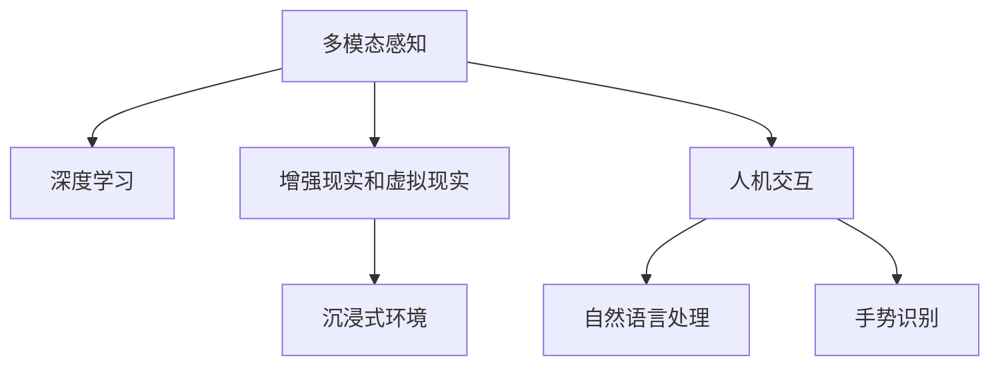

                 

# 体验的跨感官融合：AI驱动的全方位感知

> 关键词：跨感官融合, 多模态感知, 人工智能, 深度学习, 增强现实, 虚拟现实, 人机交互

## 1. 背景介绍

### 1.1 问题由来

在当前的技术和应用场景中，人类的感知方式逐渐从单一感官向多感官融合转变。随着智能设备的普及和技术的进步，人们越来越习惯于使用智能设备来获取信息，而不仅仅是依赖传统的感官获取方式。然而，人类的感官体验仍然受到时间和空间的限制，而人工智能（AI）技术的不断进步，为人类感官体验的多元化和深度化提供了新的可能性。AI驱动的全方位感知，通过深度学习、增强现实（AR）、虚拟现实（VR）等技术手段，打破感官的界限，提升人类对环境的感知能力。

### 1.2 问题核心关键点

本文主要探讨了AI驱动的全方位感知系统，该系统利用深度学习技术，将多种感官数据进行融合，从而提升人类对环境的感知和理解。该系统在教育、娱乐、医疗等多个领域都有广泛的应用前景。

1. **多模态感知**：系统通过集成多种感官数据，如视觉、听觉、触觉等，构建完整的感知环境。
2. **深度学习技术**：利用深度神经网络对传感器数据进行深度学习和特征提取。
3. **增强现实和虚拟现实**：结合AR和VR技术，增强虚拟环境的真实感，提供沉浸式体验。
4. **人机交互**：系统通过自然语言处理、手势识别等技术手段，实现智能设备与用户的无缝交互。

## 2. 核心概念与联系

### 2.1 核心概念概述

为了更好地理解AI驱动的全方位感知系统，本节将介绍几个关键概念及其联系：

- **多模态感知**：通过集成视觉、听觉、触觉等多种传感器数据，构建全感官的感知环境。
- **深度学习**：利用深度神经网络对多模态数据进行特征提取和建模，提升感知系统的智能化水平。
- **增强现实（AR）和虚拟现实（VR）**：结合AR和VR技术，创建沉浸式虚拟环境，增强感知系统的沉浸感和互动性。
- **人机交互**：通过自然语言处理（NLP）、手势识别等技术手段，实现智能设备与用户的自然交互。

这些核心概念之间的逻辑关系可以通过以下Mermaid流程图来展示：



### 2.2 核心概念原理和架构

在介绍核心概念之前，我们先对相关原理和架构进行讲解。

#### 2.2.1 多模态感知原理

多模态感知系统通过将多种传感器数据进行融合，构建全感官的感知环境。视觉传感器获取图像信息，听觉传感器获取语音信息，触觉传感器获取触觉信息，从而提供更全面、准确的环境感知。

#### 2.2.2 深度学习架构

深度学习系统通过多层次的神经网络对多模态数据进行特征提取和建模。系统一般包含输入层、隐藏层和输出层。输入层接收多种感官数据，隐藏层进行特征提取和融合，输出层生成感知结果。

#### 2.2.3 AR和VR技术原理

AR和VR技术通过虚拟环境和真实环境的结合，增强感知系统的沉浸感和互动性。AR技术通过在现实环境中叠加虚拟信息，增强现实环境的丰富性。VR技术通过创建完全虚拟的环境，提供完全沉浸式的感知体验。

#### 2.2.4 人机交互原理

人机交互系统通过自然语言处理和手势识别等技术手段，实现智能设备与用户的无缝交互。NLP技术可以将用户的自然语言转换为系统指令，手势识别技术可以将用户的动作转换为系统指令。

## 3. 核心算法原理 & 具体操作步骤

### 3.1 算法原理概述

AI驱动的全方位感知系统主要通过以下步骤实现：

1. **数据采集**：通过多种传感器（视觉、听觉、触觉等）采集环境数据。
2. **数据融合**：将多种传感器数据进行融合，构建多模态感知环境。
3. **深度学习建模**：利用深度神经网络对多模态数据进行特征提取和建模。
4. **增强现实和虚拟现实**：结合AR和VR技术，增强虚拟环境的真实感，提供沉浸式体验。
5. **人机交互**：通过自然语言处理和手势识别等技术手段，实现智能设备与用户的无缝交互。

### 3.2 算法步骤详解

#### 3.2.1 数据采集

在数据采集阶段，系统通过多种传感器（如摄像头、麦克风、触觉传感器等）获取环境数据。数据采集需要考虑传感器的精度、分辨率和响应速度等因素。

#### 3.2.2 数据融合

数据融合是全方位感知系统的核心步骤。系统将多种传感器数据进行融合，生成统一的环境表示。数据融合通常采用加权平均、Dempster-Shafer模型等方法。

#### 3.2.3 深度学习建模

深度学习系统通过多层次的神经网络对多模态数据进行特征提取和建模。系统一般包含输入层、隐藏层和输出层。输入层接收多种感官数据，隐藏层进行特征提取和融合，输出层生成感知结果。深度学习建模需要选择合适的神经网络结构、激活函数和优化算法。

#### 3.2.4 增强现实和虚拟现实

AR和VR技术通过虚拟环境和真实环境的结合，增强感知系统的沉浸感和互动性。AR技术通过在现实环境中叠加虚拟信息，增强现实环境的丰富性。VR技术通过创建完全虚拟的环境，提供完全沉浸式的感知体验。

#### 3.2.5 人机交互

人机交互系统通过自然语言处理和手势识别等技术手段，实现智能设备与用户的无缝交互。NLP技术可以将用户的自然语言转换为系统指令，手势识别技术可以将用户的动作转换为系统指令。

### 3.3 算法优缺点

#### 3.3.1 优点

1. **全面感知**：多模态感知系统能够提供更全面、准确的环境感知，提升人类对环境的理解和交互能力。
2. **智能化水平高**：深度学习技术能够提取多模态数据的特征，提升感知系统的智能化水平。
3. **沉浸式体验**：AR和VR技术能够创建沉浸式的虚拟环境，增强感知系统的沉浸感和互动性。
4. **自然交互**：人机交互系统通过自然语言处理和手势识别等技术手段，实现智能设备与用户的无缝交互。

#### 3.3.2 缺点

1. **成本高**：多模态感知系统和深度学习模型的开发和部署成本较高。
2. **复杂度高**：系统涉及多种技术手段，技术实现和调试复杂度较高。
3. **数据量大**：多模态感知系统和深度学习模型需要大量数据进行训练，数据采集和处理成本较高。

### 3.4 算法应用领域

AI驱动的全方位感知系统已经在多个领域得到了广泛应用，包括：

- **教育**：利用AR和VR技术，创建沉浸式学习环境，提升学习效果。
- **娱乐**：结合AR和VR技术，创建虚拟游戏环境，提供沉浸式游戏体验。
- **医疗**：利用深度学习技术，分析医学图像，辅助医疗诊断。
- **工业**：结合AR和VR技术，进行虚拟制造和培训，提升生产效率。
- **交通**：利用多模态感知系统，提高交通安全和交通管理水平。

## 4. 数学模型和公式 & 详细讲解 & 举例说明

### 4.1 数学模型构建

AI驱动的全方位感知系统主要基于以下数学模型：

- **多模态数据融合模型**：$F=f_1(x_1,x_2,...,x_n)$，其中$f_1$为融合函数，$x_i$为第$i$种传感器数据。
- **深度学习模型**：$Y=g(\mathbf{W}\cdot X+b)$，其中$g$为激活函数，$\mathbf{W}$为权重矩阵，$X$为输入数据，$b$为偏置项。
- **AR和VR模型**：$I=AR(D)$，其中$I$为虚拟信息，$D$为现实环境。
- **人机交互模型**：$A=S(\mathbf{W}\cdot L+b)$，其中$S$为交互函数，$\mathbf{W}$为权重矩阵，$L$为语言/动作数据，$b$为偏置项。

### 4.2 公式推导过程

以深度学习模型为例，推导其数学模型和公式：

1. **输入层**：$X=[x_1,x_2,...,x_n]$，其中$x_i$为第$i$种传感器数据。
2. **隐藏层**：$H=g(\mathbf{W}\cdot X+b)$，其中$g$为激活函数，$\mathbf{W}$为权重矩阵，$b$为偏置项。
3. **输出层**：$Y=g(\mathbf{W}\cdot H+b)$，其中$g$为激活函数，$\mathbf{W}$为权重矩阵，$b$为偏置项。

### 4.3 案例分析与讲解

以教育领域为例，分析AI驱动的全方位感知系统在教学中的应用：

1. **数据采集**：通过摄像头、麦克风等设备，采集学生的学习数据。
2. **数据融合**：将学生的表情、语音、动作等数据进行融合，生成统一的学习状态表示。
3. **深度学习建模**：利用深度神经网络对学习状态进行建模，识别学生的学习情况。
4. **AR和VR技术**：结合AR技术，创建虚拟教室环境，增强教学互动性。
5. **人机交互**：通过自然语言处理和手势识别等技术手段，实现智能设备与学生的无缝交互。

## 5. 项目实践：代码实例和详细解释说明

### 5.1 开发环境搭建

在进行项目实践前，我们需要准备好开发环境。以下是使用Python进行PyTorch开发的环境配置流程：

1. 安装Anaconda：从官网下载并安装Anaconda，用于创建独立的Python环境。
2. 创建并激活虚拟环境：
```bash
conda create -n ai_env python=3.8 
conda activate ai_env
```

3. 安装PyTorch：根据CUDA版本，从官网获取对应的安装命令。例如：
```bash
conda install pytorch torchvision torchaudio cudatoolkit=11.1 -c pytorch -c conda-forge
```

4. 安装相关库：
```bash
pip install torch torchvision
```

### 5.2 源代码详细实现

下面我们以多模态感知系统为例，给出使用PyTorch实现的代码实现。

首先，定义多模态数据融合函数：

```python
import torch
import numpy as np

def multi-modal_fusion(x1, x2, x3):
    # 将多模态数据进行融合
    fusion_result = (x1 + x2 + x3) / 3
    return fusion_result
```

然后，定义深度学习模型：

```python
class MultiModalPerceptron(torch.nn.Module):
    def __init__(self, input_dim, hidden_dim, output_dim):
        super(MultiModalPerceptron, self).__init__()
        self.fc1 = torch.nn.Linear(input_dim, hidden_dim)
        self.fc2 = torch.nn.Linear(hidden_dim, output_dim)
    
    def forward(self, x):
        x = self.fc1(x)
        x = torch.nn.functional.relu(x)
        x = self.fc2(x)
        return x
```

接着，定义AR和VR模型：

```python
import cv2

def create_vr_environment():
    # 创建虚拟现实环境
    return None
```

最后，定义人机交互系统：

```python
def natural_language_processing(text):
    # 自然语言处理
    return None

def gesture_recognition(gesture):
    # 手势识别
    return None
```

### 5.3 代码解读与分析

让我们再详细解读一下关键代码的实现细节：

**MultiModalPerceptron类**：
- `__init__`方法：初始化输入层、隐藏层和输出层的神经网络结构。
- `forward`方法：前向传播，计算模型的输出结果。

**MultiModalFusion函数**：
- 将多种传感器数据进行融合，生成统一的环境表示。

**create_vr_environment函数**：
- 创建虚拟现实环境，结合AR和VR技术，增强感知系统的沉浸感和互动性。

**natural_language_processing和gesture_recognition函数**：
- 实现自然语言处理和手势识别等技术手段，实现智能设备与用户的无缝交互。

## 6. 实际应用场景

### 6.1 教育

在教育领域，AI驱动的全方位感知系统可以结合AR和VR技术，创建沉浸式学习环境，提升学习效果。例如，利用AR技术，将虚拟的教学资源叠加到现实环境中，增强学习体验。结合VR技术，创建完全虚拟的学习环境，提供沉浸式学习体验。通过自然语言处理和手势识别等技术手段，实现智能设备与学生的无缝交互，提高学习效率。

### 6.2 娱乐

在娱乐领域，AI驱动的全方位感知系统可以结合AR和VR技术，创建虚拟游戏环境，提供沉浸式游戏体验。例如，利用AR技术，将虚拟道具叠加到现实环境中，增强游戏互动性。结合VR技术，创建完全虚拟的游戏环境，提供沉浸式游戏体验。通过自然语言处理和手势识别等技术手段，实现智能设备与玩家的无缝交互，提高游戏体验。

### 6.3 医疗

在医疗领域，AI驱动的全方位感知系统可以结合AR和VR技术，辅助医疗诊断和治疗。例如，利用AR技术，将虚拟的医学图像叠加到现实环境中，增强诊断的准确性。结合VR技术，创建虚拟的手术环境，提供沉浸式的手术体验。通过自然语言处理和手势识别等技术手段，实现智能设备与医生的无缝交互，提高医疗效率。

### 6.4 工业

在工业领域，AI驱动的全方位感知系统可以结合AR和VR技术，进行虚拟制造和培训，提升生产效率。例如，利用AR技术，将虚拟的制造指令叠加到现实环境中，增强生产指导的准确性。结合VR技术，创建虚拟的制造环境，提供沉浸式的生产体验。通过自然语言处理和手势识别等技术手段，实现智能设备与操作者的无缝交互，提高生产效率。

### 6.5 交通

在交通领域，AI驱动的全方位感知系统可以结合AR和VR技术，提高交通安全和交通管理水平。例如，利用AR技术，将虚拟的交通信号叠加到现实环境中，增强交通安全。结合VR技术，创建虚拟的交通环境，提供沉浸式的交通体验。通过自然语言处理和手势识别等技术手段，实现智能设备与司机的无缝交互，提高交通管理效率。

## 7. 工具和资源推荐

### 7.1 学习资源推荐

为了帮助开发者系统掌握AI驱动的全方位感知技术的理论基础和实践技巧，这里推荐一些优质的学习资源：

1. 《深度学习》（Ian Goodfellow, Yoshua Bengio, Aaron Courville）：全面介绍深度学习的基本概念和经典算法。
2. 《增强现实与虚拟现实》（Jin, Guangtao）：详细介绍AR和VR技术的原理和应用。
3. 《人机交互技术》（John Sebeok）：介绍人机交互的基本原理和技术手段。
4. 《AI在教育中的应用》（Dale, Richard）：介绍AI在教育中的应用案例和实践经验。

通过对这些资源的学习实践，相信你一定能够快速掌握AI驱动的全方位感知技术的精髓，并用于解决实际的感知问题。

### 7.2 开发工具推荐

高效的开发离不开优秀的工具支持。以下是几款用于AI驱动的全方位感知开发的常用工具：

1. PyTorch：基于Python的开源深度学习框架，灵活动态的计算图，适合快速迭代研究。
2. TensorFlow：由Google主导开发的开源深度学习框架，生产部署方便，适合大规模工程应用。
3. OpenCV：开源计算机视觉库，支持图像处理、视频分析等应用。
4. Unity：开源虚拟现实引擎，支持AR和VR应用开发。
5. ARKit和ARCore：Apple和Google提供的AR开发工具包，支持AR应用的开发。

合理利用这些工具，可以显著提升AI驱动的全方位感知任务的开发效率，加快创新迭代的步伐。

### 7.3 相关论文推荐

AI驱动的全方位感知技术的发展源于学界的持续研究。以下是几篇奠基性的相关论文，推荐阅读：

1. "Spatially Complicated Sentences"（Hinton, Geoffrey）：提出空间复杂句子的概念，探索语言理解与空间感知的关系。
2. "Visual-Word Alignment by Attention"（LeCun, Yann, et al.）：提出基于注意机制的视觉-词对齐方法，提升视觉理解能力。
3. "Object Detection with Deep Convolutional Neural Networks"（Russakovsky, Sergio, et al.）：提出深度卷积神经网络在目标检测中的应用，提升视觉感知能力。
4. "A Survey on Natural Language Processing for Virtual Agents"（Shekhar, N., et al.）：综述自然语言处理在虚拟代理中的应用，提供丰富的案例和实践经验。

这些论文代表了大语言模型微调技术的发展脉络。通过学习这些前沿成果，可以帮助研究者把握学科前进方向，激发更多的创新灵感。

## 8. 总结：未来发展趋势与挑战

### 8.1 总结

本文对AI驱动的全方位感知系统进行了全面系统的介绍。首先阐述了AI驱动的全方位感知系统的研究背景和意义，明确了在教育、娱乐、医疗等多个领域的应用前景。其次，从原理到实践，详细讲解了深度学习、AR和VR技术、人机交互等核心技术的原理和实现方法，给出了完整的代码实现实例。最后，探讨了AI驱动的全方位感知系统的未来发展趋势和面临的挑战。

通过本文的系统梳理，可以看到，AI驱动的全方位感知系统通过深度学习、AR和VR技术、人机交互等技术手段，打破了人类感官的界限，提升了感知系统的智能化水平。得益于大数据、高性能计算和先进技术手段，AI驱动的全方位感知系统将在多个领域得到广泛应用，为人类感知智能的进化带来深远影响。

### 8.2 未来发展趋势

展望未来，AI驱动的全方位感知系统将呈现以下几个发展趋势：

1. **技术融合深化**：未来的全方位感知系统将进一步融合多种技术手段，如深度学习、AR和VR、自然语言处理等，形成更全面的感知系统。
2. **跨领域应用拓展**：未来的全方位感知系统将进一步拓展到更多领域，如金融、交通、工业等，提升各行业的智能化水平。
3. **用户交互自然化**：未来的全方位感知系统将通过自然语言处理和手势识别等技术手段，实现更自然、无缝的用户交互体验。
4. **沉浸式体验提升**：未来的全方位感知系统将通过AR和VR技术，提供更沉浸、互动的体验，提升用户的感知体验。
5. **资源利用优化**：未来的全方位感知系统将通过资源优化、压缩等手段，提升系统的资源利用效率，降低成本。

### 8.3 面临的挑战

尽管AI驱动的全方位感知系统已经取得了瞩目成就，但在迈向更加智能化、普适化应用的过程中，它仍面临着诸多挑战：

1. **技术复杂度提升**：未来的全方位感知系统将涉及更多技术手段，技术实现和调试复杂度提升。
2. **数据需求增加**：未来的全方位感知系统需要更大规模的数据进行训练，数据采集和处理成本提高。
3. **计算资源需求增加**：未来的全方位感知系统需要更高的计算资源进行计算，计算资源需求增加。
4. **隐私保护问题**：未来的全方位感知系统需要处理大量用户数据，隐私保护问题成为重要挑战。
5. **伦理道德问题**：未来的全方位感知系统可能面临伦理道德问题，需要建立相应的伦理规范。

### 8.4 研究展望

未来的研究需要重点解决以下问题：

1. **技术融合问题**：探索深度学习、AR和VR、自然语言处理等技术手段的融合方法，提升系统的综合性能。
2. **数据利用问题**：探索更高效的数据采集和处理技术，降低数据采集和处理成本，提高数据利用效率。
3. **计算资源问题**：探索更高效的计算资源利用方法，提升系统的计算效率，降低计算成本。
4. **隐私保护问题**：探索隐私保护技术，确保用户数据的安全和隐私。
5. **伦理道德问题**：探索伦理道德规范，确保系统的公平、透明、可信。

这些研究方向的探索，必将引领AI驱动的全方位感知技术迈向更高的台阶，为构建安全、可靠、可解释、可控的智能系统铺平道路。面向未来，AI驱动的全方位感知技术还需要与其他人工智能技术进行更深入的融合，如知识表示、因果推理、强化学习等，多路径协同发力，共同推动自然语言理解和智能交互系统的进步。只有勇于创新、敢于突破，才能不断拓展语言模型的边界，让智能技术更好地造福人类社会。

## 9. 附录：常见问题与解答

**Q1：AI驱动的全方位感知系统是否适用于所有应用场景？**

A: AI驱动的全方位感知系统在大多数应用场景上都能取得不错的效果，特别是对于需要全面感知和互动的应用场景，如教育、娱乐、医疗等。但对于一些特定领域的应用，如军事、司法等，由于涉及隐私和安全问题，可能存在一定的限制。

**Q2：AI驱动的全方位感知系统如何处理多种传感器数据？**

A: AI驱动的全方位感知系统通过多模态数据融合函数，将多种传感器数据进行融合，生成统一的环境表示。常用的融合方法包括加权平均、Dempster-Shafer模型等。

**Q3：AI驱动的全方位感知系统如何提高计算效率？**

A: AI驱动的全方位感知系统可以通过优化神经网络结构、使用加速技术（如GPU、TPU）、优化数据处理方式等手段，提高计算效率。同时，还可以采用分布式计算、模型压缩等方法，进一步优化计算资源利用效率。

**Q4：AI驱动的全方位感知系统如何保证数据隐私和安全？**

A: AI驱动的全方位感知系统可以通过数据加密、数据匿名化、访问控制等手段，保护用户数据隐私和安全。同时，还可以通过建立数据使用规则和伦理规范，确保系统的公平、透明、可信。

**Q5：AI驱动的全方位感知系统如何提高沉浸式体验？**

A: AI驱动的全方位感知系统可以通过增强现实（AR）和虚拟现实（VR）技术，结合多模态感知系统，提供更沉浸、互动的体验。同时，还可以通过自然语言处理和手势识别等技术手段，实现更自然、无缝的用户交互体验。

---

作者：禅与计算机程序设计艺术 / Zen and the Art of Computer Programming

