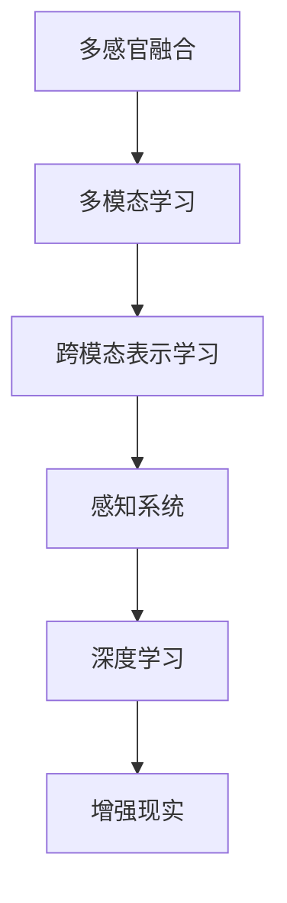

                 

# 体验跨感官协奏指挥：AI创造的感官交响乐团长

> 关键词：多感官融合,多模态学习,跨模态表示学习,感知系统,深度学习,增强现实

## 1. 背景介绍

### 1.1 问题由来
人类感知世界的方式主要通过视觉、听觉、触觉等感官获取信息。然而，传统的机器学习方法往往仅关注单一感官，难以捕捉到跨感官的丰富信息。近年来，随着深度学习技术的发展，跨感官融合和多模态学习逐渐成为热门研究方向，旨在通过多感官数据的协同训练，构建更为全面、准确的感知模型。

跨感官协奏指挥即是指融合多种感官信息，利用AI技术进行协同处理，形成一种类似乐队协奏的“感官交响乐团”。通过AI的深度学习模型，可以从多角度、多维度获取信息，极大地提升感知系统的准确性和泛化能力。

### 1.2 问题核心关键点
构建跨感官感知系统的关键在于：
- 数据获取与处理：收集并标注多模态数据，包括视觉、听觉、触觉等感官信息。
- 特征融合与表示学习：设计合适的特征融合策略，学习跨模态的联合表示。
- 协同训练与优化：利用协同训练算法，最大化跨感官模型的联合性能。
- 模型应用与评估：在实际应用中评估感知系统的表现，进行实时调整与优化。

## 2. 核心概念与联系

### 2.1 核心概念概述

为更好地理解跨感官协奏指挥的原理和应用，本节将介绍几个密切相关的核心概念：

- **多感官融合**：将来自不同感官的信息融合在一起，形成统一的感知表示。
- **多模态学习**：在多感官数据上进行协同训练，学习跨模态的联合表示。
- **跨模态表示学习**：通过深度学习模型，学习不同模态数据之间的映射关系，实现信息共享和融合。
- **感知系统**：利用多模态数据，构建能够感知和理解复杂环境的智能系统。
- **深度学习**：基于神经网络模型进行的多层非线性映射学习，用于构建复杂的感知模型。
- **增强现实**：将虚拟信息与现实环境结合，增强人类感知与互动。

这些核心概念之间的逻辑关系可以通过以下Mermaid流程图来展示：



这个流程图展示了大语言模型的核心概念及其之间的关系：

1. 多感官融合是数据预处理阶段，通过传感器收集不同感官的信息。
2. 多模态学习是通过多感官数据的协同训练，学习跨模态的联合表示。
3. 跨模态表示学习是模型训练阶段，学习不同模态数据之间的映射关系。
4. 感知系统是模型应用阶段，将多模态信息用于实际感知任务。
5. 深度学习是模型构建阶段，用于学习非线性映射关系。
6. 增强现实是将感知信息融入现实环境，提升人类感知与互动体验。

这些概念共同构成了跨感官感知系统的学习和应用框架，使其能够在复杂环境中高效感知和理解信息。通过理解这些核心概念，我们可以更好地把握跨感官感知模型的工作原理和优化方向。

## 3. 核心算法原理 & 具体操作步骤
### 3.1 算法原理概述

跨感官协奏指挥的核心思想是通过多模态数据的协同训练，构建一个能够融合不同感官信息的感知模型。其核心算法包括：

1. **特征提取**：对不同感官数据进行独立处理，提取其特征表示。
2. **特征融合**：将不同模态的特征表示进行融合，学习联合表示。
3. **表示学习**：利用深度学习模型，学习跨模态的表示关系。
4. **联合训练**：将不同模态的表示联合优化，最大化整体性能。
5. **联合评估**：对感知系统进行全面评估，确保其在多感官下的协同表现。

以视觉和听觉的多模态感知为例，假设有一张图像和对应的音频信号，通过以下步骤进行融合：

1. 提取图像的视觉特征：如使用卷积神经网络(CNN)提取图像的局部特征。
2. 提取音频的听觉特征：如使用卷积神经网络(CNN)或循环神经网络(RNN)提取音频的声学特征。
3. 特征融合：将图像和音频特征进行拼接或合并，形成联合特征表示。
4. 表示学习：使用深度学习模型，如多模态神经网络(MMNN)或混合表示学习(MTL)，学习跨模态的表示关系。
5. 联合训练：在联合特征表示上训练深度学习模型，最大化跨模态的协同性能。
6. 联合评估：在实际应用场景中评估感知系统的性能，进行实时调整与优化。

### 3.2 算法步骤详解

以下是详细的操作步骤：

**Step 1: 数据预处理与标注**
- 收集不同模态的数据，如图像、音频、触觉等。
- 对数据进行预处理，如去噪、归一化、分割等。
- 为每个数据样本添加标签，如视觉标签、听觉标签等。

**Step 2: 特征提取**
- 对不同模态的数据进行特征提取，如使用CNN提取视觉特征，使用RNN提取听觉特征。
- 将特征表示拼接或合并，形成联合特征表示。

**Step 3: 表示学习**
- 设计多模态神经网络(MMNN)或混合表示学习(MTL)模型，学习跨模态的表示关系。
- 选择合适的损失函数，如交叉熵损失、对比损失等。
- 在联合特征表示上进行联合训练，最小化损失函数。

**Step 4: 联合训练**
- 在联合特征表示上训练深度学习模型，最大化跨模态的协同性能。
- 采用协同训练算法，如MMD、GPR等，优化联合训练过程。

**Step 5: 联合评估**
- 在实际应用场景中评估感知系统的性能，进行实时调整与优化。
- 使用多模态评价指标，如准确率、召回率、F1-score等，评估感知系统的表现。

### 3.3 算法优缺点

跨感官协奏指挥的优点包括：
1. 多感官数据的融合可以提升感知系统的准确性和鲁棒性。
2. 多模态学习能够充分利用不同感官的信息，提高系统的泛化能力。
3. 深度学习模型的表示学习能力可以捕捉复杂的跨模态关系。
4. 联合训练可以提高模型的协同表现，提升整体性能。

然而，该方法也存在一些局限性：
1. 多模态数据获取和标注成本较高，可能需要高昂的人力物力。
2. 模型复杂度高，训练和推理耗时长，对计算资源要求高。
3. 不同模态之间的信息差异较大，融合和表示学习难度较大。
4. 实际应用中，跨模态数据可能存在不完全匹配，影响系统性能。

尽管存在这些局限性，但就目前而言，跨感官协奏指挥仍然是提升感知系统性能的重要方向。未来相关研究的重点在于如何进一步降低数据获取和标注成本，提高模型的可解释性和应用效率，以及探索更多模态数据的融合策略。

### 3.4 算法应用领域

跨感官协奏指挥在多个领域有广泛应用，例如：

- **增强现实**：通过视觉和触觉数据的融合，构建虚拟与现实结合的增强现实应用，如AR游戏、虚拟试衣等。
- **医疗诊断**：将视觉、听觉、触觉等多模态数据结合，提升疾病的早期诊断和治疗效果。
- **智能家居**：利用视觉、听觉、触觉数据，构建智能家居环境，如智能语音助手、智能家居控制等。
- **自动驾驶**：结合视觉、激光雷达、毫米波雷达等多模态数据，提升自动驾驶的感知能力和安全性。
- **人机交互**：通过视觉、触觉、语言等多模态数据的融合，实现更加自然、高效的交互方式。

除了上述这些应用外，跨感官协奏指挥还被创新性地应用于更多场景中，如可穿戴设备、智能交通、智慧城市等，为跨感官信息处理带来了新的可能性。

## 4. 数学模型和公式 & 详细讲解 & 举例说明
### 4.1 数学模型构建

以视觉和听觉的多模态感知为例，构建跨感官感知系统的数学模型：

假设输入的视觉特征表示为 $X$，听觉特征表示为 $Y$，表示学习的目标是学习一个联合特征表示 $Z$，使得 $Z = f(X, Y)$。其中 $f$ 是一个多模态神经网络或混合表示学习模型。

### 4.2 公式推导过程

以视觉和听觉的联合表示学习为例，推导多模态神经网络的公式：

$$
Z = f(X, Y) = M(X) \cdot W_X \cdot W_Y \cdot M(Y)
$$

其中 $M$ 是深度神经网络，$W_X$ 和 $W_Y$ 是权值矩阵，分别对应视觉和听觉的表示学习。

### 4.3 案例分析与讲解

以视觉和听觉的多模态神经网络为例，分析其结构和工作原理：

假设有一个视觉图像和对应的音频信号，通过以下步骤进行处理：

1. 使用CNN对图像进行特征提取，得到视觉特征 $X$。
2. 使用RNN对音频进行特征提取，得到听觉特征 $Y$。
3. 将视觉和听觉特征拼接，得到联合特征 $Z$。
4. 使用多模态神经网络对联合特征 $Z$ 进行表示学习，得到跨模态表示 $Z'$。
5. 使用协同训练算法，如MMD、GPR等，优化跨模态表示学习过程。

通过以上步骤，可以构建一个跨视觉和听觉的感知系统，用于多模态感知任务，如语音驱动的图像识别等。

## 5. 项目实践：代码实例和详细解释说明
### 5.1 开发环境搭建

在进行跨感官感知系统开发前，我们需要准备好开发环境。以下是使用Python进行PyTorch开发的环境配置流程：

1. 安装Anaconda：从官网下载并安装Anaconda，用于创建独立的Python环境。

2. 创建并激活虚拟环境：
```bash
conda create -n vision-audio-env python=3.8 
conda activate vision-audio-env
```

3. 安装PyTorch：根据CUDA版本，从官网获取对应的安装命令。例如：
```bash
conda install pytorch torchvision torchaudio cudatoolkit=11.1 -c pytorch -c conda-forge
```

4. 安装其他依赖库：
```bash
pip install numpy scipy matplotlib scikit-learn tensorboard
```

完成上述步骤后，即可在`vision-audio-env`环境中开始开发。

### 5.2 源代码详细实现

下面是使用PyTorch对视觉和听觉数据进行联合表示学习的代码实现：

```python
import torch
import torch.nn as nn
import torch.nn.functional as F
from torchvision.models import resnet18
from torchaudio.transforms import Spectrogram

class VisionAudioModel(nn.Module):
    def __init__(self):
        super(VisionAudioModel, self).__init__()
        self.vgg = resnet18(pretrained=True)
        self.audio = nn.Sequential(
            Spectrogram(n_fft=512, hop_length=128),
            nn.Conv2d(1, 64, kernel_size=3, stride=1, padding=1),
            nn.BatchNorm2d(64),
            nn.ReLU(),
            nn.MaxPool2d(kernel_size=2, stride=2),
            nn.Conv2d(64, 128, kernel_size=3, stride=1, padding=1),
            nn.BatchNorm2d(128),
            nn.ReLU(),
            nn.MaxPool2d(kernel_size=2, stride=2),
            nn.Conv2d(128, 256, kernel_size=3, stride=1, padding=1),
            nn.BatchNorm2d(256),
            nn.ReLU(),
            nn.MaxPool2d(kernel_size=2, stride=2),
            nn.Conv2d(256, 512, kernel_size=3, stride=1, padding=1),
            nn.BatchNorm2d(512),
            nn.ReLU(),
            nn.MaxPool2d(kernel_size=2, stride=2),
            nn.AdaptiveMaxPool2d((1, 1)),
            nn.Flatten()
        )
        self.fc = nn.Linear(512, 256)
        self.fc2 = nn.Linear(256, 1)

    def forward(self, vision, audio):
        vision = self.vgg(vision)
        audio = self.audio(audio)
        vision = vision.view(vision.shape[0], -1)
        audio = audio.view(audio.shape[0], -1)
        vision, audio = torch.cat([vision, audio], dim=1)
        vision = F.relu(self.fc(vision))
        vision = F.relu(self.fc2(vision))
        return vision

# 加载数据集
import torchvision.datasets as datasets
import torchaudio.datasets as datasets

train_vision = datasets.ImageFolder('train_vision', transform=transforms.ToTensor())
train_audio = datasets.SoundFolder('train_audio')

# 定义模型
model = VisionAudioModel()

# 定义优化器和损失函数
optimizer = torch.optim.Adam(model.parameters(), lr=0.001)
loss_fn = nn.MSELoss()

# 训练模型
for epoch in range(10):
    for vision, audio, label in zip(train_vision, train_audio, labels):
        vision = vision.unsqueeze(1)
        audio = audio.unsqueeze(1)
        optimizer.zero_grad()
        output = model(vision, audio)
        loss = loss_fn(output, label)
        loss.backward()
        optimizer.step()

# 保存模型
torch.save(model.state_dict(), 'vision_audio_model.pth')
```

在这个代码示例中，我们首先定义了一个包含视觉和听觉特征的联合表示学习模型 `VisionAudioModel`，然后使用 `ImageFolder` 和 `SoundFolder` 加载视觉和听觉数据，并使用 `Adam` 优化器和均方误差损失函数 `nn.MSELoss` 进行模型训练。最终将训练好的模型保存到 `vision_audio_model.pth` 文件中。

### 5.3 代码解读与分析

让我们再详细解读一下关键代码的实现细节：

**VisionAudioModel类**：
- `__init__`方法：初始化视觉和听觉特征的提取网络，以及联合表示学习的网络。
- `forward`方法：定义前向传播过程，将视觉和听觉特征拼接，并进行多模态特征学习。

**数据集加载**：
- 使用 `ImageFolder` 和 `SoundFolder` 加载视觉和听觉数据集。

**模型训练**：
- 在每个epoch内，使用 `ImageFolder` 和 `SoundFolder` 提供的 `vision` 和 `audio` 数据，以及对应的标签 `label`，进行模型训练。
- 定义优化器和损失函数，并使用 `Adam` 优化器和均方误差损失函数 `nn.MSELoss` 进行模型训练。
- 在训练过程中，对模型进行前向传播和反向传播，更新模型参数。

**模型保存**：
- 使用 `torch.save`方法将训练好的模型保存到文件中，方便后续使用。

在实际的跨感官感知系统开发中，可能还需要进行更多的优化和调试，如数据增强、正则化、超参数调优等。但核心的联合表示学习过程与上述示例类似。

## 6. 实际应用场景
### 6.1 智能家居

基于跨感官协奏指挥的智能家居系统，可以全面感知用户的行为和需求，提供个性化的智能服务。例如：

- 视觉传感器捕捉用户行为，如站立、行走、坐下等。
- 听觉传感器捕捉用户的语言指令，如“打开电视”、“调整温度”等。
- 触觉传感器感知用户的交互动作，如触摸、按压等。
- 将视觉、听觉、触觉等多模态数据进行联合表示学习，形成跨感官的感知模型。
- 在智能家居控制应用中，通过多模态感知模型，实时识别用户指令和行为，提供相应的智能服务。

### 6.2 医疗诊断

医疗诊断系统通常需要同时获取患者的视觉、听觉、触觉等多模态数据，以获得全面的病情信息。例如：

- 视觉传感器捕捉患者的外貌和体表特征，如颜色、纹理、形状等。
- 听觉传感器捕捉患者的语音信息，如咳嗽、说话、呼吸等。
- 触觉传感器捕捉患者的体表温度、脉搏、压力等生理信息。
- 将视觉、听觉、触觉等多模态数据进行联合表示学习，形成跨感官的感知模型。
- 在医疗诊断应用中，通过多模态感知模型，实时识别患者的病情信息，提供精准的诊断和治疗建议。

### 6.3 自动驾驶

自动驾驶系统需要同时获取车辆周围的多模态环境信息，以做出正确的行驶决策。例如：

- 视觉传感器捕捉道路、车辆、行人等环境信息，如颜色、形状、运动轨迹等。
- 激光雷达传感器捕捉道路、车辆、行人等环境信息，如距离、速度、方向等。
- 毫米波雷达传感器捕捉道路、车辆、行人等环境信息，如距离、速度、方向等。
- 将视觉、激光雷达、毫米波雷达等多模态数据进行联合表示学习，形成跨感官的感知模型。
- 在自动驾驶应用中，通过多模态感知模型，实时识别道路和车辆信息，做出安全的行驶决策。

### 6.4 未来应用展望

随着跨感官协奏指挥技术的发展，未来将有更多的应用场景涌现。以下是几个可能的应用方向：

- **增强现实**：结合视觉、触觉、语言等多模态数据，构建更加沉浸和自然的AR体验。
- **人机交互**：通过视觉、触觉、语音等多模态数据的融合，实现更加自然和高效的交互方式。
- **智能助手**：结合视觉、触觉、语音等多模态数据，构建智能助手系统，提升用户体验。
- **智能安防**：通过视觉、触觉、声音等多模态数据的融合，构建智能安防系统，提高安全性和效率。
- **智能制造**：通过视觉、触觉、声音等多模态数据的融合，构建智能制造系统，提高生产效率和质量。

## 7. 工具和资源推荐
### 7.1 学习资源推荐

为了帮助开发者系统掌握跨感官协奏指挥的理论基础和实践技巧，这里推荐一些优质的学习资源：

1. **《深度学习》课程**：斯坦福大学开设的深度学习课程，讲解了深度学习的基本概念和常用算法，非常适合初学者入门。
2. **《多模态学习》课程**：北京大学开设的多模态学习课程，介绍了多模态数据的融合和表示学习方法。
3. **《增强现实》课程**：麻省理工学院开设的增强现实课程，讲解了增强现实技术的基本原理和应用。
4. **《感知系统》书籍**：介绍感知系统理论和实践的经典书籍，适合系统学习跨感官协奏指挥技术。
5. **《跨模态表示学习》论文**：研究跨模态表示学习的最新论文，包含多模态神经网络和混合表示学习的最新进展。

通过对这些资源的学习实践，相信你一定能够快速掌握跨感官协奏指挥的精髓，并用于解决实际的感知系统问题。

### 7.2 开发工具推荐

高效的开发离不开优秀的工具支持。以下是几款用于跨感官感知系统开发的常用工具：

1. **PyTorch**：基于Python的开源深度学习框架，灵活动态的计算图，适合快速迭代研究。大部分预训练语言模型都有PyTorch版本的实现。
2. **TensorFlow**：由Google主导开发的开源深度学习框架，生产部署方便，适合大规模工程应用。同样有丰富的预训练语言模型资源。
3. **HuggingFace Transformers库**：提供了大量预训练语言模型的实现，支持多模态数据的融合和表示学习。
4. **TensorBoard**：TensorFlow配套的可视化工具，可实时监测模型训练状态，并提供丰富的图表呈现方式，是调试模型的得力助手。
5. **Weights & Biases**：模型训练的实验跟踪工具，可以记录和可视化模型训练过程中的各项指标，方便对比和调优。

合理利用这些工具，可以显著提升跨感官感知系统的开发效率，加快创新迭代的步伐。

### 7.3 相关论文推荐

跨感官协奏指挥技术的发展源于学界的持续研究。以下是几篇奠基性的相关论文，推荐阅读：

1. **《多模态神经网络》**：提出了多模态神经网络的结构和训练方法，用于学习跨模态的表示关系。
2. **《混合表示学习》**：研究了混合表示学习算法，用于多模态数据的联合表示学习。
3. **《协同训练》**：研究了协同训练算法，用于优化多模态模型的联合训练过程。
4. **《跨模态表示学习》**：研究了跨模态表示学习的方法，用于学习不同模态数据之间的映射关系。
5. **《跨感官感知系统》**：提出了跨感官感知系统的构建方法，用于解决实际感知问题。

这些论文代表了大语言模型微调技术的发展脉络。通过学习这些前沿成果，可以帮助研究者把握学科前进方向，激发更多的创新灵感。

## 8. 总结：未来发展趋势与挑战

### 8.1 总结

本文对跨感官协奏指挥方法进行了全面系统的介绍。首先阐述了跨感官感知系统的研究背景和意义，明确了多模态学习在提升感知系统性能方面的重要价值。其次，从原理到实践，详细讲解了跨感官感知模型的数学原理和关键步骤，给出了跨感官感知系统开发的完整代码实例。同时，本文还广泛探讨了跨感官感知系统在智能家居、医疗诊断、自动驾驶等多个行业领域的应用前景，展示了跨感官感知技术的前景广阔。此外，本文精选了跨感官感知技术的各类学习资源，力求为读者提供全方位的技术指引。

通过本文的系统梳理，可以看到，跨感官协奏指挥技术正在成为跨领域感知系统的关键范式，极大地提升了感知系统的准确性和鲁棒性。未来，伴随跨感官感知技术的不断发展，其在更多领域的应用将展现出新的可能性，为构建智能世界提供新的动力。

### 8.2 未来发展趋势

展望未来，跨感官协奏指挥技术将呈现以下几个发展趋势：

1. **数据获取与标注**：随着传感器技术的进步，多模态数据的获取成本将逐步降低，标注技术也将更加智能化。
2. **模型结构与算法**：深度学习模型将继续优化，以提升跨模态数据的表示学习能力。同时，新的协同训练算法也将出现，进一步优化联合训练过程。
3. **跨模态融合策略**：更多跨模态融合策略将被提出，以更好地整合不同模态的信息，提升感知系统的性能。
4. **应用场景与领域**：跨感官感知技术将进一步拓展到更多领域，如智能家居、医疗诊断、自动驾驶等。
5. **可解释性与可控性**：未来的跨感官感知系统将更加可解释和可控，增强其应用安全性。

以上趋势凸显了跨感官协奏指挥技术的广阔前景。这些方向的探索发展，必将进一步提升感知系统的性能和应用范围，为构建智能世界提供新的动力。

### 8.3 面临的挑战

尽管跨感官协奏指挥技术已经取得了瞩目成就，但在迈向更加智能化、普适化应用的过程中，它仍面临着诸多挑战：

1. **数据获取与标注**：多模态数据获取和标注成本较高，可能需要高昂的人力物力。
2. **模型复杂度**：多模态模型结构复杂，训练和推理耗时长，对计算资源要求高。
3. **数据匹配与融合**：不同模态之间的信息差异较大，融合和表示学习难度较大。
4. **应用场景与领域**：不同应用场景对跨模态感知的需求不同，需要针对性地优化跨模态感知模型。
5. **可解释性与可控性**：跨感官感知系统的可解释性和可控性亟需加强，避免输出结果的不确定性。

尽管存在这些挑战，但跨感官协奏指挥技术的发展前景依然广阔。未来，相关研究需要在以下几个方面寻求新的突破：

1. **数据获取与标注**：探索无监督和半监督学习的方法，降低数据获取和标注成本。
2. **模型结构与算法**：开发更加高效和可解释的深度学习模型和算法，提升跨模态表示学习能力。
3. **跨模态融合策略**：设计更有效的跨模态融合策略，提高跨模态数据的整合能力。
4. **应用场景与领域**：针对不同应用场景，优化跨模态感知模型，提升实际应用效果。
5. **可解释性与可控性**：引入可解释性方法和控制策略，增强跨模态感知系统的可信度和安全性。

## 9. 附录：常见问题与解答

**Q1：跨感官协奏指挥技术是否适用于所有感知场景？**

A: 跨感官协奏指挥技术在许多感知场景中都能取得不错的效果，但不同场景对多模态数据的需求不同，需要根据具体场景进行优化。例如，在智能家居场景中，多模态数据的需求相对简单，而在医疗诊断中，多模态数据的需求则较为复杂。因此，需要针对不同场景进行合理的感知模型设计。

**Q2：如何选择多模态数据进行联合表示学习？**

A: 多模态数据的选择需要根据具体任务需求进行。通常，视觉、听觉、触觉等数据是常用的感知数据，但对于特定任务，如医疗诊断，还需要引入生理数据等多模态信息。在进行联合表示学习时，需要考虑数据的关联性和互补性，以及数据的噪声和缺失情况，选择合适的数据进行联合表示学习。

**Q3：如何缓解跨感官协奏指挥中的过拟合问题？**

A: 过拟合是跨感官协奏指挥面临的主要挑战，尤其是在标注数据不足的情况下。常见的缓解策略包括：
1. 数据增强：通过回译、近义替换等方式扩充训练集。
2. 正则化：使用L2正则、Dropout等技术，防止模型过度适应小规模训练集。
3. 对抗训练：引入对抗样本，提高模型鲁棒性。
4. 参数高效微调：只调整少量参数，减小过拟合风险。

这些策略往往需要根据具体任务和数据特点进行灵活组合。只有在数据、模型、训练、推理等各环节进行全面优化，才能最大限度地发挥跨感官协奏指挥的威力。

**Q4：跨感官协奏指挥在落地部署时需要注意哪些问题？**

A: 将跨感官感知系统转化为实际应用，还需要考虑以下因素：
1. 模型裁剪：去除不必要的层和参数，减小模型尺寸，加快推理速度。
2. 量化加速：将浮点模型转为定点模型，压缩存储空间，提高计算效率。
3. 服务化封装：将模型封装为标准化服务接口，便于集成调用。
4. 弹性伸缩：根据请求流量动态调整资源配置，平衡服务质量和成本。
5. 监控告警：实时采集系统指标，设置异常告警阈值，确保服务稳定性。
6. 安全防护：采用访问鉴权、数据脱敏等措施，保障数据和模型安全。

跨感官感知系统需要考虑更多因素，如跨模态数据的匹配、多模态模型的优化、感知系统的实时性等，需要工程实践的不断打磨。

---

作者：禅与计算机程序设计艺术 / Zen and the Art of Computer Programming

