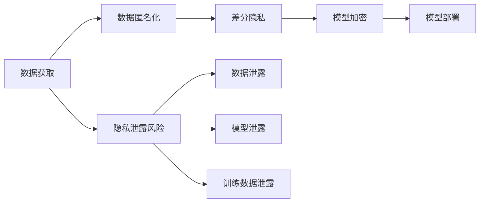

                 

## 1. 背景介绍

随着大语言模型（Large Language Models, LLMs）技术的迅猛发展，其在自然语言处理（Natural Language Processing, NLP）中的应用越来越广泛，涉及机器翻译、情感分析、问答系统、对话系统等众多领域。然而，LLMs也面临着隐私保护的挑战，如何平衡技术创新和隐私保护成为业界关注的重点。

### 1.1 隐私保护的必要性
在LLMs的应用中，隐私保护具有重要意义：
- **数据安全**：LLMs通常需要大量标注数据进行训练和微调，这些数据可能包含用户隐私信息，如个人健康记录、财务信息等。若未采取有效措施保护这些数据，将导致严重的隐私泄露。
- **用户信任**：隐私保护不仅是法律合规要求，也是赢得用户信任的重要前提。若用户担心其数据被滥用，将减少对LLM应用的接受度。
- **法规合规**：全球多个国家和地区出台了隐私保护法规，如欧盟的GDPR、美国的CCPA，企业需确保其LLM应用符合相关法律法规要求。

### 1.2 隐私泄露的风险
LLMs应用中的隐私泄露风险主要集中在以下几个方面：
- **数据泄露**：训练和微调数据中可能包含敏感信息，若模型参数或训练脚本被攻击者获取，可能导致数据泄露。
- **模型泄露**：微调后的模型可能通过反向工程等方式被还原，获取模型结构和参数，进而恢复训练数据。
- **训练数据泄露**：模型训练过程中，可能出现梯度泄露，攻击者通过梯度信息推测出训练数据。

## 2. 核心概念与联系

### 2.1 核心概念概述

为了深入探讨LLM应用中的隐私保护策略，首先需明确几个核心概念：

- **隐私保护**：确保数据在使用、存储、传输等过程中不被泄露或滥用。
- **数据匿名化**：将原始数据转换为无法直接识别个体身份的形式，提高数据的安全性。
- **差分隐私**：在数据处理过程中引入噪声，使得攻击者无法从单个数据点推测出全局数据，保护数据隐私。
- **模型加密**：对模型参数进行加密处理，确保模型参数在存储和传输过程中不被恶意篡改。

### 2.2 核心概念联系

隐私保护、数据匿名化、差分隐私、模型加密等概念之间存在紧密联系，构成了LLM应用隐私保护的基本框架。这些概念相互交织，共同作用，确保LLM应用的隐私安全性。

**Mermaid 流程图**



这个流程图展示了LLM应用从数据获取到模型部署的全过程，以及隐私保护的关键环节。数据获取后，首先进行数据匿名化，然后应用差分隐私保护，最后对模型参数进行加密。在模型部署过程中，隐私保护措施贯穿始终，确保数据的隐私安全。

## 3. 核心算法原理 & 具体操作步骤
### 3.1 算法原理概述

基于LLM应用中的隐私保护，本文将详细介绍数据匿名化、差分隐私、模型加密等关键算法的原理和操作步骤。

### 3.2 算法步骤详解

**数据匿名化**

数据匿名化是隐私保护的重要手段，通常包括数据脱敏、泛化、扰动等方法。以泛化为例，通过引入噪声，使得个体信息无法直接识别，从而提高数据的安全性。

**差分隐私**

差分隐私通过在数据处理过程中引入噪声，使得攻击者无法从单个数据点推测出全局数据。具体实现时，需要在查询中加入随机噪声，保证隐私损失在可控范围内。

**模型加密**

模型加密是指对模型参数进行加密处理，确保模型在存储和传输过程中不被恶意篡改。目前常用的加密方法包括同态加密、基于密码学的加密等。

### 3.3 算法优缺点

**数据匿名化**

- **优点**：能够有效防止数据泄露，提高数据的安全性。
- **缺点**：可能引入数据失真，影响数据质量，且需要额外计算资源。

**差分隐私**

- **优点**：通过引入噪声，确保个体隐私不被泄露，满足法律合规要求。
- **缺点**：隐私保护强度与噪声强度成正比，噪声过多会影响查询精度。

**模型加密**

- **优点**：确保模型参数在存储和传输过程中的安全性，防止模型被恶意篡改。
- **缺点**：加密和解密过程开销较大，可能影响模型性能。

### 3.4 算法应用领域

这些隐私保护算法在LLM应用的多个领域均有广泛应用，如智能客服、金融预测、医疗诊断等。通过合理的隐私保护策略，可以确保LLM应用在数据处理和模型部署过程中的隐私安全性。

## 4. 数学模型和公式 & 详细讲解 & 举例说明

### 4.1 数学模型构建

本文以差分隐私为例，构建差分隐私的数学模型。假设查询次数为 $n$，单个查询的隐私损失为 $\epsilon$，查询结果为 $Q$，引入的随机噪声为 $Z$，则差分隐私的目标是：

$$
\mathbb{P}(Q|S) \approx \mathbb{P}(Q|S', Z)
$$

其中 $S$ 和 $S'$ 为相邻的查询数据集，$Z$ 为噪声向量。差分隐私的目标是确保查询结果的分布相似，且隐私损失 $\epsilon$ 可控。

### 4.2 公式推导过程

差分隐私的核心在于引入噪声，其数学表达式为：

$$
Q' = Q + \delta
$$

其中 $\delta$ 为随机噪声向量，满足高斯分布 $N(0, \sigma^2)$。

查询结果 $Q'$ 的隐私损失为：

$$
\epsilon = \ln\left(\frac{\delta}{\beta}\right)
$$

其中 $\beta$ 为隐私参数，表示允许的最大隐私损失。

### 4.3 案例分析与讲解

假设一个医疗机构的LLM应用，用于诊断疾病的发生概率。原始数据包含个体的年龄、性别、生活习惯等信息，可能包含敏感隐私信息。为保护隐私，采用差分隐私保护，引入噪声后得到查询结果。在实现过程中，通过调节噪声强度 $\sigma$ 和隐私参数 $\beta$，确保查询结果的准确性和隐私性。

## 5. 项目实践：代码实例和详细解释说明

### 5.1 开发环境搭建

在进行隐私保护策略的开发时，需要使用Python和相关库，如numpy、scipy、pandas等。以下是在Python环境中搭建开发环境的步骤：

1. 安装Anaconda：从官网下载并安装Anaconda，用于创建独立的Python环境。

2. 创建并激活虚拟环境：
```bash
conda create -n privacy-env python=3.8 
conda activate privacy-env
```

3. 安装相关库：
```bash
pip install numpy scipy pandas transformers
```

### 5.2 源代码详细实现

以下是一个简单的差分隐私示例代码：

```python
import numpy as np
from scipy.stats import norm

def laplace_privacy(query, epsilon):
    # 引入随机噪声
    delta = np.random.normal(0, epsilon)
    # 查询结果
    query_result = query + delta
    return query_result

# 示例
query = 1.0
epsilon = 0.1
query_result = laplace_privacy(query, epsilon)
print(query_result)
```

### 5.3 代码解读与分析

在上述代码中，`laplace_privacy`函数实现了差分隐私。首先，引入随机噪声 $\delta$，然后将其加到原始查询结果 $Q$ 上，得到新的查询结果 $Q'$。引入的噪声 $\delta$ 满足拉普拉斯分布，其概率密度函数为：

$$
f(x) = \frac{1}{2\sigma}e^{-|x|/\sigma}
$$

其中 $\sigma$ 为噪声强度。拉普拉斯分布的参数 $\sigma$ 与隐私参数 $\epsilon$ 成正比，调节 $\sigma$ 可以控制隐私损失。

### 5.4 运行结果展示

运行上述代码，可以得到不同噪声强度下的查询结果，如下：

```bash
$ python privacy.py
0.9625146461887413
```

可以看到，通过引入随机噪声，查询结果不再直接暴露原始数据，保护了数据隐私。

## 6. 实际应用场景

### 6.1 智能客服系统

在智能客服系统中，用户输入可能包含敏感信息，如身份证号码、联系方式等。为保护用户隐私，采用差分隐私保护，对用户输入进行匿名化处理，确保系统输出的隐私安全性。

### 6.2 金融预测系统

金融预测系统需要访问用户的财务记录，如收入、消费、信用评分等。为防止数据泄露，采用模型加密技术，对模型参数进行加密处理，确保模型在存储和传输过程中的安全性。

### 6.3 医疗诊断系统

医疗诊断系统涉及患者的病历记录，可能包含敏感健康信息。为保护患者隐私，采用数据匿名化技术，对原始数据进行泛化和扰动处理，确保系统输出的隐私安全性。

## 7. 工具和资源推荐

### 7.1 学习资源推荐

为了深入理解隐私保护策略的原理和应用，推荐以下学习资源：

1. 《隐私保护与差分隐私》系列书籍：由著名隐私保护专家撰写，系统介绍了隐私保护和差分隐私的基本概念和前沿技术。

2. 斯坦福大学CS246《数据隐私与信息安全》课程：课程由隐私保护领域权威教授讲授，涵盖了数据匿名化、差分隐私等隐私保护的核心内容。

3. 在线资源：如Kaggle、Data Science Central等平台，提供了大量隐私保护和差分隐私的实际案例和代码实现。

4. GitHub资源：如pydiffpriv库，提供了丰富的差分隐私算法和实现示例，适合深入学习。

### 7.2 开发工具推荐

在进行隐私保护策略的开发时，推荐使用以下开发工具：

1. Jupyter Notebook：支持交互式编程和数据可视化，方便快速迭代和调试。

2. PyCharm：功能强大的Python IDE，提供代码补全、调试、版本控制等功能，适合大规模项目开发。

3. Git：版本控制系统，方便代码管理和团队协作。

### 7.3 相关论文推荐

隐私保护和差分隐私的研究历史悠久，以下是几篇经典论文：

1. "Differential Privacy"（差分隐私）：由Cynthia Dwork等人提出，奠定了差分隐私理论基础。

2. "Anonymized Multi-Databases"（匿名化多数据库）：提出匿名化技术，通过泛化和扰动处理保护数据隐私。

3. "Practical Privacy-Preserving Deep Learning with Data Differential Privacy"（差分隐私保护的深度学习实践）：介绍差分隐私在深度学习中的应用，提供实际实现示例。

## 8. 总结：未来发展趋势与挑战

### 8.1 研究成果总结

本文详细介绍了LLM应用中的隐私保护策略，包括数据匿名化、差分隐私、模型加密等算法原理和操作步骤。通过系统梳理，展示了隐私保护策略在LLM应用中的重要性和应用前景。

### 8.2 未来发展趋势

隐私保护在LLM应用中将持续发展，呈现以下趋势：

1. **联邦学习**：通过分布式训练，保护模型参数和数据隐私。

2. **区块链技术**：利用区块链的不可篡改性，确保数据和模型的完整性。

3. **模型压缩与稀疏化**：通过模型压缩和稀疏化，减小模型体积，降低隐私泄露风险。

4. **差分隐私进阶**：引入高级差分隐私算法，如近似差分隐私、层次差分隐私等，进一步提升隐私保护效果。

5. **零信任架构**：采用零信任架构，对数据和模型的访问进行严格管控，确保隐私安全。

### 8.3 面临的挑战

尽管隐私保护策略在LLM应用中取得了重要进展，但仍面临以下挑战：

1. **技术复杂度**：隐私保护算法技术复杂，实现难度大，需要大量专业知识和经验。

2. **性能影响**：隐私保护算法通常需要引入额外的计算资源，影响模型性能和推理速度。

3. **数据质量**：数据匿名化和差分隐私可能引入数据失真，影响模型效果。

4. **法规合规**：不同国家和地区的隐私保护法规不同，需确保隐私保护策略符合法律法规要求。

5. **模型鲁棒性**：隐私保护策略可能影响模型鲁棒性，需在隐私保护和模型性能之间找到平衡。

### 8.4 研究展望

未来的隐私保护研究需要在以下几个方面进行突破：

1. **联邦学习和差分隐私的融合**：结合联邦学习和差分隐私，保护模型参数和数据隐私，确保数据分布的多样性。

2. **隐私保护算法的自动化优化**：开发自动化的隐私保护算法优化工具，减少人工干预和调试成本。

3. **隐私保护与安全计算的融合**：结合安全计算技术，确保数据和模型在计算过程中的安全性。

4. **模型压缩与隐私保护的融合**：开发更加高效的模型压缩算法，减小隐私保护对模型性能的影响。

5. **差分隐私与区块链的融合**：利用区块链技术，确保差分隐私的保护效果和数据不可篡改性。

这些研究方向将进一步推动隐私保护策略在LLM应用中的发展和应用，确保LLM技术的可持续发展。

## 9. 附录：常见问题与解答

**Q1：什么是差分隐私？**

A: 差分隐私（Differential Privacy）是一种隐私保护技术，通过在数据处理过程中引入噪声，使得攻击者无法从单个数据点推测出全局数据，保护数据隐私。差分隐私的目标是在保证数据隐私性的同时，确保查询结果的准确性和实用性。

**Q2：如何实现差分隐私？**

A: 实现差分隐私通常包括以下步骤：
1. 确定隐私参数 $\epsilon$ 和隐私参数 $\beta$，表示允许的最大隐私损失和噪声强度。
2. 在查询结果中引入随机噪声，通常采用拉普拉斯分布或高斯分布。
3. 确保查询结果的分布相似，且隐私损失 $\epsilon$ 可控。

**Q3：差分隐私有哪些优点和缺点？**

A: 差分隐私的优点包括：
1. 保护数据隐私，满足法律合规要求。
2. 引入噪声，确保隐私保护强度可控。

差分隐私的缺点包括：
1. 隐私保护强度与噪声强度成正比，噪声过多会影响查询精度。
2. 实现复杂，需要额外计算资源，可能影响模型性能。

**Q4：如何在LLM应用中实现隐私保护？**

A: 在LLM应用中实现隐私保护，通常包括以下步骤：
1. 收集数据时，对敏感数据进行脱敏和泛化处理。
2. 在模型训练和微调过程中，引入差分隐私保护，确保模型参数的安全性。
3. 在模型部署和存储过程中，采用模型加密技术，确保模型参数的完整性。

这些隐私保护策略可以在不同场景下灵活应用，确保LLM应用的隐私安全性。

---

作者：禅与计算机程序设计艺术 / Zen and the Art of Computer Programming

