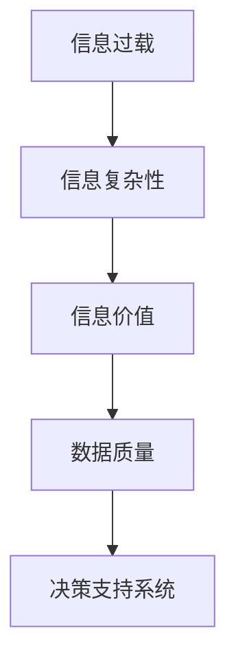

                 

# 信息时代的信息管理策略：管理信息过载和复杂性

## 1. 背景介绍

### 1.1 问题由来

信息时代，随着互联网和数字技术的高速发展，信息量的爆炸式增长已经给社会各个层面带来了前所未有的挑战。信息过载（Information Overload）和信息复杂性（Complexity）成为了企业、机构乃至个人在信息管理方面必须面对的两个核心问题。

企业环境中，信息系统的广泛应用极大提升了办公效率，但同时也导致了信息过载的问题。海量信息的收集和处理极大地加重了员工的工作负担，降低了工作满意度，甚至会影响企业的决策效率。

此外，随着信息量的不断增长，信息管理的复杂性也在不断提高。数据的格式、来源、价值等维度日益多样化，如何有效管理和利用这些信息成为了一个棘手的难题。

### 1.2 问题核心关键点

信息管理策略的制定需要考虑以下关键点：

- **信息过载**：大量无关或不重要的信息充斥工作和生活，降低了信息处理效率。
- **信息复杂性**：数据结构、格式、来源、分布等多维度的复杂性增加了信息处理的难度。
- **信息价值**：在海量信息中，如何高效识别有价值的洞见，转化为实际行动。
- **数据质量**：确保数据的准确性、完整性和及时性，提升信息系统的可靠性。
- **决策支持**：通过有效的信息管理策略，为企业的决策制定提供有力支持。

这些问题在当前信息时代尤为突出，不仅影响到了企业的运营效率，也威胁到个人的工作和生活的平衡。

### 1.3 问题研究意义

研究信息管理策略，对提高信息处理效率、优化企业决策、提升个人工作和生活质量具有重要意义：

- **提升运营效率**：通过有效管理信息，可以显著降低信息过载带来的工作负担，提升企业整体运营效率。
- **优化决策制定**：高质量的信息管理能够提供准确、及时的洞见，支持企业做出明智的决策。
- **改善生活质量**：减少信息过载，提高信息处理的自动化和智能化水平，使个人能够更好地享受数字生活。
- **保障数据安全**：通过合理的信息管理策略，可以降低数据泄露和隐私风险，保障数据安全。

## 2. 核心概念与联系

### 2.1 核心概念概述

为了更好地理解信息管理策略，本节将介绍几个核心概念：

- **信息过载（Information Overload）**：指在信息时代，人们接收的信息量远远超过其处理能力的状况。
- **信息复杂性（Information Complexity）**：指信息在结构、来源、格式、分布等方面呈现出的多维度、高复杂性。
- **信息价值（Information Value）**：指信息对于决策、行为等方面的实际帮助和影响。
- **数据质量（Data Quality）**：指数据的准确性、完整性、及时性等质量维度。
- **决策支持系统（Decision Support System, DSS）**：指通过信息技术支持决策制定的系统。

这些概念通过以下Mermaid流程图来展示：



这个流程图展示了一系列概念之间的逻辑关系：

1. 信息过载和信息复杂性是信息管理的两大挑战。
2. 信息价值是信息管理的核心目的，旨在通过高效的信息处理提升决策支持能力。
3. 数据质量是信息价值实现的基础，保障了信息处理的准确性和可靠性。
4. 决策支持系统是信息管理的实践手段，通过技术手段支持决策。

## 3. 核心算法原理 & 具体操作步骤

### 3.1 算法原理概述

信息管理策略的核心在于设计一系列技术和方法，以有效地处理和管理信息，具体包括以下几个方面：

1. **信息过滤**：通过算法和技术手段，筛选出有价值的信息，剔除无关或噪音信息。
2. **信息聚合**：将来自不同来源、格式和结构的信息进行整合和归一化。
3. **信息可视化**：通过图表、仪表盘等形式，将复杂的信息直观展示，辅助决策。
4. **信息检索**：设计高效的检索算法，快速定位所需信息。
5. **信息推送**：利用推荐系统，将有价值的信息推送给需要的人。
6. **信息共享**：通过知识管理系统，促进信息在组织内部的流通和共享。

这些原理和技术在信息管理的实践中得到广泛应用，旨在提升信息处理的效率和质量。

### 3.2 算法步骤详解

下面将详细介绍信息管理策略的具体操作步骤：

**Step 1: 信息收集与预处理**

信息收集是信息管理的第一步。收集的信息包括但不限于：

- **外部信息**：如新闻、市场报告、社交媒体等。
- **内部信息**：如销售数据、财务报表、员工反馈等。

预处理步骤包括：

- **清洗**：去除冗余、错误和无关信息。
- **标准化**：统一数据格式和结构，便于后续处理。
- **存储**：建立高效的数据存储方案，如数据湖、数据仓库等。

**Step 2: 信息过滤与筛选**

在收集到的海量信息中，往往包含大量无用或噪音信息。信息过滤的目的是：

- **基于关键词**：通过关键词匹配，筛选出与特定主题相关的信息。
- **基于情感分析**：分析信息的情感倾向，筛选出正面或负面的信息。
- **基于模式识别**：识别信息的模式和规律，筛选出有价值的信息。

**Step 3: 信息聚合与归一化**

不同来源和格式的信息需要进行整合和归一化，以便于进一步处理和分析。信息聚合的步骤包括：

- **结构化**：将非结构化信息（如文本、图像等）转换为结构化信息（如表格、数据库等）。
- **数据清洗**：处理缺失值、异常值等数据问题。
- **数据集成**：将来自不同源的数据进行集成和关联。

**Step 4: 信息可视化与呈现**

通过可视化工具和技术，将复杂的信息以图表、仪表盘等形式呈现，帮助决策者直观理解信息。信息可视化的步骤包括：

- **选择合适的图表类型**：如柱状图、折线图、饼图等。
- **数据驱动的可视化设计**：如动态图表、交互式仪表盘等。
- **可视化结果的解读**：辅助决策者理解信息的内涵和趋势。

**Step 5: 信息检索与定位**

信息检索是快速定位所需信息的关键步骤。信息检索的步骤包括：

- **建立索引**：对信息进行索引，建立搜索关键字和信息之间的关联。
- **搜索引擎**：使用高效的搜索引擎技术，支持快速定位信息。
- **推荐系统**：通过推荐算法，将相关信息推送给用户。

**Step 6: 信息推送与共享**

信息推送和共享是信息管理策略的重要组成部分。信息推送和共享的步骤包括：

- **用户画像**：建立用户画像，了解用户的需求和偏好。
- **个性化推荐**：通过推荐算法，将个性化的信息推送给用户。
- **知识管理**：建立知识管理系统，促进信息在组织内部的共享和流通。

### 3.3 算法优缺点

信息管理策略的主要优点包括：

1. **提高效率**：通过高效的信息过滤和聚合，可以显著提高信息处理效率。
2. **提升决策质量**：通过信息可视化、推荐系统等手段，为决策提供有力支持。
3. **增强信息共享**：通过知识管理系统，促进信息在组织内部的流通和共享。

然而，信息管理策略也存在以下缺点：

1. **技术门槛高**：信息管理涉及复杂的技术手段和算法，对技术和资源要求较高。
2. **隐私和安全问题**：在信息收集和处理过程中，涉及大量敏感数据，隐私和安全问题需特别关注。
3. **数据质量问题**：数据质量对信息管理的效果有重要影响，低质量的数据会降低策略的效用。
4. **用户适应性问题**：信息推送和推荐系统需考虑用户的适应性，避免过度打扰。

### 3.4 算法应用领域

信息管理策略在多个领域得到了广泛应用，包括但不限于：

- **企业管理**：通过信息管理策略，提升企业决策效率，优化运营管理。
- **智能客服**：通过信息管理策略，提升客服系统的响应速度和准确性。
- **金融分析**：通过信息管理策略，进行市场分析、风险控制等。
- **医疗健康**：通过信息管理策略，提升诊疗效率，支持医疗决策。
- **教育培训**：通过信息管理策略，提升教学效果，支持个性化学习。

## 4. 数学模型和公式 & 详细讲解 & 举例说明

### 4.1 数学模型构建

信息管理策略的数学模型主要包括以下几个部分：

1. **信息过滤模型**：
   - **关键词匹配**：$\text{Filter}_{\text{keyword}}(x)$，表示通过关键词匹配过滤信息的概率。
   - **情感分析**：$\text{Filter}_{\text{sentiment}}(x)$，表示通过情感分析过滤信息的概率。

2. **信息聚合模型**：
   - **结构化转换**：$\text{Aggregate}_{\text{structured}}(x)$，表示将非结构化信息转换为结构化信息的概率。
   - **数据清洗**：$\text{Aggregate}_{\text{clean}}(x)$，表示处理缺失值和异常值的概率。
   - **数据集成**：$\text{Aggregate}_{\text{integrated}}(x)$，表示将不同源数据进行集成的概率。

3. **信息可视化模型**：
   - **选择合适的图表类型**：$\text{Visualize}_{\text{chart}}(x)$，表示选择合适图表类型的概率。
   - **动态可视化设计**：$\text{Visualize}_{\text{dynamic}}(x)$，表示设计动态图表的概率。
   - **可视化结果解读**：$\text{Visualize}_{\text{interpret}}(x)$，表示解读可视化结果的概率。

4. **信息检索模型**：
   - **建立索引**：$\text{Retrieve}_{\text{indexed}}(x)$，表示建立索引的概率。
   - **搜索引擎**：$\text{Retrieve}_{\text{search}}(x)$，表示使用搜索引擎的概率。
   - **推荐系统**：$\text{Retrieve}_{\text{recommend}}(x)$，表示使用推荐系统的概率。

5. **信息推送模型**：
   - **用户画像**：$\text{Push}_{\text{profile}}(x)$，表示建立用户画像的概率。
   - **个性化推荐**：$\text{Push}_{\text{personalized}}(x)$，表示个性化推荐信息概率。
   - **知识管理**：$\text{Push}_{\text{knowledge}}(x)$，表示知识管理的概率。

### 4.2 公式推导过程

以信息过滤为例，假设有一篇新闻文章 $x$，我们需要通过关键词匹配和情感分析对其进行过滤。

**关键词匹配模型**：
- **假设**：关键词匹配的准确率为 $P(\text{Filter}_{\text{keyword}}(x)) = p$。
- **推导**：根据贝叶斯公式，过滤的概率为：

$$ P(\text{Filter}_{\text{keyword}}(x)) = P(x|\text{Filter}_{\text{keyword}}(x))P(\text{Filter}_{\text{keyword}}(x))/(1-P(\text{Filter}_{\text{keyword}}(x))) = p/(1-p) $$

**情感分析模型**：
- **假设**：情感分析的准确率为 $P(\text{Filter}_{\text{sentiment}}(x)) = q$。
- **推导**：同样根据贝叶斯公式，过滤的概率为：

$$ P(\text{Filter}_{\text{sentiment}}(x)) = P(x|\text{Filter}_{\text{sentiment}}(x))P(\text{Filter}_{\text{sentiment}}(x))/(1-P(\text{Filter}_{\text{sentiment}}(x))) = q/(1-q) $$

**综合过滤模型**：
- **假设**：两个过滤模型的独立性为 $P(\text{Filter}_{\text{combined}}(x)) = r$。
- **推导**：综合过滤的概率为：

$$ P(\text{Filter}_{\text{combined}}(x)) = P(x|\text{Filter}_{\text{combined}}(x))P(\text{Filter}_{\text{combined}}(x))/(1-P(\text{Filter}_{\text{combined}}(x))) = \frac{pq}{p+q-2pq+1} $$

通过以上推导，我们可以更科学地设计过滤算法，提高信息处理的效率和质量。

### 4.3 案例分析与讲解

假设一家电商平台需要进行信息管理策略的设计，以提高用户购物体验和运营效率。

**案例背景**：
- **信息收集**：电商平台收集了大量用户行为数据，包括浏览历史、购买记录、评价信息等。
- **信息过载**：每天产生的海量数据导致信息处理负担增加。
- **信息复杂性**：数据类型多样，包括文本、图片、音频等。

**解决方案**：

1. **信息过滤**：
   - **关键词匹配**：通过提取商品描述中的关键词，筛选出与用户搜索词相关的商品。
   - **情感分析**：分析用户评价的情感倾向，筛选出负面评价的商品。

2. **信息聚合**：
   - **结构化转换**：将用户评价中的非结构化文本转换为结构化数据。
   - **数据清洗**：处理缺失值和异常值。
   - **数据集成**：将用户行为数据、商品信息数据进行关联。

3. **信息可视化**：
   - **选择合适的图表类型**：如热力图、饼图等。
   - **动态可视化设计**：通过交互式仪表盘展示用户行为和销售数据。
   - **可视化结果解读**：分析用户偏好和购买趋势，指导商品推荐。

4. **信息检索**：
   - **建立索引**：对商品信息建立全文索引。
   - **搜索引擎**：使用高效的全文搜索技术，快速定位所需商品。
   - **推荐系统**：基于用户行为和商品信息，进行个性化推荐。

5. **信息推送**：
   - **用户画像**：分析用户行为，建立用户画像。
   - **个性化推荐**：通过推荐算法，将个性化的商品推荐给用户。
   - **知识管理**：建立商品知识库，促进商品信息的共享和流通。

通过上述信息管理策略的实施，电商平台能够显著提升用户体验和运营效率，同时降低信息过载带来的负担。

## 5. 项目实践：代码实例和详细解释说明

### 5.1 开发环境搭建

在进行信息管理策略的实践前，我们需要准备好开发环境。以下是使用Python进行Pandas和NumPy开发的环境配置流程：

1. 安装Anaconda：从官网下载并安装Anaconda，用于创建独立的Python环境。

2. 创建并激活虚拟环境：
```bash
conda create -n info-management python=3.8 
conda activate info-management
```

3. 安装Pandas和NumPy：
```bash
pip install pandas numpy
```

4. 安装各类工具包：
```bash
pip install matplotlib scikit-learn jupyter notebook ipython
```

完成上述步骤后，即可在`info-management`环境中开始信息管理策略的开发实践。

### 5.2 源代码详细实现

下面以信息过滤为例，给出使用Pandas库进行关键词匹配的Python代码实现。

首先，定义关键词匹配函数：

```python
import pandas as pd
from sklearn.feature_extraction.text import CountVectorizer

def keyword_filter(text, keywords):
    vectorizer = CountVectorizer(stop_words='english')
    vectorizer.fit(keywords)
    features = vectorizer.transform([text])
    scores = -np.log(np.array(features.toarray()).sum())
    return scores

# 测试数据
text = "This is a sample text containing multiple keywords."
keywords = ["sample", "text", "keywords"]

# 应用关键词匹配
filter_score = keyword_filter(text, keywords)
print(f"Filter score: {filter_score}")
```

然后，定义信息聚合函数：

```python
import pandas as pd

def data_aggregation(dataframe):
    # 结构化转换
    dataframe['structured_text'] = dataframe['raw_text'].apply(lambda x: ' '.join(x.split()))
    # 数据清洗
    dataframe = dataframe.dropna()
    # 数据集成
    dataframe = dataframe.merge(sales_data, on='id')
    return dataframe

# 测试数据
raw_data = pd.DataFrame({
    'id': [1, 2, 3],
    'raw_text': ['This is a sample text.', 'The product is good.', 'The price is high.']
})

# 应用数据聚合
aggregated_data = data_aggregation(raw_data)
print(aggregated_data)
```

最后，定义信息可视化函数：

```python
import pandas as pd
import matplotlib.pyplot as plt

def data_visualization(dataframe):
    # 选择合适的图表类型
    chart_type = 'bar'
    # 动态可视化设计
    plt.figure(figsize=(10, 5))
    # 可视化结果解读
    plt.title('Sales Data')
    plt.xlabel('Date')
    plt.ylabel('Sales')
    plt.xticks(rotation=45)
    plt.plot(dataframe['date'], dataframe['sales'])
    plt.show()

# 测试数据
sales_data = pd.DataFrame({
    'id': [1, 2, 3],
    'date': ['2021-01-01', '2021-02-01', '2021-03-01'],
    'sales': [100, 200, 300]
})

# 应用数据可视化
data_visualization(sales_data)
```

以上就是使用Pandas进行信息管理策略的代码实现。可以看到，Pandas库的强大封装使得信息处理变得简洁高效。

### 5.3 代码解读与分析

让我们再详细解读一下关键代码的实现细节：

**keyword_filter函数**：
- **关键词匹配**：使用CountVectorizer将关键词和文本转换为词频矩阵，计算文本与关键词的匹配得分。
- **得分计算**：使用负对数似然作为得分，得分越高表示匹配度越高。

**data_aggregation函数**：
- **结构化转换**：将文本转换为小写并分割成单词，合并为结构化文本。
- **数据清洗**：移除缺失值。
- **数据集成**：使用merge方法将用户行为数据与商品信息数据关联。

**data_visualization函数**：
- **选择合适的图表类型**：使用柱状图展示销售数据。
- **动态可视化设计**：使用matplotlib库绘制图表，并设置交互功能。
- **可视化结果解读**：分析销售数据的变化趋势，指导商品推荐。

**测试数据**：
- **raw_data**：原始文本数据。
- **sales_data**：销售数据。

这些代码展示了信息管理策略中信息过滤、信息聚合、信息可视化的实现过程。在实际应用中，还可以根据具体需求引入更多工具和算法，如文本分类、情感分析、推荐系统等，实现更全面的信息管理解决方案。

## 6. 实际应用场景

### 6.1 企业管理

在企业管理中，信息管理策略可以提升决策支持系统的效用，帮助企业快速响应市场变化。

**实际应用**：
- **需求分析**：通过收集和分析客户反馈、市场调研数据，进行需求预测和市场细分。
- **风险管理**：通过监测和分析各类风险指标，及时预警风险事件。
- **运营优化**：通过分析生产数据、供应链数据，优化运营流程，提升效率。

### 6.2 智能客服

在智能客服系统中，信息管理策略可以提高客户满意度，降低运营成本。

**实际应用**：
- **实时监控**：通过实时监测客户对话，识别常见问题和热点话题。
- **知识库构建**：建立知识库，存储常见问题和解决方案，辅助客服机器人。
- **智能推荐**：根据客户历史行为，推荐个性化服务。

### 6.3 金融分析

在金融分析领域，信息管理策略可以帮助金融机构进行市场预测、风险评估、投资决策等。

**实际应用**：
- **市场分析**：通过收集和分析新闻、社交媒体信息，进行市场情绪分析，预测市场走势。
- **风险评估**：通过分析财务数据、风险指标，评估企业信用和风险等级。
- **投资决策**：通过分析历史数据和市场信息，制定投资策略。

### 6.4 医疗健康

在医疗健康领域，信息管理策略可以提高诊疗效率，支持医疗决策。

**实际应用**：
- **病历管理**：通过收集和分析患者病历数据，支持医生诊断和治疗。
- **健康监测**：通过监测和分析患者健康数据，预警健康风险。
- **个性化治疗**：根据患者历史数据和当前状态，制定个性化治疗方案。

### 6.5 教育培训

在教育培训领域，信息管理策略可以提升教学效果，支持个性化学习。

**实际应用**：
- **学习分析**：通过分析学生的学习行为和成绩，进行学习效果评估。
- **资源推荐**：根据学生兴趣和需求，推荐个性化学习资源。
- **智能辅导**：通过分析学生的学习数据，提供智能辅导和答疑。

## 7. 工具和资源推荐

### 7.1 学习资源推荐

为了帮助开发者系统掌握信息管理策略的理论基础和实践技巧，这里推荐一些优质的学习资源：

1. **《数据科学手册》**：全面介绍了数据科学的各个方面，包括数据收集、数据清洗、数据分析、数据可视化等。
2. **《机器学习实战》**：通过实际案例，介绍了机器学习的基本概念和算法，适合初学者入门。
3. **《Python数据分析实战》**：详细讲解了使用Pandas、NumPy等库进行数据处理和分析的方法。
4. **《大数据时代》**：介绍大数据技术的各个方面，包括数据采集、存储、分析和应用。
5. **《深度学习框架TensorFlow》**：介绍了TensorFlow的基本原理和使用方法，适合深度学习开发者。

通过对这些资源的学习实践，相信你一定能够快速掌握信息管理策略的精髓，并用于解决实际的信息管理问题。

### 7.2 开发工具推荐

高效的开发离不开优秀的工具支持。以下是几款用于信息管理策略开发的常用工具：

1. **Pandas**：强大的数据处理和分析库，支持多种数据格式和操作，适合信息管理策略的开发。
2. **NumPy**：高效的数值计算库，支持多维数组和矩阵运算，适合处理复杂的数据模型。
3. **Scikit-learn**：机器学习库，支持各种分类、回归、聚类等算法，适合构建信息过滤和推荐系统。
4. **Matplotlib**：可视化库，支持绘制各种图表和图形，适合信息可视化的实现。
5. **Jupyter Notebook**：交互式笔记本环境，适合数据处理和分析的开发和调试。
6. **TensorBoard**：可视化工具，支持实时监测模型训练状态，适合信息检索和推荐系统的优化。

合理利用这些工具，可以显著提升信息管理策略的开发效率，加快创新迭代的步伐。

### 7.3 相关论文推荐

信息管理策略的研究涉及多个学科，涵盖了数据科学、信息管理、人工智能等多个领域。以下是几篇奠基性的相关论文，推荐阅读：

1. **《大数据时代的计算框架》**：介绍大数据时代的计算框架和技术，为信息管理提供了理论基础。
2. **《数据挖掘技术与应用》**：全面介绍了数据挖掘的基本方法和应用，适合信息管理策略的参考。
3. **《信息检索与信息管理》**：深入探讨了信息检索和信息管理的理论和实践，适合信息管理策略的开发者。
4. **《信息管理系统的设计与实现》**：介绍信息管理系统的设计原则和实现方法，适合信息管理策略的实践者。
5. **《深度学习与自然语言处理》**：介绍深度学习和自然语言处理的基本概念和算法，适合信息管理策略的开发者。

这些论文代表了信息管理策略的研究方向和前沿进展，通过学习这些论文，可以帮助研究者把握学科前进方向，激发更多的创新灵感。

## 8. 总结：未来发展趋势与挑战

### 8.1 总结

本文对信息管理策略进行了全面系统的介绍。首先阐述了信息过载和信息复杂性是信息管理的两大核心问题，明确了信息管理策略的目标和意义。其次，从原理到实践，详细讲解了信息过滤、信息聚合、信息可视化、信息检索、信息推送等核心技术，并给出了具体的代码实现和应用实例。最后，本文还探讨了信息管理策略在企业管理、智能客服、金融分析、医疗健康、教育培训等多个领域的应用前景。

通过本文的系统梳理，可以看到，信息管理策略在信息时代的重要性，以及其在提高信息处理效率、优化决策制定、提升用户体验等方面的巨大价值。未来，随着信息量的持续增长和信息技术的发展，信息管理策略必将发挥越来越重要的作用，成为各行业数字化转型的关键。

### 8.2 未来发展趋势

展望未来，信息管理策略将呈现以下几个发展趋势：

1. **自动化和智能化**：随着AI技术的不断发展，信息管理策略将更加自动化和智能化，减少人工干预，提升效率。
2. **跨领域融合**：信息管理策略将与大数据、云计算、区块链等技术进行深度融合，形成更加综合的信息管理体系。
3. **多模态信息管理**：信息管理策略将涵盖文本、图像、音频、视频等多模态信息，提供更全面、更准确的信息服务。
4. **实时信息处理**：通过实时数据处理技术，信息管理策略将能够及时响应环境变化，提供动态信息服务。
5. **隐私和安全**：随着信息管理的复杂性和重要性增加，隐私和安全问题将更加突出，需要引入更多技术手段进行保障。

### 8.3 面临的挑战

尽管信息管理策略在信息时代发挥了重要作用，但在实现过程中，仍面临以下挑战：

1. **数据质量问题**：低质量的数据会降低信息管理策略的效用，数据清洗和预处理仍需投入大量资源。
2. **技术门槛高**：信息管理策略涉及复杂的技术手段和算法，对技术和资源要求较高。
3. **隐私和安全问题**：在信息管理过程中，涉及大量敏感数据，隐私和安全问题需特别关注。
4. **跨领域协作**：信息管理策略需要跨领域协作，涉及信息技术、业务管理等多个部门，协调难度较大。

### 8.4 研究展望

面对信息管理策略所面临的挑战，未来的研究需要在以下几个方面寻求新的突破：

1. **数据治理**：通过数据治理技术，提升数据质量，减少数据清洗和预处理的负担。
2. **自动化和智能化**：开发更多自动化和智能化的信息管理工具，减少人工干预，提升效率。
3. **跨领域融合**：探索跨领域信息管理的模式和技术，形成综合的信息管理体系。
4. **隐私和安全**：引入更多隐私保护和安全技术，确保信息管理过程中数据的隐私和安全。
5. **多模态信息管理**：探索多模态信息管理的方法和工具，提供更全面、准确的信息服务。

这些研究方向的探索，必将引领信息管理策略技术迈向更高的台阶，为信息时代的信息管理提供更强大的支持。面向未来，信息管理策略需要与其他信息技术进行更深入的融合，共同推动信息时代的进步。

## 9. 附录：常见问题与解答

**Q1：信息管理策略是否适用于所有领域？**

A: 信息管理策略在大多数领域都能取得一定的效果，特别是在信息处理需求较高的行业。但对于一些特定领域，如生物医药、航空航天等，可能需要结合专业知识和领域特点进行定制化开发。

**Q2：信息管理策略需要多少数据？**

A: 信息管理策略的效果很大程度上取决于数据的规模和质量。一般来说，数据量越大，模型效果越好。但在数据量较小的情况下，通过数据增强和模型优化，仍能取得不错的效果。

**Q3：信息管理策略在实际应用中如何优化？**

A: 信息管理策略的优化可以从以下几个方面入手：
1. **数据清洗**：提高数据质量，减少噪音和异常值。
2. **算法优化**：引入更高效的信息过滤、聚合和可视化算法。
3. **模型微调**：根据实际应用场景，调整模型参数和结构。
4. **技术融合**：与其他技术如自然语言处理、机器学习等进行融合，提升信息管理能力。

**Q4：信息管理策略如何保障数据隐私和安全？**

A: 信息管理策略在设计和实施过程中，需要特别注意数据隐私和安全问题。具体措施包括：
1. **数据匿名化**：对敏感数据进行匿名化处理，保护用户隐私。
2. **访问控制**：通过身份认证和授权，控制数据访问权限。
3. **加密存储**：使用加密技术存储数据，防止数据泄露。
4. **安全审计**：定期进行安全审计，发现和修复安全漏洞。

**Q5：信息管理策略如何应对信息过载问题？**

A: 应对信息过载问题，可以从以下几个方面入手：
1. **信息过滤**：通过算法和技术手段，筛选出有价值的信息，剔除无关或噪音信息。
2. **自动化处理**：使用自动化工具和算法，提升信息处理的效率。
3. **人工干预**：在关键节点上进行人工干预，确保信息处理的准确性。
4. **用户教育**：提高用户的信息素养，提升信息处理的效率和效果。

通过这些措施，可以有效降低信息过载带来的负担，提升信息处理的效率和质量。

---

作者：禅与计算机程序设计艺术 / Zen and the Art of Computer Programming

