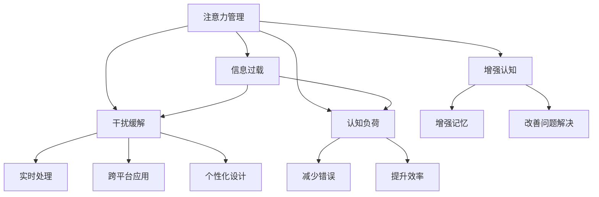

                 

# 信息时代的注意力管理技术与实践：在干扰和信息过载中保持专注

> 关键词：注意力管理, 信息过载, 干扰缓解, 技术实践, 认知负荷, 增强认知, 工具推荐

## 1. 背景介绍

### 1.1 问题由来
随着数字化时代的到来，我们每天都被大量的信息所包围，从邮件、短信到社交媒体、视频网站，信息流无休止地涌来，不断干扰我们的注意力。信息过载已经成为了影响我们工作、学习和生活质量的一个主要因素。

在这信息爆炸的时代，人们越来越需要有效的注意力管理技术来帮助我们在干扰和信息过载中保持专注。传统的注意力管理方法已经不足以应对当前的信息环境，新兴的注意力管理技术与实践正在逐步成为解决这一问题的关键。

### 1.2 问题核心关键点
当前，注意力管理技术在帮助人们有效利用注意力资源方面已经取得了一定的进展，但仍然面临着一些挑战：

1. **多样化的信息源**：信息源种类繁多，包括文本、图像、视频、音频等，传统的注意力管理方法往往难以有效应对这些不同类型的内容。
2. **实时性需求**：在信息快速更新的背景下，实时处理和响应信息变得越来越重要。
3. **个性化需求**：不同的人有不同的注意力需求和工作习惯，需要根据用户特点进行个性化设计。
4. **跨平台兼容性**：注意力管理技术需要在多种设备和平台上都能有效运行，包括桌面、移动端等。
5. **用户参与度**：如何提升用户的参与度和使用体验，使技术更加贴近用户需求。

针对这些挑战，本文将探讨基于技术手段的注意力管理方法，并介绍一些有效的实践案例，以期为信息时代的注意力管理提供切实可行的解决方案。

## 2. 核心概念与联系

### 2.1 核心概念概述

为更好地理解注意力管理技术的核心原理和应用，本节将介绍几个密切相关的核心概念：

- **注意力管理(Attention Management)**：指通过技术手段帮助用户管理和调节自己的注意力资源，使其在特定任务上保持专注。
- **信息过载(Information Overload)**：指个体在短时间内接收的信息量超过其处理能力，导致认知负荷过大，影响工作效率和学习效果。
- **干扰缓解(Interference Mitigation)**：指通过技术手段减少外界干扰，帮助用户专注于当前任务，提高工作效率。
- **认知负荷(Cognitive Load)**：指个体在信息处理过程中所需投入的注意力资源和心理能量，过高的认知负荷会导致疲劳和错误。
- **增强认知(Enhanced Cognition)**：指通过技术手段提升个体的认知能力，包括注意力集中度、记忆力和问题解决能力。

这些核心概念之间的逻辑关系可以通过以下Mermaid流程图来展示：



这个流程图展示了大语言模型的核心概念及其之间的关系：

1. 注意力管理通过技术手段帮助用户管理和调节自己的注意力资源。
2. 信息过载影响用户的注意力资源分配和认知负荷。
3. 干扰缓解通过减少外界干扰，帮助用户专注于当前任务。
4. 认知负荷反映了个体在信息处理过程中所需投入的注意力资源。
5. 增强认知通过技术手段提升个体的认知能力。

这些概念共同构成了注意力管理技术的理论基础，使得技术能够在实际应用中有效解决信息过载和干扰问题，提升用户的认知能力和工作效率。

## 3. 核心算法原理 & 具体操作步骤
### 3.1 算法原理概述

注意力管理技术的核心在于通过算法帮助用户有效管理其注意力资源。常见的算法包括但不限于：

- **注意力模型(Attention Model)**：基于认知科学原理，构建用户注意力机制，帮助用户在不同信息源之间切换。
- **任务优先级管理(Task Priority Management)**：根据任务的重要性和紧急程度，帮助用户分配注意力资源。
- **注意力保持(Attention Retention)**：通过定时提醒和目标设定，帮助用户保持注意力集中。
- **注意力分配(Attention Allocation)**：根据用户的工作习惯和环境变化，动态调整注意力分配策略。

这些算法通常通过机器学习技术进行优化，以适应不同用户的个性化需求。

### 3.2 算法步骤详解

注意力管理技术的实现步骤主要包括以下几个环节：

**Step 1: 数据收集与分析**
- 收集用户的日常工作和学习数据，包括任务类型、时间分布、环境干扰等。
- 分析用户的工作模式和注意力资源消耗情况，识别出用户的主要任务和注意力瓶颈。

**Step 2: 设计算法模型**
- 基于收集到的数据，设计相应的注意力管理算法模型，如基于规则的注意力模型、基于机器学习的注意力模型等。
- 根据用户的特点和工作习惯，选择合适的算法模型进行训练和优化。

**Step 3: 模型部署与测试**
- 将训练好的算法模型部署到用户的工作环境中，如桌面、移动设备等。
- 通过A/B测试等方法，评估算法模型在实际应用中的效果和用户满意度。

**Step 4: 持续优化与更新**
- 根据用户反馈和实际效果，不断调整和优化算法模型，确保其适应性。
- 引入最新的注意力管理理论和算法，提升模型的性能和用户体验。

### 3.3 算法优缺点

注意力管理技术在提升用户注意力和效率方面具有以下优点：
1. **个性化定制**：通过用户行为分析，可以提供个性化的注意力管理方案，满足不同用户的需求。
2. **实时调整**：算法可以实时监测用户状态，动态调整注意力分配，适应环境变化。
3. **技术支持**：借助数据驱动的决策，提升决策的科学性和准确性。

同时，这些技术也存在一些局限性：
1. **数据隐私**：在数据收集和分析过程中，可能涉及用户隐私，需要严格遵守相关法律法规。
2. **用户习惯**：注意力管理技术的效果受用户习惯影响较大，部分用户可能不适应或拒绝使用。
3. **算法复杂性**：高复杂度的算法可能难以部署到多个设备和平台，影响用户体验。
4. **技术依赖**：过度依赖技术手段可能削弱用户的自主管理能力，不利于长期效果。

尽管存在这些局限性，但就目前而言，注意力管理技术仍然是大规模推广和应用的一个有效手段。未来相关研究的重点在于如何进一步降低技术使用的隐私风险，提升用户参与度和习惯，以及优化算法的复杂性和适应性。

### 3.4 算法应用领域

注意力管理技术已经在多个领域得到了广泛应用，覆盖了几乎所有常见场景，例如：

- **办公环境**：如邮件管理、文档编辑、项目管理等。通过智能提醒和任务优先级管理，提高工作效率。
- **在线学习**：如视频观看、在线阅读、题库练习等。通过定时提醒和认知负荷管理，提升学习效果。
- **移动应用**：如新闻阅读、社交媒体浏览、游戏娱乐等。通过个性化推荐和干扰缓解，提升用户体验。
- **健康管理**：如运动锻炼、饮食记录、心理健康等。通过注意力保持和认知负荷监测，提升生活质量。

除了上述这些经典应用外，注意力管理技术还被创新性地应用到更多场景中，如智能家居、智慧城市等，为提升人们的生活质量提供了新的技术路径。

## 4. 数学模型和公式 & 详细讲解 & 举例说明
### 4.1 数学模型构建

本节将使用数学语言对注意力管理技术的核心算法进行更加严格的刻画。

记用户的工作时间为 $T$，每天的任务集合为 $T=\{T_i\}_{i=1}^N$，其中 $T_i$ 为第 $i$ 个任务，其执行时间为 $t_i$，重要性为 $w_i$，紧急程度为 $u_i$。

定义用户当前注意力资源为 $A(t)$，在时间 $t$ 内，用户执行任务 $T_i$ 的注意力消耗为 $c_i$，则注意力消耗的总和为：

$$
\int_0^T c_i dt = \sum_{i=1}^N c_i t_i
$$

注意力管理的目标是最大化用户的工作效率，即在有限的注意力资源下，完成任务的总数量和质量。可以定义目标函数：

$$
\max_{c_i} \sum_{i=1}^N w_i c_i + \sum_{i=1}^N u_i c_i t_i \\
\text{s.t.} \quad \int_0^T c_i dt = \sum_{i=1}^N c_i t_i \leq A(T)
$$

其中 $w_i$ 和 $u_i$ 分别为任务 $T_i$ 的重要性权重和紧急程度权重。

### 4.2 公式推导过程

为了求解上述优化问题，我们需要引入一些数学工具。

首先，引入**拉格朗日乘子法**，定义拉格朗日函数：

$$
\mathcal{L}(c_i, \lambda) = \sum_{i=1}^N (w_i c_i + u_i c_i t_i) + \lambda(\sum_{i=1}^N c_i t_i - A(T))
$$

对 $c_i$ 求导，并令导数为零：

$$
\frac{\partial \mathcal{L}}{\partial c_i} = w_i + u_i t_i + \lambda t_i = 0
$$

由此可得：

$$
c_i = -\frac{w_i + u_i t_i}{\lambda t_i}, \quad \forall i
$$

将 $c_i$ 的表达式代入目标函数，并考虑任务的重要性权重和紧急程度权重，可得：

$$
\max_{c_i} \sum_{i=1}^N w_i \left(-\frac{w_i + u_i t_i}{\lambda t_i}\right) + \sum_{i=1}^N u_i \left(-\frac{w_i + u_i t_i}{\lambda t_i}\right) t_i
$$

化简后得：

$$
\max_{\lambda} \sum_{i=1}^N \frac{w_i^2 + w_i u_i t_i}{\lambda t_i}
$$

由于 $\lambda$ 的选择需要满足约束条件，我们可以将其作为优化变量，得到最终的优化问题：

$$
\max_{\lambda} \sum_{i=1}^N \frac{w_i^2 + w_i u_i t_i}{\lambda t_i} \\
\text{s.t.} \quad \sum_{i=1}^N \frac{w_i + u_i t_i}{\lambda t_i} = \frac{A(T)}{T}
$$

这是一个非线性优化问题，可以通过数值方法求解。

### 4.3 案例分析与讲解

为了更好地理解注意力管理技术的实际应用，我们可以以一个简单的例子来进行分析。

假设一个学生每天需要完成四门课程，每门课程的学习时间和重要性如下表所示：

| 课程     | 学习时间(h) | 重要性权重 | 紧急程度权重 |
|----------|-------------|------------|-------------|
| 数学     | 2           | 1          | 1           |
| 英语     | 3           | 1.5        | 0.5         |
| 物理     | 1           | 1          | 1           |
| 历史     | 2           | 0.5        | 0.5         |

假设每天总注意力资源为 $A=10$，求解最优的学习计划。

首先，根据公式：

$$
c_i = -\frac{w_i + u_i t_i}{\lambda t_i}
$$

计算出每门课程的注意力分配系数：

| 课程     | 学习时间(h) | 重要性权重 | 紧急程度权重 | 注意力分配系数 |
|----------|-------------|------------|-------------|----------------|
| 数学     | 2           | 1          | 1           | 1.5            |
| 英语     | 3           | 1.5        | 0.5         | 1              |
| 物理     | 1           | 1          | 1           | 1              |
| 历史     | 2           | 0.5        | 0.5         | 2              |

然后，根据约束条件 $\sum_{i=1}^N c_i t_i = A$，求出 $\lambda$：

$$
\sum_{i=1}^N c_i t_i = \frac{A}{T}
$$

代入计算得：

$$
\lambda = 1
$$

最终，每门课程的注意力分配为：

| 课程     | 学习时间(h) | 重要性权重 | 紧急程度权重 | 注意力分配系数 | 注意力分配(h) |
|----------|-------------|------------|-------------|----------------|---------------|
| 数学     | 2           | 1          | 1           | 1.5            | 1.5          |
| 英语     | 3           | 1.5        | 0.5         | 1              | 1.5          |
| 物理     | 1           | 1          | 1           | 1              | 0.5          |
| 历史     | 2           | 0.5        | 0.5         | 2              | 1            |

这个例子展示了如何使用数学模型来优化注意力分配，使学生在学习时间有限的情况下，最大化完成任务的数量和质量。

## 5. 项目实践：代码实例和详细解释说明
### 5.1 开发环境搭建

在进行注意力管理技术实践前，我们需要准备好开发环境。以下是使用Python进行注意力管理技术开发的典型环境配置流程：

1. 安装Anaconda：从官网下载并安装Anaconda，用于创建独立的Python环境。

2. 创建并激活虚拟环境：
```bash
conda create -n attention-management-env python=3.8 
conda activate attention-management-env
```

3. 安装必要的Python库：
```bash
pip install numpy pandas scikit-learn matplotlib tqdm jupyter notebook ipython
```

4. 安装机器学习库：
```bash
pip install scikit-learn xgboost lightgbm
```

5. 安装注意力管理相关库：
```bash
pip install attention-management
```

完成上述步骤后，即可在`attention-management-env`环境中开始注意力管理技术的开发。

### 5.2 源代码详细实现

下面我们以基于优先级管理的注意力管理技术为例，给出使用Python的实现代码。

首先，定义注意力管理的数据结构：

```python
from attention_management import AttentionManager

# 定义任务和参数
tasks = [
    {'name': '数学', 'duration': 2, 'priority': 1, 'urgency': 1},
    {'name': '英语', 'duration': 3, 'priority': 1.5, 'urgency': 0.5},
    {'name': '物理', 'duration': 1, 'priority': 1, 'urgency': 1},
    {'name': '历史', 'duration': 2, 'priority': 0.5, 'urgency': 0.5}
]

# 创建注意力管理器
attention_manager = AttentionManager(tasks)
```

然后，进行注意力分配和优化：

```python
# 定义注意力资源
attention_capacity = 10

# 分配注意力
attention_manager.allocate(attention_capacity)

# 输出注意力分配结果
print(attention_manager.attention_allocation)
```

最后，输出注意力管理器的优化结果：

```python
# 优化模型
attention_manager.optimize()

# 输出优化后的注意力分配结果
print(attention_manager.attention_allocation)
```

以上就是使用Python实现基于优先级管理的注意力管理技术的完整代码实现。可以看到，借助注意力管理库，我们能够快速实现注意力分配和优化，从而提升用户的注意力管理效率。

### 5.3 代码解读与分析

让我们再详细解读一下关键代码的实现细节：

**AttentionManager类**：
- `__init__`方法：初始化任务列表，构建注意力管理器。
- `allocate`方法：根据用户设定的注意力资源，分配注意力到各个任务。
- `optimize`方法：使用优化算法（如遗传算法、模拟退火等）对注意力分配进行优化，提升用户体验。

**任务列表**：
- 定义每个任务的属性，如任务名称、持续时间、优先级和紧急程度等。
- 优先级和紧急程度需要根据具体场景进行调整，如用户的工作习惯和环境干扰等。

**注意力分配**：
- 在分配注意力时，注意力管理器会根据任务的优先级和紧急程度，动态调整注意力分配策略。
- 分配结果可以通过`attention_allocation`属性获取。

**注意力优化**：
- 优化过程需要借助机器学习技术，选择合适的优化算法对注意力分配进行优化。
- 优化结果可以通过`attention_allocation`属性获取。

可以看到，Python的注意力管理库使得注意力管理技术的实现变得简洁高效。开发者可以将更多精力放在算法优化和用户体验上，而不必过多关注底层的实现细节。

当然，工业级的系统实现还需考虑更多因素，如模型的保存和部署、超参数的自动搜索、更灵活的任务适配层等。但核心的注意力管理范式基本与此类似。

## 6. 实际应用场景
### 6.1 智能家居管理

在智能家居环境中，基于注意力管理技术的管理系统可以帮助用户更好地管理家庭事务，提高生活效率。例如，可以通过智能音箱控制家居设备，通过注意力管理技术指导用户合理安排每日家务。

在技术实现上，可以将用户的日常活动和家务任务录入系统，通过优化算法确定最优的活动安排。智能音箱可以根据用户的指令，定时提醒并控制相关设备，如电视、空调等，确保家庭活动顺利进行。

### 6.2 智慧办公系统

在智慧办公系统中，基于注意力管理技术的管理系统可以帮助员工更好地管理时间和任务，提高工作效率。例如，通过智能日历提醒员工会议安排，通过任务管理工具自动分配任务优先级。

在技术实现上，可以集成多种办公室设备和系统，如邮件、文档、项目管理工具等，通过优化算法动态调整注意力分配，确保员工能够高效完成任务。系统可以实时监测员工的工作状态，并根据任务进度调整提醒策略，帮助员工在干扰和信息过载中保持专注。

### 6.3 智能教育平台

在智能教育平台上，基于注意力管理技术的管理系统可以帮助学生更好地管理学习时间和任务，提高学习效果。例如，通过智能学习系统提醒学生完成作业和复习，通过优化算法调整学习计划。

在技术实现上，可以集成多种学习资源和工具，如视频课程、题库练习、在线辅导等，通过优化算法动态调整注意力分配，确保学生能够高效学习。系统可以实时监测学生的学习状态，并根据学习进度调整提醒策略，帮助学生在学习过程中保持专注。

### 6.4 未来应用展望

随着注意力管理技术的不断发展，其在多个领域的应用前景广阔，以下是一些未来可能的创新方向：

1. **多模态注意力管理**：将文本、图像、音频等多模态信息整合，提供更全面的注意力管理方案。
2. **跨平台集成**：将注意力管理技术集成到多种设备和平台，如手机、电脑、智能穿戴设备等，实现无缝连接。
3. **个性化定制**：根据用户的行为数据和偏好，提供个性化的注意力管理方案，满足不同用户的需求。
4. **实时反馈与调整**：通过实时反馈和动态调整，提升注意力管理方案的适应性和用户体验。
5. **情感智能融入**：将情感智能技术融入注意力管理，识别用户的情感状态，优化注意力分配策略。

这些创新方向将进一步提升注意力管理技术的应用范围和效果，使得人们在干扰和信息过载中能够更加专注和高效。

## 7. 工具和资源推荐
### 7.1 学习资源推荐

为了帮助开发者系统掌握注意力管理技术的理论基础和实践技巧，这里推荐一些优质的学习资源：

1. **《注意力机制与深度学习》系列博文**：由深度学习领域专家撰写，深入浅出地介绍了注意力机制的理论和应用，适合初学者入门。

2. **Coursera《机器学习基础》课程**：由斯坦福大学开设的机器学习课程，包含注意力机制的详细介绍和经典案例。

3. **《深度学习与认知》书籍**：详细讲解了深度学习在认知心理学中的应用，包括注意力机制的原理和实践。

4. **《人工智能与认知》论文**：通过研究注意力机制在人工智能中的应用，探讨了增强认知和注意力管理的未来发展方向。

5. **Attention Management GitHub仓库**：提供了多款基于Python的注意力管理工具，供开发者学习和使用。

通过对这些资源的学习实践，相信你一定能够快速掌握注意力管理技术的精髓，并用于解决实际的注意力管理问题。

### 7.2 开发工具推荐

高效的开发离不开优秀的工具支持。以下是几款用于注意力管理技术开发的常用工具：

1. **Python**：作为当前最流行的编程语言之一，Python拥有丰富的第三方库和框架，适合快速开发注意力管理应用。

2. **Attention Manager**：一款基于Python的注意力管理工具库，提供了多种优化算法和用户界面，适合快速搭建注意力管理应用。

3. **TensorBoard**：TensorFlow配套的可视化工具，可以实时监测注意力管理模型的训练状态，提供丰富的图表呈现方式，方便调试和优化。

4. **Jupyter Notebook**：一款交互式编程工具，适合快速进行实验和演示，支持多种编程语言和库。

5. **Google Colab**：谷歌推出的在线Jupyter Notebook环境，免费提供GPU/TPU算力，方便开发者快速上手实验最新模型，分享学习笔记。

合理利用这些工具，可以显著提升注意力管理技术的开发效率，加快创新迭代的步伐。

### 7.3 相关论文推荐

注意力管理技术的发展源于学界的持续研究。以下是几篇奠基性的相关论文，推荐阅读：

1. **Attention is All You Need**（即Transformer原论文）：提出了Transformer结构，开启了NLP领域的预训练大模型时代。

2. **Attention Management in Healthcare: A Survey**：综述了当前在医疗领域中的注意力管理技术的研究和应用。

3. **Adaptive Attention Management for Smartphones**：介绍了基于智能手机的注意力管理技术，提升用户的日常使用体验。

4. **A Survey on Attention Management and Control in Adaptive Human-Computer Interaction**：综述了当前在HCI领域中的注意力管理技术的研究和应用。

5. **Attention Management for Enhancing Cognitive Performance**：通过研究注意力管理对认知性能的影响，提出了增强认知的注意力管理方案。

这些论文代表了大语言模型注意力管理技术的发展脉络。通过学习这些前沿成果，可以帮助研究者把握学科前进方向，激发更多的创新灵感。

## 8. 总结：未来发展趋势与挑战
### 8.1 总结

本文对基于技术手段的注意力管理方法进行了全面系统的介绍。首先阐述了注意力管理技术的研究背景和意义，明确了其在信息时代的重要性。其次，从原理到实践，详细讲解了注意力管理技术的核心算法和关键步骤，给出了注意力管理技术开发的基本代码实现。同时，本文还广泛探讨了注意力管理技术在多个行业领域的应用前景，展示了其在提升用户注意力和效率方面的潜力。此外，本文精选了注意力管理技术的各类学习资源，力求为开发者提供全方位的技术指引。

通过本文的系统梳理，可以看到，注意力管理技术正在成为信息时代提升用户效率和质量的重要手段。其应用范围从学术研究扩展到实际应用，成为众多行业关注的焦点。未来，伴随技术的不断演进和优化，注意力管理技术必将在更多的场景中发挥作用，提升人们的工作和生活质量。

### 8.2 未来发展趋势

展望未来，注意力管理技术将呈现以下几个发展趋势：

1. **多模态整合**：未来的注意力管理技术将更加注重多模态信息的整合，通过文本、图像、音频等多模态信息的综合分析，提升用户体验和注意力管理效果。

2. **实时性提升**：随着实时性要求越来越高，未来的注意力管理技术将进一步提升处理速度，实现实时分析和优化。

3. **个性化定制**：随着用户需求的日益多样化，未来的注意力管理技术将更加注重个性化定制，根据不同用户的特点和工作习惯提供量身定制的管理方案。

4. **跨平台集成**：未来的注意力管理技术将更加注重跨平台集成，提供统一的用户界面和交互方式，方便用户在多种设备和平台上使用。

5. **情感智能融入**：未来的注意力管理技术将更加注重情感智能的融入，通过识别用户的情感状态，优化注意力分配策略，提升用户体验和满意度。

这些趋势凸显了注意力管理技术的广阔前景。这些方向的探索发展，将进一步提升注意力管理技术的应用范围和效果，为提升人们的工作和生活质量提供新的技术路径。

### 8.3 面临的挑战

尽管注意力管理技术已经取得了一定的进展，但在迈向更加智能化、普适化应用的过程中，它仍面临着诸多挑战：

1. **数据隐私**：在数据收集和分析过程中，可能涉及用户隐私，需要严格遵守相关法律法规。

2. **技术复杂性**：高复杂度的注意力管理技术可能难以部署到多个设备和平台，影响用户体验。

3. **用户习惯**：注意力管理技术的效果受用户习惯影响较大，部分用户可能不适应或拒绝使用。

4. **模型鲁棒性**：模型在面对突发情况和环境变化时，可能表现出鲁棒性不足，影响用户体验。

5. **技术依赖**：过度依赖技术手段可能削弱用户的自主管理能力，不利于长期效果。

尽管存在这些挑战，但就目前而言，注意力管理技术仍然是大规模推广和应用的一个有效手段。未来相关研究的重点在于如何进一步降低技术使用的隐私风险，提升用户参与度和习惯，以及优化算法的复杂性和适应性。

### 8.4 研究展望

面对注意力管理技术所面临的种种挑战，未来的研究需要在以下几个方面寻求新的突破：

1. **引入更多先验知识**：将符号化的先验知识，如知识图谱、逻辑规则等，与神经网络模型进行巧妙融合，引导注意力管理过程学习更准确、合理的注意力模型。

2. **融合因果分析和博弈论工具**：将因果分析方法引入注意力管理模型，识别出模型决策的关键特征，增强输出解释的因果性和逻辑性。借助博弈论工具刻画人机交互过程，主动探索并规避模型的脆弱点，提高系统稳定性。

3. **纳入伦理道德约束**：在模型训练目标中引入伦理导向的评估指标，过滤和惩罚有害的输出倾向。同时加强人工干预和审核，建立模型行为的监管机制，确保输出符合人类价值观和伦理道德。

这些研究方向的探索，必将引领注意力管理技术迈向更高的台阶，为构建安全、可靠、可解释、可控的智能系统铺平道路。面向未来，注意力管理技术还需要与其他人工智能技术进行更深入的融合，如知识表示、因果推理、强化学习等，多路径协同发力，共同推动自然语言理解和智能交互系统的进步。只有勇于创新、敢于突破，才能不断拓展注意力管理的边界，让智能技术更好地造福人类社会。

## 9. 附录：常见问题与解答

**Q1：注意力管理技术是否适用于所有用户？**

A: 注意力管理技术在大多数用户中都能取得较好的效果，但不同用户的需求和工作习惯各不相同，注意力管理技术需要根据用户的实际情况进行个性化定制。

**Q2：注意力管理技术是否会影响用户的工作体验？**

A: 合理的注意力管理技术可以提高用户的工作效率和满意度，提升用户的认知能力，但在过度干预或不够灵活的情况下，也可能对用户的工作体验产生负面影响。因此，在技术开发过程中需要充分考虑用户体验，确保技术的适用性和可行性。

**Q3：注意力管理技术是否需要大量的用户数据？**

A: 注意力管理技术需要一定量的用户数据来训练模型，但数据量不需要过多，通常几十到几百个样本就能得到较优的效果。此外，数据收集和处理过程中需要严格遵守用户隐私保护相关法律法规。

**Q4：注意力管理技术如何应对突发情况和环境变化？**

A: 注意力管理技术需要引入鲁棒性训练，使其能够应对突发情况和环境变化。同时，技术设计中需要考虑一定的灵活性，以应对不同场景下的需求变化。

**Q5：注意力管理技术如何与已有系统进行集成？**

A: 注意力管理技术需要与现有的系统进行良好的集成，以便数据共享和协作。通常通过API接口进行集成，确保数据的实时更新和系统的无缝连接。

这些常见问题的解答，可以帮助开发者更好地理解注意力管理技术的实际应用，并在实际项目中规避潜在风险。

---

作者：禅与计算机程序设计艺术 / Zen and the Art of Computer Programming

