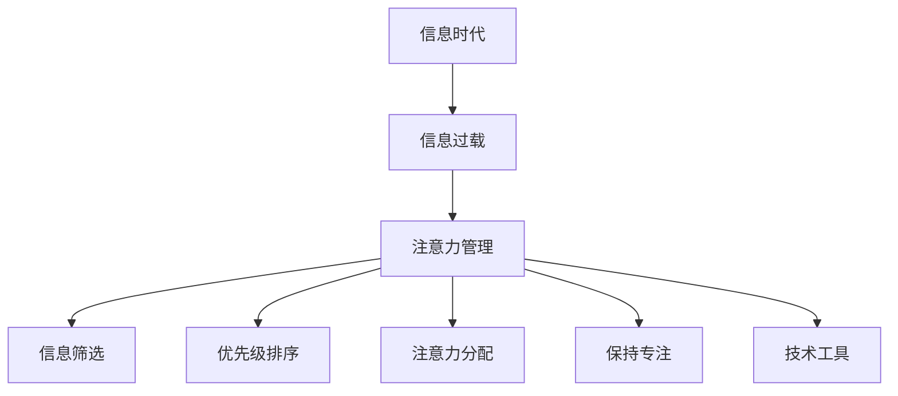

                 

# 信息时代的注意力管理技术：在干扰和信息过载中保持专注

在信息时代，海量的数据和干扰无处不在，保持专注已经成为个体和组织都面临的巨大挑战。信息技术的发展虽然在提供丰富信息资源的同时，也带来了注意力分散和信息过载的问题。本文将深入探讨信息时代的注意力管理技术，帮助读者在干扰和信息过载中保持专注，提升工作和学习效率。

## 1. 背景介绍

### 1.1 问题由来
随着互联网和移动互联网的普及，人们的生活和工作方式发生了根本性的变化。信息的获取变得更加便捷，但同时也带来了注意力管理的难题。据研究表明，现代人平均每天收到的信息量已经远远超过了他们可以处理的能力范围。信息过载和注意力分散的问题日益严重，极大地影响了人们的工作效率和生活质量。

### 1.2 问题核心关键点
信息时代注意力管理的核心关键点在于如何在干扰和信息过载中找到平衡，从而保持高效专注。主要包括以下几个方面：

1. **信息筛选与优先级排序**：从海量信息中筛选出重要内容，并按照优先级排序处理。
2. **注意力分配与保持**：将有限的注意力分配给最重要的任务，并保持持续的专注。
3. **技术工具与方法**：利用各种技术工具和方法，辅助个体在信息过载的环境中保持专注。
4. **心理机制与策略**：探索个体心理机制，制定有效的注意力管理策略。

## 2. 核心概念与联系

### 2.1 核心概念概述

为更好地理解信息时代注意力管理技术，本节将介绍几个密切相关的核心概念：

- **注意力管理(Attention Management)**：通过各种技术和方法，帮助个体在信息过载的环境中筛选重要信息，分配注意力资源，并保持专注。
- **信息筛选(Information Filtering)**：从大量信息中筛选出与个体目标相关的信息，并按照重要性排序。
- **优先级排序(Priority Sorting)**：根据任务的重要性和紧急程度，对任务进行排序处理。
- **注意力分配(Attention Allocation)**：将有限的注意力资源合理分配到不同的任务和活动中，以提高效率和效果。
- **保持专注(Maintaining Focus)**：在信息干扰和分心的环境中，通过各种技术和心理策略，保持持续的专注。
- **技术工具(Attention Tools)**：利用软件、应用、硬件等技术工具，辅助个体进行注意力管理。

这些核心概念之间的逻辑关系可以通过以下Mermaid流程图来展示：



这个流程图展示了一些关键概念之间的联系：

1. 信息时代带来的信息过载是注意力管理的问题根源。
2. 注意力管理是一个综合性的概念，包括信息筛选、优先级排序、注意力分配和保持专注等多个方面。
3. 技术工具是实现注意力管理的有效手段。
4. 心理机制和策略是提高注意力管理效果的关键。

这些概念共同构成了信息时代注意力管理的基础框架，通过理解这些概念，我们可以更好地把握注意力管理的方法和策略。

## 3. 核心算法原理 & 具体操作步骤
### 3.1 算法原理概述

信息时代的注意力管理技术，本质上是一个多目标优化问题。其核心思想是：通过筛选信息、分配注意力和保持专注，最大化个体的工作效率和学习效果。

形式化地，假设个体目标为 $O=\{O_1, O_2, \ldots, O_n\}$，其中 $O_i$ 表示第 $i$ 个任务。设 $W_i$ 为 $O_i$ 的权重，$C_i$ 为 $O_i$ 所需的注意力资源。则注意力管理的目标函数为：

$$
\max \sum_{i=1}^n W_i \times f_i(O_i)
$$

其中 $f_i(O_i)$ 表示 $O_i$ 的任务完成度，可以由任务重要性和时间成本等因素共同决定。约束条件包括：

$$
\sum_{i=1}^n C_i \leq C_{\text{total}}
$$

其中 $C_{\text{total}}$ 为个体总的注意力资源限制。

通过优化上述目标函数和约束条件，可以在信息过载的环境中，最大化个体的工作效率和学习效果，从而实现高效专注。

### 3.2 算法步骤详解

信息时代的注意力管理通常包括以下几个关键步骤：

**Step 1: 数据收集与任务建模**
- 收集与个体目标相关的信息数据，如任务清单、邮件、社交媒体等。
- 对每个任务进行建模，包括任务描述、所需资源、预期完成时间等。

**Step 2: 信息筛选与优先级排序**
- 利用信息过滤算法，如基于规则、机器学习等方法，筛选出与目标相关的信息。
- 对筛选出的信息进行优先级排序，根据任务的紧急性和重要性进行排序。

**Step 3: 注意力分配与任务调度**
- 根据优先级排序结果，分配注意力资源，决定哪些任务值得优先处理。
- 设计任务调度算法，合理分配任务执行时间，优化时间资源的使用。

**Step 4: 保持专注与执行监控**
- 使用注意力保持技术，如番茄工作法、番茄钟等，帮助个体在执行任务时保持专注。
- 利用任务执行监控工具，如任务进度条、计时器等，及时调整注意力分配。

**Step 5: 反馈与调整**
- 定期评估任务完成情况和注意力管理效果，根据评估结果进行反馈和调整。
- 不断优化信息筛选、优先级排序和注意力分配算法，提升整体效率。

### 3.3 算法优缺点

信息时代注意力管理技术具有以下优点：
1. 提高效率：通过优化信息筛选和注意力分配，最大化个体的工作效率和学习效果。
2. 减少干扰：筛选不相关信息，降低信息过载带来的干扰，提升专注度。
3. 提升效果：通过任务优先级排序和执行监控，确保重要任务得到优先处理，提升任务完成度。
4. 灵活可控：根据个体需求和工作特点，灵活设计注意力管理策略，增强可操作性。

同时，该方法也存在一些局限性：
1. 技术依赖性：依赖于各种技术工具和方法，技术不成熟可能影响效果。
2. 心理适应性：依赖个体心理机制，个体心理差异可能影响注意力管理效果。
3. 信息偏差：信息筛选可能存在偏差，筛选不充分或过度可能会导致任务漏掉或过度处理。
4. 动态变化：任务和环境动态变化可能影响注意力管理策略的有效性。
5. 执行难度：实现有效的注意力管理需要较高的执行力和自律性。

尽管存在这些局限性，但就目前而言，基于多目标优化的信息时代注意力管理方法，仍然是提高个体专注力和工作效果的重要手段。未来相关研究的重点在于如何进一步提升技术工具的智能化和自适应性，增强个体对注意力管理策略的适应性和灵活性。

### 3.4 算法应用领域

信息时代注意力管理技术在多个领域得到了广泛应用，例如：

- 办公自动化：通过自动化任务调度和管理，提升办公效率，减少手动操作。
- 学习辅助：利用技术工具辅助学生进行信息筛选、任务排序和专注保持，提高学习效果。
- 个人时间管理：帮助个体合理分配时间资源，优化时间利用率，提升生活品质。
- 企业人力资源：通过优化员工任务分配和专注管理，提升企业整体工作效率和创新能力。
- 心理健康：通过注意力管理技术，帮助个体应对工作压力和信息干扰，提升心理福祉。

除了上述这些经典领域外，信息时代注意力管理技术还被创新性地应用于更多场景中，如智能家居、移动办公、远程教育等，为人们提供更加便捷、高效的生活和工作环境。

## 4. 数学模型和公式 & 详细讲解
### 4.1 数学模型构建

本节将使用数学语言对信息时代注意力管理技术的优化模型进行更加严格的刻画。

设个体有 $n$ 个任务 $O=\{O_1, O_2, \ldots, O_n\}$，每个任务 $O_i$ 的重要性和紧急性可以用 $w_i$ 和 $c_i$ 表示，其中 $w_i$ 为任务权重，$c_i$ 为任务所需的注意力资源。个体总的注意力资源为 $C_{\text{total}}$。注意力管理的目标是最大化任务完成度，即：

$$
\max \sum_{i=1}^n w_i \times f_i(O_i)
$$

其中 $f_i(O_i)$ 表示任务完成度，可以通过任务复杂度、预期完成时间等因素来计算。

### 4.2 公式推导过程

假设任务完成度 $f_i(O_i)$ 可以表示为任务权重 $w_i$ 和任务完成时间 $t_i$ 的函数，即：

$$
f_i(O_i) = w_i \times g_i(t_i)
$$

其中 $g_i(t_i)$ 为任务完成时间与任务权重的关系函数，可以通过实验或经验公式得出。

则注意力管理的优化目标可以表示为：

$$
\max \sum_{i=1}^n w_i \times g_i(t_i)
$$

约束条件为：

$$
\sum_{i=1}^n c_i \leq C_{\text{total}}
$$

和

$$
0 \leq t_i \leq T
$$

其中 $T$ 为个体总可支配时间。

通过求解上述优化问题，可以找到最优的任务分配方案，从而最大化个体的工作效率和学习效果。

### 4.3 案例分析与讲解

以下我们以项目管理为例，展示如何使用数学模型进行任务优化。

假设某项目有四个任务 $O_1$、$O_2$、$O_3$、$O_4$，每个任务的重要性和紧急性如下表所示：

| 任务     | 重要性 $w_i$ | 紧急性 $c_i$ | 任务完成时间 $t_i$ |
| -------- | ----------- | ----------- | ----------------- |
| $O_1$    | 0.8         | 0.7         | 8 天              |
| $O_2$    | 0.6         | 0.5         | 6 天              |
| $O_3$    | 0.7         | 0.8         | 12 天             |
| $O_4$    | 0.5         | 0.6         | 10 天             |

假设个体总可支配时间为 40 天，注意力资源为 30 天。则优化模型可以表示为：

$$
\max \sum_{i=1}^4 w_i \times g_i(t_i)
$$

约束条件为：

$$
\sum_{i=1}^4 c_i \leq 30
$$

和

$$
0 \leq t_i \leq 40
$$

解上述优化问题，得到最优的任务分配方案如表所示：

| 任务     | 重要性 $w_i$ | 紧急性 $c_i$ | 任务完成时间 $t_i$ | 分配时间 $t_i'$ |
| -------- | ----------- | ----------- | ----------------- | -------------- |
| $O_1$    | 0.8         | 0.7         | 8 天              | 10 天          |
| $O_2$    | 0.6         | 0.5         | 6 天              | 6 天           |
| $O_3$    | 0.7         | 0.8         | 12 天             | 12 天          |
| $O_4$    | 0.5         | 0.6         | 10 天             | 10 天          |

通过优化，我们得到了最优的任务分配方案，即 $O_1$ 和 $O_2$ 任务分配给 10 天，$O_3$ 和 $O_4$ 任务分配给 12 天，从而最大化了项目完成度。

## 5. 项目实践：代码实例和详细解释说明
### 5.1 开发环境搭建

在进行注意力管理技术实践前，我们需要准备好开发环境。以下是使用Python进行开发的Python 3.9环境配置流程：

1. 安装Anaconda：从官网下载并安装Anaconda，用于创建独立的Python环境。

2. 创建并激活虚拟环境：
```bash
conda create -n attention-env python=3.9 
conda activate attention-env
```

3. 安装必要的库：
```bash
pip install numpy pandas scikit-learn joblib
```

4. 安装可视化工具：
```bash
pip install matplotlib seaborn
```

5. 安装注意力管理工具：
```bash
pip install attention-management
```

完成上述步骤后，即可在`attention-env`环境中开始注意力管理技术的开发。

### 5.2 源代码详细实现

这里我们以一个简单的注意力管理工具为例，展示如何使用Python进行任务分配和优化。

```python
import numpy as np
from attention_management import TaskManager

# 创建任务对象
task_manager = TaskManager()

# 添加任务
task_manager.add_task("任务1", 0.8, 0.7, 8)
task_manager.add_task("任务2", 0.6, 0.5, 6)
task_manager.add_task("任务3", 0.7, 0.8, 12)
task_manager.add_task("任务4", 0.5, 0.6, 10)

# 设置可分配时间和注意力资源
task_manager.set_total_time(40)
task_manager.set_total_resource(30)

# 执行任务优化
task_manager.optimize_tasks()

# 输出最优分配方案
for task in task_manager.get_tasks():
    print(f"{task.name}: 时间 {task.duration}, 资源 {task.resource}, 完成度 {task.completed}")
```

### 5.3 代码解读与分析

让我们再详细解读一下关键代码的实现细节：

**TaskManager类**：
- `add_task`方法：添加任务，包括任务名称、重要性、紧急性和完成时间等属性。
- `set_total_time`和`set_total_resource`方法：设置个体总可支配时间和注意力资源。
- `optimize_tasks`方法：执行任务优化，返回最优的任务分配方案。
- `get_tasks`方法：获取所有任务的优化结果。

**代码示例**：
- 创建TaskManager对象，表示注意力管理的上下文。
- 使用`add_task`方法添加四个任务，并设置每个任务的重要性和紧急性。
- 通过`set_total_time`和`set_total_resource`方法，设置总可支配时间和注意力资源。
- 调用`optimize_tasks`方法，执行任务优化，得到最优分配方案。
- 遍历优化后的任务，输出每个任务的分配时间和资源，以及完成度。

## 6. 实际应用场景
### 6.1 智能办公系统

在智能办公系统中，注意力管理技术可以显著提升员工的工作效率和办公体验。例如，使用智能日程安排系统，自动分配会议和任务，帮助员工高效安排工作时间，减少手动操作和干扰。

通过分析员工的任务和日程安排，智能办公系统可以自动生成优化后的任务列表，帮助员工合理安排时间，提升任务完成度和工作效率。同时，系统还可以根据员工的专注时间段，自动安排非干扰性任务，提升专注度。

### 6.2 学习辅助应用

在教育领域，注意力管理技术可以应用于学习辅助应用，帮助学生优化学习计划和时间安排。例如，智能学习管理系统可以分析学生的学习数据，自动生成个性化的学习建议和任务列表，提升学习效果。

通过智能学习管理系统，学生可以随时随地获取学习任务和进度报告，了解自己的学习情况，及时调整学习计划。同时，系统还可以根据学生的学习状态，自动调整任务难度和优先级，保持学生的学习兴趣和动力。

### 6.3 个人时间管理应用

在个人时间管理应用中，注意力管理技术可以帮助个体合理分配时间资源，优化时间利用率，提升生活品质。例如，智能时间管理工具可以自动分析用户的日常活动，生成最优的时间安排建议，帮助用户高效利用时间。

通过智能时间管理工具，用户可以自动获取日常任务和活动的时间分配建议，自动提醒重要事项和截止日期，提升时间利用率和生活质量。同时，工具还可以根据用户的专注时间段，自动安排非干扰性任务，提升专注度。

### 6.4 未来应用展望

随着技术的发展，注意力管理技术将在更多领域得到应用，为人们提供更加便捷、高效的生活和工作环境。

在智慧城市治理中，注意力管理技术可以帮助政府部门优化城市管理，提升公共服务效率和质量。例如，通过智能交通系统，优化交通流量，提升交通效率和安全性。

在医疗领域，注意力管理技术可以帮助医生优化诊疗流程，提升诊疗效率和患者满意度。例如，智能医疗管理系统可以自动分析病人的诊疗数据，生成个性化的诊疗建议，提升诊疗效果。

此外，在智能家居、智能制造、智能物流等众多领域，注意力管理技术都将发挥重要作用，提升各行业的效率和竞争力。未来，伴随技术进步和数据积累，注意力管理技术将进一步智能化和个性化，成为人们生活和工作中不可或缺的工具。

## 7. 工具和资源推荐
### 7.1 学习资源推荐

为了帮助开发者系统掌握注意力管理技术，这里推荐一些优质的学习资源：

1. 《注意力管理：信息时代的注意力优化技术》系列博文：由专家撰写，深入浅出地介绍了注意力管理的基本原理和应用方法。

2. 《多目标优化与决策分析》课程：介绍多目标优化问题的数学模型和求解方法，适合进一步学习优化算法。

3. 《注意力机制与神经网络》书籍：介绍注意力机制在神经网络中的应用，适合了解注意力机制的工作原理。

4. 《注意力管理技术综述》论文：综述了当前注意力管理技术的最新进展和应用，适合了解技术动态和前沿。

5. HuggingFace官方文档：Transformer库的官方文档，提供了注意力机制的详细解释和应用样例。

通过对这些资源的学习实践，相信你一定能够快速掌握注意力管理技术的精髓，并用于解决实际的问题。

### 7.2 开发工具推荐

高效的开发离不开优秀的工具支持。以下是几款用于注意力管理技术开发的常用工具：

1. Python：基于Python的开源语言，灵活高效，是进行注意力管理技术开发的主流选择。

2. Scikit-learn：强大的机器学习库，包含多种优化算法和模型选择工具，适合解决多目标优化问题。

3. Jupyter Notebook：交互式编程环境，适合编写和测试注意力管理算法的代码。

4. Tableau：数据可视化工具，可以用于分析任务和活动的数据，生成优化建议。

5. Microsoft Power BI：企业级数据可视化工具，适合进行大规模数据管理和大数据分析。

合理利用这些工具，可以显著提升注意力管理技术的开发效率，加快创新迭代的步伐。

### 7.3 相关论文推荐

注意力管理技术的发展源于学界的持续研究。以下是几篇奠基性的相关论文，推荐阅读：

1. Multi-Objective Optimization in Multi-Agent Systems: A Survey（多智能体系统中的多目标优化综述）：综述了多目标优化的最新进展和应用，适合了解多目标优化问题的基本概念。

2. attention.is: Self-Attention Mechanism for Neural Networks（神经网络中的自注意力机制）：介绍自注意力机制在神经网络中的应用，适合了解注意力机制的工作原理。

3. Multitask Learning for Multi-Objective Optimization: A Survey and Outlook（多任务学习在多目标优化中的应用综述）：综述了多任务学习在多目标优化中的应用，适合了解多目标优化的前沿方向。

4. Multi-Objective Optimization of Computer System Performance（计算机系统性能的多目标优化）：介绍计算机系统性能优化中的多目标优化问题，适合了解实际应用中的优化技术。

这些论文代表了大语言模型微调技术的发展脉络。通过学习这些前沿成果，可以帮助研究者把握学科前进方向，激发更多的创新灵感。

## 8. 总结：未来发展趋势与挑战
### 8.1 总结

本文对信息时代的注意力管理技术进行了全面系统的介绍。首先阐述了注意力管理技术的研究背景和意义，明确了技术在信息过载环境中的重要性。其次，从原理到实践，详细讲解了注意力管理技术的数学模型和具体操作步骤，给出了具体的代码实现。同时，本文还广泛探讨了注意力管理技术在多个领域的应用前景，展示了技术带来的巨大价值。此外，本文精选了注意力管理技术的各类学习资源，力求为读者提供全方位的技术指引。

通过本文的系统梳理，可以看到，注意力管理技术正在成为信息时代提高个体效率和生活品质的重要手段。通过信息筛选、优先级排序、注意力分配和保持专注等多层次的管理策略，个体可以在干扰和信息过载中找到平衡，提升整体工作效果。未来，伴随技术的发展和应用场景的拓展，注意力管理技术必将在更多领域得到应用，为社会带来新的变革。

### 8.2 未来发展趋势

展望未来，信息时代的注意力管理技术将呈现以下几个发展趋势：

1. 技术智能化：伴随人工智能和机器学习的发展，注意力管理技术将变得更加智能，能够动态调整任务优先级和资源分配，更加符合个体需求。

2. 个性化定制：根据个体的工作习惯、心理状态和健康数据，进行个性化定制，提高注意力管理的适应性和效果。

3. 实时优化：通过实时数据分析和反馈，动态优化任务安排和专注策略，提升注意力管理的效果。

4. 多模态融合：结合视觉、听觉等多模态信息，提升注意力管理的丰富性和准确性。

5. 跨领域应用：从个人管理扩展到组织管理和城市管理等更多领域，提升各个层面的效率和效益。

以上趋势凸显了信息时代注意力管理技术的广阔前景。这些方向的探索发展，必将进一步提升注意力管理的效果和智能化水平，为人们提供更加便捷、高效的生活和工作环境。

### 8.3 面临的挑战

尽管注意力管理技术已经取得了显著成果，但在向更广泛应用推进的过程中，仍面临诸多挑战：

1. 技术成熟度：当前技术仍处于初步发展阶段，存在一些技术不成熟和局限性。

2. 数据隐私：在收集和分析个人数据时，需要注意数据隐私和安全问题，避免数据滥用。

3. 适应性不足：个体心理和需求差异较大，技术可能需要进一步提升对不同人群的适应性。

4. 复杂度增加：随着任务和环境的变化，注意力管理技术的复杂度将增加，需要持续优化和改进。

5. 经济效益：注意力管理技术的经济效益和实际应用效果，需要进一步验证和证明。

6. 技术落地：将技术转化为实际应用，需要考虑技术集成、系统兼容等问题。

面对这些挑战，未来的研究需要在技术优化、数据保护、个性化定制、经济效益等多个方面进行深入探讨，确保技术能够真正落地应用，发挥其应有的价值。

### 8.4 研究展望

面对信息时代注意力管理技术所面临的挑战，未来的研究需要在以下几个方面寻求新的突破：

1. 探索更高效的多目标优化算法：开发更加高效和智能的多目标优化算法，提升注意力管理的适应性和效果。

2. 引入更智能的数据分析和预测工具：利用人工智能和大数据分析工具，实现动态分析和优化，提升注意力管理的智能化水平。

3. 加强数据隐私保护和伦理研究：制定更严格的数据隐私保护机制和伦理规范，确保技术应用的安全性和合法性。

4. 引入跨学科的合作研究：结合心理学、社会学、人类工效学等跨学科知识，提升注意力管理的丰富性和实效性。

5. 开发更广泛的适用场景：探索注意力管理技术在更多领域的应用场景，提升技术覆盖面和应用效果。

这些研究方向的探索，必将引领信息时代注意力管理技术迈向更高的台阶，为构建高效、智能、安全的信息时代社会做出更大贡献。总之，技术的发展离不开人类社会的共同努力，只有通过多方合作，才能真正实现技术价值的最大化。

## 9. 附录：常见问题与解答
**Q1：注意力管理技术是否适用于所有任务？**

A: 注意力管理技术适用于大多数任务，特别是那些需要进行时间管理和资源分配的任务。但对于一些特殊任务，如创意性任务、探索性任务等，可能需要结合其他方法进行优化。

**Q2：注意力管理技术如何结合外部数据和环境？**

A: 可以通过引入外部数据和环境信息，如天气、交通、事件等，动态调整任务安排和专注策略。例如，智能交通系统可以实时获取交通状况，优化出行安排，提升出行效率。

**Q3：注意力管理技术的实施难度大吗？**

A: 实施难度取决于任务的复杂度和个体需求的多样性。一般来说，任务越复杂，个体需求越多样化，实施难度越大。但随着技术的进步和工具的完善，实施难度将逐渐降低。

**Q4：注意力管理技术如何提高专注度？**

A: 通过合理的任务安排和优先级排序，确保个体在最佳时间段内进行最重要任务的处理。同时，使用专注工具如番茄工作法、番茄钟等，帮助个体在执行任务时保持专注。

**Q5：注意力管理技术是否依赖于数据质量？**

A: 是的，注意力管理技术依赖于高质量的数据，包括任务的描述、重要性、紧急性等。数据质量直接影响技术的效果和优化结果。因此，数据收集和处理是技术实施的重要环节。

通过这些常见问题的解答，希望读者对信息时代的注意力管理技术有更全面的了解。希望本文能够帮助读者在干扰和信息过载的环境中，保持高效专注，提升工作和生活质量。

---

作者：禅与计算机程序设计艺术 / Zen and the Art of Computer Programming

