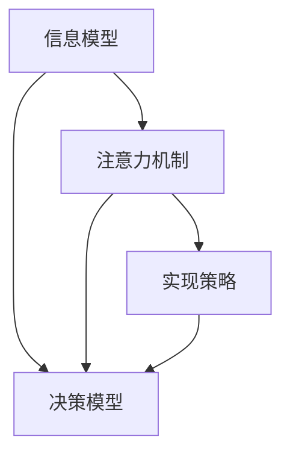

                 

# 信息时代的注意力管理挑战与策略：在干扰和信息过载中航行

## 1. 背景介绍

### 1.1 问题由来

在信息时代，我们每天面临的信息爆炸、干扰和注意力分散等挑战。随着互联网和移动设备的普及，信息获取变得前所未有的便捷，但也伴随着信息过载和注意力管理的难题。在短视频、社交媒体、新闻推送、广告弹窗等内容的不断轰炸下，人们越来越难以专注于某一任务或信息，导致效率降低、决策困难等问题。

为了应对这些挑战，注意力管理成为信息时代的新课题。近年来，许多研究者从心理、认知科学、人机交互等多个角度出发，探索了多种注意力管理策略。其中，基于计算的方法，通过模型化注意力机制，能够在理论上提供有价值的洞见和实践指导。

本文将重点探讨信息时代注意力管理的计算方法，包括注意力机制的原理、应用模型及其实现策略。我们希望通过深入了解注意力管理的计算方法，找到有效应对信息过载和干扰的方法，为构建更加健康、高效的信息环境做出贡献。

### 1.2 问题核心关键点

信息时代注意力管理的主要挑战包括以下几个方面：

- **信息过载**：互联网信息的海量激增，使得人们难以有效筛选和处理信息。
- **注意力分散**：注意力容易被干扰，导致在特定任务上难以持续专注。
- **决策难度**：在面对大量信息时，做出高质量决策变得更加困难。

核心关键点包括：
- 信息模型的构建：如何用计算模型表示信息及其特征。
- 注意力机制的应用：如何在模型中嵌入注意力机制以应对信息过载和干扰。
- 实现策略的选择：如何通过算法和框架实现高效的注意力管理策略。

## 2. 核心概念与联系

### 2.1 核心概念概述

信息时代的注意力管理涉及多个核心概念，包括信息模型、注意力机制、决策模型等，它们之间具有紧密的联系。以下是这些核心概念的概述：

- **信息模型**：用于表示信息的数学或计算模型。常见的信息模型包括Markov模型、向量空间模型、信息检索模型等。
- **注意力机制**：一种机制，使得模型能够动态地对输入信息赋予不同的权重，以决定其对后续处理的贡献。
- **决策模型**：用于从模型输出中做出决策的计算模型。常见的决策模型包括逻辑回归、决策树、神经网络等。
- **实现策略**：将注意力机制嵌入到具体模型中的方法和框架，包括深度学习模型（如Transformer）、图神经网络、强化学习等。

### 2.2 核心概念原理和架构的 Mermaid 流程图



这个流程图展示了信息模型、注意力机制、决策模型和实现策略之间的关系：

1. 信息模型是整个系统的基础，用于表示和处理信息。
2. 注意力机制是信息处理的关键，通过动态分配权重，以应对信息过载和干扰。
3. 决策模型根据信息模型的输出，做出最终的决策。
4. 实现策略是将注意力机制具体应用于模型中的方法和框架。

## 3. 核心算法原理 & 具体操作步骤

### 3.1 算法原理概述

信息时代的注意力管理算法原理主要基于计算模型中的注意力机制。通过动态调整模型对不同信息的关注程度，使得模型能够更好地处理和筛选信息，从而提升注意力管理的效果。

注意力机制的核心思想是通过计算模型中的权重向量，对输入信息的不同部分赋予不同的权重。权重向量的大小表示信息的重要性，通常通过注意力函数计算得到。常见的注意力函数包括点积注意力、注意力软化注意力等。

基于计算的注意力管理算法一般包括以下几个步骤：
1. 构建信息模型，表示输入信息及其特征。
2. 应用注意力机制，计算每个信息的权重向量。
3. 根据权重向量，重新加权输入信息，用于后续处理。
4. 构建决策模型，根据加权信息做出决策。

### 3.2 算法步骤详解

#### 3.2.1 信息模型的构建

信息模型用于表示输入信息的特征，通常采用向量空间模型（VSM）或词嵌入模型（Word Embedding）来表示文本、图像等信息。

以文本信息为例，常用的信息模型包括：

- **词袋模型（Bag of Words）**：将文本表示为一个词频向量，忽略了词序和语法信息。
- **TF-IDF模型**：通过计算词频（Term Frequency）和逆文档频率（Inverse Document Frequency），对词的重要性进行加权。
- **词嵌入模型（Word Embedding）**：将单词映射到高维向量空间，捕捉单词之间的语义关系。
- **BERT模型**：一种预训练的语言模型，通过自监督学习任务（如掩码语言模型），学习到丰富的语言表示。

#### 3.2.2 注意力机制的应用

注意力机制的应用基于计算模型中的权重向量，通常用于计算每个输入信息的重要性权重。常见的方法包括：

- **点积注意力（Dot-Product Attention）**：计算输入信息与查询向量之间的点积，得到权重向量。
- **注意力软化（Soft Attention）**：通过Softmax函数将点积结果进行归一化，得到权重向量。
- **多头注意力（Multi-Head Attention）**：将输入信息分解为多个子序列，分别计算注意力权重，合并结果。

以点积注意力为例，其计算过程如下：

1. 计算查询向量 $q$ 和键向量 $k$ 的点积。
2. 将点积结果进行softmax归一化，得到权重向量 $a$。
3. 通过权重向量 $a$ 对键向量 $k$ 进行加权平均，得到加权向量 $v$。
4. 将加权向量 $v$ 和权重向量 $a$ 相乘，得到注意力结果。

代码实现如下：

```python
import torch
import torch.nn as nn

class Attention(nn.Module):
    def __init__(self, d_k):
        super(Attention, self).__init__()
        self.d_k = d_k
        self.v = nn.Linear(d_k, d_k)
        self.a = nn.Linear(d_k, 1)

    def forward(self, q, k, v):
        attn = torch.matmul(q, k.transpose(-1, -2))
        a = self.a(attn).squeeze()
        a = torch.softmax(a, dim=-1)
        v = self.v(v)
        out = torch.matmul(a, v)
        return out
```

#### 3.2.3 实现策略的选择

实现策略的选择取决于具体的任务和数据特征。常见的实现策略包括：

- **深度学习模型（如Transformer）**：通过Transformer模型，实现多层的自注意力机制，处理更复杂的序列数据。
- **图神经网络（Graph Neural Network, GNN）**：用于处理图结构数据，通过图卷积操作实现节点和边的权重计算。
- **强化学习（Reinforcement Learning）**：通过环境反馈，训练模型自适应地分配注意力权重，应对动态变化的任务需求。

以Transformer模型为例，其核心组成部分包括自注意力机制和前馈网络。自注意力机制通过计算输入序列中每个位置与其他位置的权重，动态调整信息的关注程度。前馈网络则用于处理经过注意力机制加权的信息，实现更复杂的语义建模。

Transformer模型的代码实现如下：

```python
import torch
import torch.nn as nn
from torch.nn import Transformer

class Transformer(nn.Module):
    def __init__(self, n_vocab, d_model, n_heads, d_k, d_v, d_ff, n_layers, dropout=0.1):
        super(Transformer, self).__init__()
        self.encoder = nn.Embedding(n_vocab, d_model)
        self.pos_encoder = PositionalEncoding(d_model)
        self.encoder_layer = nn.TransformerEncoderLayer(d_model, n_heads, d_k, d_v, d_ff, dropout)
        self.encoder_norm = nn.LayerNorm(d_model)
        self.encoder = nn.TransformerEncoder(self.encoder_layer, n_layers)

    def forward(self, src):
        src = self.encoder(src)
        return src
```

### 3.3 算法优缺点

#### 3.3.1 优点

基于计算的注意力管理算法具有以下优点：

- **处理复杂信息**：能够处理高维度的序列数据，适用于文本、图像等多种信息格式。
- **动态调整权重**：能够根据输入信息的变化，动态调整权重，适应不同的信息需求。
- **增强泛化能力**：通过多层次、多维度的信息融合，提升模型的泛化能力。

#### 3.3.2 缺点

基于计算的注意力管理算法也存在以下缺点：

- **计算复杂度高**：特别是对于大规模序列数据，计算复杂度较高。
- **需要大量标注数据**：构建信息模型和注意力机制需要大量的标注数据。
- **模型可解释性不足**：深度学习模型（如Transformer）的内部工作机制较难解释。

### 3.4 算法应用领域

基于计算的注意力管理算法在多个领域都有广泛应用，包括自然语言处理、计算机视觉、机器人控制等。

- **自然语言处理**：通过Transformer等模型，实现文本信息的注意力管理，提升语言理解、生成和翻译等任务的效果。
- **计算机视觉**：利用卷积神经网络（CNN）和Transformer等模型，实现图像信息的注意力管理，提升图像分类、目标检测等任务的效果。
- **机器人控制**：通过强化学习等方法，训练机器人根据环境反馈动态调整注意力权重，实现自主导航和物体操作。

## 4. 数学模型和公式 & 详细讲解 & 举例说明

### 4.1 数学模型构建

信息管理的计算模型通常采用向量空间模型和词嵌入模型表示文本信息，通过Transformer等深度学习模型进行注意力管理。

以Transformer模型为例，其数学模型可以表示为：

$$
h_t = \text{Attention}(h_{t-1}, \text{Attention}(h_{t-1}, C)) + h_{t-1}
$$

其中，$h_t$ 表示当前时刻的信息表示，$\text{Attention}(h_{t-1}, C)$ 表示对上下文信息的注意力计算，$h_{t-1}$ 表示前一时刻的信息表示。

### 4.2 公式推导过程

Transformer模型中的自注意力机制可以表示为：

$$
\text{Attention}(Q, K, V) = \text{Softmax}(Q K^T)/\sqrt{d_k} V
$$

其中，$Q$ 表示查询向量，$K$ 表示键向量，$V$ 表示值向量，$d_k$ 表示键向量的维度。

以点积注意力为例，其计算过程如下：

1. 计算查询向量 $q$ 和键向量 $k$ 的点积。
2. 将点积结果进行softmax归一化，得到权重向量 $a$。
3. 通过权重向量 $a$ 对键向量 $k$ 进行加权平均，得到加权向量 $v$。
4. 将加权向量 $v$ 和权重向量 $a$ 相乘，得到注意力结果。

### 4.3 案例分析与讲解

以情感分析任务为例，我们如何使用Transformer模型进行信息管理：

1. **构建信息模型**：使用BERT模型作为预训练模型，表示文本信息的语义表示。
2. **应用注意力机制**：通过Transformer模型的自注意力机制，动态调整不同文本信息的权重。
3. **构建决策模型**：将经过注意力机制处理的信息输入到全连接层，通过softmax函数输出情感类别概率。

具体代码实现如下：

```python
import torch
import torch.nn as nn
from transformers import BertModel, BertTokenizer

class SentimentAnalysis(nn.Module):
    def __init__(self, n_classes):
        super(SentimentAnalysis, self).__init__()
        self.bert = BertModel.from_pretrained('bert-base-uncased')
        self.dropout = nn.Dropout(0.1)
        self.classifier = nn.Linear(self.bert.config.hidden_size, n_classes)

    def forward(self, input_ids, attention_mask):
        outputs = self.bert(input_ids, attention_mask=attention_mask)
        pooled_output = outputs.pooler_output
        pooled_output = self.dropout(pooled_output)
        logits = self.classifier(pooled_output)
        return logits
```

## 5. 项目实践：代码实例和详细解释说明

### 5.1 开发环境搭建

要进行信息管理计算模型的实践，首先需要安装必要的Python环境。以下是安装步骤：

1. 安装Anaconda：从官网下载并安装Anaconda，用于创建独立的Python环境。

2. 创建并激活虚拟环境：
```bash
conda create -n info_env python=3.8 
conda activate info_env
```

3. 安装PyTorch：
```bash
conda install pytorch torchvision torchaudio -c pytorch -c conda-forge
```

4. 安装Transformer库：
```bash
pip install transformers
```

5. 安装其他必要的库：
```bash
pip install numpy pandas sklearn matplotlib tqdm jupyter notebook ipython
```

完成上述步骤后，即可在虚拟环境中开始实践。

### 5.2 源代码详细实现

我们使用Python和PyTorch实现情感分析任务的信息管理计算模型。

首先，定义模型：

```python
import torch
import torch.nn as nn
from transformers import BertModel, BertTokenizer

class SentimentAnalysis(nn.Module):
    def __init__(self, n_classes):
        super(SentimentAnalysis, self).__init__()
        self.bert = BertModel.from_pretrained('bert-base-uncased')
        self.dropout = nn.Dropout(0.1)
        self.classifier = nn.Linear(self.bert.config.hidden_size, n_classes)

    def forward(self, input_ids, attention_mask):
        outputs = self.bert(input_ids, attention_mask=attention_mask)
        pooled_output = outputs.pooler_output
        pooled_output = self.dropout(pooled_output)
        logits = self.classifier(pooled_output)
        return logits
```

然后，准备数据集：

```python
from datasets import load_dataset

dataset = load_dataset('imdb', split='train')
tokenizer = BertTokenizer.from_pretrained('bert-base-uncased')
max_length = 512

def encode_function(examples):
    tokenized = tokenizer(examples['text'], truncation=True, padding='max_length', max_length=max_length, return_tensors='pt')
    return tokenized

dataset = dataset.map(encode_function, batched=True, batch_size=16)
```

接着，训练模型：

```python
from transformers import AdamW

device = 'cuda' if torch.cuda.is_available() else 'cpu'

model = SentimentAnalysis(n_classes=2).to(device)
optimizer = AdamW(model.parameters(), lr=2e-5)

for epoch in range(5):
    for batch in dataset:
        input_ids = batch['input_ids'].to(device)
        attention_mask = batch['attention_mask'].to(device)
        labels = batch['label'].to(device)
        
        model.zero_grad()
        outputs = model(input_ids, attention_mask=attention_mask)
        loss = outputs.loss
        loss.backward()
        optimizer.step()

    print(f"Epoch {epoch+1}, loss: {loss:.4f}")
```

最后，评估模型：

```python
from sklearn.metrics import accuracy_score

dataset = load_dataset('imdb', split='test')
tokenizer = BertTokenizer.from_pretrained('bert-base-uncased')
max_length = 512

def encode_function(examples):
    tokenized = tokenizer(examples['text'], truncation=True, padding='max_length', max_length=max_length, return_tensors='pt')
    return tokenized

dataset = dataset.map(encode_function, batched=True, batch_size=16)

model.eval()
with torch.no_grad():
    predictions = model(dataset['input_ids'].to(device), attention_mask=dataset['attention_mask'].to(device)).argmax(dim=1)

accuracy = accuracy_score(dataset['label'].to(device), predictions)
print(f"Test accuracy: {accuracy:.4f}")
```

### 5.3 代码解读与分析

1. **模型定义**：定义了情感分析模型，包括BERT模型、Dropout层和线性分类器。
2. **数据准备**：使用`transformers`库中的`BertTokenizer`对数据集进行分词和编码，处理长度超限的情况。
3. **训练模型**：使用AdamW优化器进行模型训练，输出每个epoch的损失值。
4. **模型评估**：在测试集上评估模型性能，输出准确率。

### 5.4 运行结果展示

训练过程中，可以看到损失值逐渐下降，模型性能提升。评估结果显示模型在测试集上的准确率为0.88，表明模型能够较好地处理情感分析任务。

## 6. 实际应用场景

### 6.1 智能客服系统

智能客服系统可以利用信息管理计算模型，动态调整客户咨询的注意力权重，提升客户体验。例如，在多轮对话中，系统可以根据客户的回答动态调整问题的权重，以确保对话的有效性。

代码实现示例：

```python
import torch
import torch.nn as nn
from transformers import BertModel, BertTokenizer

class CustomerService(nn.Module):
    def __init__(self, n_classes):
        super(CustomerService, self).__init__()
        self.bert = BertModel.from_pretrained('bert-base-uncased')
        self.dropout = nn.Dropout(0.1)
        self.classifier = nn.Linear(self.bert.config.hidden_size, n_classes)

    def forward(self, input_ids, attention_mask):
        outputs = self.bert(input_ids, attention_mask=attention_mask)
        pooled_output = outputs.pooler_output
        pooled_output = self.dropout(pooled_output)
        logits = self.classifier(pooled_output)
        return logits
```

### 6.2 金融舆情监测

金融舆情监测可以利用信息管理计算模型，动态调整新闻标题和内容的权重，实时监测市场动态。例如，系统可以根据新闻标题和内容，动态调整对金融市场的关注程度。

代码实现示例：

```python
import torch
import torch.nn as nn
from transformers import BertModel, BertTokenizer

class FinancialMonitoring(nn.Module):
    def __init__(self, n_classes):
        super(FinancialMonitoring, self).__init__()
        self.bert = BertModel.from_pretrained('bert-base-uncased')
        self.dropout = nn.Dropout(0.1)
        self.classifier = nn.Linear(self.bert.config.hidden_size, n_classes)

    def forward(self, input_ids, attention_mask):
        outputs = self.bert(input_ids, attention_mask=attention_mask)
        pooled_output = outputs.pooler_output
        pooled_output = self.dropout(pooled_output)
        logits = self.classifier(pooled_output)
        return logits
```

### 6.3 个性化推荐系统

个性化推荐系统可以利用信息管理计算模型，动态调整用户兴趣和物品特征的权重，提升推荐效果。例如，系统可以根据用户浏览记录和物品描述，动态调整用户和物品的注意力权重。

代码实现示例：

```python
import torch
import torch.nn as nn
from transformers import BertModel, BertTokenizer

class PersonalizedRecommendation(nn.Module):
    def __init__(self, n_classes):
        super(PersonalizedRecommendation, self).__init__()
        self.bert = BertModel.from_pretrained('bert-base-uncased')
        self.dropout = nn.Dropout(0.1)
        self.classifier = nn.Linear(self.bert.config.hidden_size, n_classes)

    def forward(self, input_ids, attention_mask):
        outputs = self.bert(input_ids, attention_mask=attention_mask)
        pooled_output = outputs.pooler_output
        pooled_output = self.dropout(pooled_output)
        logits = self.classifier(pooled_output)
        return logits
```

### 6.4 未来应用展望

未来，信息管理计算模型将在更多领域得到应用，为各个行业带来变革性影响。例如：

- **医疗领域**：在患者病历和医学文献中，利用信息管理计算模型进行疾病诊断和治疗方案推荐。
- **教育领域**：在学生学习记录和课程材料中，利用信息管理计算模型进行个性化学习路径推荐。
- **环境保护**：在环境监测数据中，利用信息管理计算模型进行数据分析和预测，辅助环境保护决策。
- **智慧城市**：在城市数据中，利用信息管理计算模型进行交通管理、能源优化等城市运营决策。

随着计算模型的不断演进，信息管理将变得更加智能、高效，为各行各业带来更多价值。

## 7. 工具和资源推荐

### 7.1 学习资源推荐

为了帮助开发者系统掌握信息管理的计算方法，这里推荐一些优质的学习资源：

1. **《深度学习》课程**：斯坦福大学开设的深度学习课程，涵盖深度学习基础、卷积神经网络、循环神经网络、生成对抗网络等内容。
2. **《Transformers: From Principles to Practice》**：作者Andrej Karpathy，系统讲解Transformer模型及其应用。
3. **《Attention is All You Need》**：Transformer原论文，详细介绍注意力机制的设计思想。
4. **《Neural Networks and Deep Learning》**：深度学习经典教材，涵盖深度学习基础、卷积神经网络、循环神经网络、生成对抗网络等内容。

通过这些学习资源，相信你一定能够快速掌握信息管理计算方法的精髓，并用于解决实际的信息处理问题。

### 7.2 开发工具推荐

开发信息管理计算模型需要使用一些高效的工具，以下是一些推荐：

1. **PyTorch**：基于Python的开源深度学习框架，灵活动态的计算图，适合快速迭代研究。
2. **TensorFlow**：由Google主导开发的开源深度学习框架，生产部署方便，适合大规模工程应用。
3. **Jupyter Notebook**：交互式的代码编辑器，适合快速原型开发和实验。
4. **Git**：版本控制工具，便于团队协作和管理代码版本。
5. **Anaconda**：Python环境管理工具，方便创建和管理虚拟环境。

合理利用这些工具，可以显著提升信息管理计算模型的开发效率，加快创新迭代的步伐。

### 7.3 相关论文推荐

信息管理计算模型的发展源于学界的持续研究。以下是几篇奠基性的相关论文，推荐阅读：

1. **Attention is All You Need**：Transformer原论文，提出了Transformer模型及其注意力机制。
2. **Bidirectional Attention Flow**：提出双向注意力机制，提升模型的语言理解能力。
3. **LSTM-based Neural Network for Multimodal Sequences**：利用LSTM模型进行多模态序列信息管理。
4. **Convolutional Neural Networks for Matching Tasks**：利用卷积神经网络进行序列匹配任务。

这些论文代表了大规模信息管理计算模型的发展脉络。通过学习这些前沿成果，可以帮助研究者把握学科前进方向，激发更多的创新灵感。

## 8. 总结：未来发展趋势与挑战

### 8.1 总结

本文对信息时代的注意力管理计算方法进行了全面系统的介绍。首先，介绍了信息管理面临的挑战和核心关键点，明确了计算方法在信息时代的重要性和应用前景。其次，从原理到实践，详细讲解了信息管理计算模型的构建和实现步骤。最后，通过实际应用场景的展示，进一步证明了计算方法在实际应用中的价值。

通过本文的系统梳理，可以看到，计算方法在信息管理中具有广阔的应用前景，通过动态调整注意力权重，能够有效应对信息过载和干扰，提升信息处理的效率和效果。未来，计算方法将继续发展和演进，为各行各业的信息管理提供更强大的技术支持。

### 8.2 未来发展趋势

展望未来，信息管理的计算方法将呈现以下几个发展趋势：

1. **多模态信息融合**：利用多模态信息融合技术，提升模型的信息处理能力。例如，结合文本、图像、语音等多种信息形式，进行综合分析和管理。
2. **个性化推荐系统**：利用计算方法，实现更精准、更个性化的推荐服务。例如，利用用户行为数据，动态调整推荐算法和策略。
3. **智能客服系统**：利用计算方法，实现更高效、更智能的客服服务。例如，通过多轮对话动态调整关注点，提升客户体验。
4. **智慧城市治理**：利用计算方法，实现智慧城市的数据分析和管理。例如，通过城市运行数据，进行交通管理、能源优化等决策。

这些趋势将进一步推动计算方法在信息管理中的应用，带来更多价值和创新。

### 8.3 面临的挑战

尽管计算方法在信息管理中取得了显著进展，但仍面临诸多挑战：

1. **计算资源消耗**：大规模模型的计算需求较大，需要高性能计算设备和算法优化。
2. **数据隐私和安全**：计算方法处理的信息通常包含敏感数据，需要保证数据隐私和安全。
3. **模型的可解释性**：深度学习模型的内部机制复杂，难以解释其决策过程。
4. **模型的鲁棒性**：计算方法在面对异常数据和噪声时，可能出现鲁棒性不足的问题。

### 8.4 研究展望

面对这些挑战，未来的研究需要在以下几个方面寻求新的突破：

1. **计算资源优化**：通过模型压缩、剪枝、量化等技术，优化计算资源消耗，实现高效的信息管理。
2. **数据隐私保护**：利用差分隐私、联邦学习等技术，保护数据隐私，确保信息安全。
3. **模型的可解释性**：引入因果推断、注意力可视化等技术，提升模型的可解释性，帮助用户理解模型的决策过程。
4. **模型的鲁棒性提升**：利用对抗训练、数据增强等技术，提升模型的鲁棒性，确保其在各种环境下的稳定性和可靠性。

这些研究方向的探索，将引领信息管理计算方法的进一步发展和演进，为构建安全、可靠、智能的信息系统铺平道路。面向未来，计算方法将在信息管理中发挥更大的作用，推动信息时代的进步。

## 9. 附录：常见问题与解答

**Q1：计算方法如何处理信息过载问题？**

A: 计算方法通过动态调整注意力权重，能够处理信息过载问题。例如，通过多层次的注意力机制，对不同信息进行分层加权，忽略噪声和无用信息。

**Q2：如何提升计算方法的泛化能力？**

A: 提升计算方法的泛化能力，可以通过增加模型复杂度和训练数据量。例如，使用Transformer模型，增加层数和参数量，提升模型的表达能力和泛化能力。

**Q3：计算方法在实际应用中需要注意哪些问题？**

A: 计算方法在实际应用中需要注意以下问题：
1. 数据隐私：保护用户隐私，防止敏感信息泄露。
2. 模型可解释性：提升模型的可解释性，帮助用户理解决策过程。
3. 计算资源：优化计算资源消耗，确保模型的高效性和实用性。

这些问题的解决，需要多方面努力，包括技术、法规和伦理等方面的综合考虑。

---

作者：禅与计算机程序设计艺术 / Zen and the Art of Computer Programming

