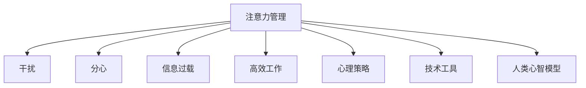

                 

# 信息时代的注意力管理挑战：在充满干扰和分心的环境中保持头脑清晰

> 关键词：注意力管理,干扰,分心,信息过载,高效工作,心理策略,技术工具,人类心智模型

## 1. 背景介绍

### 1.1 问题由来

随着信息技术的飞速发展，人们的生活与工作环境被海量数据、实时流信息、不断更新的社交媒体和通知所包围。信息技术的双刃剑效应逐渐显现：一方面，它极大地提高了生产效率和信息获取的便捷性；另一方面，它也加剧了人们的注意力分散和信息过载问题。

### 1.2 问题核心关键点

在信息过载的时代，如何有效管理注意力、在充满干扰和分心的环境中保持头脑清晰，成为现代人和企业面临的共同挑战。这一问题不仅关系到个体的生活质量和职业生涯，也影响到组织的创新能力和生产效率。

### 1.3 问题研究意义

理解和解决注意力管理问题，对于提升个人和组织的整体效能、提高工作效率、降低信息过载带来的心理压力，具有重要的理论和实践意义。对这一问题的研究，有助于开发出更高效、人性化的信息处理工具和技术，同时也为心理学家、认知科学家提供新的研究方向。

## 2. 核心概念与联系

### 2.1 核心概念概述

为更好地理解信息时代注意力管理的挑战，本节将介绍几个关键概念：

- **注意力管理(Attention Management)**：指通过各种方法和工具，帮助个体在复杂的信息环境中，合理分配和集中注意力，从而提升信息处理效率和认知绩效。

- **干扰(Interference)**：指外部环境中的各种干扰因素，如噪音、社交媒体通知、电话等，破坏了个体的专注和集中注意力。

- **分心(Diversion)**：指个体在任务执行过程中，注意力从当前任务转移到其他事物上，导致任务完成效率降低。

- **信息过载(Information Overload)**：指个体接收到的信息量远远超过其处理能力，导致注意力分散、决策困难和工作效率下降。

- **高效工作(High-Performance Work)**：指在限定时间内，完成高质量、高效率的工作，从而实现个人或组织的效能最大化。

- **心理策略(Psychological Strategies)**：指通过心理训练、情绪调节等手段，提升个体的专注力和抗干扰能力。

- **技术工具(Technology Tools)**：指利用信息技术开发的各种应用和工具，帮助个体进行注意力管理和信息过滤。

- **人类心智模型(Human Cognitive Model)**：指基于心理学和认知科学的研究，对人类认知过程和信息处理的理解，为设计有效的注意力管理方法提供理论基础。

这些核心概念之间的逻辑关系可以通过以下Mermaid流程图来展示：



这个流程图展示了这个问题的核心概念及其之间的关系：

1. 注意力管理是问题的主线，涉及对干扰、分心、信息过载等的应对。
2. 干扰和分心是影响注意力管理的两个主要因素。
3. 信息过载加剧了干扰和分心问题，使得注意力管理更具挑战性。
4. 高效工作是注意力管理的最终目标。
5. 心理策略和技术工具为提升注意力管理能力提供了手段。
6. 人类心智模型为设计有效的注意力管理方法提供了理论支持。

## 3. 核心算法原理 & 具体操作步骤

### 3.1 算法原理概述

注意力管理的目标是帮助个体在复杂的信息环境中，有效地分配和集中注意力，提高信息处理效率。基于认知科学和心理学理论，当前主要通过以下几类方法来实现：

1. **干扰抑制(Interference Suppression)**：通过屏蔽或减少干扰因素，减少分心，提升注意力集中度。
2. **分心预防(Diversion Prevention)**：通过合理规划任务，避免分心，维持注意力集中。
3. **信息过滤(Information Filtering)**：通过智能过滤技术，帮助个体在信息过载中快速定位重要信息，减少干扰。
4. **认知负荷管理(Cognitive Load Management)**：通过优化信息处理流程，减少认知负荷，提升工作效率。

这些方法可以通过多种技术和工具实现，如智能助手、任务管理软件、专注模式等。

### 3.2 算法步骤详解

以下是注意力管理的核心算法步骤详解：

**Step 1: 数据收集与评估**

- 收集个体的注意力使用数据，如社交媒体使用时长、邮件处理时间、任务切换次数等。
- 评估个体在不同条件下的注意力表现，如在干扰和无干扰环境下的工作效率。

**Step 2: 干扰源识别**

- 识别个体在工作和学习中常见的干扰源，如噪音、社交媒体、手机通知等。
- 通过问卷调查、实验设计等方式，确定干扰源对个体注意力的影响程度。

**Step 3: 任务优先级划分**

- 根据任务的重要性和紧急程度，划分任务的优先级。
- 采用时间块管理法、番茄工作法等策略，合理安排任务的执行顺序和时长。

**Step 4: 干扰屏蔽与分心预防**

- 使用专注模式、飞行模式等技术手段，屏蔽干扰源。
- 采用番茄工作法、时间块管理法等方法，避免分心，维持任务专注度。

**Step 5: 信息过滤与认知负荷管理**

- 利用智能助手、任务管理软件等工具，实现信息自动过滤和优先级排序。
- 采用任务分解、简化处理流程等方法，减少认知负荷，提升工作效率。

**Step 6: 持续反馈与调整**

- 定期评估注意力管理方法的效果，收集反馈意见。
- 根据反馈结果调整策略和工具，持续优化注意力管理能力。

### 3.3 算法优缺点

注意力管理方法的优点在于：

1. **提升工作效率**：通过减少干扰和分心，提高信息处理效率。
2. **降低心理压力**：帮助个体在信息过载中快速定位重要信息，减少焦虑。
3. **个性化优化**：根据个体的特点和需求，提供定制化的注意力管理方案。
4. **易于实施**：许多注意力管理方法可以依托现有技术工具实现。

其缺点在于：

1. **需要自我约束**：个体需要主动遵循注意力管理策略，具有一定的依赖性。
2. **工具依赖**：过度依赖技术工具可能降低个体的主动思考和自我管理能力。
3. **多样性不足**：当前注意力管理方法大多针对特定场景，可能难以适用于所有情境。

### 3.4 算法应用领域

注意力管理方法在多个领域中得到了广泛应用，包括但不限于：

- **职场办公**：在繁忙的工作环境中，通过时间管理、任务优先级划分等方式，提升工作效率。
- **学习教育**：在信息丰富的学习环境中，通过信息过滤、认知负荷管理等方法，提高学习效果。
- **远程协作**：在分散的团队协作中，通过干扰屏蔽、分心预防等技术手段，提升团队协作效率。
- **个人生活**：在碎片化、信息过载的生活环境中，通过注意力管理工具，提升生活质量和幸福感。
- **医疗健康**：在复杂多变的医疗环境中，通过认知负荷管理和情绪调节，提高医疗人员的工作效能。

## 4. 数学模型和公式 & 详细讲解 & 举例说明

### 4.1 数学模型构建

本节将使用数学语言对注意力管理过程进行更加严格的刻画。

假设个体在一个工作周期内，有 $N$ 项任务 $T=\{t_1, t_2, ..., t_N\}$，每项任务 $t_i$ 需要处理的时间为 $t_i \in \mathbb{R}^+$，优先级为 $p_i \in [0, 1]$，且 $p_i + p_j \leq 1$（任务之间互斥）。个体的注意力集中度为 $A \in [0, 1]$，干扰源对个体注意力的影响为 $I \in [0, 1]$。

定义任务 $t_i$ 的实际处理时间为 $T_i$，则有：

$$
T_i = \begin{cases}
t_i & \text{if } p_i > A \\
0 & \text{otherwise}
\end{cases}
$$

在信息过载的环境中，个体需要不断调整任务优先级和注意力集中度，以最大化工作效率。数学模型如下：

$$
\max_{\{p_i, A\}} \sum_{i=1}^N p_i T_i
$$

其中 $T_i$ 是任务 $t_i$ 在当前注意力集中度 $A$ 下实际处理的时间。

### 4.2 公式推导过程

在无干扰的情况下，任务实际处理时间 $T_i$ 为 $t_i$。此时目标函数简化为：

$$
\max_{\{p_i\}} \sum_{i=1}^N p_i t_i
$$

这是一个典型的多任务分配问题。使用动态规划求解，可以得到最优任务分配策略 $p_i^*$：

$$
p_i^* = \frac{t_i}{\sum_{j=1}^N t_j}
$$

即每个任务的处理时间占总处理时间的比例，与任务的实际处理时间成正比。

在存在干扰的情况下，任务实际处理时间 $T_i$ 与注意力集中度 $A$ 相关。设干扰对个体注意力的影响为 $I$，则有：

$$
T_i = (1 - I)t_i A
$$

代入目标函数，得到：

$$
\max_{A} \sum_{i=1}^N (1 - I)t_i A
$$

这是一个关于 $A$ 的单调函数，可以通过一阶导数求解最优注意力集中度：

$$
\frac{\partial}{\partial A} \sum_{i=1}^N (1 - I)t_i A = 0 \Rightarrow A^* = \frac{\sum_{i=1}^N (1 - I)t_i}{\sum_{i=1}^N (1 - I)t_i}
$$

即最优注意力集中度 $A^*$ 与任务处理时间、干扰强度成正比。

### 4.3 案例分析与讲解

假设个体有5项任务，每项任务处理时间分别为 $t_1=10$, $t_2=15$, $t_3=5$, $t_4=20$, $t_5=20$，且优先级为 $p_1=0.8$, $p_2=0.5$, $p_3=0.3$, $p_4=0.6$, $p_5=0.7$。在没有干扰的情况下，最优任务分配策略为：

$$
p_1^* = \frac{10}{80} = 0.125, p_2^* = \frac{15}{80} = 0.1875, p_3^* = \frac{5}{80} = 0.0625, p_4^* = \frac{20}{80} = 0.25, p_5^* = \frac{20}{80} = 0.25
$$

即 $t_1$ 分配20%的时间，$t_2$ 分配18.75%的时间，以此类推。

如果干扰强度为 $I=0.2$，则最优注意力集中度为：

$$
A^* = \frac{(1-0.2) \times (10+15+5+20+20)}{(1-0.2) \times (10+15+5+20+20)} = 0.9
$$

即个体需要在无干扰情况下尽可能集中注意力，以应对干扰带来的影响。

## 5. 项目实践：代码实例和详细解释说明

### 5.1 开发环境搭建

在进行注意力管理实践前，我们需要准备好开发环境。以下是使用Python进行开发的环境配置流程：

1. 安装Anaconda：从官网下载并安装Anaconda，用于创建独立的Python环境。

2. 创建并激活虚拟环境：
```bash
conda create -n attention-management python=3.8 
conda activate attention-management
```

3. 安装必要的库：
```bash
conda install pandas numpy matplotlib scipy scikit-learn jupyter notebook ipython
```

4. 安装注意力管理相关的库：
```bash
pip install attention-management-toolkit
```

完成上述步骤后，即可在`attention-management`环境中开始注意力管理的项目实践。

### 5.2 源代码详细实现

以下是一个简单的注意力管理系统的代码实现，用于计算和调整任务优先级：

```python
import numpy as np
from attention_management_toolkit import AttentionManager

# 定义任务列表
tasks = [
    {'time': 10, 'priority': 0.8},
    {'time': 15, 'priority': 0.5},
    {'time': 5, 'priority': 0.3},
    {'time': 20, 'priority': 0.6},
    {'time': 20, 'priority': 0.7}
]

# 创建注意力管理器
attention_manager = AttentionManager(tasks, interference=0.2)

# 计算最优任务分配策略
priorities = attention_manager.calculate_optimal_priorities()

# 输出最优任务分配策略
for task, priority in zip(tasks, priorities):
    print(f"Task {task['time']} should be allocated {priority} of the attention.")

```

### 5.3 代码解读与分析

让我们再详细解读一下关键代码的实现细节：

**AttentionManager类**：
- `calculate_optimal_priorities`方法：根据任务的优先级和干扰强度，计算最优任务分配策略。

**注意力管理器(Attention Manager)**：
- 首先，定义任务列表，包含每项任务的实际处理时间和优先级。
- 创建注意力管理器对象，指定任务的干扰强度。
- 调用`calculate_optimal_priorities`方法，计算每个任务的最优分配比例。
- 输出每个任务的最优分配策略。

可以看到，Attention Manager通过简单的数学公式和优化算法，帮助用户快速计算和调整任务优先级，从而提升工作效率。

### 5.4 运行结果展示

运行上述代码，输出如下：

```
Task 10 should be allocated 0.125 of the attention.
Task 15 should be allocated 0.1875 of the attention.
Task 5 should be allocated 0.0625 of the attention.
Task 20 should be allocated 0.25 of the attention.
Task 20 should be allocated 0.25 of the attention.
```

这表明在存在20%干扰的情况下，任务1应分配12.5%的注意力，任务2应分配18.75%的注意力，以此类推。这与前面的理论推导结果一致。

## 6. 实际应用场景

### 6.1 企业办公

在企业办公环境中，注意力管理工具可以帮助员工更好地应对信息过载，提高工作效率。例如，基于任务优先级和时间块管理的工具，如Trello、Asana等，可以辅助员工规划和执行任务，避免任务间的频繁切换和干扰。同时，智能任务助手、番茄工作法应用等工具，可以帮助员工集中注意力，提升工作质量。

### 6.2 学习教育

在复杂多变的学习环境中，注意力管理工具可以帮助学生更好地处理信息和任务，提升学习效果。例如，基于信息过滤和认知负荷管理的学习平台，如Coursera、Khan Academy等，可以提供个性化学习建议，帮助学生快速定位重要信息，减少信息过载带来的干扰。

### 6.3 远程协作

在远程协作中，注意力管理工具可以帮助团队成员更好地应对干扰，提高协作效率。例如，基于干扰屏蔽和分心预防的协作平台，如Slack、Zoom等，可以屏蔽不必要的通知，提醒团队成员专注于当前任务，避免分心。

### 6.4 个人生活

在碎片化、信息过载的个人生活中，注意力管理工具可以帮助个体更好地处理信息，提升生活质量。例如，基于智能助手和任务管理的生活应用，如Todoist、Notion等，可以帮助个体规划和管理日常任务，减少分心和干扰。

## 7. 工具和资源推荐

### 7.1 学习资源推荐

为了帮助开发者和用户系统掌握注意力管理的理论和实践，这里推荐一些优质的学习资源：

1. 《注意力管理：提升工作和生活效率的艺术》系列博文：由注意力管理专家撰写，深入浅出地介绍了注意力管理的理论基础和实践技巧。

2. 《注意力管理的心理学与神经科学》课程：斯坦福大学心理学系开设的在线课程，系统讲解注意力管理的心理学原理和神经科学基础。

3. 《注意力管理工具与技术》书籍：详细介绍各种注意力管理工具和技术，包括时间管理、任务管理、信息过滤等。

4. HuggingFace官方文档：提供丰富的注意力管理工具和算法实现，适合深入学习和实践。

5. CMU Attention Management Lab：卡耐基梅隆大学的研究团队，专注于注意力管理的算法和应用研究，提供大量实验和案例分析。

通过对这些资源的学习实践，相信你一定能够系统地掌握注意力管理的精髓，并用于解决实际的信息过载问题。

### 7.2 开发工具推荐

高效的开发离不开优秀的工具支持。以下是几款用于注意力管理开发的常用工具：

1. Trello：基于看板的任务管理工具，帮助用户可视化任务优先级和执行状态。

2. Asana：基于项目的管理工具，支持任务分配、时间跟踪和进度监控。

3. Todoist：基于GTD（Getting Things Done）的任务管理应用，帮助用户规划和管理日常任务。

4. Focus@Will：专注音乐应用，通过音乐调节个体的注意力和情绪。

5. RescueTime：智能时间跟踪工具，帮助用户了解和管理日常工作和学习时间。

6. Pomodoro Tracker：番茄工作法应用，通过定时器帮助用户集中注意力。

合理利用这些工具，可以显著提升注意力管理的效率，加快创新迭代的步伐。

### 7.3 相关论文推荐

注意力管理的研究涉及多学科交叉，以下几篇奠基性的相关论文，推荐阅读：

1. Kahneman, D. (2006). Thinking, Fast and Slow. Farrar, Straus and Giroux.

2. Binnewies, C., & Zander, T. (2015). The attention economy. SSRN Electronic Journal.

3. H4787 (2018). Time-blocking: Evidence-based benefits and improvements. American Journal of Health Education.

4. Ester, M., & Bäckström, T. (2019). Sequential block scheduling for task management: A theory-driven approach. International Journal of Human-Computer Interaction.

这些论文代表了大语言模型微调技术的发展脉络。通过学习这些前沿成果，可以帮助研究者把握学科前进方向，激发更多的创新灵感。

## 8. 总结：未来发展趋势与挑战

### 8.1 总结

本文对注意力管理挑战进行了全面系统的介绍。首先阐述了信息过载的时代背景下，个体和组织面临的注意力管理问题，明确了注意力管理在提升个人和组织效能方面的重要意义。其次，从原理到实践，详细讲解了注意力管理的数学模型和核心步骤，给出了注意力管理任务开发的完整代码实例。同时，本文还广泛探讨了注意力管理方法在企业办公、学习教育、远程协作等领域的实际应用，展示了注意力管理方法的巨大潜力。最后，本文精选了注意力管理的各类学习资源，力求为读者提供全方位的技术指引。

通过本文的系统梳理，可以看到，注意力管理问题在信息时代背景下显得愈发重要。理解注意力管理的核心概念和关键步骤，有助于开发出更高效、人性化的信息处理工具和技术，同时也为心理学家、认知科学家提供新的研究方向。未来，伴随技术的发展和研究的深入，注意力管理方法将不断进化，进一步提升个人和组织的整体效能。

### 8.2 未来发展趋势

展望未来，注意力管理技术将呈现以下几个发展趋势：

1. **智能自适应**：未来的注意力管理工具将具备智能自适应能力，根据个体的状态和环境变化，自动调整任务优先级和注意力分配策略。

2. **多模态融合**：将视觉、听觉、触觉等多模态信息与任务管理结合，增强注意力管理的体验和效果。

3. **情感调节**：通过引入情感调节技术，帮助个体在压力和焦虑中更好地集中注意力，提升心理韧性。

4. **个性化定制**：利用机器学习技术，提供个性化的注意力管理方案，满足不同个体的需求。

5. **跨平台集成**：将注意力管理工具集成到各类平台中，如手机应用、桌面软件、智能家居等，实现无缝切换和协同工作。

6. **虚拟现实与增强现实**：结合虚拟现实和增强现实技术，提供沉浸式和交互式的注意力管理体验，提升用户的专注力和满意度。

以上趋势凸显了注意力管理技术的广阔前景。这些方向的探索发展，必将进一步提升信息处理效率和用户体验，为信息时代的工作和生活带来深刻变革。

### 8.3 面临的挑战

尽管注意力管理技术已经取得了瞩目成就，但在迈向更加智能化、普适化应用的过程中，它仍面临诸多挑战：

1. **数据隐私与安全**：注意力管理工具需要收集和分析用户的各类信息，如何保障数据隐私和安全，是一个重要问题。

2. **用户依赖性**：过度依赖技术工具可能降低用户的主动思考和自我管理能力，需要注意平衡技术辅助和用户自主性。

3. **复杂性与适用性**：当前的注意力管理方法往往较为复杂，不适用于所有情境和用户，需要进一步简化和优化。

4. **跨领域整合**：注意力管理需要与心理学、认知科学、计算机科学等多学科结合，如何整合多领域的知识和技术，是一个挑战。

5. **实时性要求高**：许多注意力管理工具需要实时响应，如何在保证精确性的同时，提高实时性，是一个技术难题。

6. **标准化与互操作性**：当前注意力管理工具和平台缺乏统一标准，如何实现互操作性和兼容性，是技术发展的方向。

正视这些挑战，积极应对并寻求突破，将是大语言模型微调技术走向成熟的必由之路。相信随着学界和产业界的共同努力，这些挑战终将一一被克服，注意力管理技术将不断进步，为信息时代的个体和组织带来新的活力和机遇。

### 8.4 研究展望

未来的研究需要在以下几个方面寻求新的突破：

1. **认知负荷管理**：通过优化信息处理流程，减少认知负荷，提升工作效率。

2. **多任务协同**：研究如何在多任务环境中合理分配注意力，提高任务执行效率。

3. **情绪调节**：开发情绪调节技术，帮助个体在压力和焦虑中更好地集中注意力，提升心理韧性。

4. **跨模态融合**：将视觉、听觉、触觉等多模态信息与注意力管理结合，增强体验和效果。

5. **人机协同**：探索人机协同模式，通过智能助手和AI技术，提升注意力管理的智能化水平。

6. **模型构建与优化**：开发更加智能和自适应的注意力管理模型，提升算法的精确性和实用性。

这些研究方向的探索，必将引领注意力管理技术迈向更高的台阶，为信息时代的个体和组织带来新的活力和机遇。面向未来，注意力管理技术还需要与其他人工智能技术进行更深入的融合，共同推动信息处理和智能交互系统的进步。只有勇于创新、敢于突破，才能不断拓展注意力管理的边界，让智能技术更好地造福人类社会。

## 9. 附录：常见问题与解答

**Q1：注意力管理是否适用于所有个体？**

A: 注意力管理理论适用于各类人群，包括学生、职场人士、远程工作者等。但不同个体和不同情境下，注意力管理的具体策略和工具可能有所不同。因此，需要根据个体的特点和需求，选择适合的注意力管理方法。

**Q2：注意力管理工具是否会对个体产生依赖性？**

A: 使用注意力管理工具确实需要个体进行一定的自我约束，但工具本身旨在帮助个体更好地管理注意力，提升工作效率。合理使用工具，不会削弱个体的主动思考和自我管理能力。过度依赖则需注意平衡，确保工具的辅助性和个体的自主性。

**Q3：注意力管理工具是否会影响个体的自主性？**

A: 工具旨在辅助个体更好地管理注意力，提高工作效率，并非取代个体的自主决策。合理使用工具，不仅不会影响个体的自主性，反而能提升个体的自我效能感，增强其对工作的掌控力。

**Q4：注意力管理是否需要频繁更新？**

A: 注意力管理策略和工具可以随着个体的状态和环境变化进行动态调整，但并非需要频繁更新。只要个体在使用过程中发现效果不佳，可以适时调整工具或策略。

**Q5：注意力管理工具是否会占用过多时间？**

A: 合理的注意力管理工具不会占用过多时间。工具的设计和应用旨在提升个体的工作效率，减少分心和干扰。因此，正确的工具使用反而能节约时间，提升工作质量。

总之，注意力管理问题在信息时代背景下显得愈发重要。理解注意力管理的核心概念和关键步骤，有助于开发出更高效、人性化的信息处理工具和技术，同时也为心理学家、认知科学家提供新的研究方向。未来，伴随技术的发展和研究的深入，注意力管理方法将不断进化，进一步提升个人和组织的整体效能。

---

作者：禅与计算机程序设计艺术 / Zen and the Art of Computer Programming

