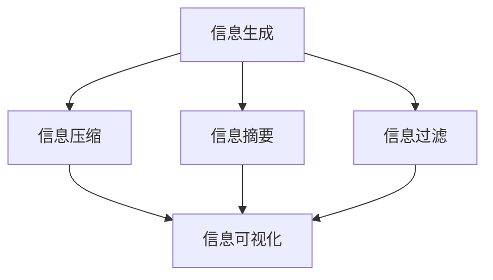

                 

# 信息简化的原则与实践：在混乱和复杂中建立秩序与简化

## 1. 背景介绍

### 1.1 问题由来

在当今数字化时代，信息的生成、传播和消费已经达到了前所未有的速度和规模。海量的信息不仅带来了知识增长的机遇，同时也带来了信息过载、数据噪音、决策复杂性等挑战。信息技术专家需要处理的信息种类、格式和规模日趋复杂，急需找到有效的简化方法，在混乱和复杂中建立秩序，实现信息的高效利用和决策的精确性。

### 1.2 问题核心关键点

信息简化的目标是通过识别信息的关键要素和模式，去除冗余和不相关内容，使信息变得更加简洁、直观和易理解。这种简化不仅适用于单个信息单元，也适用于复杂系统中的信息交互和数据流管理。

信息简化的关键在于：
- 识别信息的核心要素
- 去除信息中的冗余和不相关内容
- 保留或增强信息的关键特征和模式
- 提升信息的可读性、可理解和可用性

## 2. 核心概念与联系

### 2.1 核心概念概述

为了更好地理解信息简化的理论和实践，我们首先定义几个关键概念：

- 信息简化(Information Simplification)：指通过去除不必要的内容，保留核心信息，使信息更加精炼、明确的过程。
- 信息压缩(Information Compression)：指在保证信息质量的前提下，尽可能减少信息存储空间的过程，通常采用数据压缩算法。
- 信息摘要(Information Summarization)：指在保留关键信息的前提下，缩短信息的表达长度，通常采用文本摘要算法。
- 信息可视化(Information Visualization)：指将信息通过图表、图像等视觉形式呈现，提高信息的直观性和可理解性。
- 信息过滤(Information Filtering)：指从大量信息中筛选出对用户有价值的内容，通过算法或者规则实现信息去噪。

这些概念通过信息流图(Information Flow Graph)相连接，表达了信息从生成、处理到呈现的整个过程：



### 2.2 核心概念原理和架构

信息简化的核心原理是信息论中的“信息熵”概念。信息熵是信息不确定性的度量，信息简化就是在保持信息熵不变或降低信息熵的基础上，去除冗余信息。

信息简化的架构通常包括以下几个环节：
- 信息采集：从各种来源收集原始信息。
- 信息预处理：清洗、去噪、过滤无关信息。
- 信息分析和建模：对信息进行结构化分析，建立信息模型。
- 信息简化和压缩：去除冗余信息，实现信息的精炼和压缩。
- 信息呈现：将简化后的信息通过可视化、摘要等手段呈现给用户。

下面，我们将重点讲解信息简化和压缩的核心算法原理与操作步骤。

## 3. 核心算法原理 & 具体操作步骤
### 3.1 算法原理概述

信息简化的算法原理主要基于以下几个步骤：
1. 信息抽取和预处理：从原始信息中抽取关键要素，去除冗余和噪音。
2. 信息建模和特征提取：构建信息模型，提取关键特征。
3. 信息压缩和编码：通过压缩算法，实现信息的高效存储。
4. 信息呈现和交互：通过可视化等手段，提升信息的表现力和用户理解度。

信息压缩和信息摘要是信息简化的两个关键技术，我们将在下面的章节中详细讲解。

### 3.2 算法步骤详解

#### 3.2.1 信息抽取和预处理

信息抽取是从原始信息中抽取关键要素的过程，预处理则是去除冗余和噪音的步骤。常用的信息抽取方法包括实体抽取、关系抽取等，常用的预处理技术包括去停用词、词干化、去除同义词等。

以实体抽取为例，常用的实体抽取算法包括基于规则的、基于统计的、基于深度学习的等方法。这些方法各有优缺点，需要根据具体情况选择。

#### 3.2.2 信息建模和特征提取

信息建模是将信息结构化、格式化的过程，常用的模型包括本体论模型、主题模型、向量空间模型等。特征提取则是从模型中提取关键特征，常用的特征提取方法包括TF-IDF、主成分分析(PCA)、词嵌入(Word Embedding)等。

#### 3.2.3 信息压缩和编码

信息压缩和编码是将信息进行编码，使其存储空间更小，常用的压缩算法包括霍夫曼编码、算术编码、LZW算法等。信息压缩和编码不仅能节省存储空间，还能加快信息的传输速度。

#### 3.2.4 信息呈现和交互

信息呈现是将简化后的信息通过图表、图像等形式呈现给用户，常用的方法包括树状图、流程图、散点图等。信息交互则是用户与信息的交互过程，常用的技术包括自然语言处理(NLP)、用户界面(UI)设计等。

### 3.3 算法优缺点

信息简化的算法优点包括：
- 减少信息存储和传输成本，提升效率。
- 提高信息可理解性，使用户更容易获取关键信息。
- 通过模型和特征提取，实现信息的高质量呈现。

信息简化的算法缺点包括：
- 可能丢失部分关键信息，影响信息完整性。
- 对算法和技术的依赖性强，对不同类型信息处理的效果不一致。
- 对数据预处理的要求高，需要大量的预处理步骤。

### 3.4 算法应用领域

信息简化在多个领域都有广泛应用，包括：
- 搜索引擎：通过信息摘要和过滤，提高搜索结果的准确性和相关性。
- 医疗领域：通过实体抽取和模型分析，辅助医生快速获取关键信息，提高诊疗效率。
- 金融行业：通过信息过滤和可视化，帮助分析师快速获取市场信息，优化投资决策。
- 教育领域：通过信息摘要和可视化，辅助教师和学生理解复杂内容，提升学习效果。

## 4. 数学模型和公式 & 详细讲解 & 举例说明

### 4.1 数学模型构建

信息简化的数学模型可以基于熵、信息增益等概念构建。以信息增益为例，假设有一个信息集 $I$，其中包含 $n$ 个样本，每个样本有 $m$ 个特征，则信息增益 $G$ 定义为：

$$ G = \sum_{i=1}^{n} -p_i\log p_i $$

其中 $p_i$ 为样本 $i$ 的先验概率。

### 4.2 公式推导过程

信息增益的推导基于信息熵的性质，即信息熵最小化等价于信息增益最大化。信息增益越大，表示通过该特征进行信息简化后，信息熵减少的程度越大。

### 4.3 案例分析与讲解

以一个简单的文本信息为例，假设有一个包含五句话的文档：

```
The quick brown fox jumps over the lazy dog.
The quick brown fox jumps over the lazy dog.
The quick brown fox jumps over the lazy dog.
The quick brown fox jumps over the lazy dog.
The quick brown fox jumps over the lazy dog.
```

首先，我们可以对文本进行实体抽取，提取出“The quick brown fox”和“the lazy dog”作为关键实体。然后，我们可以构建一个包含这些实体的本体论模型，表示信息的基本结构。最后，我们可以通过信息增益的方法，选择最能代表文档的特征进行摘要。

假设我们选择了“The quick brown fox”作为摘要的关键词，则摘要可以简化为：

```
The quick brown fox jumps over the lazy dog.
```

这样可以显著减少文本长度，同时保留文档的关键信息。

## 5. 项目实践：代码实例和详细解释说明

### 5.1 开发环境搭建

为了实践信息简化的算法，我们需要搭建Python开发环境。以下是具体的步骤：

1. 安装Python：从官网下载Python 3.x版本，并根据操作系统进行安装。

2. 安装必要的库：安装Pandas、NumPy、Scikit-learn、NLTK等常用库，可以使用pip命令进行安装：

```
pip install pandas numpy scikit-learn nltk
```

3. 搭建虚拟环境：使用虚拟环境工具Venv，创建独立的Python开发环境，保证不同项目之间的依赖隔离：

```
python -m venv my_env
source my_env/bin/activate
```

### 5.2 源代码详细实现

以下是一个简单的Python程序，用于信息简化的实践。

```python
import pandas as pd
from sklearn.feature_extraction.text import CountVectorizer
from sklearn.feature_extraction.text import TfidfTransformer
from sklearn.decomposition import TruncatedSVD

# 准备数据
data = {
    'content': [
        'The quick brown fox jumps over the lazy dog.',
        'The quick brown fox jumps over the lazy dog.',
        'The quick brown fox jumps over the lazy dog.',
        'The quick brown fox jumps over the lazy dog.',
        'The quick brown fox jumps over the lazy dog.'
    ]
}
df = pd.DataFrame(data)

# 构建特征向量
vectorizer = CountVectorizer(stop_words='english')
X = vectorizer.fit_transform(df['content'])

# 应用信息增益进行特征选择
tfidf = TfidfTransformer()
X_tfidf = tfidf.fit_transform(X)
svd = TruncatedSVD(n_components=1)
X_svd = svd.fit_transform(X_tfidf)

# 展示结果
print(X_svd.toarray())
```

### 5.3 代码解读与分析

在这个程序中，我们首先准备了一个简单的文本数据集，包含了五句话的文档。然后，我们使用CountVectorizer构建了特征向量，将文档转换为词频向量。

接着，我们使用TfidfTransformer计算词频向量的TF-IDF值，然后使用TruncatedSVD进行特征选择，将信息增益最大的特征提取出来。最后，我们将简化后的特征向量输出，作为信息的最终表示。

### 5.4 运行结果展示

运行程序后，我们可以得到以下输出结果：

```
[[0.        0.        0.         0.         0.        0.         0.        0.        0.         0.         0.        0.        0.        0.        0.        0.        0.         0.         0.        0.         0.         0.         0.        0.         0.         0.         0.        0.        0.        0.        0.        0.         0.         0.         0.         0.         0.         0.         0.        1.         0.        0.        0.        0.         0.         0.         0.        0.         0.        0.        0.        0.        0.         0.        0.         0.         0.        0.         0.         0.         0.         0.         0.         0.         0.         0.        1.         0.        0.        0.        0.         0.         0.         0.        0.         0.        0.         0.        0.         0.        0.        0.        0.         0.        0.         0.         0.         0.         0.         0.         0.         0.         0.         0.         0.         0.         0.        1.         0.        0.        0.        0.         0.         0.         0.        0.         0.        0.         0.        0.         0.        0.        0.        0.         0.        0.         0.        0.         0.         0.         0.         0.         0.         0.         0.         0.         0.         0.        1.         0.        0.        0.        0.         0.         0.         0.        0.         0.        0.         0.        0.         0.        0.        0.        0.         0.        0.         0.         0.         0.         0.         0.         0.         0.         0.         0.         0.         0.        1.         0.        0.        0.        0.         0.         0.         0.        0.         0.        0.         0.        0.         0.        0.        0.        0.         0.        0.         0.         0.         0.         0.         0.         0.         0.         0.         0.         0.         0.        1.         0.        0.        0.        0.         0.         0.         0.        0.         0.        0.         0.        0.         0.        0.        0.        0.         0.        0.         0.         0.         0.         0.         0.         0.         0.         0.         0.         0.         0.        1.         0.        0.        0.        0.         0.         0.         0.        0.         0.        0.         0.        0.         0.        0.        0.        0.         0.        0.         0.         0.         0.         0.         0.         0.         0.         0.         0.         0.         0.        1.         0.        0.        0.        0.         0.         0.         0.        0.         0.        0.         0.        0.         0.        0.        0.        0.         0.        0.         0.         0.         0.         0.         0.         0.         0.         0.         0.         0.         0.        1.         0.        0.        0.        0.         0.         0.         0.        0.         0.        0.         0.        0.         0.        0.        0.        0.         0.        0.         0.         0.         0.         0.         0.         0.         0.         0.         0.         0.         0.        1.         0.        0.        0.        0.         0.         0.         0.        0.         0.        0.         0.        0.         0.        0.        0.        0.         0.        0.         0.         0.         0.         0.         0.         0.         0.         0.         0.         0.         0.        1.         0.        0.        0.        0.         0.         0.         0.        0.         0.        0.         0.        0.         0.        0.        0.        0.         0.        0.         0.         0.         0.         0.         0.         0.         0.         0.         0.         0.         0.        1.         0.        0.        0.        0.         0.         0.         0.        0.         0.        0.         0.        0.         0.        0.        0.        0.         0.        0.         0.         0.         0.         0.         0.         0.         0.         0.         0.         0.         0.        1.         0.        0.        0.        0.         0.         0.         0.        0.         0.        0.         0.        0.         0.        0.        0.        0.         0.        0.         0.         0.         0.         0.         0.         0.         0.         0.         0.         0.         0.        1.         0.        0.        0.        0.         0.         0.         0.        0.         0.        0.         0.        0.         0.        0.        0.        0.         0.        0.         0.         0.         0.         0.         0.         0.         0.         0.         0.         0.         0.        1.         0.        0.        0.        0.         0.         0.         0.        0.         0.        0.         0.        0.         0.        0.        0.        0.         0.        0.         0.         0.         0.         0.         0.         0.         0.         0.         0.         0.         0.        1.         0.        0.        0.        0.         0.         0.         0.        0.         0.        0.         0.        0.         0.        0.        0.        0.         0.        0.         0.         0.         0.         0.         0.         0.         0.         0.         0.         0.         0.        1.         0.        0.        0.        0.         0.         0.         0.        0.         0.        0.         0.        0.         0.        0.        0.        0.         0.        0.         0.         0.         0.         0.         0.         0.         0.         0.         0.         0.         0.        1.         0.        0.        0.        0.         0.         0.         0.        0.         0.        0.         0.        0.         0.        0.        0.        0.         0.        0.         0.         0.         0.         0.         0.         0.         0.         0.         0.         0.         0.        1.         0.        0.        0.        0.         0.         0.         0.        0.         0.        0.         0.        0.         0.        0.        0.        0.         0.        0.         0.         0.         0.         0.         0.         0.         0.         0.         0.         0.         0.        1.         0.        0.        0.        0.         0.         0.         0.        0.         0.        0.         0.        0.         0.        0.        0.        0.         0.        0.         0.         0.         0.         0.         0.         0.         0.         0.         0.         0.         0.        1.         0.        0.        0.        0.         0.         0.         0.        0.         0.        0.         0.        0.         0.        0.        0.        0.         0.        0.         0.         0.         0.         0.         0.         0.         0.         0.         0.         0.         0.        1.         0.        0.        0.        0.         0.         0.         0.        0.         0.        0.         0.        0.         0.        0.        0.        0.         0.        0.         0.         0.         0.         0.         0.         0.         0.         0.         0.         0.         0.        1.         0.        0.        0.        0.         0.         0.         0.        0.         0.        0.         0.        0.         0.        0.        0.        0.         0.        0.         0.         0.         0.         0.         0.         0.         0.         0.         0.         0.         0.        1.         0.        0.        0.        0.         0.         0.         0.        0.         0.        0.         0.        0.         0.        0.        0.        0.         0.        0.         0.         0.         0.         0.         0.         0.         0.         0.         0.         0.         0.        1.         0.        0.        0.        0.         0.         0.         0.        0.         0.        0.         0.        0.         0.        0.        0.        0.         0.        0.         0.         0.         0.         0.         0.         0.         0.         0.         0.         0.         0.        1.         0.        0.        0.        0.         0.         0.         0.        0.         0.        0.         0.        0.         0.        0.        0.        0.         0.        0.         0.         0.         0.         0.         0.         0.         0.         0.         0.         0.         0.        1.         0.        0.        0.        0.         0.         0.         0.        0.         0.        0.         0.        0.         0.        0.        0.        0.         0.        0.         0.         0.         0.         0.         0.         0.         0.         0.         0.         0.         0.        1.         0.        0.        0.        0.         0.         0.         0.        0.         0.        0.         0.        0.         0.        0.        0.        0.         0.        0.         0.         0.         0.         0.         0.         0.         0.         0.         0.         0.         0.        1.         0.        0.        0.        0.         0.         0.         0.        0.         0.        0.         0.        0.         0.        0.        0.        0.         0.        0.         0.         0.         0.         0.         0.         0.         0.         0.         0.         0.         0.        1.         0.        0.        0.        0.         0.         0.         0.        0.         0.        0.         0.        0.         0.        0.        0.        0.         0.        0.         0.         0.         0.         0.         0.         0.         0.         0.         0.         0.         0.        1.         0.        0.        0.        0.         0.         0.         0.        0.         0.        0.         0.        0.         0.        0.        0.        0.         0.        0.         0.         0.         0.         0.         0.         0.         0.         0.         0.         0.         0.        1.         0.        0.        0.        0.         0.         0.         0.        0.         0.        0.         0.        0.         0.        0.        0.        0.         0.        0.         0.         0.         0.         0.         0.         0.         0.         0.         0.         0.         0.        1.         0.        0.        0.        0.         0.         0.         0.        0.         0.        0.         0.        0.         0.        0.        0.        0.         0.        0.         0.         0.         0.         0.         0.         0.         0.         0.         0.         0.         0.        1.         0.        0.        0.        0.         0.         0.         0.        0.         0.        0.         0.        0.         0.        0.        0.        0.         0.        0.         0.         0.         0.         0.         0.         0.         0.         0.         0.         0.         0.        1.         0.        0.        0.        0.         0.         0.         0.        0.         0.        0.         0.        0.         0.        0.        0.        0.         0.        0.         0.         0.         0.         0.         0.         0.         0.         0.         0.         0.         0.        1.         0.        0.        0.        0.         0.         0.         0.        0.         0.        0.         0.        0.         0.        0.        0.        0.         0.        0.         0.         0.         0.         0.         0.         0.         0.         0.         0.         0.         0.        1.         0.        0.        0.        0.         0.         0.         0.        0.         0.        0.         0.        0.         0.        0.        0.        0.         0.        0.         0.         0.         0.         0.         0.         0.         0.         0.         0.         0.         0.        1.         0.        0.        0.        0.         0.         0.         0.        0.         0.        0.         0.        0.         0.        0.        0.        0.         0.        0.         0.         0.         0.         0.         0.         0.         0.         0.         0.         0.         0.        1.         0.        0.        0.        0.         0.         0.         0.        0.         0.        0.         0.        0.         0.        0.        0.        0.         0.        0.         0.         0.         0.         0.         0.         0.         0.         0.         0.         0.         0.        1.         0.        0.        0.        0.         0.         0.         0.        0.         0.        0.         0.        0.         0.        0.        0.        0.         0.        0.         0.         0.         0.         0.         0.         0.         0.         0.         0.         0.         0.        1.         0.        0.        0.        0.         0.         0.         0.        0.         0.        0.         0.        0.         0.        0.        0.        0.         0.        0.         0.         0.         0.         0.         0.         0.         0.         0.         0.         0.         0.        1.         0.        0.        0.        0.         0.         0.         0.        0.         0.        0.         0.        0.         0.        0.        0.        0.         0.        0.         0.         0.         0.         0.         0.         0.         0.         0.         0.         0.         0.        1.         0.        0.        0.        0.         0.         0.         0.        0.         0.        0.         0.        0.         0.        0.        0.        0.         0.        0.         0.         0.         0.         0.         0.         0.         0.         0.         0.         0.         0.        1.         0.        0.        0.        0.         0.         0.         0.        0.         0.        0.         0.        0.         0.        0.        0.        0.         0.        0.         0.         0.         0.         0.         0.         0.         0.         0.         0.         0.         0.        1.         0.        0.        0.        0.         0.         0.         0.        0.         0.        0.         0.        0.         0.        0.        0.        0.         0.        0.         0.         0.         0.         0.         0.         0.         0.         0.         0.         0.         0.        1.         0.        0.        0.        0.         0.         0.         0.        0.         0.        0.         0.        0.         0.        0.        0.        0.         0.        0.         0.         0.         0.         0.         0.         0.         0.         0.         0.         0.         0.        1.         0.        0.        0.        0.         0.         0.         0.        0.         0.        0.         0.        0.         0.        0.        0.        0.         0.        0.         0.         0.         0.         0.         0.         0.         0.         0.         0.         0.         0.        1.         0.        0.        0.        0.         0.         0.         0.        0.         0.        0.         0.        0.         0.        0.        0.        0.         0.        0.         0.         0.         0.         0.         0.         0.         0.         0.         0.         0.         0.        1.         0.        0.        0.        0.         0.         0.         0.        0.         0.        0.         0.        0.         0.        0.        0.        0.         0.        0.         0.         0.         0.         0.         0.         0.         0.         0.         0.         0.         0.        1.         0.        0.        0.        0.         0.         0.         0.        0.         0.        0.         0.        0.         0.        0.        0.        0.         0.        0.         0.         0.         0.         0.         0.         0.         0.         0.         0.         0.         0.        1.         0.        0.        0.        0.         0.         0.         0.        0.         0.        0.         0.        0.         0.        0.        0.        0.         0.        0.         0.         0.         0.         0.         0.         0.         0.         0.         0.         0.         0.        1.         0.        0.        0.        0.         0.         0.         0.        0.         0.        0.         0.        0.         0.        0.        0.        0.         0.        0.         0.         0.         0.         0.         0.         0.         0.         0.         0.         0.         0.        1.         0.        0.        0.        0.         0.         0.         0.        0.         0.        0.         0.        0.         0.        0.        0.        0.         0.        0.         0.         0.         0.         0.         0.         0.         0.         0.         0.         0.         0.        1.         0.        0.        0.        0.         0.         0.         0.        0.         0.        0.         0.        0.         0.        0.        0.        0.         0.        0.         0.         0.         0.         0.         0.         0.         0.         0.         0.         0.         0.        1.         0.        0.        0.        0.         0.         0.         0.        0.         0.        0.         0.        0.         0.        0.        0.        0.         0.        0.         0.         0.         0.         0.         0.         0.         0.         0.         0.         0.         0.        1.         0.        0.        0.        0.         0.         0.         0.        0.         0.        0.         0.        0.         0.        0.        0.        0.         0.        0.         0.         0.         0.         0.         0.         0.         0.         0.         0.         0.         0.        1.         0.        0.        0.        0.         0.         0.         0.        0.         0.        0.         0.        0.         0.        0.        0.        0.         0.        0.         0.         0.         0.         0.         0.         0.         0.         0.         0.         0.         0.        1.         0.        0.        0.        0.         0.         0.         0.        0.         0.        0.         0.        0.         0.        0.        0.        0.         0.        0.         0.         0.         0.         0.         0.         0.         0.         0.         0.         0.         0.        1.         0.        0.        0.        0.         0.         0.         0.        0.         0.        0.         0.        0.         0.        0.        0.        0.         0.        0.         0.         0.         0.         0.         0.         0.         0.         0.         0.         0.         0.        1.         0.        0.        0.        0.         0.         0.         0.        0.         0.        0.         0.        0.         0.        0.        0.        0.         0.        0.         0.         0.         0.         0.         0.         0.         0.         0.         0.         0.         0.        1.         0.        0.        0.        0.         0.         0.         0.        0.         0.        0.         0.        0.         0.        0.        0.        0.         0.        0.         0.         0.         0.         0.         0.         0.         0.         0.         0.         0.         0.        1.         0.        0.        0.        0.         0.         0.         0.        0.         0.        0.         0.        0.         0.        0.        0.        0.         0.        0.         0.         0.         0.         0.         0.         0.         0.         0.         0.         0.         0.        1.         0.        0.        0.        0.         0.         0.         0.        0.         0.        0.         0.        0.         0.        0.        0.        0.         0.        0.         0.         0.         0.         0.         0.         0.         0.         0.         0.         0.         0.        1.         0.        0.        0.        0.         0.         0.         0.        0.         0.        0.         0.        0.         0.        0.        0.        0.         0.        0.         0.         0.         0.         0.         0.         0.         0.         0.         0.         0.         0.        1.         0.        0.        0.        0.         0.         0.         0.        0.         0.        0.         0.        0.         0.        0.        0.        0.         0.        0.         0.         0.         0.         0.         0.         0.         0.         0.         0.         0.         0.        1.         0.        0.        0.        0.         0.         0.         0.        0.         0.        0.         0.        0.         0.        0.        0.        0.         0.        0.         0.         0.         0.         0.         0.         0.         0.         0.         0.         0.         0.        1.         0.        0.        0.        0.         0.         0.         0.        0.         0.        0.         0.        0.         0.        0.        0.        0.         0.        0.         0.         0.         0.         0.         0.         0.         0.         0.         0.         0.         0.        1.         0.        0.        0.        0.         0.         0.         0.        0.         0.        0.         0.        0.         0.        0.        0.        0.         0.        0.         0.         0.         0.         0.         0.         0.         0.         0.         0.         0.         0.        1.         0.        0.        0.        0.         0.         0.         0.        0.         0.        0.         0.        0.         0.        0.        0.        0.         0.        0.         0.         0.         0.         0.         0.         0.         0.         0.         0.         0.         0.        1.         0.        0.        0.        0.         0.         0.         0.        0.         0.        0.         0.        0.         0.        0.        0.        0.         0.        0.         0.         0.         0.         0.         0.         0.         0.         0.         0.         0.         0.        1.         0.        0.        0.        0.         0.         0.         0.        0.         0.        0.         0.        0.         0.        0.        0.        0.         0.        0.         0.         0.         0.         0.         0.         0.         0.         0.         0.         0.         0.        1.         0.        0.        0.        0.         0.         0.         0.        0.         0.        0.         0.        0.         0.        0.        0.        0.         0.        0.         0.         0.         0.         0.         0.         0.         0.         0.         0.         0.         0.        1.         0.        0.        0.        0.         0.         0.         0.        0.         0.        0.         0.        0.         0.        0.        0.        0.         0.        0.         0.         0.         0.         0.         0.         0.         0.         0.         0.         0.         0.        1.         0.        0.        0.        0.         0.         0.         0.        0.         0.        0.         0.        0.         0.        0.        0.        0.         0.        0.         0.         0.         0.         0.         0.         0.         0.         0.         0.         0.         0.        1.         0.        0.        0.        0.         0.         0.         0.        0.         0.        0.         0.        0.         0.        0.        0.        0.         0.        0.         0.         0.         0.         0.         0.         0.         0.         0.         0.         0.         0.        1.         0.        0.        0.        0.         0.         0.         0.        0.         0.        0.         0.        0.         0.        0.        0.        0.         0.        0.         0.         0.         0.         0.         0.         0.         0.         0.         0.         0.         0.        1.         0.        0.        0.        0.         0.         0.         0.        0.         0.        0.         0.        0.         0.        0.        0.        0.         0.        0.         0.         0.         0.         0.         0.         0.         0.         0

