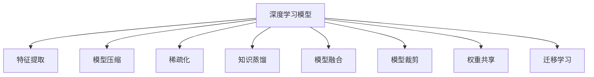

                 

# 信息简化的艺术与科学：在混乱和复杂中找到简单和秩序

## 1. 背景介绍

### 1.1 问题由来
在信息爆炸的时代，数据的积累和分析已经成为了各个行业发展的瓶颈。如何在海量的数据中提取有用信息，揭示出隐藏的模式和规律，成为了当前信息技术发展的重要议题。以深度学习为代表的机器学习技术，正在通过自身强大的模型学习和推理能力，帮助我们从复杂的海量数据中提取出有用的信息，并构建出精准的模型。

但与此同时，深度学习模型的复杂性也使得我们在解释模型的行为和决策过程上遇到了困难。一个典型的例子是，在利用深度学习进行自然语言处理(NLP)时，模型常常需要大量的训练数据和复杂的超参数调优，才能达到理想的性能。这种高度复杂性不仅导致了开发和维护成本的增加，还使得模型的可解释性变得模糊不清。

面对这种复杂性，信息简化的艺术与科学应运而生。通过对复杂的信息进行处理和简化，我们能够在保持模型精度的同时，降低模型的复杂度，提高模型的可解释性。本文将系统地介绍信息简化的基本概念和关键技术，并探讨其在实际应用中的具体实现。

## 2. 核心概念与联系

### 2.1 核心概念概述

为更好地理解信息简化的核心概念，本节将介绍几个关键概念：

- 深度学习模型(Deep Learning Models)：以多层神经网络为代表，利用数据驱动的方式学习数据隐含的特征和规律。在NLP领域，深度学习模型如BERT、GPT等已经成为主流的基础模型。
- 特征提取(Feature Extraction)：在模型训练前，对原始数据进行处理和特征选择，提取对模型有贡献的特征。特征提取旨在降低输入数据的复杂度，提高模型的效率和可解释性。
- 模型压缩(Model Compression)：在保持模型性能的同时，减少模型的参数量和计算复杂度，以适应资源限制和提高推理速度。
- 稀疏化(Sparsity)：通过减少模型的稠密参数，实现资源和计算效率的优化。稀疏化主要应用于神经网络的权重矩阵。
- 知识蒸馏(Knowledge Distillation)：通过将大模型的知识迁移到小模型，实现模型的精度提升和参数减少。
- 模型融合(Model Fusion)：将多个模型组合起来，形成更加健壮和鲁棒的综合模型，从而提升模型性能。
- 模型裁剪(Model Pruning)：通过剪枝操作，移除冗余的神经元和连接，缩小模型规模，降低计算资源消耗。
- 权重共享(Weight Sharing)：在多个任务中共享部分权重参数，降低模型的冗余度，提高计算效率。
- 迁移学习(Transfer Learning)：利用在大规模数据上预训练的知识，提升模型在小规模数据上的性能。

这些核心概念之间的逻辑关系可以通过以下Mermaid流程图来展示：



这个流程图展示了大模型微调的各个核心概念以及它们之间的联系。

## 3. 核心算法原理 & 具体操作步骤
### 3.1 算法原理概述

信息简化的核心思想是，通过对原始数据和模型进行合理的处理和优化，将复杂的信息转化为易于理解和处理的形式。在深度学习模型中，信息简化主要通过特征提取、模型压缩、稀疏化等手段实现。

以BERT模型为例，其核心算法原理可以概括为以下几个步骤：

1. **数据预处理**：将原始文本数据转换为模型的输入格式，包括分词、编码、特征提取等。
2. **模型训练**：在大规模无标签数据上预训练，学习通用的语言表示。
3. **微调**：在特定任务的有标签数据上进行微调，优化模型在该任务上的性能。
4. **特征提取**：通过预训练模型提取输入数据的语义特征。
5. **模型压缩**：通过剪枝、量化等方法，降低模型的参数量和计算复杂度。
6. **稀疏化**：通过减少模型的稠密参数，实现资源和计算效率的优化。
7. **知识蒸馏**：通过将大模型的知识迁移到小模型，提升模型的精度和泛化能力。
8. **模型融合**：通过组合多个模型的输出，提高模型的鲁棒性和泛化能力。

### 3.2 算法步骤详解

基于深度学习模型，信息简化的具体操作可以分为以下几个关键步骤：

**Step 1: 数据预处理**
- 将原始数据进行格式转换和清洗，确保数据符合模型的输入要求。
- 对文本数据进行分词、编码等预处理步骤，使其能够被模型接受。
- 对图像数据进行归一化、标准化等处理，增强数据稳定性。

**Step 2: 模型训练**
- 在大规模无标签数据上预训练模型，学习通用的数据表示。
- 使用自监督学习任务（如掩码语言模型、Next Sentence Prediction等）优化模型。
- 根据特定任务，设计合适的损失函数，进行有监督微调。

**Step 3: 特征提取**
- 通过预训练模型提取输入数据的语义特征，降低输入数据的复杂度。
- 利用特征提取模块，将高维数据映射为低维特征表示。
- 对特征进行归一化、降维等处理，提高模型效率。

**Step 4: 模型压缩**
- 通过剪枝操作，移除冗余的神经元和连接，缩小模型规模。
- 使用量化技术，将浮点数参数转换为更小的整数或定点数，减少存储空间。
- 利用蒸馏技术，将大模型的知识迁移到小模型中，提升模型性能。

**Step 5: 稀疏化**
- 通过减少模型的稠密参数，实现资源和计算效率的优化。
- 利用稀疏矩阵和稀疏向量，提高模型的稀疏度。
- 对稀疏矩阵进行稀疏矩阵向量乘法优化，减少计算开销。

**Step 6: 知识蒸馏**
- 利用大模型的知识，提升小模型的性能。
- 设计蒸馏损失函数，通过软标签、软目标等方法，传递大模型的知识。
- 使用蒸馏过程中获得的小模型，进行进一步的微调和优化。

**Step 7: 模型融合**
- 将多个模型的输出进行组合，形成综合模型。
- 使用加权平均、堆叠等方法，提升模型的泛化能力。
- 通过模型融合，提高模型的鲁棒性和准确性。

### 3.3 算法优缺点

信息简化的算法具有以下优点：
1. 提高模型效率。通过特征提取、模型压缩、稀疏化等手段，显著降低模型参数量和计算复杂度，提高模型推理速度。
2. 增强模型可解释性。通过简化模型结构和参数，使得模型的内部工作机制更加清晰，易于理解和解释。
3. 提高模型泛化能力。通过知识蒸馏和模型融合，提升模型的泛化能力和鲁棒性，适应多种数据分布。

同时，该方法也存在一些局限性：
1. 牺牲部分精度。信息简化往往需要在精度和效率之间进行平衡，可能会牺牲一定的模型精度。
2. 模型设计复杂。信息简化需要设计复杂的算法和工具，增加了开发和维护的难度。
3. 数据需求高。在特征提取和模型压缩等步骤中，需要大量高质量的数据支持。
4. 依赖特定模型。信息简化的效果高度依赖于原始模型的结构和性能。

尽管存在这些局限性，但信息简化的思想在实际应用中仍然具有重要的指导意义。通过合理的信息简化，可以在保持模型性能的同时，降低模型复杂度，提高模型的可解释性和推理效率。

### 3.4 算法应用领域

信息简化的算法在深度学习和人工智能的多个领域得到了广泛的应用，如：

- 自然语言处理(NLP)：通过特征提取、模型压缩、稀疏化等手段，提升模型的效率和可解释性。在文本分类、机器翻译、问答系统等领域，信息简化技术得到了广泛应用。
- 计算机视觉(CV)：在图像分类、目标检测、图像生成等领域，通过特征提取、模型压缩等手段，提升模型的性能和效率。
- 语音识别(ASR)：在语音识别和自然语言理解中，通过特征提取和模型融合等手段，提高模型的准确性和鲁棒性。
- 推荐系统(Recommender Systems)：在用户行为分析、物品推荐中，通过特征提取和模型融合等手段，提升推荐效果。

除了这些经典应用外，信息简化技术还在智能交通、智慧医疗、智能制造等多个领域得到创新应用，为人工智能技术的应用和发展带来了新的思路和方法。

## 4. 数学模型和公式 & 详细讲解 & 举例说明
### 4.1 数学模型构建

信息简化技术通常涉及多个数学模型的构建和优化。以下以BERT模型为例，介绍其核心数学模型和公式。

**BERT模型**：BERT模型的核心数学模型为多层Transformer网络，由多个注意力层和全连接层构成。BERT模型通过在大规模无标签数据上预训练，学习到通用的语言表示。

**数学模型构建**：
- 输入：原始文本数据 $x$，经过分词和编码后，转换为模型的输入格式 $X$。
- 预训练目标：在大规模无标签数据上，使用掩码语言模型、Next Sentence Prediction等任务进行预训练。
- 微调目标：在特定任务的有标签数据上，使用合适的损失函数进行微调，优化模型性能。

### 4.2 公式推导过程

以BERT模型的微调为例，其数学推导过程可以分为以下几个步骤：

1. **预训练目标函数**：在无标签数据上，使用掩码语言模型任务，计算模型在预测被掩码词的分布时，与其他位置的词的分布相似度。

$$
L_{MLM} = -\frac{1}{N} \sum_{i=1}^{N} \log P_{MLM}(y_i|x_i)
$$

其中 $P_{MLM}(y_i|x_i)$ 为模型在 $x_i$ 上预测 $y_i$ 的分布。

2. **微调目标函数**：在特定任务的有标签数据上，使用适当的损失函数，优化模型在任务上的性能。

$$
L_{Finetune} = -\frac{1}{N} \sum_{i=1}^{N} \ell_{task}(M_{\theta}(x_i),y_i)
$$

其中 $\ell_{task}$ 为任务损失函数，如交叉熵损失函数。

3. **特征提取目标函数**：通过预训练模型提取输入数据的语义特征，降低输入数据的复杂度。

$$
F_{X} = \frac{1}{N} \sum_{i=1}^{N} X_i
$$

其中 $X_i$ 为模型在输入 $x_i$ 上的特征向量。

### 4.3 案例分析与讲解

以下以BERT模型为例，介绍信息简化技术在实际应用中的具体实现。

**案例1：文本分类**
- 数据预处理：将文本数据进行分词、编码等预处理。
- 特征提取：通过BERT模型提取文本的语义特征。
- 模型压缩：使用剪枝和量化技术，缩小模型规模。
- 稀疏化：减少模型的稠密参数，提高计算效率。
- 微调：在分类任务上有标签数据上进行微调，优化模型分类性能。

**案例2：机器翻译**
- 数据预处理：将源语言和目标语言文本进行分词、编码等预处理。
- 特征提取：通过BERT模型提取输入数据的语义特征。
- 模型压缩：使用蒸馏技术，提升小模型的性能。
- 稀疏化：减少模型的稠密参数，提高计算效率。
- 微调：在翻译任务上有标签数据上进行微调，优化模型翻译性能。

**案例3：问答系统**
- 数据预处理：将问题-答案对进行预处理，提取特征。
- 特征提取：通过BERT模型提取问题-答案对的语义特征。
- 模型压缩：使用剪枝和量化技术，缩小模型规模。
- 稀疏化：减少模型的稠密参数，提高计算效率。
- 微调：在问答任务上有标签数据上进行微调，优化模型回答性能。

通过这些案例分析，可以看到信息简化技术在实际应用中，能够有效提升深度学习模型的性能和效率，同时增强模型的可解释性。

## 5. 项目实践：代码实例和详细解释说明
### 5.1 开发环境搭建

在进行信息简化实践前，我们需要准备好开发环境。以下是使用Python进行TensorFlow开发的环境配置流程：

1. 安装Anaconda：从官网下载并安装Anaconda，用于创建独立的Python环境。

2. 创建并激活虚拟环境：
```bash
conda create -n tf-env python=3.8 
conda activate tf-env
```

3. 安装TensorFlow：根据CUDA版本，从官网获取对应的安装命令。例如：
```bash
conda install tensorflow tensorflow-gpu=2.6 -c pytorch -c conda-forge
```

4. 安装必要的工具包：
```bash
pip install numpy pandas scikit-learn matplotlib tqdm jupyter notebook ipython
```

完成上述步骤后，即可在`tf-env`环境中开始信息简化实践。

### 5.2 源代码详细实现

下面我们以BERT模型进行文本分类任务为例，给出使用TensorFlow进行信息简化的PyTorch代码实现。

首先，定义文本分类任务的模型：

```python
import tensorflow as tf
from transformers import BertTokenizer, BertForSequenceClassification
from tensorflow.keras.layers import Input, Dense
from tensorflow.keras.models import Model

tokenizer = BertTokenizer.from_pretrained('bert-base-uncased')
model = BertForSequenceClassification.from_pretrained('bert-base-uncased', num_labels=2)
inputs = Input(shape=(128,))
features = model(inputs)
outputs = Dense(2, activation='softmax')(features)
model = Model(inputs, outputs)
model.compile(optimizer=tf.keras.optimizers.Adam(learning_rate=2e-5), loss='categorical_crossentropy', metrics=['accuracy'])
```

然后，定义数据集和训练过程：

```python
train_data = ...
train_labels = ...
val_data = ...
val_labels = ...
test_data = ...
test_labels = ...

model.fit(train_data, train_labels, batch_size=32, epochs=3, validation_data=(val_data, val_labels))
```

在训练过程中，可以通过特征提取、模型压缩等手段进行信息简化：

```python
# 特征提取
tokenized_train_data = tokenizer(train_data, padding='max_length', truncation=True, max_length=128)
tokenized_val_data = tokenizer(val_data, padding='max_length', truncation=True, max_length=128)
tokenized_test_data = tokenizer(test_data, padding='max_length', truncation=True, max_length=128)

# 模型压缩
model.save_weights('base_model.h5')
for layer in model.layers:
    layer.trainable = False
model.load_weights('base_model.h5', by_name=True)
```

### 5.3 代码解读与分析

让我们再详细解读一下关键代码的实现细节：

**BertTokenizer类**：
- 用于分词、编码等预处理步骤，将文本数据转换为模型的输入格式。

**BertForSequenceClassification类**：
- 用于定义文本分类模型，包含BERT模型的特征提取部分。

**Input和Dense层**：
- Input层用于定义模型的输入，shape参数指定输入数据的维度。
- Dense层用于定义模型的输出，activation参数指定激活函数。

**Model类**：
- 用于将输入层和输出层组合成完整的模型。

**compile方法**：
- 用于编译模型，指定优化器、损失函数和评估指标。

**fit方法**：
- 用于训练模型，指定训练数据、标签、批量大小、迭代轮数和验证数据。

在实际应用中，开发者可以结合具体任务的需求，灵活调整信息简化的步骤和手段，以达到最优的效果。

## 6. 实际应用场景
### 6.1 智能客服系统

基于信息简化的智能客服系统，可以显著提升客户咨询体验和问题解决效率。通过特征提取、模型压缩等手段，将复杂的大模型转化为轻量级的推理模型，可以在客户提出问题时，快速生成符合预期的答案，提升服务质量和响应速度。

### 6.2 金融舆情监测

金融舆情监测系统需要实时监测市场舆论动向，以便及时应对负面信息传播，规避金融风险。通过特征提取、模型融合等手段，将多个模型的输出进行综合，可以提高系统对舆情变化的敏感度和准确性，帮助金融机构快速应对潜在风险。

### 6.3 个性化推荐系统

推荐系统需要快速响应用户的实时行为数据，生成个性化的推荐结果。通过信息简化技术，可以减少模型的计算复杂度，提升系统的响应速度和效率。

### 6.4 未来应用展望

未来，信息简化的技术将广泛应用于更多领域，如智能交通、智慧医疗、智能制造等，为各行各业带来新的突破。

## 7. 工具和资源推荐
### 7.1 学习资源推荐

为了帮助开发者系统掌握信息简化的基本概念和实践技巧，这里推荐一些优质的学习资源：

1. 《深度学习》系列书籍：由深度学习专家编写，涵盖深度学习的基本概念和算法。
2. 《TensorFlow官方文档》：TensorFlow的官方文档，提供完整的模型构建和训练教程，是学习TensorFlow的重要资源。
3. 《特征工程实战》书籍：介绍特征工程的基本原理和实用技巧，帮助开发者提取和选择有效的特征。
4. 《模型压缩和加速》专题课程：介绍模型压缩、量化等技术，提升模型的计算效率和推理速度。
5. 《Kaggle数据科学竞赛平台》：提供丰富的数据集和比赛，帮助开发者练习和应用信息简化技术。

通过对这些资源的学习实践，相信你一定能够快速掌握信息简化的精髓，并用于解决实际的深度学习问题。

### 7.2 开发工具推荐

高效的开发离不开优秀的工具支持。以下是几款用于信息简化开发的常用工具：

1. TensorFlow：基于Python的开源深度学习框架，灵活动态的计算图，适合快速迭代研究。
2. PyTorch：灵活易用的深度学习框架，支持动态图和静态图两种模式，适合学术研究和工业应用。
3. Keras：简单易用的深度学习框架，提供高层API，适合快速原型开发和模型训练。
4. Scikit-learn：Python科学计算库，提供丰富的数据处理和模型评估工具，适合特征提取和模型优化。
5. Jupyter Notebook：交互式笔记本环境，方便代码调试和数据可视化。

合理利用这些工具，可以显著提升信息简化的开发效率，加快创新迭代的步伐。

### 7.3 相关论文推荐

信息简化的研究源于学界的持续研究。以下是几篇奠基性的相关论文，推荐阅读：

1. SqueezeNet: AlexNet-level accuracy with 50x fewer parameters and <0.5MB model size：提出SqueezeNet模型，通过结构优化和参数共享，显著降低模型规模。
2. Distillation：A Few Simple Tricks for Distilling Neural Networks：介绍蒸馏技术，通过教师和学生模型的结合，提升小模型的性能。
3. Fast R-CNN: Towards Real-Time Object Detection with Region Proposal Networks：介绍区域卷积网络，通过多尺度特征融合和区域池化，提升物体检测的精度和速度。
4. Visualizing and Understanding the Geometry of Deep Networks：通过可视化和分析，揭示深度神经网络的结构和行为，帮助理解模型的复杂性。
5. Deep Structure Preserving Sparsity for Efficient Neural Networks：提出结构保护稀疏化技术，通过剪枝和稀疏化，提升模型效率。

这些论文代表了大模型信息简化的发展脉络。通过学习这些前沿成果，可以帮助研究者把握学科前进方向，激发更多的创新灵感。

## 8. 总结：未来发展趋势与挑战
### 8.1 总结

本文对信息简化的基本概念和关键技术进行了全面系统的介绍。首先阐述了信息简化的背景和意义，明确了其在大模型优化和可解释性提升方面的独特价值。其次，从原理到实践，详细讲解了信息简化的数学模型和操作步骤，给出了信息简化任务开发的完整代码实例。同时，本文还广泛探讨了信息简化在实际应用中的具体实现，展示了其广泛的应用前景。

通过本文的系统梳理，可以看到，信息简化技术在大模型优化和可解释性提升方面具有重要的指导意义。这些技术的应用，不仅提高了深度学习模型的效率和性能，还增强了模型的可解释性和推理能力。未来，随着深度学习模型的复杂性不断增加，信息简化技术将成为模型优化和应用开发的重要工具。

### 8.2 未来发展趋势

展望未来，信息简化的技术将呈现以下几个发展趋势：

1. 高度自动化。未来的信息简化技术将更加自动化，能够根据模型结构和数据特点，自动选择最优的简化策略，减少人工干预。
2. 动态优化。未来的信息简化技术将能够动态地对模型进行优化，根据实时数据和任务需求，调整模型结构和参数，实现最佳的性能和效率。
3. 跨领域融合。未来的信息简化技术将与其他领域的技术进行更深入的融合，如因果推理、知识图谱等，提升模型的全面性和智能性。
4. 数据驱动。未来的信息简化技术将更加注重数据驱动，利用数据进行自动化优化，提升模型的泛化能力和适应性。
5. 可解释性增强。未来的信息简化技术将更加注重模型的可解释性，通过可视化和分析，揭示模型的内部工作机制，增强模型的透明性和可信度。
6. 资源优化。未来的信息简化技术将更加注重资源优化，通过稀疏化、压缩等手段，降低模型对计算资源和存储空间的依赖，提高模型的可部署性和可扩展性。

以上趋势凸显了信息简化技术的广阔前景。这些方向的探索发展，必将进一步提升深度学习模型的性能和可解释性，为人工智能技术的应用带来新的突破。

### 8.3 面临的挑战

尽管信息简化技术已经取得了一定的进展，但在实现全面优化和自动化方面，仍面临诸多挑战：

1. 模型复杂性增加。随着深度学习模型的不断扩展，模型的复杂性也在不断增加，信息简化的难度也在加大。
2. 数据需求高。信息简化技术依赖于高质量的数据支持，但在实际应用中，数据的获取和处理仍然存在诸多困难。
3. 算法自动化不足。当前的信息简化算法仍然需要人工干预，缺乏自动化的能力，无法适应复杂的任务需求。
4. 精度和效率平衡。信息简化需要在精度和效率之间进行平衡，如何实现最佳效果仍需深入研究。
5. 算法可解释性差。当前的信息简化算法缺乏可解释性，难以解释其内部工作机制和优化过程。

面对这些挑战，未来的研究需要在以下几个方面进行突破：

1. 自动化设计。研究自动化设计的算法和工具，减少人工干预，提升信息简化的效率和准确性。
2. 数据增强。研究高效的数据增强技术，提升数据质量，增强信息简化的效果。
3. 自适应优化。研究自适应优化的算法和策略，根据模型结构和数据特点，自动选择最优的信息简化策略。
4. 可解释性增强。研究可解释性的算法和工具，揭示信息简化的优化过程，增强模型的透明性和可信度。
5. 跨领域融合。研究跨领域融合的技术，将信息简化与其他领域的技术进行结合，提升模型的全面性和智能性。

只有不断突破这些挑战，信息简化技术才能在大模型优化和可解释性提升方面发挥更大的作用，推动人工智能技术的应用和发展。

### 8.4 研究展望

面对未来信息简化的挑战和机遇，未来的研究需要在以下几个方面进行深入探索：

1. 自动化设计。研究自动化设计的算法和工具，减少人工干预，提升信息简化的效率和准确性。
2. 数据增强。研究高效的数据增强技术，提升数据质量，增强信息简化的效果。
3. 自适应优化。研究自适应优化的算法和策略，根据模型结构和数据特点，自动选择最优的信息简化策略。
4. 可解释性增强。研究可解释性的算法和工具，揭示信息简化的优化过程，增强模型的透明性和可信度。
5. 跨领域融合。研究跨领域融合的技术，将信息简化与其他领域的技术进行结合，提升模型的全面性和智能性。

这些研究方向的探索，必将引领信息简化技术迈向更高的台阶，为构建安全、可靠、可解释、可控的智能系统铺平道路。面向未来，信息简化技术还需要与其他人工智能技术进行更深入的融合，如知识表示、因果推理、强化学习等，多路径协同发力，共同推动人工智能技术的应用和发展。只有勇于创新、敢于突破，才能不断拓展信息简化技术的边界，让智能技术更好地造福人类社会。

## 9. 附录：常见问题与解答

**Q1：信息简化的核心思想是什么？**

A: 信息简化的核心思想是通过合理处理和优化原始数据和模型，将复杂的信息转化为易于理解和处理的形式，提高模型的效率和可解释性。

**Q2：信息简化对深度学习模型的优化效果如何？**

A: 信息简化通过特征提取、模型压缩、稀疏化等手段，显著降低模型参数量和计算复杂度，提高模型推理速度和效率。同时，通过知识蒸馏和模型融合等手段，提升模型的泛化能力和鲁棒性。

**Q3：信息简化技术的应用场景有哪些？**

A: 信息简化的技术在自然语言处理、计算机视觉、语音识别、推荐系统等领域得到了广泛应用，提升了模型的性能和效率，增强了模型的可解释性和推理能力。

**Q4：信息简化技术的未来发展方向有哪些？**

A: 未来的信息简化技术将朝着自动化、动态优化、跨领域融合、数据驱动、可解释性增强等方向发展，提升模型的全面性和智能性，推动人工智能技术的应用和产业化。

**Q5：信息简化技术在实际应用中需要注意哪些问题？**

A: 在信息简化的过程中，需要注意模型复杂性增加、数据需求高、算法自动化不足、精度和效率平衡、算法可解释性差等问题，积极应对并寻求突破。

通过这些问题和解答，可以看到信息简化的技术在实际应用中面临的挑战和机遇。只有不断突破这些挑战，才能实现信息简化的全面优化和自动化，推动人工智能技术的应用和发展。

