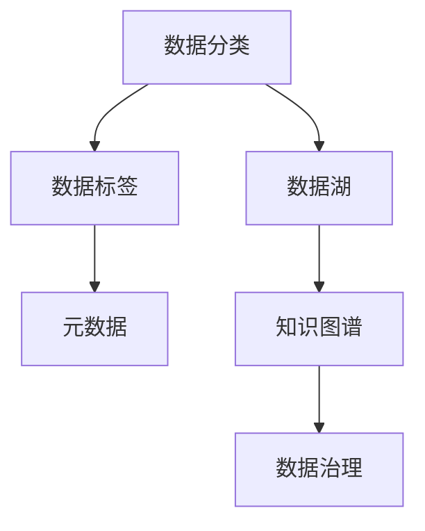

                 

# 信息组织和分类的最佳实践：如何管理你的数字资产

> 关键词：信息组织, 分类, 数字资产管理, 数据湖, 大数据, 知识图谱, 元数据, 数据治理

## 1. 背景介绍

### 1.1 问题由来
在数字化转型的大背景下，企业积累了大量数据资产，这些数据资产成为了企业的核心竞争优势。如何高效管理和利用这些数据，成为了企业关注的热点问题。数据管理不仅仅是存储和检索，更重要的是如何实现数据的有序组织和智能分类，使数据资产能够为业务决策提供有效支持。

### 1.2 问题核心关键点
信息组织和分类是大数据治理的重要组成部分，旨在将海量的数据资产进行有效管理，从而提升数据利用效率。主要核心关键点包括：

1. **数据分类和标记**：根据业务需求对数据进行分类，赋予数据标签，便于后续的数据查询和分析。
2. **元数据管理**：记录数据的基本属性和结构信息，为数据的存储、检索和利用提供依据。
3. **数据湖架构**：构建数据湖体系，整合各类数据源，形成统一的数据视图，方便数据资产的统一管理和利用。
4. **知识图谱应用**：利用知识图谱技术，对数据进行语义化关联和抽取，提升数据理解和利用效率。
5. **数据治理框架**：制定数据治理标准和规范，确保数据资产的质量和安全。

### 1.3 问题研究意义
研究信息组织和分类技术，对于提升数据资产的管理效率、降低数据管理成本、保障数据安全等方面具有重要意义：

1. 提升数据利用效率：通过科学的信息组织和分类，使数据资产更容易被业务部门理解和使用，提升数据驱动决策的能力。
2. 降低数据管理成本：规范化的数据治理能够减少数据管理中的冗余和错误，降低数据管理的复杂度和成本。
3. 保障数据安全：通过元数据管理和数据分类，可以更好地控制数据访问和使用权限，防止数据泄露和滥用。
4. 促进技术创新：信息组织和分类技术是大数据治理的重要组成部分，其创新可以推动整个数据管理和利用的进步。
5. 赋能产业升级：提升数据管理水平，可以帮助企业更高效地利用数据资产，提升业务竞争力，加速数字化转型。

## 2. 核心概念与联系

### 2.1 核心概念概述

为更好地理解信息组织和分类技术，本节将介绍几个密切相关的核心概念：

- **数据分类**：根据数据的特点和业务需求，将数据划分为不同的类别或标签。
- **数据标签**：用于描述数据的属性和特征，便于后续的数据分析和查询。
- **元数据**：记录数据的基本属性、来源、处理过程等信息，为数据管理和利用提供依据。
- **数据湖**：将不同来源、不同类型的数据集成到一个统一的数据平台上，形成统一的数据视图，方便数据管理和利用。
- **知识图谱**：利用图结构表示知识，通过对数据的语义化关联和抽取，提升数据的理解和利用效率。

这些核心概念之间的逻辑关系可以通过以下Mermaid流程图来展示：



这个流程图展示了几组概念之间的联系：

1. 数据分类和数据标签是数据管理的基础，为后续的数据利用提供依据。
2. 元数据记录了数据的基本属性，是数据管理和利用不可或缺的一部分。
3. 数据湖构建了统一的数据平台，是数据管理的核心基础设施。
4. 知识图谱通过对数据进行语义化关联和抽取，提升了数据的理解和利用效率。
5. 数据治理保证了数据的质量和安全，是数据管理的关键环节。

这些概念共同构成了数据管理的框架，使其能够有效地对数据资产进行管理和利用。通过理解这些核心概念，我们可以更好地把握数据管理工作的原理和优化方向。

## 3. 核心算法原理 & 具体操作步骤
### 3.1 算法原理概述

信息组织和分类技术，本质上是一种基于机器学习和人工智能的数据管理方法。其核心思想是通过对数据的分类、标记、标签生成等操作，将数据进行有序组织，方便后续的数据查询和利用。

形式化地，假设数据集为 $D=\{(x_i, y_i)\}_{i=1}^N$，其中 $x_i$ 表示数据样本，$y_i$ 表示数据分类标签。信息组织和分类的目标是从数据集中提取出有意义的分类规则，使得新数据能够快速准确地分类。

一般而言，信息组织和分类方法包括以下几个关键步骤：

1. 数据预处理：对原始数据进行清洗、归一化等处理，减少数据噪声，提高数据质量。
2. 特征提取：从原始数据中提取有用的特征，生成特征向量，用于后续的分类和标签生成。
3. 分类算法：使用机器学习算法（如K-means、SVM、随机森林等）对数据进行分类。
4. 标签生成：根据分类结果，自动生成数据标签，丰富数据属性信息。
5. 元数据记录：记录数据的基本属性、来源、处理过程等信息，形成数据档案。

### 3.2 算法步骤详解

以下是信息组织和分类的一般流程：

**Step 1: 数据预处理**

数据预处理是信息组织和分类的第一步，目的在于提升数据质量和数据一致性，减少后续处理过程中的错误。主要步骤如下：

1. 数据清洗：去除重复、错误、缺失的数据，减少数据噪声。
2. 数据归一化：对不同来源的数据进行标准化处理，统一数据格式和单位。
3. 数据转换：将非结构化数据转换为结构化数据，便于后续处理。
4. 数据采样：从原始数据中抽取代表性样本，用于训练和验证分类模型。

**Step 2: 特征提取**

特征提取是从原始数据中提取有用信息的过程，生成特征向量，用于后续的分类和标签生成。主要步骤如下：

1. 特征选择：选择与分类目标相关的特征，减少特征维度，提高计算效率。
2. 特征生成：对原始特征进行计算和处理，生成新的特征，增强数据的表达能力。
3. 特征降维：使用降维技术（如PCA、LDA等）减少特征维度，降低计算复杂度。
4. 特征编码：将特征转换为数值形式，便于后续机器学习算法的处理。

**Step 3: 分类算法**

分类算法是将数据划分为不同类别的关键步骤，可以使用多种机器学习算法进行分类，如K-means、SVM、随机森林等。主要步骤如下：

1. 选择合适的分类算法及其参数。
2. 使用训练集对分类算法进行训练。
3. 在验证集上评估分类算法的性能。
4. 根据评估结果调整算法参数，优化分类效果。
5. 使用测试集评估分类模型的泛化能力。

**Step 4: 标签生成**

标签生成是根据分类结果自动生成数据标签的过程，为后续的数据管理和利用提供依据。主要步骤如下：

1. 根据分类结果，生成标签向量。
2. 对标签向量进行编码，生成标签字符串。
3. 将标签字符串存储到数据档案中。
4. 更新元数据记录，记录标签生成过程。

**Step 5: 元数据记录**

元数据记录是数据管理的基础，记录数据的基本属性、来源、处理过程等信息，为数据的存储、检索和利用提供依据。主要步骤如下：

1. 确定元数据标准和规范，制定元数据架构。
2. 定义元数据记录格式和字段，确保数据一致性。
3. 自动记录元数据信息，生成元数据档案。
4. 定期更新元数据记录，保持数据最新状态。

### 3.3 算法优缺点

信息组织和分类技术具有以下优点：

1. 高效便捷：通过自动化分类和标签生成，减少人工干预，提升数据处理效率。
2. 易于维护：元数据记录和标签体系为数据管理提供了统一的标准和规范，方便后续维护。
3. 提升数据质量：通过数据清洗和标准化处理，提升数据一致性和质量，减少数据错误。
4. 增强数据理解：通过分类和标签生成，丰富数据属性信息，增强数据的理解和利用效率。
5. 降低管理成本：规范化的数据治理能够减少数据管理中的冗余和错误，降低数据管理的复杂度和成本。

同时，该技术也存在一定的局限性：

1. 对数据质量要求高：分类和标签生成的准确性依赖于数据的质量和一致性，如果数据存在噪声或错误，分类效果将大打折扣。
2. 算法依赖性强：分类算法的性能很大程度上取决于算法选择和参数设置，需要合理选择和调参。
3. 计算资源消耗大：特征提取和分类算法需要大量的计算资源，在大规模数据处理中可能面临计算瓶颈。
4. 模型泛化能力有限：分类模型在特定数据集上表现良好，但在其他数据集上泛化能力可能不足。
5. 数据隐私风险：分类和标签生成过程中可能会涉及敏感信息，需要注意数据隐私和安全性。

尽管存在这些局限性，但信息组织和分类技术仍是大数据治理中的重要手段，能够在很大程度上提升数据管理的效率和质量。

### 3.4 算法应用领域

信息组织和分类技术在各个领域都有广泛应用，具体包括：

1. **金融行业**：在金融风控、信用评估、智能投顾等领域，通过数据分类和标签生成，提升数据利用效率，增强风险控制能力。
2. **医疗行业**：在病历管理、疾病诊断、临床决策等领域，通过数据分类和标签生成，提升医疗数据管理水平，优化医疗决策过程。
3. **零售行业**：在客户分析、营销推广、库存管理等领域，通过数据分类和标签生成，提升客户理解度和运营效率。
4. **制造业**：在设备监控、质量控制、供应链管理等领域，通过数据分类和标签生成，提升生产效率和管理水平。
5. **农业领域**：在作物生长监测、土壤分析、病虫害防治等领域，通过数据分类和标签生成，提升农业生产智能化水平。

这些领域中，信息组织和分类技术都在提升数据管理和利用效率方面发挥了重要作用，促进了各行业的数字化转型。

## 4. 数学模型和公式 & 详细讲解  
### 4.1 数学模型构建

本节将使用数学语言对信息组织和分类技术的核心模型进行更加严格的刻画。

假设数据集为 $D=\{(x_i, y_i)\}_{i=1}^N$，其中 $x_i \in \mathbb{R}^d$ 表示数据样本，$y_i \in C$ 表示数据分类标签，$C$ 表示分类类别集合。分类算法的目标是从数据集中提取出有意义的分类规则，使得新数据能够快速准确地分类。

定义分类算法为 $f: \mathbb{R}^d \rightarrow C$，其中 $f$ 表示分类函数，$x$ 表示数据样本，$y$ 表示分类标签。分类算法的性能可以通过分类准确率、F1分数、ROC曲线等指标进行评估。

### 4.2 公式推导过程

以下我们以K-means算法为例，推导分类算法的核心公式。

K-means算法是一种常用的聚类算法，适用于无监督分类任务。其核心思想是将数据样本划分为 $K$ 个类别，每个类别的中心点（质心）通过数据样本的均值计算得到。假设数据集 $D$ 已经被预处理，每个数据样本 $x_i$ 被转换为 $d$ 维特征向量，分类算法 $f$ 通过计算每个数据样本 $x_i$ 与质心 $c_k$ 的欧氏距离，将其划分到距离最近的类别 $k$ 中。具体公式如下：

$$
c_k = \frac{1}{|S_k|} \sum_{x_i \in S_k} x_i
$$

$$
y_i = \arg\min_{k=1,...,K} ||x_i - c_k||_2^2
$$

其中 $S_k$ 表示属于类别 $k$ 的数据样本集合，$|| \cdot ||_2$ 表示欧氏距离。

在得到分类结果后，可以通过计算分类准确率、F1分数等指标，评估分类算法的性能。

### 4.3 案例分析与讲解

假设有一个电商平台的客户数据集，包含客户的年龄、性别、购买记录等属性。通过数据预处理和特征提取，我们可以将数据集划分为以下特征：

- 年龄（Age）：0-18, 19-30, 31-45, 46-60, 61及以上
- 性别（Gender）：男, 女, 未标明
- 购买记录（Purchase Record）：低频, 中等, 高频

我们可以使用K-means算法对数据进行分类，将客户划分为不同的消费群体。假设我们选择了3个聚类中心，每个聚类中心的坐标表示如下：

- 聚类中心1（Cluster 1）：年龄31-45, 性别男, 购买记录中等
- 聚类中心2（Cluster 2）：年龄19-30, 性别女, 购买记录高频
- 聚类中心3（Cluster 3）：年龄0-18, 性别未标明, 购买记录低频

通过计算每个客户数据样本与聚类中心的距离，我们可以将其划分到距离最近的聚类中心，得到如下分类结果：

- 客户1：Cluster 1
- 客户2：Cluster 2
- 客户3：Cluster 3

这些分类结果可以用于后续的客户分析、个性化营销等任务，提升电商平台的运营效率和客户满意度。

## 5. 项目实践：代码实例和详细解释说明
### 5.1 开发环境搭建

在进行信息组织和分类实践前，我们需要准备好开发环境。以下是使用Python进行Scikit-Learn开发的环境配置流程：

1. 安装Anaconda：从官网下载并安装Anaconda，用于创建独立的Python环境。

2. 创建并激活虚拟环境：
```bash
conda create -n info-class python=3.8 
conda activate info-class
```

3. 安装Scikit-Learn：
```bash
pip install scikit-learn pandas numpy matplotlib
```

4. 安装各类工具包：
```bash
pip install scikit-learn pandas numpy matplotlib tqdm jupyter notebook ipython
```

完成上述步骤后，即可在`info-class`环境中开始信息组织和分类实践。

### 5.2 源代码详细实现

下面我们以电商平台的客户数据集为例，给出使用Scikit-Learn对K-means算法进行信息组织和分类的Python代码实现。

首先，定义数据处理函数：

```python
from sklearn.preprocessing import LabelEncoder
from sklearn.cluster import KMeans
import pandas as pd
import numpy as np

def process_data(data_path):
    # 读取数据
    data = pd.read_csv(data_path)
    
    # 数据清洗和归一化
    data = data.dropna()
    data['Age'] = pd.cut(data['Age'], bins=[0, 18, 30, 45, 60, 180], labels=['<18', '18-30', '31-45', '46-60', '>60'])
    data['Gender'] = LabelEncoder().fit_transform(data['Gender'])
    data['Purchase Record'] = LabelEncoder().fit_transform(data['Purchase Record'])
    
    return data
```

然后，定义分类算法：

```python
def kmeans_clustering(data, num_clusters=3):
    # 特征选择
    X = data[['Age', 'Gender', 'Purchase Record']]
    
    # K-means分类
    kmeans = KMeans(n_clusters=num_clusters, random_state=42)
    kmeans.fit(X)
    
    # 标签生成
    labels = kmeans.predict(X)
    return labels
```

最后，启动分类流程并在数据集上评估：

```python
data = process_data('customer_data.csv')
labels = kmeans_clustering(data)
```

以上就是使用Scikit-Learn对K-means算法进行信息组织和分类的完整代码实现。可以看到，借助Scikit-Learn，我们可以用相对简洁的代码完成K-means算法的实现。

### 5.3 代码解读与分析

让我们再详细解读一下关键代码的实现细节：

**process_data函数**：
- `__init__`方法：读取原始数据，并进行数据清洗和归一化处理，包括去重、缺失值处理、特征编码等。

**kmeans_clustering函数**：
- `__init__`方法：定义特征选择和K-means分类的关键步骤。
- 使用LabelEncoder对性别和购买记录进行特征编码，生成数值型特征。
- 使用K-means算法对数据进行分类，返回分类结果。

**数据处理和特征提取**：
- 数据预处理：通过去重、缺失值处理、特征编码等操作，提升数据质量和一致性。
- 特征选择：选择与分类目标相关的特征，减少特征维度，提高计算效率。
- 特征编码：将特征转换为数值形式，便于后续机器学习算法的处理。

**分类算法和标签生成**：
- 分类算法：使用K-means算法对数据进行分类，返回分类结果。
- 标签生成：根据分类结果，自动生成标签，丰富数据属性信息。

**数据治理和元数据记录**：
- 元数据记录：定义元数据标准和规范，自动记录元数据信息，生成元数据档案。
- 数据治理：制定数据治理标准和规范，确保数据的质量和安全。

## 6. 实际应用场景
### 6.1 金融风险管理

在金融风控领域，信息组织和分类技术可以用于客户风险评估、信用评分、欺诈检测等任务。通过数据分类和标签生成，可以更准确地识别高风险客户，提升风险管理能力。

具体而言，可以收集客户的各类金融数据，如信用记录、贷款信息、交易记录等，利用信息组织和分类技术对数据进行分类和标签生成。例如，可以使用K-means算法将客户划分为高风险、中风险和低风险三类，并自动生成标签。通过这些标签，可以构建客户风险评估模型，预测客户的违约风险，提前采取防范措施。

### 6.2 医疗健康管理

在医疗领域，信息组织和分类技术可以用于病历管理、疾病诊断、临床决策等任务。通过数据分类和标签生成，可以提高医疗数据管理水平，优化医疗决策过程。

具体而言，可以收集患者的各类医疗数据，如病历记录、检验结果、治疗方案等，利用信息组织和分类技术对数据进行分类和标签生成。例如，可以使用层次聚类算法将病历记录划分为不同的疾病类型，并自动生成标签。通过这些标签，可以构建疾病诊断模型，预测患者的疾病风险，优化治疗方案，提升医疗服务质量。

### 6.3 智能推荐系统

在零售和电商领域，信息组织和分类技术可以用于客户分析、个性化推荐等任务。通过数据分类和标签生成，可以提升客户理解度和运营效率。

具体而言，可以收集客户的各类行为数据，如浏览记录、购买记录、评价反馈等，利用信息组织和分类技术对数据进行分类和标签生成。例如，可以使用K-means算法将客户划分为不同的消费群体，并自动生成标签。通过这些标签，可以构建客户行为分析模型，预测客户的消费倾向，优化推荐策略，提升客户满意度。

### 6.4 未来应用展望

随着数据量和数据类型的多样化，信息组织和分类技术将在大数据治理中发挥越来越重要的作用。未来，该技术将呈现以下几个发展趋势：

1. 数据分类和标签生成自动化：利用机器学习算法和自动化技术，进一步提升数据分类和标签生成的自动化水平，减少人工干预。
2. 元数据管理智能化：通过知识图谱和语义分析技术，提升元数据管理水平，增强数据的理解和使用效率。
3. 数据治理标准化：制定统一的数据治理标准和规范，提高数据管理的一致性和可靠性。
4. 跨领域数据融合：利用数据湖和联邦学习技术，实现跨领域数据的融合和利用，提升数据治理的灵活性和效率。
5. 数据隐私保护：通过数据加密、差分隐私等技术，保护数据隐私和安全，保障数据治理的合规性和合法性。

这些趋势将推动信息组织和分类技术不断进步，提升数据管理的效率和质量，为各行业的数字化转型提供有力支持。

## 7. 工具和资源推荐
### 7.1 学习资源推荐

为了帮助开发者系统掌握信息组织和分类技术的理论基础和实践技巧，这里推荐一些优质的学习资源：

1. 《Python数据科学手册》：由Jake VanderPlas等编写的经典书籍，详细介绍了Python在数据科学中的应用，包括数据清洗、特征提取、分类算法等。
2. 《机器学习实战》：由Peter Harrington编写的实战教程，通过具体案例展示了机器学习算法的应用，包括K-means、SVM、决策树等。
3. 《数据科学导论》：由Jeffrey Bilmes等编写的入门书籍，涵盖了数据科学的基本概念和核心技术，包括数据预处理、特征提取、分类算法等。
4. 《Python机器学习》：由Sebastian Raschka等编写的实战指南，通过具体代码展示了机器学习算法的应用，包括数据预处理、特征提取、分类算法等。
5. 《Python深度学习》：由Francois Chollet等编写的实战教程，通过具体代码展示了深度学习算法的应用，包括卷积神经网络、循环神经网络等。

通过对这些资源的学习实践，相信你一定能够快速掌握信息组织和分类技术的精髓，并用于解决实际的NLP问题。

### 7.2 开发工具推荐

高效的开发离不开优秀的工具支持。以下是几款用于信息组织和分类开发的常用工具：

1. Scikit-Learn：Python中的机器学习库，提供了丰富的分类算法和工具，易于上手和扩展。
2. Pandas：Python中的数据处理库，提供了灵活的数据结构和数据操作工具，方便数据预处理和特征提取。
3. NumPy：Python中的数值计算库，提供了高效的多维数组操作和数学函数，适合进行数据计算和特征生成。
4. Matplotlib：Python中的绘图库，提供了丰富的绘图功能，方便数据可视化。
5. Jupyter Notebook：Python中的交互式笔记本，支持代码块、文本、图像等元素的嵌入，方便编写和分享数据科学项目。
6. TensorFlow：Google主导的深度学习框架，支持分布式计算和自动微分，适合进行大规模数据处理和模型训练。

合理利用这些工具，可以显著提升信息组织和分类任务的开发效率，加快创新迭代的步伐。

### 7.3 相关论文推荐

信息组织和分类技术的研究源于学界的持续研究。以下是几篇奠基性的相关论文，推荐阅读：

1. "K-means: Algorithms and applications"：由J.D. MacQueen提出的经典聚类算法，详细介绍了K-means算法的基本原理和应用。
2. "SVM: Support-vector machines"：由Cortes和Vapnik提出的支持向量机算法，详细介绍了SVM算法的原理和应用。
3. "A simple framework for clustering analysis using Python"：由Scikit-Learn团队发布的Python聚类框架，详细介绍了各种聚类算法的实现和应用。
4. "Deep learning for unsupervised feature learning"：由Bengio等提出的深度学习算法，详细介绍了深度学习在特征提取和分类任务中的应用。
5. "Knowledge graph embedding and its application to recommendation systems"：由Bordes等提出的知识图谱算法，详细介绍了知识图谱在推荐系统中的应用。

这些论文代表了大数据治理技术的发展脉络。通过学习这些前沿成果，可以帮助研究者把握学科前进方向，激发更多的创新灵感。

## 8. 总结：未来发展趋势与挑战
### 8.1 总结

本文对信息组织和分类技术进行了全面系统的介绍。首先阐述了数据组织和分类的背景和意义，明确了信息组织和分类技术在大数据治理中的重要性。其次，从原理到实践，详细讲解了信息组织和分类的数学原理和关键步骤，给出了信息组织和分类任务开发的完整代码实例。同时，本文还广泛探讨了信息组织和分类技术在金融、医疗、零售等多个行业领域的应用前景，展示了信息组织和分类技术的广泛应用价值。此外，本文精选了信息组织和分类技术的各类学习资源，力求为读者提供全方位的技术指引。

通过本文的系统梳理，可以看到，信息组织和分类技术在大数据治理中的重要性，能够有效地提升数据资产的管理效率，降低数据管理成本，保障数据安全。未来，随着数据量的不断增加和数据类型的日益多样化，信息组织和分类技术将迎来更广阔的应用场景，成为大数据治理中的重要工具。

### 8.2 未来发展趋势

展望未来，信息组织和分类技术将呈现以下几个发展趋势：

1. 数据治理标准化：制定统一的数据治理标准和规范，提高数据管理的一致性和可靠性。
2. 元数据管理智能化：通过知识图谱和语义分析技术，提升元数据管理水平，增强数据的理解和使用效率。
3. 数据分类和标签生成自动化：利用机器学习算法和自动化技术，进一步提升数据分类和标签生成的自动化水平，减少人工干预。
4. 跨领域数据融合：利用数据湖和联邦学习技术，实现跨领域数据的融合和利用，提升数据治理的灵活性和效率。
5. 数据隐私保护：通过数据加密、差分隐私等技术，保护数据隐私和安全，保障数据治理的合规性和合法性。

这些趋势将推动信息组织和分类技术不断进步，提升数据管理的效率和质量，为各行业的数字化转型提供有力支持。

### 8.3 面临的挑战

尽管信息组织和分类技术已经取得了一定的成就，但在迈向更加智能化、普适化应用的过程中，仍面临诸多挑战：

1. 数据质量瓶颈：数据分类和标签生成的准确性依赖于数据的质量和一致性，如果数据存在噪声或错误，分类效果将大打折扣。
2. 算法依赖性强：分类算法的性能很大程度上取决于算法选择和参数设置，需要合理选择和调参。
3. 计算资源消耗大：特征提取和分类算法需要大量的计算资源，在大规模数据处理中可能面临计算瓶颈。
4. 模型泛化能力有限：分类模型在特定数据集上表现良好，但在其他数据集上泛化能力可能不足。
5. 数据隐私风险：分类和标签生成过程中可能会涉及敏感信息，需要注意数据隐私和安全性。

尽管存在这些挑战，但信息组织和分类技术仍是大数据治理中的重要手段，能够在很大程度上提升数据管理的效率和质量。

### 8.4 研究展望

面对信息组织和分类技术所面临的种种挑战，未来的研究需要在以下几个方面寻求新的突破：

1. 探索无监督和半监督分类方法：摆脱对大规模标注数据的依赖，利用自监督学习、主动学习等无监督和半监督范式，最大限度利用非结构化数据，实现更加灵活高效的分类。
2. 研究参数高效和计算高效的分类范式：开发更加参数高效的分类方法，在固定大部分预训练参数的同时，只更新极少量的任务相关参数。同时优化分类算法的计算图，减少前向传播和反向传播的资源消耗，实现更加轻量级、实时性的部署。
3. 融合因果和对比学习范式：通过引入因果推断和对比学习思想，增强分类模型建立稳定因果关系的能力，学习更加普适、鲁棒的语言表征，从而提升模型泛化性和抗干扰能力。
4. 引入更多先验知识：将符号化的先验知识，如知识图谱、逻辑规则等，与神经网络模型进行巧妙融合，引导分类过程学习更准确、合理的语言模型。同时加强不同模态数据的整合，实现视觉、语音等多模态信息与文本信息的协同建模。
5. 结合因果分析和博弈论工具：将因果分析方法引入分类模型，识别出模型决策的关键特征，增强输出解释的因果性和逻辑性。借助博弈论工具刻画人机交互过程，主动探索并规避模型的脆弱点，提高系统稳定性。

这些研究方向的探索，必将引领信息组织和分类技术迈向更高的台阶，为构建安全、可靠、可解释、可控的智能系统铺平道路。面向未来，信息组织和分类技术还需要与其他人工智能技术进行更深入的融合，如知识表示、因果推理、强化学习等，多路径协同发力，共同推动自然语言理解和智能交互系统的进步。只有勇于创新、敢于突破，才能不断拓展信息组织和分类技术的边界，让智能技术更好地造福人类社会。

## 9. 附录：常见问题与解答

**Q1：信息组织和分类技术是否适用于所有数据类型？**

A: 信息组织和分类技术适用于大多数结构化和半结构化数据类型，如表格数据、文本数据、图像数据等。但对于非结构化数据，如视频、音频等，需要额外的预处理步骤，才能进行分类和标签生成。

**Q2：数据分类和标签生成的准确性如何保证？**

A: 数据分类和标签生成的准确性依赖于数据的质量和一致性。一般而言，数据预处理和特征提取步骤是保证分类和标签生成准确性的关键。需要采取去重、缺失值处理、特征编码等操作，提升数据质量和一致性。同时，选择合适的分类算法及其参数，对分类结果进行评估和调参，以提升分类效果。

**Q3：信息组织和分类技术是否需要大量标注数据？**

A: 信息组织和分类技术在某种程度上依赖于标注数据，但可以通过无监督和半监督学习方法，最大化利用非结构化数据。例如，可以使用自监督学习、主动学习等方法，在少量标注数据的基础上，通过数据增强和模型优化，提升分类效果。

**Q4：如何应对数据隐私风险？**

A: 数据隐私风险是信息组织和分类技术需要重点考虑的问题。在数据分类和标签生成过程中，需要采取数据脱敏、差分隐私等措施，保护数据隐私和安全。同时，在元数据记录和数据治理过程中，需要制定数据使用规范和权限控制机制，确保数据使用的合法性和合规性。

**Q5：信息组织和分类技术在企业中的应用场景有哪些？**

A: 信息组织和分类技术在企业中的应用场景广泛，包括客户分析、营销推广、风险管理、供应链管理等。例如，在金融风控中，可以用于客户风险评估和信用评分；在医疗健康中，可以用于病历管理和疾病诊断；在零售电商中，可以用于个性化推荐和客户行为分析。

通过本文的系统梳理，可以看到，信息组织和分类技术在大数据治理中的重要性，能够有效地提升数据资产的管理效率，降低数据管理成本，保障数据安全。未来，随着数据量和数据类型的多样化，信息组织和分类技术将迎来更广阔的应用场景，成为大数据治理中的重要工具。

