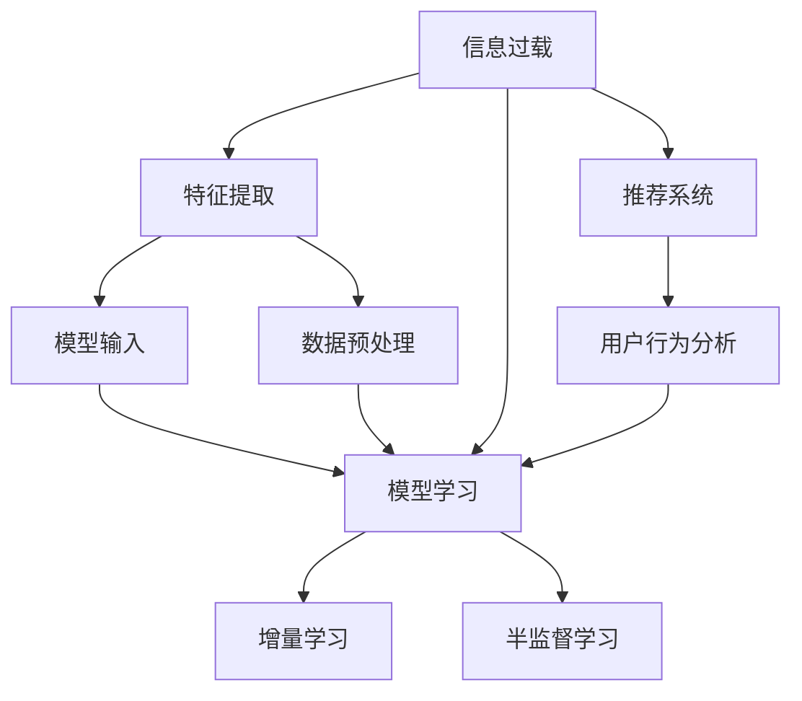

                 

## 1. 背景介绍

### 1.1 问题由来
在信息时代，我们每天都在接触海量信息，但真正有价值的信息往往只占其中很小一部分。如何有效筛选、处理和利用这些信息，已成为信息时代的重要课题。当前，信息过载问题在社会各个领域都日益凸显，如社交媒体、商业智能、智能搜索等，对信息筛选技术的需求不断增长。

### 1.2 问题核心关键点
信息筛选技术的核心在于从大量的数据中识别、提取、聚合和展示有价值的信息。常见方法包括基于规则、基于模型和基于推荐系统的筛选。

- 基于规则的筛选：通过定义一系列明确的筛选规则，对数据进行过滤。如关键词匹配、时间戳过滤等。
- 基于模型的筛选：使用机器学习模型对数据进行特征提取和分类，识别出有价值的信息。
- 基于推荐系统的筛选：根据用户兴趣和历史行为，推荐最相关的内容。

这些方法各有优劣，适用于不同的应用场景。基于模型的筛选因其具备自学习能力，能够发现隐含的模式和规律，成为当前信息筛选技术的主要研究热点。

### 1.3 问题研究意义
有效的信息筛选技术能够显著提升信息处理效率，降低信息过载带来的决策成本，优化信息获取体验，是信息时代实现智慧化管理和个性化服务的基础。

## 2. 核心概念与联系

### 2.1 核心概念概述

为了更好地理解信息筛选技术的原理和架构，本节将介绍几个关键概念：

- 信息过载：在信息时代，信息量远超个体处理能力，导致难以获取和处理有价值信息的现象。
- 特征提取(Feature Extraction)：从原始数据中提取有意义的特征，用于机器学习模型的输入。
- 模型学习(Model Learning)：通过数据训练学习模型参数，以实现对数据的自动分析和筛选。
- 推荐系统(Recommendation System)：通过用户行为分析，推荐个性化的信息内容。
- 增量学习(Online Learning)：在数据不断增加的情况下，动态更新模型参数，保持模型的自适应能力。
- 半监督学习(Semi-Supervised Learning)：利用少量标注数据和大量未标注数据，训练高效筛选模型。

这些概念之间有紧密的联系，共同构成了信息筛选技术的核心框架。

### 2.2 核心概念原理和架构的 Mermaid 流程图(Mermaid 流程节点中不要有括号、逗号等特殊字符)


该流程图展示了信息过载问题的解决路径，从特征提取到模型学习，再到推荐系统，逐步筛选出有价值的信息。

## 3. 核心算法原理 & 具体操作步骤

### 3.1 算法原理概述

信息筛选技术的核心思想是通过学习数据特征，构建模型，实现自动筛选和推荐。其主要算法原理如下：

1. 数据预处理：对原始数据进行清洗、标准化、归一化等处理，便于后续特征提取和模型训练。
2. 特征提取：利用统计学、机器学习等方法，从原始数据中提取出有意义的特征，用于模型输入。
3. 模型训练：使用机器学习算法（如分类、回归、聚类等），训练出能够识别有价值信息的模型。
4. 模型评估：通过交叉验证、测试集等方法，评估模型的准确性和泛化能力。
5. 模型应用：将训练好的模型应用到实际数据中，实现信息筛选和推荐。

### 3.2 算法步骤详解

信息筛选技术的实施过程通常包括以下关键步骤：

**Step 1: 数据收集与预处理**

1. 确定筛选目标：明确需要筛选的数据类型、来源和标准。
2. 数据收集：从不同渠道收集数据，如Web爬虫、API接口、数据库等。
3. 数据清洗：去除噪声、处理缺失值、去除重复数据等。
4. 数据标准化：统一数据格式和单位，便于后续处理。
5. 数据归一化：将不同尺度的数据转换到相同范围，如0-1之间。

**Step 2: 特征提取**

1. 确定特征维度：根据任务需求，选择合适数量的特征维度。
2. 特征提取算法：利用统计学方法（如均值、方差）、机器学习方法（如PCA、LDA）、深度学习方法（如CNN、RNN）等提取特征。
3. 特征选择：通过特征选择算法（如信息增益、相关系数、嵌入式选择等）选择最优特征。
4. 特征工程：对提取出的特征进行组合、变换、归一化等操作，增强特征表达能力。

**Step 3: 模型训练与评估**

1. 模型选择：根据任务类型，选择合适的机器学习模型，如分类、回归、聚类等。
2. 数据划分：将数据划分为训练集、验证集和测试集，便于模型训练和评估。
3. 模型训练：使用训练集数据，利用梯度下降等优化算法训练模型参数。
4. 模型评估：在验证集上评估模型性能，选择最优模型。
5. 超参数调优：通过网格搜索、随机搜索等方法优化模型超参数。

**Step 4: 模型应用与优化**

1. 模型部署：将训练好的模型部署到实际应用系统中，进行信息筛选和推荐。
2. 实时更新：根据新增数据实时更新模型，保持模型自适应能力。
3. 模型监控：实时监控模型性能，及时发现和修复问题。
4. 反馈机制：根据用户反馈，不断优化模型，提升筛选效果。

### 3.3 算法优缺点

基于机器学习的筛选技术具有以下优点：
1. 自动化程度高：能够自动学习和筛选数据，减轻人工干预。
2. 适应性强：能够处理不同类型、规模的数据，灵活应用。
3. 泛化能力强：能够在不同数据集上表现稳定，具备推广能力。
4. 准确度高：通过优化模型，可以获得高精度的筛选结果。

同时，该方法也存在一定的局限性：
1. 依赖高质量标注数据：模型的训练需要大量标注数据，数据质量直接影响模型性能。
2. 模型复杂度高：特征提取和模型训练过程中，涉及大量计算和存储，需要高性能设备。
3. 黑盒特性：模型内部机制难以解释，难以进行透明和可控的调整。
4. 数据分布假设：模型的训练和应用过程中，对数据分布假设可能存在偏差。

尽管存在这些局限性，但机器学习模型仍然是当前信息筛选技术的主流范式，广泛应用于推荐系统、搜索引擎、商业智能等领域。未来相关研究的重点在于如何降低数据标注成本，提高模型鲁棒性，增强模型可解释性。

### 3.4 算法应用领域

基于机器学习的筛选技术在多个领域得到广泛应用，如：

- 搜索引擎：通过关键词匹配和点击反馈，实现信息检索和推荐。
- 推荐系统：根据用户行为和偏好，推荐个性化内容，提升用户体验。
- 商业智能：从大量数据中挖掘商业洞察，辅助决策制定。
- 舆情分析：分析社会媒体上的舆论动向，识别热点事件和趋势。
- 金融分析：从新闻和财经数据中提取有价值信息，辅助投资决策。
- 健康监测：从医疗记录中提取健康指标，进行疾病诊断和治疗。

这些应用展示了信息筛选技术在实际场景中的广泛应用，为信息时代的智能管理和决策提供了有力支持。

## 4. 数学模型和公式 & 详细讲解 & 举例说明

### 4.1 数学模型构建

基于机器学习的筛选技术通常构建在如下数学模型中：

$$
y = f(x; \theta)
$$

其中 $y$ 表示筛选结果（如点击率、购买率、阅读量等），$x$ 表示输入数据特征，$f$ 表示模型函数，$\theta$ 表示模型参数。

模型的目标是最小化损失函数 $\mathcal{L}(\theta)$，以获得最优参数。常见的损失函数包括均方误差（MSE）、交叉熵（CE）、对数损失（LogLoss）等。

### 4.2 公式推导过程

以二分类问题为例，假设模型的输出为概率值 $p(y=1|x;\theta)$，则二分类交叉熵损失函数为：

$$
\mathcal{L}(\theta) = -\frac{1}{N}\sum_{i=1}^N (y_i \log p(y_i=1|x_i;\theta) + (1-y_i) \log p(y_i=0|x_i;\theta))
$$

其中 $y_i \in \{0,1\}$ 表示样本的真实标签，$x_i$ 表示输入特征。

在得到损失函数后，利用梯度下降等优化算法更新模型参数：

$$
\theta \leftarrow \theta - \eta \nabla_{\theta}\mathcal{L}(\theta)
$$

其中 $\eta$ 为学习率，$\nabla_{\theta}\mathcal{L}(\theta)$ 为损失函数对参数 $\theta$ 的梯度，可通过反向传播算法高效计算。

### 4.3 案例分析与讲解

以推荐系统为例，假设推荐模型的目标是最小化预测点击率 $p(y=1|x;\theta)$ 与真实点击率 $y_i$ 之间的均方误差（MSE）：

$$
\mathcal{L}(\theta) = \frac{1}{N}\sum_{i=1}^N (y_i - p(y_i=1|x_i;\theta))^2
$$

为了计算梯度 $\nabla_{\theta}\mathcal{L}(\theta)$，需要定义点击率 $p(y_i=1|x_i;\theta)$ 的预测模型，如逻辑回归、SVM、神经网络等。

以神经网络为例，点击率的预测模型为：

$$
p(y_i=1|x_i;\theta) = \sigma(\sum_{j=1}^d w_j x_{ij} + b)
$$

其中 $\sigma$ 为激活函数，$w_j$ 为权重，$b$ 为偏置。

利用链式法则，计算梯度：

$$
\frac{\partial \mathcal{L}(\theta)}{\partial w_j} = -\frac{2}{N}\sum_{i=1}^N (y_i - p(y_i=1|x_i;\theta))x_{ij}
$$

通过反向传播算法更新权重 $w_j$，完成模型的迭代优化。

## 5. 项目实践：代码实例和详细解释说明

### 5.1 开发环境搭建

在进行信息筛选技术实践前，我们需要准备好开发环境。以下是使用Python进行Scikit-learn和TensorFlow开发的Python环境配置流程：

1. 安装Anaconda：从官网下载并安装Anaconda，用于创建独立的Python环境。

2. 创建并激活虚拟环境：
```bash
conda create -n pythonsklearn python=3.8 
conda activate pythonsklearn
```

3. 安装Scikit-learn：
```bash
pip install scikit-learn
```

4. 安装TensorFlow：
```bash
pip install tensorflow
```

5. 安装各类工具包：
```bash
pip install numpy pandas scikit-learn matplotlib tqdm jupyter notebook ipython
```

完成上述步骤后，即可在`pythonsklearn`环境中开始信息筛选技术开发。

### 5.2 源代码详细实现

下面我们以推荐系统为例，给出使用Scikit-learn和TensorFlow对推荐模型进行训练和调优的Python代码实现。

首先，定义数据处理函数：

```python
import pandas as pd
from sklearn.model_selection import train_test_split

# 读取数据
df = pd.read_csv('data.csv')

# 特征选择
df = df.drop(['id', 'timestamp'], axis=1)

# 数据划分
X_train, X_test, y_train, y_test = train_test_split(df.drop('label', axis=1), df['label'], test_size=0.2, random_state=42)

# 特征归一化
from sklearn.preprocessing import StandardScaler
scaler = StandardScaler()
X_train = scaler.fit_transform(X_train)
X_test = scaler.transform(X_test)
```

然后，定义模型训练函数：

```python
from tensorflow.keras.layers import Input, Dense, Dropout
from tensorflow.keras.models import Model
from tensorflow.keras.optimizers import Adam
from tensorflow.keras.losses import BinaryCrossentropy

# 定义模型架构
input_layer = Input(shape=(X_train.shape[1],), name='input')
hidden_layer = Dense(64, activation='relu')(input_layer)
hidden_layer = Dropout(0.2)(hidden_layer)
output_layer = Dense(1, activation='sigmoid')(hidden_layer)

model = Model(inputs=input_layer, outputs=output_layer)

# 定义损失函数和优化器
loss = BinaryCrossentropy()
optimizer = Adam(lr=0.001)

# 编译模型
model.compile(optimizer=optimizer, loss=loss)

# 训练模型
model.fit(X_train, y_train, epochs=10, batch_size=64, validation_data=(X_test, y_test))
```

最后，进行模型评估和预测：

```python
from sklearn.metrics import roc_auc_score

# 评估模型
y_pred = model.predict_proba(X_test)
roc_auc = roc_auc_score(y_test, y_pred[:, 1])
print(f'ROC AUC: {roc_auc:.4f}')

# 使用模型进行推荐
new_data = pd.read_csv('new_data.csv')
new_data = new_data.drop(['id', 'timestamp'], axis=1)
new_data = scaler.transform(new_data)
predictions = model.predict_proba(new_data)[:, 1]
print(f'Predictions: {predictions.tolist()[:5]}')
```

以上就是使用Scikit-learn和TensorFlow进行推荐系统训练和预测的完整代码实现。可以看到，代码实现了从数据处理、模型训练到评估预测的全过程。

### 5.3 代码解读与分析

让我们再详细解读一下关键代码的实现细节：

**数据处理函数**：
- `read_csv`方法读取数据集，选择特征列。
- `drop`方法去除不必要的特征列。
- `train_test_split`方法将数据集划分为训练集和测试集。
- `StandardScaler`方法对特征进行标准化处理。

**模型训练函数**：
- `Input`层定义模型输入。
- `Dense`层定义隐含层。
- `Dropout`层防止过拟合。
- `Dense`层定义输出层。
- `Model`层定义完整的模型。
- `BinaryCrossentropy`定义损失函数。
- `Adam`定义优化器。
- `compile`方法编译模型。
- `fit`方法训练模型。

**模型评估和预测**：
- `roc_auc_score`方法计算ROC-AUC值，评估模型性能。
- `predict_proba`方法进行概率预测。

可以看到，代码实现了从数据预处理、模型训练到模型评估的完整流程，展示了Scikit-learn和TensorFlow的强大能力。

## 6. 实际应用场景

### 6.1 智能推荐系统

智能推荐系统是信息筛选技术的重要应用场景，通过分析用户行为和兴趣，推荐个性化的内容，提升用户体验。在电商、社交媒体、新闻门户等领域，推荐系统已经广泛应用，极大地提升了用户满意度和平台收益。

在技术实现上，可以通过收集用户浏览、点击、购买等行为数据，构建用户画像，预测用户对新商品的兴趣，实现智能推荐。

### 6.2 搜索引擎

搜索引擎通过关键词匹配和点击反馈，实现信息的快速检索和推荐。Google、Bing等主流搜索引擎都是基于机器学习的信息筛选技术实现的。

在技术实现上，搜索引擎通过TF-IDF、BM25等算法计算关键词权重，将用户输入的查询与网页内容进行匹配，推荐最相关的结果。

### 6.3 舆情分析

舆情分析通过文本挖掘和情感分析，识别社会媒体上的热点事件和舆论趋势。政治、经济、文化等领域的舆情分析，为政府和企业的决策提供重要参考。

在技术实现上，可以通过收集新闻、评论、社交媒体等文本数据，构建情感词典和实体识别模型，分析文本情感和主题，预测事件趋势。

### 6.4 金融分析

金融分析通过从新闻和财经数据中提取有价值信息，辅助投资决策。股市、外汇、期货等领域都需要依靠机器学习模型进行实时分析。

在技术实现上，可以通过构建股票价格预测模型、市场情绪分析模型、事件驱动分析模型等，提供实时交易建议和风险预警。

## 7. 工具和资源推荐

### 7.1 学习资源推荐

为了帮助开发者系统掌握信息筛选技术的理论基础和实践技巧，这里推荐一些优质的学习资源：

1. 《Python数据科学手册》系列博文：由数据科学专家撰写，深入浅出地介绍了Python在数据科学中的应用，包括机器学习、数据处理等。

2. 斯坦福大学CS229课程：斯坦福大学开设的机器学习课程，涵盖机器学习原理和算法，是入门机器学习的经典课程。

3. 《深度学习》书籍：Ian Goodfellow等专家所著，全面介绍了深度学习的基本概念和前沿技术，包括信息筛选技术。

4. Kaggle平台：世界著名的数据科学竞赛平台，提供丰富的数据集和竞赛题目，实战锻炼数据处理和模型优化能力。

5. GitHub开源项目：大量优秀的开源项目提供了详细的代码实现和文档，是学习和实践信息筛选技术的好资源。

通过对这些资源的学习实践，相信你一定能够快速掌握信息筛选技术的精髓，并用于解决实际的信息处理问题。

### 7.2 开发工具推荐

高效的开发离不开优秀的工具支持。以下是几款用于信息筛选技术开发的常用工具：

1. Scikit-learn：基于Python的机器学习库，提供了丰富的机器学习算法和工具，是数据科学项目开发的必备工具。

2. TensorFlow：由Google主导开发的深度学习框架，支持分布式计算，适合大规模工程应用。

3. PyTorch：由Facebook主导开发的深度学习框架，支持动态图，适合快速原型开发和研究。

4. Weights & Biases：模型训练的实验跟踪工具，可以记录和可视化模型训练过程中的各项指标，方便对比和调优。

5. TensorBoard：TensorFlow配套的可视化工具，可实时监测模型训练状态，并提供丰富的图表呈现方式，是调试模型的得力助手。

6. Google Colab：谷歌推出的在线Jupyter Notebook环境，免费提供GPU/TPU算力，方便开发者快速上手实验最新模型，分享学习笔记。

合理利用这些工具，可以显著提升信息筛选技术的开发效率，加快创新迭代的步伐。

### 7.3 相关论文推荐

信息筛选技术的研究源于学界的持续研究。以下是几篇奠基性的相关论文，推荐阅读：

1. 《An Overview of Recommendation Systems》：P.K. Kelkar等专家综述了推荐系统的发展历程和分类，是了解推荐系统的经典文献。

2. 《Information Retrieval: Introduction and Evaluation》：Christopher Manning等专家介绍了信息检索的基本概念和评价指标，是了解信息检索的重要文献。

3. 《Probabilistic Methods for Active Learning》：John Platt等专家综述了主动学习的方法和技术，是了解主动学习的重要文献。

4. 《Deep Learning for Recommender Systems: A Survey and Outlook》：Jian Zhou等专家综述了深度学习在推荐系统中的应用，是了解深度学习在信息筛选技术中的应用的经典文献。

这些论文代表了大语言模型微调技术的发展脉络。通过学习这些前沿成果，可以帮助研究者把握学科前进方向，激发更多的创新灵感。

## 8. 总结：未来发展趋势与挑战

### 8.1 总结

本文对信息筛选技术进行了全面系统的介绍。首先阐述了信息过载问题的背景和意义，明确了筛选技术在信息时代的重要价值。其次，从原理到实践，详细讲解了信息筛选技术的数学模型和实现步骤，给出了信息筛选技术开发的完整代码实例。同时，本文还广泛探讨了信息筛选技术在推荐系统、搜索引擎、舆情分析、金融分析等多个行业领域的应用前景，展示了筛选技术在实际场景中的广泛应用。最后，本文精选了信息筛选技术的各类学习资源，力求为读者提供全方位的技术指引。

通过本文的系统梳理，可以看到，信息筛选技术在信息时代具有广阔的应用前景，为智慧化管理和个性化服务提供了重要支持。

### 8.2 未来发展趋势

展望未来，信息筛选技术将呈现以下几个发展趋势：

1. 智能化程度提升。通过引入自然语言处理、语音识别、视觉识别等技术，信息筛选系统将具备更强的多模态处理能力，提升用户体验。

2. 自适应能力增强。通过引入增量学习、半监督学习等技术，信息筛选模型能够动态更新，适应数据分布变化，提升鲁棒性。

3. 多任务协同优化。通过引入跨任务协同学习技术，信息筛选模型能够同时优化多个筛选任务，提升综合性能。

4. 个性化推荐提升。通过引入协同过滤、矩阵分解等技术，信息筛选模型能够更加准确地预测用户兴趣，提升个性化推荐效果。

5. 实时性要求提高。通过引入流式处理技术，信息筛选系统能够在实时数据流中进行筛选，提升响应速度和处理能力。

6. 数据隐私保护加强。通过引入差分隐私、联邦学习等技术，信息筛选系统能够保护用户数据隐私，确保数据安全。

以上趋势凸显了信息筛选技术的未来发展方向，这些方向的探索发展，必将进一步提升信息处理效率，降低信息过载带来的决策成本，优化信息获取体验，为信息时代的智能管理和个性化服务提供坚实基础。

### 8.3 面临的挑战

尽管信息筛选技术已经取得了显著进展，但在迈向更加智能化、普适化应用的过程中，它仍面临着诸多挑战：

1. 数据分布假设。模型的训练和应用过程中，对数据分布假设可能存在偏差，导致模型泛化能力下降。

2. 数据质量和标注成本。高质量标注数据是模型训练的前提，但标注成本高昂，难以大规模获取。

3. 模型复杂度和计算资源。特征提取和模型训练过程中，涉及大量计算和存储，需要高性能设备。

4. 模型可解释性。信息筛选模型的内部机制难以解释，难以进行透明和可控的调整。

5. 数据隐私和安全。信息筛选系统需要处理大量用户数据，数据隐私和安全问题不容忽视。

6. 模型鲁棒性和公平性。模型在面对数据扰动、对抗攻击等情况下，鲁棒性不足，且可能存在偏见和歧视。

这些挑战需要进一步的研究和探索，以实现更加高效、智能、可控的信息筛选系统。

### 8.4 研究展望

面对信息筛选技术面临的种种挑战，未来的研究需要在以下几个方面寻求新的突破：

1. 引入多模态融合技术。将视觉、语音、文本等多模态信息进行融合，提升信息筛选系统的感知能力和决策能力。

2. 探索半监督和自监督学习。利用未标注数据和弱标注数据，提高模型的泛化能力和适应能力。

3. 引入因果推理技术。通过因果推理，提升信息筛选模型的解释能力和可靠性。

4. 应用深度强化学习。通过强化学习，优化信息筛选系统的动态优化和实时响应能力。

5. 加强数据隐私保护。通过差分隐私、联邦学习等技术，保护用户数据隐私，确保数据安全。

6. 提升模型鲁棒性和公平性。通过对抗训练、公平学习等技术，提升模型的鲁棒性和公平性，确保决策的公正和透明。

这些研究方向的探索，必将引领信息筛选技术迈向更高的台阶，为信息时代的智能管理和个性化服务提供坚实技术基础。

## 9. 附录：常见问题与解答

**Q1：信息筛选技术如何提升用户体验？**

A: 信息筛选技术通过自动化分析和推荐，提升了用户获取信息的效率和质量。推荐系统可以根据用户的历史行为和兴趣，推荐最相关的内容，提升用户体验。搜索引擎通过关键词匹配和点击反馈，快速找到用户需要的信息，提升搜索效率。舆情分析可以通过分析社交媒体上的舆情，提供实时热点和趋势，帮助用户更好地了解社会动态。

**Q2：信息筛选技术如何提升决策效率？**

A: 信息筛选技术通过自动化分析和筛选，提升了决策的信息获取效率。在金融、商业等领域，决策者可以快速获取最新的市场信息、舆情动态、用户反馈等，辅助决策制定。在政治、社会等领域，决策者可以实时了解舆情变化，及时调整政策，提升治理效果。

**Q3：信息筛选技术在推荐系统中的应用有哪些？**

A: 信息筛选技术在推荐系统中的应用主要包括以下几个方面：
1. 用户画像构建：通过收集用户行为数据，构建用户兴趣和偏好画像，辅助推荐模型的训练。
2. 相似度计算：通过计算用户和物品之间的相似度，进行推荐排序。
3. 推荐模型优化：通过优化推荐模型，提升推荐效果，减少误导性推荐。
4. 个性化推荐：通过分析用户行为和偏好，提供个性化的推荐内容，提升用户满意度。

**Q4：信息筛选技术在金融分析中的应用有哪些？**

A: 信息筛选技术在金融分析中的应用主要包括以下几个方面：
1. 股票价格预测：通过收集市场数据和新闻信息，预测股票价格走势。
2. 市场情绪分析：通过分析新闻和社交媒体上的舆情，预测市场情绪变化。
3. 事件驱动分析：通过分析突发事件对市场的影响，预测事件驱动的市场反应。
4. 风险预警：通过分析市场动态和舆情变化，提前预警潜在的风险。

**Q5：信息筛选技术在社交媒体中的应用有哪些？**

A: 信息筛选技术在社交媒体中的应用主要包括以下几个方面：
1. 舆情分析：通过分析社交媒体上的舆情，识别热点事件和趋势。
2. 用户行为分析：通过分析用户的评论、点赞、分享等行为，了解用户兴趣和偏好。
3. 推荐系统：通过推荐系统，向用户推荐感兴趣的内容，提升用户活跃度和满意度。
4. 广告投放：通过分析用户行为和兴趣，优化广告投放效果，提升广告ROI。

这些回答展示了信息筛选技术在不同领域的应用，帮助读者更好地理解其价值和意义。

---

作者：禅与计算机程序设计艺术 / Zen and the Art of Computer Programming

