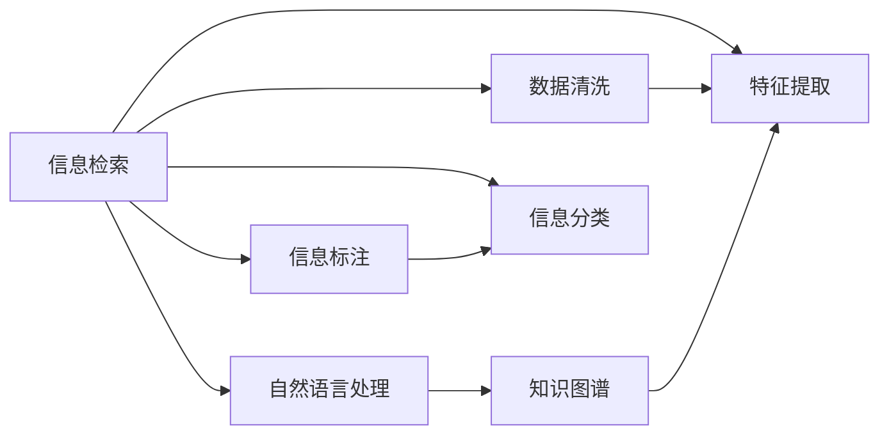

                 

# 信息过载与信息筛选策略：在信息洪流中找到有价值的信息

> 关键词：信息过载,信息筛选策略,信息检索,知识图谱,人工智能,自然语言处理

## 1. 背景介绍

在当今信息爆炸的时代，人们每天面对海量的信息，无论是来自社交媒体、新闻网站、电子邮件还是即时通讯，信息洪流已经对个人的工作和生活产生了巨大的影响。信息过载（Information Overload）指的是用户接收到的信息量远远超过了其处理能力，从而导致认知负担过重、决策困难等问题。这种现象不仅影响了个人效率，还对企业的运营和决策产生了负面影响。面对这种情况，信息筛选策略应运而生，旨在帮助用户从海量信息中找到有价值的内容。

### 1.1 信息过载的成因

信息过载的成因主要包括以下几个方面：

- **数据增长速度快**：随着互联网的普及和数字技术的进步，数据的生成速度和规模呈指数级增长，信息的传播速度也随之加快。
- **信息多样性高**：互联网使得信息来源更加多样化，包括传统媒体、社交媒体、个人博客等多种形式，增加了信息筛选的难度。
- **用户需求差异大**：不同用户对信息的需求差异较大，即使是同一用户在不同的时间点或情境下，对信息的关注点也会发生变化。

### 1.2 信息过载的影响

信息过载对个人和组织的影响是多方面的，主要包括以下几个方面：

- **认知负担增加**：信息过载导致用户需要处理的信息量过大，容易产生注意力分散、疲劳和焦虑等问题。
- **决策难度加大**：在海量信息中筛选有价值的内容需要耗费大量时间和精力，影响决策的及时性和准确性。
- **效率降低**：用户需要在信息洪流中筛选重要内容，浪费了宝贵的时间，导致工作效率下降。
- **健康问题**：长期处于信息过载状态下的用户可能出现睡眠障碍、心理压力增加等健康问题。

## 2. 核心概念与联系

### 2.1 核心概念概述

为了应对信息过载，研究人员和工程师们提出了多种信息筛选策略，主要包括信息检索（Information Retrieval, IR）、知识图谱（Knowledge Graph）、自然语言处理（Natural Language Processing, NLP）等技术。这些技术通过不同的方式帮助用户从信息海洋中找到有价值的内容。

- **信息检索**：信息检索技术通过分析用户的查询和文档内容，快速定位相关的信息。其主要目的是提高信息获取的准确性和效率。
- **知识图谱**：知识图谱是一种结构化的知识表示方式，通过将实体、属性和关系等信息组织成图谱，帮助用户快速发现和理解复杂问题。
- **自然语言处理**：自然语言处理技术通过分析文本的语义、语法等信息，提高信息检索和理解的准确性，支持更高级的信息筛选和自动化处理。

这些技术相互关联，共同构成了一个复杂的信息筛选系统。以下是一个Mermaid流程图，展示了这些技术之间的联系：



这个流程图展示了信息筛选系统的主要组成部分和技术流程。

## 3. 核心算法原理 & 具体操作步骤

### 3.1 算法原理概述

信息筛选策略的核心在于通过算法和技术手段，从海量信息中提取有价值的内容。其基本原理可以概括为以下几个方面：

- **特征提取**：从原始文本中提取出与任务相关的特征，如词频、词性、短语等。
- **信息检索**：通过分析和匹配用户查询和文档特征，定位相关的信息。
- **知识图谱构建**：将实体、属性和关系等信息组织成图谱，支持更复杂的查询和推理。
- **自然语言理解**：通过分析文本的语义、语法等信息，提高信息检索和理解的准确性。

### 3.2 算法步骤详解

信息筛选的算法步骤一般包括以下几个关键步骤：

**Step 1: 数据收集和预处理**

- 收集用户感兴趣的信息源，如新闻网站、社交媒体、电子邮件等。
- 对原始数据进行清洗和预处理，包括去除噪声、标准化格式等，确保数据的准确性和一致性。

**Step 2: 特征提取**

- 使用文本挖掘技术（如TF-IDF、Word2Vec等）从文本中提取有意义的特征。
- 对特征进行编码和表示，便于后续的检索和分类。

**Step 3: 信息检索**

- 根据用户查询，使用检索算法（如BM25、Latent Semantic Indexing等）从文档集合中检索相关性较高的信息。
- 对检索结果进行排序和过滤，优先展示最相关的内容。

**Step 4: 知识图谱构建**

- 将实体、属性和关系等信息组织成图谱，可以使用RDF、Neo4j等工具和技术。
- 在图谱中增加额外的信息，如时间戳、地理位置等，以支持更复杂的信息筛选和推理。

**Step 5: 自然语言理解**

- 使用自然语言处理技术（如BERT、GPT等）分析文本的语义和语法信息。
- 对文本进行实体识别、关系抽取、情感分析等处理，提取有价值的信息。

**Step 6: 信息整合和展示**

- 将检索到的信息、知识图谱和自然语言理解结果进行整合，生成最终的信息摘要或推荐列表。
- 根据用户需求和偏好，展示最相关、最有价值的信息。

### 3.3 算法优缺点

信息筛选策略的优势主要体现在以下几个方面：

- **高效性**：通过自动化的信息检索和分类，大大提高了信息获取的效率。
- **准确性**：通过自然语言处理和知识图谱技术，提高了信息筛选的准确性和相关性。
- **个性化**：根据用户的历史行为和偏好，提供个性化的信息推荐。

然而，信息筛选策略也存在一些缺点：

- **复杂性**：技术实现复杂，需要多学科知识的综合应用。
- **依赖高质量数据**：算法的准确性和效果很大程度上依赖于数据的质量和多样性。
- **计算成本高**：大规模数据处理和复杂算法实现需要较高的计算资源和时间。
- **隐私问题**：信息检索和分类过程中可能涉及用户隐私，需要严格的数据保护措施。

### 3.4 算法应用领域

信息筛选策略在多个领域都有广泛的应用，包括但不限于以下几个方面：

- **新闻媒体**：通过信息检索和自然语言处理技术，为用户推荐相关的新闻报道和评论。
- **电子商务**：基于用户的历史行为和偏好，推荐相关的商品和产品。
- **企业决策**：通过分析市场数据和趋势，提供决策支持和风险评估。
- **科学研究**：通过知识图谱和自然语言处理技术，快速定位和检索相关的学术论文和数据。
- **健康医疗**：根据病人的症状和历史记录，推荐相关的医疗信息和专家建议。

## 4. 数学模型和公式 & 详细讲解 & 举例说明

### 4.1 数学模型构建

信息筛选策略的数学模型一般包括以下几个关键组件：

- **文档表示**：使用向量空间模型（Vector Space Model, VSM）将文档表示为向量形式。
- **用户查询表示**：使用TF-IDF、Word2Vec等技术将用户查询表示为向量形式。
- **相似度计算**：使用余弦相似度、Jaccard系数等方法计算文档和查询的相似度。
- **排序算法**：使用基于排序的算法（如PageRank、TF-IDF排序等）对检索结果进行排序和过滤。

### 4.2 公式推导过程

以下以TF-IDF算法为例，展示信息检索的数学模型和公式推导过程。

假设我们有一个包含$N$个文档的集合，每个文档由$M$个词组成，用$D_{i}$表示第$i$个文档，$T_{i,j}$表示第$i$个文档中第$j$个词的词频，用$IDF$表示逆文档频率，则TF-IDF算法的计算公式如下：

$$
\text{TF-IDF}_{i,j} = \text{TF}_{i,j} \times \text{IDF}_j = \frac{T_{i,j}}{\sum_{k=1}^{M} T_{i,k}} \times \log\frac{N}{\sum_{k=1}^{N} T_{k,j}}
$$

其中，$\text{TF}_{i,j}$表示词$j$在文档$D_i$中的词频，$IDF_j$表示词$j$的逆文档频率。

在实际应用中，将用户查询$Q$和所有文档$D_1, D_2, ..., D_N$进行相似度计算，得到每个文档与查询的相似度$S_i$：

$$
S_i = \frac{\sum_{j=1}^{M} \text{TF-IDF}_{i,j} \times \text{TF-IDF}_{Q,j}}{\sqrt{\sum_{k=1}^{M} \text{TF-IDF}_{i,k}^2} \times \sqrt{\sum_{k=1}^{M} \text{TF-IDF}_{Q,k}^2}}
$$

根据相似度$S_i$对文档进行排序，得到最相关的文档列表。

### 4.3 案例分析与讲解

以推荐系统为例，展示信息筛选策略在实际应用中的使用。

假设有一个电商网站，需要为用户推荐相关的商品。我们可以将每个商品表示为一个向量，包括商品名称、描述、价格等特征。用户查询可以表示为一个向量，如“打折商品”。

首先，使用TF-IDF算法将用户查询和所有商品向量进行相似度计算，得到每个商品与查询的相似度$S_i$。然后，根据相似度$S_i$对商品进行排序，优先展示最相关的内容。

在实际应用中，还需要加入更多的算法和技术，如协同过滤、基于内容的推荐等，以提高推荐效果。

## 5. 项目实践：代码实例和详细解释说明

### 5.1 开发环境搭建

为了实现信息筛选策略，我们需要搭建一个完整的开发环境。以下是搭建环境的详细步骤：

1. **安装Python和相关库**：
   - 安装Python 3.7及以上版本。
   - 安装TensorFlow、Scikit-learn、NLTK等常用库。

2. **数据收集和预处理**：
   - 从新闻网站、社交媒体、电子邮件等渠道收集数据。
   - 对原始数据进行清洗和预处理，去除噪声和标准化格式。

3. **特征提取**：
   - 使用TF-IDF算法提取文本特征。
   - 对特征进行编码和表示，便于后续的检索和分类。

4. **信息检索和分类**：
   - 使用BM25算法进行信息检索。
   - 对检索结果进行分类，生成最终的信息摘要或推荐列表。

### 5.2 源代码详细实现

以下是一个简单的Python代码示例，展示如何使用TF-IDF算法进行信息检索和分类：

```python
from sklearn.feature_extraction.text import TfidfVectorizer
from sklearn.metrics.pairwise import cosine_similarity

# 定义文档和查询
docs = ["这是一篇新闻报道", "这是另一个新闻报道", "这是第三篇新闻报道"]
queries = ["新闻", "报道", "新闻报道"]

# 使用TF-IDF算法提取特征
tfidf = TfidfVectorizer()
doc_tfidf = tfidf.fit_transform(docs)
query_tfidf = tfidf.transform(queries)

# 计算相似度
similarity = cosine_similarity(doc_tfidf, query_tfidf)

# 根据相似度排序，展示最相关的文档
sorted_docs = sorted(range(len(docs)), key=lambda i: similarity[i, 0])
top_docs = [docs[i] for i in sorted_docs]

print(top_docs)
```

### 5.3 代码解读与分析

以上代码示例展示了使用TF-IDF算法进行信息检索的基本流程。具体分析如下：

1. **数据准备**：定义一个包含三个文档和三个查询的列表，用于进行相似度计算。
2. **特征提取**：使用`TfidfVectorizer`对文档和查询进行特征提取，得到向量形式的特征矩阵。
3. **相似度计算**：使用`cosine_similarity`计算文档和查询的相似度，得到一个二维相似度矩阵。
4. **排序和展示**：根据相似度矩阵对文档进行排序，展示最相关的文档。

## 6. 实际应用场景

### 6.1 新闻媒体

新闻媒体行业每天面临大量的信息源，如何从中快速筛选出有价值的内容至关重要。基于信息筛选策略，新闻媒体可以为用户推荐相关的新闻报道和评论，提高信息获取的效率和准确性。

### 6.2 电子商务

电子商务平台需要为用户推荐相关的商品和产品。通过信息筛选策略，可以根据用户的历史行为和偏好，提供个性化的商品推荐，提高用户的购买体验和满意度。

### 6.3 企业决策

企业在市场竞争激烈的环境中，需要快速获取和分析市场信息，做出科学合理的决策。通过信息筛选策略，可以快速定位和检索相关的市场数据和趋势，支持企业的决策支持系统。

### 6.4 科学研究

科学研究领域需要快速定位和检索相关的学术论文和数据。通过信息筛选策略，可以根据关键词、作者、发表时间等条件，快速找到相关的研究论文和数据，提高研究效率。

### 6.5 健康医疗

健康医疗领域需要快速获取和分析患者的症状和历史记录，提供个性化的医疗建议和指导。通过信息筛选策略，可以根据患者的症状和历史记录，推荐相关的医疗信息和专家建议，提高医疗服务的质量和效率。

## 7. 工具和资源推荐

### 7.1 学习资源推荐

为了帮助开发者和研究者掌握信息筛选策略的理论基础和实践技巧，推荐以下学习资源：

1. **《信息检索基础》（Information Retrieval: An Introduction）**：由Christopher Manning等人合著，全面介绍了信息检索的理论基础和算法实现。
2. **《Python自然语言处理》（Natural Language Processing in Python）**：由Steven Bird等人合著，介绍了使用Python进行自然语言处理的基本方法和技术。
3. **《深度学习与自然语言处理》（Deep Learning for Natural Language Processing）**：由Palash Goyal等人合著，介绍了使用深度学习技术进行自然语言处理的方法和案例。
4. **Coursera上的《信息检索》课程**：由斯坦福大学的Christopher Manning教授主讲，介绍了信息检索的原理和应用。
5. **Kaggle上的信息检索比赛**：Kaggle提供了多个信息检索相关的比赛，可以帮助开发者和研究者实践和测试自己的信息检索算法。

### 7.2 开发工具推荐

为了实现信息筛选策略，推荐以下开发工具：

1. **TensorFlow**：Google开发的深度学习框架，支持大规模的深度学习模型训练和推理。
2. **Scikit-learn**：Python的机器学习库，提供了多种数据处理和分类算法。
3. **NLTK**：Python的自然语言处理库，提供了丰富的文本处理和分析功能。
4. **Elasticsearch**：开源的搜索引擎，支持高效的文本检索和分析。
5. **Gensim**：Python的文本分析和建模工具，支持构建大规模的知识图谱和相似度计算。

### 7.3 相关论文推荐

为了深入了解信息筛选策略的最新进展，推荐以下相关论文：

1. **BM25：A Modern Approach to Automatic Ranking**：由Robert N. Snape等人提出，介绍了BM25算法的基本原理和应用。
2. **BERT: Pre-training of Deep Bidirectional Transformers for Language Understanding**：由Jacob Devlin等人提出，介绍了BERT模型的预训练方法和应用。
3. **Latent Semantic Indexing: A Tutorial**：由Jonathan R. Kucera等人提出，介绍了LSI算法的原理和应用。
4. **Transformer Architectures for Learning to Rank**：由Gao Huang等人提出，介绍了Transformer架构在信息检索中的应用。
5. **Attention is All You Need**：由Ashish Vaswani等人提出，介绍了Transformer架构的基本原理和应用。

## 8. 总结：未来发展趋势与挑战

### 8.1 研究成果总结

信息筛选策略在信息过载的解决中扮演了重要角色，通过信息检索、知识图谱和自然语言处理等技术，从海量信息中提取出有价值的内容。在新闻媒体、电子商务、企业决策、科学研究、健康医疗等领域，信息筛选策略得到了广泛的应用。

### 8.2 未来发展趋势

未来，信息筛选策略将呈现出以下几个发展趋势：

1. **深度学习的应用**：深度学习技术将进一步应用于信息检索和分类中，提高检索的准确性和效果。
2. **多模态数据的融合**：通过结合视觉、听觉等多模态数据，提高信息筛选的全面性和准确性。
3. **个性化推荐**：通过用户行为分析和模型预测，提供更个性化的信息推荐。
4. **实时处理**：通过分布式计算和流处理技术，实现实时信息筛选和推荐。
5. **联邦学习**：通过分布式训练和多用户协作，提高信息筛选的隐私保护和模型泛化能力。

### 8.3 面临的挑战

尽管信息筛选策略在信息过载的解决中取得了显著进展，但仍面临以下挑战：

1. **数据质量问题**：信息的准确性和多样性很大程度上依赖于数据质量，数据采集和清洗需要投入大量资源。
2. **计算资源限制**：大规模数据处理和复杂算法实现需要高性能计算资源，可能面临计算成本高的问题。
3. **隐私和安全**：信息检索和分类过程中可能涉及用户隐私，需要严格的数据保护措施。
4. **模型复杂性**：深度学习和自然语言处理模型的复杂性，增加了算法的实现和优化难度。

### 8.4 研究展望

未来，信息筛选策略的研究方向包括：

1. **高效的检索算法**：开发更加高效的检索算法，减少计算资源消耗，提高检索速度和精度。
2. **多模态数据融合**：将视觉、听觉等多模态数据融合到信息检索中，提高信息筛选的全面性和准确性。
3. **隐私保护**：研究隐私保护技术，如差分隐私和联邦学习，保护用户隐私。
4. **实时处理**：开发实时处理技术，如流处理和分布式计算，支持实时信息筛选和推荐。
5. **跨领域应用**：将信息筛选策略应用到更多领域，如金融、法律、医疗等，拓展其应用范围。

## 9. 附录：常见问题与解答

### Q1: 信息过载和信息筛选有什么区别？

**A:** 信息过载指的是用户接收到的信息量远远超过了其处理能力，导致认知负担过重和决策困难。信息筛选则是通过算法和技术手段，从海量信息中提取出有价值的内容，帮助用户快速找到相关信息。

### Q2: 信息检索和自然语言处理有什么区别？

**A:** 信息检索是通过分析和匹配用户查询和文档内容，快速定位相关的信息。自然语言处理则是通过分析文本的语义、语法等信息，提高信息检索和理解的准确性。

### Q3: 如何提高信息检索的准确性？

**A:** 提高信息检索的准确性需要多方面的努力，包括：
1. 使用更高效的检索算法，如BM25、Latent Semantic Indexing等。
2. 对文本进行预处理和特征提取，如去除停用词、进行TF-IDF编码等。
3. 对检索结果进行排序和过滤，优先展示最相关的内容。

### Q4: 信息筛选策略在实际应用中有哪些局限性？

**A:** 信息筛选策略在实际应用中存在以下局限性：
1. 数据质量问题：信息的准确性和多样性很大程度上依赖于数据质量，数据采集和清洗需要投入大量资源。
2. 计算资源限制：大规模数据处理和复杂算法实现需要高性能计算资源，可能面临计算成本高的问题。
3. 隐私和安全：信息检索和分类过程中可能涉及用户隐私，需要严格的数据保护措施。
4. 模型复杂性：深度学习和自然语言处理模型的复杂性，增加了算法的实现和优化难度。

### Q5: 如何实现信息筛选的个性化推荐？

**A:** 实现信息筛选的个性化推荐需要以下步骤：
1. 收集用户的历史行为数据，如浏览记录、购买记录等。
2. 使用协同过滤、基于内容的推荐等算法，对用户进行特征提取和模型训练。
3. 对用户查询进行分析和理解，生成个性化的推荐结果。

---

作者：禅与计算机程序设计艺术 / Zen and the Art of Computer Programming

