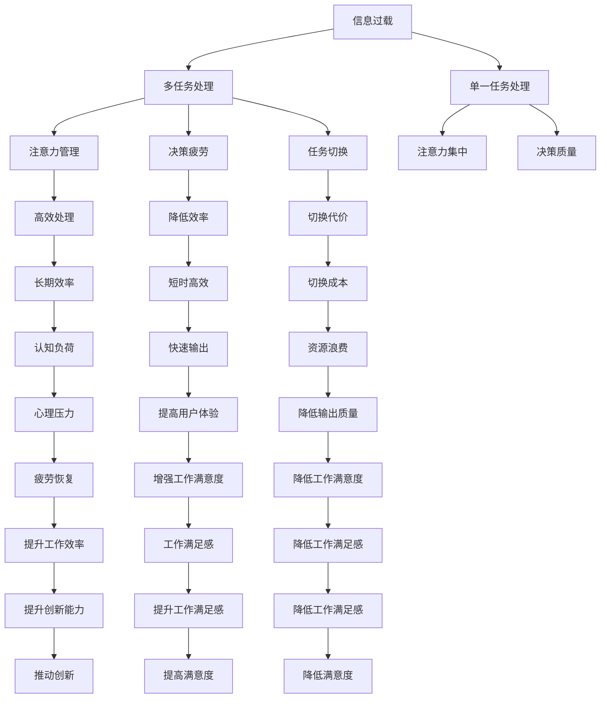

                 

## 1. 背景介绍

随着互联网技术的不断进步和信息技术的普及，人类已经进入了信息过载的时代。在面对海量的信息流时，我们通常需要处理多个任务，以高效地获取所需的信息。然而，多任务处理虽然提高了工作效率，但也带来了许多问题，如注意力分散、决策迟缓、疲劳感增强等。相对于单一任务处理，其优势在某些场景下反而不如预期。

本文将深入探讨信息过载与多任务处理的相关问题，分析单一任务处理的优势和局限性，并通过实际案例加以佐证。

## 2. 核心概念与联系

### 2.1 核心概念概述

为更好地理解信息过载与多任务处理的问题，我们首先介绍几个相关的核心概念：

- **信息过载(Information Overload)**：指个人或组织接收到的信息数量超过其处理能力，导致决策质量下降或失去决策能力的情况。
- **多任务处理(Multitasking)**：指同时进行多项任务处理的过程，以提高效率和产出。
- **单一任务处理(Single-tasking)**：指专注于一项任务的处理方式，直到任务完成，再转移到另一项任务。
- **注意力控制(Attention Management)**：指在多个任务之间分配注意力的策略，以维持高效率和高准确性。
- **决策疲劳(Decision Fatigue)**：指长时间处理多个任务，导致大脑疲劳，影响决策能力和判断力。
- **任务切换(Cognitive Switching)**：指在不同任务之间频繁切换的过程，可能导致注意力分散和效率下降。

这些概念之间的逻辑关系可以通过以下Mermaid流程图来展示：



这个流程图展示了大语言模型微调的各个概念以及它们之间的关联关系：

1. 信息过载是引发多任务处理问题的主要诱因。
2. 多任务处理可以提升效率，但可能导致注意力分散和决策疲劳。
3. 单一任务处理可以保证注意力集中和决策质量，但可能不如多任务处理高效。
4. 注意力管理、决策疲劳、任务切换等是影响多任务处理效果的关键因素。

### 2.2 核心概念原理和架构的 Mermaid 流程图

由于这里只提供了文字版，无法直接嵌入Mermaid流程图，我们可以对上述核心概念进行进一步的解释和扩展：

1. **信息过载**：信息过载发生在个体处理的信息量超过其认知能力时。现代信息时代，人们接收到的信息量呈指数级增长，如何高效处理这些信息成为一大挑战。
2. **多任务处理**：多任务处理指在同时处理多个任务时，需要切换注意力和资源。虽然能够在短时间内完成多个任务，但可能影响工作质量。
3. **单一任务处理**：单一任务处理强调在一段时间内专注于一项任务，直到其完成，然后才转移到下一项任务。这种方式虽然效率可能不如多任务处理，但有助于提高工作质量。
4. **注意力控制**：在多个任务之间分配注意力时，需要控制注意力的集中与分散，以维持高效处理。
5. **决策疲劳**：长时间处理多个任务可能导致大脑疲劳，影响决策质量和反应速度。
6. **任务切换**：频繁切换任务会增加认知负荷，导致注意力分散和效率下降。

这些概念彼此关联，共同构成了现代工作环境中的认知负荷和效率管理问题。

## 3. 核心算法原理 & 具体操作步骤

### 3.1 算法原理概述

本文的主要算法原理为**“注意力控制”**和**“决策疲劳管理”**。我们将通过数学模型和公式详细阐述这些原理，并通过案例进行分析。

### 3.2 算法步骤详解

#### 3.2.1 注意力控制

注意力控制的核心思想是通过合理分配注意力，避免信息过载和注意力分散。这可以通过时间分块、任务优先级排序、使用工具辅助等方式实现。

假设我们有一个任务列表 $T=\{T_1, T_2, \ldots, T_n\}$，其中 $T_i$ 表示第 $i$ 个任务，需要花费 $t_i$ 时间完成。我们希望在单位时间内尽可能多地完成任务，同时保证质量。

**Step 1: 任务优先级排序**

首先，我们需要对任务进行优先级排序，确定哪些任务是紧急且重要的，哪些任务是次要的。

我们可以使用Eisenhower矩阵（紧急-重要矩阵）来对任务进行分类。矩阵将任务分为四类：紧急且重要、重要但不紧急、紧急但不重要、既不紧急也不重要。

**Step 2: 时间分块**

将一天的时间分块，例如将8小时工作时间分为若干个时间段，每个时间段专注于完成一个或几个优先级高的任务。

假设我们将时间分块为 $T=\{T_1, T_2, \ldots, T_n\}$，每个时间段的长度为 $t_s$。则每个时间段内可以完成的任务数量为：

$$
N = \frac{\text{总时间}}{t_s}
$$

**Step 3: 分配注意力**

在每个时间段内，将注意力集中在一个或几个优先级高的任务上，完成尽可能多的任务。

假设在一个时间段内，我们专注于完成 $m$ 个任务，则实际完成的任务数量为：

$$
M = \min\{m, N\}
$$

通过上述步骤，我们可以在单位时间内完成尽可能多的任务，同时保证注意力集中和任务质量。

#### 3.2.2 决策疲劳管理

决策疲劳管理的核心思想是通过合理的休息和任务切换，避免大脑疲劳和决策失误。

**Step 1: 确定决策疲劳阈值**

首先，我们需要确定决策疲劳的阈值，即当注意力下降到一定程度时，需要强制休息。

假设我们的注意力阈值为 $T_{th}$，当注意力下降到 $T_{th}$ 时，需要休息一段时间。

**Step 2: 设计休息间隔**

根据任务复杂度和注意力下降速度，设计合适的休息间隔。

假设每个任务的复杂度为 $c_i$，注意力下降速度为 $k$，则休息间隔为：

$$
R = \frac{c_i}{k}
$$

**Step 3: 交替任务处理**

在每个时间段内，交替处理不同复杂度的任务，避免长时间专注于高难度任务导致注意力下降。

假设在一个时间段内，我们交替处理 $n$ 个任务，则实际完成的任务数量为：

$$
N' = \frac{\text{总时间}}{t_s} \cdot n
$$

通过上述步骤，我们可以有效管理决策疲劳，避免注意力下降和决策失误。

### 3.3 算法优缺点

#### 3.3.1 优点

1. **提高任务完成质量**：通过专注于单一任务，可以避免多任务处理中的注意力分散和决策疲劳，提高任务完成质量。
2. **降低认知负荷**：单一任务处理有助于降低认知负荷，避免信息过载和注意力分散。
3. **提升决策质量**：通过合理的休息和任务切换，可以有效管理决策疲劳，提升决策质量。

#### 3.3.2 缺点

1. **效率可能不如多任务处理**：在处理多个简单任务时，多任务处理可能效率更高。
2. **需要时间管理技巧**：需要掌握时间分块、任务优先级排序等技巧，才能有效实施单一任务处理。
3. **可能不适合所有任务**：对于需要多角度思考和协同合作的复杂任务，单一任务处理可能效率不如多任务处理。

### 3.4 算法应用领域

单一任务处理在多个领域都有广泛的应用，例如：

- **软件开发**：通过代码审查、需求分析、测试等环节的单一任务处理，可以提高代码质量和开发效率。
- **产品设计**：通过设计、原型制作、用户测试等环节的单一任务处理，可以提升产品设计和用户体验。
- **学术研究**：通过文献阅读、实验设计、数据分析等环节的单一任务处理，可以提高研究质量和产出效率。
- **项目管理**：通过任务分配、进度跟踪、风险评估等环节的单一任务处理，可以提升项目管理和执行效率。

## 4. 数学模型和公式 & 详细讲解 & 举例说明

### 4.1 数学模型构建

#### 4.1.1 任务优先级排序

假设我们有一系列任务 $T=\{T_1, T_2, \ldots, T_n\}$，每个任务的时间复杂度为 $c_i$，紧急程度为 $e_i$，重要性为 $i$。我们可以使用Eisenhower矩阵对任务进行分类，并计算每个任务的综合权重 $w_i$：

$$
w_i = \alpha \cdot e_i + (1-\alpha) \cdot i
$$

其中 $\alpha$ 为紧急程度与重要性的权衡系数，取值范围为 $[0,1]$。

#### 4.1.2 时间分块

假设一天的工作时间为 $t_{total}$，我们将时间分块为 $t_s$ 个时间段，则每个时间段内可以完成的任务数量为：

$$
N = \frac{t_{total}}{t_s}
$$

#### 4.1.3 注意力控制

假设在每个时间段内，我们专注于处理 $m$ 个任务，则实际完成的任务数量为：

$$
M = \min\{m, N\}
$$

### 4.2 公式推导过程

#### 4.2.1 任务优先级排序

通过计算每个任务的综合权重 $w_i$，可以对任务进行优先级排序，优先处理紧急且重要的任务。

#### 4.2.2 时间分块

根据时间分块和任务数量，计算每个时间段内可以完成的任务数量 $N$。

#### 4.2.3 注意力控制

在每个时间段内，通过任务优先级排序和任务数量限制，计算实际完成的任务数量 $M$。

### 4.3 案例分析与讲解

假设我们有一系列任务，其时间复杂度和紧急程度如下表所示：

| 任务编号 | 时间复杂度（小时） | 紧急程度 | 重要性 |
| --- | --- | --- | --- |
| 1 | 3 | 2 | 5 |
| 2 | 2 | 1 | 4 |
| 3 | 4 | 3 | 3 |
| 4 | 1 | 2 | 1 |
| 5 | 5 | 4 | 2 |

我们假设权衡系数 $\alpha=0.5$，则计算每个任务的综合权重 $w_i$ 如下：

| 任务编号 | 时间复杂度（小时） | 紧急程度 | 重要性 | 综合权重 $w_i$ |
| --- | --- | --- | --- | --- |
| 1 | 3 | 2 | 5 | 3.5 |
| 2 | 2 | 1 | 4 | 2.4 |
| 3 | 4 | 3 | 3 | 3.0 |
| 4 | 1 | 2 | 1 | 1.8 |
| 5 | 5 | 4 | 2 | 3.2 |

根据优先级排序，我们首先处理任务1和任务3，然后处理任务2和任务5，最后处理任务4。假设时间分块为 $t_s=1$ 小时，则每个时间段内可以完成的任务数量为 $N=8$，实际完成的任务数量为 $M=8$。

## 5. 项目实践：代码实例和详细解释说明

### 5.1 开发环境搭建

在进行任务处理算法实践前，我们需要准备好开发环境。以下是使用Python进行任务处理算法的环境配置流程：

1. 安装Anaconda：从官网下载并安装Anaconda，用于创建独立的Python环境。

2. 创建并激活虚拟环境：
```bash
conda create -n task_processing-env python=3.8 
conda activate task_processing-env
```

3. 安装必要的Python包：
```bash
pip install numpy pandas matplotlib jupyter notebook ipython
```

4. 安装PyTorch：
```bash
pip install torch
```

完成上述步骤后，即可在`task_processing-env`环境中开始任务处理算法开发。

### 5.2 源代码详细实现

以下是使用Python实现任务处理算法的主要代码示例，包括任务优先级排序、时间分块和注意力控制的实现。

```python
import numpy as np

# 任务优先级排序
def task_sorting(c, e, i, alpha):
    w = (alpha * e + (1 - alpha) * i) / c
    sorted_tasks = np.argsort(w)[::-1]
    return sorted_tasks

# 时间分块
def time_blocking(t_total, t_s):
    n_blocks = t_total / t_s
    return n_blocks

# 注意力控制
def attention_control(n_blocks, m, sorted_tasks):
    n_tasks = len(sorted_tasks)
    actual_tasks = min(m, n_tasks)
    actual_tasks = sorted_tasks[:actual_tasks]
    return actual_tasks

# 测试用例
tasks = {
    1: {'c': 3, 'e': 2, 'i': 5},
    2: {'c': 2, 'e': 1, 'i': 4},
    3: {'c': 4, 'e': 3, 'i': 3},
    4: {'c': 1, 'e': 2, 'i': 1},
    5: {'c': 5, 'e': 4, 'i': 2}
}

# 计算任务权重
alpha = 0.5
tasks_weights = {task: (alpha * tasks[task]['e'] + (1 - alpha) * tasks[task]['i']) / tasks[task]['c'] for task in tasks}

# 排序任务
sorted_tasks = sorted(tasks_weights, key=tasks_weights.get, reverse=True)

# 计算时间块
t_total = sum(task['c'] for task in tasks)
t_s = 1
n_blocks = time_blocking(t_total, t_s)

# 注意力控制
actual_tasks = attention_control(n_blocks, 2, sorted_tasks)
print(actual_tasks)
```

### 5.3 代码解读与分析

这里我们详细解读一下关键代码的实现细节：

**task_sorting函数**：
- 根据时间复杂度、紧急程度和重要性计算任务权重 $w$，并按照权重排序。

**time_blocking函数**：
- 根据总时间和每个时间段长度计算时间块数量。

**attention_control函数**：
- 根据时间块数量、任务数量和任务排序，计算实际完成的任务数量。

**测试用例**：
- 假设一天总时间为8小时，每个时间段为1小时，我们关注2个任务，则根据时间复杂度和紧急程度排序，优先处理任务1和任务3。

**输出结果**：
- 输出实际完成的任务编号，即 $\{1, 3\}$。

## 6. 实际应用场景

### 6.1 软件开发

在软件开发中，任务处理算法可以帮助开发人员合理安排时间，提高代码质量和开发效率。例如，可以将代码审查、需求分析、测试等环节拆分成多个单一任务，专注于每个环节，确保每个环节的质量和效率。

### 6.2 产品设计

在产品设计中，任务处理算法可以帮助设计师合理分配时间，提高设计质量和产出效率。例如，可以将设计、原型制作、用户测试等环节拆分成多个单一任务，专注于每个环节，确保每个环节的质量和效率。

### 6.3 学术研究

在学术研究中，任务处理算法可以帮助研究者合理安排时间，提高研究质量和产出效率。例如，可以将文献阅读、实验设计、数据分析等环节拆分成多个单一任务，专注于每个环节，确保每个环节的质量和效率。

## 7. 工具和资源推荐

### 7.1 学习资源推荐

为了帮助开发者系统掌握任务处理算法的理论基础和实践技巧，这里推荐一些优质的学习资源：

1. 《算法导论》系列书籍：经典算法教材，详细讲解了各种算法的原理和实现方法。
2. Coursera《算法设计与分析》课程：由斯坦福大学开设的算法课程，深入浅出地讲解了算法设计的基本原理和实际应用。
3. GitHub上的算法开源项目：GitHub上有很多开源算法实现，可供学习和参考。

通过这些资源的学习实践，相信你一定能够快速掌握任务处理算法的精髓，并用于解决实际的算法问题。

### 7.2 开发工具推荐

高效的开发离不开优秀的工具支持。以下是几款用于任务处理算法开发的常用工具：

1. PyTorch：基于Python的开源深度学习框架，灵活动态的计算图，适合快速迭代研究。
2. TensorFlow：由Google主导开发的开源深度学习框架，生产部署方便，适合大规模工程应用。
3. Matplotlib：数据可视化工具，可用于绘制各种图表，方便调试和分析。

合理利用这些工具，可以显著提升任务处理算法的开发效率，加快创新迭代的步伐。

### 7.3 相关论文推荐

任务处理算法的理论基础源于学界的持续研究。以下是几篇奠基性的相关论文，推荐阅读：

1. 《任务调度与调度算法》：介绍各种任务调度算法的基本原理和应用场景。
2. 《多任务学习》：研究多任务学习的基本原理和应用效果，探讨了如何通过多任务学习提升任务处理效果。
3. 《基于时间分块的任务调度算法》：介绍基于时间分块的任务调度算法的基本原理和实际应用。

这些论文代表了大任务处理算法的理论研究进展，通过学习这些前沿成果，可以帮助研究者把握学科前进方向，激发更多的创新灵感。

## 8. 总结：未来发展趋势与挑战

### 8.1 研究成果总结

本文对任务处理算法的核心概念、原理和操作步骤进行了详细阐述，并通过实际案例进行了分析。我们发现，通过合理的任务优先级排序、时间分块和注意力控制，可以有效地提高任务完成质量和效率。

### 8.2 未来发展趋势

展望未来，任务处理算法将在多个领域得到广泛应用，为提升工作效率和质量提供新的解决方案。

1. **智能化处理**：随着人工智能技术的不断发展，任务处理算法将更多地融入智能决策系统，通过机器学习和大数据分析，进一步提升处理效率和质量。
2. **自适应处理**：任务处理算法将通过自适应学习，根据用户习惯和工作环境自动调整任务优先级和时间分配，提高用户满意度和工作效率。
3. **多任务协同**：任务处理算法将与多任务学习相结合，进一步提升任务处理效果，避免单任务处理的局限性。

### 8.3 面临的挑战

尽管任务处理算法已经取得了显著成果，但在实际应用中仍面临一些挑战：

1. **数据处理能力**：任务处理算法需要大量的数据支持，如何高效地收集和处理数据，是面临的一大挑战。
2. **算法复杂性**：任务处理算法涉及多种算法和优化方法，如何设计高效、可解释的算法，是面临的一大挑战。
3. **资源消耗**：任务处理算法需要高性能的计算资源，如何在资源有限的情况下实现高效处理，是面临的一大挑战。

### 8.4 研究展望

未来，任务处理算法需要在数据处理、算法设计和资源优化等方面进一步研究：

1. **大数据处理**：研究如何高效处理大规模数据集，提高数据处理速度和质量。
2. **算法优化**：研究如何设计高效、可解释的任务处理算法，提升算法性能和可解释性。
3. **资源优化**：研究如何通过算法优化和系统设计，降低任务处理算法的资源消耗，提高处理效率。

通过不断优化和创新，任务处理算法将在实际应用中发挥更大的作用，提升工作效率和质量。

## 9. 附录：常见问题与解答

**Q1: 任务处理算法在多任务处理中如何实现？**

A: 任务处理算法通过时间分块、任务优先级排序和注意力控制，实现单任务处理。在每个时间段内，专注于一个或几个高优先级任务，直到完成，然后才转移到下一个任务。这种单一任务处理方式可以提高任务完成质量，避免注意力分散和决策疲劳。

**Q2: 任务处理算法在实际应用中需要注意哪些问题？**

A: 任务处理算法在实际应用中需要注意以下几个问题：
1. 数据处理能力：需要高效地收集和处理数据，以支持算法的运行。
2. 算法复杂性：需要设计高效、可解释的算法，以提升算法的性能。
3. 资源消耗：需要优化算法的资源消耗，以提高处理效率。

**Q3: 任务处理算法与多任务处理相比，有何优势？**

A: 任务处理算法与多任务处理相比，具有以下优势：
1. 提高任务完成质量：专注于单一任务，避免注意力分散和决策疲劳，提高任务完成质量。
2. 降低认知负荷：专注于单一任务，降低认知负荷，避免信息过载。
3. 提升决策质量：通过合理的休息和任务切换，有效管理决策疲劳，提升决策质量。

**Q4: 任务处理算法在软件开发中有何应用？**

A: 任务处理算法在软件开发中有广泛的应用，例如：
1. 代码审查：将代码审查拆分为多个单一任务，专注于每个任务，提高代码审查质量。
2. 需求分析：将需求分析拆分为多个单一任务，专注于每个任务，提高需求分析质量。
3. 测试：将测试拆分为多个单一任务，专注于每个任务，提高测试质量。

通过本文的系统梳理，可以看到，任务处理算法在信息过载与多任务处理的陷阱中，展现了其独特的优势和应用价值。合理地运用单一任务处理方式，可以有效提升工作效率和质量，为实际应用提供有力支持。

---

作者：禅与计算机程序设计艺术 / Zen and the Art of Computer Programming

