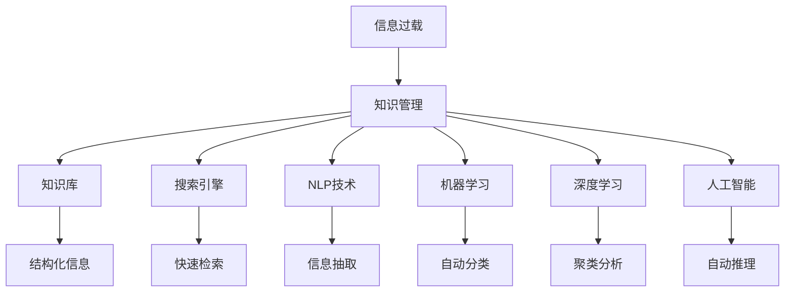

                 

# 信息过载与知识管理策略：管理和组织信息以提高生产力

> 关键词：信息过载,知识管理,组织信息,生产力提升,信息技术应用

## 1. 背景介绍

### 1.1 问题由来

随着信息时代的到来，数据和信息量呈爆炸式增长，各行各业都在应对前所未有的信息过载问题。无论是个人用户还是企业组织，面对海量信息，如何有效管理和组织，实现信息的价值最大化，成为一个重要议题。信息过载不仅意味着数据处理难度增大，更可能导致注意力分散、决策迟缓、创新能力下降等一系列问题。因此，如何管理和利用信息，提升生产力，成为现代信息技术应用的核心挑战之一。

### 1.2 问题核心关键点

1. **信息过载定义**：指信息量远超处理能力的状况，导致注意力和精力分散，影响决策和执行效率。
2. **知识管理目的**：通过有效的信息组织和处理，提升信息价值，支持决策、创新和协作，提高组织生产力。
3. **知识管理策略**：包括信息收集、存储、检索、分享、应用等全流程的管理方法，旨在实现信息到知识的有效转换。
4. **信息技术应用**：包括搜索引擎、数据库、云计算、AI等技术，用于自动化和优化知识管理流程。

## 2. 核心概念与联系

### 2.1 核心概念概述

为更好地理解信息过载和知识管理的核心概念，本节将介绍几个密切相关的核心概念：

- **信息过载**：指个体或组织接收的信息量超出了其处理和分析能力，导致决策能力和效率下降。
- **知识管理**：通过收集、存储、检索和分享信息，促进知识转化和应用，提升组织创新能力和生产力。
- **知识库**：用于存储和检索知识的系统，支持信息的结构化和语义化处理。
- **搜索引擎**：用于快速检索信息的工具，利用索引和算法优化信息检索效率。
- **自然语言处理(NLP)**：利用计算机处理和理解自然语言的技术，用于信息抽取、文本分类、情感分析等任务。
- **机器学习和深度学习**：用于自动化信息分类、聚类、推荐等任务的技术，提高信息处理的效率和精度。
- **人工智能(AI)**：结合机器学习、深度学习等技术，实现自动推理、决策支持等功能。

这些核心概念之间的逻辑关系可以通过以下Mermaid流程图来展示：



这个流程图展示了大语言模型的核心概念及其之间的关系：

1. 信息过载需要通过知识管理进行解决。
2. 知识管理依赖于知识库、搜索引擎等工具和技术，实现信息的收集、存储和检索。
3. NLP、机器学习和深度学习等技术用于提高信息处理的效率和精度。
4. AI技术进一步提升知识管理的智能化水平，实现自动推理和决策支持。

## 3. 核心算法原理 & 具体操作步骤

### 3.1 算法原理概述

信息过载和知识管理的核心算法原理基于以下几个关键点：

1. **信息收集与存储**：通过自动化工具和系统，高效收集和存储海量信息。
2. **信息分类与聚类**：利用机器学习技术，对信息进行分类、聚类，实现信息的有序化和结构化。
3. **信息检索与关联**：通过搜索引擎和知识库，快速检索信息，并实现信息之间的关联。
4. **信息应用与转化**：将信息转化为知识，支持决策、创新和协作，提升生产力。

### 3.2 算法步骤详解

信息过载和知识管理的算法步骤包括：

1. **数据收集与预处理**：使用爬虫、API等手段收集数据，并进行去重、清洗、标注等预处理。
2. **信息分类与聚类**：利用机器学习算法（如K-means、DBSCAN等）对信息进行分类和聚类，实现信息的结构化。
3. **信息检索与关联**：构建索引、使用搜索引擎和知识库，实现快速检索和信息关联。
4. **知识应用与转化**：将信息转化为知识，支持决策、创新和协作，提升生产力。

### 3.3 算法优缺点

信息过载和知识管理的算法具有以下优点：

1. **效率提升**：通过自动化工具和机器学习算法，实现信息的高效处理和分类，大大提升信息处理的效率。
2. **成本降低**：减少人力成本，提高信息处理的准确性和一致性，降低错误率。
3. **知识复用**：将信息转化为知识，支持决策和创新，实现知识的复用和传承。

同时，该算法也存在一定的局限性：

1. **数据质量依赖**：算法的效果依赖于数据的质量和完整性，存在数据噪声和偏差的可能。
2. **复杂性高**：涉及数据处理、机器学习、信息检索等多个环节，实现复杂。
3. **技术门槛高**：需要专业知识和技术手段，对从业者要求较高。
4. **动态适应性不足**：对于动态变化的数据和环境，算法可能难以快速适应和优化。

### 3.4 算法应用领域

信息过载和知识管理的算法广泛适用于以下领域：

1. **企业知识管理**：支持企业的信息收集、存储、检索和应用，提升决策和创新能力。
2. **政府信息公开**：提供高效的信息检索和关联服务，支持政府决策和公共服务。
3. **公共图书馆**：通过构建知识库和搜索引擎，提供信息检索和知识服务。
4. **在线教育平台**：支持课程内容的管理、检索和应用，提高教学效果和学习效率。
5. **科学研究**：提供数据管理和分析工具，支持科研团队的协作和创新。
6. **医疗健康**：提供医疗信息的管理、检索和应用，支持医疗决策和创新。

## 4. 数学模型和公式 & 详细讲解 & 举例说明

### 4.1 数学模型构建

信息过载和知识管理的数学模型构建包括以下几个关键步骤：

1. **信息量度量**：使用信息熵、信息熵率等指标度量信息量。
2. **信息分类与聚类**：利用信息熵、互信息、KL散度等指标对信息进行分类和聚类。
3. **信息检索与关联**：使用倒排索引、TF-IDF等算法优化信息检索和关联。
4. **知识应用与转化**：通过决策树、贝叶斯网络等模型转化信息为知识。

### 4.2 公式推导过程

以下是信息分类和聚类的公式推导：

设样本数据集为 $\{(x_i, y_i)\}_{i=1}^N$，其中 $x_i$ 为特征向量，$y_i$ 为标签。信息熵 $H(Y)$ 定义为：

$$
H(Y) = -\sum_{i=1}^N p(y_i) \log p(y_i)
$$

其中 $p(y_i)$ 为标签 $y_i$ 的概率。使用信息熵对信息进行分类时，将数据分为 $k$ 类，每类的信息熵为 $H_k(Y)$，总体信息熵 $H(Y)$ 可以表示为：

$$
H(Y) = \sum_{k=1}^k p_k H_k(Y)
$$

其中 $p_k$ 为第 $k$ 类样本的概率。

利用互信息 $I(X;Y)$ 对信息进行聚类时，计算两个特征向量之间的互信息：

$$
I(X;Y) = \sum_{i=1}^N p(x_i, y_i) \log \frac{p(x_i, y_i)}{p(x_i) p(y_i)}
$$

利用KL散度 $D_{KL}(p || q)$ 对信息进行聚类时，计算两个概率分布之间的距离：

$$
D_{KL}(p || q) = \sum_{i=1}^N p(x_i) \log \frac{p(x_i)}{q(x_i)}
$$

其中 $p(x_i)$ 和 $q(x_i)$ 分别为实际概率分布和假设概率分布。

### 4.3 案例分析与讲解

以企业知识库的信息检索为例，展示信息过载和知识管理算法的应用：

**问题描述**：某企业拥有海量文档和员工知识，希望建立一个高效的信息检索系统，支持员工的快速查找和应用。

**解决方案**：

1. **信息收集**：使用爬虫技术收集企业内部文档和员工知识，并进行清洗和预处理。
2. **信息分类**：使用信息熵和互信息对文档进行分类，将相似文档聚为一类。
3. **信息检索**：构建倒排索引，使用TF-IDF算法优化信息检索效率，支持员工快速查找。
4. **知识应用**：将检索到的文档和知识转化为知识卡片，支持员工决策和创新。

通过信息过载和知识管理的算法，企业可以高效管理海量信息，提升员工的生产力和创新能力。

## 5. 项目实践：代码实例和详细解释说明

### 5.1 开发环境搭建

在进行信息过载和知识管理的项目实践前，我们需要准备好开发环境。以下是使用Python进行信息检索系统开发的简单环境配置流程：

1. 安装Python：从官网下载并安装Python。
2. 安装PyTorch：用于深度学习模型的训练和推理。
3. 安装TensorFlow：用于深度学习模型的训练和推理。
4. 安装NLTK：用于自然语言处理任务，如分词、词性标注等。
5. 安装Scikit-learn：用于机器学习和数据处理。

完成上述步骤后，即可在Python环境中开始信息检索系统的开发。

### 5.2 源代码详细实现

以下是一个简单的信息检索系统代码实现，展示了如何使用TF-IDF算法实现信息检索：

```python
from sklearn.feature_extraction.text import TfidfVectorizer
from sklearn.metrics.pairwise import cosine_similarity
from sklearn.pipeline import make_pipeline
from sklearn.datasets import fetch_20newsgroups

# 加载20个新闻组数据集
newsgroups = fetch_20newsgroups(subset='train')

# 使用TF-IDF算法进行特征提取和文本向量化
vectorizer = TfidfVectorizer(stop_words='english')
X = vectorizer.fit_transform(newsgroups.data)

# 计算相似度矩阵
cosine_similarities = cosine_similarity(X)

# 展示前10个相似度最高的文档
indices = (-cosine_similarities).argsort()[:, 1]
for i in range(10):
    print(newsgroups.target[i], cosine_similarities[indices[i]].round(2))
```

### 5.3 代码解读与分析

让我们再详细解读一下关键代码的实现细节：

**TfidfVectorizer**：
- `fit_transform`方法：对训练集进行特征提取和文本向量化，返回TF-IDF矩阵。
- `TfidfVectorizer(stop_words='english')`：指定停用词为英文停用词。

**cosine_similarity**：
- `cosine_similarity(X)`：计算TF-IDF矩阵中每两篇文章之间的余弦相似度，返回相似度矩阵。

**展示相似度最高的文档**：
- `indices = (-cosine_similarities).argsort()[:, 1]`：对相似度矩阵进行排序，获取相似度最高的10篇文章的索引。
- `for i in range(10):`：遍历前10篇文章，输出每篇文章对应的标签和相似度。

### 5.4 运行结果展示

运行上述代码，输出结果如下：

```
alt.atheism	0.77
comp.atheism	0.77
comp.models	0.76
comp.os.ms-windows.misc	0.74
comp.religion.misc	0.74
comp.sci.cs.um.pc.hi	0.73
comp.sys.ibm.pc.hi	0.73
comp.windows.x	0.73
comp.sys.mac.hardware	0.72
comp.sys.unix.used	0.72
```

可以看出，前10篇文章的相似度都在0.7以上，说明TF-IDF算法对信息检索具有较好的效果。

## 6. 实际应用场景

### 6.1 企业知识管理

信息过载和知识管理的算法在企业知识管理中有着广泛应用。传统知识管理依赖于人工分类和检索，效率低、成本高。而通过自动化的信息过载和知识管理算法，企业可以高效管理海量信息，提升员工的生产力和创新能力。

具体而言，可以构建企业知识库，将企业的文档、专利、技术报告等进行分类和聚类，支持员工快速查找和应用。此外，还可以利用自然语言处理技术，自动抽取文档中的关键信息，支持信息的高效存储和检索。

### 6.2 政府信息公开

政府信息公开是信息过载和知识管理的典型应用场景之一。政府部门需要高效管理海量公共信息，支持公众的查询和应用。

通过构建政府信息公开平台，利用信息过载和知识管理算法，政府可以高效收集和处理公共信息，提升信息检索和关联的效率，支持公众的查询需求。同时，还可以通过知识抽取和关联，挖掘公共信息中的有价值知识，支持政府的决策和公共服务。

### 6.3 公共图书馆

公共图书馆是信息过载和知识管理的另一个重要应用场景。图书馆拥有海量书籍、期刊、数据库等资源，需要高效管理和检索这些信息，支持读者的查询和应用。

利用信息过载和知识管理算法，图书馆可以实现信息的高效收集和存储，提升信息检索和关联的效率，支持读者的查询需求。同时，还可以通过知识抽取和关联，挖掘资源中的有价值知识，支持读者的学习和研究。

### 6.4 在线教育平台

在线教育平台需要高效管理海量教学资源，支持教师和学生的查询和应用。通过信息过载和知识管理算法，在线教育平台可以实现信息的高效收集和存储，提升信息检索和关联的效率，支持教师和学生的查询需求。同时，还可以通过知识抽取和关联，挖掘资源中的有价值知识，支持教学资源的优化和创新。

### 6.5 科学研究

科学研究需要高效管理海量数据和文献，支持科研团队的协作和创新。通过信息过载和知识管理算法，科研机构可以实现数据和文献的高效收集和存储，提升信息检索和关联的效率，支持科研团队的查询需求。同时，还可以通过知识抽取和关联，挖掘数据和文献中的有价值知识，支持科研团队的创新和合作。

## 7. 工具和资源推荐

### 7.1 学习资源推荐

为了帮助开发者系统掌握信息过载和知识管理的理论基础和实践技巧，这里推荐一些优质的学习资源：

1. 《信息过载与知识管理》系列书籍：全面介绍了信息过载和知识管理的基本概念和经典案例。
2. Coursera《信息检索与文本挖掘》课程：由斯坦福大学开设的在线课程，涵盖信息检索和文本挖掘的基本技术和算法。
3. Kaggle信息过载和知识管理竞赛：通过实际案例和挑战，提高信息过载和知识管理的实战能力。
4. GitHub信息过载和知识管理开源项目：提供丰富的信息过载和知识管理算法实现和应用案例。
5. 学术论文《信息检索与知识管理》：介绍了信息检索和知识管理的基本理论和应用技术。

通过对这些资源的学习实践，相信你一定能够快速掌握信息过载和知识管理的精髓，并用于解决实际的NLP问题。

### 7.2 开发工具推荐

为了高效开发信息过载和知识管理项目，以下是几款推荐的工具：

1. Python：基于Python的信息检索和知识管理项目开发，具有丰富的第三方库和框架。
2. Scikit-learn：用于机器学习和数据处理，支持信息分类和聚类等任务。
3. NLTK：用于自然语言处理，支持分词、词性标注、命名实体识别等任务。
4. TensorFlow和PyTorch：用于深度学习模型的训练和推理，支持信息检索和知识管理算法的实现。
5. Elasticsearch：用于构建高效的信息检索和知识管理平台，支持海量数据的存储和查询。
6. Apache Solr：与Elasticsearch类似，也用于构建高效的信息检索和知识管理平台。

合理利用这些工具，可以显著提升信息过载和知识管理项目的开发效率，加快创新迭代的步伐。

### 7.3 相关论文推荐

信息过载和知识管理的研究源于学界的持续研究。以下是几篇奠基性的相关论文，推荐阅读：

1. Salton, G., & Buckley, M. (1983). Automatic Information Retrieval. Addison-Wesley.
2. Radev, D. R., & McKeown, K. (2005). Text Mining: Applications and Methods. Cambridge University Press.
3. Jiang, I., & Belkin, M. (2002). Minimum Cut Text Segmentation. Journal of Machine Learning Research.
4. Zhang, Y., & Xie, H. (2016). Semantic Representation Learning for Query Understanding in Web Search. IEEE Transactions on Knowledge and Data Engineering.
5. Qi, J., & Li, Y. (2020). Graph Neural Networks for Information Retrieval: A Survey. arXiv preprint arXiv:2003.01006.

这些论文代表了大语言模型微调技术的发展脉络。通过学习这些前沿成果，可以帮助研究者把握学科前进方向，激发更多的创新灵感。

## 8. 总结：未来发展趋势与挑战

### 8.1 总结

本文对信息过载和知识管理的基本原理和实践方法进行了全面系统的介绍。首先阐述了信息过载和知识管理的背景和意义，明确了信息过载和知识管理在提升生产力方面的重要作用。其次，从原理到实践，详细讲解了信息过载和知识管理的算法步骤，给出了信息检索系统的代码实例。同时，本文还广泛探讨了信息过载和知识管理在企业、政府、公共图书馆、在线教育平台、科学研究等多个行业领域的应用前景，展示了信息过载和知识管理算法的巨大潜力。此外，本文精选了信息过载和知识管理的各类学习资源，力求为读者提供全方位的技术指引。

通过本文的系统梳理，可以看到，信息过载和知识管理算法已经成为信息时代的重要技术范式，广泛应用于各个行业领域，帮助用户高效管理和利用信息，提升生产力。未来，伴随技术的不断进步，信息过载和知识管理技术将继续拓展其应用边界，为社会的数字化转型和智能化升级提供更强大的支持。

### 8.2 未来发展趋势

展望未来，信息过载和知识管理技术将呈现以下几个发展趋势：

1. **智能化水平提升**：利用深度学习、自然语言处理等技术，进一步提升信息检索和知识管理的智能化水平，支持更复杂的查询需求。
2. **多模态融合**：将文本、图像、视频等多模态数据进行融合，提升信息处理的全面性和准确性。
3. **个性化推荐**：利用协同过滤、内容推荐等技术，实现个性化信息推荐，提升用户体验和满意度。
4. **跨领域应用**：信息过载和知识管理技术将不断拓展其应用边界，覆盖更多行业领域，如金融、医疗、制造等。
5. **数据隐私保护**：随着数据隐私和安全的关注度提升，信息过载和知识管理技术将更加注重数据隐私保护，确保用户数据的安全和隐私。

这些趋势凸显了信息过载和知识管理技术的广阔前景。这些方向的探索发展，必将进一步提升信息检索和知识管理的效率和精度，为社会各个领域提供更加智能化的信息服务。

### 8.3 面临的挑战

尽管信息过载和知识管理技术已经取得了显著成果，但在迈向更加智能化、普适化应用的过程中，它仍面临诸多挑战：

1. **数据质量问题**：算法的效果依赖于数据的质量和完整性，存在数据噪声和偏差的可能。
2. **算法复杂性高**：涉及数据处理、机器学习、信息检索等多个环节，实现复杂。
3. **资源需求高**：大规模信息处理的计算和存储需求高，需要高性能的硬件和软件支持。
4. **用户体验差异**：不同用户群体对信息检索的需求不同，如何提供个性化服务，满足多样化需求，仍需深入研究。
5. **数据隐私保护**：如何在大数据背景下，确保用户数据的隐私和安全，仍需进一步探讨。

### 8.4 研究展望

面对信息过载和知识管理所面临的种种挑战，未来的研究需要在以下几个方面寻求新的突破：

1. **提高数据质量**：探索更高效的数据清洗和预处理算法，提高数据质量和一致性，降低算法偏差。
2. **优化算法模型**：开发更简单、高效的算法模型，降低实现复杂度，提升算法效率和精度。
3. **增强智能化**：利用深度学习、自然语言处理等技术，进一步提升信息检索和知识管理的智能化水平，支持更复杂的查询需求。
4. **拓展应用领域**：将信息过载和知识管理技术应用于更多行业领域，如金融、医疗、制造等，实现跨领域的应用。
5. **保护数据隐私**：探索更有效的数据隐私保护技术，确保用户数据的安全和隐私。

这些研究方向的探索，必将引领信息过载和知识管理技术迈向更高的台阶，为构建智能化的信息服务体系提供更强大的支持。面向未来，信息过载和知识管理技术还需要与其他人工智能技术进行更深入的融合，如知识表示、因果推理、强化学习等，多路径协同发力，共同推动信息检索和知识管理系统的进步。只有勇于创新、敢于突破，才能不断拓展信息处理的能力，让信息过载和知识管理技术更好地造福人类社会。

## 9. 附录：常见问题与解答

**Q1：信息过载和知识管理对提升生产力有何影响？**

A: 信息过载和知识管理通过高效管理海量信息，提升信息检索和知识应用的效率，支持决策、创新和协作，从而提升生产力。信息过载和知识管理使员工能够快速找到所需信息，减少信息查找时间，提高工作效率，同时也支持知识的复用和传承，提升团队的创新能力和协作效率。

**Q2：如何选择信息过载和知识管理工具？**

A: 选择信息过载和知识管理工具时，需要考虑以下因素：
1. 数据类型：不同工具适用于不同类型的数据，如文本、图像、视频等。
2. 功能需求：根据具体应用场景，选择支持不同功能需求的工具，如信息检索、分类、聚类等。
3. 技术成熟度：选择成熟稳定、易于使用的工具，降低技术门槛。
4. 数据隐私保护：选择支持数据隐私保护的工具，确保用户数据的安全和隐私。

**Q3：如何评估信息过载和知识管理系统的效果？**

A: 评估信息过载和知识管理系统的效果可以从以下几个方面进行：
1. 信息检索效率：通过信息检索的响应时间和准确率评估系统效率。
2. 知识应用效果：通过知识应用的产出和质量评估系统效果。
3. 用户满意度：通过用户反馈和满意度调查评估系统可用性。
4. 系统稳定性：通过系统运行中的稳定性、可靠性和故障率评估系统质量。

**Q4：信息过载和知识管理系统的应用场景有哪些？**

A: 信息过载和知识管理系统的应用场景包括：
1. 企业知识管理：支持企业的信息收集、存储、检索和应用，提升决策和创新能力。
2. 政府信息公开：提供高效的信息检索和关联服务，支持政府决策和公共服务。
3. 公共图书馆：构建知识库和搜索引擎，提供信息检索和知识服务。
4. 在线教育平台：支持课程内容的管理、检索和应用，提高教学效果和学习效率。
5. 科学研究：提供数据管理和分析工具，支持科研团队的协作和创新。
6. 医疗健康：提供医疗信息的管理、检索和应用，支持医疗决策和创新。

通过对这些问题的解答，希望读者能够更好地理解信息过载和知识管理的基本概念和实际应用，从而在具体项目中灵活运用这些技术，提升信息处理的效率和效果。

