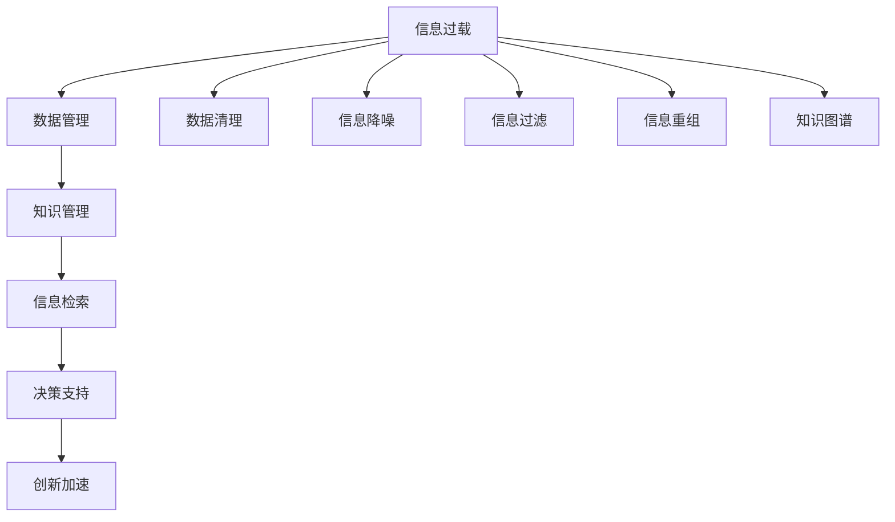

                 

# 信息过载与知识管理系统实施：有效组织和检索信息的指南

> 关键词：信息过载,知识管理系统,信息检索,数据管理,人工智能

## 1. 背景介绍

在当今信息爆炸的时代，数据的激增给企业和个人带来了前所未有的挑战。如何有效管理和利用这些数据，以支撑决策、创新和运营，是摆在每个组织面前的重要课题。信息过载（Information Overload），即信息超出个体处理能力的现象，已成为阻碍知识和智慧发展的瓶颈。为了应对这一挑战，知识管理系统（Knowledge Management System, KMS）成为了关键工具，它通过组织和检索信息，帮助用户快速找到所需知识，提高生产力和决策效率。本文将深入探讨信息过载问题，并详细介绍如何通过知识管理系统有效管理和检索信息。

## 2. 核心概念与联系

### 2.1 核心概念概述

在讨论知识管理系统实施前，首先需要明确几个核心概念及其联系：

- **信息过载**：由于信息量的巨大和复杂，超出人类处理能力，导致有效信息难以被识别和吸收，进而影响决策和创新。
- **知识管理系统**：通过软件工具和策略，系统化地收集、组织、存储、检索和共享知识，以提高组织的学习和适应能力。
- **信息检索**：从大量信息中快速准确地检索出所需信息的过程，是知识管理系统的核心功能之一。
- **数据管理**：通过技术手段确保数据的质量、安全、一致性和可用性，为知识管理提供坚实的数据基础。

以上概念之间相互关联，信息过载问题需要通过有效的知识管理和信息检索来解决。数据管理则是知识管理和信息检索的基础，保证了数据的完整性和可靠性。

### 2.2 核心概念原理和架构的 Mermaid 流程图



该流程图展示了信息过载问题到知识管理系统实施的整个过程。信息过载问题通过数据管理、知识管理和信息检索等环节得到缓解，最终支持决策和创新。

## 3. 核心算法原理 & 具体操作步骤

### 3.1 算法原理概述

知识管理系统实施的算法原理主要包括数据管理、知识管理、信息检索和决策支持。其中，信息检索算法是关键，它通过优化检索模型和策略，从大规模数据中高效地检索出所需信息。

### 3.2 算法步骤详解

信息检索算法主要分为以下几个步骤：

1. **数据预处理**：包括数据清洗、降噪和过滤，去除冗余和噪声，确保数据质量。
2. **特征提取**：从数据中提取关键词、短语和概念，用于构建检索模型。
3. **构建索引**：建立倒排索引、向量空间模型等，加速检索过程。
4. **检索模型训练**：使用机器学习算法（如TF-IDF、LDA等）训练检索模型，优化检索效果。
5. **结果排序**：根据相关性、可用性和新颖性等指标，对检索结果进行排序，推荐最佳信息。

### 3.3 算法优缺点

信息检索算法的优点在于能够快速、高效地从大量数据中检索出所需信息。其缺点在于需要大量标注数据来训练模型，且对数据质量要求较高，复杂度较高。

### 3.4 算法应用领域

信息检索算法广泛应用于搜索引擎、图书馆系统、文档管理系统等领域，帮助用户快速找到所需信息。在企业内部，信息检索技术也被用于员工培训、项目管理、产品设计等场景，提升工作效率和决策质量。

## 4. 数学模型和公式 & 详细讲解 & 举例说明

### 4.1 数学模型构建

信息检索模型的核心是向量空间模型（Vector Space Model, VSM），它将文档和查询表示为向量，通过计算向量之间的余弦相似度来衡量相关性。

设文档集合为 $D=\{d_1, d_2, ..., d_n\}$，查询为 $q$，向量空间中的文档向量表示为 $\{v_1, v_2, ..., v_n\}$，查询向量表示为 $v_q$。则文档 $d_i$ 和查询 $q$ 之间的余弦相似度 $sim(d_i, q)$ 为：

$$
sim(d_i, q) = \frac{v_i \cdot v_q}{\|v_i\|\|v_q\|}
$$

其中 $\cdot$ 表示向量点积，$\|\cdot\|$ 表示向量范数。

### 4.2 公式推导过程

向量空间模型的推导基于以下假设：
- 文档和查询均由一组关键词组成。
- 每个关键词在文档和查询中均有固定权重，权重反映其在信息检索中的重要性。

对于文档 $d_i$ 和查询 $q$，可以分别表示为：

$$
v_i = \{w_{i1}, w_{i2}, ..., w_{im}\}
$$

$$
v_q = \{w_{q1}, w_{q2}, ..., w_{qm}\}
$$

其中 $w_{ij}$ 表示关键词 $j$ 在文档 $i$ 和查询 $q$ 中的权重。

计算向量点积 $v_i \cdot v_q$ 和向量范数 $\|v_i\|$ 和 $\|v_q\|$，即可得到余弦相似度 $sim(d_i, q)$。

### 4.3 案例分析与讲解

以一个简单的图书管理系统为例，假设有一组图书数据 $D=\{d_1, d_2, ..., d_n\}$，每本书由书名、作者、摘要等属性构成。用户查询 "Python 深度学习"，可以将其表示为向量 $v_q$。对于每本书 $d_i$，计算其与查询的余弦相似度，并按照相似度排序，返回最相关的书籍列表。

通过以上过程，信息检索算法帮助用户快速定位到所需的图书，提升了信息检索的效率。

## 5. 项目实践：代码实例和详细解释说明

### 5.1 开发环境搭建

使用Python和Elasticsearch进行信息检索系统的开发。安装Python环境，使用Elasticsearch作为搜索引擎，具体步骤如下：

1. 安装Elasticsearch和Kibana，搭建Elasticsearch集群。
2. 安装Python的Elasticsearch客户端库，如Elasticsearch-Py。
3. 使用pip安装NLTK库，用于文本处理和特征提取。

### 5.2 源代码详细实现

下面是一个简单的信息检索系统代码实现，使用Python和Elasticsearch进行图书管理系统检索：

```python
from elasticsearch import Elasticsearch
from nltk.corpus import stopwords
from nltk.tokenize import word_tokenize

# 初始化Elasticsearch客户端
es = Elasticsearch([{'host': 'localhost', 'port': 9200}])

# 构建图书索引
index_name = 'books'
doc_type = 'book'
mapping = {
    'properties': {
        'title': {'type': 'text'},
        'author': {'type': 'text'},
        'abstract': {'type': 'text'}
    }
}

es.indices.create(index=index_name, body=mapping)

# 将图书数据添加到索引中
docs = [
    {'title': 'Python深度学习', 'author': '张三', 'abstract': 'Python深度学习入门'}
]

es.bulk(index=index_name, doc_types=doc_type, body=docs)

# 用户查询图书
query = 'Python 深度学习'
query_doc = es.search(index=index_name, body={"query": {"match": {"abstract": query}}})

# 返回检索结果
results = []
for hit in query_doc['hits']['hits']:
    results.append(hit['_source'])

print(results)
```

### 5.3 代码解读与分析

**初始化Elasticsearch客户端**：使用Python的Elasticsearch客户端库，连接本地Elasticsearch集群。

**构建图书索引**：定义图书索引的结构，包含书名、作者和摘要等字段。

**添加图书数据**：将图书数据添加到Elasticsearch索引中。

**用户查询图书**：使用Elasticsearch的搜索API，对图书的摘要字段进行匹配查询，返回与查询最相关的图书。

**返回检索结果**：对查询结果进行处理，提取图书的标题和作者信息，打印输出。

### 5.4 运行结果展示

运行上述代码，即可在Elasticsearch中检索到与查询最相关的图书。该系统能够快速定位到用户所需的图书信息，提升了信息检索的效率。

## 6. 实际应用场景

### 6.1 企业知识管理

在企业内部，知识管理系统的应用非常广泛。企业可以借助信息检索技术，将文档、邮件、项目报告等知识资源整合，快速检索所需信息，提升员工工作效率和决策质量。例如，企业内部文档管理系统可以集成信息检索功能，员工可以快速查找所需文档，避免重复工作。

### 6.2 图书馆和档案馆

图书馆和档案馆是信息检索技术的重要应用场景。图书馆管理系统可以集成信息检索功能，帮助读者快速定位到所需的图书资源。档案馆也可以利用信息检索技术，从海量档案中快速检索出所需信息，提升档案管理效率。

### 6.3 医疗健康信息

医疗健康信息领域，信息检索技术同样大有可为。医院可以利用信息检索技术，快速检索患者病历、医疗记录等信息，提升诊断和治疗效率。医疗数据库管理系统也可以集成信息检索功能，帮助医生快速查找相关病例和医学文献。

### 6.4 未来应用展望

随着人工智能和大数据技术的发展，信息检索技术也将迎来新的突破。未来，信息检索系统可以更加智能化，自动理解和生成查询，提升检索效率。同时，信息检索系统还可以结合知识图谱和语义分析技术，提升检索结果的相关性和准确性。

## 7. 工具和资源推荐

### 7.1 学习资源推荐

为了帮助开发者掌握信息检索技术，推荐以下学习资源：

1. 《信息检索原理与技术》：系统介绍信息检索的基本原理和算法，包括TF-IDF、LDA等经典方法。
2. 《Python Elasticsearch Cookbook》：详细介绍Elasticsearch的使用，包含搜索、分析和聚合等功能的实现。
3. Coursera《信息检索》课程：斯坦福大学开设的在线课程，涵盖信息检索的基本概念和算法，适合初学者学习。
4. ArXiv上的相关论文：了解最新的信息检索技术和算法，跟踪前沿研究。

### 7.2 开发工具推荐

信息检索技术的开发需要使用Elasticsearch等搜索引擎，推荐以下开发工具：

1. Elasticsearch-Py：Python的Elasticsearch客户端库，方便进行Elasticsearch的操作。
2. NLTK：Python的自然语言处理库，用于文本处理和特征提取。
3. Jupyter Notebook：支持Python的交互式开发环境，方便调试和测试。

### 7.3 相关论文推荐

以下是几篇信息检索领域的重要论文，推荐阅读：

1. "Information Retrieval: Concepts, Issues, and Evaluation" by Christopher D. Manning, Prabhakar Raghavan, Hinrich Schütze（信息检索的原理、问题和评估）
2. "TREC: A Track and Evaluation for Information Retrieval" by Robert N. Burkhard, William L. Kautz, Belkis M. Langhammer, George G. da Rezende, Kevin C. Scherer（TREC评测集，用于信息检索的基准测试）
3. "BERT: Pre-training of Deep Bidirectional Transformers for Language Understanding" by Jacob Devlin, Ming-Wei Chang, Kenton Lee, Kristina Toutanova（BERT预训练模型，提升信息检索的效果）

## 8. 总结：未来发展趋势与挑战

### 8.1 总结

本文详细介绍了信息过载问题及其通过知识管理系统和信息检索技术的解决路径。从数据管理、知识管理到信息检索，每个环节都需精细设计和优化，才能实现高效的信息检索。Elasticsearch等工具的使用，使得信息检索技术变得更加易于实现和优化。

通过本文的系统梳理，可以看到，信息检索技术在企业知识管理、图书馆档案馆、医疗健康等领域有着广泛的应用前景。利用Elasticsearch等搜索引擎，结合TF-IDF、LDA等经典算法，开发者可以高效地实现信息检索系统，提升信息检索的效率和准确性。

### 8.2 未来发展趋势

展望未来，信息检索技术将呈现以下几个发展趋势：

1. 智能化检索：结合人工智能技术，如BERT、GPT等，提升检索结果的相关性和准确性。
2. 实时检索：通过流式处理和实时计算，实现实时信息检索，支持动态更新和即时响应。
3. 多模态检索：结合图像、视频、音频等多模态数据，实现跨模态的信息检索。
4. 语义检索：引入自然语言处理和语义分析技术，提升检索结果的语义理解和匹配度。
5. 个性化检索：通过用户行为分析和推荐系统，实现个性化信息检索，提升用户体验。

### 8.3 面临的挑战

尽管信息检索技术在诸多领域得到了广泛应用，但仍面临以下挑战：

1. 数据质量问题：信息检索依赖高质量的数据，数据清理、降噪和过滤仍是重要挑战。
2. 算法复杂度：信息检索算法复杂度较高，需要大量标注数据进行模型训练，难以自动化和大规模部署。
3. 用户界面设计：信息检索系统需要良好的用户界面设计，以提升用户体验。
4. 安全与隐私：信息检索涉及大量敏感信息，需要确保数据安全和隐私保护。

### 8.4 研究展望

面对信息检索技术面临的挑战，未来的研究需要在以下几个方面寻求新的突破：

1. 数据增强技术：利用数据增强技术，提高数据质量和数量，解决数据不足的问题。
2. 深度学习算法：结合深度学习算法，提升信息检索的精度和效率。
3. 分布式计算：采用分布式计算技术，支持大规模数据处理和实时检索。
4. 多语言检索：扩展信息检索技术到多语言场景，支持跨语言信息检索。
5. 融合新兴技术：结合新兴技术，如区块链、边缘计算等，提升信息检索的安全性和可靠性。

这些研究方向的探索，将推动信息检索技术不断向前发展，为信息过载问题提供更加高效的解决方案。相信在学界和产业界的共同努力下，信息检索技术必将不断成熟和完善，为知识管理和大数据应用带来更多的可能性。

## 9. 附录：常见问题与解答

**Q1：信息检索算法如何应对数据多样性？**

A: 信息检索算法可以通过多策略融合和算法选择，应对不同类型和格式的数据。例如，对于结构化数据，可以使用SQL查询等传统方法；对于半结构化数据，可以使用JSONPath等解析方法；对于非结构化数据，可以使用TF-IDF、LDA等算法。

**Q2：信息检索算法如何处理噪声数据？**

A: 噪声数据是信息检索的重要挑战。信息检索算法可以通过预处理步骤，如数据清洗和噪声过滤，去除冗余和噪声。也可以使用去噪自动编码器等方法，在检索模型训练过程中学习降噪技术。

**Q3：信息检索算法如何提升检索结果的相关性？**

A: 提升检索结果的相关性是信息检索的核心目标。可以通过优化检索模型，引入语义分析和信息融合技术，如知识图谱、文本摘要等，提升检索结果的相关性和准确性。同时，引入用户反馈和互动机制，优化检索策略。

**Q4：信息检索算法如何保障数据安全和隐私？**

A: 信息检索涉及大量敏感信息，保障数据安全和隐私是重要任务。可以通过加密传输、访问控制、数据脱敏等技术手段，确保数据安全和隐私保护。同时，采用联邦学习等技术，实现数据本地化处理和隐私保护。

---

作者：禅与计算机程序设计艺术 / Zen and the Art of Computer Programming

