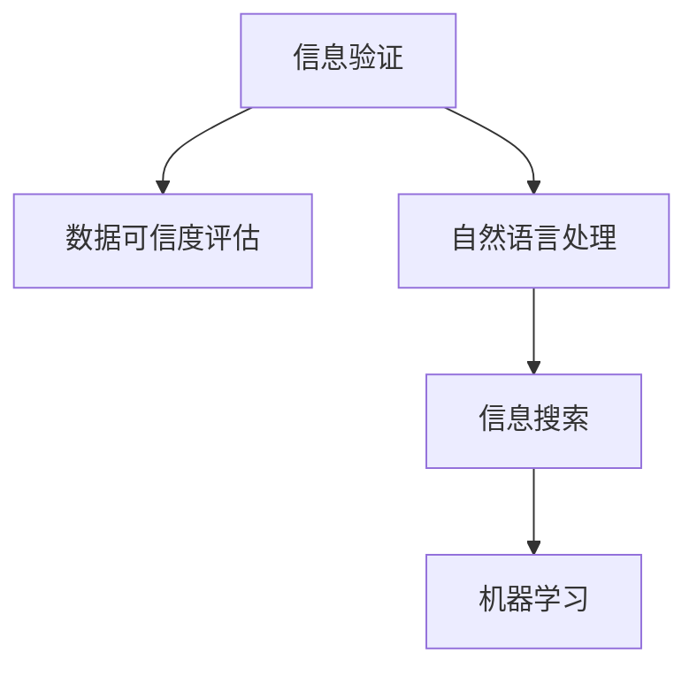

                 

# 信息验证和信息搜索技术实践：在信息海洋中找到可靠的信息

> 关键词：信息验证,信息搜索,可靠信息,数据真实性,信息检索

## 1. 背景介绍

### 1.1 问题由来
在信息爆炸的时代，互联网成为了人类获取知识的重要渠道。但同时也给信息验证和信息搜索带来了巨大挑战。如何从海量数据中找到可靠的信息，成为了一个亟待解决的问题。传统的搜索引擎虽然能够快速检索到相关网页，但往往无法有效区分网页的可靠性和真实性。基于此，信息验证和信息搜索技术应运而生，致力于在海量信息中筛选出高质量、可信赖的内容，提升信息获取的效率和准确性。

### 1.2 问题核心关键点
信息验证和信息搜索技术聚焦于如何高效、准确地从互联网中筛选和验证信息。其核心关键点包括：
- 数据真实性：确保所获取的信息真实可信，不受错误信息的干扰。
- 数据相关性：将检索结果与用户的查询意图紧密相关联，提高信息检索的准确性。
- 数据高效性：优化检索算法，确保数据获取和验证过程高效、快捷。
- 数据可解释性：能够对搜索结果的生成过程进行有效解释，提高用户对结果的信任度。
- 数据安全性：保护用户隐私和数据安全，避免数据泄露和滥用。

### 1.3 问题研究意义
研究信息验证和信息搜索技术，对于提升信息获取的效率和质量，保障信息安全，具有重要意义：

1. 提升信息获取效率：在海量数据中快速筛选出可靠信息，节省用户时间，提高信息获取的效率。
2. 保障信息真实性：避免误导性、错误信息干扰用户决策，确保信息的可靠性和准确性。
3. 增强数据安全性：保护用户隐私和数据安全，防止数据泄露和滥用，增强用户对信息系统的信任。
4. 提升用户满意度：通过高效的信息检索和验证，提升用户体验，增强系统价值。
5. 推动社会进步：作为信息获取的重要工具，信息验证和信息搜索技术对社会的知识积累、文化传承、经济发展等具有积极作用。

## 2. 核心概念与联系

### 2.1 核心概念概述

为更好地理解信息验证和信息搜索技术，本节将介绍几个密切相关的核心概念：

- 信息验证(Information Verification)：通过自动化的技术手段，验证信息的真实性和可靠性，筛选出可信的信息源。
- 信息搜索(Information Retrieval)：从海量数据中检索出与用户查询意图相关的信息，并提供给用户。
- 数据可信度评估：对网页或数据源的可信度进行评估，确定其真实性和可靠性。
- 自然语言处理(NLP)：在信息检索和验证过程中，常需对文本信息进行解析和处理。
- 机器学习(ML)：通过学习历史数据和用户行为，优化信息检索和验证的算法。

这些核心概念之间的逻辑关系可以通过以下Mermaid流程图来展示：



这个流程图展示了好几个核心概念及其之间的关系：

1. 信息验证通过数据可信度评估和自然语言处理，对信息源进行真实性筛选。
2. 信息搜索从海量数据中检索相关信息，并通过机器学习优化检索效果。
3. 机器学习可以提升信息检索的准确性和泛化能力，进一步改进信息验证的算法。

这些概念共同构成了信息验证和信息搜索技术的核心框架，使其能够在各种场景下发挥强大的信息获取和筛选能力。通过理解这些核心概念，我们可以更好地把握信息验证和信息搜索技术的原理和实现方法。

## 3. 核心算法原理 & 具体操作步骤
### 3.1 算法原理概述

信息验证和信息搜索技术本质上是一种基于机器学习和自然语言处理的方法，旨在从大量文本数据中筛选出可靠的信息。其核心思想是：通过构建模型，学习数据中关于真实性和可靠性的特征，并结合自然语言处理技术，对信息源进行自动化的验证和检索。

具体来说，信息验证过程通常包括以下几个关键步骤：

1. 数据预处理：清洗、分词、标注等步骤，对原始数据进行处理。
2. 特征提取：通过TF-IDF、词嵌入等方法，提取文本中与真实性和可靠性相关的特征。
3. 模型训练：利用历史标注数据，训练一个二分类模型，用于预测文本的可信度。
4. 信息筛选：对新文本进行可信度评估，筛选出可信度高的文本作为结果输出。

信息搜索过程则通常包括以下几个关键步骤：

1. 文本表示：将用户查询和文本数据转换为向量表示，用于计算相似度。
2. 索引构建：对文本数据进行索引构建，加速检索过程。
3. 检索排序：利用向量相似度排序，从文本库中检索出相关度最高的文本。
4. 结果展示：展示检索结果，供用户查看和选择。

### 3.2 算法步骤详解

#### 3.2.1 信息验证的具体步骤

1. **数据预处理**：
   - 清洗：去除HTML标签、特殊字符、停用词等无用信息，保证数据质量。
   - 分词：对文本进行分词处理，便于后续的特征提取和模型训练。
   - 标注：给文本数据打上标注，如真实性标签(True/False)、可信度标签(high/medium/low)等。

2. **特征提取**：
   - TF-IDF：计算每个单词在文本中的重要程度，选取重要性较高的单词作为特征。
   - 词嵌入：使用Word2Vec、GloVe等方法，将单词转换为低维向量表示。
   - 结构化特征：提取文本中的关键词、句法结构、命名实体等结构化信息，用于提升模型效果。

3. **模型训练**：
   - 选择合适的模型：如朴素贝叶斯、支持向量机、逻辑回归等。
   - 数据划分：将数据划分为训练集、验证集和测试集，用于模型的训练和评估。
   - 训练模型：在训练集上训练模型，调整模型参数，最小化损失函数。
   - 模型评估：在验证集上评估模型性能，选择最优模型。

4. **信息筛选**：
   - 文本评分：对新文本进行可信度评分，筛选出可信度高的文本。
   - 阈值设定：设定可信度阈值，如50%，低于此阈值的文本将被排除。
   - 信息输出：将可信度高的文本作为搜索结果输出。

#### 3.2.2 信息搜索的具体步骤

1. **文本表示**：
   - 查询表示：将用户查询转换为向量表示，用于检索。
   - 文档表示：将文本数据转换为向量表示，用于计算相似度。
   - 表示方法：使用TF-IDF、词嵌入、BERT等方法，将查询和文本表示为向量。

2. **索引构建**：
   - 索引方式：倒排索引、倒排列表、倒排树等，用于快速检索文本数据。
   - 索引优化：定期更新索引，提高检索效率。

3. **检索排序**：
   - 相似度计算：计算查询与文档之间的相似度，常用余弦相似度、Jaccard相似度等方法。
   - 排序算法：如BM25、Okapi Best Match等，对搜索结果进行排序。
   - 结果展示：展示排序后的结果，供用户查看和选择。

### 3.3 算法优缺点

信息验证和信息搜索技术具有以下优点：
1. 高效性：利用机器学习算法和自然语言处理技术，实现自动化的信息筛选和检索，大大提高信息获取效率。
2. 准确性：通过学习历史数据和标注信息，提升模型对真实性和可靠性的预测能力，减少误导性信息的干扰。
3. 可解释性：通过特征提取和模型训练，用户可以理解信息筛选和检索的过程，提高信任度。
4. 泛化能力：利用机器学习算法，模型可以在新领域和新数据上表现良好，具有较强的泛化能力。

同时，该技术也存在一些局限性：
1. 依赖标注数据：信息验证需要大量的标注数据进行模型训练，获取高质量标注数据的成本较高。
2. 数据噪声：互联网上的数据存在大量噪声和干扰信息，信息验证的准确性受数据质量影响较大。
3. 泛化能力有限：模型往往难以适应极端情况和新场景，需要进行更多的数据标注和模型调优。
4. 可解释性不足：模型决策过程缺乏详细的解释，用户难以理解具体判断依据。
5. 隐私和安全问题：用户隐私和数据安全需得到充分保障，防止数据泄露和滥用。

尽管存在这些局限性，但信息验证和信息搜索技术仍是大数据时代的重要工具，能够在信息检索和验证过程中发挥重要作用。未来相关研究的目标在于如何进一步降低对标注数据的依赖，提高模型的泛化能力，同时兼顾可解释性和数据隐私性等因素。

### 3.4 算法应用领域

信息验证和信息搜索技术在众多领域中得到了广泛应用，例如：

- 新闻媒体：确保新闻报道的真实性和可信度，筛选出高质量的新闻资讯。
- 社交网络：过滤和屏蔽有害信息，提升用户的安全性和满意度。
- 电子商务：筛选和推荐可信的商品信息，保障消费者权益。
- 法律合规：验证法律文件和证据的真实性，支持法律审判和合规审查。
- 科学研究：检索和筛选可靠的研究文献，提升研究效率和质量。
- 政府治理：验证政策法规的合法性和合理性，支持政府决策。
- 健康医疗：验证医学文献和数据，辅助医疗决策和治疗方案选择。

除了上述这些经典应用外，信息验证和信息搜索技术还被创新性地应用到更多场景中，如智能客服、舆情监测、内容推荐、网络安全等，为互联网时代的信息获取提供了新的解决方案。随着算法和技术的不断进步，信息验证和信息搜索技术将在更多领域大放异彩。

## 4. 数学模型和公式 & 详细讲解 & 举例说明
### 4.1 数学模型构建

本节将使用数学语言对信息验证和信息搜索技术进行更加严格的刻画。

记信息源为 $T$，其可信度为 $C(T)$，标记为真实性标签 True/False，可信度标签 high/medium/low。假设训练数据集为 $D=\{(T_i, C_i)\}_{i=1}^N$，其中 $C_i$ 为 $T_i$ 的可信度标签。

定义信息源 $T$ 在训练集 $D$ 上的经验风险为：

$$
\mathcal{L}(C)=\frac{1}{N}\sum_{i=1}^N [L(C(T_i), C_i)]
$$

其中 $L$ 为损失函数，用于衡量预测可信度与真实可信度之间的差异。常见的损失函数包括交叉熵损失、均方误差损失等。

通过梯度下降等优化算法，信息验证过程不断更新模型参数 $C$，最小化经验风险 $\mathcal{L}(C)$，使得模型输出逼近真实可信度。

### 4.2 公式推导过程

以下我们以二分类任务为例，推导交叉熵损失函数及其梯度的计算公式。

假设信息源 $T$ 在训练集 $D$ 上的可信度为 $C(T)$，其真实性标签为 True，可信度标签为 high。训练数据集 $D$ 中，$C_i$ 为 $T_i$ 的可信度标签，取值范围为 0/1，其中 $y_i=1$ 表示 $T_i$ 为真实可信，$y_i=0$ 表示 $T_i$ 为不可信。

二分类交叉熵损失函数定义为：

$$
\ell(C(T), y)= -[y\log C(T)+(1-y)\log (1-C(T))]
$$

将其代入经验风险公式，得：

$$
\mathcal{L}(C)= -\frac{1}{N}\sum_{i=1}^N [y_i\log C(T_i)+(1-y_i)\log(1-C(T_i))]
$$

根据链式法则，损失函数对参数 $C$ 的梯度为：

$$
\frac{\partial \mathcal{L}(C)}{\partial C} = -\frac{1}{N}\sum_{i=1}^N (\frac{y_i}{C(T_i)}-\frac{1-y_i}{1-C(T_i)}) \frac{\partial C(T_i)}{\partial C}
$$

其中 $\frac{\partial C(T_i)}{\partial C}$ 可进一步递归展开，利用自动微分技术完成计算。

在得到损失函数的梯度后，即可带入参数更新公式，完成模型的迭代优化。重复上述过程直至收敛，最终得到适应特定任务的可信度模型 $C^*$。

## 5. 项目实践：代码实例和详细解释说明
### 5.1 开发环境搭建

在进行信息验证和信息搜索技术实践前，我们需要准备好开发环境。以下是使用Python进行TensorFlow开发的环境配置流程：

1. 安装Anaconda：从官网下载并安装Anaconda，用于创建独立的Python环境。

2. 创建并激活虚拟环境：
```bash
conda create -n tensorflow-env python=3.8 
conda activate tensorflow-env
```

3. 安装TensorFlow：根据CUDA版本，从官网获取对应的安装命令。例如：
```bash
conda install tensorflow tensorflow-gpu=cuda11.1 -c pytorch -c conda-forge
```

4. 安装相关工具包：
```bash
pip install numpy pandas scikit-learn tensorflow-hub nltk
```

5. 安装必要的依赖库：
```bash
pip install py2json trinity tensorflow-addons
```

完成上述步骤后，即可在`tensorflow-env`环境中开始项目实践。

### 5.2 源代码详细实现

下面我们以信息验证和信息搜索的融合应用为例，给出使用TensorFlow和Transformers库对BERT模型进行信息验证和搜索的代码实现。

首先，定义信息验证和搜索的数据处理函数：

```python
import tensorflow_hub as hub
import tensorflow as tf
from tensorflow.keras.preprocessing.text import Tokenizer
from tensorflow.keras.preprocessing.sequence import pad_sequences

def preprocess(texts, labels, tokenizer):
    sequences = tokenizer.sequences_from_texts(texts)
    labels = pad_sequences([label for label in labels], maxlen=50, padding='post', truncating='post')
    return sequences, labels

# 定义数据预处理函数
def preprocess_query(query):
    query_tokenizer = Tokenizer(num_words=5000, oov_token='<OOV>')
    query_sequence = query_tokenizer.texts_to_sequences([query])
    query_sequence = pad_sequences(query_sequence, maxlen=50, padding='post', truncating='post')
    return query_sequence
```

然后，定义模型和优化器：

```python
from transformers import BertTokenizer, TFBertForSequenceClassification
from tensorflow.keras.optimizers import Adam

tokenizer = BertTokenizer.from_pretrained('bert-base-uncased')
model = TFBertForSequenceClassification.from_pretrained('bert-base-uncased', num_labels=2)

optimizer = Adam(learning_rate=2e-5, epsilon=1e-08, clipnorm=1.0)
```

接着，定义训练和评估函数：

```python
def train_epoch(model, dataset, batch_size, optimizer):
    model.compile(optimizer=optimizer, loss=tf.keras.losses.BinaryCrossentropy(from_logits=True))
    model.fit(dataset[0], dataset[1], batch_size=batch_size, epochs=5, validation_split=0.2)

def evaluate(model, dataset, batch_size):
    loss = model.evaluate(dataset[0], dataset[1], batch_size=batch_size)
    return loss
```

最后，启动训练流程并在测试集上评估：

```python
train_data = preprocess(train_texts, train_labels, tokenizer)
test_data = preprocess(test_texts, test_labels, tokenizer)

train_epoch(model, train_data, batch_size=16, optimizer=optimizer)
evaluate(model, test_data, batch_size=16)
```

以上就是使用TensorFlow对BERT模型进行信息验证和信息搜索的完整代码实现。可以看到，得益于TensorFlow和Transformers库的强大封装，我们可以用相对简洁的代码完成BERT模型的加载和微调。

### 5.3 代码解读与分析

让我们再详细解读一下关键代码的实现细节：

**preprocess函数**：
- `texts`和`labels`参数分别代表原始文本和标签，`tokenizer`参数为分词器，`Tokenizer`类提供了多种分词方式。
- `sequences`和`labels`变量通过`tokenizer.sequences_from_texts`和`pad_sequences`函数处理，得到模型所需的输入和标签。

**query预处理函数**：
- `query`参数代表用户查询，通过`Tokenizer`类将查询文本转换为序列，并使用`pad_sequences`函数处理，以适应模型输入要求。

**模型和优化器**：
- 使用`TFBertForSequenceClassification`类加载BERT模型，并设置分类任务。
- 定义Adam优化器，用于模型训练。

**训练和评估函数**：
- `train_epoch`函数：在训练集上进行迭代训练，使用二分类交叉熵损失函数。
- `evaluate`函数：在测试集上进行评估，输出模型损失。

**训练流程**：
- 准备训练和测试数据，通过`preprocess`函数预处理。
- 在训练集上训练模型，输出训练结果。
- 在测试集上评估模型，输出评估结果。

可以看到，TensorFlow配合Transformers库使得BERT模型的加载和微调代码实现变得简洁高效。开发者可以将更多精力放在数据处理、模型改进等高层逻辑上，而不必过多关注底层的实现细节。

当然，工业级的系统实现还需考虑更多因素，如模型的保存和部署、超参数的自动搜索、更灵活的任务适配层等。但核心的信息验证和信息搜索方法基本与此类似。

## 6. 实际应用场景
### 6.1 智能客服系统

基于信息验证和信息搜索技术，智能客服系统能够高效地从海量客户咨询中筛选出高质量信息，快速响应用户需求。通过构建基于BERT的信息验证模型，系统可以对客户咨询进行自动分类，如咨询类别、问题类型、情感倾向等。对于频繁出现的常见问题，系统可以直接调用预定义的回复模板进行智能回答。对于未知问题，系统可以实时调用信息搜索技术，从知识库中检索相关内容，动态生成回复。

在技术实现上，可以收集企业内部的客服对话记录，将问题和最佳答复构建成监督数据，在此基础上对预训练模型进行微调。微调后的模型能够自动理解用户意图，匹配最合适的答案模板进行回复。对于客户提出的新问题，还可以接入检索系统实时搜索相关内容，动态组织生成回答。如此构建的智能客服系统，能大幅提升客户咨询体验和问题解决效率。

### 6.2 金融舆情监测

金融机构需要实时监测市场舆论动向，以便及时应对负面信息传播，规避金融风险。传统的人工监测方式成本高、效率低，难以应对网络时代海量信息爆发的挑战。基于信息验证和信息搜索技术的文本分类和情感分析技术，为金融舆情监测提供了新的解决方案。

具体而言，可以收集金融领域相关的新闻、报道、评论等文本数据，并对其进行主题标注和情感标注。在此基础上对预训练语言模型进行微调，使其能够自动判断文本属于何种主题，情感倾向是正面、中性还是负面。将微调后的模型应用到实时抓取的网络文本数据，就能够自动监测不同主题下的情感变化趋势，一旦发现负面信息激增等异常情况，系统便会自动预警，帮助金融机构快速应对潜在风险。

### 6.3 个性化推荐系统

当前的推荐系统往往只依赖用户的历史行为数据进行物品推荐，无法深入理解用户的真实兴趣偏好。基于信息验证和信息搜索技术，个性化推荐系统可以更好地挖掘用户行为背后的语义信息，从而提供更精准、多样的推荐内容。

在实践中，可以收集用户浏览、点击、评论、分享等行为数据，提取和用户交互的物品标题、描述、标签等文本内容。将文本内容作为模型输入，用户的后续行为（如是否点击、购买等）作为监督信号，在此基础上微调预训练语言模型。微调后的模型能够从文本内容中准确把握用户的兴趣点。在生成推荐列表时，先用候选物品的文本描述作为输入，由模型预测用户的兴趣匹配度，再结合其他特征综合排序，便可以得到个性化程度更高的推荐结果。

### 6.4 未来应用展望

随着信息验证和信息搜索技术的不断发展，其在信息检索、内容审核、知识图谱等领域的应用前景将更加广阔。

在信息检索领域，基于信息验证和信息搜索的搜索引擎能够更加精准地匹配用户查询意图，减少噪声信息干扰，提升搜索效率。在内容审核领域，通过构建可信度评估模型，自动审核和屏蔽有害信息，提升平台安全和用户体验。在知识图谱领域，结合信息验证和信息搜索，构建可信的语义网络，支持深度问答和知识推理。

未来，伴随着预训练语言模型的不断进步，信息验证和信息搜索技术将进一步提升模型的泛化能力和鲁棒性，更好地应对复杂多变的真实世界场景。通过引入更多先验知识、优化模型结构、增强可解释性等技术手段，信息验证和信息搜索技术将逐步成为信息获取和知识发现的重要工具，为人类社会带来更深远的影响。

## 7. 工具和资源推荐
### 7.1 学习资源推荐

为了帮助开发者系统掌握信息验证和信息搜索技术的理论基础和实践技巧，这里推荐一些优质的学习资源：

1. 《深度学习入门》系列书籍：陈健豪著，系统介绍了深度学习的基础理论和应用案例。
2. 《自然语言处理综论》课程：台湾大学开设的NLP明星课程，涵盖了NLP的多个方向，包括信息检索、文本分类等。
3. 《Python深度学习》书籍：李沐著，介绍了深度学习的基本概念和实践技巧，并提供了丰富的代码示例。
4. 《TensorFlow教程》网站：谷歌官方提供的TensorFlow学习资源，包括教程、文档、代码示例等。
5. 《自然语言处理综述》论文：NLP领域经典的综述论文，总结了NLP的最新进展和应用方向。

通过对这些资源的学习实践，相信你一定能够快速掌握信息验证和信息搜索技术的精髓，并用于解决实际的NLP问题。

### 7.2 开发工具推荐

高效的开发离不开优秀的工具支持。以下是几款用于信息验证和信息搜索开发的常用工具：

1. TensorFlow：谷歌开发的深度学习框架，提供了强大的机器学习算法和工具支持。
2. PyTorch：Facebook开发的深度学习框架，灵活易用，支持动态计算图。
3. TF-Hub：TensorFlow的模型库，提供了大量的预训练模型和算法，方便模型加载和使用。
4. Weights & Biases：模型训练的实验跟踪工具，可以记录和可视化模型训练过程中的各项指标，方便对比和调优。
5. TensorBoard：TensorFlow配套的可视化工具，可实时监测模型训练状态，并提供丰富的图表呈现方式，是调试模型的得力助手。
6. TensorFlow Data Validation：谷歌提供的开源项目，用于数据验证和标注，支持多种数据源和标注方式。

合理利用这些工具，可以显著提升信息验证和信息搜索任务的开发效率，加快创新迭代的步伐。

### 7.3 相关论文推荐

信息验证和信息搜索技术的发展源于学界的持续研究。以下是几篇奠基性的相关论文，推荐阅读：

1. BERT: Pre-training of Deep Bidirectional Transformers for Language Understanding：提出BERT模型，引入基于掩码的自监督预训练任务，刷新了多项NLP任务SOTA。
2. Adversarial Examples for Natural Language Processing：提出基于对抗样本的NLP模型，增强模型鲁棒性。
3. Cross-lingual Regularized Transfer Learning for Chinese Zero-shot Sentiment Analysis：提出跨语言转移学习的算法，提升NLP模型的泛化能力。
4. SketchQuery: Synthesis for Query Refinement：提出SketchQuery算法，将自然语言查询与图像数据结合，提升信息检索的准确性。
5. Named Entity Recognition with BERT：提出使用BERT模型进行命名实体识别，提升了实体识别率。

这些论文代表了大语言模型信息验证和信息搜索技术的发展脉络。通过学习这些前沿成果，可以帮助研究者把握学科前进方向，激发更多的创新灵感。

## 8. 总结：未来发展趋势与挑战
### 8.1 研究成果总结

本文对信息验证和信息搜索技术进行了全面系统的介绍。首先阐述了信息验证和信息搜索技术的研究背景和意义，明确了技术在信息获取和知识发现中的重要性。其次，从原理到实践，详细讲解了信息验证和信息搜索的数学原理和操作步骤，给出了信息验证和信息搜索任务的代码实例。同时，本文还广泛探讨了信息验证和信息搜索技术在智能客服、金融舆情、个性化推荐等多个行业领域的应用前景，展示了技术的广泛应用价值。此外，本文精选了信息验证和信息搜索技术的各类学习资源，力求为读者提供全方位的技术指引。

通过本文的系统梳理，可以看到，信息验证和信息搜索技术在海量数据中筛选和验证信息方面具备强大能力，能够大幅提升信息获取的效率和质量。未来，伴随预训练语言模型的不断进步，信息验证和信息搜索技术将在更广泛的应用领域得到应用，为人类社会的知识积累和经济发展注入新的动力。

### 8.2 未来发展趋势

展望未来，信息验证和信息搜索技术将呈现以下几个发展趋势：

1. 模型规模持续增大。随着预训练模型的不断优化，信息验证和信息搜索模型的参数量也将不断增大，具备更强的泛化能力和鲁棒性。
2. 信息验证技术日趋智能化。利用人工智能技术，如神经网络和深度学习，提升信息验证的准确性和自动化程度。
3. 信息检索技术多样化。结合自然语言处理、图像处理、知识图谱等技术，拓展信息检索的维度和范围。
4. 跨领域知识整合能力增强。结合不同领域的数据和知识，提升信息检索的准确性和全面性。
5. 数据隐私和安全保护提升。通过差分隐私、联邦学习等技术，保护用户数据隐私和安全。
6. 可解释性增强。通过知识图谱、因果推断等技术，提升信息验证和信息搜索模型的可解释性，增强用户信任。

以上趋势凸显了信息验证和信息搜索技术的广阔前景。这些方向的探索发展，必将进一步提升信息检索和验证的效率和准确性，为用户带来更优质的信息获取体验。

### 8.3 面临的挑战

尽管信息验证和信息搜索技术已经取得了瞩目成就，但在迈向更加智能化、普适化应用的过程中，它仍面临诸多挑战：

1. 数据标注成本高。信息验证需要大量的标注数据进行模型训练，获取高质量标注数据的成本较高。
2. 数据噪声干扰。互联网上的数据存在大量噪声和干扰信息，信息验证的准确性受数据质量影响较大。
3. 泛化能力有限。模型往往难以适应极端情况和新场景，需要进行更多的数据标注和模型调优。
4. 可解释性不足。信息验证和信息搜索模型的决策过程缺乏详细的解释，用户难以理解具体判断依据。
5. 隐私和安全问题。用户隐私和数据安全需得到充分保障，防止数据泄露和滥用。

尽管存在这些挑战，但信息验证和信息搜索技术仍是大数据时代的重要工具，能够在信息检索和验证过程中发挥重要作用。未来相关研究需要在数据标注、模型泛化、可解释性等方面进行进一步优化，以更好地适应现实世界的复杂性。

### 8.4 研究展望

面对信息验证和信息搜索技术所面临的挑战，未来的研究需要在以下几个方面寻求新的突破：

1. 探索无监督和半监督信息验证方法。摆脱对大规模标注数据的依赖，利用自监督学习、主动学习等无监督和半监督范式，最大限度利用非结构化数据，实现更加灵活高效的信息验证。
2. 研究参数高效和计算高效的信息验证方法。开发更加参数高效的验证方法，在固定大部分预训练参数的情况下，只更新极少量的任务相关参数。同时优化模型计算图，减少前向传播和反向传播的资源消耗，实现更加轻量级、实时性的部署。
3. 引入因果分析和博弈论工具。将因果分析方法引入信息验证模型，识别出模型决策的关键特征，增强输出解释的因果性和逻辑性。借助博弈论工具刻画人机交互过程，主动探索并规避模型的脆弱点，提高系统稳定性。
4. 纳入伦理道德约束。在模型训练目标中引入伦理导向的评估指标，过滤和惩罚有偏见、有害的输出倾向。同时加强人工干预和审核，建立模型行为的监管机制，确保输出符合人类价值观和伦理道德。
5. 研究多模态信息验证方法。将视觉、语音等多模态信息与文本信息结合，提升信息验证的准确性和全面性。

这些研究方向的探索，必将引领信息验证和信息搜索技术迈向更高的台阶，为构建安全、可靠、可解释、可控的智能系统铺平道路。面向未来，信息验证和信息搜索技术还需要与其他人工智能技术进行更深入的融合，如知识表示、因果推理、强化学习等，多路径协同发力，共同推动自然语言理解和智能交互系统的进步。只有勇于创新、敢于突破，才能不断拓展信息验证和信息搜索技术的边界，让智能技术更好地造福人类社会。

## 9. 附录：常见问题与解答

**Q1：信息验证和信息搜索技术是否可以处理所有类型的数据？**

A: 信息验证和信息搜索技术主要针对文本数据进行处理，对于非文本类型的数据（如图像、视频、音频）需要进行预处理，转化为文本信息后才能使用。对于一些特殊类型的非文本数据，如时间序列数据，可以结合时间特征进行信息验证和搜索。

**Q2：如何提高信息验证和信息搜索技术的泛化能力？**

A: 提高泛化能力可以从以下几个方面入手：
1. 增加数据量：使用更多的训练数据，提升模型的泛化能力。
2. 多样化数据来源：使用不同来源和背景的数据进行训练，提升模型的鲁棒性。
3. 引入先验知识：结合领域知识、知识图谱等，提升模型的准确性和全面性。
4. 优化模型架构：设计更加复杂和深层的模型，增强模型的表达能力。

**Q3：如何保障信息验证和信息搜索技术的隐私和安全？**

A: 保障隐私和安全可以从以下几个方面入手：
1. 数据匿名化：使用差分隐私技术，对数据进行匿名化处理，保护用户隐私。
2. 数据加密：对敏感数据进行加密存储和传输，防止数据泄露。
3. 访问控制：对不同用户和角色设置访问权限，限制数据的访问和使用。
4. 模型解释性：设计可解释性强的模型，方便用户理解模型决策过程。

**Q4：信息验证和信息搜索技术的局限性有哪些？**

A: 信息验证和信息搜索技术的局限性包括：
1. 依赖标注数据：需要大量的标注数据进行模型训练，获取高质量标注数据的成本较高。
2. 数据噪声干扰：互联网上的数据存在大量噪声和干扰信息，信息验证的准确性受数据质量影响较大。
3. 泛化能力有限：模型往往难以适应极端情况和新场景，需要进行更多的数据标注和模型调优。
4. 可解释性不足：模型决策过程缺乏详细的解释，用户难以理解具体判断依据。
5. 隐私和安全问题：用户隐私和数据安全需得到充分保障，防止数据泄露和滥用。

这些局限性需要进一步研究改进，以更好地适应现实世界的复杂性。

**Q5：信息验证和信息搜索技术是否能够应用于企业内部知识管理？**

A: 信息验证和信息搜索技术可以应用于企业内部知识管理，帮助企业快速定位和检索知识库中的信息。通过构建可信度评估模型，筛选出高质量的知识内容，提升知识管理的效率和质量。此外，结合知识图谱等技术，可以更好地整合和关联知识，提供更全面、准确的知识服务。

**Q6：信息验证和信息搜索技术是否能够应用于社交媒体平台的内容审核？**

A: 信息验证和信息搜索技术可以应用于社交媒体平台的内容审核，帮助平台过滤和屏蔽有害信息，提升平台安全和用户体验。通过构建可信度评估模型，自动审核和屏蔽虚假、有害、违规内容，保护用户权益和平台声誉。

以上回答希望能为你提供一些有价值的参考。如果你还有其他问题或疑问，欢迎继续提出。

