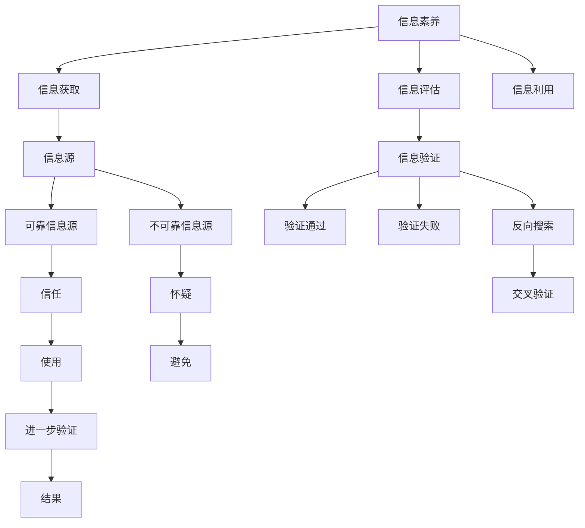

                 

# 信息验证和信息素养教育：为数字时代培养信息素养的学生

## 1. 背景介绍

### 1.1 问题由来
随着互联网的普及和数字技术的快速发展，信息素养（Information Literacy）已经成为每个人都需要掌握的基本能力。信息素养不仅包括对信息源的识别和判断，还包括对信息内容的深度理解和验证。然而，数字化时代的信息爆炸和假信息泛滥，给信息素养教育带来了新的挑战。

当前，学生获取信息的渠道日益多样化，但信息素养水平参差不齐。一些学生缺乏基本的验证信息真伪的能力，容易受到误导或诈骗。如何培养学生的批判性思维和信息素养，成为教育界需要重点解决的问题。

### 1.2 问题核心关键点
信息验证和信息素养教育的核心在于帮助学生学会：
1. **辨别信息源的可靠性**：学会区分权威和可靠的信息源，如政府网站、学术期刊、信誉良好的新闻机构等。
2. **理解信息内容的意义**：能从多个角度理解信息，分析其内在逻辑和关联性。
3. **验证信息的真实性**：掌握基本的信息验证方法，如交叉验证、反向搜索、事实核查等。
4. **批判性思维**：培养独立思考的习惯，不盲目接受未经核实的信息。
5. **科技伦理**：理解技术手段的局限性，避免滥用信息验证工具。

本论文将围绕信息验证和信息素养教育的核心概念，探讨其原理、操作步骤、应用领域及未来展望，以期为教育者提供系统的指导。

## 2. 核心概念与联系

### 2.1 核心概念概述

为更好地理解信息验证和信息素养教育，本节将介绍几个关键概念：

- **信息素养（Information Literacy）**：指个体获取、评估、利用信息的能力，包括信息意识、信息获取、信息评估、信息利用四个方面。
- **信息源（Information Source）**：信息的来源，包括书籍、期刊、数据库、网络等。
- **信息验证（Information Verification）**：通过多种方法确认信息真实性的过程，旨在辨别信息的真伪。
- **批判性思维（Critical Thinking）**：一种分析和评估信息的思维方式，强调独立思考和理性判断。
- **科技伦理（Ethics of Technology）**：在信息验证过程中，需要考虑的技术手段是否合理、公正、伦理。

这些概念通过以下Mermaid流程图关联起来：



这个流程图展示了信息素养的四个维度及其与信息源、信息验证、批判性思维和科技伦理之间的关系。通过这个图，我们可以更好地理解各个概念之间的联系和相互作用。

## 3. 核心算法原理 & 具体操作步骤

### 3.1 算法原理概述

信息验证和信息素养教育的核心算法原理基于以下几个步骤：

1. **信息获取**：利用搜索引擎、数据库等工具，获取相关信息。
2. **信息源评估**：根据信息源的权威性、可靠性、来源可信度等指标，评估信息源的可靠性。
3. **信息验证**：通过交叉验证、反向搜索、事实核查等方法，验证信息的真实性。
4. **信息分析**：从多个角度分析信息内容，理解其内在逻辑和关联性。
5. **信息利用**：将验证后的信息应用于决策、写作、研究等活动中。

### 3.2 算法步骤详解

信息验证和信息素养教育的具体操作步骤如下：

**Step 1: 信息获取**
- 使用搜索引擎（如Google、Bing等），输入关键词进行搜索。
- 利用学术数据库（如Google Scholar、PubMed等），获取权威的学术文章和研究报告。
- 访问政府网站、信誉良好的新闻机构（如BBC、CNN等），获取官方信息和新闻报道。

**Step 2: 信息源评估**
- 根据信息源的权威性、可靠性、来源可信度等指标，评估信息源的可靠性。
- 检查信息源的发布时间、作者资质、引用情况等，判断其权威性和可信度。
- 识别信息源的偏见和局限性，理解其可能存在的偏差。

**Step 3: 信息验证**
- 通过交叉验证，检查不同来源的信息是否一致。
- 使用反向搜索（Reverse Image Search），验证图片、视频的真实性。
- 事实核查（Fact-Checking），对照可信的新闻源和权威数据库，验证信息的准确性。
- 利用数据分析工具（如Tableau、Power BI等），进行数据可视化分析，验证数据的真实性。

**Step 4: 信息分析**
- 从多个角度分析信息内容，理解其内在逻辑和关联性。
- 使用思维导图工具（如MindMeister、MindNode等），构建信息内容的逻辑框架。
- 结合背景知识，理解信息的上下文意义。

**Step 5: 信息利用**
- 将验证后的信息应用于决策、写作、研究等活动中。
- 在写作和报告中引用可信的信息源，避免误导读者。
- 将信息应用于学术研究、政策制定、商业决策等活动中，提升决策质量。

### 3.3 算法优缺点

信息验证和信息素养教育的算法具有以下优点：
1. **提高信息获取的准确性**：通过多源验证和信息源评估，提高信息的可靠性和准确性。
2. **增强批判性思维**：通过系统的信息验证过程，培养学生的批判性思维和独立判断能力。
3. **促进知识更新**：通过不断验证信息，更新和巩固学生的知识体系。
4. **提升决策质量**：利用可信信息支持决策，减少决策失误。

同时，该算法也存在一定的局限性：
1. **依赖技术手段**：信息验证需要依赖一定的技术手段，如搜索引擎、数据分析工具等，可能受限于技术和设备的可用性。
2. **操作复杂性**：信息验证过程复杂，需要投入较多的时间和精力。
3. **主观性**：信息源评估和信息验证中的主观判断可能影响结果的客观性。
4. **时效性问题**：信息源可能更新快，需要持续跟踪和验证。

尽管存在这些局限性，但就目前而言，信息验证和信息素养教育的算法仍是大规模信息素养教育的主流范式。未来相关研究的重点在于如何进一步降低技术手段的使用门槛，提高信息验证的效率和准确性，同时兼顾可解释性和伦理安全性等因素。

### 3.4 算法应用领域

信息验证和信息素养教育的算法在教育、科研、商业等多个领域都有广泛应用：

- **教育领域**：在中小学和高等教育中，信息素养教育被列为重要课程，帮助学生建立信息意识和信息评估能力。
- **科研领域**：科研人员需要获取和验证大量数据和文献，利用信息验证方法确保研究的准确性和可靠性。
- **商业领域**：企业需要快速获取和验证市场信息、竞争对手情报等，利用信息素养提升决策质量。

除了上述这些主要领域外，信息验证和信息素养教育还在政府决策、公共卫生、法律咨询等领域得到了应用，展示了其广泛的适用性和重要性。

## 4. 数学模型和公式 & 详细讲解 & 举例说明

### 4.1 数学模型构建

信息验证和信息素养教育的核心模型可以形式化地表示为：

$$
\begin{aligned}
&\text{Information Source} = \text{Search Engine} + \text{Academic Database} + \text{Government Website} + \text{News Website} \\
&\text{Information Verification} = \text{Cross-Verification} + \text{Reverse Image Search} + \text{Fact-Checking} + \text{Data Visualization} \\
&\text{Information Analysis} = \text{Text Analysis} + \text{Mind Mapping} + \text{Contextual Analysis} \\
&\text{Information Utilization} = \text{Decision Making} + \text{Report Writing} + \text{Research} + \text{Policy Formulation}
\end{aligned}
$$

其中，信息源获取模型、信息验证模型、信息分析模型和信息利用模型相互关联，构成了一个完整的体系。

### 4.2 公式推导过程

以信息源获取模型为例，推导过程如下：

$$
\text{Information Source} = f(\text{Search Query}, \text{Search Engine})
$$

其中，$f$为映射函数，将搜索查询（Search Query）映射为搜索结果（Information Source）。具体推导如下：

1. **Search Query**：通过自然语言处理（NLP）技术，将用户的查询转化为可搜索的格式，如关键词、短语、布尔逻辑表达式等。
2. **Search Engine**：使用搜索引擎（如Google、Bing等）进行搜索，获取相关结果。
3. **Information Source**：对搜索结果进行排序和筛选，选择最相关的信息源。

类似地，其他模型也可以通过数学公式和推导过程，详细描述其原理和操作步骤。

### 4.3 案例分析与讲解

以一个具体的案例为例：一名学生需要查找关于气候变化的文章，用于撰写研究报告。

**Step 1: 信息获取**
- 使用搜索引擎，输入“气候变化”进行搜索，获取相关文章。
- 利用学术数据库，输入“Climate Change”搜索，获取权威的学术论文。
- 访问政府网站，获取官方发布的气候变化报告。

**Step 2: 信息源评估**
- 检查搜索结果的来源可信度，如期刊出版社、官方网站等。
- 识别信息源的权威性和可靠性，如知名大学、政府机构等。

**Step 3: 信息验证**
- 使用反向搜索，验证图片、视频的真实性。
- 事实核查，对照可信的新闻源和权威数据库，验证信息的准确性。

**Step 4: 信息分析**
- 使用思维导图工具，构建信息内容的逻辑框架。
- 结合背景知识，理解信息的上下文意义。

**Step 5: 信息利用**
- 将验证后的信息应用于研究报告的撰写，引用可信的信息源。
- 结合其他研究结果，提升研究报告的深度和广度。

通过这个案例，可以看出信息验证和信息素养教育的具体操作步骤和应用场景。

## 5. 项目实践：代码实例和详细解释说明

### 5.1 开发环境搭建

在进行信息验证和信息素养教育的项目实践前，我们需要准备好开发环境。以下是使用Python进行信息验证的开发环境配置流程：

1. 安装Anaconda：从官网下载并安装Anaconda，用于创建独立的Python环境。

2. 创建并激活虚拟环境：
```bash
conda create -n info-lit-env python=3.8 
conda activate info-lit-env
```

3. 安装Python相关库：
```bash
conda install pandas numpy matplotlib requests beautifulsoup4 lxml
```

4. 安装信息验证工具：
```bash
pip install fact-checking-toolkit
```

完成上述步骤后，即可在`info-lit-env`环境中开始信息验证和信息素养教育的项目实践。

### 5.2 源代码详细实现

这里我们以一个简单的信息验证工具为例，给出一个使用Python进行信息验证的代码实现。

```python
import requests
from bs4 import BeautifulSoup
import factcheckingtoolkit as fc
from factcheckingtoolkit import FactCheckResult

# 定义事实核查函数
def verify_fact(url):
    result = fc.verify(url)
    if result.score >= 0.7:
        return "True"
    else:
        return "False"

# 示例应用
if __name__ == '__main__':
    url = "https://www.facebook.com/news/500456779156114/"
    result = verify_fact(url)
    print(f"The information on the URL is {result}")
```

在这个示例中，我们使用了fact-checking-toolkit库进行事实核查。首先定义了一个`verify_fact`函数，用于对指定的URL进行事实核查。然后使用`fc.verify`函数进行验证，并根据结果输出“True”或“False”。

### 5.3 代码解读与分析

让我们再详细解读一下关键代码的实现细节：

- `requests`库：用于发送HTTP请求，获取指定URL的网页内容。
- `BeautifulSoup`：用于解析HTML和XML文档，提取网页信息。
- `factcheckingtoolkit`库：提供事实核查功能，支持多种核查策略和来源。

在示例代码中，我们首先使用`requests.get`方法获取指定URL的网页内容，然后使用`BeautifulSoup`库解析HTML文档，提取相关信息。接着，调用`fc.verify`函数进行事实核查，返回核查结果。最后根据核查结果输出“True”或“False”。

这个示例代码展示了如何利用Python进行基本的信息验证。在实际应用中，开发者可以进一步扩展和优化这个框架，支持更多的核查策略和来源，实现更复杂的信息验证功能。

## 6. 实际应用场景

### 6.1 智能问答系统

基于信息验证和信息素养教育技术，智能问答系统可以更好地理解用户意图，提供更准确的回答。通过结合事实核查和背景知识，系统可以避免误导性回答，提升用户满意度。

在技术实现上，可以构建一个信息验证组件，用于验证用户提问中涉及的已知事实。在生成回答时，系统可以先进行事实核查，再结合上下文信息进行综合回答。

### 6.2 企业知识管理系统

在企业知识管理系统中，信息验证和信息素养教育技术可以用于提升知识检索和文档审核的准确性。通过事实核查，系统可以自动验证文档和知识点的真实性，避免引入错误信息。

在实践中，企业可以将知识管理系统与事实核查工具进行集成，对新文档进行自动审核和标注。用户在使用知识系统时，也可以获取到经过验证的信息，提升知识共享的可靠性。

### 6.3 在线教育平台

在线教育平台可以利用信息验证和信息素养教育技术，提升学生的信息素养能力。通过事实核查和批判性思维训练，帮助学生培养独立思考和判断能力。

在课程设计中，教师可以引入信息验证和批判性思维训练模块，引导学生进行信息分析和验证。同时，提供在线工具和资源，帮助学生学习信息验证的方法和技巧。

### 6.4 未来应用展望

随着信息验证和信息素养教育技术的不断发展，其应用场景将进一步扩展。未来，可以预见以下发展趋势：

1. **智能化应用**：通过自然语言处理技术，自动进行信息获取、源评估、验证和分析，实现智能化信息素养教育。
2. **多模态融合**：结合图像、视频、音频等多种信息源，进行综合验证和分析，提升信息验证的准确性和全面性。
3. **个性化推荐**：根据用户的学习行为和信息素养水平，提供个性化的信息素养教育内容和工具。
4. **跨领域应用**：信息验证和信息素养教育技术可以应用于更多领域，如医学、法律、公共政策等，提升跨领域信息素养水平。

未来，随着技术的不断进步，信息验证和信息素养教育技术将在更多领域发挥重要作用，成为培养高素质人才的关键手段。

## 7. 工具和资源推荐

### 7.1 学习资源推荐

为了帮助开发者和教育者系统掌握信息验证和信息素养教育的技术，这里推荐一些优质的学习资源：

1. 《信息素养教育理论与实践》系列书籍：全面介绍信息素养教育的理论和实践，提供大量案例和资源。
2. 《信息验证与事实核查》在线课程：通过视频和实践项目，系统讲解信息验证和事实核查的方法和技术。
3. 《信息素养教育设计与实施》指导手册：提供详细的教学设计方案和实施指南，帮助教师开展信息素养教育。
4. 《网络素养教育资源库》：汇集大量网络素养教育资源，包括工具、课程、评估等。
5. 《信息素养教育期刊》：定期发布最新的研究论文和教育案例，跟踪信息素养教育的研究进展。

通过这些资源的学习实践，相信你一定能够快速掌握信息验证和信息素养教育的精髓，并用于解决实际的教育问题。

### 7.2 开发工具推荐

高效的信息验证和信息素养教育开发需要依赖良好的工具支持。以下是几款常用的开发工具：

1. Python：作为信息验证和信息素养教育的主要编程语言，Python具有丰富的库和框架，适合进行数据处理和算法开发。
2. R语言：统计分析能力强，适合进行大规模数据处理和分析。
3. SQL数据库：用于存储和管理信息源和事实核查结果，支持快速查询和分析。
4. Fact-checking Toolkit：开源的事实核查工具，支持多种核查策略和来源，适合进行事实验证。
5. Google Scholar：学术搜索引擎，支持跨学科的文献检索和事实核查。

合理利用这些工具，可以显著提升信息验证和信息素养教育的开发效率，加快创新迭代的步伐。

### 7.3 相关论文推荐

信息验证和信息素养教育的研究源于学界的持续探索。以下是几篇奠基性的相关论文，推荐阅读：

1. “Fact-Checking Technology: A Review”：一篇全面综述，介绍了信息验证技术的发展现状和未来趋势。
2. “The Role of Information Literacy in the Digital Age”：探讨了信息素养教育在数字化时代的重要性。
3. “Educating for Information Literacy in the Age of Misinformation”：讨论了在信息爆炸时代，如何培养学生的信息素养能力。
4. “A Systematic Review of Fact-Checking Techniques”：回顾了事实核查技术的研究进展和方法。
5. “Ethics in Information Verification”：探讨了信息验证中的伦理和安全问题。

这些论文代表了大规模信息验证和信息素养教育的研究进展，阅读这些论文可以帮助研究者把握学科的前沿方向，激发更多的创新灵感。

## 8. 总结：未来发展趋势与挑战

### 8.1 总结

本文对信息验证和信息素养教育的核心概念、算法原理、操作步骤、应用领域及未来展望进行了全面系统的介绍。首先阐述了信息素养和信息验证的核心价值，明确了信息验证在培养学生批判性思维和信息素养中的重要作用。其次，从原理到实践，详细讲解了信息验证和信息素养教育的核心算法和具体操作步骤，给出了信息验证和信息素养教育的项目实践代码示例。同时，本文还广泛探讨了信息验证和信息素养教育在教育、科研、商业等多个领域的应用前景，展示了其广泛的适用性和重要性。

通过本文的系统梳理，可以看出信息验证和信息素养教育技术的广阔前景。这些技术的不断进步和发展，必将在培养高素质人才、提升社会信息素养水平等方面发挥重要作用。

### 8.2 未来发展趋势

展望未来，信息验证和信息素养教育技术将呈现以下几个发展趋势：

1. **智能化和自动化**：随着AI技术的进步，信息验证和信息素养教育将更加智能化和自动化，能够自动进行信息获取、源评估、验证和分析。
2. **跨领域融合**：信息验证和信息素养教育将与其他学科和技术进行深度融合，如自然语言处理、数据科学、认知科学等，实现更全面和深入的信息素养教育。
3. **个性化教育**：利用大数据和AI技术，实现个性化信息素养教育，根据学生的学习行为和信息素养水平，提供个性化的学习资源和指导。
4. **全球化协作**：通过跨国的信息素养教育资源共享和协作，提升全球范围内的信息素养水平。
5. **伦理和安全**：在信息验证和信息素养教育中，加强伦理和安全问题的研究，确保技术应用的合理性和安全性。

以上趋势凸显了信息验证和信息素养教育技术的广阔前景。这些方向的探索发展，必将进一步提升信息素养教育的水平，培养更多具备批判性思维和信息素养的人才。

### 8.3 面临的挑战

尽管信息验证和信息素养教育技术已经取得了重要进展，但在迈向更广泛应用的过程中，仍面临诸多挑战：

1. **技术门槛高**：信息验证和信息素养教育技术涉及多个学科和领域，需要较高的技术门槛，增加了推广的难度。
2. **数据和资源稀缺**：高质量的信息源和事实核查数据较为稀缺，难以满足大规模应用的需求。
3. **伦理和安全问题**：信息验证过程中可能涉及隐私和数据安全问题，需要加强隐私保护和数据安全管理。
4. **跨领域融合难度**：信息验证和信息素养教育与其他学科和技术进行深度融合，需要跨越不同学科的界限，进行深入合作。

尽管存在这些挑战，但通过不断的研究和实践，相信信息验证和信息素养教育技术将逐步成熟，为社会培养更多高素质的人才，提升整体的信息素养水平。

### 8.4 研究展望

面向未来，信息验证和信息素养教育技术的研究方向包括：

1. **跨学科融合**：与人工智能、认知科学、心理学等学科进行深度融合，提升信息素养教育的科学性和有效性。
2. **大规模数据应用**：利用大规模数据和先进算法，提升信息验证和信息素养教育的自动化水平和精度。
3. **跨领域应用**：扩展信息验证和信息素养教育的应用领域，提升跨领域的信息素养水平。
4. **伦理和安全研究**：加强信息验证和信息素养教育中的伦理和安全问题的研究，确保技术应用的合理性和安全性。
5. **个性化教育**：利用大数据和AI技术，实现个性化信息素养教育，提升信息素养教育的针对性和效果。

这些研究方向将进一步推动信息验证和信息素养教育技术的进步，为培养高素质人才和提升社会信息素养水平提供新的动力。

## 9. 附录：常见问题与解答

**Q1: 信息素养和信息验证有什么区别？**

A: 信息素养是指个体获取、评估、利用信息的能力，包括信息意识、信息获取、信息评估、信息利用四个方面。信息验证是通过多种方法确认信息真实性的过程，旨在辨别信息的真伪。信息素养强调的是信息获取和利用的能力，而信息验证强调的是信息真实性的验证。

**Q2: 如何进行信息验证？**

A: 信息验证可以通过以下步骤进行：
1. 使用搜索引擎获取相关信息。
2. 利用学术数据库、政府网站、信誉良好的新闻机构等获取权威信息源。
3. 检查信息源的权威性、可靠性、来源可信度等指标，评估信息源的可靠性。
4. 使用反向搜索、事实核查、数据可视化等方法，验证信息的真实性。
5. 结合背景知识，理解信息的上下文意义。

**Q3: 信息验证和信息素养教育在实际应用中需要注意哪些问题？**

A: 信息验证和信息素养教育在实际应用中需要注意以下几个问题：
1. 技术手段的使用门槛：信息验证需要依赖一定的技术手段，可能受限于技术和设备的可用性。
2. 操作复杂性：信息验证过程复杂，需要投入较多的时间和精力。
3. 主观性：信息源评估和信息验证中的主观判断可能影响结果的客观性。
4. 时效性问题：信息源可能更新快，需要持续跟踪和验证。
5. 伦理和安全问题：信息验证过程中可能涉及隐私和数据安全问题，需要加强隐私保护和数据安全管理。

**Q4: 未来信息验证和信息素养教育的发展方向有哪些？**

A: 未来信息验证和信息素养教育的发展方向包括：
1. 智能化和自动化：利用AI技术，实现信息验证和信息素养教育的智能化和自动化。
2. 跨领域融合：信息验证和信息素养教育与其他学科和技术进行深度融合，实现更全面和深入的信息素养教育。
3. 个性化教育：利用大数据和AI技术，实现个性化信息素养教育，根据学生的学习行为和信息素养水平，提供个性化的学习资源和指导。
4. 全球化协作：通过跨国的信息素养教育资源共享和协作，提升全球范围内的信息素养水平。
5. 伦理和安全：在信息验证和信息素养教育中，加强伦理和安全问题的研究，确保技术应用的合理性和安全性。

**Q5: 如何提升学生的信息素养水平？**

A: 提升学生的信息素养水平可以通过以下几种方式：
1. 开设信息素养课程，系统讲解信息素养理论和方法。
2. 利用在线工具和资源，帮助学生进行信息验证和批判性思维训练。
3. 在教学中融入信息素养教育，引导学生进行信息分析和验证。
4. 鼓励学生参与实际项目和竞赛，提升信息素养实践能力。
5. 提供信息素养评估工具，帮助学生了解自己的信息素养水平，并进行针对性提升。

通过这些措施，可以有效地提升学生的信息素养水平，培养具备批判性思维和信息素养能力的未来人才。

---

作者：禅与计算机程序设计艺术 / Zen and the Art of Computer Programming

