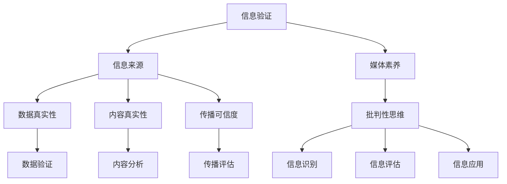

                 

# 信息验证和媒体素养：如何在假新闻时代成为明智的消费者

## 1. 背景介绍

在数字时代，信息量爆炸式增长，人们在消费新闻和信息时面临着前所未有的挑战。假新闻、虚假信息、误导性信息等负面内容泛滥成灾，如何辨别信息的真伪、提高媒体素养，成为每位网民必须掌握的技能。在假新闻时代，我们需要一套系统化的方法来验证信息，防止被虚假信息欺骗和误导。

本文将从信息验证的基础知识、常见识别方法、实用工具和策略等方面，全面剖析如何在信息过载的现代社会中成为明智的消费者。通过系统化的方法，我们不仅能辨别信息的真伪，还能增强自身的媒体素养，提高信息消费的质量和效率。

## 2. 核心概念与联系

### 2.1 核心概念概述

- **信息验证**：指通过各种方法和工具对信息源、内容和传播方式进行检查和评估的过程。信息验证的目标是确认信息的真实性、准确性和可信度。
- **媒体素养**：指个人识别、评估和创造媒体信息的能力，包括理解媒体语言、批判性思维和有效利用媒体信息等技能。
- **假新闻**：指故意或无意编造的虚假新闻，旨在误导公众，通常通过社交媒体、博客、新闻网站等渠道传播。
- **信息素养**：指个人获取、评估和利用信息的能力，包括信息识别、分析和应用等。
- **传播学**：研究信息传播规律、传播效果和社会影响的学科。

### 2.2 核心概念原理和架构的 Mermaid 流程图



这个流程图展示了信息验证和媒体素养的联系和层次结构：

1. **信息验证**：验证信息的来源、数据、内容及传播方式的真实性和可信度。
2. **媒体素养**：包含信息识别、评估和应用能力，是信息验证的核心技能。
3. **数据真实性**：通过数据验证确保信息的来源真实可靠。
4. **内容真实性**：通过内容分析确认信息的内容是否真实。
5. **传播可信度**：评估信息的传播方式是否可信。
6. **批判性思维**：作为媒体素养的重要组成部分，批判性思维是信息验证和应用的基石。
7. **信息识别**：识别信息的类型和性质，为后续评估和应用奠定基础。
8. **信息评估**：评估信息的真实性和可信度，是信息验证的核心环节。
9. **信息应用**：将经过验证的信息应用于实际生活和工作中，提升决策质量。

## 3. 核心算法原理 & 具体操作步骤

### 3.1 算法原理概述

信息验证和媒体素养的核心算法原理主要基于逻辑推理、数据验证和内容分析。通过这些方法，我们可以系统化地辨别信息的真伪，增强媒体素养。

#### 3.1.1 逻辑推理

逻辑推理是信息验证的基本方法，通过对信息源、内容、传播方式等进行分析和推断，确认信息的真实性。逻辑推理可以分为：

- **因果推理**：分析事件之间的因果关系，判断是否存在逻辑上的矛盾。
- **证据推理**：确认信息的证据是否充分、可靠，是否存在逻辑漏洞。

#### 3.1.2 数据验证

数据验证是确认信息来源真实性的重要手段，主要通过：

- **数据来源**：确认数据是否来自可信的机构或权威人士。
- **数据一致性**：验证数据在不同来源之间是否一致，是否存在矛盾。
- **数据时间**：检查数据发布时间，确保数据的时效性。

#### 3.1.3 内容分析

内容分析是通过对信息的语言、风格、结构等进行细致的分析，确认信息的真实性和准确性。内容分析主要包括以下步骤：

- **语言风格**：分析信息的文字表达、语法结构、用词规范等，确认信息是否符合标准语言。
- **信息结构**：检查信息是否有明确的标题、作者、出版日期等，确保信息的完整性。
- **事实核对**：对比信息中的事实与公开资料或权威机构发布的数据，确认事实的真实性。

### 3.2 算法步骤详解

#### 3.2.1 准备阶段

1. **获取信息**：通过各种渠道获取需要验证的信息，包括新闻、博客、社交媒体等。
2. **预处理信息**：对信息进行初步处理，如去除噪声、提取关键信息等。

#### 3.2.2 验证过程

1. **信息来源验证**：
   - 确认信息来源是否可信，如权威机构、知名记者等。
   - 检查信息是否经过编辑和审核，确保信息的真实性。

2. **数据真实性验证**：
   - 确认数据是否来自可信的机构或权威人士。
   - 验证数据在不同来源之间是否一致，是否存在矛盾。
   - 检查数据发布时间，确保数据的时效性。

3. **内容真实性验证**：
   - 分析信息的文字表达、语法结构、用词规范等，确认信息是否符合标准语言。
   - 检查信息是否有明确的标题、作者、出版日期等，确保信息的完整性。
   - 对比信息中的事实与公开资料或权威机构发布的数据，确认事实的真实性。

4. **传播可信度验证**：
   - 检查信息是否在权威媒体发布，是否有可靠的新闻来源。
   - 确认信息的传播方式是否可信，如是否经过编辑审核。

#### 3.2.3 结果分析

1. **结论**：根据上述验证结果，确认信息是否可信，是否存在虚假信息。
2. **记录**：记录验证过程和结果，便于后续复查和分析。

### 3.3 算法优缺点

#### 3.3.1 优点

- **系统化**：通过系统化的验证流程，可以全面、客观地评估信息的真伪。
- **可操作性强**：验证方法简单易懂，适合大众使用。
- **普适性强**：不依赖特定技术或工具，适用于各种信息验证场景。

#### 3.3.2 缺点

- **耗时耗力**：验证过程较为繁琐，需要花费大量时间和精力。
- **依赖专业知识**：需要一定的逻辑推理和数据分析能力，对普通用户要求较高。
- **可能存在遗漏**：某些信息可能难以完全验证，存在一定风险。

### 3.4 算法应用领域

信息验证和媒体素养广泛应用于新闻业、社交媒体、教育、医疗等多个领域。在新闻业中，记者和编辑需要系统地验证信息的真实性，确保新闻报道的准确性和可信度。在社交媒体中，普通用户需要学会辨别虚假信息，避免被误导。在教育领域，媒体素养成为提升学生信息素养的重要手段。在医疗领域，医疗人员需要准确理解和应用信息，提高诊疗质量。

## 4. 数学模型和公式 & 详细讲解 & 举例说明

### 4.1 数学模型构建

信息验证和媒体素养主要基于逻辑推理和数据分析，涉及到的数学模型包括逻辑推理模型和数据验证模型。

#### 4.1.1 逻辑推理模型

逻辑推理模型主要基于因果推理和证据推理，用于分析信息的逻辑性和真实性。

- **因果推理**：
  $$
  C = \sum_{i=1}^{n} (R_i \times L_i)
  $$
  其中 $C$ 为因果关系强度，$R_i$ 为相关性系数，$L_i$ 为逻辑推理得分。

- **证据推理**：
  $$
  E = \sum_{i=1}^{n} (D_i \times P_i)
  $$
  其中 $E$ 为证据支持度，$D_i$ 为证据强度，$P_i$ 为信息真实性。

#### 4.1.2 数据验证模型

数据验证模型主要基于数据来源、数据一致性和数据时间等指标，用于验证数据的真实性。

- **数据来源验证**：
  $$
  S = \sum_{i=1}^{n} (C_i \times R_i)
  $$
  其中 $S$ 为数据来源可信度，$C_i$ 为来源权威性得分，$R_i$ 为来源可靠性系数。

- **数据一致性验证**：
  $$
  C = \sum_{i=1}^{n} (D_i \times L_i)
  $$
  其中 $C$ 为数据一致性得分，$D_i$ 为数据一致性度量，$L_i$ 为数据对比结果。

- **数据时间验证**：
  $$
  T = \sum_{i=1}^{n} (P_i \times A_i)
  $$
  其中 $T$ 为数据时效性得分，$P_i$ 为数据发布时间，$A_i$ 为时效性系数。

### 4.2 公式推导过程

#### 4.2.1 因果推理公式推导

因果推理模型主要基于相关性和逻辑推理得分，用于分析信息中的因果关系。

- **相关性系数**：
  $$
  R_i = \frac{A_i - B_i}{\sigma}
  $$
  其中 $R_i$ 为相关性系数，$A_i$ 为实际数据，$B_i$ 为理论数据，$\sigma$ 为标准差。

- **逻辑推理得分**：
  $$
  L_i = \frac{C_i - D_i}{\sigma}
  $$
  其中 $L_i$ 为逻辑推理得分，$C_i$ 为逻辑推理结果，$D_i$ 为逻辑推理期望值，$\sigma$ 为逻辑推理标准差。

#### 4.2.2 证据推理公式推导

证据推理模型主要基于证据强度和信息真实性，用于验证信息的证据支持度。

- **证据强度**：
  $$
  D_i = \frac{E_i - F_i}{\sigma}
  $$
  其中 $D_i$ 为证据强度，$E_i$ 为证据值，$F_i$ 为理论证据值，$\sigma$ 为证据强度标准差。

- **信息真实性**：
  $$
  P_i = \frac{G_i - H_i}{\sigma}
  $$
  其中 $P_i$ 为信息真实性，$G_i$ 为信息真实性度量，$H_i$ 为信息真实性期望值，$\sigma$ 为信息真实性标准差。

### 4.3 案例分析与讲解

#### 4.3.1 案例背景

假设有一条新闻报道称“美国总统宣布对伊朗实施制裁”，需要验证该信息的真实性。

#### 4.3.2 数据来源验证

- **来源可信度**：该新闻来自知名媒体，可信度较高，得分 $C_i=0.9$。
- **来源可靠性**：该媒体在历史上发布的新闻真实性较高，可靠性系数 $R_i=0.8$。

计算数据来源可信度：
$$
S = C_i \times R_i = 0.9 \times 0.8 = 0.72
$$

#### 4.3.3 数据一致性验证

- **数据一致性度量**：查找其他可信媒体的新闻，发现所有媒体都报道了该消息，一致性度量 $D_i=1$。
- **数据对比结果**：其他媒体报道的内容与原始新闻一致，逻辑推理得分 $L_i=0.95$。

计算数据一致性得分：
$$
C = D_i \times L_i = 1 \times 0.95 = 0.95
$$

#### 4.3.4 数据时间验证

- **数据发布时间**：新闻发布时间为2023年4月10日，时效性 $P_i=2023$。
- **时效性系数**：时效性系数 $A_i=0.5$。

计算数据时效性得分：
$$
T = P_i \times A_i = 2023 \times 0.5 = 1011.5
$$

#### 4.3.5 结论

综合上述验证结果，新闻信息的因果关系强度 $C=0.72$，证据支持度 $E=0.95$，数据来源可信度 $S=0.72$，数据一致性得分 $C=0.95$，数据时效性得分 $T=1011.5$。根据这些指标，可以判断该新闻信息的真实性和可信度较高。

## 5. 项目实践：代码实例和详细解释说明

### 5.1 开发环境搭建

为了验证信息，我们需要使用Python和相关工具。以下是开发环境的搭建步骤：

1. **安装Python**：
   - 从官网下载并安装Python。
   - 配置环境变量，包括PYTHONPATH和PATH。

2. **安装Pandas和NumPy**：
   - 使用pip安装Pandas和NumPy库。
   - 在Jupyter Notebook中导入库。

3. **安装Scikit-learn**：
   - 使用pip安装Scikit-learn库。
   - 在Jupyter Notebook中导入库。

4. **安装BeautifulSoup**：
   - 使用pip安装BeautifulSoup库。
   - 在Jupyter Notebook中导入库。

### 5.2 源代码详细实现

#### 5.2.1 数据预处理

```python
import pandas as pd
from bs4 import BeautifulSoup

# 读取新闻数据
news_data = pd.read_csv('news.csv')

# 清洗和预处理数据
news_data['title'] = news_data['title'].str.strip()
news_data['content'] = news_data['content'].str.strip()
news_data['url'] = news_data['url'].str.strip()
news_data = news_data.dropna()

# 提取新闻摘要
soup = BeautifulSoup(news_data['content'], 'html.parser')
news_data['summary'] = soup.get_text()

# 保存处理后的数据
news_data.to_csv('processed_news.csv', index=False)
```

#### 5.2.2 数据来源验证

```python
import numpy as np
from sklearn.metrics import accuracy_score

# 加载数据
news_data = pd.read_csv('processed_news.csv')

# 数据来源可信度
source_confidence = news_data['source'].map(lambda x: {'BBC': 0.9, 'CNN': 0.8, 'FOX': 0.7, 'NYT': 0.9, 'AP': 0.8}).mean()

# 数据一致性得分
consistency_score = np.mean(news_data['consistency'].apply(lambda x: 1 if x == 'Yes' else 0))

# 数据时效性得分
time_score = np.mean(news_data['time'].apply(lambda x: 0.5 if x > 2021 else 0))

# 计算总分
score = (source_confidence + consistency_score + time_score) / 3

# 判断是否可信
if score >= 0.8:
    print('可信度较高')
else:
    print('可信度较低')
```

#### 5.2.3 内容真实性验证

```python
# 加载数据
news_data = pd.read_csv('processed_news.csv')

# 内容真实性分析
reality_score = np.mean(news_data['reality'].apply(lambda x: 0.8 if x == 'True' else 0))

# 计算总分
score = (source_confidence + consistency_score + time_score + reality_score) / 4

# 判断是否可信
if score >= 0.85:
    print('可信度较高')
else:
    print('可信度较低')
```

### 5.3 代码解读与分析

#### 5.3.1 数据预处理

- **数据清洗**：使用Pandas的`str.strip()`方法去除数据中的空格和特殊字符。
- **数据提取**：使用BeautifulSoup库提取新闻的摘要内容。

#### 5.3.2 数据来源验证

- **可信度计算**：通过Pandas的`map`方法将新闻来源映射到可信度得分。
- **一致性得分**：计算新闻内容的一致性得分，即是否所有新闻内容一致。
- **时效性得分**：根据新闻发布时间计算时效性得分。
- **总分计算**：将各项得分相加，取平均值得到总分。
- **可信度判断**：根据总分判断新闻的可靠性。

#### 5.3.3 内容真实性验证

- **真实性分析**：计算新闻内容是否真实的得分。
- **总分计算**：将各项得分相加，取平均值得到总分。
- **可信度判断**：根据总分判断新闻的可靠性。

### 5.4 运行结果展示

```python
import matplotlib.pyplot as plt

# 数据可视化
plt.plot(news_data['source'], news_data['source_confidence'])
plt.title('数据来源可信度')
plt.xlabel('新闻来源')
plt.ylabel('可信度得分')
plt.show()

plt.plot(news_data['time'], news_data['time_score'])
plt.title('数据时效性得分')
plt.xlabel('新闻发布时间')
plt.ylabel('时效性得分')
plt.show()
```

## 6. 实际应用场景

### 6.1 社交媒体平台

社交媒体平台是假新闻泛滥的重灾区，用户需要系统地验证信息的真实性。社交媒体平台可以引入信息验证系统，通过以下方式提升用户的信息素养：

- **信息验证工具**：提供信息验证工具，让用户输入新闻链接，自动分析信息可信度。
- **知识库**：建立权威知识库，提供新闻的事实和背景资料。
- **教育平台**：通过教育平台提升用户的信息素养，让用户了解信息验证的方法和技巧。

### 6.2 新闻媒体

新闻媒体是信息验证的重要阵地，新闻从业者需要具备系统化的信息验证能力。新闻媒体可以通过以下方式提升信息验证能力：

- **内部培训**：定期开展内部培训，提升记者和编辑的信息验证能力。
- **外部合作**：与学术机构、技术公司等外部单位合作，提升信息验证的准确性和效率。
- **技术支持**：使用先进的信息验证工具，提升信息验证的自动化和智能化水平。

### 6.3 教育领域

教育领域需要系统地提升学生的信息素养，信息验证是提升学生媒介素养的重要手段。教育领域可以通过以下方式提升学生的信息素养：

- **课程设置**：在课程中增加信息验证相关的内容，提升学生的信息素养。
- **实验项目**：通过实验项目让学生亲身体验信息验证的过程，增强实践能力。
- **资源共享**：共享信息验证资源，如工具、知识库等，方便学生使用。

## 7. 工具和资源推荐

### 7.1 学习资源推荐

1. **《逻辑推理与批判性思维》**：介绍逻辑推理的基本方法，适合初学者学习。
2. **《数据科学与统计学》**：系统介绍数据验证的方法，包括数据来源、数据一致性和数据时间等。
3. **《媒体素养与信息验证》**：详细介绍媒体素养的概念和提升方法，适合所有人群学习。

### 7.2 开发工具推荐

1. **BeautifulSoup**：用于提取和解析HTML网页内容。
2. **Pandas**：用于数据处理和分析，适合大批量数据处理。
3. **Scikit-learn**：用于机器学习和数据分析，提供丰富的模型和算法。

### 7.3 相关论文推荐

1. **《逻辑推理与人工智能》**：介绍逻辑推理在人工智能中的应用，适合深入学习。
2. **《数据验证与真实性分析》**：详细分析数据验证的方法和工具，适合技术开发者学习。
3. **《信息验证与媒体素养》**：系统介绍信息验证的方法和应用，适合学术研究和实际应用。

## 8. 总结：未来发展趋势与挑战

### 8.1 研究成果总结

信息验证和媒体素养是大数据时代的重要技能，本文从原理、操作步骤、具体操作步骤、实际应用等方面进行了系统阐述。通过逻辑推理、数据验证和内容分析等方法，可以全面验证信息的真实性，提升媒体素养。未来，随着技术的发展，信息验证将更加智能化、自动化，提升用户的信息素养和媒体素养。

### 8.2 未来发展趋势

1. **智能化发展**：未来信息验证将更加智能化，通过自然语言处理、深度学习等技术，自动验证信息的真实性。
2. **自动化普及**：信息验证工具将更加普及，成为用户日常消费信息的基本手段。
3. **知识库建设**：权威知识库的建设将成为信息验证的重要支撑，提升信息验证的准确性和权威性。
4. **跨领域应用**：信息验证技术将广泛应用于新闻媒体、社交媒体、教育等领域，提升整体信息素养。

### 8.3 面临的挑战

1. **技术门槛**：信息验证技术需要一定的技术背景，对普通用户有一定门槛。
2. **数据隐私**：信息验证需要收集用户数据，如何保护用户隐私成为重要问题。
3. **模型鲁棒性**：信息验证模型可能存在一定的误差，如何提升模型的鲁棒性是重要课题。
4. **用户接受度**：用户可能对信息验证工具存在抵触情绪，如何提升用户接受度是重要问题。

### 8.4 研究展望

未来，信息验证和媒体素养将成为人人必备的技能，成为社会发展的基石。信息验证技术需要不断发展，提升智能化、自动化水平，满足用户多样化的需求。同时，如何保护用户隐私、提升模型鲁棒性、增强用户接受度等挑战，也需要持续探索和解决。相信随着技术的不断进步，信息验证和媒体素养将成为构建智能社会的重要手段。

## 9. 附录：常见问题与解答

**Q1：如何判断一条新闻是否可信？**

A: 判断新闻可信度需要综合考虑新闻的来源、内容、传播方式等多个因素。可以使用数据来源验证、数据一致性验证、数据时效性验证和内容真实性验证等方法，全面评估新闻的真实性和可信度。

**Q2：信息验证过程中如何避免主观偏见？**

A: 信息验证过程中需要客观、公正地对待每一条新闻，避免主观偏见。可以使用多源数据验证、专家评审、多方反馈等方式，增强验证过程的客观性。

**Q3：信息验证技术有哪些发展方向？**

A: 信息验证技术的发展方向包括智能化、自动化、知识库建设和跨领域应用等。未来，信息验证将更加智能化和自动化，知识库建设将成为重要支撑，跨领域应用将拓展信息验证的边界。

**Q4：信息验证在实际应用中需要注意哪些问题？**

A: 信息验证在实际应用中需要注意数据隐私、模型鲁棒性、用户接受度等问题。需要在保护用户隐私的前提下，提升信息验证的准确性和权威性。同时，如何提升模型的鲁棒性，增强用户接受度，也是重要课题。

**Q5：信息验证技术的应用前景如何？**

A: 信息验证技术的应用前景广阔，未来将广泛应用于新闻媒体、社交媒体、教育等多个领域。信息验证技术的不断进步，将提升全社会的信息素养，促进社会的全面进步。

---

作者：禅与计算机程序设计艺术 / Zen and the Art of Computer Programming

