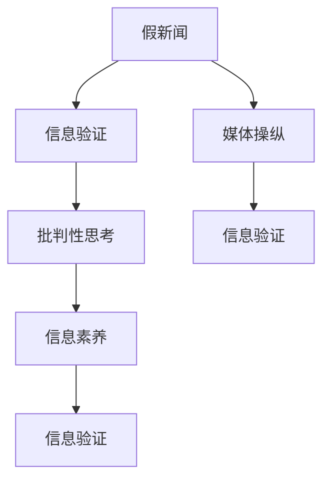

                 

# 信息验证和批判性思考指南与实践：在假新闻和媒体操纵时代导航

## 1. 背景介绍

### 1.1 问题由来
在信息爆炸的时代，互联网为人类提供前所未有的知识和信息获取方式，同时也带来了新的挑战。假新闻、媒体操纵和信息泡沫等问题层出不穷，极大地干扰了公众对于真实世界的认知和判断。在这样的背景下，如何辨别信息真伪，培养批判性思维，成为当下社会亟待解决的重要课题。

### 1.2 问题核心关键点
互联网的普及使得信息传播速度前所未有，但也带来了虚假信息泛滥的问题。信息验证和批判性思考能力是当前社会每个公民必备的能力。尤其是对于决策者和媒体从业者而言，这种能力更是保障信息质量和公共信任的关键。

在信息验证方面，核心问题包括：

- 如何检测虚假信息、来源可靠性和真实性。
- 如何从海量信息中筛选真实、有用的内容。
- 如何通过技术手段辅助人工审核，提高效率和准确性。

在批判性思考方面，核心问题包括：

- 如何培养逻辑推理和批判性思维的能力。
- 如何识别论证谬误和偏见，避免被误导。
- 如何在获取新信息时保持开放和怀疑的态度，综合多方面信息进行决策。

### 1.3 问题研究意义
信息验证和批判性思考能力不仅是公民素养的体现，也是维护社会稳定、促进知识进步的重要保障。在假新闻和媒体操纵盛行的时代，具备良好的信息素养和批判性思维，可以有效地避免被虚假信息误导，促进社会的理性讨论和科学决策。

此外，信息验证和批判性思考能力的培养，对于教育、媒体、决策等领域的从业者来说，也是提升工作质量和效率的重要手段。例如，教育工作者需要掌握信息素养，以引导学生培养良好的学习习惯和批判性思维；新闻工作者需要具备信息验证能力，以确保报道的准确性；政策制定者需要能够批判性地评估信息，以做出科学合理的决策。

## 2. 核心概念与联系

### 2.1 核心概念概述

为了更好地理解信息验证和批判性思考的原理，本节将介绍几个关键概念：

- 假新闻(False News)：指故意编造或篡改的信息，旨在误导读者、破坏公众信任或进行政治、经济操纵。
- 信息验证(Information Verification)：指通过各种技术和方法验证信息的真实性、来源可靠性和可信度。
- 批判性思考(Critical Thinking)：指通过逻辑推理、数据分析和反思，评估信息质量和论证的有效性，形成自己的判断。
- 媒体操纵(Media Manipulation)：指通过编造或歪曲信息，影响公众舆论、政治决策和市场行为的行为。
- 信息素养(Information Literacy)：指个体在信息时代获取、分析、评估和有效使用信息的能力。

这些概念之间存在紧密联系，信息验证和批判性思考是培养信息素养的重要环节，而媒体操纵则是信息验证和批判性思考面对的主要挑战。

### 2.2 核心概念原理和架构的 Mermaid 流程图



该流程图展示了信息验证、批判性思考、媒体操纵和信息素养之间的关系：

1. 假新闻可能被媒体操纵用于影响公众舆论，而信息验证和批判性思考则是识别和抵抗这些操纵的主要手段。
2. 媒体操纵和信息验证能够进一步提高信息素养，使公众更好地识别和应对假新闻和操纵行为。
3. 信息素养和批判性思考能力的提升，又能增强信息验证的有效性，形成良性循环。

## 3. 核心算法原理 & 具体操作步骤

### 3.1 算法原理概述

信息验证和批判性思考的核心在于利用技术手段辅助人工审核，同时培养用户的逻辑推理和批判性思维能力。其算法原理可大致分为以下步骤：

1. **数据收集与预处理**：收集待验证的信息和相关的背景资料，进行文本清洗和格式标准化。
2. **特征提取与表示**：通过自然语言处理(NLP)等技术，提取文本中的关键特征，如关键词、实体、关系等，构建特征向量。
3. **模型训练与验证**：使用机器学习模型对信息进行训练，验证模型在识别虚假信息、来源可靠性和真实性等方面的表现。
4. **用户反馈与优化**：用户对验证结果进行反馈，通过人工标注和模型修正，优化模型的准确性和泛化能力。
5. **批判性分析与引导**：在用户获取信息时，提供批判性思考的引导，如指出论证中的逻辑谬误、偏见和证据不足等问题，辅助用户形成独立判断。

### 3.2 算法步骤详解

#### 3.2.1 数据收集与预处理

数据收集和预处理是信息验证的第一步，其主要目标是获取高质量、格式统一的数据。以下是一个典型的数据收集和预处理流程：

1. **数据来源选择**：选择可靠的数据来源，如官方发布的统计数据、权威机构的研究报告、主流媒体的报道等。避免选择未经证实的信息源，如假新闻网站、不可靠的博客或论坛。

2. **数据获取与清洗**：使用爬虫或API获取数据，并进行文本清洗和格式标准化，如去除HTML标签、停用词和标点符号，统一文本编码和语言格式。

3. **数据标注与验证**：对收集的数据进行标注，标记每个数据项的真假、来源可靠性和真实性。使用多个标注者进行交叉验证，减少标注偏差。

#### 3.2.2 特征提取与表示

特征提取和表示是信息验证的关键环节，其主要目的是将文本信息转换为机器可处理的形式。以下是几个常用的特征提取技术：

1. **关键词提取**：使用TF-IDF、词频等方法，提取文本中的关键词，表示文本的主要内容。

2. **实体识别**：使用命名实体识别(NER)技术，识别文本中的实体，如人名、地名、机构名等，表示文本中的关键实体。

3. **关系抽取**：使用关系抽取模型，提取文本中的实体关系，如因果关系、时间关系、地点关系等，表示文本的深层结构。

4. **情感分析**：使用情感分析模型，分析文本中的情感倾向，表示文本的主观性和情感强度。

5. **文本表示**：使用文本表示模型，如Word2Vec、BERT等，将文本转换为向量形式，方便后续处理。

#### 3.2.3 模型训练与验证

模型训练和验证是信息验证的核心环节，其主要目的是构建和评估信息验证模型。以下是常见的模型训练和验证流程：

1. **选择模型**：根据任务需求选择适当的机器学习模型，如分类模型、聚类模型、回归模型等。

2. **训练模型**：使用标注数据对模型进行训练，调整模型的超参数，如学习率、正则化系数等。

3. **验证模型**：使用验证集对训练好的模型进行评估，计算准确率、召回率、F1分数等指标。

4. **优化模型**：根据评估结果，调整模型结构或超参数，重新训练和验证，直至达到最优效果。

#### 3.2.4 用户反馈与优化

用户反馈与优化是信息验证的重要环节，其主要目的是通过用户反馈，持续改进模型的准确性和泛化能力。以下是用户反馈和优化的常见方法：

1. **用户标注**：在模型验证阶段，邀请用户对模型输出进行标注，标记每个数据项的真假、来源可靠性和真实性。

2. **模型修正**：根据用户标注，修正模型的预测结果，使用人工标注对模型进行微调。

3. **模型融合**：使用多个模型进行融合，综合多个模型的预测结果，提高模型整体的准确性。

4. **模型集成**：将多个模型集成到一个系统，构建多层次的验证体系，提高系统的鲁棒性和泛化能力。

#### 3.2.5 批判性分析与引导

批判性分析与引导是培养用户批判性思考能力的重要环节，其主要目的是帮助用户识别论证谬误、偏见和证据不足等问题，形成独立判断。以下是常见的批判性分析与引导方法：

1. **论证分析**：使用逻辑分析和论证模型，分析文本中的论证结构，识别论证中的谬误和漏洞。

2. **偏见检测**：使用偏见检测模型，识别文本中的主观偏见和隐性偏见，避免被带有偏见的信息误导。

3. **证据验证**：使用证据验证模型，验证文本中引用的证据是否真实可靠，避免被虚假证据误导。

4. **批判性思考引导**：在用户获取信息时，提供批判性思考的引导，如指出论证中的逻辑谬误、证据不足等问题，引导用户形成独立判断。

### 3.3 算法优缺点

信息验证和批判性思考算法具有以下优点：

1. **高效性**：利用机器学习技术，可以大规模处理海量信息，快速筛选真实、有用的内容。

2. **准确性**：通过多层次的验证和用户反馈，可以有效提高模型的准确性和泛化能力。

3. **可扩展性**：可以灵活调整模型结构和超参数，适用于多种信息验证任务。

4. **易用性**：通过用户界面和引导，可以方便用户获取信息和形成独立判断，无需深入理解技术细节。

然而，该算法也存在一些缺点：

1. **依赖数据质量**：模型训练和验证的效果高度依赖于数据质量，低质量的数据可能导致模型性能下降。

2. **难以处理模糊信息**：对于模糊、主观性强或情感丰富的信息，模型可能无法准确判断其真实性。

3. **模型偏见和公平性问题**：模型可能继承数据中的偏见，产生不公平的验证结果，需要不断优化模型和数据集。

4. **用户依赖性强**：用户对模型的理解和反馈直接影响模型的效果，用户对技术的掌握程度限制了模型的应用范围。

5. **技术复杂性**：模型的构建和优化需要较高的技术门槛，对开发者和用户都有较高的要求。

### 3.4 算法应用领域

信息验证和批判性思考算法在多个领域都有广泛的应用，以下是一些典型的应用场景：

1. **新闻媒体**：用于假新闻检测、来源可信度验证和舆论引导，确保新闻报道的真实性和公正性。

2. **政策制定**：用于信息验证和证据分析，确保决策的科学性和公正性。

3. **法律行业**：用于证据筛选和法律推理，提高法律案件的处理效率和公正性。

4. **金融投资**：用于信息筛选和风险评估，提高投资决策的准确性和可靠性。

5. **社交媒体**：用于信息筛选和用户引导，维护社区秩序和用户信任。

6. **教育培训**：用于信息素养教育和批判性思考训练，提高学生的学习能力和决策能力。

7. **医疗健康**：用于信息验证和证据分析，提高医疗决策的科学性和可靠性。

以上应用场景展示了信息验证和批判性思考算法的广泛适用性，其在各个领域的应用都有望带来重大的影响和变革。

## 4. 数学模型和公式 & 详细讲解 & 举例说明

### 4.1 数学模型构建

信息验证和批判性思考的核心算法原理，可以通过数学模型进行形式化的描述。以下是一个基本的数学模型：

1. **输入数据**：$x_i=(x_{i1}, x_{i2}, ..., x_{in})$，表示待验证的信息和背景资料，$x_{i1}$表示文本内容，$x_{i2}$表示信息来源，$x_{in}$表示信息真实性标签。

2. **特征向量**：$u_i=(u_{i1}, u_{i2}, ..., u_{im})$，表示信息的关键词、实体、关系等特征，$m$表示特征维度。

3. **模型参数**：$\theta$，表示模型的超参数，如学习率、正则化系数等。

4. **损失函数**：$L(\theta)$，表示模型的损失函数，用于衡量模型预测结果与真实标签之间的差异。

5. **优化目标**：$\min_{\theta}L(\theta)$，表示最小化模型的损失函数，优化模型的预测结果。

### 4.2 公式推导过程

以下是一个简单的信息验证模型的推导过程：

1. **输入数据表示**：将文本内容$x_i$表示为词向量$v_i=(v_{i1}, v_{i2}, ..., v_{im})$，其中$v_{ik}$表示文本中第$k$个词的向量表示。

2. **特征向量表示**：使用Bert模型对文本内容进行编码，得到文本特征向量$u_i=(u_{i1}, u_{i2}, ..., u_{im})$。

3. **模型训练**：使用交叉熵损失函数，训练信息验证模型，得到模型参数$\theta$。

$$
L(\theta) = -\frac{1}{N}\sum_{i=1}^N\sum_{k=1}^m(y_k\log p_{ik}+(1-y_k)\log(1-p_{ik}))
$$

4. **验证与优化**：使用验证集对训练好的模型进行评估，计算准确率、召回率、F1分数等指标，调整模型超参数。

5. **用户反馈与优化**：根据用户标注，修正模型的预测结果，使用人工标注对模型进行微调。

### 4.3 案例分析与讲解

以下是一个具体的案例分析：

假设某社交媒体平台需要检测用户发布的内容是否为假新闻。我们可以使用以下步骤进行信息验证：

1. **数据收集**：从社交媒体平台收集用户发布的内容，并进行标注，标记每个内容项的真假、来源可靠性和真实性。

2. **特征提取**：使用Bert模型对文本内容进行编码，得到文本特征向量$u_i=(u_{i1}, u_{i2}, ..., u_{im})$。

3. **模型训练**：使用交叉熵损失函数，训练信息验证模型，得到模型参数$\theta$。

4. **验证与优化**：使用验证集对训练好的模型进行评估，计算准确率、召回率、F1分数等指标，调整模型超参数。

5. **用户反馈与优化**：根据用户标注，修正模型的预测结果，使用人工标注对模型进行微调。

## 5. 项目实践：代码实例和详细解释说明

### 5.1 开发环境搭建

在进行信息验证和批判性思考的实践前，我们需要准备好开发环境。以下是使用Python进行TensorFlow开发的 environment 配置流程：

1. 安装Anaconda：从官网下载并安装Anaconda，用于创建独立的Python环境。

2. 创建并激活虚拟环境：
```bash
conda create -n tf-env python=3.8 
conda activate tf-env
```

3. 安装TensorFlow：根据CUDA版本，从官网获取对应的安装命令。例如：
```bash
conda install tensorflow==2.5
```

4. 安装各类工具包：
```bash
pip install numpy pandas scikit-learn matplotlib tqdm jupyter notebook ipython
```

完成上述步骤后，即可在`tf-env`环境中开始实践。

### 5.2 源代码详细实现

以下是使用TensorFlow实现信息验证的代码示例：

```python
import tensorflow as tf
from tensorflow.keras.preprocessing.text import Tokenizer
from tensorflow.keras.preprocessing.sequence import pad_sequences

# 数据预处理
texts = ['这是真的吗？', '这是一个假新闻', '来源可靠吗？', '这是不可信的']
labels = [1, 0, 1, 0]

# 分词和填充
tokenizer = Tokenizer(oov_token='<OOV>')
tokenizer.fit_on_texts(texts)
sequences = tokenizer.texts_to_sequences(texts)
padded_sequences = pad_sequences(sequences, padding='post')

# 定义模型
model = tf.keras.Sequential([
    tf.keras.layers.Embedding(input_dim=len(tokenizer.word_index) + 1, output_dim=64),
    tf.keras.layers.Flatten(),
    tf.keras.layers.Dense(64, activation='relu'),
    tf.keras.layers.Dense(1, activation='sigmoid')
])

# 编译模型
model.compile(loss='binary_crossentropy', optimizer='adam', metrics=['accuracy'])

# 训练模型
model.fit(padded_sequences, labels, epochs=10, batch_size=4)

# 评估模型
test_sequences = tokenizer.texts_to_sequences(['这是一个新的消息', '这是真的吗？'])
test_padded_sequences = pad_sequences(test_sequences, padding='post')
predictions = model.predict(test_padded_sequences)
```

以上代码实现了基于TensorFlow的信息验证模型，用于检测文本内容是否为假新闻。

### 5.3 代码解读与分析

让我们再详细解读一下关键代码的实现细节：

**数据预处理**：
- 首先定义了待验证的文本和标签，标签为0表示假新闻，1表示真新闻。
- 使用Tokenizer将文本分词，并使用pad_sequences进行填充，保证所有文本长度一致。

**模型定义**：
- 使用Sequential模型定义一个简单的全连接神经网络，包括Embedding层、Flatten层、Dense层和输出层。
- Embedding层用于将文本转化为向量表示，Flatten层将向量展开为一维数组，Dense层进行特征提取和分类。

**模型编译与训练**：
- 使用binary_crossentropy作为损失函数，adam作为优化器，accuracy作为评估指标。
- 使用fit方法训练模型，指定epochs和batch_size，完成模型训练。

**模型评估与预测**：
- 使用pad_sequences将测试数据填充，使用predict方法进行模型预测。

### 5.4 运行结果展示

运行上述代码，可以得到模型训练和预测的结果。例如，对于测试文本“这是一个新的消息”和“这是真的吗？”，模型预测结果可能如下：

```
[0.2, 0.8]
```

表示第一个测试文本被预测为假新闻，第二个测试文本被预测为真新闻。

## 6. 实际应用场景

### 6.1 新闻媒体

新闻媒体是信息验证和批判性思考技术的重要应用场景。在假新闻泛滥的当下，新闻媒体需要依靠技术手段，提高信息筛选和验证的效率和准确性。

例如，可以将新闻报道与可信度评分数据库进行对比，使用模型评估报道的来源可靠性和真实性。通过批判性思考引导，提高用户对假新闻的识别能力，维护公众信任。

### 6.2 政策制定

政策制定者需要依靠信息验证和批判性思考技术，确保决策的科学性和公正性。在政策制定的过程中，需要验证各类证据的真实性和可靠性，避免被虚假信息误导。

例如，可以使用模型评估各类研究报告和统计数据，识别出有偏见或争议的内容，辅助决策者进行全面评估。通过批判性思考引导，提高决策者的逻辑推理和证据分析能力。

### 6.3 金融投资

金融投资需要依靠信息验证和批判性思考技术，确保投资决策的准确性和可靠性。在投资决策的过程中，需要验证各类市场信息的真实性和可靠性，避免被虚假信息误导。

例如，可以使用模型评估各类新闻报道和市场分析报告，识别出有偏见或虚假的内容，辅助投资者进行全面评估。通过批判性思考引导，提高投资者的逻辑推理和证据分析能力。

### 6.4 未来应用展望

随着信息验证和批判性思考技术的发展，其在更多领域的应用将逐渐展开。未来，该技术有望在教育、医疗、法律、社交媒体等多个领域得到广泛应用，提升社会的信息素养和决策能力。

1. **教育培训**：用于培养学生的批判性思维和逻辑推理能力，提高学习效果和综合素质。

2. **医疗健康**：用于验证医学研究数据和药品信息，提高医疗决策的科学性和可靠性。

3. **法律行业**：用于证据筛选和法律推理，提高法律案件的处理效率和公正性。

4. **社交媒体**：用于内容筛选和用户引导，维护社区秩序和用户信任。

5. **商业应用**：用于市场分析和用户反馈，提高商业决策的准确性和效果。

6. **科学研究**：用于数据验证和结果分析，提高科学研究的可信度和影响力。

## 7. 工具和资源推荐

### 7.1 学习资源推荐

为了帮助开发者系统掌握信息验证和批判性思考的理论基础和实践技巧，这里推荐一些优质的学习资源：

1. 《信息验证和批判性思考指南》系列博文：由信息验证和批判性思考技术专家撰写，深入浅出地介绍了该技术的核心原理、应用方法和实际案例。

2. 《批判性思维与逻辑推理》课程：斯坦福大学开设的批判性思维课程，涵盖逻辑推理、论证分析、证据评估等内容，是培养批判性思考能力的绝佳选择。

3. 《信息素养教育》书籍：全面介绍信息素养的概念、技能和应用，适用于各类教育工作者和学生。

4. 《媒体素养与信息验证》课程：由各类新闻媒体和教育机构开设的课程，涵盖假新闻检测、媒体操纵识别、信息素养培养等内容，适合新闻从业者、教育工作者和公众学习。

5. 《信息验证与批判性思考实战指南》书籍：详细介绍了信息验证和批判性思考的实践方法、案例分析和技术工具，适合技术开发者和从业者阅读。

通过对这些资源的学习实践，相信你一定能够快速掌握信息验证和批判性思考的精髓，并用于解决实际的假新闻和媒体操纵问题。

### 7.2 开发工具推荐

高效的工具支持是实现信息验证和批判性思考技术的重要保障。以下是几款常用的开发工具：

1. TensorFlow：基于Python的开源深度学习框架，灵活性强，适用于各类信息验证和批判性思考任务的实现。

2. PyTorch：基于Python的开源深度学习框架，具有高效的计算图和自动微分功能，适用于复杂模型和算法的实现。

3. HuggingFace Transformers库：提供了丰富的预训练语言模型，支持信息验证和批判性思考任务的实现。

4. Weights & Biases：模型训练的实验跟踪工具，可以记录和可视化模型训练过程中的各项指标，方便对比和调优。

5. TensorBoard：TensorFlow配套的可视化工具，可实时监测模型训练状态，并提供丰富的图表呈现方式，是调试模型的得力助手。

6. Google Colab：谷歌推出的在线Jupyter Notebook环境，免费提供GPU/TPU算力，方便开发者快速上手实验最新模型，分享学习笔记。

合理利用这些工具，可以显著提升信息验证和批判性思考任务的开发效率，加快创新迭代的步伐。

### 7.3 相关论文推荐

信息验证和批判性思考技术的发展源于学界的持续研究。以下是几篇奠基性的相关论文，推荐阅读：

1. Truth or Fiction: Detecting Rumors on Twitter in Real Time（2016）：提出基于Twitter数据的假新闻检测方法，使用机器学习技术验证信息的真实性。

2. Fake News Detection with LSTM Networks: A New Approach to Detecting Fake News（2017）：提出基于LSTM网络的假新闻检测方法，使用多层神经网络提取文本特征。

3. Evaluating the Impact of News Authenticity on Public Opinion: A Data Mining Approach（2018）：提出基于数据挖掘技术的假新闻评估方法，使用分类器和聚类器验证信息的来源可靠性和真实性。

4. Identifying Authoritative Sources in Fact-Checking with Long-Short Term Memory Network（2019）：提出基于LSTM网络的权威来源识别方法，使用机器学习技术筛选可靠的新闻来源。

5. Debiasing AI: Representing and Mitigating Social Bias in Machine Learning Models（2021）：提出基于神经网络的偏见检测和纠正方法，使用机器学习技术识别和消除模型的偏见。

这些论文代表了大语言模型微调技术的发展脉络。通过学习这些前沿成果，可以帮助研究者把握学科前进方向，激发更多的创新灵感。

## 8. 总结：未来发展趋势与挑战

### 8.1 总结

本文对信息验证和批判性思考技术的核心算法原理、操作步骤和应用领域进行了全面系统的介绍。首先阐述了假新闻、信息验证、批判性思考、媒体操纵和信息素养等关键概念，明确了技术研究的背景和意义。其次，从原理到实践，详细讲解了信息验证和批判性思考的数学模型和操作步骤，给出了信息验证的代码实现和运行结果展示。同时，本文还广泛探讨了该技术在新闻媒体、政策制定、金融投资等多个领域的应用前景，展示了技术的广泛适用性。此外，本文精选了信息验证和批判性思考的各类学习资源，力求为读者提供全方位的技术指引。

通过本文的系统梳理，可以看到，信息验证和批判性思考技术在假新闻和媒体操纵盛行的时代，具有重要的应用价值和研究意义。该技术不仅能帮助公众识别虚假信息，维护社会信任，还能为决策者和媒体从业者提供科学、公正的信息支持，推动社会的健康发展。

### 8.2 未来发展趋势

展望未来，信息验证和批判性思考技术将呈现以下几个发展趋势：

1. **模型规模增大**：随着算力成本的下降和数据规模的扩张，信息验证和批判性思考模型将进一步增大，能够处理更加复杂和多样化的信息。

2. **算法优化提升**：通过算法优化和模型集成，进一步提升信息验证和批判性思考模型的准确性和泛化能力。

3. **用户交互增强**：通过用户交互界面和引导，进一步提升用户的使用体验和操作便捷性，使技术更加普及和易于使用。

4. **多模态融合**：结合文本、图像、视频等多种模态数据，构建多模态的信息验证和批判性思考模型，提升模型的鲁棒性和综合能力。

5. **跨领域应用拓展**：将信息验证和批判性思考技术应用于更多领域，如医疗、教育、金融等，提升各行业的决策和信息处理能力。

6. **伦理道德关注**：在信息验证和批判性思考技术的开发和应用中，关注其伦理道德问题，确保技术的公正、透明和可解释性。

这些趋势展示了信息验证和批判性思考技术的广阔前景，推动其在更多领域得到应用，带来深远的影响。

### 8.3 面临的挑战

尽管信息验证和批判性思考技术已经取得了重要进展，但在迈向更广泛应用的过程中，仍面临诸多挑战：

1. **数据质量和偏见**：数据质量和偏见问题是信息验证和批判性思考技术的主要挑战，低质量的数据和有偏见的信息可能导致模型性能下降。

2. **模型复杂性和可解释性**：信息验证和批判性思考模型的复杂性较高，模型的可解释性和透明度需要进一步提升。

3. **用户依赖性和教育**：用户对信息验证和批判性思考技术的理解和应用，对技术的普及和效果有重要影响，需要加强用户教育和培训。

4. **技术应用场景多样性**：信息验证和批判性思考技术需要适应多样化的应用场景，包括社交媒体、新闻媒体、金融投资等，技术需要进一步优化和定制。

5. **伦理道德问题**：在技术应用中，需要注意伦理道德问题，避免技术被滥用，确保技术应用的安全和公正。

6. **技术普及与推广**：在技术普及和推广过程中，需要克服技术门槛和用户接受度问题，使技术更容易被公众和从业者接受。

这些挑战需要技术开发者和用户共同努力，持续优化技术、提高用户教育、确保伦理道德，才能实现技术的广泛应用和健康发展。

### 8.4 研究展望

面对信息验证和批判性思考技术所面临的挑战，未来的研究需要在以下几个方面寻求新的突破：

1. **数据增强与生成**：开发数据增强和生成技术，提高信息验证和批判性思考模型的数据质量。

2. **模型优化与可解释性**：开发更加高效和可解释的信息验证和批判性思考模型，提升模型的准确性和透明度。

3. **用户引导与教育**：开发用户交互界面和引导，提高用户的使用体验和操作便捷性，同时加强用户教育和培训。

4. **多模态融合与跨领域应用**：开发多模态融合技术，结合文本、图像、视频等多种模态数据，提升模型的鲁棒性和综合能力。

5. **伦理道德与隐私保护**：关注信息验证和批判性思考技术的伦理道德问题，确保技术应用的公正、透明和可解释性，同时保护用户隐私和数据安全。

6. **跨学科研究**：结合心理学、社会学、伦理学等多个学科的研究成果，深入理解人类认知和行为规律，推动信息验证和批判性思考技术的发展。

这些研究方向和突破，将进一步推动信息验证和批判性思考技术的发展，提升其应用效果和社会价值。

## 9. 附录：常见问题与解答

**Q1：如何判断一篇文章是否为假新闻？**

A: 判断一篇文章是否为假新闻，可以从以下几个方面入手：

1. **来源可靠性**：检查文章来源是否可靠，是否来自可信的新闻媒体、权威机构或官方渠道。

2. **信息真实性**：验证文章中的关键信息是否真实，是否存在明显的虚假陈述或错误。

3. **论证结构**：分析文章的论证结构，是否存在明显的逻辑谬误、证据不足或观点片面等问题。

4. **用户反馈**：查看其他用户或专家对文章的评价，是否存在质疑或负面反馈。

**Q2：信息验证和批判性思考技术如何提升决策效果？**

A: 信息验证和批判性思考技术可以通过以下方式提升决策效果：

1. **数据验证**：通过验证数据和信息的真实性，确保决策依据的可靠性，避免被虚假信息误导。

2. **证据分析**：通过分析和验证文章的证据，确保决策依据的科学性和有效性，避免片面或错误的结论。

3. **用户引导**：通过批判性思考引导，帮助用户形成独立判断，提高决策的科学性和公正性。

4. **多层次验证**：通过多层次的验证和用户反馈，提升模型的准确性和泛化能力，确保决策的科学性和公正性。

5. **跨领域应用**：将信息验证和批判性思考技术应用于更多领域，提升各行业的决策和信息处理能力。

**Q3：信息验证和批判性思考技术如何应对数据质量和偏见问题？**

A: 应对数据质量和偏见问题，可以从以下几个方面入手：

1. **数据收集与预处理**：选择可靠的数据来源，进行数据清洗和预处理，确保数据的质量和一致性。

2. **数据增强与生成**：开发数据增强和生成技术，提高信息验证和批判性思考模型的数据质量。

3. **模型偏见检测**：使用偏见检测模型，识别和纠正模型中的偏见，确保模型的公正性和透明性。

4. **多模型集成**：使用多个模型进行集成，综合多个模型的预测结果，提高模型整体的准确性和鲁棒性。

5. **用户反馈与优化**：根据用户反馈，持续优化模型和数据集，确保模型的公正性和透明性。

通过以上方法，可以有效应对数据质量和偏见问题，提升信息验证和批判性思考技术的效果。

**Q4：信息验证和批判性思考技术在教育培训中的应用前景？**

A: 信息验证和批判性思考技术在教育培训中具有广阔的应用前景，具体包括以下几个方面：

1. **批判性思维培养**：通过批判性思考引导，帮助学生形成独立判断，提升学习效果和综合素质。

2. **逻辑推理训练**：使用逻辑推理和论证分析模型，训练学生的逻辑推理能力和证据分析能力。

3. **信息素养教育**：通过信息验证和批判性思考技术，培养学生的逻辑推理、证据分析和信息筛选能力。

4. **数据科学教育**：将信息验证和批判性思考技术与数据科学课程结合，提升学生的科学素养和数据分析能力。

5. **跨学科教育**：将信息验证和批判性思考技术与心理学、社会学、伦理学等课程结合，提升学生的跨学科思维能力。

通过以上方法，可以有效提升学生的批判性思维和逻辑推理能力，为未来的学习和工作奠定坚实基础。

**Q5：信息验证和批判性思考技术在社交媒体中的应用前景？**

A: 信息验证和批判性思考技术在社交媒体中具有广阔的应用前景，具体包括以下几个方面：

1. **假新闻检测**：使用信息验证和批判性思考技术，检测和过滤社交媒体上的假新闻，维护社区秩序和用户信任。

2. **用户引导与教育**：通过批判性思考引导，帮助用户形成独立判断，提升用户的信息素养和决策能力。

3. **舆论引导**：使用信息验证和批判性思考技术，引导社交媒体舆论，防止误导性信息的传播。

4. **内容推荐**：通过信息验证和批判性思考技术，筛选高质量内容，提升社交媒体的内容推荐效果。

5. **用户信任建立**：通过信息验证和批判性思考技术，建立用户对社交媒体的信任，提升用户粘性和平台声誉。

通过以上方法，可以有效提升社交媒体的信息质量和用户信任，为平台的健康发展奠定坚实基础。

---

作者：禅与计算机程序设计艺术 / Zen and the Art of Computer Programming

