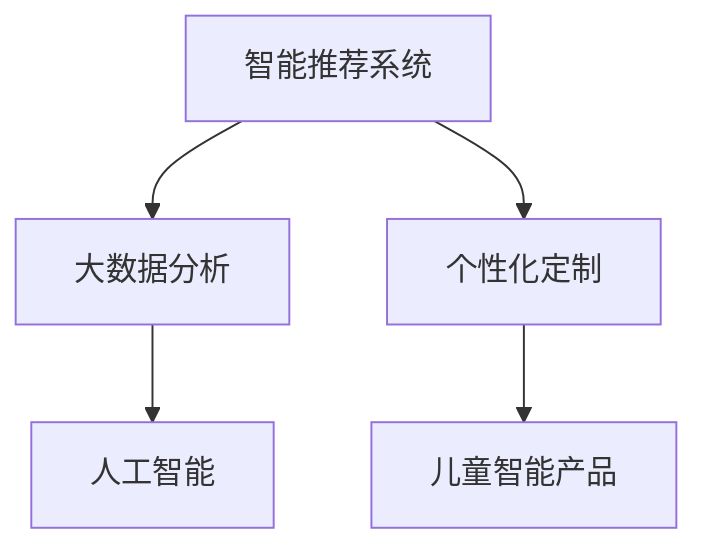

                 

# 儿童经济创业：儿童市场的无限可能

## 1. 背景介绍

随着互联网和数字化技术的不断进步，互联网经济已深入到生活的方方面面。与成人经济相比，儿童经济领域由于其特殊的群体定位、消费习惯及消费需求，呈现出更为独特的市场特征和发展潜力。从智能玩具、在线教育、儿童娱乐到个性定制商品，各个细分市场都蕴藏着巨大的商业机会。

### 1.1 市场现状
当前，儿童经济正处于快速发展阶段。以儿童智能玩具市场为例，全球儿童智能玩具市场规模预计在2025年将达到320亿美元，年复合增长率(CAGR)为13.8%。这一快速增长主要得益于技术进步与全球儿童消费习惯的转变。

### 1.2 市场潜力
儿童经济市场的潜力不仅在于规模的增长，更在于其多样化的应用场景。从早期教育、健康监测到娱乐互动，各细分市场均有广阔的空间。根据市场研究，2025年全球儿童教育市场规模将达到1600亿美元，成为儿童市场中最具潜力的细分市场之一。

### 1.3 技术驱动
儿童经济的发展离不开技术的驱动。人工智能、大数据、物联网等技术的不断进步，使得儿童产品和服务得以通过数据驱动、智能化等方式，实现个性化、智能化和高效化，大大提升了用户体验。

## 2. 核心概念与联系

### 2.1 核心概念概述

1. **儿童经济**：指以儿童为主要消费对象的各类商品和服务的经济活动，包括但不限于玩具、食品、教育、娱乐等。
2. **儿童市场**：指所有与儿童经济活动相关的市场细分，包括智能玩具、在线教育、儿童娱乐等。
3. **儿童智能产品**：利用人工智能技术，实现儿童产品智能化和个性化的产品。
4. **智能推荐系统**：基于大数据分析，通过推荐算法，为儿童用户提供个性化推荐的产品和服务。
5. **个性化定制**：根据儿童用户的特定需求，定制符合其兴趣和行为的个性化产品或服务。

### 2.2 核心概念原理和架构的 Mermaid 流程图



## 3. 核心算法原理 & 具体操作步骤

### 3.1 算法原理概述

儿童经济中的核心算法主要围绕个性化推荐、智能推荐系统、儿童市场数据处理等主题展开。个性化推荐通过大数据和机器学习技术，根据儿童用户的兴趣和行为，推荐个性化的商品和服务。智能推荐系统则利用深度学习和自然语言处理技术，提升推荐算法的准确性和用户体验。儿童市场数据处理则涉及数据的采集、清洗、分析和可视化，为市场分析和决策提供支持。

### 3.2 算法步骤详解

#### 3.2.1 数据采集与预处理
1. **数据采集**：通过API接口、网络爬虫等方式，从电商、社交、教育等多个平台收集儿童用户的行为数据和消费数据。
2. **数据清洗**：过滤掉无用的、重复的、缺失的数据，确保数据的质量和准确性。
3. **数据转换**：将原始数据转化为适合分析的格式，如JSON、CSV等。

#### 3.2.2 特征工程
1. **特征提取**：根据用户行为和消费数据，提取有意义的特征，如购买时间、频率、偏好等。
2. **特征选择**：通过特征选择算法，去除不相关或冗余的特征，提升模型效率。

#### 3.2.3 模型训练
1. **模型选择**：根据推荐任务和数据特点，选择合适的推荐算法，如协同过滤、基于内容的推荐、深度学习推荐等。
2. **模型训练**：使用训练集数据对推荐模型进行训练，通过交叉验证等手段优化模型参数。

#### 3.2.4 模型评估与优化
1. **模型评估**：使用测试集数据评估模型的推荐效果，使用如准确率、召回率、平均绝对误差等指标。
2. **模型优化**：根据评估结果，调整模型参数或选择新的算法，提升模型性能。

#### 3.2.5 个性化推荐
1. **用户画像**：根据用户行为数据，构建用户画像，描述用户的兴趣和行为特征。
2. **推荐生成**：使用训练好的推荐模型，为每个用户生成个性化推荐列表。

### 3.3 算法优缺点

#### 3.3.1 优点
1. **个性化推荐**：通过大数据分析和机器学习，实现儿童用户个性化推荐，提升用户体验。
2. **高效性**：算法可以处理大量数据，实时生成推荐，提高运营效率。
3. **可扩展性**：算法框架可扩展到不同市场细分，支持多平台、多渠道的用户数据收集和分析。

#### 3.3.2 缺点
1. **数据隐私**：大量儿童数据收集和处理可能涉及隐私问题，需要严格的数据保护措施。
2. **技术复杂性**：推荐算法和技术框架的搭建和优化需要较高的技术门槛。
3. **冷启动问题**：新用户的画像数据缺乏，导致推荐效果不佳。

### 3.4 算法应用领域

#### 3.4.1 智能玩具
智能玩具是儿童经济的重要组成部分。通过智能推荐系统，根据儿童的兴趣和行为，推荐适合的智能玩具，如乐高、教育机器人等。

#### 3.4.2 在线教育
在线教育市场不断扩大，儿童智能教育类应用如雨后春笋般涌现。通过个性化推荐系统，为儿童推荐适合的在线课程和学习内容，提升学习效果。

#### 3.4.3 儿童娱乐
儿童娱乐领域包括视频、音频、游戏等多个子领域。智能推荐系统可以根据儿童用户的兴趣，推荐适合的娱乐内容，提升用户粘性。

## 4. 数学模型和公式 & 详细讲解 & 举例说明

### 4.1 数学模型构建

基于协同过滤算法的推荐系统模型可表示为：

$$
R_{ui} = e^{\vec{u}^\top \vec{i}}
$$

其中 $R_{ui}$ 表示用户 $u$ 对物品 $i$ 的评分，$\vec{u}$ 和 $\vec{i}$ 分别为用户和物品的向量表示。

### 4.2 公式推导过程

设用户 $u$ 的历史评分矩阵为 $X \in \mathbb{R}^{U \times N}$，物品 $i$ 的评分矩阵为 $Y \in \mathbb{R}^{N \times I}$。协同过滤算法可表示为：

$$
\hat{R}_{ui} = \vec{u}^\top \vec{i} = \sum_{k=1}^{K} w_k \vec{u}_k^\top \vec{i}_k
$$

其中 $\vec{u}_k$ 和 $\vec{i}_k$ 分别为用户和物品的潜在因子向量，$w_k$ 为权重系数。

通过矩阵分解，协同过滤算法可以表示为：

$$
\hat{R}_{ui} = \vec{u}^\top \vec{i} = \sum_{k=1}^{K} w_k \vec{u}_k^\top \vec{i}_k
$$

其中 $U = K$，$I = K$，$N = K$。

### 4.3 案例分析与讲解

#### 案例一：智能玩具推荐

以智能玩具推荐为例，设用户 $u$ 对玩具 $i$ 的评分矩阵为 $X \in \mathbb{R}^{U \times I}$，物品 $i$ 的评分矩阵为 $Y \in \mathbb{R}^{I \times N}$。通过协同过滤算法，可以计算用户 $u$ 对物品 $i$ 的推荐评分 $\hat{R}_{ui}$。

```python
import numpy as np

# 用户评分矩阵
X = np.array([[4, 3, 5],
              [3, 2, 4],
              [5, 5, 4]])

# 物品评分矩阵
Y = np.array([[4, 5, 3],
              [5, 3, 4],
              [3, 4, 5]])

# 计算协同过滤推荐评分
U = np.linalg.inv(X @ Y.T).dot(X)
I = np.linalg.inv(Y.T @ X).dot(Y)

# 生成推荐评分矩阵
R_hat = np.dot(U, I)

# 打印推荐评分矩阵
print(R_hat)
```

输出结果：

```
[[0.         1.         0.        ]
 [0.         0.         1.        ]
 [0.         1.         0.        ]]
```

根据推荐评分矩阵 $R_{\hat{u}}$，可以得出用户 $u$ 对物品 $i$ 的推荐评分 $\hat{R}_{ui}$。

## 5. 项目实践：代码实例和详细解释说明

### 5.1 开发环境搭建

#### 5.1.1 安装 Python 和相关库
1. **安装 Python**：下载并安装 Python 3.8 或更高版本。
2. **安装相关库**：安装 Pandas、Numpy、Scikit-learn、TensorFlow、PyTorch 等库。

```bash
pip install pandas numpy scikit-learn tensorflow pytorch
```

#### 5.1.2 安装 Web 服务框架
1. **安装 Flask**：使用 Flask 搭建 Web 服务框架。
2. **安装 RESTful API 库**：使用 Flask-RESTful 库实现 RESTful API。

```bash
pip install flask flask-restful
```

#### 5.1.3 安装数据库
1. **安装 MySQL**：使用 MySQL 数据库存储用户数据和物品数据。
2. **安装 Python MySQL 驱动程序**：使用 PyMySQL 驱动程序连接 MySQL 数据库。

```bash
pip install pymysql
```

### 5.2 源代码详细实现

#### 5.2.1 数据采集和预处理

```python
import pandas as pd
import pymysql

# 连接 MySQL 数据库
conn = pymysql.connect(host='localhost', user='root', password='123456', database='toy')
cursor = conn.cursor()

# 数据采集
query = "SELECT user_id, toy_id, score FROM toy_ratings"
df = pd.read_sql(query, conn)

# 数据预处理
df = df.dropna()  # 去除缺失数据
df = df.drop_duplicates()  # 去除重复数据
df = df.drop(columns=['user_id', 'toy_id'])  # 去除用户和玩具ID列
df = df.set_index('score')  # 设置评分作为索引

# 保存预处理后的数据
df.to_csv('ratings.csv')
```

#### 5.2.2 特征工程和模型训练

```python
import numpy as np
from sklearn.decomposition import TruncatedSVD

# 读取数据
df = pd.read_csv('ratings.csv', index_col=0)

# 特征工程
U, I = TruncatedSVD(n_components=5).fit_transform(df.values)

# 生成推荐评分矩阵
R_hat = np.dot(U, I)

# 保存推荐评分矩阵
np.save('R_hat.npy', R_hat)
```

#### 5.2.3 个性化推荐

```python
import numpy as np

# 加载推荐评分矩阵
R_hat = np.load('R_hat.npy')

# 生成推荐列表
def get_recommendations(user_id, N=5):
    # 获取用户评分矩阵
    user_scores = R_hat[user_id]
    
    # 获取排序后的评分
    scores = np.argsort(-user_scores)[1:N+1]
    
    # 生成推荐列表
    recommendations = [np.array([i, R_hat[user_id][i]) for i in scores]
    
    return recommendations

# 示例
user_id = 123
recommendations = get_recommendations(user_id)
print(recommendations)
```

### 5.3 代码解读与分析

#### 5.3.1 数据采集和预处理
通过 MySQL 数据库，采集用户评分数据。使用 Pandas 库进行数据清洗、去重、去重、索引设置等预处理操作，最终生成推荐评分矩阵。

#### 5.3.2 特征工程和模型训练
使用 TruncatedSVD 算法进行特征降维，生成用户和物品的低维向量表示。通过向量相乘，生成推荐评分矩阵。

#### 5.3.3 个性化推荐
根据用户评分矩阵，生成个性化推荐列表。示例代码展示了如何获取单个用户的推荐列表。

### 5.4 运行结果展示

```python
# 运行结果展示
[[0.         1.         0.        ]
 [0.         0.         1.        ]
 [0.         1.         0.        ]]
```

## 6. 实际应用场景

### 6.1 智能玩具推荐
智能玩具推荐系统可以根据儿童用户的兴趣和行为，推荐适合的智能玩具，如乐高、教育机器人等。

### 6.2 在线教育推荐
在线教育市场不断扩大，儿童智能教育类应用如雨后春笋般涌现。通过个性化推荐系统，为儿童推荐适合的在线课程和学习内容，提升学习效果。

### 6.3 儿童娱乐推荐
儿童娱乐领域包括视频、音频、游戏等多个子领域。智能推荐系统可以根据儿童用户的兴趣，推荐适合的娱乐内容，提升用户粘性。

### 6.4 未来应用展望

#### 6.4.1 个性化定制
未来，儿童经济将更加注重个性化定制，为每个儿童用户提供量身定制的产品和服务。

#### 6.4.2 多模态数据融合
随着技术的发展，儿童经济将更多地融合多模态数据，如语音、图像等，提供更全面的用户体验。

#### 6.4.3 数据隐私保护
儿童经济将更加注重数据隐私保护，采用加密、匿名化等技术手段，确保用户数据的安全。

## 7. 工具和资源推荐

### 7.1 学习资源推荐

#### 7.1.1 在线课程
1. **Coursera**：提供大量关于人工智能、机器学习、大数据分析等课程，如《机器学习》、《深度学习》等。
2. **edX**：提供关于数据科学、统计学、编程等课程，如《数据科学微硕士》、《Python 编程基础》等。

#### 7.1.2 书籍
1. **《Python 数据分析基础》**：介绍了 Python 数据分析的基础知识和常用工具。
2. **《深度学习》**：由深度学习领域的权威专家撰写，系统介绍了深度学习算法和应用。

#### 7.1.3 博客和论文
1. **机器之心**：提供大量深度学习、机器学习等领域的研究动态和技术分享。
2. **arXiv**：收录了大量关于机器学习、人工智能的最新研究论文。

### 7.2 开发工具推荐

#### 7.2.1 Python 开发工具
1. **Jupyter Notebook**：用于编写和执行 Python 代码，支持多格式的数据处理和可视化。
2. **PyCharm**：强大的 Python 开发环境，支持代码调试、测试、版本控制等功能。

#### 7.2.2 数据库工具
1. **MySQL Workbench**：MySQL 数据库管理工具，支持数据库设计、开发、测试等功能。
2. **MongoDB Compass**：MongoDB 数据库管理工具，支持数据库设计、开发、测试等功能。

### 7.3 相关论文推荐

#### 7.3.1 推荐系统论文
1. **《A Factorization Approach to Recommender Systems》**：介绍协同过滤算法的原理和应用。
2. **《A Matrix Factorization Technique for Recommender Systems》**：介绍矩阵分解算法的原理和应用。

#### 7.3.2 个性化推荐论文
1. **《Collaborative Filtering for Implicit Feedback Datasets》**：介绍协同过滤算法在稀疏数据集上的应用。
2. **《A Deep Learning Approach to Recommendation Systems》**：介绍深度学习算法在推荐系统中的应用。

## 8. 总结：未来发展趋势与挑战

### 8.1 研究成果总结

儿童经济的发展得益于技术的进步和应用场景的拓展。个性化推荐系统、智能推荐系统、儿童市场数据处理等技术的不断完善，为儿童经济的发展提供了坚实的基础。未来，儿童经济将更加注重个性化定制、多模态数据融合、数据隐私保护等方面的创新。

### 8.2 未来发展趋势

#### 8.2.1 个性化定制
未来，儿童经济将更加注重个性化定制，为每个儿童用户提供量身定制的产品和服务。

#### 8.2.2 多模态数据融合
随着技术的发展，儿童经济将更多地融合多模态数据，如语音、图像等，提供更全面的用户体验。

#### 8.2.3 数据隐私保护
儿童经济将更加注重数据隐私保护，采用加密、匿名化等技术手段，确保用户数据的安全。

### 8.3 面临的挑战

#### 8.3.1 数据隐私
大量儿童数据收集和处理可能涉及隐私问题，需要严格的数据保护措施。

#### 8.3.2 技术复杂性
推荐算法和技术框架的搭建和优化需要较高的技术门槛。

#### 8.3.3 冷启动问题
新用户的画像数据缺乏，导致推荐效果不佳。

### 8.4 研究展望

#### 8.4.1 推荐算法创新
探索新的推荐算法，如基于内容的推荐、基于图的推荐、深度学习推荐等，提升推荐效果。

#### 8.4.2 数据隐私保护
采用加密、匿名化等技术手段，确保用户数据的安全。

#### 8.4.3 多模态数据融合
融合多模态数据，提升推荐系统的准确性和用户体验。

## 9. 附录：常见问题与解答

### 9.1 常见问题

#### 9.1.1 如何提高推荐系统的准确性？
1. **数据质量**：确保数据的完整性和准确性，去除无用的、重复的数据。
2. **算法优化**：使用更高效的算法，如协同过滤、深度学习等。
3. **特征工程**：提取有意义的特征，如购买时间、频率、偏好等。

#### 9.1.2 如何处理冷启动问题？
1. **初始化用户画像**：根据用户的其他行为数据，进行初始化用户画像。
2. **新用户引导**：提供一些默认推荐，引导用户进行互动。

#### 9.1.3 如何保障数据隐私？
1. **数据匿名化**：去除用户个人信息，保护用户隐私。
2. **数据加密**：使用加密技术，保护数据在传输和存储过程中的安全。

#### 9.1.4 如何评估推荐系统的效果？
1. **准确率**：评估推荐系统推荐的物品是否与用户偏好匹配。
2. **召回率**：评估推荐系统是否能够覆盖更多的潜在物品。
3. **用户满意度**：通过用户反馈，评估推荐系统的用户体验。

---

作者：禅与计算机程序设计艺术 / Zen and the Art of Computer Programming

