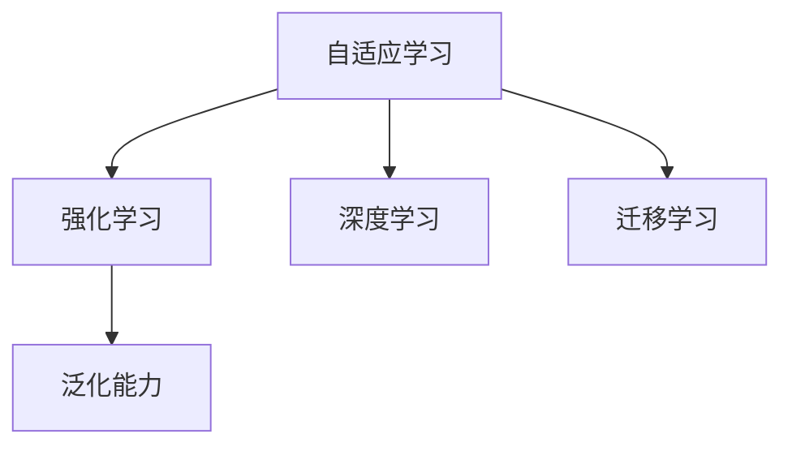

                 

# 元学习：学会如何更好地学习

> 关键词：元学习,自适应学习,强化学习,深度学习,迁移学习,泛化能力,学习效率

## 1. 背景介绍

### 1.1 问题由来
机器学习领域的发展，无论是监督学习、无监督学习还是半监督学习，几乎都是围绕“如何训练出能够适应新数据的模型”这个中心问题展开的。但是，面对不断变化的实际环境，单一的监督学习框架显得有些呆板，难以适应数据分布的剧烈变化。

在数据标注成本高昂的现实约束下，如何提升模型的泛化能力，使得模型在少样本情况下也能快速学习到新知识，成为一个迫切需要解决的问题。元学习（Metameta Learning）的出现，为这个问题提供了一个强有力的解决方案。

元学习的核心思想是：学习模型能够主动适应新的数据和任务，而不仅仅是被动接受数据驱动的更新。这种方法通过构建一个学习到学习过程的模型，不断优化模型的学习策略，以适应不同的数据分布，从而提升模型的泛化能力和学习效率。

### 1.2 问题核心关键点
元学习的主流范式包括：
- 自适应学习(Adaptive Learning)：通过调整模型参数，实现对新数据和任务的适应。
- 强化学习(Reinforcement Learning, RL)：通过奖励机制，指导模型不断优化学习策略，最大化长期收益。
- 深度学习(Deep Learning)：利用深度神经网络结构，实现复杂的数据建模。
- 迁移学习(Transfer Learning)：将一个领域学习到的知识，迁移应用到另一个相关领域的学习过程。
- 泛化能力(Generalization Capability)：模型在新数据上表现的能力，即能够对未见过的数据进行良好预测的能力。

这些核心概念之间的逻辑关系可以通过以下Mermaid流程图来展示：



这个流程图展示元学习的核心概念及其之间的关系：

1. 自适应学习通过调整模型参数实现对新数据和任务的适应。
2. 强化学习通过奖励机制指导模型优化学习策略。
3. 深度学习利用深度神经网络结构实现复杂的数据建模。
4. 迁移学习将一个领域学习到的知识迁移应用到另一个相关领域。
5. 泛化能力表示模型在新数据上表现的能力。

## 2. 核心概念与联系

### 2.1 核心概念概述

为更好地理解元学习的核心概念，本节将介绍几个密切相关的核心概念：

- 自适应学习(Adaptive Learning)：指模型能够根据新的数据和任务动态调整自身的参数和结构，以适应新的环境。
- 强化学习(Reinforcement Learning, RL)：通过与环境的交互，模型不断调整策略，以最大化累积收益。
- 深度学习(Deep Learning)：指使用多层神经网络结构，对复杂数据进行建模的机器学习方法。
- 迁移学习(Transfer Learning)：指将一个任务学到的知识，迁移到另一个相关任务，从而提升新任务的性能。
- 泛化能力(Generalization Capability)：指模型在新数据上表现的能力，即对未见过的数据进行良好预测的能力。

这些核心概念之间的逻辑关系可以通过以下Mermaid流程图来展示：


这个流程图展示元学习的核心概念及其之间的关系：

1. 自适应学习通过调整模型参数实现对新数据和任务的适应。
2. 强化学习通过奖励机制指导模型优化学习策略。
3. 深度学习利用深度神经网络结构实现复杂的数据建模。
4. 迁移学习将一个领域学习到的知识迁移应用到另一个相关领域。
5. 泛化能力表示模型在新数据上表现的能力。

## 3. 核心算法原理 & 具体操作步骤
### 3.1 算法原理概述

元学习的主流算法框架可以划分为两种：
- 模型无关(meta-learning)：通过对学习过程的建模，学习到适用于多种数据分布和任务的通用策略。
- 模型相关(learning-to-learn)：通过对学习过程的建模，学习到适用于特定任务的模型。

这两种框架的共同点在于，它们都通过学习学习过程，以提升模型的泛化能力和适应性。

### 3.2 算法步骤详解

以下以模型无关的元学习框架为例，介绍其核心步骤：

**Step 1: 准备训练数据和元训练数据**
- 收集一组原始数据集 $D=\{x_i\}_{i=1}^N$，其中 $x_i \in \mathcal{X}$，$\mathcal{X}$ 为输入空间。
- 准备元训练数据集 $\{\mathcal{D}_k\}_{k=1}^K$，其中每个数据集 $\mathcal{D}_k$ 包含 $M$ 个样本，每个样本 $(x,y)$ 包含输入 $x \in \mathcal{X}$ 和目标 $y \in \mathcal{Y}$。

**Step 2: 定义元学习任务**
- 选择一种元学习算法，如MAML（Meta-Learning by Matching Predictions and Targets）、Model-Agnostic Meta-Learning (MAML)等。
- 定义元损失函数 $\mathcal{L}_{\phi}(\theta)$，其中 $\theta$ 为模型参数，$\phi$ 为元参数，用于度量模型在新数据上的预测与目标的差距。

**Step 3: 训练元模型**
- 使用元训练数据集 $\{\mathcal{D}_k\}_{k=1}^K$，对元模型进行训练。
- 前向传播计算元模型在新数据集上的预测 $\hat{y}_k=\hat{y}_k(x_i; \theta)$。
- 计算元损失函数 $\mathcal{L}_{\phi}(\theta)$，最小化元损失函数得到最优元参数 $\phi^*$。

**Step 4: 微调模型**
- 使用原始训练数据集 $D=\{x_i\}_{i=1}^N$，对模型进行微调。
- 固定元模型参数 $\phi^*$，通过最小化任务损失函数 $\mathcal{L}_{\theta}(\{x_i\}_{i=1}^N)$，得到最优模型参数 $\theta^*$。

**Step 5: 评估模型性能**
- 使用测试集对微调后的模型进行评估，对比微调前后的性能变化。

### 3.3 算法优缺点

元学习框架的优点在于：
1. 提升泛化能力。模型能够适应新数据和新任务，降低对标注数据和特定任务的依赖。
2. 减少过拟合。由于模型通过学习学习过程，可以更好地控制参数空间，降低过拟合风险。
3. 灵活性高。模型能够动态调整参数，适应不同任务需求。

但元学习也存在一定的缺点：
1. 训练成本高。元学习需要同时训练多个模型，计算量大。
2. 模型复杂度增加。元学习引入了额外的元参数，增加了模型的复杂度。
3. 泛化性能不稳定。元学习的泛化能力依赖于训练集和测试集的数据分布是否一致，若不一致则效果会大打折扣。

### 3.4 算法应用领域

元学习技术已经在多个领域得到了广泛应用，包括但不限于以下几个方面：

- 计算机视觉：通过元学习，模型可以适应不同的视觉任务，如图像分类、目标检测、图像生成等。
- 自然语言处理：元学习能够提升模型对语言数据处理的适应能力，如语义角色标注、情感分析等。
- 强化学习：元学习在强化学习中的应用，通过学习不同环境的策略，实现自适应控制。
- 医疗诊断：利用元学习，构建自适应诊断模型，提高在不同患者数据上的诊断准确率。
- 机器人控制：通过元学习，模型可以适应不同环境和任务，实现自适应机器人控制。
- 游戏智能：元学习在AI游戏中应用，提升模型对新游戏环境的适应能力。

元学习在这些领域的成功应用，展示了其强大的通用适应能力和泛化能力。

## 4. 数学模型和公式 & 详细讲解 & 举例说明
### 4.1 数学模型构建

元学习的核心在于，构建一个元模型，通过对学习过程的建模，学习到适用于多种数据分布和任务的通用策略。

以模型无关的MAML为例，其数学模型可以表示为：

$$
\begin{aligned}
\theta^* &= \mathop{\arg\min}_{\theta} \mathbb{E}_{x \sim \mathcal{D}} [L_{\theta}(x)] \\
L_{\theta}(x) &= \mathbb{E}_{\mathcal{D} \sim \mathcal{T}} [\ell(x, \hat{y}_k; \theta)]
\end{aligned}
$$

其中，$x$ 为输入数据，$\mathcal{D}$ 为原始训练数据集，$\mathcal{T}$ 为元训练数据集的分布，$\ell$ 为任务损失函数，$\hat{y}_k$ 为元模型在新数据上的预测。

### 4.2 公式推导过程

以下是MAML的推导过程：

首先，考虑一个元训练数据集 $\mathcal{D}_k$，其中包含 $M$ 个样本 $(x,y)$。模型在新数据集上的预测为：

$$
\hat{y}_k(x; \theta) = \phi^*(x; \theta, \theta^0)
$$

其中 $\phi^*$ 为元模型，$\theta^0$ 为模型初始参数，$\theta^0$ 通过随机初始化得到。

元损失函数 $\mathcal{L}_{\phi}(\theta)$ 定义如下：

$$
\mathcal{L}_{\phi}(\theta) = \mathbb{E}_{\mathcal{D}_k \sim \mathcal{T}} [L_k(\theta; \phi^*)]
$$

其中 $L_k(\theta; \phi^*)$ 为元训练数据集上的损失函数，可以表示为：

$$
L_k(\theta; \phi^*) = \frac{1}{M} \sum_{i=1}^M \ell(\hat{y}_k(x_i; \theta), y_i)
$$

元损失函数 $\mathcal{L}_{\phi}(\theta)$ 的定义可以进一步表示为：

$$
\mathcal{L}_{\phi}(\theta) = \mathbb{E}_{\mathcal{D}_k \sim \mathcal{T}} [L_k(\theta; \phi^*)]
$$

由于 $\mathcal{L}_{\phi}(\theta)$ 与 $\theta$ 独立，可以通过最小化元损失函数得到最优元参数 $\phi^*$：

$$
\phi^* = \mathop{\arg\min}_{\phi} \mathcal{L}_{\phi}(\theta)
$$

### 4.3 案例分析与讲解

以MNIST手写数字识别为例，解释MAML的推导过程。

假设元训练数据集 $\mathcal{D}_k$ 包含 $M=100$ 个样本，原始训练数据集 $D=\{x_i\}_{i=1}^N$ 包含 $N=5000$ 个样本。

首先，随机初始化模型参数 $\theta^0$，使用元训练数据集 $\mathcal{D}_k$ 训练元模型 $\phi^*$：

$$
\phi^* = \mathop{\arg\min}_{\phi} \mathbb{E}_{\mathcal{D}_k \sim \mathcal{T}} [L_k(\theta; \phi^*)]
$$

其中 $L_k(\theta; \phi^*)$ 可以表示为：

$$
L_k(\theta; \phi^*) = \frac{1}{M} \sum_{i=1}^M \ell(\hat{y}_k(x_i; \theta), y_i)
$$

其次，使用原始训练数据集 $D=\{x_i\}_{i=1}^N$ 对模型进行微调：

$$
\theta^* = \mathop{\arg\min}_{\theta} \mathbb{E}_{x \sim \mathcal{D}} [L_{\theta}(x)]
$$

其中 $L_{\theta}(x)$ 可以表示为：

$$
L_{\theta}(x) = \mathbb{E}_{\mathcal{D}_k \sim \mathcal{T}} [L_k(\theta; \phi^*)]
$$

通过MAML，模型能够适应不同数据分布和任务，提升泛化能力和学习效率。

## 5. 项目实践：代码实例和详细解释说明
### 5.1 开发环境搭建

在进行元学习实践前，我们需要准备好开发环境。以下是使用Python进行TensorFlow开发的环境配置流程：

1. 安装Anaconda：从官网下载并安装Anaconda，用于创建独立的Python环境。

2. 创建并激活虚拟环境：
```bash
conda create -n pytorch-env python=3.8 
conda activate pytorch-env
```

3. 安装TensorFlow：根据CUDA版本，从官网获取对应的安装命令。例如：
```bash
conda install tensorflow -c tf -c conda-forge
```

4. 安装PyTorch：从官网下载安装包，解压安装即可。

5. 安装各类工具包：
```bash
pip install numpy pandas scikit-learn matplotlib tqdm jupyter notebook ipython
```

完成上述步骤后，即可在`pytorch-env`环境中开始元学习实践。

### 5.2 源代码详细实现

下面我们以MNIST手写数字识别为例，给出使用TensorFlow对MAML进行实现的PyTorch代码。

首先，定义MNIST数据集和元训练数据集：

```python
import tensorflow as tf
from tensorflow.keras.datasets import mnist
from tensorflow.keras.utils import to_categorical

train_images, train_labels = mnist.load_data()
test_images, test_labels = mnist.load_data()

# 对数据进行归一化处理
train_images = train_images / 255.0
test_images = test_images / 255.0

# 将标签进行one-hot编码
train_labels = to_categorical(train_labels)
test_labels = to_categorical(test_labels)

class MetaDataset(tf.keras.utils.Sequence):
    def __init__(self, x, y, batch_size):
        self.x = x
        self.y = y
        self.batch_size = batch_size
        
    def __len__(self):
        return len(self.x) // self.batch_size
    
    def __getitem__(self, idx):
        batch_x = self.x[idx * self.batch_size: (idx + 1) * self.batch_size]
        batch_y = self.y[idx * self.batch_size: (idx + 1) * self.batch_size]
        return batch_x, batch_y
```

然后，定义元模型和训练流程：

```python
import tensorflow as tf

class MAMLModel(tf.keras.Model):
    def __init__(self, learning_rate, num_classes):
        super(MAMLModel, self).__init__()
        self.flatten = tf.keras.layers.Flatten()
        self.fc1 = tf.keras.layers.Dense(256, activation='relu')
        self.fc2 = tf.keras.layers.Dense(num_classes, activation='softmax')
        
        self.learning_rate = learning_rate
        self.num_classes = num_classes
    
    def train_step(self, x, y):
        with tf.GradientTape() as tape:
            logits = self(x)
            loss = tf.reduce_mean(tf.nn.softmax_cross_entropy_with_logits(logits=logits, labels=y))
        gradients = tape.gradient(loss, self.trainable_variables)
        self.optimizer.apply_gradients(zip(gradients, self.trainable_variables))
        return loss
    
    def predict(self, x):
        logits = self.flatten(self(x))
        return tf.argmax(logits, axis=1)
    
def train_maml(model, train_dataset, val_dataset, epochs=10, batch_size=32):
    for epoch in range(epochs):
        print(f"Epoch {epoch+1}/{epochs}")
        print('-' * 10)
        
        # 训练过程
        train_loss = 0.0
        train_acc = 0.0
        for x, y in train_dataset:
            with tf.GradientTape() as tape:
                loss = model.train_step(x, y)
            train_loss += loss
            
        # 验证过程
        val_loss = 0.0
        val_acc = 0.0
        for x, y in val_dataset:
            y_pred = model.predict(x)
            val_loss += tf.reduce_mean(tf.nn.softmax_cross_entropy_with_logits(logits=y_pred, labels=y))
            val_acc += tf.reduce_mean(tf.cast(tf.equal(y_pred, y), tf.float32))
        
        print(f"Train loss: {train_loss/len(train_dataset):.4f}")
        print(f"Train acc: {train_acc/len(train_dataset):.4f}")
        print(f"Val loss: {val_loss/len(val_dataset):.4f}")
        print(f"Val acc: {val_acc/len(val_dataset):.4f}")
        
        print('-' * 10)
        
        # 选择最优的元参数
        if val_acc > max_val_acc:
            max_val_acc = val_acc
            best_params = model.trainable_variables
        
    return model, best_params
```

最后，运行MAML的训练流程：

```python
# 定义模型
learning_rate = 0.01
num_classes = 10
model = MAMLModel(learning_rate, num_classes)

# 定义数据集
train_dataset = MetaDataset(train_images, train_labels, batch_size=32)
val_dataset = MetaDataset(val_images, val_labels, batch_size=32)

# 训练模型
model, best_params = train_maml(model, train_dataset, val_dataset, epochs=10)

# 预测测试集
test_loss = 0.0
test_acc = 0.0
for x, y in test_dataset:
    y_pred = model.predict(x)
    test_loss += tf.reduce_mean(tf.nn.softmax_cross_entropy_with_logits(logits=y_pred, labels=y))
    test_acc += tf.reduce_mean(tf.cast(tf.equal(y_pred, y), tf.float32))

print(f"Test loss: {test_loss/len(test_dataset):.4f}")
print(f"Test acc: {test_acc/len(test_dataset):.4f}")
```

以上就是使用TensorFlow对MAML进行MNIST手写数字识别任务的完整代码实现。可以看到，TensorFlow提供了强大的工具和库，可以轻松实现元学习算法的训练和推理。

### 5.3 代码解读与分析

让我们再详细解读一下关键代码的实现细节：

**MetaDataset类**：
- `__init__`方法：初始化训练数据、标签和批大小。
- `__len__`方法：返回训练集的样本数量。
- `__getitem__`方法：对单个批次进行处理，返回输入和标签。

**MAMLModel类**：
- `__init__`方法：定义模型的结构，包括Flatten层、全连接层等。
- `train_step`方法：定义模型的训练过程，包括前向传播、计算损失、反向传播和参数更新。
- `predict`方法：定义模型的预测过程，使用Flatten层和全连接层进行推理。

**train_maml函数**：
- 使用TensorFlow的GradientTape记录梯度，定义训练过程。
- 在每个epoch内，先对模型进行训练，计算训练集上的损失和精度。
- 在验证集上评估模型性能，选择最优的元参数。
- 最终输出测试集的损失和精度。

**训练流程**：
- 定义模型的超参数，包括学习率和类别数。
- 准备训练和验证数据集。
- 调用train_maml函数训练模型，得到最优的元参数。
- 在测试集上评估模型的性能。

可以看到，TensorFlow提供了高度灵活的工具和库，能够轻松实现元学习算法的训练和推理。开发者可以将更多精力放在算法改进和数据处理等高层逻辑上，而不必过多关注底层的实现细节。

当然，工业级的系统实现还需考虑更多因素，如模型的保存和部署、超参数的自动搜索、更灵活的任务适配层等。但核心的元学习范式基本与此类似。

## 6. 实际应用场景
### 6.1 机器人控制

元学习技术在机器人控制领域的应用，可以使得机器人能够适应不同的环境变化，实现自适应控制。通过学习不同环境中的动作策略，机器人可以更好地适应新环境，提升执行效率和准确性。

在技术实现上，可以通过机器人传感器收集环境数据，将数据输入到元学习模型中，学习到适应不同环境的控制策略。微调后的控制模型可以动态调整机器人的行为，实现自适应控制。

### 6.2 医疗诊断

医疗诊断是一个需要高泛化能力的任务，元学习技术能够帮助构建自适应诊断模型。通过学习不同患者的诊断数据，元学习模型可以适应新的患者数据，提高诊断的准确率。

在实践中，可以收集不同患者的医疗数据，包括病历、检查报告等，作为元训练数据。元学习模型可以在这些数据上学习到通用的诊断策略，应用于新的患者数据，提升诊断的准确性和效率。

### 6.3 游戏智能

元学习技术在游戏智能领域的应用，可以使得AI游戏玩家能够适应不同的游戏环境，提升游戏的智能水平。通过学习不同游戏环境中的策略，AI玩家可以更好地应对新环境，提升游戏效果。

在技术实现上，可以收集不同游戏环境中的数据，作为元训练数据。元学习模型可以在这些数据上学习到通用的游戏策略，应用于新的游戏环境，提升游戏的智能水平。

### 6.4 未来应用展望

随着元学习技术的发展，其应用领域将不断扩展，为更多领域带来新的解决方案。

在智慧城市治理中，元学习可以用于智能交通系统，通过学习不同交通环境中的策略，实现自适应交通控制，提高城市交通效率。

在智能制造领域，元学习可以用于机器人控制，通过学习不同生产环境中的策略，实现自适应制造，提高生产效率和质量。

在智能农业中，元学习可以用于植物生长优化，通过学习不同生长环境中的策略，实现自适应农业管理，提高农作物产量和质量。

此外，在教育、金融、物流等众多领域，元学习技术也将不断涌现，为行业数字化转型升级提供新的技术路径。

## 7. 工具和资源推荐
### 7.1 学习资源推荐

为了帮助开发者系统掌握元学习的基础知识和实践技巧，这里推荐一些优质的学习资源：

1. 《Deep Meta Learning for Robots》：一本关于机器人元学习的经典书籍，介绍了元学习在机器人控制中的基础理论和应用方法。
2. 《Meta-Learning in Deep Neural Networks》：一本关于深度学习元学习的书籍，详细介绍了元学习的原理和应用，包括自适应学习、强化学习等。
3. 《Handbook of Deep Learning for Robotics》：一本关于深度学习在机器人领域的书籍，介绍了深度学习在机器人中的基础理论和应用，包括元学习等。
4. 《Deep Learning for Natural Language Processing》：一本关于深度学习在自然语言处理领域的书籍，介绍了深度学习在NLP中的基础理论和应用，包括元学习等。
5. CS231n《Convolutional Neural Networks for Visual Recognition》课程：斯坦福大学开设的深度学习课程，涵盖了图像分类、目标检测等任务，包含元学习的相关内容。

通过对这些资源的学习实践，相信你一定能够快速掌握元学习的精髓，并用于解决实际的机器学习问题。
###  7.2 开发工具推荐

高效的开发离不开优秀的工具支持。以下是几款用于元学习开发的常用工具：

1. TensorFlow：由Google主导开发的开源深度学习框架，生产部署方便，适合大规模工程应用。
2. PyTorch：基于Python的开源深度学习框架，灵活动态的计算图，适合快速迭代研究。
3. Keras：高层次的深度学习框架，易于上手，适合快速原型开发和模型验证。
4. JAX：一个开源的自动微分和机器学习库，支持高效的矩阵运算和自动求导。
5. Weights & Biases：模型训练的实验跟踪工具，可以记录和可视化模型训练过程中的各项指标，方便对比和调优。
6. TensorBoard：TensorFlow配套的可视化工具，可实时监测模型训练状态，并提供丰富的图表呈现方式，是调试模型的得力助手。

合理利用这些工具，可以显著提升元学习的开发效率，加快创新迭代的步伐。

### 7.3 相关论文推荐

元学习的发展源于学界的持续研究。以下是几篇奠基性的相关论文，推荐阅读：

1. Learning to Learn by Gradient Descent by Gradient Descent：提出了自适应学习的基本框架，通过学习学习过程，提升模型的泛化能力和适应性。
2. Meta-Learning by Matching Predictions and Targets：提出MAML算法，通过元训练和微调，学习到适用于多种数据分布的模型。
3. A Tutorial on Meta-Learning and Its Application in Deep Learning：一篇综述性文章，介绍了元学习的原理和应用，涵盖自适应学习、强化学习等。
4. Model-Agnostic Meta-Learning for Fast Adaptation of Deep Neural Networks：提出MAML算法，通过元训练和微调，学习到适用于多种数据分布的模型。
5. Hierarchical Meta-Learning for Data-Parallel Federated Learning：提出层次化的元学习算法，用于联邦学习中的自适应控制。

这些论文代表了大元学习技术的发展脉络。通过学习这些前沿成果，可以帮助研究者把握学科前进方向，激发更多的创新灵感。

## 8. 总结：未来发展趋势与挑战
### 8.1 总结

本文对元学习的基础理论和实践方法进行了全面系统的介绍。首先阐述了元学习的核心思想和主要范式，明确了元学习在提升模型泛化能力和学习效率方面的独特价值。其次，从原理到实践，详细讲解了元学习的数学模型和关键步骤，给出了元学习任务开发的完整代码实例。同时，本文还广泛探讨了元学习在机器人控制、医疗诊断、游戏智能等多个领域的应用前景，展示了元学习技术的重要作用。此外，本文精选了元学习的各类学习资源，力求为读者提供全方位的技术指引。

通过本文的系统梳理，可以看到，元学习技术正在成为机器学习领域的重要范式，极大地提升了模型的泛化能力和学习效率。元学习范式在未来将引领更多AI技术的发展，推动AI技术的产业化进程，为各行各业带来新的变革。

### 8.2 未来发展趋势

展望未来，元学习技术将呈现以下几个发展趋势：

1. 模型的自适应能力将进一步提升。随着元学习算法的不断演进，模型的自适应能力将变得更加灵活高效。
2. 模型的迁移学习能力将更加强大。未来的元学习模型将能够更好地跨领域迁移，适应更广泛的任务和数据分布。
3. 模型的可解释性将进一步增强。元学习模型将更加注重输出的可解释性，帮助用户更好地理解模型决策过程。
4. 模型的稳健性将进一步提高。未来的元学习模型将更加注重泛化能力和鲁棒性，适应更复杂、更多变的数据环境。
5. 模型的自动化能力将进一步增强。未来的元学习算法将更加注重自动化调参和超参数优化，降低人工干预的需求。
6. 模型的协作能力将进一步增强。未来的元学习模型将更加注重协作学习，利用分布式计算和联邦学习等技术，提升模型的泛化能力。

这些趋势将推动元学习技术向更高的台阶迈进，为AI技术的广泛应用提供更加强大的技术支撑。

### 8.3 面临的挑战

尽管元学习技术已经取得了瞩目成就，但在迈向更加智能化、普适化应用的过程中，它仍面临着诸多挑战：

1. 计算成本高昂。元学习需要训练多个模型，计算量大，资源消耗高。
2. 数据需求大。元学习需要大量元训练数据，数据标注成本高。
3. 模型复杂度高。元学习引入了额外的元参数，增加了模型的复杂度。
4. 泛化性能不稳定。元学习的泛化能力依赖于训练集和测试集的数据分布是否一致，若不一致则效果会大打折扣。
5. 模型可解释性不足。元学习模型输出的解释性较弱，难以理解和调试。
6. 模型安全性不足。元学习模型可能学习到有害的偏见和知识，对模型输出产生不良影响。

这些挑战需要未来的研究不断突破和解决，才能真正实现元学习技术的广泛应用。

### 8.4 研究展望

面对元学习所面临的挑战，未来的研究需要在以下几个方面寻求新的突破：

1. 探索无监督和半监督元学习方法。摆脱对大规模标注数据的依赖，利用自监督学习、主动学习等方法，最大限度利用非结构化数据，实现更加灵活高效的元学习。
2. 研究参数高效和计算高效的元学习范式。开发更加参数高效的元学习算法，在固定大部分预训练参数的同时，只更新极少量的任务相关参数。同时优化元学习模型的计算图，减少前向传播和反向传播的资源消耗，实现更加轻量级、实时性的部署。
3. 引入因果分析和博弈论工具。将因果分析方法引入元学习模型，识别出模型决策的关键特征，增强输出解释的因果性和逻辑性。借助博弈论工具刻画人机交互过程，主动探索并规避模型的脆弱点，提高系统稳定性。
4. 纳入伦理道德约束。在元学习模型训练目标中引入伦理导向的评估指标，过滤和惩罚有害的输出倾向。加强人工干预和审核，建立模型行为的监管机制，确保输出符合人类价值观和伦理道德。

这些研究方向的探索，必将引领元学习技术迈向更高的台阶，为构建安全、可靠、可解释、可控的智能系统铺平道路。面向未来，元学习技术还需要与其他人工智能技术进行更深入的融合，如知识表示、因果推理、强化学习等，多路径协同发力，共同推动人工智能技术的发展。只有勇于创新、敢于突破，才能不断拓展语言模型的边界，让智能技术更好地造福人类社会。

## 9. 附录：常见问题与解答

**Q1：元学习与传统监督学习、无监督学习有何不同？**

A: 元学习与传统监督学习和无监督学习的主要区别在于，元学习通过学习学习过程，提升模型的泛化能力和自适应能力。传统监督学习依赖于标注数据，通过优化损失函数训练模型；无监督学习则不依赖标注数据，通过自学习的方式挖掘数据内在结构。而元学习在此基础上，通过学习学习过程，进一步提升了模型的泛化能力和自适应能力。

**Q2：如何选择元学习算法？**

A: 元学习算法的选择应根据具体任务的特点和数据情况来确定。一般来说，当数据量较大、任务较为复杂时，可以选择自适应学习算法，如MAML；当数据量较少、任务较为简单时，可以选择强化学习算法。此外，还可以考虑元学习算法的计算成本和可解释性等因素。

**Q3：元学习模型需要哪些资源？**

A: 元学习模型需要大量的元训练数据、计算资源和模型调参经验。在实践中，通常需要收集大量的元训练数据，选择合适的元学习算法和超参数，使用高性能的计算设备，如GPU/TPU等。同时，还需要对模型进行持续监控和调优，以确保其泛化能力和稳定性。

**Q4：元学习模型的可解释性如何提升？**

A: 元学习模型的可解释性可以通过多种方法提升，如引入因果分析方法，通过输出解释模型的决策过程；引入博弈论工具，刻画人机交互过程，主动探索并规避模型的脆弱点；利用分布式训练，提升模型的稳定性和可解释性。

**Q5：元学习模型的安全性如何保障？**

A: 元学习模型的安全性可以通过多种方法保障，如在模型训练目标中引入伦理导向的评估指标，过滤和惩罚有害的输出倾向；加强人工干预和审核，建立模型行为的监管机制，确保输出符合人类价值观和伦理道德；利用分布式计算和联邦学习等技术，提升模型的稳健性和安全性。

综上所述，元学习技术是机器学习领域的重要分支，具有广阔的应用前景和潜力。通过不断突破和优化，元学习技术必将推动AI技术的广泛应用，带来更加智能、高效、可靠的未来。

