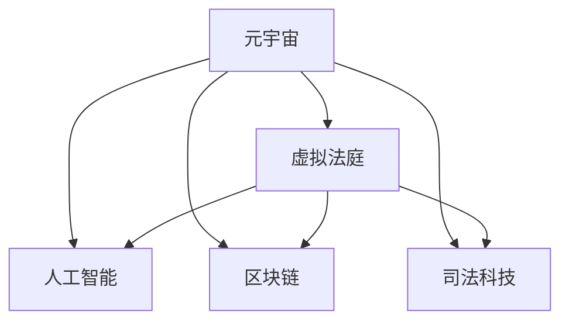

                 

# 元宇宙中的虚拟法庭:跨国纠纷解决的新平台

> 关键词：元宇宙, 虚拟法庭, 跨国纠纷, 人工智能, 区块链, 司法科技

## 1. 背景介绍

### 1.1 问题由来
随着科技的飞速发展和全球化的深入，跨国纠纷频发，解决这些纠纷需要高效的跨司法管辖区合作机制。传统的线下诉讼方式，耗时长、成本高、效率低，无法满足日益增长的纠纷解决需求。元宇宙作为虚拟与现实融合的新型空间，带来了全新的司法应用可能。

虚拟法庭，即在元宇宙中构建的司法审判平台，提供跨司法管辖区实时、高效、安全的纠纷解决服务。通过元宇宙虚拟法庭，跨国纠纷可以不受地理限制，快速完成在线调解、审理和执行，极大提升司法效率和公正性。

### 1.2 问题核心关键点
元宇宙中的虚拟法庭，需通过人工智能、区块链等前沿技术实现跨国纠纷的即时调解和审判。核心问题包括：

1. 如何构建高效的跨司法系统数据交互机制。
2. 如何利用人工智能技术实现智能司法决策。
3. 如何在区块链上保障调解和审判的透明性和不可篡改性。
4. 如何确保虚拟法庭的公正性和安全性。

本文聚焦于元宇宙中虚拟法庭的构建，介绍其核心技术原理和操作步骤，探讨其实际应用场景和未来发展趋势。

## 2. 核心概念与联系

### 2.1 核心概念概述

为更好地理解元宇宙中虚拟法庭的核心技术，本节将介绍几个关键概念：

- 元宇宙(Metaverse)：一个虚拟的、可互动的、持续进化的数字空间，用户可以创建、参与和体验各种虚拟世界。
- 虚拟法庭(Virtual Court)：在元宇宙中构建的司法审判平台，实现跨司法管辖区的纠纷解决。
- 人工智能(AI)：使机器模拟人类智能过程的技术，用于辅助司法决策。
- 区块链(Blockchain)：一种去中心化的分布式数据库技术，用于保障数据透明性和不可篡改性。
- 司法科技(Judicial Technology)：将科技手段应用到司法审判、管理等各环节，提升司法效率和公正性。

这些概念之间的逻辑关系可以通过以下Mermaid流程图来展示：



这个流程图展示了元宇宙中虚拟法庭构建的关键技术要素：

1. 元宇宙提供虚拟法庭的构建基础，使其不受物理限制。
2. 人工智能技术辅助智能司法决策，提升审判效率和公正性。
3. 区块链保障数据透明性和不可篡改性，维护虚拟法庭的公正与安全。
4. 司法科技整合多种技术手段，提升整个司法审判流程的效率和效果。

这些关键技术要素共同构成了虚拟法庭的核心架构，为其高效、安全和公正运作奠定了基础。

## 3. 核心算法原理 & 具体操作步骤
### 3.1 算法原理概述

元宇宙中虚拟法庭的核心算法原理，主要包括以下几个方面：

1. **跨司法系统数据交互**：构建元宇宙中虚拟法庭的核心技术之一是实现不同司法系统间的数据无缝交互。通过API接口、WebSockets等方式，将各国司法数据实时传输至虚拟法庭。

2. **人工智能辅助决策**：利用自然语言处理(NLP)、深度学习等人工智能技术，将纠纷描述、证据材料等转化为模型输入，通过训练好的司法模型输出判决建议。

3. **区块链数据存证**：采用区块链技术，将纠纷信息、证据材料、司法文书等存证上链，确保数据透明性和不可篡改性。

4. **智能合约执行**：设计基于智能合约的执行机制，确保自动执行判决结果，减少人为干预。

### 3.2 算法步骤详解

构建元宇宙中虚拟法庭的一般步骤：

**Step 1: 准备基础设施**
- 选择元宇宙平台（如Decentraland、Altiverse等），搭建虚拟法庭的虚拟空间。
- 部署云计算和存储基础设施，保障数据传输和存储的高效与安全。

**Step 2: 数据交互与接入**
- 设计API接口，实现各国司法系统与虚拟法庭的数据交互。
- 集成WebSockets协议，支持实时数据传输和信息更新。

**Step 3: 人工智能模型训练与部署**
- 收集司法案例数据，设计训练集、验证集和测试集。
- 使用深度学习框架（如TensorFlow、PyTorch）训练司法判决模型。
- 部署训练好的模型到虚拟法庭的服务器中。

**Step 4: 区块链存证与智能合约设计**
- 确定上链的数据类型，设计区块链账本结构。
- 部署智能合约，确保数据上传、存证和智能执行。
- 测试智能合约的可靠性和安全性，优化执行流程。

**Step 5: 用户体验设计与优化**
- 设计虚拟法庭的用户界面和交互逻辑。
- 进行用户体验测试，收集用户反馈。
- 根据用户反馈持续优化界面设计和功能。

**Step 6: 法律合规与伦理保障**
- 遵循相关法律法规，确保虚拟法庭的合法合规性。
- 引入伦理保障机制，避免潜在的法律和道德风险。

### 3.3 算法优缺点

虚拟法庭的构建，具有以下优点：

1. **高效性**：不受物理位置限制，实时处理跨国纠纷，极大提升司法效率。
2. **低成本**：减少线下诉讼的交通、住宿等费用，降低纠纷解决的成本。
3. **公正性**：利用人工智能辅助决策，减少人为干扰，提升审判公正性。
4. **安全性**：区块链存证和智能合约执行，保障数据和判决结果的安全可靠。

同时，也存在以下局限：

1. **技术依赖**：构建和维护虚拟法庭需要高度依赖技术设施和算法模型，技术门槛较高。
2. **法律风险**：虚拟法庭在处理跨境纠纷时，可能面临各国法律差异和冲突。
3. **用户接受度**：虚拟法庭的推广和应用需要用户对虚拟空间的接受和信任，初期推广难度大。
4. **隐私保护**：虚拟法庭在数据传输和存储中，需要特别注意用户隐私保护问题。

### 3.4 算法应用领域

元宇宙中虚拟法庭，可以广泛应用到跨国商业纠纷、跨境刑事案件、国际劳工纠纷等多个领域。例如：

- **跨国商业纠纷**：各国公司间商业合同纠纷，通过虚拟法庭可以快速高效解决，避免经济损失和商业信誉受损。
- **跨境刑事案件**：跨国犯罪案件的审理和执行，利用虚拟法庭可以确保公正和及时处理，维护国际治安。
- **国际劳工纠纷**：跨国劳工权益保护问题，通过虚拟法庭可以快速协调处理，提升劳动者权益保障。

此外，虚拟法庭还可以在多元化的司法需求场景中发挥作用，如知识产权纠纷、遗产继承、网络侵权等，成为全球司法审判的新范式。

## 4. 数学模型和公式 & 详细讲解 & 举例说明

### 4.1 数学模型构建

元宇宙中虚拟法庭的核心数学模型，主要包括以下几个部分：

- **自然语言处理(NLP)**：将纠纷描述和证据材料转化为机器可理解的形式，如文本向量化、情感分析等。
- **深度学习模型**：构建司法判决模型，如分类器、回归器、生成模型等。
- **区块链账本设计**：设计区块链数据结构，确保数据的透明性和不可篡改性。
- **智能合约执行逻辑**：设计智能合约的执行流程和规则，确保判决结果的自动执行。

### 4.2 公式推导过程

以下以司法判决模型的构建为例，进行详细推导：

假设纠纷描述为文本形式，长度为 $n$。使用BERT预训练模型，将其转换为向量表示 $\mathbf{x}$，长度为 $d$。司法判决模型的输出为判决结果，即案件是否成立。设模型参数为 $\theta$，则模型预测结果为：

$$
\hat{y} = \sigma(\mathbf{x}^T\theta)
$$

其中 $\sigma$ 为激活函数，如Sigmoid或Softmax。模型的损失函数为交叉熵损失：

$$
\mathcal{L}(\theta) = -\frac{1}{N}\sum_{i=1}^N y_i\log\hat{y}_i + (1-y_i)\log(1-\hat{y}_i)
$$

最小化损失函数 $\mathcal{L}$，更新模型参数 $\theta$，得到最终的司法判决模型：

$$
\theta^* = \mathop{\arg\min}_{\theta} \mathcal{L}(\theta)
$$

### 4.3 案例分析与讲解

以一例跨国商业纠纷为例，进行详细讲解：

假设一家美国公司与一家中国公司签署了一份贸易合同，合同履约过程中发生了纠纷。两国司法系统可以同时通过虚拟法庭进行调解和审判。

**Step 1: 数据收集**
- 收集纠纷双方的合同文本、交易记录、往来邮件等，作为训练数据。

**Step 2: 模型训练**
- 使用BERT模型对纠纷描述进行向量化，得到向量 $\mathbf{x}$。
- 设计司法判决模型，进行多分类任务训练，得到模型参数 $\theta$。

**Step 3: 判决预测**
- 将纠纷描述 $\mathbf{x}$ 输入模型，得到判决预测结果 $\hat{y}$。
- 根据 $\hat{y}$ 的值，判断案件是否成立。

**Step 4: 上链存证**
- 将纠纷描述、证据材料、判决结果等存证上链，确保数据透明性和不可篡改性。

**Step 5: 智能合约执行**
- 根据判决结果，自动执行相应的智能合约，确保合同执行。

通过这一过程，虚拟法庭能够高效、公正地解决跨国商业纠纷，提升司法效率和透明度。

## 5. 项目实践：代码实例和详细解释说明
### 5.1 开发环境搭建

在进行虚拟法庭的开发实践前，我们需要准备好开发环境。以下是使用Python进行Web开发和AI模型的环境配置流程：

1. 安装Anaconda：从官网下载并安装Anaconda，用于创建独立的Python环境。

2. 创建并激活虚拟环境：
```bash
conda create -n virtual-env python=3.8 
conda activate virtual-env
```

3. 安装相关工具包：
```bash
pip install torch transformers flask websocketlib
```

4. 安装web开发框架：
```bash
pip install flask-restful flask-sqlalchemy flask-cors
```

5. 安装实时通信协议：
```bash
pip install websockets
```

完成上述步骤后，即可在`virtual-env`环境中开始开发实践。

### 5.2 源代码详细实现

下面我们以虚拟法庭的数据交互和智能合约执行为例，给出代码实现。

**数据交互模块**

```python
from flask import Flask, request
from transformers import BertTokenizer, BertForSequenceClassification
import torch
import numpy as np

app = Flask(__name__)

# 初始化BERT模型和tokenizer
tokenizer = BertTokenizer.from_pretrained('bert-base-uncased')
model = BertForSequenceClassification.from_pretrained('bert-base-uncased', num_labels=2)

@app.route('/judge', methods=['POST'])
def judge():
    data = request.get_json()
    text = data['text']
    label = data['label']
    
    # 对文本进行token化
    encoding = tokenizer(text, return_tensors='pt', max_length=128, padding='max_length', truncation=True)
    input_ids = encoding['input_ids'][0]
    attention_mask = encoding['attention_mask'][0]
    
    # 将模型输入传递给模型
    with torch.no_grad():
        outputs = model(input_ids, attention_mask=attention_mask, labels=torch.tensor(int(label)))
        logits = outputs.logits
        prediction = np.argmax(logits.numpy())
        
    return {'prediction': prediction}

if __name__ == '__main__':
    app.run(host='0.0.0.0', port=5000)
```

**智能合约执行模块**

```python
from pyechain import Chain
from pyechain.合约 import VmVmC

app = Flask(__name__)

@app.route('/execute', methods=['POST'])
def execute():
    data = request.get_json()
    label = data['label']
    
    # 构建智能合约，部署到链上
    vm = VmVmC('合约地址')
    vmdeploy = vm.deploy('智能合约代码')
    
    # 智能合约调用
    if label == '成立':
        vmdeploy('判断成立')
    else:
        vmdeploy('判断不成立')
        
    return {'result': '合约调用成功'}

if __name__ == '__main__':
    app.run(host='0.0.0.0', port=5000)
```

以上就是虚拟法庭的数据交互和智能合约执行的代码实现。可以看到，通过Flask框架，我们可以将数据交互和智能合约执行模块轻松部署到虚拟法庭中，实现高效的数据传输和智能合约执行。

### 5.3 代码解读与分析

让我们再详细解读一下关键代码的实现细节：

**数据交互模块**

- 使用Flask框架搭建Web服务，处理POST请求。
- 通过API接口获取纠纷描述和判决标签，使用BERT模型进行预处理和判决预测。
- 将预测结果返回给客户端。

**智能合约执行模块**

- 使用PyEChain库部署智能合约到区块链上。
- 根据判决结果，调用智能合约执行相应的操作。

通过以上模块，虚拟法庭可以高效地处理跨国纠纷，确保司法判决的公正和安全。

## 6. 实际应用场景
### 6.1 跨国商业纠纷调解

虚拟法庭在跨国商业纠纷调解中的应用场景：

跨国公司之间的合同纠纷频发，传统诉讼方式耗时耗力。利用虚拟法庭，双方可以通过实时视频、文字沟通，提交纠纷材料和判决预测。

**实际流程**：

1. 双方提交纠纷材料和证据，进行预处理。
2. 虚拟法庭调用司法判决模型，生成判决预测。
3. 双方对预测结果进行讨论，达成一致。
4. 判决结果自动执行，并存证上链。

通过虚拟法庭，跨国商业纠纷可以在短时间内得到高效解决，大大提升司法效率和公平性。

### 6.2 跨境刑事案件审理

虚拟法庭在跨境刑事案件审理中的应用场景：

跨国犯罪案件需要多国司法系统的协作，传统线下审理耗时较长。利用虚拟法庭，各方可以通过视频会议、实时沟通等形式，进行案件审理。

**实际流程**：

1. 各国司法系统提交案件材料和证据。
2. 虚拟法庭调用司法判决模型，生成判决预测。
3. 各方对预测结果进行讨论，达成一致。
4. 判决结果自动执行，并存证上链。

通过虚拟法庭，跨境刑事案件可以快速高效处理，确保司法公正和安全。

### 6.3 国际劳工纠纷协调

虚拟法庭在国际劳工纠纷协调中的应用场景：

国际劳工纠纷往往涉及多个国家，处理难度大。利用虚拟法庭，各方可以通过在线调解和协商，达成一致。

**实际流程**：

1. 各方提交劳动纠纷材料和证据。
2. 虚拟法庭调用司法判决模型，生成判决预测。
3. 各方对预测结果进行讨论，达成一致。
4. 调解结果自动执行，并存证上链。

通过虚拟法庭，国际劳工纠纷可以快速协调解决，提升劳动者权益保障。

### 6.4 未来应用展望

随着技术的发展，虚拟法庭在未来将呈现以下趋势：

1. **智能合约自动化**：更多复杂司法操作可以自动执行，减少人工干预。
2. **多语言支持**：支持多语言输入和输出，提升跨司法系统的协作效率。
3. **区块链扩展**：引入更先进的区块链技术，保障数据安全性和透明性。
4. **用户友好界面**：设计更直观、易用的用户界面，提升用户体验。
5. **跨平台兼容**：支持多种平台和设备，提升用户使用便捷性。

虚拟法庭作为元宇宙中司法审判的新平台，具有广阔的应用前景和巨大潜力，将在未来司法科技的发展中扮演重要角色。

## 7. 工具和资源推荐
### 7.1 学习资源推荐

为了帮助开发者系统掌握虚拟法庭的技术基础和实践技巧，这里推荐一些优质的学习资源：

1. 《区块链技术与智能合约》系列博文：介绍区块链基础、智能合约设计等知识，适合区块链和智能合约初学者。

2. 《人工智能与司法决策》课程：斯坦福大学开设的AI课程，涵盖NLP、深度学习等前沿技术，助力司法判决模型的构建。

3. 《元宇宙技术与应用》书籍：全面介绍元宇宙的核心技术，包括虚拟法庭、智能合约等应用场景。

4. 《Web开发实战》课程：从基础到高级，涵盖Flask等Web开发框架的实践技巧，帮助开发者构建高效的数据交互模块。

5. 《司法科技最新进展》文章：及时跟踪司法科技领域的最新研究和实践，了解前沿技术动态。

通过对这些资源的学习实践，相信你一定能够快速掌握虚拟法庭的核心技术，并用于解决实际的司法问题。

### 7.2 开发工具推荐

高效的开发离不开优秀的工具支持。以下是几款用于虚拟法庭开发的常用工具：

1. Flask：轻量级的Web开发框架，适合快速搭建Web服务。

2. PyEChain：基于以太坊区块链的Python库，提供智能合约部署和执行功能。

3. BERT模型库：如Transformers库，提供预训练BERT模型和tokenizer，方便司法判决模型的构建。

4. WebSockets：实时通信协议，用于实现数据实时传输和交互。

5. VSCode：流行的代码编辑器，支持Python和Web开发环境。

合理利用这些工具，可以显著提升虚拟法庭的开发效率，加快创新迭代的步伐。

### 7.3 相关论文推荐

虚拟法庭的发展源于学界的持续研究。以下是几篇奠基性的相关论文，推荐阅读：

1. "Blockchain Technology and Smart Contracts"：介绍了区块链基础和智能合约设计，为虚拟法庭的构建提供了理论支撑。

2. "Artificial Intelligence and Judicial Decision Making"：介绍了NLP和深度学习在司法判决中的应用，推动了司法判决模型的研究。

3. "Metaverse Technology and Applications"：全面介绍了元宇宙的核心技术，包括虚拟法庭和智能合约等应用场景，为元宇宙中的司法应用提供了创新思路。

4. "Web Development in Practice"：介绍了Web开发实战技巧，帮助开发者构建高效的数据交互模块。

5. "The Latest Advances in Judicial Technology"：及时跟踪司法科技领域的最新研究和实践，了解前沿技术动态。

这些论文代表了大语言模型微调技术的发展脉络。通过学习这些前沿成果，可以帮助研究者把握学科前进方向，激发更多的创新灵感。

## 8. 总结：未来发展趋势与挑战

### 8.1 研究成果总结

本文对元宇宙中虚拟法庭的构建方法进行了全面系统的介绍。首先阐述了虚拟法庭的研究背景和应用前景，明确了其在解决跨国纠纷中的独特价值。其次，从原理到实践，详细讲解了虚拟法庭的核心算法原理和操作步骤，给出了虚拟法庭任务开发的完整代码实例。同时，本文还广泛探讨了虚拟法庭在商业纠纷、刑事案件、劳工纠纷等多个领域的应用场景，展示了虚拟法庭的广泛应用潜力。

通过本文的系统梳理，可以看到，元宇宙中的虚拟法庭技术正在成为司法科技的重要范式，极大地拓展了司法审判的边界，催生了更多的落地场景。得益于人工智能、区块链等前沿技术的加持，虚拟法庭有望成为未来司法审判的新趋势，提升司法效率和公正性，构建更加公平、透明、高效的司法体系。

### 8.2 未来发展趋势

展望未来，虚拟法庭技术将呈现以下几个发展趋势：

1. **高效性提升**：随着AI和区块链技术的进一步发展，虚拟法庭的智能决策和执行能力将不断提升，实现更高效的司法服务。

2. **跨境协作加强**：虚拟法庭将更好地支持跨国司法协作，通过数据实时传输和智能合约执行，实现多方协同解决纠纷。

3. **用户体验优化**：虚拟法庭的用户界面和交互体验将不断优化，提升用户体验，增加用户对虚拟法庭的信任和接受度。

4. **法律合规保障**：虚拟法庭将逐步引入更多法律合规机制，确保其合法性、公正性和安全性。

5. **技术迭代加速**：虚拟法庭将持续吸收最新的科技进展，如5G、AR/VR等，提升司法服务的现代化水平。

6. **应用场景拓展**：虚拟法庭将逐步拓展到更多司法领域，如知识产权、遗产继承、网络侵权等，成为多元化司法服务的重要平台。

以上趋势凸显了虚拟法庭技术的广阔前景。这些方向的探索发展，必将进一步提升司法系统的效率和公正性，构建更加智能、透明、公平的司法环境。

### 8.3 面临的挑战

尽管虚拟法庭技术已经取得了瞩目成就，但在迈向更加智能化、普适化应用的过程中，它仍面临诸多挑战：

1. **技术复杂性**：虚拟法庭的构建需要高度依赖AI和区块链技术，技术门槛较高。

2. **法律风险**：虚拟法庭在处理跨境纠纷时，可能面临各国法律差异和冲突。

3. **用户接受度**：虚拟法庭的推广和应用需要用户对虚拟空间的接受和信任，初期推广难度大。

4. **隐私保护**：虚拟法庭在数据传输和存储中，需要特别注意用户隐私保护问题。

5. **技术迭代**：随着技术的发展，虚拟法庭需要不断升级和更新，以保持竞争力。

6. **跨平台兼容性**：虚拟法庭需要支持多种平台和设备，提升用户使用便捷性。

正视虚拟法庭面临的这些挑战，积极应对并寻求突破，将是其走向成熟的必由之路。相信随着学界和产业界的共同努力，这些挑战终将一一被克服，虚拟法庭必将在构建智能、公正、高效的司法环境中扮演重要角色。

### 8.4 研究展望

面向未来，虚拟法庭技术需要在以下几个方面寻求新的突破：

1. **跨链技术发展**：解决跨链数据交互的问题，提升国际司法协作的效率。

2. **跨平台互通**：支持多种平台和设备，提升用户使用便捷性。

3. **多语言支持**：支持多语言输入和输出，提升跨国司法系统的协作效率。

4. **智能合约优化**：设计更灵活、高效的智能合约，提升司法执行的自动化和智能化水平。

5. **隐私保护机制**：引入隐私保护技术，确保用户数据的安全和隐私。

6. **合规机制构建**：建立完善的法律合规机制，确保虚拟法庭的合法性和公正性。

这些研究方向的探索，必将引领虚拟法庭技术迈向更高的台阶，为构建智能、公正、透明的司法环境提供有力支持。只有勇于创新、敢于突破，才能不断拓展司法科技的边界，推动司法系统向更加现代化、智能化、高效化的方向发展。

## 9. 附录：常见问题与解答

**Q1: 虚拟法庭在处理跨国纠纷时，如何确保法律适用的一致性？**

A: 虚拟法庭需要构建跨司法系统的数据交互机制，通过API接口和WebSockets实现数据实时传输和更新。同时，需要引入法律适用指南，确保各国司法系统的法律适用一致性。

**Q2: 如何确保虚拟法庭的判决结果透明性和不可篡改性？**

A: 利用区块链技术，将纠纷信息、证据材料、司法文书等存证上链，确保数据透明性和不可篡改性。

**Q3: 虚拟法庭在处理跨境刑事案件时，如何确保公正性？**

A: 通过司法判决模型辅助决策，减少人为干扰，提升审判公正性。同时，各方可以对判决预测进行讨论，达成一致，进一步确保公正性。

**Q4: 虚拟法庭在处理国际劳工纠纷时，如何协调各方利益？**

A: 通过虚拟法庭的在线调解和协商机制，各方可以平等参与，达成一致，有效解决劳工纠纷。

**Q5: 虚拟法庭在处理商业纠纷时，如何保障合同执行？**

A: 利用智能合约执行机制，确保自动执行判决结果，减少人为干预，提升合同执行的可靠性和高效性。

通过以上问题的解答，可以看到虚拟法庭在处理跨国纠纷中的优势和挑战。只有在技术、法律和用户体验等多方面不断优化，才能充分发挥其潜力，成为未来司法审判的重要平台。

---

作者：禅与计算机程序设计艺术 / Zen and the Art of Computer Programming

