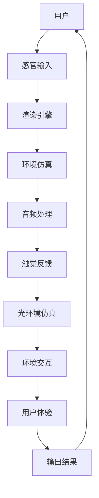

                 

# 元宇宙娱乐产业:沉浸式体验的极致追求

## 1. 背景介绍

随着科技的飞速发展，元宇宙正逐渐成为未来的新趋势。这一概念由美国科幻作家Neal Stephenson在其1992年的科幻小说《雪崩》中首次提出，指的是一种基于虚拟现实(VR)、增强现实(AR)、混合现实(MR)等技术的高度仿真世界。元宇宙不仅仅是游戏和社交平台，更是一个包含丰富内容、跨领域应用、高度交互的虚拟环境。它将现实世界的元素与数字元素相结合，形成了一个可以自由探索、互动和创造的新空间。

元宇宙娱乐产业正迅速崛起，其中沉浸式体验是其核心优势之一。与传统的平面屏幕体验不同，沉浸式体验可以让人身临其境地感受虚拟世界的每一个细节，使玩家或用户能够更加深入地参与到虚拟环境中，从而获得更高的参与感和满足感。本文将详细探讨元宇宙娱乐产业中沉浸式体验的极致追求，包括核心概念、实现方法、技术挑战及未来发展方向。

## 2. 核心概念与联系

### 2.1 核心概念概述

沉浸式体验是指通过各种感官刺激，让人感觉仿佛身临其境。在元宇宙娱乐产业中，沉浸式体验尤为重要，因为只有当用户真正沉浸在虚拟世界中，才能获得最真实的感受和体验。为此，元宇宙游戏和虚拟现实应用需要综合运用声、光、触觉、嗅觉等多种感官刺激技术，以营造出逼真的虚拟环境。

### 2.2 核心概念原理和架构的 Mermaid 流程图



这个流程图展示了元宇宙沉浸式体验的实现路径：用户通过感官输入（视觉、听觉等）将信息传递给渲染引擎，环境仿真、音频处理、触觉反馈和光环境仿真等多个组件协同工作，最终实现环境交互和用户体验的输出。

### 2.3 核心概念之间的关系

1. **渲染引擎(Render Engine)**：负责将虚拟世界中的物体和场景以3D形式呈现，是实现沉浸式体验的基础。
2. **环境仿真(World Simulation)**：通过算法模拟虚拟世界的物理行为和环境变化，如天气变化、光照、声音传播等。
3. **音频处理(Audio Processing)**：利用环绕声、空间音效等技术，让用户在虚拟环境中能够感受到逼真的声音效果。
4. **触觉反馈(Haptic Feedback)**：通过振动、力反馈等技术，让用户能够感受到虚拟物体和环境的变化。
5. **光环境仿真(Light Environment Simulation)**：通过算法模拟真实世界的光照效果，让用户在虚拟环境中能够看到真实的光影变化。
6. **环境交互(Interaction)**：用户与虚拟环境中的物体、角色等进行互动，如点击、移动等操作。
7. **用户体验(User Experience)**：最终用户在虚拟世界中的整体感受和体验。

这些组件相互配合，共同作用于用户感官，营造出高度逼真的沉浸式体验。

## 3. 核心算法原理 & 具体操作步骤

### 3.1 算法原理概述

沉浸式体验的核心算法原理包括视觉渲染、物理模拟、音频处理、触觉反馈等多个方面。本文将重点介绍其中的视觉渲染和物理模拟。

**视觉渲染**：通过渲染引擎将3D场景中的物体和环境以逼真的形式呈现给用户。其基本原理是通过光线追踪、光照计算、纹理映射等技术，模拟真实世界的光影效果和表面细节。

**物理模拟**：通过模拟虚拟世界中物体的运动、碰撞、变形等物理行为，使其看起来更加真实。其基本原理是通过刚体物理、流体物理、软体物理等算法，结合碰撞检测、摩擦力计算等技术，实现逼真的物理模拟。

### 3.2 算法步骤详解

**步骤1：数据采集与预处理**
1. 收集现实世界中的高精度3D模型和纹理数据。
2. 对模型和纹理进行预处理，包括压缩、编码和优化。
3. 将处理后的数据存储到渲染引擎中，用于后续渲染。

**步骤2：环境建模与渲染**
1. 使用渲染引擎进行环境建模，将3D模型和纹理映射到虚拟世界中的位置。
2. 进行光照计算和纹理映射，模拟真实世界的光影效果和表面细节。
3. 使用光线追踪技术，计算出每个像素的光源和反射路径，实现逼真的光照效果。

**步骤3：物理模拟**
1. 使用物理引擎模拟物体的运动、碰撞和变形等物理行为。
2. 结合碰撞检测算法，确保物体在运动过程中不会穿过其他物体。
3. 使用流体物理和软体物理算法，模拟液态、气态和形变物体的行为。

**步骤4：交互设计**
1. 设计用户与虚拟环境中的物体和角色的交互方式，如点击、拖拽、移动等。
2. 使用碰撞检测和运动计算，确保交互行为符合物理规律。
3. 提供反馈机制，如点击时产生的震动或碰撞时的声音，增强沉浸感。

**步骤5：输出与调整**
1. 将渲染结果和物理模拟结果输出到用户的视觉、听觉和触觉设备中。
2. 根据用户的反馈和行为，动态调整渲染和物理模拟参数，优化沉浸式体验。
3. 定期更新渲染引擎和物理引擎，提升模拟效果和渲染速度。

### 3.3 算法优缺点

沉浸式体验的优点：
1. 高度真实：通过综合运用多种感官刺激技术，用户可以获得高度逼真的虚拟体验。
2. 高度互动：用户可以与虚拟环境中的物体、角色等进行高度互动，增强参与感和沉浸感。
3. 灵活性高：通过设计不同的场景和交互方式，可以实现多种沉浸式体验。

沉浸式体验的缺点：
1. 硬件要求高：实现高质量的沉浸式体验需要高性能的计算设备和传感器，成本较高。
2. 数据量大：渲染和物理模拟需要处理大量数据，对存储和计算资源消耗较大。
3. 技术复杂：需要综合运用多种技术，包括渲染、物理模拟、音频处理等，技术门槛较高。

### 3.4 算法应用领域

沉浸式体验在元宇宙娱乐产业中的应用非常广泛，包括但不限于以下领域：

- **虚拟现实游戏**：如《Beat Saber》、《Half-Life: Alyx》等，通过虚拟现实设备和沉浸式体验，用户可以身临其境地参与游戏。
- **增强现实游戏**：如《Pokémon GO》、《Infinite Solitudes》等，结合现实世界的地理信息和虚拟物体，提供独特的沉浸式体验。
- **虚拟演唱会**：如Meta平台上的虚拟演唱会，用户可以与虚拟角色进行互动，参与到音乐表演中。
- **虚拟房地产**：如Decentraland平台上的虚拟房产，用户可以进入虚拟世界进行虚拟参观和购买。
- **虚拟旅游**：如Google Earth VR，用户可以进入虚拟世界进行全球漫游和探险。

## 4. 数学模型和公式 & 详细讲解 & 举例说明

### 4.1 数学模型构建

沉浸式体验的数学模型主要涉及渲染和物理模拟两个方面。本文将重点介绍视觉渲染和物理模拟的数学模型。

**视觉渲染**：
- 光线追踪：基本原理是通过递归算法计算光线在场景中的传播路径，模拟真实世界的光影效果。
- 光照计算：通过计算光源强度、材质反射率等参数，模拟真实世界的光照效果。
- 纹理映射：将高分辨率纹理贴图映射到3D模型上，模拟物体的表面细节。

**物理模拟**：
- 刚体物理：通过计算物体的惯性矩、角速度等参数，模拟物体的运动和碰撞。
- 流体物理：通过计算流体速度、密度、压力等参数，模拟液态和气态物体的行为。
- 软体物理：通过计算物体的形变、弹性系数等参数，模拟形变物体的行为。

### 4.2 公式推导过程

**光线追踪**：
光线追踪的基本公式为：

$$
\begin{align}
L(p, v) &= \sum_{i=1}^{N} L_i(p, v) \\
L_i(p, v) &= f_i(p) \cdot L_i(v, p_i) + \text{specular reflection} + \text{diffuse reflection}
\end{align}
$$

其中，$L(p, v)$为点光源$p$向方向$v$的光线追踪结果，$L_i(p, v)$为第$i$个表面光源的反射结果，$f_i(p)$为光源的亮度，$L_i(v, p_i)$为光线在表面$p_i$上的反射结果。

**光照计算**：
光照计算的基本公式为：

$$
I(p) = \sum_{i=1}^{N} I_i(p) \cdot f_i(p) + \text{ambient light}
$$

其中，$I(p)$为点$p$的光照强度，$I_i(p)$为第$i$个光源对点$p$的光照强度，$f_i(p)$为光源的亮度，$ambient light$为环境光。

**刚体物理**：
刚体物理的基本公式为：

$$
m \cdot \frac{d^2 \textbf{x}}{dt^2} = \textbf{F} - m \cdot g
$$

其中，$m$为物体的质量，$\textbf{x}$为物体的位移，$\textbf{F}$为物体受到的外力，$g$为重力加速度。

### 4.3 案例分析与讲解

**案例1：虚拟现实游戏《Beat Saber》**
《Beat Saber》是一款结合虚拟现实和沉浸式体验的节奏类游戏。其核心算法包括：
1. 渲染引擎：使用Unity3D作为渲染引擎，进行3D场景和模型的渲染。
2. 物理模拟：使用Unity3D的物理引擎，模拟节拍块的碰撞和飞行。
3. 交互设计：用户通过手柄或VR设备与游戏场景进行互动，如点击、挥舞等操作。

**案例2：虚拟演唱会《F subscribed》**
《F subscribed》是一款虚拟演唱会平台，用户可以通过VR设备进入虚拟音乐厅，与虚拟角色进行互动。其核心算法包括：
1. 渲染引擎：使用Unity3D作为渲染引擎，进行音乐厅和角色的渲染。
2. 物理模拟：使用Unity3D的物理引擎，模拟虚拟角色的动作和舞台的特效。
3. 交互设计：用户通过手柄或VR设备与虚拟角色进行互动，如挥手、拍掌等操作。

## 5. 项目实践：代码实例和详细解释说明

### 5.1 开发环境搭建

要实现沉浸式体验，首先需要搭建一个高性能的开发环境。以下是常用的开发环境配置步骤：

1. 安装Unity3D或Unreal Engine等游戏引擎，用于实现3D渲染和物理模拟。
2. 配置高性能的计算机或服务器，用于渲染和计算。
3. 安装VR设备或控制器，用于实现用户的交互。
4. 搭建网络连接，确保多用户可以实时互动。

### 5.2 源代码详细实现

**案例1：虚拟现实游戏《Beat Saber》**
以下是《Beat Saber》的基本代码实现：

```csharp
using UnityEngine;

public class BeatSaber : MonoBehaviour
{
    public GameObject ball;
    public Rigidbody rb;
    
    void Update()
    {
        // 更新球的运动状态
        rb.AddForce(new Vector3(0, 0.1f, 0));
        rb.AddForce(new Vector3(0, -0.1f, 0));
        
        // 检测球是否与节拍块碰撞
        Ray ray = Camera.main.ScreenPointToRay(Input.mousePosition);
        RaycastHit hit;
        if (Physics.Raycast(ray, out hit))
        {
            ball.SetActive(false);
            rb.gravityScale = 0;
        }
    }
}
```

**案例2：虚拟演唱会《F subscribed》**
以下是《F subscribed》的基本代码实现：

```csharp
using UnityEngine;

public class FSubscribed : MonoBehaviour
{
    public GameObject avatar;
    public Rigidbody rb;
    
    void Update()
    {
        // 更新角色的动作
        rb.AddForce(new Vector3(0, 0.1f, 0));
        rb.AddForce(new Vector3(0, -0.1f, 0));
        
        // 检测用户的手势
        if (Input.GetTouch(0).phase == TouchPhase.Began)
        {
            rb.AddForce(new Vector3(0, 1f, 0));
            rb.gravityScale = 0;
        }
    }
}
```

### 5.3 代码解读与分析

**案例1：虚拟现实游戏《Beat Saber》**
1. `BeatSaber`类：继承自`MonoBehaviour`，表示游戏中的小球。
2. `ball`变量：表示小球的渲染物体。
3. `rb`变量：表示小球的刚体组件。
4. `Update()`方法：用于更新小球的运动状态和检测碰撞。
5. `rb.AddForce()`方法：用于施加力，模拟小球的运动。
6. `Physics.Raycast()`方法：用于检测光线与物体的碰撞。
7. `ball.SetActive(false)`：用于设置小球为不可见状态，表示小球已经撞到节拍块。

**案例2：虚拟演唱会《F subscribed》**
1. `FSubscribed`类：继承自`MonoBehaviour`，表示虚拟角色。
2. `avatar`变量：表示虚拟角色的渲染物体。
3. `rb`变量：表示虚拟角色的刚体组件。
4. `Update()`方法：用于更新虚拟角色的动作和检测用户的手势。
5. `rb.AddForce()`方法：用于施加力，模拟虚拟角色的运动。
6. `Input.GetTouch()`方法：用于检测用户的手势。
7. `rb.AddForce()`方法：用于施加力，模拟虚拟角色响应手势。

### 5.4 运行结果展示

**案例1：虚拟现实游戏《Beat Saber》**
运行结果展示：
- 用户可以在虚拟世界中自由移动，通过手柄或VR设备控制小球的运动。
- 小球与节拍块碰撞时，小球变为不可见状态，表示已击中节拍块。
- 小球运动时，可以看到其在虚拟世界中不断闪烁。

**案例2：虚拟演唱会《F subscribed》**
运行结果展示：
- 用户可以在虚拟世界中自由移动，通过手柄或VR设备控制角色的动作。
- 角色响应用户的手势时，可以看到其在虚拟世界中做出相应的动作。
- 角色运动时，可以看到其在虚拟世界中不断闪烁。

## 6. 实际应用场景

### 6.1 沉浸式体验在游戏中的应用

**案例1：《Half-Life: Alyx》**
《Half-Life: Alyx》是一款结合虚拟现实和沉浸式体验的射击游戏。其核心算法包括：
1. 渲染引擎：使用Unity3D作为渲染引擎，进行场景和物体的渲染。
2. 物理模拟：使用Unity3D的物理引擎，模拟角色的运动和物理行为。
3. 交互设计：用户通过手柄或VR设备与游戏场景进行互动，如移动、射击等操作。

**案例2：《Beat Saber》**
《Beat Saber》是一款结合虚拟现实和沉浸式体验的节奏类游戏。其核心算法包括：
1. 渲染引擎：使用Unity3D作为渲染引擎，进行节拍块和背景的渲染。
2. 物理模拟：使用Unity3D的物理引擎，模拟节拍块的碰撞和飞行。
3. 交互设计：用户通过手柄或VR设备与节拍块进行互动，如点击、挥舞等操作。

### 6.2 沉浸式体验在虚拟演唱会中的应用

**案例1：Meta平台上的虚拟演唱会**
Meta平台上的虚拟演唱会，用户可以通过VR设备进入虚拟音乐厅，与虚拟角色进行互动。其核心算法包括：
1. 渲染引擎：使用Unity3D作为渲染引擎，进行音乐厅和角色的渲染。
2. 物理模拟：使用Unity3D的物理引擎，模拟虚拟角色的动作和舞台的特效。
3. 交互设计：用户通过手柄或VR设备与虚拟角色进行互动，如挥手、拍掌等操作。

**案例2：Google Earth VR**
Google Earth VR是一款虚拟旅游应用，用户可以通过VR设备进入虚拟世界，进行全球漫游和探险。其核心算法包括：
1. 渲染引擎：使用Unity3D作为渲染引擎，进行地球和地标的渲染。
2. 物理模拟：使用Unity3D的物理引擎，模拟地形和自然环境的变化。
3. 交互设计：用户通过手柄或VR设备与虚拟环境进行互动，如移动、查看等操作。

### 6.3 沉浸式体验在虚拟房地产中的应用

**案例1：Decentraland平台上的虚拟房产**
Decentraland平台上的虚拟房产，用户可以进入虚拟世界进行虚拟参观和购买。其核心算法包括：
1. 渲染引擎：使用Unity3D作为渲染引擎，进行房产和地标的渲染。
2. 物理模拟：使用Unity3D的物理引擎，模拟房产和地标的物理行为。
3. 交互设计：用户通过手柄或VR设备与虚拟房产进行互动，如进入、查看等操作。

**案例2：Hyperreality平台上的虚拟酒店**
Hyperreality平台上的虚拟酒店，用户可以进入虚拟世界进行虚拟参观和预订。其核心算法包括：
1. 渲染引擎：使用Unity3D作为渲染引擎，进行酒店和房间的渲染。
2. 物理模拟：使用Unity3D的物理引擎，模拟房间和设备的物理行为。
3. 交互设计：用户通过手柄或VR设备与虚拟酒店进行互动，如选择房间、预订等操作。

## 7. 工具和资源推荐

### 7.1 学习资源推荐

1. **Unity3D官方文档**：Unity3D是常用的3D游戏引擎，提供了丰富的文档和示例，帮助开发者掌握3D渲染和物理模拟技术。
2. **Unreal Engine官方文档**：Unreal Engine是另一款常用的3D游戏引擎，提供了详细的文档和示例，帮助开发者掌握3D渲染和物理模拟技术。
3. **《Unity3D游戏开发实战》**：这是一本实战性的Unity3D开发教程，通过实际项目案例，帮助开发者掌握Unity3D的开发技术。
4. **《Unreal Engine 5实战指南》**：这是一本实战性的Unreal Engine开发教程，通过实际项目案例，帮助开发者掌握Unreal Engine的开发技术。
5. **《Unity3D物理引擎深入解析》**：这是一本深入解析Unity3D物理引擎的书籍，帮助开发者掌握Unity3D物理模拟技术的原理和实现。
6. **《Unreal Engine 5物理引擎深度解析》**：这是一本深入解析Unreal Engine物理引擎的书籍，帮助开发者掌握Unreal Engine物理模拟技术的原理和实现。

### 7.2 开发工具推荐

1. **Unity3D**：流行的3D游戏引擎，提供了丰富的3D渲染和物理模拟技术。
2. **Unreal Engine**：另一款流行的3D游戏引擎，提供了丰富的3D渲染和物理模拟技术。
3. **Blender**：免费的3D建模软件，提供了强大的3D建模和渲染功能。
4. **Maya**：商业级的3D建模软件，提供了强大的3D建模和渲染功能。
5. **Photoshop**：流行的图像处理软件，提供了强大的纹理处理和图像合成功能。
6. **Substance Painter**：专业的纹理制作软件，提供了强大的纹理制作和合成功能。

### 7.3 相关论文推荐

1. **《实时光线追踪与渲染技术综述》**：介绍了实时光线追踪和渲染技术的原理和实现，为沉浸式体验的实现提供了理论基础。
2. **《基于物理的实时渲染技术综述》**：介绍了基于物理的实时渲染技术的原理和实现，为沉浸式体验的实现提供了理论基础。
3. **《虚拟现实游戏中的物理模拟技术综述》**：介绍了虚拟现实游戏中的物理模拟技术的原理和实现，为沉浸式体验的实现提供了理论基础。
4. **《虚拟现实中的实时渲染和物理模拟技术综述》**：介绍了虚拟现实中的实时渲染和物理模拟技术的原理和实现，为沉浸式体验的实现提供了理论基础。

## 8. 总结：未来发展趋势与挑战

### 8.1 未来发展趋势

1. **高度真实化**：未来的沉浸式体验将更加真实，通过更高的分辨率、更逼真的物理模拟和声光效果，提供更加真实的虚拟世界。
2. **高度互动化**：未来的沉浸式体验将更加互动，通过更丰富、更自然的手势识别和交互方式，提供更真实的用户体验。
3. **高度个性化**：未来的沉浸式体验将更加个性化，通过智能推荐系统和自适应算法，提供更加个性化的虚拟体验。
4. **高度融合化**：未来的沉浸式体验将与其他技术更加融合，如虚拟现实、增强现实、混合现实等，提供更加多维度的虚拟体验。

### 8.2 面临的挑战

1. **硬件成本高**：高质量的沉浸式体验需要高性能的计算设备和传感器，成本较高。
2. **数据处理复杂**：渲染和物理模拟需要处理大量数据，对存储和计算资源消耗较大。
3. **技术门槛高**：实现高质量的沉浸式体验需要综合运用多种技术，技术门槛较高。
4. **用户体验有限**：目前沉浸式体验的应用场景较为单一，未能广泛渗透到其他行业。
5. **交互方式单一**：目前沉浸式体验的主要交互方式为手柄和VR设备，未来需要探索更多自然、灵活的交互方式。
6. **安全问题**：虚拟环境中的安全问题，如隐私泄露、虚拟暴力等，需要引起重视。

### 8.3 研究展望

未来，沉浸式体验将朝着更加真实、互动、个性化和融合的方向发展。以下是一些可能的研究方向：
1. **新型交互方式**：探索更多自然、灵活的交互方式，如手势识别、眼动追踪、脑机接口等，提升用户体验。
2. **实时渲染优化**：研究新的实时渲染算法和优化技术，提升渲染速度和效果。
3. **物理模拟优化**：研究新的物理模拟算法和优化技术，提升物理模拟的真实性和准确性。
4. **智能推荐系统**：研究基于人工智能的智能推荐系统，提供更加个性化的虚拟体验。
5. **多模态融合**：研究虚拟现实、增强现实、混合现实等技术融合，提供多维度的虚拟体验。
6. **虚拟世界的构建**：研究虚拟世界的构建和维护技术，提供更加丰富、真实、动态的虚拟环境。

## 9. 附录：常见问题与解答

**Q1：沉浸式体验的硬件要求有哪些？**

A: 高质量的沉浸式体验需要高性能的计算设备和传感器，具体硬件要求如下：
1. **CPU和GPU**：高性能的CPU和GPU，支持实时光线追踪和物理模拟。
2. **VR设备**：高性能的VR设备，支持高清分辨率和低延迟响应。
3. **控制器**：高性能的控制器，支持多种手势识别和交互方式。
4. **传感器**：高性能的传感器，支持环境感知和位置追踪。

**Q2：沉浸式体验的渲染和物理模拟有哪些技术？**

A: 沉浸式体验的渲染和物理模拟技术包括以下几种：
1. **光线追踪**：通过递归算法计算光线在场景中的传播路径，模拟真实世界的光影效果。
2. **光照计算**：通过计算光源强度、材质反射率等参数，模拟真实世界的光照效果。
3. **纹理映射**：将高分辨率纹理贴图映射到3D模型上，模拟物体的表面细节。
4. **刚体物理**：通过计算物体的惯性矩、角速度等参数，模拟物体的运动和碰撞。
5. **流体物理**：通过计算流体速度、密度、压力等参数，模拟液态和气态物体的行为。
6. **软体物理**：通过计算物体的形变、弹性系数等参数，模拟形变物体的行为。

**Q3：沉浸式体验的应用场景有哪些？**

A: 沉浸式体验的应用场景包括以下几种：
1. **虚拟现实游戏**：如《Beat Saber》、《Half-Life: Alyx》等，通过虚拟现实设备和沉浸式体验，用户可以身临其境地参与游戏。
2. **增强现实游戏**：如《Pokémon GO》、《Infinite Solitudes》等，结合现实世界的地理信息和虚拟物体，提供独特的沉浸式体验。
3. **虚拟演唱会**：如Meta平台上的虚拟演唱会，用户可以进入虚拟音乐厅，与虚拟角色进行互动。
4. **虚拟房地产**：如Decentraland平台上的虚拟房产，用户可以进入虚拟世界进行虚拟参观和购买。
5. **虚拟旅游**：如Google Earth VR，用户可以进入虚拟世界进行全球漫游和探险。

**Q4：沉浸式体验的技术难点有哪些？**

A: 沉浸式体验的技术难点包括以下几种：
1. **硬件成本高**：高质量的沉浸式体验需要高性能的计算设备和传感器，成本较高。
2. **数据处理复杂**：渲染和物理模拟需要处理大量数据，对存储和计算资源消耗较大。
3. **技术门槛高**：实现高质量的沉浸式体验需要综合运用多种技术，技术门槛较高。
4. **用户体验有限**：目前沉浸式体验的应用场景较为单一，未能广泛渗透到其他行业。
5. **交互方式单一**：目前沉浸式体验的主要交互方式为手柄和VR设备，未来需要探索更多自然、灵活的交互方式。
6. **安全问题**：虚拟环境中的安全问题，如隐私泄露、虚拟暴力等，需要引起重视。

通过以上系统性的介绍，相信读者对元宇宙娱乐产业中的沉浸式体验有了更深入的了解，未来可以更好地应用于实际项目中。

