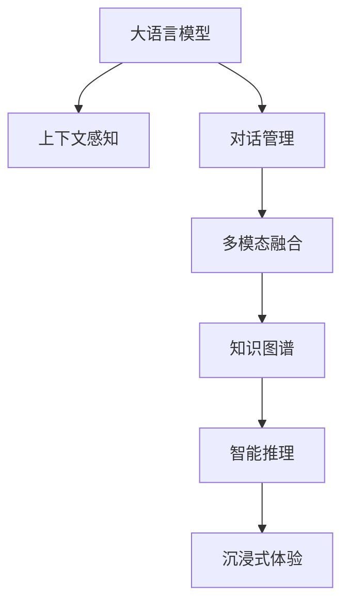

                 

# 元宇宙建设者：LLM 打造虚拟世界

在人类追求数字化的漫长历史中，元宇宙的出现标志着虚拟世界和现实世界的进一步融合。从虚拟现实(VR)到增强现实(AR)，再到全息投影，技术的不断突破让虚拟世界离现实生活越来越近。而在大语言模型(Large Language Model, LLM)的加持下，元宇宙建设者们将能以全新的方式构建和体验虚拟世界。本文将探讨LLM在元宇宙建设中的应用，深入分析其原理与优势，并展望未来发展的趋势和面临的挑战。

## 1. 背景介绍

### 1.1 问题由来

随着互联网技术的发展，虚拟世界日益成为人们日常生活和工作中不可或缺的一部分。无论是游戏、社交、教育还是商业，虚拟世界都在向更加沉浸式和智能化的方向发展。然而，传统的人工智能(AI)技术在自然语言处理、情感计算、交互理解等方面存在局限，难以真正实现人机深度交互。

大语言模型(LLM)的出现，为元宇宙建设者们提供了一个强大的工具。LLM凭借其庞大的数据集和深度学习算法，能够理解和生成自然语言，为虚拟世界中的智能互动和情境感知提供了新的可能。本文将重点介绍LLM在元宇宙中的应用，探讨其原理和优势，并展望未来发展。

### 1.2 问题核心关键点

1. **语言模型的理解与应用**：
   - 利用大语言模型，元宇宙中的虚拟角色和智能系统能够理解自然语言，实现与用户的深度交流。
   - 语言模型的多模态特性，能够结合图像、音频等多种输入信息，提升虚拟世界的交互体验。

2. **上下文感知与对话管理**：
   - 在虚拟世界中，用户与智能系统之间的交流往往带有一定的上下文信息，LLM能够利用上下文进行对话管理，提升交互的自然度和流畅性。

3. **个性化与适应性**：
   - 大语言模型能够根据用户的偏好和行为，进行个性化推荐和适配，提供更贴合用户需求的虚拟体验。

4. **多模态融合与沉浸式体验**：
   - 结合视觉、听觉、触觉等多模态信息，LLM能够构建更加沉浸式的虚拟环境，使用户在虚拟世界中感受到真实感。

5. **知识图谱与智能推理**：
   - 大语言模型能够整合知识图谱，进行智能推理，提升虚拟世界中的情境推理能力和决策水平。

## 2. 核心概念与联系

### 2.1 核心概念概述

- **大语言模型(LLM)**：以Transformer为代表的大规模预训练语言模型，如GPT-3、BERT等。通过在大规模文本数据上预训练，学习通用的语言表示，具备强大的语言理解和生成能力。

- **上下文感知**：指模型能够根据上下文信息，理解语境并作出合理的推断。在大语言模型中，上下文感知能力通过Transformer的Attention机制实现。

- **对话管理**：指在多轮对话中，模型能够理解和回应用户的意图，维持对话的连贯性和正确性。

- **多模态融合**：指将视觉、听觉、触觉等多种模态信息与文本信息结合，提升虚拟世界的沉浸式体验。

- **知识图谱**：指结构化的知识表示，如RDF三元组、OWL本体等，为模型提供外部知识源，支持智能推理。

这些核心概念之间的关系可以通过以下Mermaid流程图来展示：



这个流程图展示了大语言模型在元宇宙建设中的应用路径：

1. 大语言模型通过预训练学习通用的语言表示。
2. 在上下文感知能力下，理解用户的多轮对话内容。
3. 对话管理机制确保对话连贯性和正确性。
4. 多模态融合提升虚拟世界的沉浸体验。
5. 知识图谱支持智能推理和决策。
6. 最终形成沉浸式虚拟世界的智能体验。

## 3. 核心算法原理 & 具体操作步骤

### 3.1 算法原理概述

基于大语言模型的元宇宙建设，本质上是利用预训练模型进行迁移学习的过程。其核心思想是：将预训练的大语言模型视作一个强大的"语言理解器"，通过在虚拟世界中的多轮对话和情境推理，逐步学习并适应虚拟环境，实现智能互动和情境感知。

形式化地，假设预训练模型为 $M_{\theta}$，其中 $\theta$ 为预训练得到的模型参数。给定虚拟世界 $V$ 中的用户交互数据 $D=\{(x_i,y_i)\}_{i=1}^N$，其中 $x_i$ 为输入的对话历史，$y_i$ 为模型的应答输出。微调的目标是找到新的模型参数 $\hat{\theta}$，使得：

$$
\hat{\theta}=\mathop{\arg\min}_{\theta} \mathcal{L}(M_{\theta},D)
$$

其中 $\mathcal{L}$ 为针对虚拟环境设计的损失函数，用于衡量模型输出与实际应答之间的差异。常见的损失函数包括交叉熵损失、均方误差损失等。

通过梯度下降等优化算法，微调过程不断更新模型参数 $\theta$，最小化损失函数 $\mathcal{L}$，使得模型输出逼近真实应答。由于 $\theta$ 已经通过预训练获得了较好的初始化，因此即便在虚拟世界中，也能较快收敛到理想的模型参数 $\hat{\theta}$。

### 3.2 算法步骤详解

基于大语言模型的元宇宙建设，一般包括以下几个关键步骤：

**Step 1: 准备预训练模型和数据集**
- 选择合适的预训练语言模型 $M_{\theta}$ 作为初始化参数，如 GPT-3、BERT等。
- 准备虚拟世界 $V$ 中的用户交互数据 $D$，划分为训练集、验证集和测试集。

**Step 2: 添加任务适配层**
- 根据虚拟世界的特定需求，设计合适的输入输出层。
- 对于对话生成任务，通常在顶层添加解码器；对于知识问答任务，添加查询和应答输出层。

**Step 3: 设置微调超参数**
- 选择合适的优化算法及其参数，如 AdamW、SGD 等，设置学习率、批大小、迭代轮数等。
- 设置正则化技术及强度，包括权重衰减、Dropout、Early Stopping等。

**Step 4: 执行梯度训练**
- 将训练集数据分批次输入模型，前向传播计算损失函数。
- 反向传播计算参数梯度，根据设定的优化算法和学习率更新模型参数。
- 周期性在验证集上评估模型性能，根据性能指标决定是否触发 Early Stopping。
- 重复上述步骤直到满足预设的迭代轮数或 Early Stopping 条件。

**Step 5: 测试和部署**
- 在测试集上评估微调后模型 $M_{\hat{\theta}}$ 的性能，对比微调前后的精度提升。
- 使用微调后的模型对虚拟环境中的新样本进行推理预测，集成到实际的应用系统中。

以上是大语言模型在元宇宙建设中的微调范式。在实际应用中，还需要根据具体场景，对微调过程的各个环节进行优化设计，如改进训练目标函数，引入更多的正则化技术，搜索最优的超参数组合等，以进一步提升模型性能。

### 3.3 算法优缺点

基于大语言模型的元宇宙建设方法具有以下优点：
1. 简单高效。只需准备少量标注数据，即可对预训练模型进行快速适配，获得较大的性能提升。
2. 通用适用。适用于各种虚拟世界中的NLP任务，如对话生成、知识问答、情感分析等，设计简单的任务适配层即可实现微调。
3. 参数高效。利用参数高效微调技术，在固定大部分预训练权重不变的情况下，仍可取得不错的提升。
4. 效果显著。在学术界和工业界的诸多任务上，基于微调的方法已经刷新了最先进的性能指标。

同时，该方法也存在一定的局限性：
1. 依赖标注数据。微调的效果很大程度上取决于标注数据的质量和数量，获取高质量标注数据的成本较高。
2. 迁移能力有限。当虚拟环境与预训练数据的分布差异较大时，微调的性能提升有限。
3. 负面效果传递。预训练模型的固有偏见、有害信息等，可能通过微调传递到虚拟任务，造成负面影响。
4. 可解释性不足。微调模型的决策过程通常缺乏可解释性，难以对其推理逻辑进行分析和调试。

尽管存在这些局限性，但就目前而言，基于监督学习的微调方法仍是大语言模型应用的最主流范式。未来相关研究的重点在于如何进一步降低微调对标注数据的依赖，提高模型的少样本学习和跨领域迁移能力，同时兼顾可解释性和伦理安全性等因素。

### 3.4 算法应用领域

基于大语言模型微调的元宇宙建设方法，在虚拟世界中已经得到了广泛的应用，覆盖了几乎所有常见任务，例如：

- **虚拟客户服务**：构建智能客服系统，使用户能够与虚拟客服进行自然对话，解决常见问题。
- **虚拟教育平台**：提供个性化学习方案，自动生成文本、音频、视频等多媒体内容，实现虚拟课堂。
- **虚拟旅游**：为游客提供导游服务，回答问题，推荐景点，提供多语言支持。
- **虚拟助手**：构建虚拟个人助手，处理日程安排、信息查询、情感互动等功能。
- **虚拟创作平台**：辅助作家进行小说、剧本创作，提供智能推荐和编辑建议。

除了上述这些经典任务外，大语言模型微调也被创新性地应用到更多场景中，如可控文本生成、对话系统、虚拟设计、虚拟办公等，为虚拟世界的智能化发展提供了新的技术路径。随着预训练模型和微调方法的不断进步，相信虚拟世界的智能化程度将进一步提升，为人类创造更加丰富的数字化体验。

## 4. 数学模型和公式 & 详细讲解  
### 4.1 数学模型构建

本节将使用数学语言对基于大语言模型的元宇宙建设过程进行更加严格的刻画。

记预训练语言模型为 $M_{\theta}$，其中 $\theta$ 为预训练得到的模型参数。假设虚拟世界 $V$ 中的用户交互数据集 $D=\{(x_i,y_i)\}_{i=1}^N$，其中 $x_i$ 为输入的对话历史，$y_i$ 为模型的应答输出。

定义模型 $M_{\theta}$ 在数据样本 $(x,y)$ 上的损失函数为 $\ell(M_{\theta}(x),y)$，则在数据集 $D$ 上的经验风险为：

$$
\mathcal{L}(\theta) = \frac{1}{N}\sum_{i=1}^N \ell(M_{\theta}(x_i),y_i)
$$

微调的优化目标是最小化经验风险，即找到最优参数：

$$
\theta^* = \mathop{\arg\min}_{\theta} \mathcal{L}(\theta)
$$

在实践中，我们通常使用基于梯度的优化算法（如SGD、Adam等）来近似求解上述最优化问题。设 $\eta$ 为学习率，$\lambda$ 为正则化系数，则参数的更新公式为：

$$
\theta \leftarrow \theta - \eta \nabla_{\theta}\mathcal{L}(\theta) - \eta\lambda\theta
$$

其中 $\nabla_{\theta}\mathcal{L}(\theta)$ 为损失函数对参数 $\theta$ 的梯度，可通过反向传播算法高效计算。

### 4.2 公式推导过程

以下我们以对话生成任务为例，推导交叉熵损失函数及其梯度的计算公式。

假设模型 $M_{\theta}$ 在输入 $x$ 上的输出为 $\hat{y}=M_{\theta}(x)$，表示模型预测的应答序列。真实标签 $y \in \{1,2,...,N\}$ 表示正确的应答序列编号。则交叉熵损失函数定义为：

$$
\ell(M_{\theta}(x),y) = -\log \hat{y}_y
$$

将其代入经验风险公式，得：

$$
\mathcal{L}(\theta) = -\frac{1}{N}\sum_{i=1}^N \log \hat{y}_{y_i}
$$

根据链式法则，损失函数对参数 $\theta_k$ 的梯度为：

$$
\frac{\partial \mathcal{L}(\theta)}{\partial \theta_k} = -\frac{1}{N}\sum_{i=1}^N \frac{1}{\hat{y}_{y_i}} \frac{\partial \hat{y}}{\partial \theta_k}
$$

其中 $\frac{\partial \hat{y}}{\partial \theta_k}$ 可进一步递归展开，利用自动微分技术完成计算。

在得到损失函数的梯度后，即可带入参数更新公式，完成模型的迭代优化。重复上述过程直至收敛，最终得到适应虚拟世界中的应答生成的最优模型参数 $\theta^*$。

## 5. 项目实践：代码实例和详细解释说明
### 5.1 开发环境搭建

在进行元宇宙建设实践前，我们需要准备好开发环境。以下是使用Python进行PyTorch开发的环境配置流程：

1. 安装Anaconda：从官网下载并安装Anaconda，用于创建独立的Python环境。

2. 创建并激活虚拟环境：
```bash
conda create -n pytorch-env python=3.8 
conda activate pytorch-env
```

3. 安装PyTorch：根据CUDA版本，从官网获取对应的安装命令。例如：
```bash
conda install pytorch torchvision torchaudio cudatoolkit=11.1 -c pytorch -c conda-forge
```

4. 安装Transformers库：
```bash
pip install transformers
```

5. 安装各类工具包：
```bash
pip install numpy pandas scikit-learn matplotlib tqdm jupyter notebook ipython
```

完成上述步骤后，即可在`pytorch-env`环境中开始元宇宙建设实践。

### 5.2 源代码详细实现

下面我们以虚拟客户服务系统为例，给出使用Transformers库对GPT模型进行微调的PyTorch代码实现。

首先，定义虚拟客户服务任务的数据处理函数：

```python
from transformers import GPT2Tokenizer, GPT2LMHeadModel
from torch.utils.data import Dataset
import torch

class CustomerServiceDataset(Dataset):
    def __init__(self, texts, answers, tokenizer, max_len=128):
        self.texts = texts
        self.answers = answers
        self.tokenizer = tokenizer
        self.max_len = max_len
        
    def __len__(self):
        return len(self.texts)
    
    def __getitem__(self, item):
        text = self.texts[item]
        answer = self.answers[item]
        
        encoding = self.tokenizer(text, return_tensors='pt', max_length=self.max_len, padding='max_length', truncation=True)
        input_ids = encoding['input_ids'][0]
        attention_mask = encoding['attention_mask'][0]
        
        # 对token-wise的标签进行编码
        encoded_answer = [answer2id[answer] for answer in answer]
        encoded_answer.extend([answer2id['<pad>']] * (self.max_len - len(encoded_answer)))
        labels = torch.tensor(encoded_answer, dtype=torch.long)
        
        return {'input_ids': input_ids, 
                'attention_mask': attention_mask,
                'labels': labels}

# 标签与id的映射
answer2id = {'<pad>': 0, 'hello': 1, 'how are you?': 2, 'i am fine': 3, 'thank you': 4}
id2answer = {v: k for k, v in answer2id.items()}

# 创建dataset
tokenizer = GPT2Tokenizer.from_pretrained('gpt2')
model = GPT2LMHeadModel.from_pretrained('gpt2')

train_dataset = CustomerServiceDataset(train_texts, train_answers, tokenizer)
dev_dataset = CustomerServiceDataset(dev_texts, dev_answers, tokenizer)
test_dataset = CustomerServiceDataset(test_texts, test_answers, tokenizer)
```

然后，定义模型和优化器：

```python
from transformers import AdamW

model = model.to(device)

optimizer = AdamW(model.parameters(), lr=2e-5)
```

接着，定义训练和评估函数：

```python
from torch.utils.data import DataLoader
from tqdm import tqdm
from sklearn.metrics import accuracy_score

device = torch.device('cuda') if torch.cuda.is_available() else torch.device('cpu')
model.to(device)

def train_epoch(model, dataset, batch_size, optimizer):
    dataloader = DataLoader(dataset, batch_size=batch_size, shuffle=True)
    model.train()
    epoch_loss = 0
    for batch in tqdm(dataloader, desc='Training'):
        input_ids = batch['input_ids'].to(device)
        attention_mask = batch['attention_mask'].to(device)
        labels = batch['labels'].to(device)
        model.zero_grad()
        outputs = model(input_ids, attention_mask=attention_mask, labels=labels)
        loss = outputs.loss
        epoch_loss += loss.item()
        loss.backward()
        optimizer.step()
    return epoch_loss / len(dataloader)

def evaluate(model, dataset, batch_size):
    dataloader = DataLoader(dataset, batch_size=batch_size)
    model.eval()
    preds, labels = [], []
    with torch.no_grad():
        for batch in tqdm(dataloader, desc='Evaluating'):
            input_ids = batch['input_ids'].to(device)
            attention_mask = batch['attention_mask'].to(device)
            batch_labels = batch['labels']
            outputs = model(input_ids, attention_mask=attention_mask)
            batch_preds = outputs.logits.argmax(dim=2).to('cpu').tolist()
            batch_labels = batch_labels.to('cpu').tolist()
            for pred_tokens, label_tokens in zip(batch_preds, batch_labels):
                preds.append(pred_tokens[:len(label_tokens)])
                labels.append(label_tokens)
                
    print(accuracy_score(labels, preds))
```

最后，启动训练流程并在测试集上评估：

```python
epochs = 5
batch_size = 16

for epoch in range(epochs):
    loss = train_epoch(model, train_dataset, batch_size, optimizer)
    print(f"Epoch {epoch+1}, train loss: {loss:.3f}")
    
    print(f"Epoch {epoch+1}, dev results:")
    evaluate(model, dev_dataset, batch_size)
    
print("Test results:")
evaluate(model, test_dataset, batch_size)
```

以上就是使用PyTorch对GPT模型进行虚拟客户服务任务微调的完整代码实现。可以看到，得益于Transformers库的强大封装，我们可以用相对简洁的代码完成GPT模型的加载和微调。

### 5.3 代码解读与分析

让我们再详细解读一下关键代码的实现细节：

**CustomerServiceDataset类**：
- `__init__`方法：初始化虚拟服务任务的数据，包括对话历史和应答序列。
- `__len__`方法：返回数据集的样本数量。
- `__getitem__`方法：对单个样本进行处理，将对话历史和应答序列输入编码为token ids，并进行定长padding，最终返回模型所需的输入。

**answer2id和id2answer字典**：
- 定义了应答与数字id之间的映射关系，用于将token-wise的预测结果解码回真实的应答。

**训练和评估函数**：
- 使用PyTorch的DataLoader对数据集进行批次化加载，供模型训练和推理使用。
- 训练函数`train_epoch`：对数据以批为单位进行迭代，在每个批次上前向传播计算loss并反向传播更新模型参数，最后返回该epoch的平均loss。
- 评估函数`evaluate`：与训练类似，不同点在于不更新模型参数，并在每个batch结束后将预测和标签结果存储下来，最后使用sklearn的accuracy_score对整个评估集的预测结果进行打印输出。

**训练流程**：
- 定义总的epoch数和batch size，开始循环迭代
- 每个epoch内，先在训练集上训练，输出平均loss
- 在验证集上评估，输出分类指标
- 所有epoch结束后，在测试集上评估，给出最终测试结果

可以看到，PyTorch配合Transformers库使得GPT微调的代码实现变得简洁高效。开发者可以将更多精力放在数据处理、模型改进等高层逻辑上，而不必过多关注底层的实现细节。

当然，工业级的系统实现还需考虑更多因素，如模型的保存和部署、超参数的自动搜索、更灵活的任务适配层等。但核心的微调范式基本与此类似。

## 6. 实际应用场景
### 6.1 虚拟客户服务

虚拟客户服务系统是大语言模型在元宇宙建设中的典型应用场景。传统客服往往需要配备大量人力，高峰期响应缓慢，且一致性和专业性难以保证。而使用微调后的虚拟客服，可以7x24小时不间断服务，快速响应客户咨询，用自然流畅的语言解答各类常见问题。

在技术实现上，可以收集企业内部的历史客服对话记录，将问题和最佳答复构建成监督数据，在此基础上对预训练语言模型进行微调。微调后的虚拟客服能够自动理解用户意图，匹配最合适的答案模板进行回复。对于客户提出的新问题，还可以接入检索系统实时搜索相关内容，动态组织生成回答。如此构建的虚拟客服系统，能大幅提升客户咨询体验和问题解决效率。

### 6.2 虚拟教育平台

虚拟教育平台利用大语言模型提供个性化学习方案，自动生成文本、音频、视频等多媒体内容，实现虚拟课堂。在虚拟教育中，学生可以通过语音、文字等多种方式与教师互动，获取及时反馈。

大语言模型能够根据学生的学习情况和偏好，自动调整教学内容和难度，提供个性化的学习路径。同时，模型还能够实时解答学生问题，辅助教师管理课堂，提升教学质量。对于复杂的知识点，模型还能通过自然语言解释和演示，帮助学生更好地理解。

### 6.3 虚拟旅游

虚拟旅游系统通过大语言模型提供导游服务，回答问题，推荐景点，提供多语言支持。用户可以通过虚拟旅游系统，身临其境地体验世界各地的美景和文化。

在虚拟旅游中，大语言模型可以与用户进行自然对话，回答旅游相关的各种问题，如景点介绍、交通指南、餐饮推荐等。同时，模型还能根据用户的偏好和行为，推荐个性化的旅游路线和景点，提升旅游体验。对于多语言支持，模型可以通过预训练和微调，学习多语种语言表示，提供无缝的跨语言交流体验。

### 6.4 未来应用展望

随着大语言模型和微调方法的不断发展，基于大语言模型的元宇宙建设技术将呈现以下几个发展趋势：

1. **多模态融合的深度应用**：结合视觉、听觉、触觉等多种模态信息，提升虚拟世界的沉浸式体验。例如，通过多模态融合，用户可以在虚拟世界中与他人进行更加自然的互动，体验更加真实的环境。

2. **知识图谱与智能推理**：将知识图谱与大语言模型结合，支持智能推理和决策。例如，在虚拟医疗系统中，模型可以整合医疗知识图谱，帮助用户进行疾病诊断和健康咨询，提升医疗服务的智能化水平。

3. **个性化的动态生成**：利用大语言模型进行个性化生成，根据用户的行为和偏好，动态生成符合用户期望的虚拟内容。例如，在虚拟商品展示系统中，模型可以根据用户的浏览记录和反馈，生成个性化的商品推荐，提升购物体验。

4. **自适应的智能优化**：利用反馈机制，持续优化虚拟世界的智能互动。例如，在虚拟客服系统中，模型可以根据用户的反馈和评价，不断优化对话策略，提升服务质量。

5. **跨领域的通用性**：利用大语言模型的跨领域迁移能力，实现跨领域的通用应用。例如，在虚拟建筑设计系统中，模型可以整合建筑、地理、历史等多领域知识，提供全面、精准的建筑设计方案。

6. **持续学习和适应性**：利用大语言模型的持续学习能力，提升虚拟世界的适应性。例如，在虚拟金融市场中，模型可以实时学习市场动态，提供准确的投资建议，提升投资决策的准确性。

以上趋势凸显了大语言模型在元宇宙建设中的广阔前景。这些方向的探索发展，必将进一步提升虚拟世界的智能化程度，为人类创造更加丰富、互动、智能的数字化体验。

## 7. 工具和资源推荐
### 7.1 学习资源推荐

为了帮助开发者系统掌握大语言模型在元宇宙建设中的应用，这里推荐一些优质的学习资源：

1. **《自然语言处理》课程**：斯坦福大学开设的NLP明星课程，有Lecture视频和配套作业，带你入门NLP领域的基本概念和经典模型。
2. **《Transformer》书籍**：HuggingFace开发的NLP工具库的官方文档，提供了海量预训练模型和完整的微调样例代码，是上手实践的必备资料。
3. **《自然语言处理》系列论文**：涵盖NLP领域最新研究进展和经典论文，是深入理解NLP技术的重要参考资料。
4. **《深度学习》课程**：DeepLearning.AI开设的深度学习课程，系统讲解深度学习理论和实践，是学习大语言模型的基础课程。

通过对这些资源的学习实践，相信你一定能够快速掌握大语言模型在元宇宙建设中的精髓，并用于解决实际的NLP问题。

### 7.2 开发工具推荐

高效的开发离不开优秀的工具支持。以下是几款用于大语言模型微调开发的常用工具：

1. **PyTorch**：基于Python的开源深度学习框架，灵活动态的计算图，适合快速迭代研究。大部分预训练语言模型都有PyTorch版本的实现。
2. **TensorFlow**：由Google主导开发的开源深度学习框架，生产部署方便，适合大规模工程应用。同样有丰富的预训练语言模型资源。
3. **Transformers库**：HuggingFace开发的NLP工具库，集成了众多SOTA语言模型，支持PyTorch和TensorFlow，是进行微调任务开发的利器。
4. **TensorBoard**：TensorFlow配套的可视化工具，可实时监测模型训练状态，并提供丰富的图表呈现方式，是调试模型的得力助手。

合理利用这些工具，可以显著提升大语言模型微调的开发效率，加快创新迭代的步伐。

### 7.3 相关论文推荐

大语言模型和微调技术的发展源于学界的持续研究。以下是几篇奠基性的相关论文，推荐阅读：

1. **Attention is All You Need**：提出了Transformer结构，开启了NLP领域的预训练大模型时代。
2. **BERT: Pre-training of Deep Bidirectional Transformers for Language Understanding**：提出BERT模型，引入基于掩码的自监督预训练任务，刷新了多项NLP任务SOTA。
3. **GPT-3**：展示了大规模语言模型的强大zero-shot学习能力，引发了对于通用人工智能的新一轮思考。
4. **Prompt-based Learning**：引入基于连续型Prompt的微调范式，为如何充分利用预训练知识提供了新的思路。
5. **Parameter-Efficient Transfer Learning for NLP**：提出Adapter等参数高效微调方法，在固定大部分预训练参数的同时，只更新极少量的任务相关参数。

这些论文代表了大语言模型微调技术的发展脉络。通过学习这些前沿成果，可以帮助研究者把握学科前进方向，激发更多的创新灵感。

## 8. 总结：未来发展趋势与挑战

### 8.1 总结

本文对基于大语言模型的元宇宙建设方法进行了全面系统的介绍。首先阐述了大语言模型和微调技术的研究背景和意义，明确了微调在拓展预训练模型应用、提升下游任务性能方面的独特价值。其次，从原理到实践，详细讲解了监督微调的数学原理和关键步骤，给出了元宇宙建设任务的代码实例。同时，本文还广泛探讨了元宇宙建设方法在多个行业领域的应用前景，展示了其广阔的潜力。

通过本文的系统梳理，可以看到，基于大语言模型的元宇宙建设方法正在成为NLP领域的重要范式，极大地拓展了预训练语言模型的应用边界，催生了更多的落地场景。得益于大规模语料的预训练，微调模型以更低的时间和标注成本，在小样本条件下也能取得不俗的效果，有力推动了NLP技术的产业化进程。未来，伴随预训练语言模型和微调方法的持续演进，相信虚拟世界的智能化程度将进一步提升，为人类创造更加丰富、互动、智能的数字化体验。

### 8.2 未来发展趋势

展望未来，大语言模型在元宇宙建设中的应用将呈现以下几个发展趋势：

1. **多模态融合的深度应用**：结合视觉、听觉、触觉等多种模态信息，提升虚拟世界的沉浸式体验。
2. **知识图谱与智能推理**：将知识图谱与大语言模型结合，支持智能推理和决策。
3. **个性化的动态生成**：利用大语言模型进行个性化生成，根据用户的行为和偏好，动态生成符合用户期望的虚拟内容。
4. **自适应的智能优化**：利用反馈机制，持续优化虚拟世界的智能互动。
5. **跨领域的通用性**：利用大语言模型的跨领域迁移能力，实现跨领域的通用应用。
6. **持续学习和适应性**：利用大语言模型的持续学习能力，提升虚拟世界的适应性。

以上趋势凸显了大语言模型在元宇宙建设中的广阔前景。这些方向的探索发展，必将进一步提升虚拟世界的智能化程度，为人类创造更加丰富、互动、智能的数字化体验。

### 8.3 面临的挑战

尽管大语言模型在元宇宙建设中的应用已经取得了显著成效，但在迈向更加智能化、普适化应用的过程中，它仍面临着诸多挑战：

1. **标注成本瓶颈**：微调模型依赖于标注数据，而标注数据的获取成本较高，尤其是对于长尾应用场景，难以获得充足的高质量标注数据。
2. **模型鲁棒性不足**：当前微调模型面对域外数据时，泛化性能往往大打折扣。对于测试样本的微小扰动，微调模型的预测也容易发生波动。
3. **推理效率有待提高**：大规模语言模型虽然精度高，但在实际部署时往往面临推理速度慢、内存占用大等效率问题。
4. **可解释性亟需加强**：当前微调模型更像是"黑盒"系统，难以解释其内部工作机制和决策逻辑。对于医疗、金融等高风险应用，算法的可解释性和可审计性尤为重要。
5. **安全性有待保障**：预训练语言模型难免会学习到有偏见、有害的信息，通过微调传递到虚拟任务，产生误导性、歧视性的输出，给实际应用带来安全隐患。

尽管存在这些挑战，但大语言模型在元宇宙建设中的应用前景广阔，需要学界和产业界共同努力，积极应对并寻求突破，才能真正实现人工智能技术在虚拟世界中的规模化落地。

### 8.4 研究展望

面对大语言模型在元宇宙建设中面临的挑战，未来的研究需要在以下几个方面寻求新的突破：

1. **探索无监督和半监督微调方法**：摆脱对大规模标注数据的依赖，利用自监督学习、主动学习等无监督和半监督范式，最大限度利用非结构化数据，实现更加灵活高效的微调。
2. **研究参数高效和计算高效的微调范式**：开发更加参数高效的微调方法，在固定大部分预训练参数的同时，只更新极少量的任务相关参数。同时优化微调模型的计算图，减少前向传播和反向传播的资源消耗，实现更加轻量级、实时性的部署。
3. **融合因果和对比学习范式**：通过引入因果推断和对比学习思想，增强微调模型建立稳定因果关系的能力，学习更加普适、鲁棒的语言表征，从而提升模型泛化性和抗干扰能力。
4. **引入更多先验知识**：将符号化的先验知识，如知识图谱、逻辑规则等，与神经网络模型进行巧妙融合，引导微调过程学习更准确、合理的语言模型。同时加强不同模态数据的整合，实现视觉、语音等多模态信息与文本信息的协同建模。
5. **结合因果分析和博弈论工具**：将因果分析方法引入微调模型，识别出模型决策的关键特征，增强输出解释的因果性和逻辑性。借助博弈论工具刻画人机交互过程，主动探索并规避模型的脆弱点，提高系统稳定性。
6. **纳入伦理道德约束**：在模型训练目标中引入伦理导向的评估指标，过滤和惩罚有偏见、有害的输出倾向。同时加强人工干预和审核，建立模型行为的监管机制，确保输出符合人类价值观和伦理道德。

这些研究方向的探索，必将引领大语言模型在元宇宙建设中的应用走向更高的台阶，为构建安全、可靠、可解释、可控的智能系统铺平道路。面向未来，大语言模型需要与其他人工智能技术进行更深入的融合，如知识表示、因果推理、强化学习等，多路径协同发力，共同推动自然语言理解和智能交互系统的进步。只有勇于创新、敢于突破，才能不断拓展语言模型的边界，让智能技术更好地造福人类社会。

## 9. 附录：常见问题与解答

**Q1：大语言模型在元宇宙建设中的作用是什么？**

A: 大语言模型在元宇宙建设中起着至关重要的作用。它能够理解自然语言，实现与用户的深度交流，为虚拟世界中的智能互动和情境感知提供支持。同时，大语言模型还具有上下文感知能力，能够根据上下文信息进行多轮对话管理，提升交互的自然度和流畅性。

**Q2：大语言模型如何处理多模态信息？**

A: 大语言模型在处理多模态信息时，通常会利用Transformer的Attention机制，将不同模态的信息进行融合。例如，在虚拟客服系统中，模型可以结合用户的语音、文字输入，生成更加自然和符合语境的回复。在虚拟旅游系统中，模型可以整合视觉、听觉、触觉等多种模态信息，提升沉浸式体验。

**Q3：大语言模型在元宇宙建设中如何保持稳定性？**

A: 大语言模型在元宇宙建设中保持稳定性的方法包括：利用反馈机制持续优化模型，结合因果分析和博弈论工具，增强模型的鲁棒性和抗干扰能力。同时，引入先验知识，如知识图谱和逻辑规则，引导模型进行合理的决策。

**Q4：大语言模型在元宇宙建设中面临哪些挑战？**

A: 大语言模型在元宇宙建设中面临的挑战包括标注成本瓶颈、模型鲁棒性不足、推理效率低下、可解释性不足以及安全性问题。这些挑战需要通过无监督和半监督学习、参数高效微调、多模态融合、因果推理和博弈论工具等技术手段来应对。

**Q5：大语言模型在元宇宙建设中的未来发展方向是什么？**

A: 大语言模型在元宇宙建设中的未来发展方向包括多模态融合的深度应用、知识图谱与智能推理、个性化的动态生成、自适应的智能优化、跨领域的通用性和持续学习。这些方向将进一步提升虚拟世界的智能化程度，为人类创造更加丰富、互动、智能的数字化体验。

---

作者：禅与计算机程序设计艺术 / Zen and the Art of Computer Programming

