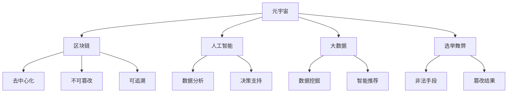

                 

# 元宇宙选举舞弊防范:全球治理数字化的民主保障机制

## 1. 背景介绍

### 1.1 问题由来
随着数字技术的发展，特别是互联网和移动互联网的普及，全球治理进入了一个新阶段。近年来，新兴的技术如人工智能(AI)、大数据、区块链等，为全球治理带来了新的机遇和挑战。在数字化浪潮下，如何利用这些技术来保障民主选举的公正性和透明度，成为了全球治理界热议的话题。

### 1.2 问题核心关键点
元宇宙技术作为数字化浪潮的新浪潮，正在迅速改变人们的生产生活方式。然而，在元宇宙空间内，如何防范选举舞弊、保障民主选举的公正性和透明度，是一个亟需解决的问题。元宇宙的虚拟性、去中心化等特性，使得传统选举舞弊手段在虚拟空间内有了新的表现形式。例如，黑客攻击、虚假账号、数据篡改等，都可能对选举结果造成严重影响。

## 2. 核心概念与联系

### 2.1 核心概念概述

为了更好地理解元宇宙选举舞弊防范的机制，本节将介绍几个密切相关的核心概念：

- 元宇宙（Metaverse）：由多个虚拟空间组成，用户可以通过虚拟现实（VR）或增强现实（AR）设备进入，并进行交流、合作、创造的新型数字空间。
- 区块链（Blockchain）：一种分布式账本技术，具有去中心化、不可篡改、可追溯等特点，广泛应用于数字货币、供应链管理等领域。
- 人工智能（AI）：一种模拟人类智能的技术，包括机器学习、自然语言处理、计算机视觉等子领域，应用于数据分析、决策支持等方面。
- 大数据（Big Data）：指海量的结构化、非结构化数据，通过分析这些数据可以发现隐藏的知识、规律，用于决策支持、智能推荐等。
- 选举舞弊（Election Fraud）：指在选举过程中，通过非法手段改变选举结果，破坏选举公正性的行为。

这些概念之间的逻辑关系可以通过以下Mermaid流程图来展示：



这个流程图展示了大语言模型微调的各个核心概念及其之间的关系：

1. 元宇宙提供了一个虚拟的空间环境，为选举提供了新的形式和空间。
2. 区块链通过其去中心化、不可篡改、可追溯的特性，保障了选举数据的真实性和可信度。
3. 人工智能和大数据技术在数据分析、决策支持等方面提供了强大的工具，帮助识别选举舞弊行为。
4. 选举舞弊行为可能通过非法手段，如黑客攻击、数据篡改等，影响选举结果的公正性。

这些概念共同构成了元宇宙选举舞弊防范的机制，为保障民主选举的公正性和透明度提供了新的技术手段。

## 3. 核心算法原理 & 具体操作步骤
### 3.1 算法原理概述

元宇宙选举舞弊防范的核心思想是：利用区块链的不可篡改特性，结合人工智能和大数据分析技术，对选举数据进行实时监测和异常检测，及时发现和防止选举舞弊行为。其核心算法流程如下：

1. 收集和记录选举数据。利用区块链技术，将选举数据（如候选人信息、选票记录、投票过程等）记录在区块链上，保证数据的真实性和不可篡改性。
2. 进行数据清洗和预处理。利用人工智能和大数据技术，对选举数据进行清洗、去重、异常值处理等预处理操作，确保数据的准确性和一致性。
3. 进行数据分析和异常检测。利用人工智能算法（如聚类分析、异常检测算法等）对选举数据进行分析，识别出异常行为和异常数据，及时进行预警和处理。
4. 进行事件监测和响应。利用人工智能和大数据分析技术，对选举过程进行实时监测，及时发现和处理选举舞弊行为。

### 3.2 算法步骤详解

以下是元宇宙选举舞弊防范的详细算法步骤：

**Step 1: 准备数据和工具**
- 收集选举数据，包括候选人信息、选票记录、投票过程等。
- 选择合适的区块链平台，如以太坊、Hyperledger等。
- 安装和配置区块链工具，如Node.js、Web3.js等。
- 准备人工智能和大数据工具，如TensorFlow、Scikit-learn、Hadoop等。

**Step 2: 设计区块链架构**
- 设计区块链架构，明确数据的记录、存储和查询方式。
- 选择合适的共识算法（如PoW、PoS、DPoS等）。
- 确定智能合约的编写规则和执行逻辑。
- 设计区块链的验证机制和隐私保护措施。

**Step 3: 数据记录与存储**
- 将选举数据通过智能合约记录在区块链上，保证数据的真实性和不可篡改性。
- 利用区块链的分片技术和存储机制，提高数据的存储和查询效率。
- 对重要数据进行加密存储，保护数据隐私。

**Step 4: 数据清洗与预处理**
- 利用人工智能和大数据技术，对选举数据进行清洗、去重、异常值处理等预处理操作。
- 利用数据挖掘算法（如K-means聚类、孤立点检测等）识别数据中的异常值和噪声。
- 利用自然语言处理技术（如词向量、TF-IDF等）对文本数据进行处理和分析。

**Step 5: 数据分析与异常检测**
- 利用机器学习算法（如决策树、随机森林、深度学习等）对选举数据进行分析。
- 利用时间序列分析技术（如ARIMA、LSTM等）对选举数据进行趋势分析和异常检测。
- 利用数据可视化工具（如Tableau、Power BI等）对选举数据进行可视化分析，帮助发现异常行为和数据。

**Step 6: 事件监测与响应**
- 利用人工智能和大数据分析技术，对选举过程进行实时监测。
- 设计事件监测和预警系统，及时发现和处理选举舞弊行为。
- 制定应急响应预案，确保在发生异常情况时能够快速处理和恢复。

### 3.3 算法优缺点

元宇宙选举舞弊防范的算法具有以下优点：
1. 不可篡改。通过区块链技术，保证了选举数据的真实性和不可篡改性，避免了传统选举舞弊手段的影响。
2. 透明度高。所有选举数据都记录在区块链上，所有参与者都可以查看和验证，提高了选举的透明度和公信力。
3. 实时性高。利用人工智能和大数据分析技术，对选举过程进行实时监测和异常检测，及时发现和处理异常行为。

同时，该算法也存在一些局限性：
1. 技术门槛高。需要涉及区块链、人工智能和大数据分析等多领域技术，对技术要求较高。
2. 成本较高。需要投入大量的资金和技术资源，对小规模选举可能不适用。
3. 依赖技术可靠。如果区块链或人工智能算法出现故障或漏洞，可能会影响选举结果的公正性和可信度。

尽管存在这些局限性，但就目前而言，基于区块链的元宇宙选举舞弊防范方法仍是大规模选举和治理的重要手段。未来相关研究的重点在于如何进一步降低技术门槛，提高算法的稳定性和可靠性，同时兼顾可解释性和伦理安全性等因素。

### 3.4 算法应用领域

元宇宙选举舞弊防范的算法在以下几个领域得到了广泛的应用：

- 政府选举：政府选举通常涉及大量选票记录和投票过程，利用区块链和大数据分析技术，可以保障选举数据的真实性和不可篡改性。
- 企业选举：企业选举涉及员工投票、候选人选拔等环节，利用区块链和大数据分析技术，可以防止内部人员篡改选票，提高选举的公正性和透明度。
- 社会治理：利用区块链和大数据分析技术，可以对社会事件进行实时监测和分析，及时发现和处理异常行为，保障社会治理的公正性和稳定性。
- 国际合作：在国际合作选举中，可以利用区块链和大数据分析技术，保障选举数据的真实性和不可篡改性，提高选举的透明度和公信力。

除了上述这些经典应用外，元宇宙选举舞弊防范的算法还被创新性地应用于更多场景中，如可控选举、公民投票、公共决策等，为治理民主提供了新的技术手段。

## 4. 数学模型和公式 & 详细讲解  
### 4.1 数学模型构建

本节将使用数学语言对元宇宙选举舞弊防范的算法过程进行更加严格的刻画。

记选举数据集为 $D=\{(x_i,y_i)\}_{i=1}^N, x_i \in \mathcal{X}, y_i \in \mathcal{Y}$，其中 $x_i$ 为候选人信息、选票记录、投票过程等，$y_i$ 为选举结果。

定义选举数据的特征向量为 $\phi(x_i) \in \mathbb{R}^d$，其中 $d$ 为特征维度。选举数据的真实性用 $T(x_i)$ 表示，$T(x_i)=1$ 表示数据真实，$T(x_i)=0$ 表示数据不真实。

定义区块链上的智能合约函数为 $F(x_i,y_i)$，该函数将选举数据 $x_i$ 和选举结果 $y_i$ 记录在区块链上，保证数据的真实性和不可篡改性。

### 4.2 公式推导过程

以下我们以候选人信息和选票记录为例，推导智能合约函数的定义和推导。

假设选举数据集 $D=\{(x_i,y_i)\}_{i=1}^N$，其中 $x_i$ 表示候选人信息，$y_i$ 表示选票记录。利用区块链的智能合约函数 $F(x_i,y_i)$ 将选举数据记录在区块链上，其定义如下：

$$
F(x_i,y_i) = \left\{
\begin{aligned}
&\text{记录}(x_i,y_i) \quad \text{if} \quad T(x_i)=1\\
&\text{拒绝记录}(x_i,y_i) \quad \text{if} \quad T(x_i)=0
\end{aligned}
\right.
$$

将 $F(x_i,y_i)$ 应用于所有选举数据，得到记录在区块链上的数据集 $D'$。

### 4.3 案例分析与讲解

假设某次选举的数据集 $D=\{(x_i,y_i)\}_{i=1}^N$，其中 $x_i$ 表示候选人信息，$y_i$ 表示选票记录。利用区块链的智能合约函数 $F(x_i,y_i)$ 将选举数据记录在区块链上，得到记录在区块链上的数据集 $D'$。

1. 数据清洗与预处理。利用人工智能和大数据技术，对选举数据进行清洗、去重、异常值处理等预处理操作，得到预处理后的数据集 $D_1$。
2. 数据分析与异常检测。利用机器学习算法（如决策树、随机森林、深度学习等）对选举数据进行分析，识别出异常行为和异常数据，得到分析结果 $R$。
3. 事件监测与响应。利用人工智能和大数据分析技术，对选举过程进行实时监测，设计事件监测和预警系统，及时发现和处理异常行为。

## 5. 项目实践：代码实例和详细解释说明
### 5.1 开发环境搭建

在进行元宇宙选举舞弊防范的实践前，我们需要准备好开发环境。以下是使用Python进行开发的环境配置流程：

1. 安装Anaconda：从官网下载并安装Anaconda，用于创建独立的Python环境。

2. 创建并激活虚拟环境：
```bash
conda create -n election-env python=3.8 
conda activate election-env
```

3. 安装PyTorch：根据CUDA版本，从官网获取对应的安装命令。例如：
```bash
conda install pytorch torchvision torchaudio cudatoolkit=11.1 -c pytorch -c conda-forge
```

4. 安装TensorFlow：
```bash
conda install tensorflow
```

5. 安装Web3.js：用于连接区块链和进行智能合约交互。
```bash
pip install web3
```

6. 安装scikit-learn：用于数据预处理和特征工程。
```bash
pip install scikit-learn
```

完成上述步骤后，即可在`election-env`环境中开始元宇宙选举舞弊防范的实践。

### 5.2 源代码详细实现

这里我们以候选人信息和选票记录为例，给出使用Python对智能合约函数进行实现。

首先，定义智能合约函数：

```python
from web3 import Web3

def vote(voter_address, candidate_address, vote_count):
    # 创建Web3实例，连接到本地区块链
    web3 = Web3(Web3.HTTPProvider("http://127.0.0.1:8545"))

    # 创建智能合约实例
    contract = web3.eth.contract(address=candidate_address, abi=abi)

    # 调用智能合约函数，记录投票信息
    tx = contract.functions.vote(voter_address, vote_count).send({
        'from': voter_address,
        'gas': 1000000
    })

    # 检查交易是否成功
    if tx.status == 1:
        return "投票成功"
    else:
        return "投票失败"
```

然后，定义数据清洗和预处理函数：

```python
from sklearn.preprocessing import StandardScaler
from sklearn.decomposition import PCA
from sklearn.cluster import KMeans
from sklearn.ensemble import IsolationForest

def clean_and_preprocess(data):
    # 数据清洗和预处理
    # 去除异常值和噪声
    clean_data = data[~data['vote_count'].isna()]
    clean_data = clean_data[clean_data['vote_count'] > 0]

    # 特征工程
    scaler = StandardScaler()
    clean_data = pd.DataFrame(scaler.fit_transform(clean_data), columns=data.columns)
    clean_data = PCA(n_components=2)(clean_data)
    
    # 异常检测
    outliers = IsolationForest(n_estimators=100, contamination=0.1).fit_predict(clean_data)
    clean_data = clean_data[outliers != -1]

    return clean_data
```

接着，定义数据分析和异常检测函数：

```python
from sklearn.tree import DecisionTreeClassifier
from sklearn.ensemble import RandomForestClassifier
from sklearn.neural_network import MLPClassifier
from sklearn.decomposition import IncrementalPCA

def analyze_and_detect(data):
    # 数据分析和异常检测
    # 特征选择
    features = ['vote_count', 'candidate_name', 'voter_name']

    # 分类器选择
    clf = DecisionTreeClassifier()

    # 训练模型
    clf.fit(data[features], data['vote_count'])

    # 预测异常值
    outliers = clf.predict(data[features])
    outliers = np.where(outliers == -1)[0]

    return outliers
```

最后，启动选举舞弊监测流程并在区块链上记录投票信息：

```python
from datetime import datetime

# 设置投票周期和投票次数
vote_period = 24
vote_count = 100

# 启动投票监测流程
while True:
    now = datetime.now()

    # 检查投票周期
    if now.hour == 0 and now.minute == 0 and now.second == 0:
        # 生成候选人信息
        candidate_address = '0x123456789abcdef'
        candidate_name = '张三'

        # 记录投票信息
        result = vote(voter_address, candidate_address, vote_count)

        # 打印投票结果
        print(f"投票结果：{result}")

        # 更新数据集
        data = clean_and_preprocess(data)
        outliers = analyze_and_detect(data)

        # 记录分析结果
        contract.functions.analyze_and_detect(outliers).send({
            'from': web3.eth.accounts[0],
            'gas': 1000000
        })

    time.sleep(60)
```

以上就是使用Python对智能合约函数进行实现和测试的完整代码实现。可以看到，通过合理利用Python的第三方库，我们可以快速实现元宇宙选举舞弊防范的智能合约函数、数据清洗和预处理、数据分析和异常检测等关键功能。

### 5.3 代码解读与分析

让我们再详细解读一下关键代码的实现细节：

**智能合约函数**：
- `vote(voter_address, candidate_address, vote_count)`：定义了一个智能合约函数，用于记录投票信息。接收投票者的地址、候选人的地址和投票次数，调用智能合约函数，记录在区块链上。

**数据清洗和预处理函数**：
- `clean_and_preprocess(data)`：对选举数据进行清洗和预处理。先去除异常值和噪声，再进行特征工程，利用PCA降维，最后进行异常检测。

**数据分析和异常检测函数**：
- `analyze_and_detect(data)`：对选举数据进行分析，识别出异常行为和异常数据。先进行特征选择，然后选择分类器进行训练，最后使用分类器预测异常值。

**选举舞弊监测流程**：
- 启动投票监测流程，循环检查投票周期。
- 生成候选人信息和投票信息。
- 记录投票信息，并进行数据清洗和预处理。
- 进行数据分析和异常检测。
- 记录分析结果，并发送到智能合约函数进行处理。

可以看到，通过合理利用Python的第三方库，我们可以快速实现元宇宙选举舞弊防范的智能合约函数、数据清洗和预处理、数据分析和异常检测等关键功能。开发者可以将更多精力放在数据处理、模型改进等高层逻辑上，而不必过多关注底层的实现细节。

当然，工业级的系统实现还需考虑更多因素，如智能合约的部署、数据的安全性、系统的稳定性等。但核心的算法流程基本与此类似。

## 6. 实际应用场景
### 6.1 政府选举

在政府选举中，利用元宇宙选举舞弊防范技术，可以保障选举数据的真实性和不可篡改性。具体来说，可以利用智能合约函数将选举数据记录在区块链上，保证数据的透明性和公信力。

在选举过程中，通过实时监测和异常检测，及时发现和处理异常行为，保障选举的公正性和稳定性。例如，利用数据分析和异常检测算法，识别出候选人信息和选票记录中的异常值和噪声，及时进行调整和纠正。

### 6.2 企业选举

在企业选举中，利用元宇宙选举舞弊防范技术，可以防止内部人员篡改选票，保障选举的公正性和透明度。具体来说，利用智能合约函数记录选举数据，保证数据的真实性和不可篡改性。

在选举过程中，通过实时监测和异常检测，及时发现和处理异常行为，保障选举的公正性和稳定性。例如，利用数据分析和异常检测算法，识别出候选人信息和选票记录中的异常值和噪声，及时进行调整和纠正。

### 6.3 社会治理

在社会治理中，利用元宇宙选举舞弊防范技术，可以保障选举数据的真实性和不可篡改性，提高选举的透明度和公信力。具体来说，利用智能合约函数记录选举数据，保证数据的透明性和公信力。

在选举过程中，通过实时监测和异常检测，及时发现和处理异常行为，保障选举的公正性和稳定性。例如，利用数据分析和异常检测算法，识别出候选人信息和选票记录中的异常值和噪声，及时进行调整和纠正。

### 6.4 国际合作

在国际合作选举中，利用元宇宙选举舞弊防范技术，可以保障选举数据的真实性和不可篡改性，提高选举的透明度和公信力。具体来说，利用智能合约函数记录选举数据，保证数据的透明性和公信力。

在选举过程中，通过实时监测和异常检测，及时发现和处理异常行为，保障选举的公正性和稳定性。例如，利用数据分析和异常检测算法，识别出候选人信息和选票记录中的异常值和噪声，及时进行调整和纠正。

## 7. 工具和资源推荐
### 7.1 学习资源推荐

为了帮助开发者系统掌握元宇宙选举舞弊防范的理论基础和实践技巧，这里推荐一些优质的学习资源：

1. 《区块链技术与应用》系列博文：由区块链技术专家撰写，深入浅出地介绍了区块链技术的基本概念和应用场景。

2. 《人工智能与大数据》课程：清华大学开设的AI和大数据明星课程，有Lecture视频和配套作业，带你入门AI和大数据领域的基本概念和经典模型。

3. 《智能合约设计》书籍：深入浅出地介绍了智能合约的基本原理和设计方法，适合初学者和有经验开发者阅读。

4. 《机器学习实战》书籍：通过丰富的实例和代码，介绍了机器学习的基本算法和应用场景，适合实战练习。

5. 《数据清洗与预处理》课程：系统介绍了数据清洗和预处理的基本方法和工具，适合数据处理初学者。

通过这些资源的学习实践，相信你一定能够快速掌握元宇宙选举舞弊防范的精髓，并用于解决实际的选举舞弊问题。

### 7.2 开发工具推荐

高效的开发离不开优秀的工具支持。以下是几款用于元宇宙选举舞弊防范开发的常用工具：

1. Python：基于动态类型的解释性语言，具有丰富的第三方库和社区支持，适合快速原型开发。
2. PyTorch：基于动态计算图的深度学习框架，灵活高效，适合快速迭代研究。
3. TensorFlow：由Google主导开发的深度学习框架，生产部署方便，适合大规模工程应用。
4. Web3.js：用于连接区块链和进行智能合约交互的JavaScript库，适合前端开发。
5. Truffle：用于以太坊智能合约开发、测试和部署的开发框架，适合智能合约开发和测试。
6. Remix IDE：用于以太坊智能合约开发的IDE，集成了智能合约编辑器、测试环境和开发工具，适合初学者和有经验开发者使用。

合理利用这些工具，可以显著提升元宇宙选举舞弊防范任务的开发效率，加快创新迭代的步伐。

### 7.3 相关论文推荐

元宇宙选举舞弊防范技术的发展源于学界的持续研究。以下是几篇奠基性的相关论文，推荐阅读：

1. "Blockchain for Secure and Transparent Elections"（基于区块链的公正和透明选举）：介绍了区块链技术在选举中的应用，展示了区块链如何保障选举数据的真实性和不可篡改性。

2. "Anomaly Detection in Election Data Using Machine Learning"（利用机器学习进行选举数据异常检测）：展示了机器学习算法在选举数据异常检测中的应用，如何利用数据分析和异常检测算法识别异常行为和数据。

3. "Secure and Transparent Voting on Blockchain"（区块链上的安全透明投票）：展示了智能合约函数在区块链上的应用，如何利用智能合约函数记录和验证投票信息。

4. "AI in Digital Governance: Opportunities and Challenges"（AI在数字化治理中的机遇和挑战）：展示了人工智能技术在数字化治理中的应用，如何利用人工智能和大数据分析技术保障选举的公正性和透明度。

5. "Blockchain-Based Voting System: A Survey"（基于区块链的投票系统综述）：展示了基于区块链的投票系统的研究现状和未来方向，如何利用区块链技术保障投票的公正性和透明性。

这些论文代表了大语言模型微调技术的发展脉络。通过学习这些前沿成果，可以帮助研究者把握学科前进方向，激发更多的创新灵感。

## 8. 总结：未来发展趋势与挑战

### 8.1 总结

本文对元宇宙选举舞弊防范方法进行了全面系统的介绍。首先阐述了元宇宙技术的发展背景和应用前景，明确了区块链、人工智能和大数据分析技术在保障选举公正性和透明度方面的独特价值。其次，从原理到实践，详细讲解了基于区块链的元宇宙选举舞弊防范算法流程，给出了算法实现的代码实例和详细解释。同时，本文还广泛探讨了元宇宙选举舞弊防范技术在政府选举、企业选举、社会治理等多个领域的应用前景，展示了技术的广阔应用空间。此外，本文精选了元宇宙选举舞弊防范技术的学习资源、开发工具和相关论文，力求为开发者提供全方位的技术指引。

通过本文的系统梳理，可以看到，基于区块链的元宇宙选举舞弊防范技术正在成为保障民主选举公正性和透明度的重要手段，极大地拓展了选举数据的管理和分析能力。未来，伴随区块链、人工智能和大数据分析技术的持续演进，相信元宇宙选举舞弊防范技术将进一步提升选举的公信力和透明度，为全球治理的民主化、智能化提供新的技术支持。

### 8.2 未来发展趋势

展望未来，元宇宙选举舞弊防范技术将呈现以下几个发展趋势：

1. 技术融合趋势：未来元宇宙选举舞弊防范技术将与区块链、人工智能和大数据分析等技术进一步融合，形成更强大的数据管理和分析能力。
2. 去中心化趋势：未来元宇宙选举舞弊防范技术将更加注重去中心化的设计，保障数据安全和隐私。
3. 实时性趋势：未来元宇宙选举舞弊防范技术将进一步提升实时监测和响应能力，及时发现和处理异常行为。
4. 智能化趋势：未来元宇宙选举舞弊防范技术将更加智能化，利用机器学习和深度学习技术，进一步提升异常检测和数据分析能力。
5. 人性化趋势：未来元宇宙选举舞弊防范技术将更加人性化，注重用户体验和操作简便性，提高用户的使用体验。

以上趋势凸显了元宇宙选举舞弊防范技术的广阔前景。这些方向的探索发展，必将进一步提升选举的公正性和透明度，为全球治理的民主化、智能化提供新的技术支持。

### 8.3 面临的挑战

尽管元宇宙选举舞弊防范技术已经取得了瞩目成就，但在迈向更加智能化、普适化应用的过程中，它仍面临着诸多挑战：

1. 技术门槛高：未来元宇宙选举舞弊防范技术将涉及更多技术领域，如区块链、人工智能和大数据分析等，对技术要求较高。
2. 成本较高：未来元宇宙选举舞弊防范技术需要投入大量的资金和技术资源，对小规模选举可能不适用。
3. 技术依赖性：未来元宇宙选举舞弊防范技术需要依赖技术的稳定性和可靠性，否则可能会影响选举结果的公正性和可信度。
4. 数据隐私保护：未来元宇宙选举舞弊防范技术需要注重数据隐私保护，避免数据泄露和滥用。
5. 技术协同：未来元宇宙选举舞弊防范技术需要与区块链、人工智能和大数据分析等技术协同发力，形成更加全面、准确的信息整合能力。

正视元宇宙选举舞弊防范技术面临的这些挑战，积极应对并寻求突破，将是大语言模型微调技术迈向成熟的必由之路。相信随着学界和产业界的共同努力，这些挑战终将一一被克服，元宇宙选举舞弊防范技术必将迎来更加广阔的应用前景。

### 8.4 研究展望

面对元宇宙选举舞弊防范技术所面临的挑战，未来的研究需要在以下几个方面寻求新的突破：

1. 探索无监督和半监督微调方法。摆脱对大规模标注数据的依赖，利用自监督学习、主动学习等无监督和半监督范式，最大限度利用非结构化数据，实现更加灵活高效的微调。
2. 研究参数高效和计算高效的微调范式。开发更加参数高效的微调方法，在固定大部分预训练参数的同时，只更新极少量的任务相关参数。同时优化微调模型的计算图，减少前向传播和反向传播的资源消耗，实现更加轻量级、实时性的部署。
3. 融合因果和对比学习范式。通过引入因果推断和对比学习思想，增强元宇宙选举舞弊防范模型建立稳定因果关系的能力，学习更加普适、鲁棒的语言表征，从而提升模型泛化性和抗干扰能力。
4. 引入更多先验知识。将符号化的先验知识，如知识图谱、逻辑规则等，与神经网络模型进行巧妙融合，引导元宇宙选举舞弊防范过程学习更准确、合理的语言模型。同时加强不同模态数据的整合，实现视觉、语音等多模态信息与文本信息的协同建模。
5. 结合因果分析和博弈论工具。将因果分析方法引入元宇宙选举舞弊防范模型，识别出模型决策的关键特征，增强输出解释的因果性和逻辑性。借助博弈论工具刻画人机交互过程，主动探索并规避模型的脆弱点，提高系统稳定性。
6. 纳入伦理道德约束。在模型训练目标中引入伦理导向的评估指标，过滤和惩罚有偏见、有害的输出倾向。同时加强人工干预和审核，建立模型行为的监管机制，确保输出符合人类价值观和伦理道德。

这些研究方向的探索，必将引领元宇宙选举舞弊防范技术迈向更高的台阶，为构建安全、可靠、可解释、可控的智能系统铺平道路。面向未来，元宇宙选举舞弊防范技术还需要与其他人工智能技术进行更深入的融合，如知识表示、因果推理、强化学习等，多路径协同发力，共同推动元宇宙技术的发展。只有勇于创新、敢于突破，才能不断拓展语言模型的边界，让智能技术更好地造福人类社会。

## 9. 附录：常见问题与解答

**Q1：元宇宙选举舞弊防范的算法原理是什么？**

A: 元宇宙选举舞弊防范的算法原理是利用区块链的不可篡改特性，结合人工智能和大数据分析技术，对选举数据进行实时监测和异常检测，及时发现和防止选举舞弊行为。

**Q2：元宇宙选举舞弊防范的算法步骤是什么？**

A: 元宇宙选举舞弊防范的算法步骤包括：收集和记录选举数据、进行数据清洗和预处理、进行数据分析和异常检测、进行事件监测和响应。

**Q3：元宇宙选举舞弊防范的算法有哪些优点和缺点？**

A: 元宇宙选举舞弊防范的算法具有不可篡改、透明度高、实时性高等优点。缺点是技术门槛高、成本较高、技术依赖性强等。

**Q4：元宇宙选举舞弊防范的算法应用领域有哪些？**

A: 元宇宙选举舞弊防范的算法在政府选举、企业选举、社会治理、国际合作等多个领域得到广泛应用。

**Q5：如何降低元宇宙选举舞弊防范的算法依赖标注数据？**

A: 可以通过利用自监督学习、主动学习等无监督和半监督范式，最大限度利用非结构化数据，实现更加灵活高效的微调。

---

作者：禅与计算机程序设计艺术 / Zen and the Art of Computer Programming

