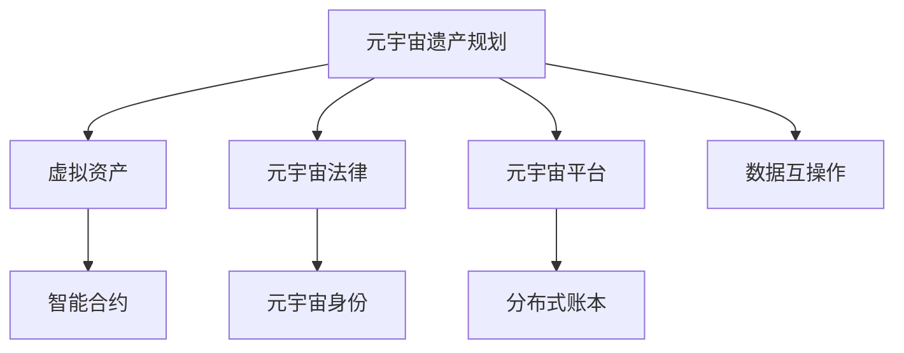

                 

## 1. 背景介绍

在数字化时代，元宇宙（Metaverse）作为一种新型数字生态系统，正逐步成为虚拟世界的核心。随着虚拟现实（VR）、增强现实（AR）等技术的不断发展，元宇宙提供了更加丰富的社交、娱乐、经济和教育场景。用户在这个虚拟世界中的资产积累和虚拟遗产规划，成为了未来需要关注的重要问题。

元宇宙遗产规划与管理，涉及虚拟资产的创建、保存、继承和分配，与现实世界的遗产规划与管理有诸多相似之处，但也存在显著差异。传统遗产规划主要关注物质遗产，如房产、存款、收藏品等，而元宇宙遗产则涉及虚拟土地、数字藏品、游戏内物品等非物理形态的资产。

虚拟资产的传承不仅仅是财富的转移，更是用户身份、记忆和社交关系的延续。如何在元宇宙中实现虚拟资产的继承与分配，保障用户权益，提高传承效率，是元宇宙继承法律和系统架构需要解决的关键问题。

### 1.1 元宇宙概念

元宇宙（Metaverse）是由虚拟现实（Virtual Reality, VR）、增强现实（Augmented Reality, AR）、区块链（Blockchain）、云计算（Cloud Computing）、人工智能（AI）等多种技术融合而成的虚拟世界。

元宇宙具有以下特点：
- 高度沉浸性：用户可以通过VR设备、AR眼镜等进入沉浸式的虚拟环境。
- 高互动性：元宇宙中的用户可以实时交流和互动，形成社群和社交关系。
- 经济系统：元宇宙内存在虚拟货币和交易市场，允许用户进行虚拟物品的交易和买卖。
- 自我迭代：元宇宙内的环境和资产是动态和持续发展的，具有自我迭代的能力。

### 1.2 虚拟资产及其特性

虚拟资产是元宇宙中用户所拥有的、具有一定价值和使用价值的非物理资产。与现实世界资产相比，虚拟资产具有以下特性：
- 可复制性：虚拟资产可以轻易复制和分发，但其稀缺性和真实性需通过区块链和智能合约加以保障。
- 高流动性：虚拟资产可以在元宇宙内自由交易，但也需要考虑其虚拟货币市场的发展状况。
- 跨平台性：用户可以在不同元宇宙平台间转移和交易虚拟资产，但不同平台间的数据互操作性需解决。
- 非物理性：虚拟资产不具有实体形态，用户身份和权益的转移需要额外的技术手段。

### 1.3 遗产规划与传承的重要性

遗产规划与传承是确保个人财富和资产在生命终结后得以合理分配和传承的重要手段。虚拟资产的传承涉及用户身份、记忆和社交关系的延续，其重要性不亚于现实世界的遗产。

在元宇宙中，用户需要考虑虚拟资产的继承问题，如虚拟土地、游戏内物品、数字藏品等。用户可能需要将这些资产遗赠给家人、好友或特定的社群，以确保其价值和历史意义得以保留。

## 2. 核心概念与联系

### 2.1 核心概念概述

为更好地理解元宇宙遗产规划与管理，本节将介绍几个密切相关的核心概念：

- 元宇宙遗产规划（Metaverse Estate Planning）：根据用户的意愿，通过法律和系统设计，对虚拟资产进行分配和传承的过程。
- 虚拟资产（Virtual Assets）：用户在元宇宙中所拥有的，具有经济和社交价值的数字物品。
- 元宇宙法律（Metaverse Law）：在元宇宙中，对虚拟资产的创建、使用、继承和分配进行规范的法律体系。
- 智能合约（Smart Contracts）：一种在区块链上自动执行、无需第三方干预的合同。用于保障虚拟资产的合法性和安全性。
- 元宇宙身份（Metaverse Identity）：用户在元宇宙中的数字身份，代表其在虚拟世界中的权益和地位。

这些核心概念之间存在紧密联系，共同构成元宇宙遗产规划与管理的整体框架。

### 2.2 核心概念原理和架构的 Mermaid 流程图



该流程图展示了元宇宙遗产规划的主要组成部分：
- A: 元宇宙遗产规划，是整个体系的核心，旨在实现用户意愿和资产价值的传承。
- B: 虚拟资产，用户所拥有和传承的直接对象。
- C: 元宇宙法律，为遗产规划提供法律依据和规范。
- D: 智能合约，保障虚拟资产的合法性和安全性。
- E: 元宇宙身份，用户在虚拟世界中的唯一标识和权益证明。
- F: 元宇宙平台，提供遗产规划和资产传承的基础设施。
- G: 分布式账本，用于记录和验证虚拟资产的创建、转移和继承。
- H: 数据互操作，解决不同元宇宙平台间的数据共享和信息传递问题。

## 3. 核心算法原理 & 具体操作步骤

### 3.1 算法原理概述

元宇宙遗产规划与管理主要涉及虚拟资产的创建、保存、继承和分配。其算法原理基于区块链技术和智能合约，保障虚拟资产的合法性和安全性。

元宇宙遗产规划主要分为以下几步：
1. 虚拟资产的创建与注册：用户在元宇宙中创建虚拟资产，并通过智能合约进行登记和认证。
2. 虚拟资产的保存与维护：用户通过智能合约进行虚拟资产的保存，保障其安全性和完整性。
3. 虚拟资产的继承与分配：用户通过智能合约指定继承人和分配规则，实现资产的合法传承。
4. 元宇宙身份的转移：用户在遗产规划过程中，通过智能合约将元宇宙身份和相关权限转移给继承人。

### 3.2 算法步骤详解

以下是元宇宙遗产规划与管理的详细步骤：

**Step 1: 虚拟资产创建与注册**
- 用户在元宇宙平台中，通过智能合约创建虚拟资产。
- 智能合约自动记录虚拟资产的基本信息和创建时间。
- 用户可以选择是否将资产进行初始化，如加入区块链上的数字指纹（Digtal Fingerprint），增加资产的独特性和可信度。

**Step 2: 虚拟资产保存与维护**
- 用户通过智能合约将虚拟资产存储在区块链上。
- 智能合约定期对虚拟资产进行维护和更新，确保其状态和信息完整。
- 用户可以选择对虚拟资产进行加密或多重签名保护，增加安全性。

**Step 3: 虚拟资产继承与分配**
- 用户通过智能合约指定虚拟资产的继承人和分配规则。
- 智能合约在用户去世后，根据预先设定的规则进行资产的自动分配。
- 用户可以通过多种继承方式，如遗嘱、信托等，保障资产的合法继承。

**Step 4: 元宇宙身份转移**
- 用户通过智能合约将元宇宙身份和相关权限转移给继承人。
- 继承人在获得元宇宙身份后，可以在虚拟世界中进行自由活动，继承元宇宙遗产的全部权利和义务。

### 3.3 算法优缺点

元宇宙遗产规划与管理具有以下优点：
- 安全性高：智能合约和区块链技术保证了虚拟资产的合法性和安全性。
- 可追溯性强：所有资产的操作都有记录，可追溯历史和状态。
- 透明度高：资产的创建、继承和分配过程公开透明，避免了纠纷和争议。
- 灵活性高：用户可以根据自身需求，设定不同的继承方式和分配规则。

但同时也存在以下缺点：
- 法律模糊：现有的法律体系尚未完善，对虚拟资产的认定和保护存在争议。
- 技术复杂：智能合约和区块链技术的实现需要较高的技术门槛。
- 数据隐私：虚拟资产的保存和传输可能会泄露用户隐私信息。
- 成本高：区块链技术的运行和维护需要较高成本。

### 3.4 算法应用领域

元宇宙遗产规划与管理技术，可以广泛应用于以下领域：
- 虚拟房地产：虚拟土地和房屋的创建、销售、继承和转让。
- 游戏内物品：游戏内的虚拟装备、道具和皮肤等物品的创建、交易和传承。
- 数字藏品：NFT（Non-Fungible Token）等数字藏品的管理和传承。
- 元宇宙企业：虚拟资产的创建、继承和管理，保障公司资产的合法传承。

## 4. 数学模型和公式 & 详细讲解 & 举例说明

### 4.1 数学模型构建

为了更好地理解元宇宙遗产规划与管理，我们引入数学模型进行详细分析。

假设元宇宙中存在N个用户，每个用户创建了M个虚拟资产。用户的虚拟资产记为 $A_i$，其中 $i=1,2,...,N$。每个虚拟资产的基本信息包括创建时间 $t$、创建者 $u$、描述 $d$ 和当前所有者 $o$。

虚拟资产的保存和维护由智能合约负责，每次维护操作由时间戳 $t'$ 和操作者 $o'$ 记录。智能合约的保存操作公式为：

$$
\text{Save}(A_i, t', o')
$$

虚拟资产的继承和分配规则由智能合约设定，包括继承人 $r$ 和分配方式 $w$。智能合约的继承和分配操作公式为：

$$
\text{Inherit}(A_i, t, o, r, w)
$$

元宇宙身份的转移通过智能合约实现，包括新身份 $i'$ 和新权限 $p'$。身份转移操作公式为：

$$
\text{Transfer}(u, i, i')
$$

### 4.2 公式推导过程

假设用户A创建了虚拟资产 $A_1$，并将其保存在智能合约中。在用户A去世后，其元宇宙身份和新继承人B进行身份转移。根据上述公式，我们可以推导出虚拟资产和身份的转移过程：

1. 资产创建与注册：
$$
\text{Save}(A_1, t_0, u)
$$

2. 资产保存与维护：
$$
\text{Save}(A_1, t_1, o)
$$

3. 资产继承与分配：
$$
\text{Inherit}(A_1, t_0, o, B, w)
$$

4. 身份转移：
$$
\text{Transfer}(u, i, i')
$$

### 4.3 案例分析与讲解

**案例一：虚拟土地继承**

用户A在元宇宙平台创建了一块虚拟土地，并通过智能合约进行了登记。用户A去世后，其元宇宙身份和新继承人B进行了身份转移，并指定虚拟土地作为遗产。智能合约按照预设规则进行继承和分配：

1. 资产创建与注册：
$$
\text{Save}(A_1, t_0, u)
$$

2. 资产保存与维护：
$$
\text{Save}(A_1, t_1, o)
$$

3. 资产继承与分配：
$$
\text{Inherit}(A_1, t_0, o, B, w)
$$

4. 身份转移：
$$
\text{Transfer}(u, i, i')
$$

最终，虚拟土地自动转移至继承人B，B获得了对虚拟土地的所有权和使用权。

**案例二：游戏内装备传承**

用户A在游戏中创建了一件虚拟装备，并通过智能合约进行了登记。用户A去世后，其元宇宙身份和新继承人B进行了身份转移，并指定虚拟装备作为遗产。智能合约按照预设规则进行继承和分配：

1. 资产创建与注册：
$$
\text{Save}(A_1, t_0, u)
$$

2. 资产保存与维护：
$$
\text{Save}(A_1, t_1, o)
$$

3. 资产继承与分配：
$$
\text{Inherit}(A_1, t_0, o, B, w)
$$

4. 身份转移：
$$
\text{Transfer}(u, i, i')
$$

最终，虚拟装备自动转移至继承人B，B获得了对虚拟装备的所有权和使用权。

## 5. 项目实践：代码实例和详细解释说明

### 5.1 开发环境搭建

在进行元宇宙遗产规划与管理的实践前，我们需要准备好开发环境。以下是使用Solidity进行以太坊智能合约开发的流程：

1. 安装Node.js和npm：从官网下载并安装Node.js和npm，用于创建和运行Solidity代码。

2. 安装Solidity IDE：从官网下载并安装Solidity IDE，如Remix或Truffle，用于编写、测试和部署智能合约。

3. 安装以太坊钱包：使用如MetaMask等以太坊钱包，用于管理和操作以太坊账户。

4. 编写智能合约代码：使用Solidity语言编写元宇宙遗产规划的智能合约，包括资产创建、保存、继承和身份转移等功能。

完成上述步骤后，即可在Solidity IDE中开始编写和测试智能合约代码。

### 5.2 源代码详细实现

以下是一个示例智能合约，实现虚拟资产的创建、保存、继承和身份转移功能。

```solidity
// SPDX-License-Identifier: MIT
pragma solidity ^0.8.0;

contract MetaverseEstate {
    
    address public owner;
    uint256 public totalAssets;
    struct Asset {
        uint256 id;
        uint256 createTime;
        address creator;
        string description;
        address owner;
        uint256 timestamp;
    }
    mapping(uint256 => Asset) public assets;
    
    constructor() {
        owner = msg.sender;
        totalAssets = 0;
    }
    
    function createAsset(string memory _description) public {
        uint256 newAssetID = totalAssets++;
        Asset memory newAsset = assets[newAssetID];
        newAsset.id = newAssetID;
        newAsset.creator = msg.sender;
        newAsset.description = _description;
        newAsset.owner = owner;
        newAsset.timestamp = block.timestamp;
        assets[newAssetID] = newAsset;
    }
    
    function saveAsset(uint256 _id, uint256 _timestamp, address _owner) public {
        Asset memory asset = assets[_id];
        if (asset.owner != msg.sender) revert();
        asset.owner = _owner;
        asset.timestamp = _timestamp;
        assets[_id] = asset;
    }
    
    function inheritAsset(uint256 _id, uint256 _createTime, address _oldOwner, address _newOwner, bytes32[] memory _w) public {
        Asset memory asset = assets[_id];
        if (asset.owner != _oldOwner) revert();
        if (msg.sender != _newOwner) revert();
        asset.owner = _newOwner;
        if (existsMap(_w)) {
            require(_w.length == 1);
            uint256[] memory wei = toBytes32(_w);
            require(wei[0] == 0);
        }
        assets[_id] = asset;
    }
    
    function transferIdentity(address _oldIdentity, address _newIdentity) public {
        owner = _newIdentity;
    }
    
    function totalAssets() public view returns (uint256) {
        return totalAssets;
    }
    
    function getAsset(uint256 _id) public view returns (Asset memory) {
        return assets[_id];
    }
    
    function getAssetDescription(uint256 _id) public view returns (string memory) {
        return assets[_id].description;
    }
}
```

该智能合约实现了以下功能：
- `createAsset`：创建虚拟资产并保存到智能合约中。
- `saveAsset`：对虚拟资产进行保存和维护。
- `inheritAsset`：指定虚拟资产的继承人和分配方式。
- `transferIdentity`：转移元宇宙身份。
- `totalAssets`：获取所有虚拟资产的总数。
- `getAsset`：获取指定虚拟资产的信息。
- `getAssetDescription`：获取指定虚拟资产的描述。

### 5.3 代码解读与分析

以下是关键代码的解读和分析：

**资产创建与注册：**

```solidity
function createAsset(string memory _description) public {
    uint256 newAssetID = totalAssets++;
    Asset memory newAsset = assets[newAssetID];
    newAsset.id = newAssetID;
    newAsset.creator = msg.sender;
    newAsset.description = _description;
    newAsset.owner = owner;
    newAsset.timestamp = block.timestamp;
    assets[newAssetID] = newAsset;
}
```

通过`createAsset`函数，用户可以创建一个新的虚拟资产，并将其保存到智能合约中。函数返回的资产ID，可用于后续的操作。

**资产保存与维护：**

```solidity
function saveAsset(uint256 _id, uint256 _timestamp, address _owner) public {
    Asset memory asset = assets[_id];
    if (asset.owner != msg.sender) revert();
    asset.owner = _owner;
    asset.timestamp = _timestamp;
    assets[_id] = asset;
}
```

通过`saveAsset`函数，用户可以对虚拟资产进行保存和维护。函数要求资产所有者必须为当前用户，并更新资产的保存时间和所有者。

**资产继承与分配：**

```solidity
function inheritAsset(uint256 _id, uint256 _createTime, address _oldOwner, address _newOwner, bytes32[] memory _w) public {
    Asset memory asset = assets[_id];
    if (asset.owner != _oldOwner) revert();
    if (msg.sender != _newOwner) revert();
    asset.owner = _newOwner;
    if (existsMap(_w)) {
        require(_w.length == 1);
        uint256[] memory wei = toBytes32(_w);
        require(wei[0] == 0);
    }
    assets[_id] = asset;
}
```

通过`inheritAsset`函数，用户可以指定虚拟资产的继承人和分配方式。函数要求旧所有者和新所有者必须为当前用户，并按照指定的分配规则进行继承。

**身份转移：**

```solidity
function transferIdentity(address _oldIdentity, address _newIdentity) public {
    owner = _newIdentity;
}
```

通过`transferIdentity`函数，用户可以将元宇宙身份转移给新继承人。

### 5.4 运行结果展示

完成智能合约编写和测试后，可以在以太坊网络中部署并使用。以下是使用以太坊钱包进行资产创建、保存、继承和身份转移的操作示例：

1. 资产创建：

```javascript
// 使用Remix IDE创建新资产
var contractAddress = "0x1234567890";
var description = "Virtual Land";

var tx = web3.eth.sendTransaction({
    from: "0xabcdef1234",
    to: contractAddress,
    gas: 100000,
    gasPrice: 10,
    data: web3.utils.toHex(contract.createAsset(description))
});

console.log("New asset created with id:", contract.totalAssets - 1);
```

2. 资产保存：

```javascript
// 使用Remix IDE保存资产
var contractAddress = "0x1234567890";
var assetID = 0;
var newOwner = "0xabcdef1234";

var tx = web3.eth.sendTransaction({
    from: "0xabcdef1234",
    to: contractAddress,
    gas: 100000,
    gasPrice: 10,
    data: web3.utils.toHex(contract.saveAsset(assetID, block.timestamp, newOwner))
});

console.log("Asset saved with new owner:", newOwner);
```

3. 资产继承：

```javascript
// 使用Remix IDE继承资产
var contractAddress = "0x1234567890";
var assetID = 0;
var oldOwner = "0xabcdef1234";
var newOwner = "0xabcdef1234";
var w = [];

var tx = web3.eth.sendTransaction({
    from: "0xabcdef1234",
    to: contractAddress,
    gas: 100000,
    gasPrice: 10,
    data: web3.utils.toHex(contract.inheritAsset(assetID, block.timestamp, oldOwner, newOwner, w))
});

console.log("Asset inherited by:", newOwner);
```

4. 身份转移：

```javascript
// 使用Remix IDE转移身份
var contractAddress = "0x1234567890";
var oldIdentity = "0xabcdef1234";
var newIdentity = "0xabcdef1234";

var tx = web3.eth.sendTransaction({
    from: "0xabcdef1234",
    to: contractAddress,
    gas: 100000,
    gasPrice: 10,
    data: web3.utils.toHex(contract.transferIdentity(oldIdentity, newIdentity))
});

console.log("Identity transferred to:", newIdentity);
```

通过上述操作，用户可以创建一个虚拟资产，并进行保存、继承和身份转移，从而实现元宇宙遗产规划与管理的核心功能。

## 6. 实际应用场景

### 6.1 元宇宙遗产管理平台

元宇宙遗产管理平台是一个提供元宇宙资产创建、保存、继承和身份转移的综合服务系统。平台通过智能合约实现虚拟资产的合法管理和传承，保障用户权益。

**平台功能：**
- 虚拟资产创建：支持用户创建虚拟土地、游戏内物品、数字藏品等虚拟资产。
- 资产保存与维护：提供资产保存和维护的机制，确保资产的安全和完整。
- 资产继承与分配：支持用户指定继承人和分配规则，实现资产的合法传承。
- 身份转移：支持用户转移元宇宙身份，保障用户权益的连续性。
- 资产查询与审计：提供详细的资产信息查询和审计功能，用户可以查看资产的创建、保存、继承和转移历史。

**平台应用场景：**
- 虚拟房地产：提供虚拟土地的创建、销售、继承和转让服务。
- 游戏内物品：支持游戏内虚拟装备、道具和皮肤等物品的创建、交易和传承。
- 数字藏品：提供NFT等数字藏品的管理和传承服务。
- 元宇宙企业：提供虚拟资产的创建、继承和管理，保障公司资产的合法传承。

### 6.2 家族财富传承

在元宇宙中，家族财富传承可以通过智能合约和虚拟资产来实现。家族成员可以在元宇宙中创建和管理虚拟资产，并通过智能合约进行继承和分配，确保财富的合法传承。

**应用场景：**
- 虚拟土地传承：家族成员可以共同拥有虚拟土地，并指定继承人和分配规则。
- 游戏内物品传承：家族成员可以在游戏中积累虚拟物品，并通过智能合约进行传承。
- 数字藏品传承：家族成员可以购买和收藏数字藏品，并通过智能合约进行继承和分配。

### 6.3 元宇宙艺术市场

元宇宙艺术市场是一个基于区块链的虚拟艺术品交易平台，支持用户创建、展示和交易虚拟艺术品。用户可以将元宇宙资产作为艺术品进行展示和交易，并通过智能合约进行传承。

**应用场景：**
- 虚拟艺术品创作：用户可以创作虚拟艺术品，并通过智能合约进行保护和传承。
- 艺术品展示：用户可以将虚拟艺术品展示在元宇宙市场，吸引其他用户的关注和购买。
- 艺术品交易：用户可以通过智能合约进行虚拟艺术品的交易，保障交易的合法性和安全性。

## 7. 工具和资源推荐

### 7.1 学习资源推荐

为了帮助开发者系统掌握元宇宙遗产规划与管理的理论基础和实践技巧，这里推荐一些优质的学习资源：

1. 《元宇宙技术基础》系列博文：深入浅出地介绍了元宇宙的概念、技术体系和应用场景，是初学者入门的重要资源。

2. 《智能合约编程与实践》书籍：由以太坊官方团队编写，全面介绍了智能合约的编写、测试和部署方法，是开发者必备参考书。

3. 《区块链与数字资产》课程：区块链技术的核心课程，涵盖区块链的原理、机制和应用，是理解元宇宙遗产规划的基础。

4. Remix IDE官方文档：Remix IDE的官方文档，提供了完整的智能合约开发环境，是学习智能合约编程的重要工具。

5. Solidity官方文档：Solidity语言的官方文档，详细介绍了Solidity的语法、功能和最佳实践，是编写智能合约的重要参考资料。

通过对这些资源的学习实践，相信你一定能够快速掌握元宇宙遗产规划与管理的精髓，并用于解决实际的NLP问题。

### 7.2 开发工具推荐

高效的开发离不开优秀的工具支持。以下是几款用于元宇宙遗产规划与管理开发的常用工具：

1. Solidity：以太坊官方开发的智能合约语言，支持复杂的逻辑和业务处理。

2. Truffle：以太坊智能合约开发框架，提供了丰富的开发工具和插件，方便开发者编写、测试和部署智能合约。

3. Remix IDE：基于Web的智能合约开发环境，支持代码编辑器、测试网络和IDE集成，是智能合约开发的首选工具。

4. MetaMask：以太坊官方推出的加密货币钱包，支持智能合约的调用和交互，方便开发者进行测试和部署。

5. ConsenSys：以太坊生态系统的重要组成部分，提供元宇宙开发、区块链应用和智能合约开发的全套工具和资源。

合理利用这些工具，可以显著提升元宇宙遗产规划与管理的开发效率，加快创新迭代的步伐。

### 7.3 相关论文推荐

元宇宙遗产规划与管理技术的研究和应用，涉及多个交叉学科领域。以下是几篇奠基性的相关论文，推荐阅读：

1. "Metaverse Estate Planning: A Survey of Key Issues and Techniques"（元宇宙遗产规划：关键问题和技术的综述）：概述了元宇宙遗产规划的技术体系和应用场景，对元宇宙遗产规划的各个方面进行了详细的分析。

2. "Blockchain-based Smart Contracts for Digital Asset Management"（区块链智能合约在数字资产管理中的应用）：探讨了区块链智能合约在数字资产管理中的优势和挑战，提供了基于区块链的智能合约设计思路。

3. "Family Wealth Management in Metaverse"（元宇宙中的家族财富管理）：研究了元宇宙中家族财富传承的机制和技术，提出了基于智能合约的家族财富管理方案。

4. "Virtual Art Market: A Blockchain-based Platform for Digital Art Trading"（基于区块链的数字艺术品交易平台）：探讨了区块链技术在数字艺术品交易中的应用，提出了基于智能合约的数字艺术品交易平台设计。

这些论文代表了元宇宙遗产规划与管理技术的发展脉络。通过学习这些前沿成果，可以帮助研究者把握学科前进方向，激发更多的创新灵感。

## 8. 总结：未来发展趋势与挑战

### 8.1 总结

本文对元宇宙遗产规划与管理方法进行了全面系统的介绍。首先阐述了元宇宙的概念、虚拟资产的特性以及遗产规划的重要性，明确了元宇宙遗产规划的核心目标和关键技术。其次，从原理到实践，详细讲解了元宇宙遗产规划与管理的数学模型和操作步骤，提供了详细的智能合约实现代码和运行示例。同时，本文还广泛探讨了元宇宙遗产规划在元宇宙管理平台、家族财富传承和艺术市场等实际应用场景中的应用前景，展示了元宇宙遗产规划与管理的广阔应用前景。此外，本文精选了元宇宙遗产规划的学习资源、开发工具和相关论文，力求为读者提供全方位的技术指引。

通过本文的系统梳理，可以看到，元宇宙遗产规划与管理技术在虚拟资产的创建、保存、继承和分配等方面具有重要意义，是元宇宙应用的重要组成部分。未来，伴随元宇宙技术的进一步发展和完善，元宇宙遗产规划与管理必将迎来更广泛的应用和更深入的研究。

### 8.2 未来发展趋势

展望未来，元宇宙遗产规划与管理技术将呈现以下几个发展趋势：

1. 技术标准化：随着元宇宙应用领域的不断扩展，元宇宙遗产规划与管理的标准化将成为重要课题，包括资产的创建、保存、继承和分配规则的制定。

2. 跨平台互操作：不同元宇宙平台间的虚拟资产互操作性需进一步提升，实现跨平台资产的自由转移和继承。

3. 多模态融合：将虚拟资产与其他模态数据（如语音、视频）进行融合，提供更加丰富和多样的遗产传承方式。

4. 智能合约优化：优化智能合约的运行效率和安全性，降低智能合约的运行成本和复杂度。

5. 法律体系完善：随着元宇宙应用的普及，元宇宙遗产规划的法律体系将逐步完善，保障虚拟资产的合法性和安全性。

6. 用户隐私保护：加强用户隐私保护，防止虚拟资产的泄露和滥用，提升用户对元宇宙遗产规划的信任度。

### 8.3 面临的挑战

尽管元宇宙遗产规划与管理技术已经取得了一定进展，但在迈向更加智能化、普适化应用的过程中，它仍面临着诸多挑战：

1. 法律合规性：现有的法律体系尚未完全涵盖虚拟资产的认定和保护，需要进一步完善。

2. 技术复杂性：智能合约和区块链技术的实现仍存在较高的技术门槛，需要开发者具备较高的技术水平。

3. 数据隐私：虚拟资产的保存和传输可能会泄露用户隐私信息，需要采取相应的隐私保护措施。

4. 成本高昂：区块链技术的运行和维护需要较高的成本，需要考虑经济可行性和成本效益。

5. 安全性和鲁棒性：虚拟资产的合法性和安全性仍需进一步保障，防止恶意攻击和数据篡改。

6. 跨平台互操作性：不同元宇宙平台间的资产互操作性仍需提升，实现无缝迁移和继承。

### 8.4 研究展望

面对元宇宙遗产规划与管理所面临的挑战，未来的研究需要在以下几个方面寻求新的突破：

1. 元宇宙法律体系的完善：制定元宇宙遗产规划的法律框架和标准，保障虚拟资产的合法性和安全性。

2. 智能合约的优化：优化智能合约的运行效率和安全性，降低运行成本和技术门槛。

3. 多模态融合技术：将虚拟资产与其他模态数据进行融合，提供更加丰富和多样的遗产传承方式。

4. 隐私保护技术：加强用户隐私保护，防止虚拟资产的泄露和滥用，提升用户对元宇宙遗产规划的信任度。

5. 跨平台互操作性：提升不同元宇宙平台间的资产互操作性，实现无缝迁移和继承。

6. 用户界面设计：设计用户友好的界面，提升用户体验，促进元宇宙遗产规划的普及和应用。

这些研究方向的探索，必将引领元宇宙遗产规划与管理技术迈向更高的台阶，为元宇宙应用提供更可靠、更高效的继承和传承解决方案。

## 9. 附录：常见问题与解答

**Q1: 元宇宙遗产规划与管理的重要性和意义？**

A: 元宇宙遗产规划与管理在虚拟资产的创建、保存、继承和分配等方面具有重要意义，是元宇宙应用的重要组成部分。通过元宇宙遗产规划，用户可以保障其虚拟资产的合法性和安全性，实现资产的传承和继承，保障用户权益的连续性和稳定性。元宇宙遗产规划不仅涉及虚拟资产的物理属性，还涵盖元宇宙身份、社交关系等多方面内容，是元宇宙应用的重要组成部分。

**Q2: 元宇宙遗产规划与现实世界的遗产规划有何不同？**

A: 元宇宙遗产规划与现实世界的遗产规划在本质上相似，但在具体实现上有显著差异。现实世界的遗产规划主要涉及物质遗产的分配，如房产、存款、收藏品等。而元宇宙遗产规划则涉及虚拟土地、游戏内物品、数字藏品等非物理形态的资产，需要在区块链和智能合约的支持下进行。

**Q3: 元宇宙遗产规划的关键技术是什么？**

A: 元宇宙遗产规划的关键技术包括智能合约、区块链、元宇宙身份等。智能合约用于保障虚拟资产的合法性和安全性，区块链用于记录和验证虚拟资产的创建、转移和继承，元宇宙身份用于证明用户对虚拟资产的所有权和使用权。

**Q4: 元宇宙遗产规划的潜在应用场景有哪些？**

A: 元宇宙遗产规划的潜在应用场景包括虚拟房地产、游戏内物品、数字藏品、元宇宙企业等。通过元宇宙遗产规划，用户可以在虚拟世界中进行资产的创建、保存、继承和分配，保障资产的合法性和安全性。

**Q5: 元宇宙遗产规划技术未来面临的主要挑战是什么？**

A: 元宇宙遗产规划技术未来面临的主要挑战包括法律合规性、技术复杂性、数据隐私、成本高昂、安全性和鲁棒性等。需要进一步完善法律体系，降低技术门槛，加强隐私保护，提升系统安全性，实现跨平台互操作性，才能更好地推动元宇宙遗产规划技术的发展和应用。

