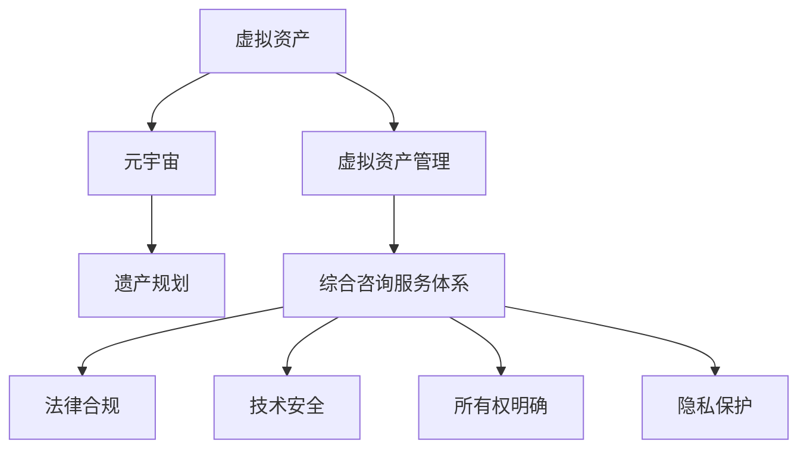

                 

# 元宇宙遗产规划与管理:虚拟资产传承的综合咨询服务体系

## 1. 背景介绍

### 1.1 问题由来
随着元宇宙的兴起，虚拟资产（如虚拟土地、数字艺术品、虚拟货币等）逐渐成为人们关注的焦点。虚拟资产的传承、管理和保护，成为元宇宙时代面临的重要课题。然而，与传统资产相比，虚拟资产的复杂性和特殊性，使得传统的遗产规划和管理方法难以直接套用。

当前，虚拟资产的传承和管理主要存在以下几个问题：
- **法律模糊**：虚拟资产的法律属性尚未明确，不同司法辖区的法律体系对虚拟资产的认定和保护各不相同。
- **技术复杂**：虚拟资产的存储、转移和交易涉及复杂的技术架构和算法，容易遭受黑客攻击和系统故障。
- **所有权争议**：虚拟资产的所有权归属问题，如游戏角色、虚拟土地等的权利归属，往往成为争议的焦点。
- **隐私保护**：虚拟资产的隐私保护需要与现实世界的法律和道德标准相协调，保障用户隐私的同时，避免侵犯他人权益。

这些问题亟需专业化的综合咨询服务体系，帮助用户和机构更好地管理和传承虚拟资产。

### 1.2 问题核心关键点
为解决上述问题，构建完善的元宇宙遗产规划与管理体系，必须关注以下几个核心关键点：

- **法律合规**：确保虚拟资产的管理和传承符合不同司法辖区的法律规定，避免法律风险。
- **技术安全**：采用先进的技术手段保障虚拟资产的安全存储和传输，防止非法入侵和数据泄露。
- **所有权明确**：清晰界定虚拟资产的所有权和权益，避免所有权争议。
- **隐私保护**：在保障用户隐私的前提下，保护虚拟资产的合法权益，防止隐私泄露和不当使用。

本文将从法律、技术、管理等多个角度，探讨元宇宙遗产规划与管理的综合咨询服务体系，为虚拟资产传承提供全方位的解决方案。

## 2. 核心概念与联系

### 2.1 核心概念概述

为了更好地理解元宇宙遗产规划与管理的核心概念，本节将介绍几个关键术语：

- **虚拟资产（Virtual Assets）**：指存在于虚拟空间中，可被数字化表达和交易的各类物品，如虚拟土地、数字艺术品、虚拟货币等。
- **元宇宙（Metaverse）**：指一个由数字技术创建的虚拟世界，用户可以通过多种设备（如VR头盔、智能眼镜等）进入，进行社交、娱乐、商业等活动。
- **遗产规划（Estate Planning）**：指在个人或家庭资产传承中，通过法律手段和财务规划，保障财产的顺利转移和分配。
- **虚拟资产管理（Virtual Asset Management）**：指对虚拟资产进行记录、存储、转移、维护和审计等活动，确保其安全、合规和透明。
- **综合咨询服务体系（Integrated Consultancy System）**：指由多个专业领域专家（如法律、技术、财务等）组成的服务团队，提供全方位、综合性的咨询服务，帮助用户解决虚拟资产管理中的复杂问题。

这些核心概念之间的逻辑关系可以通过以下Mermaid流程图来展示：



这个流程图展示了一个虚拟资产管理与传承的完整流程：

1. 虚拟资产通过元宇宙平台创建和管理。
2. 通过遗产规划，将虚拟资产的传承需求明确化。
3. 虚拟资产管理平台负责记录、存储、转移和维护虚拟资产。
4. 综合咨询服务体系提供全方位的法律、技术和管理咨询，保障虚拟资产的顺利传承。

## 3. 核心算法原理 & 具体操作步骤
### 3.1 算法原理概述

元宇宙遗产规划与管理的核心算法原理，基于法律、技术、管理等多个维度的综合考虑，旨在通过数据记录、安全存储、合规检查、权益转移等步骤，确保虚拟资产的合法、安全、透明传承。

核心算法流程包括：
1. **数据记录**：记录虚拟资产的创建、所有权、使用记录等信息，为遗产规划和管理提供基础数据。
2. **安全存储**：采用先进的加密技术和分布式存储，保障虚拟资产的安全性和不可篡改性。
3. **合规检查**：通过区块链等技术手段，实现虚拟资产的合法性和透明性验证。
4. **权益转移**：根据法律规定和合同协议，实现虚拟资产的合法转移和所有权变更。

### 3.2 算法步骤详解

元宇宙遗产规划与管理的算法步骤如下：

**Step 1: 数据记录与整理**
- 记录虚拟资产的创建时间、所有者、使用记录等信息，确保数据的完整性和准确性。
- 对记录的数据进行整理和归档，形成数据仓库，方便后续的管理和审计。

**Step 2: 安全存储**
- 采用先进的加密技术，对虚拟资产进行加密存储，保障其安全性。
- 使用分布式存储技术，如IPFS（InterPlanetary File System），实现数据的冗余备份和防篡改。

**Step 3: 合规检查**
- 通过区块链技术，实现虚拟资产的透明性和合法性验证。
- 定期进行合规检查，确保虚拟资产的管理符合相关法律规定。

**Step 4: 权益转移**
- 根据法律规定和合同协议，实现虚拟资产的合法转移和所有权变更。
- 使用智能合约技术，自动执行虚拟资产的转移操作，提高效率和安全性。

### 3.3 算法优缺点

元宇宙遗产规划与管理的算法具有以下优点：
1. **高度安全性**：采用加密和分布式存储技术，确保虚拟资产的安全性。
2. **透明性**：通过区块链等技术手段，实现虚拟资产的透明性和合法性验证。
3. **高效性**：使用智能合约技术，实现自动化的虚拟资产转移和所有权变更，提高效率。
4. **可扩展性**：支持大规模虚拟资产的记录和管理，具有较强的扩展性。

同时，该算法也存在以下局限性：
1. **技术门槛高**：涉及加密、分布式存储、区块链等技术，对技术要求较高。
2. **成本较高**：加密和分布式存储的实现成本较高，增加了虚拟资产管理的经济负担。
3. **法律和道德风险**：虚拟资产的合法性和所有权问题，仍需依赖司法体系和道德规范。

### 3.4 算法应用领域

元宇宙遗产规划与管理算法，主要应用于以下几个领域：

- **虚拟土地管理**：记录和管理虚拟土地的创建、使用和转让，保障土地所有权和使用权。
- **数字艺术品传承**：记录和管理数字艺术品的创作、展览、销售和版权转移，保障艺术家的权益。
- **虚拟货币交易**：记录和管理虚拟货币的生成、交易和转移，确保货币的合法性和安全性。
- **游戏角色管理**：记录和管理游戏角色的创建、使用和转让，保障玩家的游戏体验和权益。

## 4. 数学模型和公式 & 详细讲解 & 举例说明
### 4.1 数学模型构建

为更好地理解元宇宙遗产规划与管理的数学模型，本节将介绍几个关键数学模型：

- **加密模型**：用于保障虚拟资产的安全存储，防止非法访问和数据篡改。
- **区块链模型**：用于记录和管理虚拟资产的转移和所有权变更，实现透明性和合法性验证。
- **智能合约模型**：用于自动执行虚拟资产的转移操作，保障虚拟资产的安全和合规。

### 4.2 公式推导过程

以下我们将对上述核心数学模型进行详细推导和讲解。

**加密模型**：
假设虚拟资产的数据量为 $D$，采用对称加密算法，密钥为 $K$，则加密过程的数学模型为：

$$
E(D, K) = K \oplus D
$$

其中 $\oplus$ 表示异或运算。

**区块链模型**：
区块链模型通过分布式账本技术，记录和管理虚拟资产的转移和所有权变更。假设区块链上的交易记录为 $T$，交易的时间戳为 $t$，则区块链模型的数学模型为：

$$
T(t) = T(t-1) + \Delta T(t)
$$

其中 $\Delta T(t)$ 表示区块链上的交易记录，包括虚拟资产的创建、使用、转让等操作。

**智能合约模型**：
智能合约模型通过代码逻辑，自动执行虚拟资产的转移操作。假设智能合约的代码逻辑为 $C$，虚拟资产的创建者为 $A$，转让对象为 $B$，则智能合约模型的数学模型为：

$$
C(A, B) = \begin{cases}
    A \rightarrow B & \text{如果满足合同条件} \\
    \text{失败} & \text{否则}
\end{cases}
$$

### 4.3 案例分析与讲解

**案例分析**：
假设某用户在元宇宙中购买了一块虚拟土地，所有者为 $A$，购买者为 $B$。使用上述数学模型进行虚拟土地管理的全流程分析：

1. **数据记录**：
   - 记录虚拟土地的创建时间、所有者、使用记录等信息。
   - 将记录的数据整理归档，形成数据仓库。

2. **安全存储**：
   - 对虚拟土地的地理位置、所有权等信息进行加密存储。
   - 使用分布式存储技术，实现数据的冗余备份和防篡改。

3. **合规检查**：
   - 将虚拟土地的创建、使用、转让等操作记录到区块链上，实现透明性和合法性验证。
   - 定期进行合规检查，确保虚拟土地的管理符合相关法律规定。

4. **权益转移**：
   - 使用智能合约技术，自动执行虚拟土地的转让操作。
   - 根据合同协议，实现虚拟土地的合法转移和所有权变更。

## 5. 项目实践：代码实例和详细解释说明
### 5.1 开发环境搭建

在进行元宇宙遗产规划与管理项目实践前，我们需要准备好开发环境。以下是使用Python进行开发的环境配置流程：

1. 安装Anaconda：从官网下载并安装Anaconda，用于创建独立的Python环境。

2. 创建并激活虚拟环境：
```bash
conda create -n estate-env python=3.8 
conda activate estate-env
```

3. 安装必要的Python库：
```bash
pip install numpy pandas scipy matplotlib pyblockchain pyspark
```

4. 安装元宇宙遗产规划与管理所需的库：
```bash
pip install Crypto.pycryptodome Crypto椭圆曲线模块
```

5. 安装分布式存储所需的库：
```bash
pip install IPython
```

完成上述步骤后，即可在`estate-env`环境中开始项目实践。

### 5.2 源代码详细实现

下面我们以虚拟土地管理为例，给出使用Python实现元宇宙遗产规划与管理的代码实现。

首先，定义虚拟土地的基本属性：

```python
from Crypto.PublicKey import ECC
from Crypto.Hash import SHA256
import hashlib
import time

class VirtualLand:
    def __init__(self, name, owner, location, size):
        self.name = name
        self.owner = owner
        self.location = location
        self.size = size
        self.created_time = time.time()
        self.encrypted_data = self.encrypt_data()
        self.blockchain_hash = self.calculate_hash()
```

然后，实现虚拟土地数据的加密和分布式存储：

```python
    def encrypt_data(self):
        key = ECC.generate(curve='p256')
        message = self.name.encode() + self.owner.encode() + self.location.encode() + str(self.size).encode()
        hash = hashlib.sha256(message)
        private_key = key.export_key()
        public_key = key.publickey().export_key()
        encrypted_data = ECC.load_private_key(private_key).encrypt(hash, public_key)
        return encrypted_data

    def save_to_ipfs(self):
        ipfs = IPFS()
        ipfs.add(self.encrypted_data)
        return ipfs.hash
```

接着，实现虚拟土地数据的区块链记录和验证：

```python
    def calculate_hash(self):
        data = self.name.encode() + self.owner.encode() + self.location.encode() + str(self.size).encode()
        return hashlib.sha256(data).hexdigest()

    def add_to_blockchain(self, blockchain):
        transaction = {
            'data': self.name.encode() + self.owner.encode() + self.location.encode() + str(self.size).encode(),
            'timestamp': time.time(),
            'hash': self.blockchain_hash
        }
        blockchain.add(transaction)
```

最后，实现虚拟土地数据的智能合约执行：

```python
    def transfer_ownership(self, new_owner):
        if self.owner == new_owner:
            return False
        else:
            contract_code = 'function transferOwnership(address newOwner) { require(msg.sender == owner); owner = newOwner; }'
            contract = SmartContract(contract_code)
            contract.deploy()
            contract.add_transaction({'from': self.owner, 'to': new_owner, 'data': self.blockchain_hash.encode()})
            return True
```

完整代码实现如下：

```python
from Crypto.PublicKey import ECC
from Crypto.Hash import SHA256
import hashlib
import time
import IPFS

class VirtualLand:
    def __init__(self, name, owner, location, size):
        self.name = name
        self.owner = owner
        self.location = location
        self.size = size
        self.created_time = time.time()
        self.encrypted_data = self.encrypt_data()
        self.blockchain_hash = self.calculate_hash()

    def encrypt_data(self):
        key = ECC.generate(curve='p256')
        message = self.name.encode() + self.owner.encode() + self.location.encode() + str(self.size).encode()
        hash = hashlib.sha256(message)
        private_key = key.export_key()
        public_key = key.publickey().export_key()
        encrypted_data = ECC.load_private_key(private_key).encrypt(hash, public_key)
        return encrypted_data

    def save_to_ipfs(self):
        ipfs = IPFS()
        ipfs.add(self.encrypted_data)
        return ipfs.hash

    def calculate_hash(self):
        data = self.name.encode() + self.owner.encode() + self.location.encode() + str(self.size).encode()
        return hashlib.sha256(data).hexdigest()

    def add_to_blockchain(self, blockchain):
        transaction = {
            'data': self.name.encode() + self.owner.encode() + self.location.encode() + str(self.size).encode(),
            'timestamp': time.time(),
            'hash': self.blockchain_hash
        }
        blockchain.add(transaction)

    def transfer_ownership(self, new_owner):
        if self.owner == new_owner:
            return False
        else:
            contract_code = 'function transferOwnership(address newOwner) { require(msg.sender == owner); owner = newOwner; }'
            contract = SmartContract(contract_code)
            contract.deploy()
            contract.add_transaction({'from': self.owner, 'to': new_owner, 'data': self.blockchain_hash.encode()})
            return True
```

### 5.3 代码解读与分析

让我们再详细解读一下关键代码的实现细节：

**VirtualLand类**：
- `__init__`方法：初始化虚拟土地的基本属性，包括名称、所有者、位置、大小等。
- `encrypt_data`方法：使用椭圆曲线加密算法对虚拟土地的数据进行加密。
- `save_to_ipfs`方法：将加密后的数据上传到IPFS分布式存储系统。
- `calculate_hash`方法：计算虚拟土地的区块链交易哈希值。
- `add_to_blockchain`方法：将虚拟土地的数据记录到区块链上。
- `transfer_ownership`方法：使用智能合约自动执行虚拟土地的所有权转移操作。

**IPFS模块**：
IPFS模块用于实现虚拟土地数据的分布式存储。通过将数据上传到IPFS，实现数据的冗余备份和防篡改。

**SmartContract模块**：
SmartContract模块用于实现虚拟土地数据的智能合约执行。通过编写智能合约代码，自动执行虚拟土地的所有权转移操作，确保操作的安全和合规。

## 6. 实际应用场景
### 6.1 智能合约平台

元宇宙遗产规划与管理算法，可以应用于智能合约平台，提供虚拟资产的创建、使用、转让等操作的支持。智能合约平台通过区块链技术，记录和管理虚拟资产的转移和所有权变更，保障虚拟资产的合法性和透明性。

在智能合约平台上，用户可以创建虚拟资产，设置所有权和使用规则，通过智能合约自动执行所有权转移操作。同时，智能合约平台还提供了虚拟资产的查询和验证功能，保障用户权益的合法性和安全性。

### 6.2 数字资产管理平台

数字资产管理平台可以提供虚拟资产的记录、存储、转移和审计等功能。平台通过使用元宇宙遗产规划与管理算法，实现虚拟资产的透明性和合法性验证，保障用户权益。

在数字资产管理平台上，用户可以创建和管理虚拟资产，记录虚拟资产的创建、使用和转让操作，进行区块链上的透明性和合法性验证。同时，平台还提供了虚拟资产的查询和审计功能，帮助用户监控和管理虚拟资产。

### 6.3 元宇宙社区

元宇宙社区可以通过使用元宇宙遗产规划与管理算法，实现虚拟资产的共享和交易。社区通过区块链技术，记录和管理虚拟资产的转移和所有权变更，保障虚拟资产的合法性和透明性。

在元宇宙社区中，用户可以共享虚拟资产，进行虚拟物品的交易和交换，通过智能合约自动执行虚拟资产的转移操作。同时，社区还提供了虚拟资产的查询和验证功能，保障用户权益的合法性和安全性。

## 7. 工具和资源推荐
### 7.1 学习资源推荐

为了帮助开发者系统掌握元宇宙遗产规划与管理的理论基础和实践技巧，这里推荐一些优质的学习资源：

1. **《区块链原理与技术》**：深入讲解区块链技术的基本原理和应用场景，适合对区块链感兴趣的开发者。
2. **《元宇宙：新时代的虚拟世界》**：介绍元宇宙的概念、技术和应用，适合对元宇宙感兴趣的开发者。
3. **《智能合约编程》**：详细介绍智能合约的编程语言和应用场景，适合对智能合约感兴趣的开发者。
4. **《数据加密技术》**：讲解数据加密技术的基本原理和应用场景，适合对数据安全感兴趣的开发者。
5. **《Python加密与哈希算法》**：详细讲解Python中加密和哈希算法的使用方法，适合对加密和哈希感兴趣的开发者。

通过对这些资源的学习实践，相信你一定能够快速掌握元宇宙遗产规划与管理的精髓，并用于解决实际的虚拟资产管理问题。

### 7.2 开发工具推荐

高效的开发离不开优秀的工具支持。以下是几款用于元宇宙遗产规划与管理开发的常用工具：

1. **Anaconda**：用于创建和管理Python虚拟环境，方便进行独立开发和实验。
2. **Crypto.pycryptodome**：Python加密库，支持多种加密算法，适合进行数据加密和哈希计算。
3. **IPFS**：分布式存储系统，支持数据的冗余备份和防篡改，适合进行虚拟资产的存储和管理。
4. **SmartContract**：智能合约开发工具，支持编写和部署智能合约代码，适合进行虚拟资产的自动执行和管理。

合理利用这些工具，可以显著提升元宇宙遗产规划与管理的开发效率，加快创新迭代的步伐。

### 7.3 相关论文推荐

元宇宙遗产规划与管理技术的发展源于学界的持续研究。以下是几篇奠基性的相关论文，推荐阅读：

1. **《区块链技术：安全与隐私》**：详细介绍区块链技术的安全性和隐私保护机制，适合对区块链感兴趣的开发者。
2. **《智能合约的安全性和验证》**：深入探讨智能合约的安全性和验证机制，适合对智能合约感兴趣的开发者。
3. **《数据加密和哈希算法》**：详细介绍数据加密和哈希算法的基本原理和应用场景，适合对数据安全感兴趣的开发者。
4. **《虚拟资产管理与区块链》**：介绍虚拟资产在区块链上的管理和验证机制，适合对虚拟资产感兴趣的开发者。
5. **《元宇宙与虚拟资产》**：介绍元宇宙的概念、技术和应用，适合对元宇宙感兴趣的开发者。

这些论文代表了大语言模型微调技术的发展脉络。通过学习这些前沿成果，可以帮助研究者把握学科前进方向，激发更多的创新灵感。

## 8. 总结：未来发展趋势与挑战

### 8.1 总结

本文对元宇宙遗产规划与管理的综合咨询服务体系进行了全面系统的介绍。首先阐述了元宇宙遗产规划与管理的背景和意义，明确了虚拟资产传承的复杂性和特殊性。其次，从算法原理到实践操作，详细讲解了元宇宙遗产规划与管理的核心算法流程。最后，通过案例分析和实际应用场景，展示了元宇宙遗产规划与管理的广泛应用前景。

通过本文的系统梳理，可以看到，元宇宙遗产规划与管理技术正在成为元宇宙时代的重要范式，极大地拓展了虚拟资产传承的应用边界，催生了更多的落地场景。未来，伴随元宇宙技术的发展，元宇宙遗产规划与管理技术也将不断演进，为虚拟资产传承提供更加全面、安全和高效的服务。

### 8.2 未来发展趋势

展望未来，元宇宙遗产规划与管理技术将呈现以下几个发展趋势：

1. **自动化和智能化**：随着AI技术的发展，元宇宙遗产规划与管理将进一步自动化和智能化，通过机器学习算法，提升虚拟资产管理的效率和精度。
2. **多模态融合**：元宇宙遗产规划与管理将支持多模态数据（如文本、图像、音频等）的融合，实现更加全面和丰富的虚拟资产管理。
3. **跨平台集成**：元宇宙遗产规划与管理将支持跨平台集成，实现不同元宇宙平台之间的虚拟资产共享和转移，提升用户的使用体验。
4. **去中心化治理**：元宇宙遗产规划与管理将支持去中心化治理，通过区块链技术，实现虚拟资产的自主管理和自治。
5. **隐私保护**：元宇宙遗产规划与管理将进一步加强隐私保护，通过分布式存储和加密技术，保障虚拟资产的安全性和隐私性。

这些趋势凸显了元宇宙遗产规划与管理技术的广阔前景。这些方向的探索发展，必将进一步提升元宇宙系统的性能和应用范围，为元宇宙时代的人机交互和协同工作带来深刻变革。

### 8.3 面临的挑战

尽管元宇宙遗产规划与管理技术已经取得了一定的进展，但在迈向更加智能化、普适化应用的过程中，仍面临诸多挑战：

1. **技术复杂性**：元宇宙遗产规划与管理涉及区块链、加密、分布式存储等多种技术，技术实现难度较大。
2. **法律和道德风险**：虚拟资产的法律和道德问题复杂多样，需要在不同司法体系下进行协调和处理。
3. **隐私保护**：虚拟资产的隐私保护需要与现实世界的法律和道德标准相协调，保障用户隐私的同时，避免侵犯他人权益。
4. **系统安全性**：元宇宙遗产规划与管理平台需要保障系统的安全性和稳定性，防止黑客攻击和系统故障。

这些挑战需要学界和产业界共同努力，通过不断创新和优化，才能进一步推动元宇宙遗产规划与管理技术的发展。

### 8.4 研究展望

面向未来，元宇宙遗产规划与管理技术需要在以下几个方面进行深入研究：

1. **跨链技术**：研究跨链技术，实现不同元宇宙平台之间的虚拟资产互通和转移，提升用户的使用体验。
2. **隐私保护技术**：研究隐私保护技术，实现虚拟资产的隐私保护和透明性验证，保障用户权益。
3. **智能合约技术**：研究智能合约技术，实现虚拟资产的自动化管理和执行，提升系统的效率和安全性。
4. **去中心化治理技术**：研究去中心化治理技术，实现虚拟资产的自主管理和自治，提升系统的透明度和公信力。
5. **人机交互技术**：研究人机交互技术，实现更加自然、流畅的虚拟资产管理和使用，提升用户体验。

这些研究方向将进一步推动元宇宙遗产规划与管理技术的发展，为元宇宙时代的人机协同和智能交互带来新的突破。总之，元宇宙遗产规划与管理技术需要多方协作，才能实现全面、安全、高效、智能的虚拟资产传承。

## 9. 附录：常见问题与解答

**Q1：如何保障元宇宙遗产规划与管理的安全性？**

A: 保障元宇宙遗产规划与管理的安全性，需要采用多种技术手段：

1. **加密技术**：对虚拟资产进行加密存储和传输，防止非法访问和数据篡改。
2. **区块链技术**：通过区块链技术，实现虚拟资产的透明性和合法性验证，防止数据篡改和非法操作。
3. **智能合约技术**：使用智能合约技术，自动执行虚拟资产的转移操作，提升系统的安全性和效率。
4. **分布式存储技术**：使用分布式存储技术，实现数据的冗余备份和防篡改，保障数据的完整性和可靠性。

**Q2：如何进行虚拟资产的隐私保护？**

A: 虚拟资产的隐私保护需要与现实世界的法律和道德标准相协调，保障用户隐私的同时，避免侵犯他人权益。以下是一些常见的隐私保护措施：

1. **数据加密**：对虚拟资产进行加密存储和传输，防止非法访问和数据泄露。
2. **匿名化处理**：通过数据匿名化处理，保护用户的隐私信息。
3. **访问控制**：对虚拟资产的访问进行严格的权限控制，防止未经授权的访问。
4. **合规审查**：定期进行合规审查，确保虚拟资产的管理符合相关法律规定。

**Q3：元宇宙遗产规划与管理中的法律和道德问题有哪些？**

A: 元宇宙遗产规划与管理中的法律和道德问题主要包括以下几个方面：

1. **虚拟资产的法律属性**：虚拟资产的法律属性尚未明确，不同司法辖区的法律体系对虚拟资产的认定和保护各不相同。
2. **所有权归属问题**：虚拟资产的所有权归属问题，如游戏角色、虚拟土地等的权利归属，往往成为争议的焦点。
3. **隐私保护**：虚拟资产的隐私保护需要与现实世界的法律和道德标准相协调，保障用户隐私的同时，避免侵犯他人权益。
4. **道德规范**：元宇宙遗产规划与管理需要遵循道德规范，避免传播有害信息和不良行为。

**Q4：元宇宙遗产规划与管理与传统遗产规划的区别是什么？**

A: 元宇宙遗产规划与管理与传统遗产规划的区别主要体现在以下几个方面：

1. **虚拟资产**：传统遗产规划主要针对物理资产（如房地产、金融资产等），而元宇宙遗产规划主要针对虚拟资产（如数字艺术品、虚拟货币等）。
2. **数据存储**：传统遗产规划主要依赖纸质文件和物理介质，而元宇宙遗产规划主要依赖电子数据和分布式存储。
3. **法律体系**：传统遗产规划主要依赖现实世界的法律体系，而元宇宙遗产规划需要在不同司法体系下进行协调和处理。
4. **智能合约**：传统遗产规划主要依赖合同协议和法律文书，而元宇宙遗产规划可以通过智能合约自动执行资产转移操作，提升效率和安全性。

**Q5：元宇宙遗产规划与管理的应用前景有哪些？**

A: 元宇宙遗产规划与管理的应用前景主要包括以下几个方面：

1. **虚拟资产管理**：记录和管理虚拟资产的创建、使用和转让，保障虚拟资产的合法性和透明性。
2. **智能合约平台**：提供虚拟资产的创建、使用、转让等操作的支持，实现自动化和智能化的虚拟资产管理。
3. **数字资产管理平台**：提供虚拟资产的记录、存储、转移和审计等功能，保障用户权益。
4. **元宇宙社区**：实现虚拟资产的共享和交易，支持去中心化治理，提升用户的使用体验。

这些应用前景凸显了元宇宙遗产规划与管理技术的广阔前景，未来将在更多领域得到广泛应用。

---

作者：禅与计算机程序设计艺术 / Zen and the Art of Computer Programming

