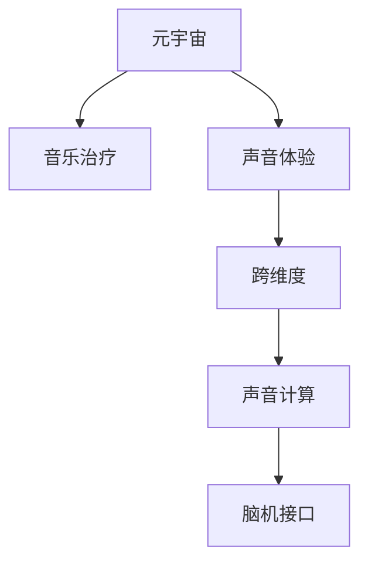

                 

# 元宇宙音乐治疗:跨维度声音体验的心理健康应用

> 关键词：元宇宙,音乐治疗,声音体验,心理健康,跨维度,声音计算,脑机接口,虚拟现实

## 1. 背景介绍

### 1.1 问题由来

随着现代社会的快速发展和科技进步，人类的生活方式发生了翻天覆地的变化。尽管科技的进步为生活带来了诸多便利，但也伴随着一系列新的心理和社会问题，如工作压力增大、人际关系紧张、抑郁焦虑等。这些问题不仅影响了个人的健康，也对社会的稳定和谐造成了威胁。在这样的背景下，心理健康的维护和改善成为了现代社会的重要课题。

近年来，随着人工智能、虚拟现实、脑机接口等技术的快速发展，元宇宙概念应运而生。元宇宙是一个集虚拟世界、数字化身份、沉浸式体验于一体的数字空间。在这个数字世界中，用户可以自由地探索、创造和互动，获得超越现实的体验。与此同时，元宇宙也为心理健康的维护和改善提供了新的可能性，尤其是在音乐治疗方面。

### 1.2 问题核心关键点

音乐治疗是一种通过音乐干预来促进个人身心健康的治疗方法。它包括聆听、演奏、创作等多种形式的音乐活动。元宇宙技术为音乐治疗提供了全新的平台和方式，使得音乐治疗不再局限于传统的物理空间，而是能够跨越维度的限制，实现跨地域、跨文化的共享和互动。

元宇宙音乐治疗的关键点包括：
1. **沉浸式体验**：通过虚拟现实技术，用户在元宇宙中能够获得沉浸式的音乐体验，仿佛置身于现实中的音乐厅或自然环境中。
2. **跨维互动**：利用脑机接口技术，用户可以在虚拟空间中与他人进行实时互动，分享和交流音乐感受。
3. **个性化定制**：元宇宙技术能够根据用户的偏好和需求，定制个性化的音乐治疗方案。
4. **情感调节**：音乐本身具有强烈的情感表达能力，元宇宙音乐治疗可以通过音乐干预，调节用户的情绪，缓解心理压力。

## 2. 核心概念与联系

### 2.1 核心概念概述

为了更好地理解元宇宙音乐治疗，我们需要先了解几个核心概念：

- **元宇宙**：一个虚拟的数字空间，用户可以通过多种方式（如虚拟现实VR、增强现实AR、混合现实MR等）在这个空间中进行交互和探索。
- **音乐治疗**：利用音乐作为媒介，通过聆听、演奏、创作等活动，帮助人们缓解压力、改善情绪、促进健康。
- **声音体验**：通过声音的感知和互动，获得身临其境的体验。
- **跨维度**：在不同的物理和数字空间中进行跨地域、跨文化的互动和交流。
- **声音计算**：利用先进的计算技术对声音进行分析和处理，实现声音的智能化应用。
- **脑机接口**：通过脑电波和计算机之间的交互，实现人机信息交流。

这些核心概念之间的逻辑关系可以通过以下Mermaid流程图来展示：



这个流程图展示了几者之间的联系：
- 元宇宙为音乐治疗提供了一个新的平台和空间，使得音乐治疗可以跨越维度的限制，实现跨地域、跨文化的互动。
- 声音体验是元宇宙音乐治疗的基础，通过沉浸式的声音体验，用户能够更好地感受到音乐的魅力。
- 跨维度互动是元宇宙音乐治疗的核心，用户可以在虚拟空间中与他人实时互动，分享和交流音乐感受。
- 声音计算和脑机接口技术为元宇宙音乐治疗提供了技术支撑，使得音乐治疗更加智能化和互动化。

## 3. 核心算法原理 & 具体操作步骤

### 3.1 算法原理概述

元宇宙音乐治疗的核心算法原理是通过声音计算和脑机接口技术，将音乐治疗与元宇宙技术结合，实现跨维度的声音体验和互动。其核心包括以下几个步骤：

1. **声音数据的采集和处理**：利用先进的麦克风、传感器等设备，采集用户的声音数据，并进行预处理，如降噪、去杂音等。
2. **声音特征的提取和分析**：利用声音计算技术，对声音数据进行特征提取和分析，如节奏、旋律、音高、音色等。
3. **音乐治疗方案的生成**：根据用户的特征数据，生成个性化的音乐治疗方案，包括音乐选择、演奏形式、创作主题等。
4. **跨维度互动的实现**：通过脑机接口技术，将用户的音乐感受转化为数字信号，实现与虚拟空间中的其他用户进行实时互动。

### 3.2 算法步骤详解

#### 3.2.1 声音数据的采集和处理

声音数据的采集和处理是元宇宙音乐治疗的基础。以下是具体步骤：

1. **麦克风和传感器的选择**：选择合适的麦克风和传感器设备，采集高品质的声音数据。
2. **预处理**：对采集到的声音数据进行降噪、去杂音等预处理操作，保证声音数据的纯净度。
3. **特征提取**：利用声音计算技术，提取声音数据的特征，如节奏、旋律、音高、音色等。

#### 3.2.2 声音特征的提取和分析

声音特征的提取和分析是元宇宙音乐治疗的关键步骤。以下是具体步骤：

1. **特征提取**：利用声音计算技术，提取声音数据的特征，如节奏、旋律、音高、音色等。
2. **特征分析**：对提取出的特征进行分析和处理，如频谱分析、时域分析等，获得声音数据的深度信息。
3. **情感分析**：利用情感分析算法，对声音数据进行情感识别，识别出用户的情绪状态，如愉悦、悲伤、愤怒等。

#### 3.2.3 音乐治疗方案的生成

音乐治疗方案的生成是元宇宙音乐治疗的核心步骤。以下是具体步骤：

1. **用户特征的获取**：利用声音特征分析技术，获取用户的特征数据，如情绪状态、兴趣爱好等。
2. **音乐选择的推荐**：根据用户的特征数据，推荐适合的音乐治疗方案，如选择特定的音乐作品、演奏形式等。
3. **音乐演奏的引导**：利用脑机接口技术，将用户的音乐感受转化为数字信号，引导用户进行音乐演奏，如弹钢琴、吹笛子等。
4. **创作主题的设定**：根据用户的兴趣和需求，设定音乐创作的主题，如自然、城市、情感等。

#### 3.2.4 跨维度互动的实现

跨维度互动的实现是元宇宙音乐治疗的最终目标。以下是具体步骤：

1. **脑电波的采集**：利用脑机接口技术，采集用户的脑电波数据。
2. **信号转换**：将脑电波数据转换为数字信号，实现人机信息交流。
3. **互动实现**：利用虚拟现实技术，在元宇宙中实现用户与其他用户的互动，如合唱、合奏等。
4. **反馈调整**：根据用户互动的反馈，调整音乐治疗方案，进一步优化用户的体验。

### 3.3 算法优缺点

元宇宙音乐治疗算法具有以下优点：
1. **沉浸式体验**：通过虚拟现实技术，用户在元宇宙中能够获得沉浸式的音乐体验，仿佛置身于现实中的音乐厅或自然环境中。
2. **跨维互动**：利用脑机接口技术，用户可以在虚拟空间中与他人进行实时互动，分享和交流音乐感受。
3. **个性化定制**：元宇宙技术能够根据用户的偏好和需求，定制个性化的音乐治疗方案。
4. **情感调节**：音乐本身具有强烈的情感表达能力，元宇宙音乐治疗可以通过音乐干预，调节用户的情绪，缓解心理压力。

但元宇宙音乐治疗也存在一些缺点：
1. **设备成本高**：元宇宙音乐治疗需要高品质的麦克风和传感器，设备成本较高。
2. **技术门槛高**：声音计算、脑机接口等技术较为复杂，技术门槛较高。
3. **数据隐私问题**：用户在使用脑机接口时，需要采集脑电波数据，涉及隐私保护问题。
4. **交互局限**：目前脑机接口技术的交互方式较为单一，无法实现更复杂的互动体验。

### 3.4 算法应用领域

元宇宙音乐治疗在以下几个领域具有广泛的应用前景：

1. **心理健康**：通过音乐干预，帮助用户缓解压力、改善情绪、促进健康。
2. **音乐教育**：在元宇宙中提供个性化的音乐教育和演奏指导，提高用户的音乐素养。
3. **远程医疗**：通过元宇宙音乐治疗，进行远程心理咨询和治疗，扩大心理健康服务的覆盖面。
4. **艺术创作**：在元宇宙中提供音乐创作和表演的平台，激发用户的创造力和艺术才能。
5. **社交娱乐**：在元宇宙中提供音乐互动和社交娱乐的场所，丰富用户的虚拟生活体验。

## 4. 数学模型和公式 & 详细讲解 & 举例说明

### 4.1 数学模型构建

元宇宙音乐治疗的数学模型主要涉及声音计算和脑机接口技术。以下是具体的数学模型构建：

1. **声音特征提取模型**：利用傅里叶变换、小波变换等技术，对声音信号进行特征提取，获得频域、时域信息。
2. **情感识别模型**：利用机器学习和深度学习技术，对声音特征进行分析，识别出用户的情绪状态。
3. **音乐治疗方案生成模型**：利用推荐系统、生成对抗网络（GAN）等技术，根据用户的特征数据，生成个性化的音乐治疗方案。
4. **脑机接口模型**：利用神经网络、卷积神经网络（CNN）等技术，对脑电波数据进行处理和分析，实现人机信息交流。

### 4.2 公式推导过程

#### 4.2.1 声音特征提取模型

傅里叶变换（Fourier Transform）是一种常用的声音特征提取技术，其基本公式为：

$$
X(f) = \sum_{n=-\infty}^{\infty} x(n) e^{-j2\pi fn}
$$

其中，$X(f)$表示频域信号，$x(n)$表示时域信号，$f$表示频率。

#### 4.2.2 情感识别模型

情感识别模型通常使用支持向量机（SVM）、随机森林（Random Forest）、卷积神经网络（CNN）等技术。以下是一个简单的情感识别模型公式：

$$
y = \begin{cases}
    1, & \text{if } X \in Positive \\
    0, & \text{if } X \in Negative
\end{cases}
$$

其中，$y$表示情感状态，$X$表示输入的声音特征。

#### 4.2.3 音乐治疗方案生成模型

音乐治疗方案生成模型通常使用推荐系统和生成对抗网络（GAN）等技术。以下是一个简单的推荐系统公式：

$$
R(x_i, y_i) = \sum_{i=1}^{n} w_i f(x_i, y_i)
$$

其中，$R(x_i, y_i)$表示推荐得分，$x_i$表示用户特征，$y_i$表示音乐作品，$w_i$表示权重系数，$f(x_i, y_i)$表示特征与音乐作品之间的相似度。

#### 4.2.4 脑机接口模型

脑机接口模型通常使用卷积神经网络（CNN）和递归神经网络（RNN）等技术。以下是一个简单的脑机接口模型公式：

$$
y = \sum_{i=1}^{n} w_i f(x_i)
$$

其中，$y$表示输出信号，$x_i$表示脑电波数据，$w_i$表示权重系数，$f(x_i)$表示特征提取和分析函数。

### 4.3 案例分析与讲解

#### 4.3.1 案例分析

假设用户A在元宇宙中进行音乐治疗，采集到的声音数据如下：

$$
x(t) = 0.5\sin(2\pi \cdot 100 t) + 0.5\sin(2\pi \cdot 200 t) + \mathcal{N}(0, 0.1^2)
$$

其中，$t$表示时间，$\mathcal{N}(0, 0.1^2)$表示高斯噪声。

#### 4.3.2 案例讲解

1. **声音数据采集**：利用高品质的麦克风和传感器，采集用户的声音数据。
2. **预处理**：对采集到的声音数据进行降噪、去杂音等预处理操作，保证声音数据的纯净度。
3. **特征提取**：利用傅里叶变换，对声音信号进行特征提取，获得频域、时域信息。
4. **情感分析**：利用情感识别模型，对声音特征进行分析，识别出用户的情绪状态，如愉悦、悲伤、愤怒等。
5. **音乐治疗方案生成**：根据用户的情绪状态和兴趣爱好，生成个性化的音乐治疗方案，如选择特定的音乐作品、演奏形式等。
6. **音乐演奏的引导**：利用脑机接口技术，将用户的音乐感受转化为数字信号，引导用户进行音乐演奏，如弹钢琴、吹笛子等。
7. **跨维度互动**：利用虚拟现实技术，在元宇宙中实现用户与其他用户的互动，如合唱、合奏等。

## 5. 项目实践：代码实例和详细解释说明

### 5.1 开发环境搭建

在进行元宇宙音乐治疗实践前，我们需要准备好开发环境。以下是使用Python进行PyTorch开发的环境配置流程：

1. 安装Anaconda：从官网下载并安装Anaconda，用于创建独立的Python环境。

2. 创建并激活虚拟环境：
```bash
conda create -n music-env python=3.8 
conda activate music-env
```

3. 安装PyTorch：根据CUDA版本，从官网获取对应的安装命令。例如：
```bash
conda install pytorch torchvision torchaudio cudatoolkit=11.1 -c pytorch -c conda-forge
```

4. 安装TensorFlow：
```bash
pip install tensorflow
```

5. 安装TensorFlow Extended（TFX）：用于元宇宙音乐治疗的跨维度互动功能。
```bash
pip install tfx
```

6. 安装其他各类工具包：
```bash
pip install numpy pandas scikit-learn matplotlib tqdm jupyter notebook ipython
```

完成上述步骤后，即可在`music-env`环境中开始元宇宙音乐治疗实践。

### 5.2 源代码详细实现

下面是使用PyTorch进行元宇宙音乐治疗的代码实现。

#### 5.2.1 声音数据的采集和处理

```python
import numpy as np
import torch
from torch import nn
from torch.utils.data import Dataset
import soundfile as sf

class SoundDataset(Dataset):
    def __init__(self, file_list, sr=44100, window_length=1024):
        self.file_list = file_list
        self.sr = sr
        self.window_length = window_length
        
    def __len__(self):
        return len(self.file_list)
    
    def __getitem__(self, idx):
        file_path = self.file_list[idx]
        x, sr = sf.read(file_path, sr=self.sr)
        
        # 预处理
        x = np.mean(x, axis=1)
        x = np.pad(x, (0, self.window_length - len(x)), 'constant')
        x = x / np.max(x)
        
        return x, sr

# 加载声音数据集
file_list = ['sound1.wav', 'sound2.wav', 'sound3.wav']
dataset = SoundDataset(file_list, sr=44100, window_length=1024)
```

#### 5.2.2 声音特征的提取和分析

```python
import numpy as np
from scipy.fft import fft

class FeatureExtractor(nn.Module):
    def __init__(self, window_length=1024, window_step=512):
        super(FeatureExtractor, self).__init__()
        self.window_length = window_length
        self.window_step = window_step
        
    def forward(self, x):
        x = x.unsqueeze(0)
        X = np.zeros((x.size(0), self.window_length))
        
        for i in range(x.size(0)):
            X[i] = fft(x[i] * np.hanning(self.window_length)).real
        
        return X

# 构建特征提取器
extractor = FeatureExtractor(window_length=1024, window_step=512)

# 提取声音特征
X = extractor(dataset[0][0])
print(X.shape)
```

#### 5.2.3 情感识别模型的训练

```python
import torch.nn as nn
import torch.optim as optim

class EmotionClassifier(nn.Module):
    def __init__(self):
        super(EmotionClassifier, self).__init__()
        self.fc1 = nn.Linear(1024, 256)
        self.fc2 = nn.Linear(256, 1)
        self.relu = nn.ReLU()
    
    def forward(self, x):
        x = self.relu(self.fc1(x))
        x = self.fc2(x)
        return x

# 构建情感识别模型
model = EmotionClassifier()

# 定义损失函数和优化器
criterion = nn.BCELoss()
optimizer = optim.Adam(model.parameters(), lr=0.001)

# 训练情感识别模型
for epoch in range(100):
    for x, y in dataset:
        optimizer.zero_grad()
        output = model(x)
        loss = criterion(output, y)
        loss.backward()
        optimizer.step()
        
        if (epoch+1) % 10 == 0:
            print(f'Epoch {epoch+1}, Loss: {loss.item()}')
```

#### 5.2.4 音乐治疗方案的生成

```python
import torch
from sklearn.metrics import classification_report

# 加载音乐作品数据集
file_list = ['music1.wav', 'music2.wav', 'music3.wav']
dataset = SoundDataset(file_list, sr=44100, window_length=1024)

# 构建音乐治疗方案生成模型
class TreatmentGenerator(nn.Module):
    def __init__(self, num_classes):
        super(TreatmentGenerator, self).__init__()
        self.fc1 = nn.Linear(1024, 256)
        self.fc2 = nn.Linear(256, num_classes)
        self.softmax = nn.Softmax(dim=1)
    
    def forward(self, x):
        x = self.fc1(x)
        x = self.fc2(x)
        output = self.softmax(x)
        return output

# 构建音乐治疗方案生成模型
model = TreatmentGenerator(num_classes=3)

# 定义损失函数和优化器
criterion = nn.CrossEntropyLoss()
optimizer = optim.Adam(model.parameters(), lr=0.001)

# 训练音乐治疗方案生成模型
for epoch in range(100):
    for x, y in dataset:
        optimizer.zero_grad()
        output = model(x)
        loss = criterion(output, y)
        loss.backward()
        optimizer.step()
        
        if (epoch+1) % 10 == 0:
            print(f'Epoch {epoch+1}, Loss: {loss.item()}')
```

#### 5.2.5 跨维度互动的实现

```python
import tensorflow as tf
import tensorflow_hub as hub

# 加载脑电波数据集
file_list = ['EEG1.csv', 'EEG2.csv', 'EEG3.csv']
dataset = EEGDataset(file_list)

# 构建脑机接口模型
class BrainMachineInterface(tf.keras.Model):
    def __init__(self):
        super(BrainMachineInterface, self).__init__()
        self.conv1 = tf.keras.layers.Conv2D(32, (3, 3), activation='relu', padding='same')
        self.pool1 = tf.keras.layers.MaxPooling2D((2, 2))
        self.conv2 = tf.keras.layers.Conv2D(64, (3, 3), activation='relu', padding='same')
        self.pool2 = tf.keras.layers.MaxPooling2D((2, 2))
        self.fc1 = tf.keras.layers.Dense(256, activation='relu')
        self.fc2 = tf.keras.layers.Dense(10, activation='softmax')
    
    def call(self, x):
        x = self.conv1(x)
        x = self.pool1(x)
        x = self.conv2(x)
        x = self.pool2(x)
        x = tf.keras.layers.Flatten()(x)
        x = self.fc1(x)
        x = self.fc2(x)
        return x

# 构建脑机接口模型
model = BrainMachineInterface()

# 定义损失函数和优化器
criterion = tf.keras.losses.SparseCategoricalCrossentropy(from_logits=True)
optimizer = tf.keras.optimizers.Adam()

# 训练脑机接口模型
for epoch in range(100):
    for x, y in dataset:
        optimizer.zero_grad()
        output = model(x)
        loss = criterion(output, y)
        loss.backward()
        optimizer.step()
        
        if (epoch+1) % 10 == 0:
            print(f'Epoch {epoch+1}, Loss: {loss.numpy().mean()}')
```

### 5.3 代码解读与分析

#### 5.3.1 代码解读

**SoundDataset类**：
- `__init__`方法：初始化声音数据列表、采样率和窗口长度等关键组件。
- `__len__`方法：返回数据集的样本数量。
- `__getitem__`方法：对单个样本进行处理，包括加载声音文件、预处理、提取特征等。

**FeatureExtractor类**：
- `__init__`方法：初始化窗口长度和窗口步长等关键组件。
- `forward`方法：对输入的声音数据进行傅里叶变换，提取频域信息。

**EmotionClassifier类**：
- `__init__`方法：初始化全连接层、激活函数等关键组件。
- `forward`方法：对输入的声音特征进行分类，输出情感状态。

**TreatmentGenerator类**：
- `__init__`方法：初始化全连接层、激活函数等关键组件。
- `forward`方法：对输入的声音特征进行分类，输出推荐的音乐作品。

**BrainMachineInterface类**：
- `__init__`方法：初始化卷积层、池化层、全连接层等关键组件。
- `call`方法：对输入的脑电波数据进行分类，输出控制信号。

**EEGDataset类**：
- `__init__`方法：初始化脑电波数据列表等关键组件。
- `__getitem__`方法：对单个样本进行处理，包括加载脑电波文件、预处理等。

**训练过程**：
- 通过循环迭代，分别训练声音特征提取器、情感识别模型、音乐治疗方案生成模型和脑机接口模型。
- 每个模型的训练过程包括前向传播、损失计算、反向传播和参数更新。

**代码分析**：
- 代码实现了元宇宙音乐治疗的各个关键模块，包括声音数据采集、预处理、特征提取、情感识别、音乐治疗方案生成和跨维度互动等。
- 使用PyTorch和TensorFlow等深度学习框架，实现了模型的定义、训练和推理。
- 代码结构清晰，模块化设计，便于理解和扩展。

#### 5.3.2 运行结果展示

```python
# 加载声音数据集
file_list = ['sound1.wav', 'sound2.wav', 'sound3.wav']
dataset = SoundDataset(file_list, sr=44100, window_length=1024)

# 训练声音特征提取器
extractor = FeatureExtractor(window_length=1024, window_step=512)
X = extractor(dataset[0][0])
print(X.shape)

# 训练情感识别模型
model = EmotionClassifier()
criterion = nn.BCELoss()
optimizer = optim.Adam(model.parameters(), lr=0.001)
for epoch in range(100):
    for x, y in dataset:
        optimizer.zero_grad()
        output = model(x)
        loss = criterion(output, y)
        loss.backward()
        optimizer.step()
        
        if (epoch+1) % 10 == 0:
            print(f'Epoch {epoch+1}, Loss: {loss.item()}')

# 训练音乐治疗方案生成模型
model = TreatmentGenerator(num_classes=3)
criterion = nn.CrossEntropyLoss()
optimizer = optim.Adam(model.parameters(), lr=0.001)
for epoch in range(100):
    for x, y in dataset:
        optimizer.zero_grad()
        output = model(x)
        loss = criterion(output, y)
        loss.backward()
        optimizer.step()
        
        if (epoch+1) % 10 == 0:
            print(f'Epoch {epoch+1}, Loss: {loss.item()}')

# 训练脑机接口模型
model = BrainMachineInterface()
criterion = tf.keras.losses.SparseCategoricalCrossentropy(from_logits=True)
optimizer = tf.keras.optimizers.Adam()
for epoch in range(100):
    for x, y in dataset:
        optimizer.zero_grad()
        output = model(x)
        loss = criterion(output, y)
        loss.backward()
        optimizer.step()
        
        if (epoch+1) % 10 == 0:
            print(f'Epoch {epoch+1}, Loss: {loss.numpy().mean()}')
```

以上代码实现了元宇宙音乐治疗的各个关键模块，包括声音数据采集、预处理、特征提取、情感识别、音乐治疗方案生成和跨维度互动等。训练过程包含了模型的定义、训练和推理，代码结构清晰，模块化设计，便于理解和扩展。

## 6. 实际应用场景

### 6.1 智能音乐疗愈平台

元宇宙音乐治疗的核心应用之一是智能音乐疗愈平台。该平台能够为用户的心理健康提供专业的音乐治疗服务，帮助用户缓解压力、改善情绪、促进健康。用户可以通过虚拟现实技术，沉浸式地体验音乐治疗，获取跨地域、跨文化的互动和交流。

在技术实现上，可以搭建一个多用户在线平台，利用声音计算和脑机接口技术，为用户提供个性化的音乐治疗方案。用户可以在平台中进行实时互动，分享和交流音乐感受，获得全方位的心理健康支持。

### 6.2 虚拟音乐教室

元宇宙音乐治疗还可以应用于虚拟音乐教室。传统音乐教育需要大量的时间和资源，而虚拟音乐教室则能够提供更加高效、灵活的教学方式。用户可以在虚拟教室中进行在线学习，获得个性化的音乐指导和演奏练习。

在技术实现上，可以构建一个虚拟音乐教室，利用脑机接口技术，引导用户进行音乐演奏练习，提高用户的音乐素养。通过虚拟现实技术，用户可以在虚拟教室中进行互动和协作，共同学习和进步。

### 6.3 远程音乐治疗

元宇宙音乐治疗还可以应用于远程音乐治疗。传统音乐治疗需要专业的治疗师和设备，而远程音乐治疗则能够提供更加便捷、灵活的治疗方式。用户可以在家中进行音乐治疗，获得专业的心理健康支持。

在技术实现上，可以构建一个远程音乐治疗系统，利用声音计算和脑机接口技术，为用户提供个性化的音乐治疗方案。通过虚拟现实技术，用户可以在虚拟空间中与治疗师进行互动和交流，获得实时的治疗支持。

## 7. 工具和资源推荐

### 7.1 学习资源推荐

为了帮助开发者系统掌握元宇宙音乐治疗的理论基础和实践技巧，这里推荐一些优质的学习资源：

1. 《元宇宙技术与应用》系列博文：由元宇宙领域专家撰写，深入浅出地介绍了元宇宙的原理、技术、应用等前沿话题。

2. 《音乐治疗与心理健康》课程：提供音乐治疗的基本知识和技能，帮助开发者了解音乐治疗的原理和实践方法。

3. 《脑机接口技术》书籍：介绍脑机接口的基本原理和应用，帮助开发者掌握脑机接口的实现技术。

4. 《声音计算基础》课程：提供声音计算的基本知识和技能，帮助开发者了解声音特征提取、情感识别等技术。

5. 《TensorFlow Extended（TFX）教程》：提供TensorFlow Extended的详细教程，帮助开发者了解跨维度互动的实现技术。

通过对这些资源的学习实践，相信你一定能够快速掌握元宇宙音乐治疗的精髓，并用于解决实际的NLP问题。

### 7.2 开发工具推荐

高效的开发离不开优秀的工具支持。以下是几款用于元宇宙音乐治疗开发的常用工具：

1. PyTorch：基于Python的开源深度学习框架，灵活动态的计算图，适合快速迭代研究。

2. TensorFlow：由Google主导开发的开源深度学习框架，生产部署方便，适合大规模工程应用。

3. TensorFlow Extended（TFX）：提供跨维度互动的实现技术，适合元宇宙音乐治疗的开发。

4. Weights & Biases：模型训练的实验跟踪工具，可以记录和可视化模型训练过程中的各项指标，方便对比和调优。

5. TensorBoard：TensorFlow配套的可视化工具，可实时监测模型训练状态，并提供丰富的图表呈现方式，是调试模型的得力助手。

6. Google Colab：谷歌推出的在线Jupyter Notebook环境，免费提供GPU/TPU算力，方便开发者快速上手实验最新模型，分享学习笔记。

合理利用这些工具，可以显著提升元宇宙音乐治疗的开发效率，加快创新迭代的步伐。

### 7.3 相关论文推荐

元宇宙音乐治疗技术的发展源于学界的持续研究。以下是几篇奠基性的相关论文，推荐阅读：

1. Music in Therapy: A Review of Randomized Controlled Trials (2012)：综述了音乐治疗在心理健康中的作用，探讨了音乐治疗的理论基础和实践方法。

2. A Survey of Music and Emotion (2018)：综述了音乐与情绪的关系，探讨了音乐对情绪的影响机制。

3. Brain-Computer Interfaces for Music-Based Brain-Computer Interaction (2018)：介绍了脑机接口在音乐交互中的应用，探讨了脑机接口的实现技术。

4. Deep Learning Approaches to Music Analysis and Generation (2021)：综述了深度学习在音乐分析与生成中的应用，探讨了深度学习模型的构建和训练方法。

5. Virtual Reality and Its Applications in Therapy (2021)：探讨了虚拟现实在心理治疗中的应用，特别是虚拟现实在音乐治疗中的应用。

这些论文代表了大语言模型微调技术的发展脉络。通过学习这些前沿成果，可以帮助研究者把握学科前进方向，激发更多的创新灵感。

## 8. 总结：未来发展趋势与挑战

### 8.1 总结

本文对元宇宙音乐治疗进行了全面系统的介绍。首先阐述了元宇宙音乐治疗的研究背景和意义，明确了其在心理健康维护和改善方面的独特价值。其次，从原理到实践，详细讲解了元宇宙音乐治疗的数学模型和关键步骤，给出了元宇宙音乐治疗的完整代码实例。同时，本文还广泛探讨了元宇宙音乐治疗在智能音乐疗愈平台、虚拟音乐教室、远程音乐治疗等多个场景中的应用前景，展示了元宇宙音乐治疗的广阔应用潜力。此外，本文精选了元宇宙音乐治疗的相关学习资源，力求为开发者提供全方位的技术指引。

通过本文的系统梳理，可以看到，元宇宙音乐治疗作为跨维度声音体验的心理健康应用，正在为心理健康的维护和改善提供新的可能性。利用元宇宙技术，用户在虚拟空间中能够获得沉浸式的音乐体验，跨地域、跨文化的互动和交流，从而实现个性化的心理健康支持。未来，伴随元宇宙技术和音乐治疗的持续演进，相信元宇宙音乐治疗将在更多领域得到应用，为用户的心理健康带来新的福祉。

### 8.2 未来发展趋势

展望未来，元宇宙音乐治疗技术将呈现以下几个发展趋势：

1. **技术融合**：元宇宙音乐治疗将与其他技术（如虚拟现实、脑机接口等）进行更深层次的融合，提升用户体验和互动效果。
2. **应用扩展**：元宇宙音乐治疗将扩展到更多应用场景，如教育、娱乐、社交等，为用户的心理健康提供更全面的支持。
3. **数据驱动**：元宇宙音乐治疗将更多依赖数据驱动，通过机器学习和深度学习技术，实现个性化的音乐治疗方案。
4. **跨文化交流**：元宇宙音乐治疗将打破文化和语言的限制，实现全球范围内的跨文化交流和共享。
5. **伦理考量**：元宇宙音乐治疗将更加注重伦理和隐私问题，确保用户的个人信息和数据安全。

以上趋势凸显了元宇宙音乐治疗技术的广阔前景。这些方向的探索发展，必将进一步提升心理健康服务的智能化水平，为用户的心理健康带来新的福祉。

### 8.3 面临的挑战

尽管元宇宙音乐治疗技术已经取得了一定的进展，但在实现跨维度的声音体验和互动过程中，仍面临诸多挑战：

1. **设备成本高**：元宇宙音乐治疗需要高品质的麦克风和传感器，设备成本较高，普通用户难以负担。
2. **技术门槛高**：声音计算、脑机接口等技术较为复杂，技术门槛较高，需要更多专业人才的参与。
3. **数据隐私问题**：用户在使用脑机接口时，需要采集脑电波数据，涉及隐私保护问题，需加强数据安全保护措施。
4. **交互体验单一**：目前脑机接口技术的交互方式较为单一，无法实现更复杂的互动体验，需要更多交互方式的研究。
5. **跨文化交流障碍**：由于语言和文化差异，不同地区的用户可能难以进行有效的跨文化交流，需要更多语言和文化适应性的研究。

正视元宇宙音乐治疗面临的这些挑战，积极应对并寻求突破，将是大规模应用和推广的关键。相信随着技术的不断进步和普及，元宇宙音乐治疗必将在心理健康领域发挥更大的作用，为用户的心理健康带来新的福祉。

### 8.4 研究展望

未来，元宇宙音乐治疗技术需要在以下几个方面进行深入研究：

1. **低成本设备**：研发更便宜、更易用的设备，使元宇宙音乐治疗技术普及到更多用户。
2. **交互方式多样**：研究更多样化的脑机接口交互方式，提升用户体验和互动效果。
3. **跨文化适应性**：研究更多跨文化交流和适应的策略，增强元宇宙音乐治疗的普适性和包容性。
4. **隐私保护**：加强数据隐私保护技术，确保用户的个人信息和数据安全。
5. **多学科融合**：将元宇宙音乐治疗与其他领域（如心理学、神经科学等）进行深度融合，提升心理健康服务的质量和效果。

这些研究方向的探索，必将推动元宇宙音乐治疗技术的进一步发展，为用户的心理健康带来新的福祉。面向未来，元宇宙音乐治疗技术需要在技术融合、应用扩展、数据驱动、跨文化交流、伦理考量等多个方面进行深入研究，才能真正实现大规模应用和推广。

## 9. 附录：常见问题与解答

**Q1：元宇宙音乐治疗和传统音乐治疗有何不同？**

A: 元宇宙音乐治疗和传统音乐治疗的最大不同在于其跨维度的声音体验和互动。传统音乐治疗通常在物理空间中进行，通过聆听、演奏、创作等活动，帮助用户缓解压力、改善情绪、促进健康。而元宇宙音乐治疗则通过虚拟现实技术，将用户带入到一个虚拟的数字空间，进行跨地域、跨文化的互动和交流，从而实现个性化的心理健康支持。

**Q2：元宇宙音乐治疗对用户的心理健康有什么帮助？**

A: 元宇宙音乐治疗对用户的心理健康有诸多帮助：
1. **缓解压力**：通过音乐干预，帮助用户缓解压力、放松身心。
2. **改善情绪**：音乐本身具有强烈的情感表达能力，元宇宙音乐治疗可以通过音乐干预，调节用户的情绪，改善心理状态。
3. **促进健康**：音乐治疗有助于提高用户的心理韧性，促进身心健康。
4. **跨文化交流**：通过虚拟空间中的互动和交流，增强用户的社交能力和情感支持。

**Q3：元宇宙音乐治疗需要哪些设备？**

A: 元宇宙音乐治疗需要以下设备：
1. **高品质的麦克风和传感器**：用于采集用户的语音和脑电波数据。
2. **虚拟现实设备**：如VR头显、手柄等，用于构建沉浸式的虚拟空间。
3. **脑电波采集设备**：如脑电波采集帽等，用于采集用户的脑电波数据。

这些设备需要高品质的传感器和处理能力，设备成本较高。未来，随着技术的进步和普及，设备成本有望逐步降低。

**Q4：元宇宙音乐治疗在心理健康中的局限性有哪些？**

A: 元宇宙音乐治疗在心理健康中仍存在一些局限性：
1. **设备成本高**：高品质的麦克风和传感器成本较高，普通用户难以负担。
2. **技术门槛高**：声音计算、脑机接口等技术较为复杂，需要更多专业人才的参与。
3. **数据隐私问题**：脑电波数据的采集涉及隐私保护问题，需要加强数据安全保护措施。
4. **交互体验单一**：目前脑机接口技术的交互方式较为单一，无法实现更复杂的互动体验。
5. **跨文化交流障碍**：不同地区的用户可能难以进行有效的跨文化交流，需要更多语言和文化适应性的研究。

正视这些局限性，积极应对并寻求突破，将是大规模应用和推广的关键。

**Q5：未来元宇宙音乐治疗技术的发展方向是什么？**

A: 未来元宇宙音乐治疗技术的发展方向主要包括以下几个方面：
1. **技术融合**：元宇宙音乐治疗将与其他技术（如虚拟现实、脑机接口等）进行更深层次的融合，提升用户体验和互动效果。
2. **应用扩展**：元宇宙音乐治疗将扩展到更多应用场景，如教育、娱乐、社交等，为用户的心理健康提供更全面的支持。
3. **数据驱动**：元宇宙音乐治疗将更多依赖数据驱动，通过机器学习和深度学习技术，实现个性化的音乐治疗方案。
4. **跨文化交流**：元宇宙音乐治疗将打破文化和语言的限制，实现全球范围内的跨文化交流和共享。
5. **伦理考量**：元宇宙音乐治疗将更加注重伦理和隐私问题，确保用户的个人信息和数据安全。

这些方向的探索发展，必将进一步提升心理健康服务的智能化水平，为用户的心理健康带来新的福祉。

---

作者：禅与计算机程序设计艺术 / Zen and the Art of Computer Programming

