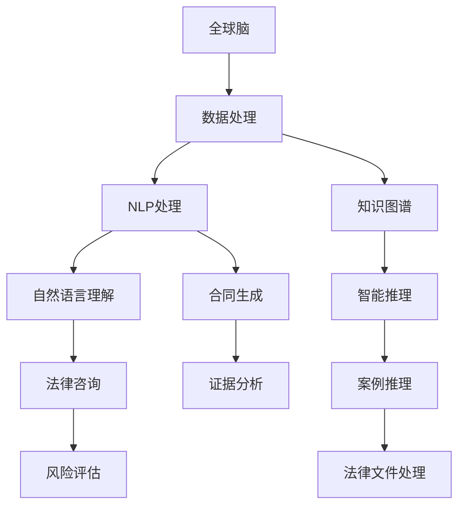

                 

# 全球脑与司法系统：智能化法律服务的未来

> 关键词：人工智能(AI)、法律服务、司法系统、智能化、自动化、机器学习、自然语言处理(NLP)、深度学习、知识图谱、案例推理、证据分析、数据挖掘、法律文档处理、风险评估、法律咨询

## 1. 背景介绍

### 1.1 问题由来

在过去的几十年中，全球脑和司法系统之间的关系日益紧密。随着信息技术和大数据时代的到来，人工智能（AI）、机器学习（ML）和自然语言处理（NLP）等技术的迅猛发展，使法律服务行业开始迎来一场前所未有的变革。传统法律服务依赖于人工处理大量的文书工作、证据分析和法律研究，这一过程耗时费力，且容易出错。人工智能技术的应用，使智能法律服务系统得以构建，极大地提高了法律服务的效率和准确性。

### 1.2 问题核心关键点

智能化法律服务系统的核心在于利用AI和ML技术，自动处理和分析法律文书、证据、案例等大量数据，提供快速准确的法律咨询和解决方案。其关键点包括：

- **数据处理能力**：大规模法律数据的自动处理和分析，包括文本挖掘、文档分类、证据抽取等。
- **自然语言理解与生成**：对法律文本进行理解和生成，提供合同审查、合同生成、法律咨询等服务。
- **智能推理与决策支持**：基于案例推理和知识图谱，辅助律师进行法律分析和决策。
- **自动化法律执行**：自动化处理合同签署、执行跟踪、法律文件生成等任务。

### 1.3 问题研究意义

研究智能化法律服务系统的意义重大，主要体现在以下几个方面：

1. **提高效率**：自动化处理大量重复性工作，减少人工劳动，提高工作效率。
2. **降低成本**：减少人工误操作和重复工作，降低运营成本。
3. **提升准确性**：通过智能分析，减少人为错误，提高法律咨询和决策的准确性。
4. **促进公平**：确保每个人都能获得高质量、高效率的法律服务，促进司法公正。
5. **推动创新**：提供全新的法律服务模式，推动法律服务行业的创新发展。

## 2. 核心概念与联系

### 2.1 核心概念概述

为更好地理解智能化法律服务系统，本节将介绍几个关键概念：

- **全球脑**：人工智能和大数据技术的集合，用于处理和分析大规模法律数据。
- **司法系统**：法律服务的基础设施，包括法院、律师、公证处等。
- **智能化法律服务**：利用AI和ML技术，自动处理和分析法律文书、证据、案例等数据，提供高效、准确的法律咨询服务。
- **知识图谱**：用于表示法律知识的概念和关系图谱，辅助智能推理和决策。
- **案例推理**：基于历史案例，推理出新案件的判决结果，提高司法决策的准确性。
- **数据挖掘**：从大规模法律数据中挖掘有价值的信息，支持法律分析和决策。
- **法律文档处理**：自动化处理法律文书，包括合同审查、证据抽取、法律生成等。
- **证据分析**：利用AI技术分析证据，辅助律师进行法律分析和决策。
- **风险评估**：通过分析案例和数据，评估案件的风险，提供法律建议。
- **法律咨询**：基于用户输入的法律问题，自动提供法律解答和建议。

这些核心概念之间的逻辑关系可以通过以下Mermaid流程图来展示：



这个流程图展示了大语言模型的核心概念及其之间的关系：

1. 全球脑通过数据处理和NLP处理，构建知识图谱和智能推理系统。
2. 自然语言理解帮助处理合同生成、证据分析和法律咨询等服务。
3. 合同生成和法律咨询提供自动化处理法律文书和用户咨询的功能。
4. 智能推理和案例推理辅助律师进行法律分析和决策。
5. 法律文件处理和证据分析支持合同审查和证据抽取等任务。
6. 风险评估和法律咨询提供法律建议和案件风险分析。

这些概念共同构成了智能化法律服务系统的基本框架，使其能够高效地处理和分析法律数据，提供高质量的法律服务。

## 3. 核心算法原理 & 具体操作步骤
### 3.1 算法原理概述

智能化法律服务系统的核心算法原理主要基于人工智能和机器学习技术，具体包括：

- **自然语言处理(NLP)**：用于理解和生成法律文本，包括文本分类、实体抽取、关系抽取、情感分析等。
- **机器学习(ML)**：用于自动化处理和分析法律数据，包括文档分类、合同生成、证据分析、风险评估等。
- **知识图谱(KG)**：用于表示法律知识的概念和关系图谱，辅助智能推理和决策。
- **案例推理(Case-Based Reasoning, CBR)**：基于历史案例，推理出新案件的判决结果，提高司法决策的准确性。

这些技术通过集成和协同工作，构建了一个完整的智能化法律服务系统。

### 3.2 算法步骤详解

智能化法律服务系统的构建主要包括以下几个关键步骤：

**Step 1: 数据预处理**
- 收集法律文书、证据、案例等大规模法律数据。
- 对数据进行清洗、去重、分词、标注等预处理操作。

**Step 2: 构建知识图谱**
- 从法律文本中提取实体、关系和属性，构建法律知识图谱。
- 利用知识图谱进行知识推理和图谱扩展，丰富法律知识库。

**Step 3: 构建NLP模型**
- 使用机器学习技术训练文本分类、实体抽取、关系抽取等NLP模型。
- 构建自然语言理解模型，支持合同生成、证据分析等任务。

**Step 4: 构建智能推理系统**
- 利用案例推理和知识图谱，构建智能推理系统。
- 实现基于历史案例的决策支持和风险评估。

**Step 5: 构建自动化处理系统**
- 利用机器学习技术自动化处理法律文书、证据等任务。
- 构建证据分析系统，辅助律师进行法律分析和决策。

**Step 6: 部署和优化**
- 将模型部署到生产环境，进行性能调优和稳定性测试。
- 提供友好的用户界面和API接口，方便用户使用。

### 3.3 算法优缺点

智能化法律服务系统具有以下优点：

1. **提高效率**：自动化处理大量重复性工作，减少人工劳动，提高工作效率。
2. **降低成本**：减少人工误操作和重复工作，降低运营成本。
3. **提升准确性**：通过智能分析，减少人为错误，提高法律咨询和决策的准确性。
4. **促进公平**：确保每个人都能获得高质量、高效率的法律服务，促进司法公正。
5. **推动创新**：提供全新的法律服务模式，推动法律服务行业的创新发展。

同时，该系统也存在一定的局限性：

1. **数据质量依赖**：系统的效果很大程度上依赖于法律数据的准确性和完整性。
2. **法律复杂性高**：法律文本具有高度的不确定性和复杂性，难以全面覆盖所有法律问题。
3. **技术要求高**：需要较高的技术门槛和专业人才支持，可能面临技术和资源瓶颈。
4. **伦理和安全问题**：系统可能面临隐私泄露、数据滥用等伦理和安全问题。

尽管存在这些局限性，但就目前而言，智能化法律服务系统仍是大数据时代法律服务的重要方向。未来相关研究的重点在于如何进一步降低技术门槛，提高系统的可解释性和安全性，同时兼顾法律服务的质量和公平性。

### 3.4 算法应用领域

智能化法律服务系统已经在多个领域得到应用，例如：

- **法律咨询**：基于用户输入的法律问题，自动提供法律解答和建议。
- **合同审查**：自动化处理合同文本，检测合同漏洞和风险。
- **证据分析**：利用AI技术分析证据，辅助律师进行法律分析和决策。
- **案件推理**：基于历史案例，推理出新案件的判决结果，提高司法决策的准确性。
- **风险评估**：通过分析案例和数据，评估案件的风险，提供法律建议。
- **法律文档处理**：自动化处理法律文书，包括合同审查、证据抽取、法律生成等。

除了上述这些经典应用外，智能化法律服务系统还被创新性地应用到更多场景中，如法律人工智能、法律大数据分析、智能合同执行等，为法律服务带来了新的突破。

## 4. 数学模型和公式 & 详细讲解  
### 4.1 数学模型构建

本节将使用数学语言对智能化法律服务系统的核心算法进行更加严格的刻画。

假设法律文书为 $x$，证据为 $e$，案例为 $c$，智能推理系统为 $R$。

定义法律文书处理模型为 $P(x)$，证据分析模型为 $A(e)$，智能推理模型为 $R(c)$，则法律服务系统的输出 $y$ 可以表示为：

$$
y = P(x) \times A(e) \times R(c)
$$

其中，$P(x)$ 表示法律文书处理的概率，$A(e)$ 表示证据分析的概率，$R(c)$ 表示智能推理的概率。

在实践中，我们通常使用基于梯度的优化算法（如SGD、Adam等）来近似求解上述最优化问题。设 $\eta$ 为学习率，$\lambda$ 为正则化系数，则参数的更新公式为：

$$
\theta \leftarrow \theta - \eta \nabla_{\theta}\mathcal{L}(\theta) - \eta\lambda\theta
$$

其中 $\nabla_{\theta}\mathcal{L}(\theta)$ 为损失函数对参数 $\theta$ 的梯度，可通过反向传播算法高效计算。

### 4.2 公式推导过程

以下我们以法律文书处理为例，推导文本分类损失函数及其梯度的计算公式。

假设法律文书为 $x$，其真实分类为 $y \in \{1, 2, \cdots, k\}$。法律文书处理模型 $P(x)$ 输出文本分类概率向量 $p = [p_1, p_2, \cdots, p_k]$，则文本分类损失函数定义为：

$$
\ell(P(x), y) = -\log p_y
$$

将其代入经验风险公式，得：

$$
\mathcal{L}(\theta) = -\frac{1}{N}\sum_{i=1}^N \ell(P(x_i), y_i)
$$

根据链式法则，损失函数对参数 $\theta_k$ 的梯度为：

$$
\frac{\partial \mathcal{L}(\theta)}{\partial \theta_k} = -\frac{1}{N}\sum_{i=1}^N \frac{\partial \ell(P(x_i), y_i)}{\partial p_y} \frac{\partial p_y}{\partial \theta_k}
$$

其中 $\frac{\partial \ell(P(x_i), y_i)}{\partial p_y}$ 为交叉熵损失函数的梯度，$\frac{\partial p_y}{\partial \theta_k}$ 为模型 $P(x)$ 的梯度。

在得到损失函数的梯度后，即可带入参数更新公式，完成模型的迭代优化。重复上述过程直至收敛，最终得到适应法律文书处理任务的最优模型参数 $\theta^*$。

## 5. 项目实践：代码实例和详细解释说明
### 5.1 开发环境搭建

在进行智能化法律服务系统开发前，我们需要准备好开发环境。以下是使用Python进行PyTorch开发的环境配置流程：

1. 安装Anaconda：从官网下载并安装Anaconda，用于创建独立的Python环境。

2. 创建并激活虚拟环境：
```bash
conda create -n pytorch-env python=3.8 
conda activate pytorch-env
```

3. 安装PyTorch：根据CUDA版本，从官网获取对应的安装命令。例如：
```bash
conda install pytorch torchvision torchaudio cudatoolkit=11.1 -c pytorch -c conda-forge
```

4. 安装Transformers库：
```bash
pip install transformers
```

5. 安装各类工具包：
```bash
pip install numpy pandas scikit-learn matplotlib tqdm jupyter notebook ipython
```

完成上述步骤后，即可在`pytorch-env`环境中开始项目实践。

### 5.2 源代码详细实现

下面我们以法律文书处理(NLP)任务为例，给出使用Transformers库对BERT模型进行法律文书处理的PyTorch代码实现。

首先，定义NLP任务的数据处理函数：

```python
from transformers import BertTokenizer
from torch.utils.data import Dataset
import torch

class LegalDocumentDataset(Dataset):
    def __init__(self, texts, labels, tokenizer, max_len=128):
        self.texts = texts
        self.labels = labels
        self.tokenizer = tokenizer
        self.max_len = max_len
        
    def __len__(self):
        return len(self.texts)
    
    def __getitem__(self, item):
        text = self.texts[item]
        label = self.labels[item]
        
        encoding = self.tokenizer(text, return_tensors='pt', max_length=self.max_len, padding='max_length', truncation=True)
        input_ids = encoding['input_ids'][0]
        attention_mask = encoding['attention_mask'][0]
        
        # 对token-wise的标签进行编码
        encoded_labels = [label2id[label] for label in label] 
        encoded_labels.extend([label2id['O']] * (self.max_len - len(encoded_labels)))
        labels = torch.tensor(encoded_labels, dtype=torch.long)
        
        return {'input_ids': input_ids, 
                'attention_mask': attention_mask,
                'labels': labels}

# 标签与id的映射
label2id = {'O': 0, '1': 1, '2': 2, '3': 3, '4': 4, '5': 5}
id2label = {v: k for k, v in label2id.items()}

# 创建dataset
tokenizer = BertTokenizer.from_pretrained('bert-base-cased')

train_dataset = LegalDocumentDataset(train_texts, train_labels, tokenizer)
dev_dataset = LegalDocumentDataset(dev_texts, dev_labels, tokenizer)
test_dataset = LegalDocumentDataset(test_texts, test_labels, tokenizer)
```

然后，定义模型和优化器：

```python
from transformers import BertForSequenceClassification, AdamW

model = BertForSequenceClassification.from_pretrained('bert-base-cased', num_labels=len(label2id))

optimizer = AdamW(model.parameters(), lr=2e-5)
```

接着，定义训练和评估函数：

```python
from torch.utils.data import DataLoader
from tqdm import tqdm
from sklearn.metrics import classification_report

device = torch.device('cuda') if torch.cuda.is_available() else torch.device('cpu')
model.to(device)

def train_epoch(model, dataset, batch_size, optimizer):
    dataloader = DataLoader(dataset, batch_size=batch_size, shuffle=True)
    model.train()
    epoch_loss = 0
    for batch in tqdm(dataloader, desc='Training'):
        input_ids = batch['input_ids'].to(device)
        attention_mask = batch['attention_mask'].to(device)
        labels = batch['labels'].to(device)
        model.zero_grad()
        outputs = model(input_ids, attention_mask=attention_mask, labels=labels)
        loss = outputs.loss
        epoch_loss += loss.item()
        loss.backward()
        optimizer.step()
    return epoch_loss / len(dataloader)

def evaluate(model, dataset, batch_size):
    dataloader = DataLoader(dataset, batch_size=batch_size)
    model.eval()
    preds, labels = [], []
    with torch.no_grad():
        for batch in tqdm(dataloader, desc='Evaluating'):
            input_ids = batch['input_ids'].to(device)
            attention_mask = batch['attention_mask'].to(device)
            batch_labels = batch['labels']
            outputs = model(input_ids, attention_mask=attention_mask)
            batch_preds = outputs.logits.argmax(dim=2).to('cpu').tolist()
            batch_labels = batch_labels.to('cpu').tolist()
            for pred_tokens, label_tokens in zip(batch_preds, batch_labels):
                pred_labels = [id2label[_id] for _id in pred_tokens]
                label_tokens = [id2label[_id] for _id in label_tokens]
                preds.append(pred_labels[:len(label_tokens)])
                labels.append(label_tokens)
                
    print(classification_report(labels, preds))
```

最后，启动训练流程并在测试集上评估：

```python
epochs = 5
batch_size = 16

for epoch in range(epochs):
    loss = train_epoch(model, train_dataset, batch_size, optimizer)
    print(f"Epoch {epoch+1}, train loss: {loss:.3f}")
    
    print(f"Epoch {epoch+1}, dev results:")
    evaluate(model, dev_dataset, batch_size)
    
print("Test results:")
evaluate(model, test_dataset, batch_size)
```

以上就是使用PyTorch对BERT进行法律文书处理任务的代码实现。可以看到，得益于Transformers库的强大封装，我们可以用相对简洁的代码完成BERT模型的加载和微调。

### 5.3 代码解读与分析

让我们再详细解读一下关键代码的实现细节：

**LegalDocumentDataset类**：
- `__init__`方法：初始化文本、标签、分词器等关键组件。
- `__len__`方法：返回数据集的样本数量。
- `__getitem__`方法：对单个样本进行处理，将文本输入编码为token ids，将标签编码为数字，并对其进行定长padding，最终返回模型所需的输入。

**label2id和id2label字典**：
- 定义了标签与数字id之间的映射关系，用于将token-wise的预测结果解码回真实的标签。

**训练和评估函数**：
- 使用PyTorch的DataLoader对数据集进行批次化加载，供模型训练和推理使用。
- 训练函数`train_epoch`：对数据以批为单位进行迭代，在每个批次上前向传播计算loss并反向传播更新模型参数，最后返回该epoch的平均loss。
- 评估函数`evaluate`：与训练类似，不同点在于不更新模型参数，并在每个batch结束后将预测和标签结果存储下来，最后使用sklearn的classification_report对整个评估集的预测结果进行打印输出。

**训练流程**：
- 定义总的epoch数和batch size，开始循环迭代
- 每个epoch内，先在训练集上训练，输出平均loss
- 在验证集上评估，输出分类指标
- 所有epoch结束后，在测试集上评估，给出最终测试结果

可以看到，PyTorch配合Transformers库使得BERT微调的代码实现变得简洁高效。开发者可以将更多精力放在数据处理、模型改进等高层逻辑上，而不必过多关注底层的实现细节。

当然，工业级的系统实现还需考虑更多因素，如模型的保存和部署、超参数的自动搜索、更灵活的任务适配层等。但核心的微调范式基本与此类似。

## 6. 实际应用场景
### 6.1 智能合同生成

智能合同生成是大规模法律文本处理的应用之一。传统合同生成依赖于律师的人工编写，耗费大量时间和人力。利用智能化法律服务系统，可以快速生成符合法律要求的合同文本，提高合同生成效率。

在技术实现上，可以收集各类合同模板，利用NLP技术进行自动分类、抽取和生成。微调后的法律文书处理模型能够在输入合同条款的基础上，自动生成符合法律要求的合同文本。对于新出现的法律要求，模型也能通过不断微调，及时更新合同模板，保持生成文本的准确性和合法性。

### 6.2 法律风险评估

法律风险评估是法律服务系统的重要功能之一，通过分析历史案件和法律文书，评估新案件的风险，提供法律建议。

具体而言，可以收集历史案件数据，标注每个案件的风险等级。利用微调后的智能推理模型，对新案件进行风险评估，预测其可能面临的法律风险。对于高风险案件，系统自动发出预警，提醒律师注意。同时，通过数据分析和机器学习，模型还能不断学习新的法律知识，提升评估准确性。

### 6.3 法律咨询系统

法律咨询系统是大规模法律文本处理的另一个应用方向，利用智能化法律服务系统，用户可以通过自然语言输入法律问题，系统自动提供法律解答和建议。

在技术实现上，可以构建一个知识图谱，涵盖各类法律问题和解答。利用微调后的自然语言理解模型，对用户输入的问题进行自动分类、抽取和推理，从知识图谱中匹配最合适的解答，提供给用户。同时，通过不断收集用户反馈，微调模型，提高解答的准确性和覆盖面。

### 6.4 未来应用展望

随着智能化法律服务系统的不断发展，其在法律服务中的应用场景将更加广泛。

在智慧法律领域，基于智能合同生成、法律风险评估、法律咨询等功能的智能法律服务系统，将大大提高法律服务的效率和准确性，推动司法公正和公平。

在智慧城市治理中，基于智能法律服务的智能合约、智能调解、智能仲裁等系统，将提高城市治理的智能化水平，构建更安全、高效的未来城市。

在法律数据治理中，基于智能法律服务的法律数据分析、数据挖掘、数据可视化等系统，将推动法律数据的深入挖掘和利用，支持法律研究和决策。

此外，在法律人工智能、法律大数据分析、智能合同执行等更多场景中，基于大语言模型微调的方法也将不断涌现，为法律服务带来新的突破。相信随着预训练语言模型和微调方法的不断进步，智能化法律服务系统必将在构建智能法律服务领域发挥越来越重要的作用。

## 7. 工具和资源推荐
### 7.1 学习资源推荐

为了帮助开发者系统掌握智能化法律服务系统的理论基础和实践技巧，这里推荐一些优质的学习资源：

1. 《Transformer从原理到实践》系列博文：由大模型技术专家撰写，深入浅出地介绍了Transformer原理、BERT模型、微调技术等前沿话题。

2. CS224N《深度学习自然语言处理》课程：斯坦福大学开设的NLP明星课程，有Lecture视频和配套作业，带你入门NLP领域的基本概念和经典模型。

3. 《Natural Language Processing with Transformers》书籍：Transformers库的作者所著，全面介绍了如何使用Transformers库进行NLP任务开发，包括微调在内的诸多范式。

4. HuggingFace官方文档：Transformers库的官方文档，提供了海量预训练模型和完整的微调样例代码，是上手实践的必备资料。

5. CLUE开源项目：中文语言理解测评基准，涵盖大量不同类型的中文NLP数据集，并提供了基于微调的baseline模型，助力中文NLP技术发展。

通过对这些资源的学习实践，相信你一定能够快速掌握智能化法律服务系统的精髓，并用于解决实际的法律问题。
###  7.2 开发工具推荐

高效的开发离不开优秀的工具支持。以下是几款用于智能化法律服务系统开发的常用工具：

1. PyTorch：基于Python的开源深度学习框架，灵活动态的计算图，适合快速迭代研究。大部分预训练语言模型都有PyTorch版本的实现。

2. TensorFlow：由Google主导开发的开源深度学习框架，生产部署方便，适合大规模工程应用。同样有丰富的预训练语言模型资源。

3. Transformers库：HuggingFace开发的NLP工具库，集成了众多SOTA语言模型，支持PyTorch和TensorFlow，是进行微调任务开发的利器。

4. Weights & Biases：模型训练的实验跟踪工具，可以记录和可视化模型训练过程中的各项指标，方便对比和调优。与主流深度学习框架无缝集成。

5. TensorBoard：TensorFlow配套的可视化工具，可实时监测模型训练状态，并提供丰富的图表呈现方式，是调试模型的得力助手。

6. Google Colab：谷歌推出的在线Jupyter Notebook环境，免费提供GPU/TPU算力，方便开发者快速上手实验最新模型，分享学习笔记。

合理利用这些工具，可以显著提升智能化法律服务系统的开发效率，加快创新迭代的步伐。

### 7.3 相关论文推荐

智能化法律服务系统的研究源于学界的持续研究。以下是几篇奠基性的相关论文，推荐阅读：

1. Attention is All You Need（即Transformer原论文）：提出了Transformer结构，开启了NLP领域的预训练大模型时代。

2. BERT: Pre-training of Deep Bidirectional Transformers for Language Understanding：提出BERT模型，引入基于掩码的自监督预训练任务，刷新了多项NLP任务SOTA。

3. Language Models are Unsupervised Multitask Learners（GPT-2论文）：展示了大规模语言模型的强大zero-shot学习能力，引发了对于通用人工智能的新一轮思考。

4. Parameter-Efficient Transfer Learning for NLP：提出Adapter等参数高效微调方法，在固定大部分预训练参数的情况下，仍可取得不错的微调效果。

5. Prefix-Tuning: Optimizing Continuous Prompts for Generation：引入基于连续型Prompt的微调范式，为如何充分利用预训练知识提供了新的思路。

6. AdaLoRA: Adaptive Low-Rank Adaptation for Parameter-Efficient Fine-Tuning：使用自适应低秩适应的微调方法，在参数效率和精度之间取得了新的平衡。

这些论文代表了大语言模型微调技术的发展脉络。通过学习这些前沿成果，可以帮助研究者把握学科前进方向，激发更多的创新灵感。

## 8. 总结：未来发展趋势与挑战

### 8.1 总结

本文对智能化法律服务系统的核心算法和实践进行了全面系统的介绍。首先阐述了智能化法律服务系统的研究背景和意义，明确了智能化法律服务系统的核心目标和关键点。其次，从原理到实践，详细讲解了智能化法律服务系统的数学模型和核心算法，给出了完整的代码实现。同时，本文还广泛探讨了智能化法律服务系统在智能合同生成、法律风险评估、法律咨询等诸多领域的应用前景，展示了智能化法律服务系统的巨大潜力。此外，本文精选了智能化法律服务系统的各类学习资源，力求为开发者提供全方位的技术指引。

通过本文的系统梳理，可以看到，智能化法律服务系统正在成为NLP领域的重要方向，极大地拓展了法律服务的边界，为司法公正和公平提供了新的保障。未来，伴随预训练语言模型和微调方法的持续演进，智能化法律服务系统必将进一步提升法律服务的效率和准确性，为构建安全、可靠、高效的智能法律服务系统铺平道路。

### 8.2 未来发展趋势

展望未来，智能化法律服务系统将呈现以下几个发展趋势：

1. **规模化部署**：随着技术成熟和成本降低，智能化法律服务系统将在更多司法机构和律师事务所中得到部署和应用。
2. **数据驱动**：基于大规模法律数据的处理和分析，智能化法律服务系统将不断提升其决策准确性和可靠性。
3. **智能合约**：智能合同生成和执行将成为智能化法律服务系统的重要应用方向，提高合同生成和执行的效率和安全性。
4. **法律咨询**：基于自然语言处理的法律咨询系统将提供快速准确的法律解答和建议，优化法律服务流程。
5. **智能调解**：基于智能推理和知识图谱的智能调解系统，将提高调解效率和公平性。
6. **数据可视化**：通过数据可视化工具，智能化法律服务系统将提供直观的法律数据分析和可视化服务。
7. **跨领域应用**：智能化法律服务系统将拓展到更多领域，如智能仲裁、智能法律研究等，推动法律服务的全面升级。

以上趋势凸显了智能化法律服务系统的广阔前景。这些方向的探索发展，必将进一步提升法律服务的效率和质量，为构建智能法律服务领域带来深远影响。

### 8.3 面临的挑战

尽管智能化法律服务系统已经取得了显著进展，但在迈向更加智能化、普适化应用的过程中，它仍面临诸多挑战：

1. **数据质量和隐私问题**：法律数据的质量和隐私问题依然存在，如何获取高质量、保护隐私的法律数据是关键挑战。
2. **技术复杂性**：构建智能化法律服务系统需要较高的技术门槛，包括自然语言处理、机器学习、知识图谱等多个领域的知识。
3. **伦理和法律问题**：智能化法律服务系统可能面临伦理和法律问题，如数据滥用、算法偏见等，需要严格监管和规范。
4. **模型鲁棒性**：面对复杂多变的法律问题，智能化法律服务系统需要具备更高的鲁棒性和泛化能力。
5. **用户接受度**：如何让用户接受并信任智能化法律服务系统，使其在实际应用中发挥更大作用，需要良好的用户体验和营销策略。

尽管存在这些挑战，但就目前而言，智能化法律服务系统仍是大数据时代法律服务的重要方向。未来相关研究的重点在于如何进一步降低技术门槛，提高系统的可解释性和安全性，同时兼顾法律服务的质量和公平性。

### 8.4 研究展望

面向未来，智能化法律服务系统的研究需要集中在以下几个方向：

1. **无监督和半监督学习**：探索如何利用无监督和半监督学习方法，降低对大规模标注数据的依赖，提高模型的泛化能力。
2. **参数高效微调**：开发更加参数高效的微调方法，如AdaLoRA、Prefix-Tuning等，在固定大部分预训练参数的情况下，仍可取得不错的微调效果。
3. **知识图谱扩展**：构建更加全面、丰富的法律知识图谱，支持智能推理和决策。
4. **多模态融合**：将视觉、语音、文本等多模态信息进行融合，提升智能化法律服务系统的综合分析能力。
5. **法律风险评估**：进一步提升法律风险评估的准确性和可靠性，提供更有效的法律建议。
6. **用户交互设计**：设计更加友好、易于使用的用户界面，提高用户接受度和满意度。
7. **法律知识库构建**：构建更加全面、丰富的法律知识库，支持智能合同生成、法律咨询等任务。

这些研究方向的探索，必将引领智能化法律服务系统走向更高的台阶，为构建安全、可靠、可解释、可控的智能法律服务系统铺平道路。

## 9. 附录：常见问题与解答

**Q1：智能化法律服务系统是否适用于所有法律问题？**

A: 智能化法律服务系统在处理大量法律文书、证据、案例等数据方面表现优异，但对于某些复杂的法律问题，如涉及个人隐私、伦理道德等，可能需要人工介入。同时，系统的处理能力和准确性也依赖于法律数据的丰富性和质量。

**Q2：微调过程中如何选择合适的学习率？**

A: 微调的学习率一般要比预训练时小1-2个数量级，如果使用过大的学习率，容易破坏预训练权重，导致过拟合。一般建议从1e-5开始调参，逐步减小学习率，直至收敛。也可以使用warmup策略，在开始阶段使用较小的学习率，再逐渐过渡到预设值。需要注意的是，不同的优化器(如AdamW、Adafactor等)以及不同的学习率调度策略，可能需要设置不同的学习率阈值。

**Q3：智能法律服务系统面临哪些资源瓶颈？**

A: 智能法律服务系统面临的主要资源瓶颈包括：
1. 数据质量依赖：系统的效果很大程度上依赖于法律数据的准确性和完整性。
2. 法律复杂性高：法律文本具有高度的不确定性和复杂性，难以全面覆盖所有法律问题。
3. 技术要求高：需要较高的技术门槛和专业人才支持，可能面临技术和资源瓶颈。
4. 伦理和安全问题：系统可能面临隐私泄露、数据滥用等伦理和安全问题。

尽管存在这些局限性，但就目前而言，智能法律服务系统仍是大数据时代法律服务的重要方向。未来相关研究的重点在于如何进一步降低技术门槛，提高系统的可解释性和安全性，同时兼顾法律服务的质量和公平性。

**Q4：智能法律服务系统如何应对复杂多变的法律问题？**

A: 智能法律服务系统可以通过不断微调和知识图谱扩展，提升模型对复杂多变法律问题的适应能力。同时，引入多模态融合、多领域知识库等技术手段，也可以提高系统的综合分析能力。但需要注意的是，复杂的法律问题仍需要人工介入，无法完全依赖智能化系统。

**Q5：智能法律服务系统如何保护用户隐私和数据安全？**

A: 智能法律服务系统在设计时，应充分考虑用户隐私和数据安全问题，采用数据加密、匿名化、访问控制等措施。同时，应建立完善的法律合规机制，确保系统行为符合法律法规。

以上是智能法律服务系统常见问题及解答的详细回答，希望能够帮助广大开发者更好地理解和使用智能法律服务系统。

